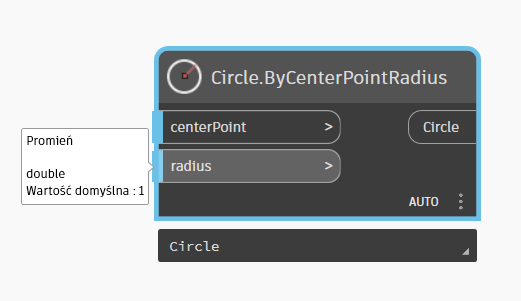
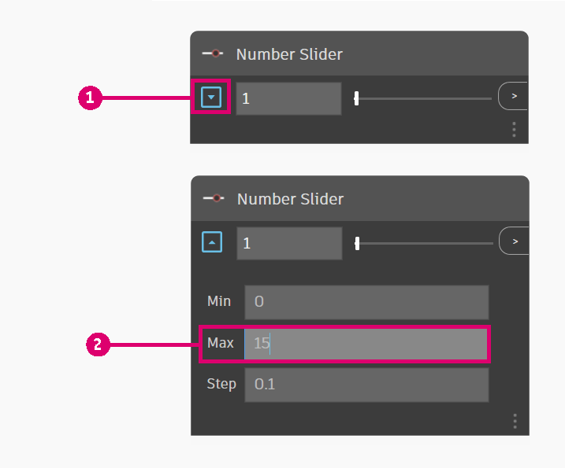
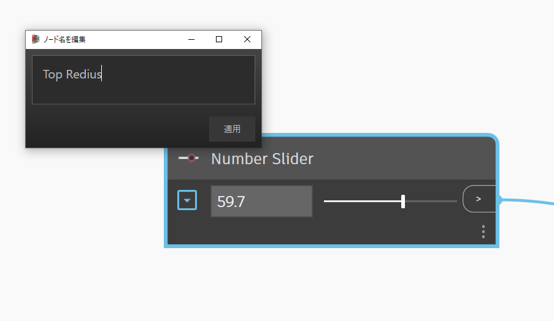
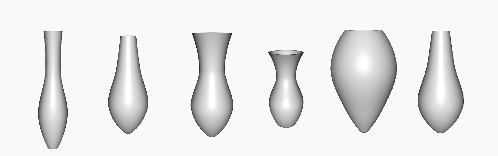

# Jarrón paramétrico

La creación de un jarrón paramétrico es una excelente forma de empezar a aprender a utilizar Dynamo.

En este flujo de trabajo, aprenderá los siguientes procedimientos:

* Utilice los controles deslizantes de número para controlar las variables del diseño.
* Cree y modifique elementos geométricos mediante nodos.
* Visualice los resultados de diseño en tiempo real.

.gif>)

## Definición de objetivos

Antes de acceder directamente a Dynamo, diseñemos conceptualmente el jarrón.

Imaginemos que vamos a diseñar un jarrón de arcilla que tenga en cuenta las prácticas de fabricación usadas por los ceramistas. Estos suelen usar un torno de alfarería para fabricar jarrones cilíndricos. A continuación, al aplicar presión en diversas alturas del jarrón, pueden modificar su forma y crear diseños variados.

Vamos a utilizar una metodología similar para definir nuestro jarrón. Crearemos cuatro círculos a diferentes alturas y con diferentes radios y, a continuación, crearemos una superficie solevando esos círculos.

## Para empezar

> Descargue el archivo de ejemplo. Para ello, haga clic en el vínculo siguiente.
>
> En el Apéndice, se incluye una lista completa de los archivos de ejemplo.



Necesitamos los nodos que representarán la secuencia de acciones que ejecutará Dynamo. Como sabemos que estamos intentando crear un círculo, busquemos primero un nodo que realice esta acción. Utilice el **campo de búsqueda** o examine la **biblioteca** para buscar el nodo **Circle.ByCenterPointRadius**, y añada este al espacio de trabajo.

> 1. Busque > "Circle...".
> 2. Seleccione > "ByCenterPointRadius".
> 3. El nodo aparecerá en el espacio de trabajo.

Examinemos más detalladamente este nodo. A la izquierda, se muestran las entradas del nodo (_centerPoint_ y _radius_) y, a la derecha, la salida del nodo (Circle). Observe que las salidas presentan una línea azul claro. Esto significa que la entrada tiene un valor por defecto. Para obtener más información sobre la entrada, coloque el cursor sobre su nombre. La entrada _radius_ requiere una entrada doble y tiene el valor por defecto 1.

Dejaremos el valor por defecto de _centerPoint_, pero añadiremos un **control deslizante de número** para manejar el radio. Al igual que con el nodo **Circle.ByCenterPointRadius**, utilizaremos la biblioteca para buscar el **control deslizante de número** y lo añadiremos al gráfico.

Este nodo es un algo diferente al anterior, ya que contiene un control deslizante. Puede utilizar la interfaz para cambiar el valor de salida del control deslizante.

.gif>)

El control deslizante se puede configurar mediante el botón desplegable situado a la izquierda del nodo. Vamos a limitar el control deslizante a un valor máximo de 15.

Lo colocaremos a la izquierda del nodo **Circle.ByCenterPointRadius** y conectaremos los dos nodos. Para ello, seleccionaremos la salida del **control deslizante de número** y lo conectaremos a la entrada del radio.

Cambiemos también el nombre del control deslizante de número a "Radio superior". Para ello, haga doble clic en el nombre del nodo.

## Pasos siguientes

Vamos a seguir añadiendo algunos nodos y conexiones a nuestra lógica para definir nuestro jarrón.

### Creación de círculos con radios diferentes

Vamos a copiar estos nodos cuatro veces para que estos círculos definan nuestra superficie; cambie los nombres de los controles deslizantes de número, como se muestra a continuación.

 (1).png>)

> 1. Los círculos se crean mediante un centro y un radio.

### Desplazamiento de círculos a través de la altura del jarrón

Nos falta un parámetro clave para nuestro jarrón, su altura. Para controlar la altura del jarrón, crearemos otro control deslizante de número. También añadiremos el nodo **Code Block**. Los bloques de código permiten añadir fragmentos de código personalizados al flujo de trabajo. Utilizaremos el bloque de código para multiplicar el control deslizante de altura por diferentes factores para que podamos colocar los círculos a lo largo de la altura del jarrón.

.png>)

A continuación, utilizaremos un nodo **Geometry.Translate** para colocar círculos a la altura deseada. Como deseamos distribuir los círculos a través del jarrón, usaremos bloques de código para multiplicar el parámetro de altura por un factor.

> 2\. Los círculos se trasladan (desplazan) mediante una variable en el eje Z.

### Creación de la superficie

Para crear una superficie mediante el nodo **Surface.ByLoft**, debemos combinar todos los círculos trasladados en una lista. Utilizaremos **List.Create** para combinar todos los círculos en una única lista y, por último, estableceremos la salida de esta lista en el nodo **Surface.ByLoft** para ver los resultados.

Desactivaremos también la vista preliminar en otros nodos para visualizar únicamente Surface.ByLoft.

 (1).png>)

> 3\. Una superficie se crea solevando los círculos trasladados.

## Resultados

Ya está listo nuestro flujo de trabajo. Ahora podemos utilizar los **controles deslizantes de número** que hemos definido en la secuencia de comandos para crear diferentes diseños de jarrones.

.gif>)

