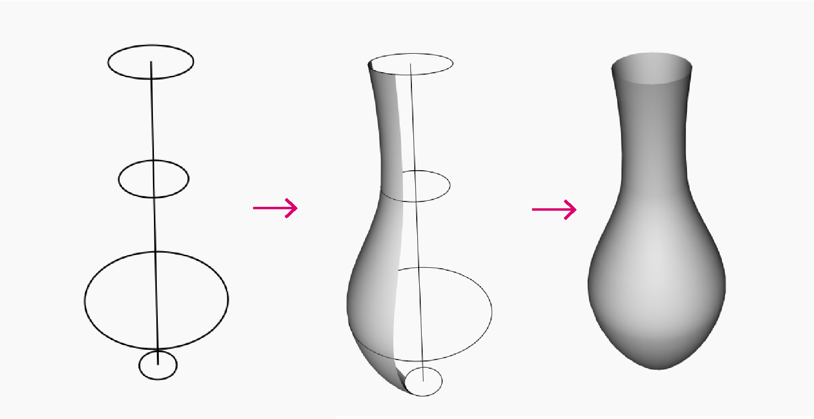
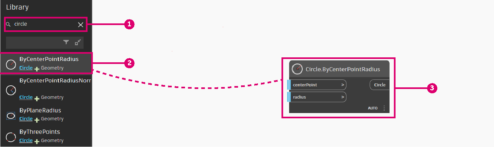
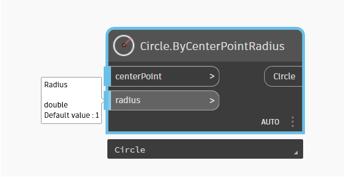
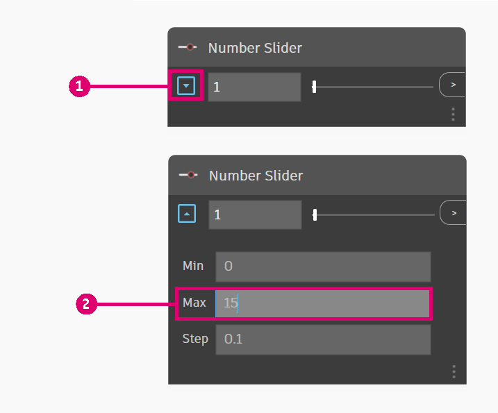
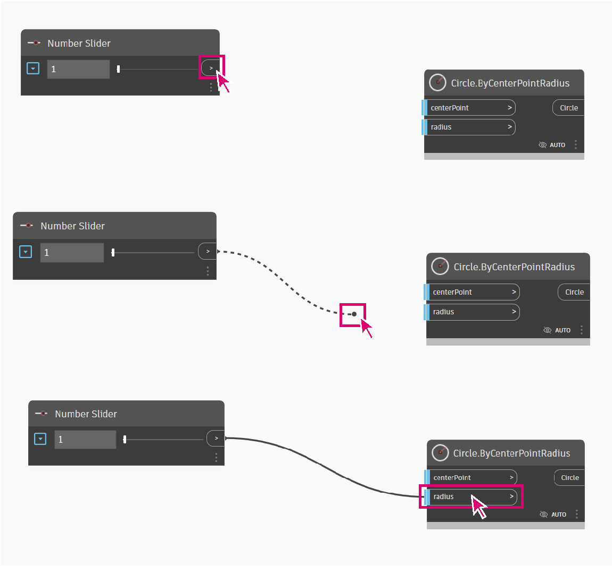
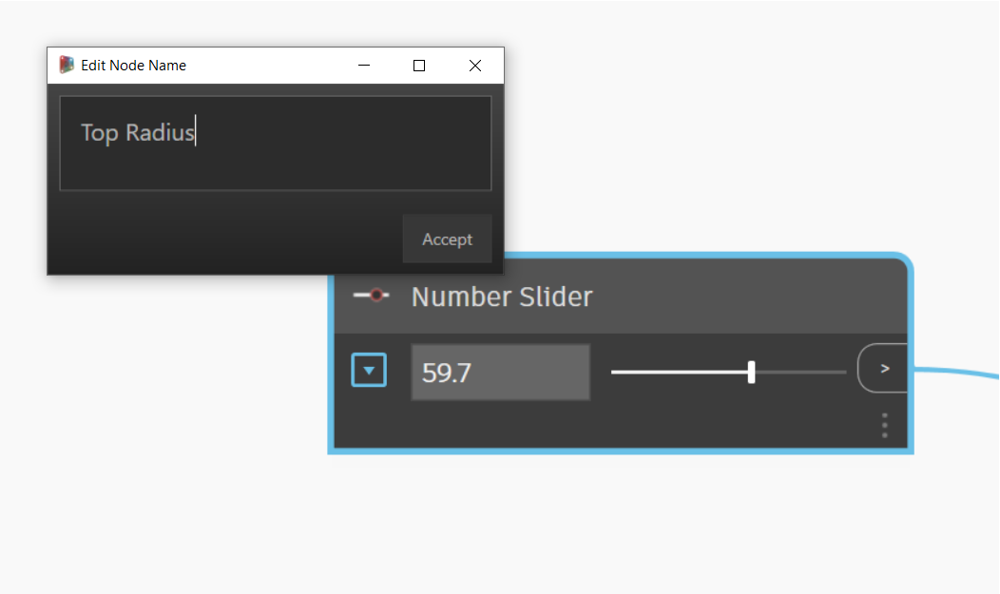
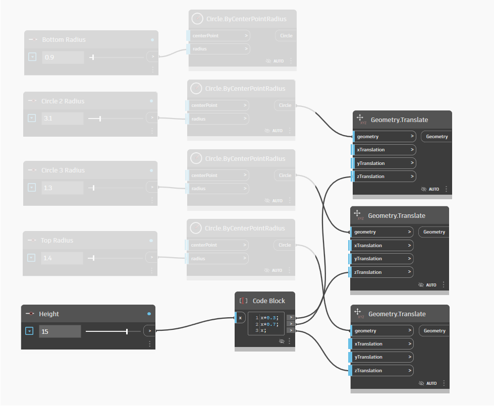
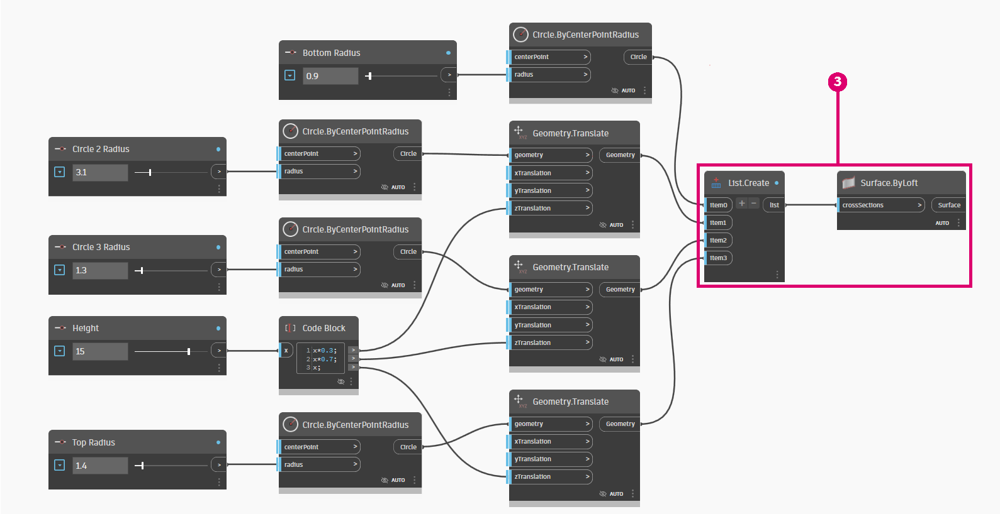
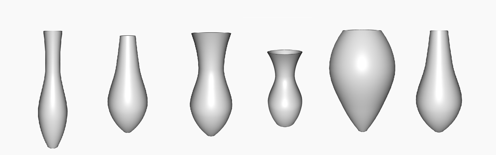

# Параметрическая ваза

Создание параметрической вазы — это отличный способ начать изучение Dynamo.

В ходе данного рабочего процесса вы получите следующие навыки:

* применение регуляторов чисел для управления переменными в проекте;
* создание и изменение геометрических элементов с помощью узлов;
* визуализация результатов проектирования в реальном времени.

## Определение целей

Прежде чем приступить к работе в Dynamo, следует создать концепцию будущей вазы.

Предположим, что необходимо спроектировать глиняную вазу с учетом гончарных методов производства. Обычно для изготовления цилиндрических ваз используется гончарное колесо. Оказывая давление на те или иные участки вазы, гончар меняет ее форму, придает ей различные очертания.

Для определения формы вазы в этом упражнении используется аналогичная методика. Создаются 4 окружности разного радиуса на разной высоте, а затем вдоль этих окружностей создаются поверхности-сечения.

## Начало работы

> Скачайте файл с примером, щелкнув ссылку ниже.
>
> Полный список файлов примеров можно найти в приложении.



Необходимо выбрать узлы в качестве последовательности действий, выполняемых приложением Dynamo. Поскольку требуется создать окружность, начните с поиска узла, позволяющего сделать это. Используйте поле **Поиск** или перейдите в **библиотеку**, найдите узел **Circle.ByCenterPointRadius** и добавьте его в рабочее пространство.

> 1. В поле поиска введите «Окружность».
> 2. Выберите ByCenterPointRadius.
> 3. Узел отобразится в рабочем пространстве.

Рассмотрим подробнее данный узел. С левой стороны расположены входные данные узла (_centerPoint_ и _radius_), а с правой — выходные данные узла (Circle). Обратите внимание на линии голубого цвета в полях входных данных. Это означает, что используются значения по умолчанию. Для получения дополнительных сведений о входных данных наведите указатель на название того или иного параметра. Для параметра _radius_ требуется значение с типом double, а значение по умолчанию равно 1.

Оставьте значение по умолчанию для параметра _centerPoint_ и добавьте регулятор **Number Slider** для управления радиусом. Подобно узлу **Circle.ByCenterPointRadius** используйте библиотеку для поиска элемента **Number Slider** и его добавления в график.

Данный узел отличается от предыдущего наличием регулятора. Используйте интерфейс для изменения выходного значения регулятора.

\.gif>)

Регулятор можно настроить с помощью кнопки раскрывающегося списка в левой части узла. Укажите 15 в качестве максимального значения регулятора.

Разместите его слева от узла **Circle.ByCenterPointRadius** и объедините узлы. Для этого выберите выходной параметр **Number Slider** и соедините его с входным параметром Radius.

Дважды щелкните имя узла и измените Number Slider на Top Radius.

## Дальнейшие действия

Продолжите добавлять узлы и соединения для определения логики создания вазы.

### Создание окружностей с разными радиусами

Скопируйте эти узлы 4 раза, чтобы создать соответствующие окружности для поверхности, и измените имена Number Slider, как показано на изображении ниже.

\.png>)

> 1. Для создания окружности требуются центральная точка и радиус.

### Перемещение окружностей по высоте вазы

Сейчас отсутствует ключевой параметр создания вазы — ее высота. Для управления высотой вазы создайте еще один регулятор чисел. Кроме того, добавьте узел **Code Block**. Такие блоки кода позволяют добавлять персонализированные фрагменты кода в рабочий процесс. Используйте узел Code Block для умножения регулятора высоты на различные коэффициенты, чтобы расположить окружности по высоте вазы.

\.png>)

С помощью узла **Geometry.Translate** разместите окружности на требуемой высоте. Поскольку окружности необходимо распределить по высоте вазы, используйте узлы Code Block для умножения параметра высоты на коэффициент.

> 2\. С помощью переменной окружности преобразуются (перемещаются) по оси Z.

### Создание поверхности

Чтобы создать поверхность с помощью узла **Surface.ByLoft**, необходимо объединить все преобразованные окружности в список. С помощью узла **List.Create** можно объединить все окружности в один список, а затем вывести данный список в узел **Surface.ByLoft** для просмотра результатов.

Отключите предварительный просмотр в других узлах, чтобы отображался только узел Surface.ByLoft.

> 3\. Поверхность создается путем лофтинга преобразованных окружностей.

## Результат

Рабочий процесс готов! Теперь **регуляторы чисел**, определенные в сценарии, можно использовать для создания различных проектов ваз.

