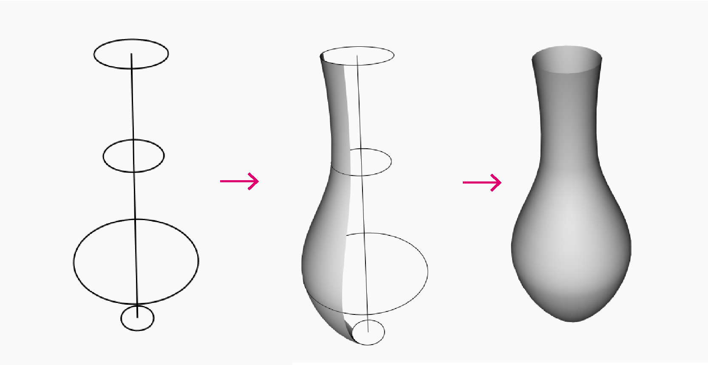
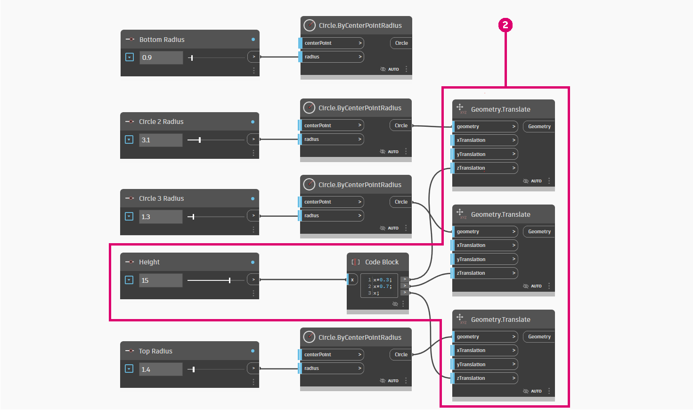

# Parametrická váza

Vytvoření parametrické vázy je skvělý způsob, jak se začít seznamovat s aplikací Dynamo.

Tento pracovní postup vás naučí, jak:

* Řídit proměnné v návrhu pomocí posuvníků čísel.
* Vytvářet a upravovat geometrické prvky pomocí uzlů.
* Vizualizovat výsledky návrhu v reálném čase.

## Definování cílů

Než začneme pracovat v aplikaci Dynamo, navrhněme koncepčně naši vázu.

Řekněme, že chceme navrhnout hliněnou vázu, která zohledňuje postupy používané při výrobě keramiky. Keramici obvykle pomocí hrnčířského kruhu vyrobí válcovou vázu. Tlakem na vázu v různé výšce pak mohou měnit její tvar a vytvářet různé vzory.

Podobnou metodiku použijeme k definování naší vázy. Vytvoříme 4 kružnice o různých poloměrech v různých výškách a poté vytvoříme povrch šablonováním těchto kružnic.

## Začínáme

> Kliknutím na odkaz níže si stáhněte vzorový soubor.
>
> Úplný seznam vzorových souborů najdete v dodatku.



Potřebujeme uzly, které představují posloupnost akcí, které budou aplikací Dynamo provedeny. Protože víme, že se pokoušíme vytvořit kružnici, začneme vyhledáním uzlu, který to dělá. Pomocí **vyhledávacího pole** nebo procházením **knihovny** vyhledejte uzel **Circle.ByCenterPointRadius** a přidejte jej do pracovního prostoru.

> 1. Vyhledejte > Circle.
> 2. Vyberte > ByCenterPointRadius.
> 3. V pracovním prostoru se zobrazí uzel.

Podívejme se na tento uzel blíže. Na levé straně jsou vstupy uzlu (_centerPoint_ a _radius_) a na pravé straně je výstup uzlu (circle). Všimněte si, že vstupy jsou označeny světle modrou čárou. To znamená, že vstup má výchozí hodnotu. Chcete-li získat další informace o vstupu, přesuňte ukazatel myši nad jeho název. Vstup _radius_ vyžaduje dvojitý vstup a jeho výchozí hodnota je 1.

Ponecháme výchozí hodnotu _centerPoint_, ale přidáme uzel **Number Slider**, který nám umožní nastavit poloměr. Stejně jako u uzlu **Circle.ByCenterPointRadius** použijte knihovnu k vyhledání uzlu **Number Slider** a přidejte jej do grafu.

Tento uzel se trochu liší od předchozího uzlu, protože obsahuje posuvník. Pomocí rozhraní můžete změnit výstupní hodnotu posuvníku.

.gif)

Posuvník lze konfigurovat pomocí rozevíracího tlačítka v levé části uzlu. Omezme posuvník na maximální hodnotu 15.

Nyní posuvník umístíme nalevo od uzlu **Circle.ByCenterPointRadius** a propojíme oba uzly výběrem výstupu **Number Slider** a jeho připojením ke vstupu Radius.

Dále změňte název posuvníku čísla: dvakrát klikněte na název uzlu a zadejte Top Radius (Horní poloměr).

## Další postup

Pokračujte v přidávání uzlů a jejich připojením k naší logice, abychom definovali vázu.

### Vytváření kružnic s různými poloměry

Zkopírujte tyto uzly čtyřikrát, aby kružnice definovaly povrch, a změňte názvy posuvníku čísel, jak je znázorněno níže.

\.png>)

> 1. Kružnice jsou vytvořeny pomocí středu a poloměru.

### Přesun kružnic do různých výšek vázy

Chybí nám klíčový parametr naší vázy: její výška. Abychom mohli ovládat výšku vázy, vytvoříme další posuvník čísel. Přidáme také uzel **Code Block**. Bloky kódu umožňují do pracovního postupu přidat vlastní fragmenty kódu. Pomocí bloku kódu vynásobíme posuvník výšky různými koeficienty, abychom mohli umístit kružnice podél výšky vázy.

.png)

Poté pomocí uzlu **Geometry.Translate** umístíme kružnice do požadované výšky. Protože chceme kružnice distribuovat podél výšky vázy, použijeme bloky kódu k vynásobení parametru výšky koeficientem.

> 2\. Kružnice jsou převedeny (posunuty) pomocí proměnné v ose Z.

### Vytvoření povrchu

Abychom vytvořili povrch pomocí uzlu **Surface.ByLoft**, je nutné spojit všechny převedené kružnice do seznamu. Pomocí uzlu **List.Create** spojíme všechny kružnice do jednoho seznamu a nakonec tento seznam odešleme do uzlu **Surface.ByLoft**, aby se zobrazily výsledky.

Vypněte také náhled v ostatních uzlech, aby se zobrazilo pouze zobrazení uzlu Surface.ByLoft.

\.png>)

> 3\. Povrch je vytvořen šablonováním převedených kružnic.

## Výsledky

Náš pracovní postup je připraven! Nyní můžete pomocí **posuvníků čísel** definovaných ve skriptu vytvářet různé návrhy váz.

