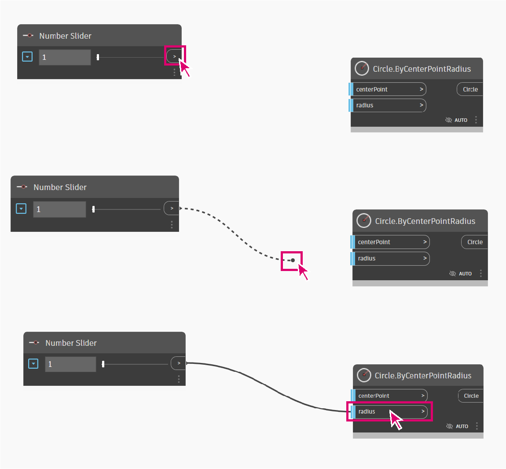

# 參數式花瓶

建立參數式花瓶是一個開始學習 Dynamo 的絕佳方式。

此工作流程將教您如何：

* 使用數字滑棒控制設計中的變數。
* 使用節點建立和修改幾何元素。
* 即時視覺化設計結果。

## 定義我們的目標

在使用 Dynamo 之前，我們先從概念上設計花瓶。

假設我們現在要設計一個黏土花瓶，就要考慮陶藝家所使用的作法。陶藝家通常使用拉坯機來製作圓柱形花瓶。然後藉由對花瓶的不同高度施加壓力，就可以改變花瓶的造型，創作出各種設計。

我們使用類似的方法定義花瓶。我們將在不同的高度和半徑建立 4 個圓，然後透過斷面混成這些圓來建立曲面。

## 開始使用

> 按一下下方的連結下載範例檔案。
>
> 附錄中提供完整的範例檔案清單。



我們需要一些節點來展示 Dynamo 將執行的動作序列。我們知道要嘗試建立圓形，所以先找出執行該作業的節點。使用 **搜尋欄位** 或瀏覽 **Library** 以尋找 **Circle.ByCenterPointRadius** 節點，並將其加入工作區

> 1. 搜尋 >「Circle...」
> 2. 選取 >「ByCenterPointRadius」
> 3. 節點將顯示在工作區中

我們來詳細瞭解這個節點。在左側，您有節點的輸入 ( _centerPoint_ 和 _radius_ )，在右側，您有節點的輸出 (Circle)。請注意，輸出有一條淺藍線。這表示輸入有預設值。若要取得有關輸入的更多資訊，請將游標懸停在輸入名稱上。_radius_ 輸入需要一個 double (雙精確度) 輸入，且預設值為 1。

我們將保留 _centerPoint_ 的預設值，但加入一個 **數字滑棒** 控制半徑。與使用 **Circle.ByCenterPointRadius** 節點時一樣，使用資源庫搜尋 **Number Slider**，並將其加入圖表。

此節點與我們先前的節點稍有不同，因為它包含滑棒。您可以使用介面變更滑棒的輸出值。

.gif)

您可以使用節點左側的下拉式按鈕規劃滑棒。我們將滑棒限制最大值為 15。

我們將其放在 **Circle.ByCenterPointRadius** 節點的左側，選取 **Number Slider** 的輸出並連接到 Radius 輸入，以連接兩個節點。

我們按兩下節點的名稱，將「Number Slider」名稱變更為「Top Radius」。

## 後續步驟

我們繼續在邏輯中增加一些節點和連接以定義花瓶。

### 建立不同半徑的圓

我們複製這些節點 4 次，讓這些圓定義曲面，變更 Number Slider 的名稱，如下圖所示。

.png>)

> 1. 圓是由一個中心點和一個半徑產生

### 在花瓶各高度間移動圓

我們缺少花瓶的關鍵參數，也就是花瓶的高度。為了控制花瓶的高度，我們要建立另一個數字滑棒。我們也加入一個 **Code Block** 節點。程式碼區塊可協助將個人化的程式碼片段加入我們的工作流程。我們將使用程式碼區塊讓高度滑棒乘以不同係數，以便我們可以沿花瓶高度放置圓。

.png)

然後，我們使用 **Geometry.Translate** 節點，將圓放在所需的高度。由於我們要將圓分佈到花瓶中，因此我們使用程式碼區塊將高度參數乘以一個係數。

> 2\.圓在 Z 軸中會依變數平移 (移動)。

### 建立曲面

為了使用 **Surface.ByLoft** 節點建立曲面，我們需要將所有平移的圓合併為一個清單。我們使用 **List.Create** 將所有圓合併為一個清單，最後將此清單輸出到 **Surface.ByLoft** 節點以檢視結果。

我們也關閉其他節點中的預覽，只顯示 Surface.ByLoft 的畫面。

.png>)

> 3\.曲面是透過斷面混成平移的圓建立而成。

## 結果

我們的工作流程已經準備好！我們現在可以使用腳本中定義的 **數字滑棒** 產生不同的花瓶設計。

