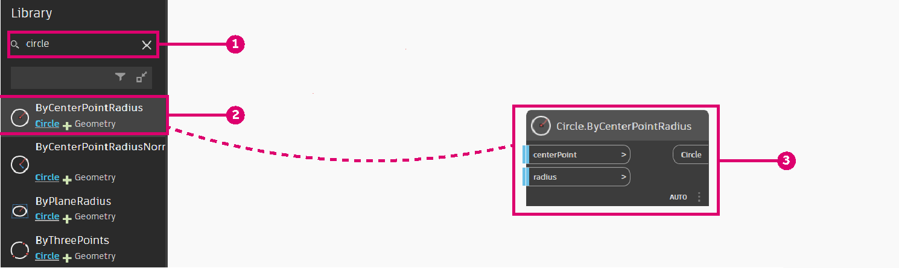

# Parametrische Vase

Das Erstellen einer parametrischen Vase ist eine gute Möglichkeit, in die Arbeit mit Dynamo einzusteigen.

In diesem Arbeitsablauf lernen Sie Folgendes:

* Verwenden der Number Sliders, um Variablen in Ihrer Konstruktion zu steuern.
* Erstellen und ändern von geometrischen Elementen mithilfe von Blöcken.
* Visualisieren der Ergebnisse in Echtzeit.

## Definieren der Ziele

Bevor wir mit Dynamo beginnen, sollten wir zunächst die Vase konzeptionell entwerfen.

Angenommen, wir entwerfen eine Tonvase, die die von Keramikern verwendeten Fertigungsverfahren berücksichtigt. Keramiker verwenden normalerweise eine Töpferscheibe zur Herstellung von zylindrischen Vasen. Durch die Anwendung von Druck auf verschiedene Höhen der Vase können sie dann die Form der Vase ändern und verschiedene Designs erstellen.

Wir verwenden eine ähnliche Methode, um unsere Vase zu definieren. Wir erstellen 4 Kreise mit unterschiedlichen Höhen und Radien und erstellen dann eine Oberfläche durch Erhebung dieser Kreise.

## Erste Schritte

> Laden Sie die Beispieldatei herunter, indem Sie auf den folgenden Link klicken.
>
> Eine vollständige Liste der Beispieldateien finden Sie im Anhang.



Wir benötigen die Blöcke, die die Reihenfolge der Aktionen darstellen, die von Dynamo ausgeführt werden. Da wir einen Kreis erstellen möchten, suchen Sie nach einem Block, der diese Aktion ausführt. Verwenden Sie das **Suchfeld**, oder durchsuchen Sie die **Bibliothek**, um den **Circle.ByCenterPointRadius**-Block zu suchen und ihn zum Arbeitsbereich hinzuzufügen.

> 1. Suchen > "Circle..."
> 2. Auswählen > "ByCenterPointRadius"
> 3. Block wird im Arbeitsbereich angezeigt

Sehen wir uns diesen Block genauer an. Auf der linken Seite befinden sich die Eingaben des Blocks (_centerPoint_ und _radius_), auf der rechten Seite die Ausgabe des Blocks (Circle). Beachten Sie, dass die Ausgaben eine hellblaue Linie aufweisen. Dies bedeutet, dass die Eingabe einen Vorgabewert hat. Um weitere Informationen über die Eingabe zu erhalten, bewegen Sie den Mauszeiger über den Namen. Die _radius_-Eingabe erfordert eine doppelte Eingabe und hat den Vorgabewert 1.

Wir behalten den Vorgabewert für _centerPoint_ bei, fügen jedoch einen **Number Slider** hinzu, um den Radius zu steuern. Verwenden Sie wie beim **Circle.ByCenterPointRadius**-Block die Bibliothek, um nach dem **Number Slider** zu suchen und ihn zu Ihrem Diagramm hinzuzufügen.

Dieser Block unterscheidet sich etwas von dem vorherigen Block, da er einen Schieberegler enthält. Mit der Benutzeroberfläche können Sie den Ausgabewert des Schiebereglers ändern.

.gif)

Der Schieberegler kann über die Dropdown-Schaltfläche auf der linken Seite des Blocks konfiguriert werden. Wir beschränken den Schieberegler auf einen Höchstwert von 15.

Platzieren Sie ihn auf der linken Seite des **Circle.ByCenterPointRadius**-Blocks, und verbinden Sie beide Blöcke, indem Sie die **Number Slider**-Ausgabe auswählen und mit der Radius-Eingabe verbinden.

Ändern Sie außerdem den Namen des Number Slider in "Top Radius", indem Sie auf den Namen des Blocks doppelklicken.

## Nächste Schritte

Wir fahren fort, indem wir der Logik einige Blöcke und Verbindungen hinzufügen, um die Vase zu definieren.

### Erstellen von Kreisen mit unterschiedlichen Radien

Wir kopieren diese Blöcke 4 Mal, sodass diese Kreise unsere Oberfläche definieren. Ändern Sie die Namen der Number Slider wie unten gezeigt.

\.png>)

> 1. Kreise werden durch einen Mittelpunkt und einen Radius erstellt.

### Verschieben von Kreisen durch die Vasenhöhe

Es fehlt noch ein Schlüsselparameter für die Vase, nämlich ihre Höhe. Um die Höhe der Vase zu steuern, erstellen wir einen weiteren Number Slider. Außerdem fügen wir einen **Code Block**-Block hinzu. Codeblöcke können hilfreich sein, wenn Sie personalisierte Code-Snippets zu Ihrem Arbeitsablauf hinzufügen möchten. Der Codeblock wird verwendet, um den Schieberegler für die Höhe mit verschiedenen Faktoren zu multiplizieren, sodass die Kreise entlang der Höhe der Vase positioniert werden können.

.png)

Verwenden Sie dann einen **Geometry.Translate**-Block, um Kreise in der gewünschten Höhe zu platzieren. Da die Kreise über die Vase verteilt werden sollen, verwenden wir Codeblöcke, um den Höhenparameter mit einem Faktor zu multiplizieren.

> 2\. Kreise werden durch eine Variable in der Z-Achse verschoben.

### Erstellen der Oberfläche

Um eine Oberfläche mithilfe des **Surface.ByLoft**-Blocks zu erstellen, müssen wir alle verschobenen Kreise in einer Liste zusammenfassen. Wir verwenden **List.Create**, um alle Kreise in einer Liste zu kombinieren, und geben dann diese Liste im **Surface.ByLoft**-Block aus, um die Ergebnisse anzuzeigen.

Wir deaktivieren außerdem die Vorschau in anderen Blöcken, um nur die Surface.ByLoft-Anzeige darzustellen.

\.png>)

> 3\. Eine Oberfläche wird durch Erhebung der verschobenen Kreise erstellt.

## Ergebnisse

Unser Arbeitsablauf ist bereit. Wir können jetzt die **Number Slider** verwenden, die wir in unserem Skript definiert haben, um verschiedene Vasendesigns zu erstellen.

