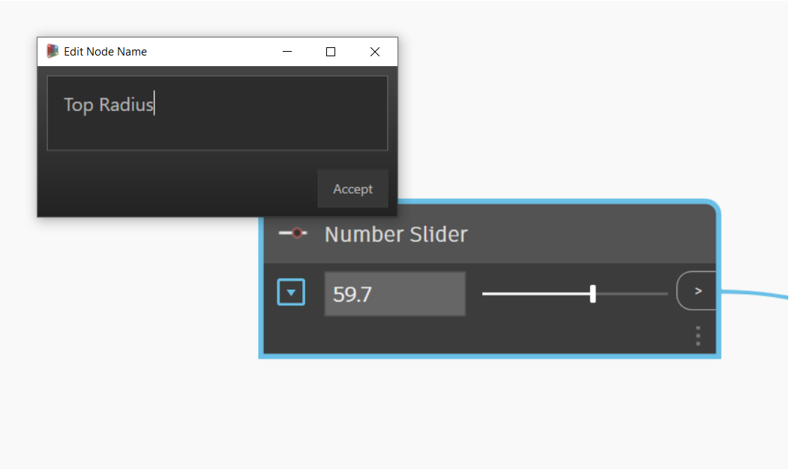

# 파라메트릭 꽃병

파라메트릭 꽃병 작성은 Dynamo 학습을 시작하기 위한 좋은 출발점입니다.

이 워크플로우에서는 다음과 같은 작업을 수행하는 방법을 설명합니다.

* Number Slider를 사용하여 설계의 변수를 제어합니다.
* 노드를 사용하여 형상 요소를 작성하고 수정합니다.
* 설계 결과를 실시간으로 시각화합니다.

## 목표 정의

Dynamo를 사용하기 전에 꽃병을 개념적으로 설계해 보겠습니다.

도예가들의 도자기 제조 방식을 고려하여 점토 꽃병을 설계하겠습니다. 도예가들은 일반적으로 도자기 물레를 사용해 원통형 꽃병을 제조합니다. 그런 다음, 꽃병의 다양한 높이에서 압력을 가해 꽃병의 모양을 변경하고 다양한 디자인을 만들 수 있습니다.

꽃병을 정의하는 데에도 유사한 방법을 사용합니다. 서로 다른 높이와 반지름으로 4개의 원을 작성한 다음, 해당 원을 로프트하여 표면을 작성합니다.

## 시작하기

> 아래 링크를 클릭하여 예제 파일을 다운로드하십시오.
>
> 전체 예시 파일 리스트는 부록에서 확인할 수 있습니다.



Dynamo에서 실행할 작업의 순서를 나타내는 노드가 필요합니다. 원을 작성하려고 하므로 먼저 이러한 작업을 수행하는 노드를 찾아보겠습니다. **검색 필드**를 사용하거나 **라이브러리**를 탐색하여 **Circle.ByCenterPointRadius** 노드를 찾아 작업공간에 추가합니다.

> 1. 검색 > "원..."
> 2. 선택 > "ByCenterPointRadius"
> 3. 노드가 작업공간에 표시됩니다.

이 노드를 좀 더 자세히 살펴보겠습니다. 왼쪽에는 노드의 입력(_centerPoint_ 및 _radius_)이 있고 오른쪽에는 노드의 출력(Circle)이 있습니다. 출력에 연한 파란색 선이 있습니다. 이것은 입력에 기본값이 있음을 의미합니다. 입력에 대한 자세한 정보를 확인하려면 해당 이름 위에 마우스를 놓습니다. _radius_ 입력은 이중 입력이 필요하며 기본값은 1입니다.

기본값인 _centerPoint_ 를 그대로 두고 **Number Slider** 를 추가하여 반지름을 제어합니다. **Circle.ByCenterPointRadius** 노드에서와 마찬가지로 라이브러리를 사용하여 **Number Slider** 를 검색하고 그래프에 추가합니다.

이 노드에는 슬라이더가 포함되어 있으므로 이전 노드와는 약간 다릅니다. 인터페이스를 사용하여 슬라이더의 출력 값을 변경할 수 있습니다.

.gif)

노드 왼쪽에 있는 드롭다운 버튼을 사용하여 슬라이더를 구성할 수 있습니다. 슬라이더를 최대값 15로 제한하겠습니다.

이를 **Circle.ByCenterPointRadius** 노드의 왼쪽에 배치하고, **Number Slider** 출력을 선택한 후 이를 Radius 입력에 연결하여 두 노드를 연결하겠습니다.

노드 이름을 두 번 클릭하여 Number Slider 이름을 "Top Radius"로 변경해 보겠습니다.

## 다음 단계

논리에 노드 및 연결을 계속 추가하여 꽃병을 정의해 보겠습니다.

### 반지름이 다른 원 작성

이러한 원이 표면을 정의하도록 이러한 노드를 네 번 복사하고, Number Slider의 이름을 아래와 같이 변경합니다.

.png>)

> 1. 중심점과 반지름으로 원을 작성합니다.

### 꽃병 높이를 따라 원 이동

꽃병의 핵심 매개변수인 높이가 누락되어 있습니다. 꽃병의 높이를 제어하기 위해 또 다른 Number Slider를 작성합니다. 또한 **Code Block** 노드도 추가합니다. 코드 블록은 워크플로우에 맞춤 코드 조각을 추가하는 데 도움이 됩니다. 꽃병의 높이를 따라 원을 배치할 수 있도록 코드 블록을 사용하여 높이 슬라이더에 다른 배율을 곱하겠습니다.

.png)

그런 다음, **Geometry.Translate** 노드를 사용하여 원하는 높이에 원을 배치합니다. 꽃병을 따라 원을 분배하려고 하므로 코드 블록을 사용하여 높이 매개변수에 배율을 곱합니다.

> 2\. 원은 Z축의 변수에 따라 변환(이동)됩니다.

### 표면 작성

**Surface.ByLoft** 노드를 사용하여 표면을 작성하려면 변환된 모든 원을 리스트로 결합해야 합니다. **List.Create**를 사용하여 모든 원을 단일 리스트로 결합한 다음, 마지막으로 이 리스트를 **Surface.ByLoft** 노드로 출력하여 결과를 확인합니다.

다른 노드의 미리보기를 꺼서 Surface.ByLoft 화면만 표시해 보겠습니다.

.png>)

> 3\. 변환된 원을 로프트하여 표면을 작성합니다.

## 결과

워크플로우가 준비되었습니다! 이제 스크립트에 정의한 **Number Sliders**를 사용하여 여러 꽃병 설계를 작성할 수 있습니다.

