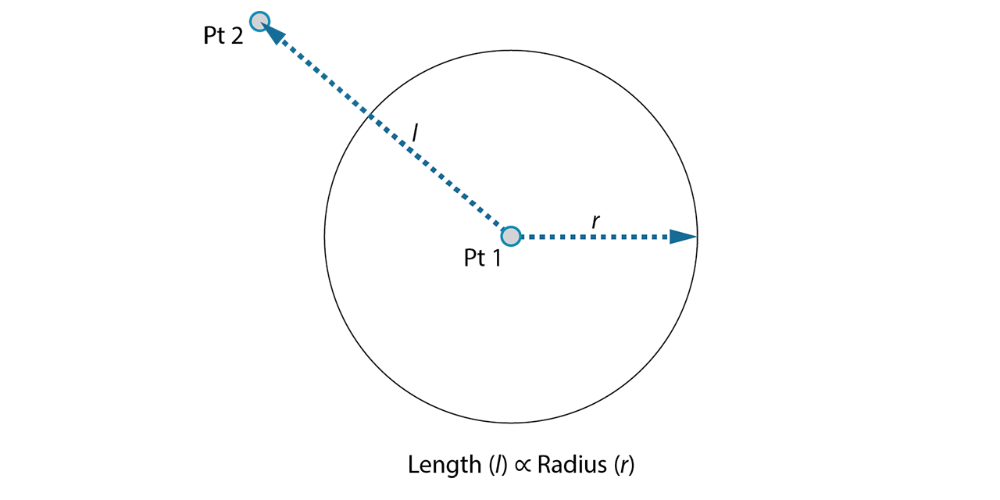

# Punti attrattore

I punti attrattore sono ideali per sperimentare modelli geometrici. Possono essere utilizzati per creare modifiche graduali agli oggetti in base alla loro distanza.

Questo workflow illustra come:

* Creare, gestire e modificare elenchi.
* Spostare punti nell'anteprima 3D utilizzando la manipolazione diretta.
* Modificare la modalità di esecuzione.

## Definizione degli obiettivi

In questo esercizio si desidera creare un cerchio (_obiettivo_) in cui l'input del raggio è definito dalla distanza rispetto ad un punto vicino (_relazione_).

> Un punto che definisce una relazione basata sulla distanza viene comunemente chiamato "attrattore". Qui la distanza dal punto attrattore verrà utilizzata per specificare la dimensione del cerchio.

## Passaggi successivi

> Scaricare il file di esempio facendo clic sul collegamento seguente.
>
> Un elenco completo di file di esempio è disponibile nell'Appendice.



Ora che sono stati definiti gli obiettivi e le relazioni, è possibile iniziare a creare il grafico. Sono necessari i nodi che rappresenteranno la sequenza di azioni che verranno eseguite da Dynamo. Iniziare aggiungendo i seguenti nodi: **Number**, **Number Slider**, **Point.ByCoordinates**, **Geometry.DistanceTo, Circle.ByCenterPointRadius.**

.png)

> 1. Input > Basic > **Number**
> 2. Input > Basic > **Number Slider**
> 3. Geometry > Points > Point > **By Coordinates(x,y,z)**
> 4. Geometry > Modifiers > Geometry > **DistanceTo**
> 5. Geometry > Curves > Circle > **ByCenterPointRadius**

### Collegamento di nodi con fili

Ora che sono presenti alcuni nodi, è necessario collegare le porte dei nodi con dei fili. Questi collegamenti definiranno il flusso di dati.

.png)

> 1. Da **Number** a **Point.ByCoordinates**
> 2. Da **Number Sliders** a **Point.ByCoordinates**
> 3. Da **Point.ByCoordinates** (2) a **DistanceTo**
> 4. Da **Point.ByCoordinates** e**DistanceTo** a **Circle.ByCenterPointRadius**

### Esecuzione del programma

Una volta definito il flusso del programma, è sufficiente comunicare a Dynamo di eseguirlo. Una volta eseguito il programma (automaticamente o quando si fa clic su Esegui in modalità Manuale), i dati passeranno attraverso i fili e i risultati dovrebbero essere visualizzati nell'anteprima 3D.

.png)

> 1. (Fare clic su Esegui): se la barra di esecuzione è in modalità Manuale, è necessario fare clic su Esegui per eseguire il grafico.
> 2. Anteprima del nodo: se si posiziona il cursore del mouse sopra la casella nell'angolo inferiore destro di un nodo, verrà visualizzata una finestra popup dei risultati.
> 3. Anteprima 3D: se uno dei nodi crea la geometria, verrà visualizzata nell'anteprima 3D.
> 4. Indica la geometria di output sul nodo della creazione.

### Aggiunta di **un Code Block**

Se il programma funziona, nell'anteprima 3D dovrebbe essere visualizzato un cerchio che passa attraverso il punto attrattore. Questa operazione è ottima, ma potrebbe essere utile aggiungere ulteriori dettagli o più controlli. Regolare l'input sul nodo circolare in modo da poter calibrare l'influenza sul raggio. Aggiungere un altro **Number Slider** all'area di lavoro, quindi fare doppio clic su un punto vuoto dell'area di lavoro per aggiungere un nodo **Code Block**. Modificare il campo in Code Block specificando `X/Y`.

.png)

> 1. **Code Block**
> 2. Da **DistanceTo** e **Number Slider** a **Code Block**
> 3. Da **Code Block** a **Circle.ByCenterPointRadius**

### Utilizzo di sequenze

Iniziare in modo semplice e aumentare la complessità rappresentano un modo efficace per sviluppare il programma in modo incrementale. Quando funziona per un cerchio, applicare la potenza del programma a più cerchi. Invece di un punto centrale, se si utilizza una griglia di punti e si adatta la modifica nella struttura dei dati risultante, ora il programma creerà molti cerchi, ciascuno con un valore di raggio univoco definito dalla distanza calibrata dal punto attrattore.

.png)

> 1. Aggiungere un nodo **Number Sequence** e sostituire gli input di **Point.ByCoordinates**. Fare clic con il pulsante destro del mouse su Point.ByCoordinates e selezionare Collegamento > Globale.
> 2. Aggiungere un nodo **List.Flatten** dopo Point.ByCoordinates. Per ridurre completamente di livelli un elenco, lasciare l'input `amt` sull'impostazione di default `-1`.
> 3. L'anteprima 3D verrà aggiornata con una griglia di cerchi.

### Regolazione con la manipolazione diretta

A volte la manipolazione numerica non è l'approccio giusto. Ora è possibile spingere e trascinare manualmente la geometria del punto durante la navigazione nell'anteprima sfondo 3D. Si possono anche controllare altre geometrie costruite da un punto. Ad esempio, anche **Sphere.ByCenterPointRadius** è in grado di eseguire la manipolazione diretta. È possibile controllare la posizione di un punto da una serie di valori X, Y e Z con **Point.ByCoordinates**. Con l'approccio della manipolazione diretta, tuttavia, è possibile aggiornare i valori dei dispositivi di scorrimento spostando manualmente il punto nella modalità di **navigazione nell'anteprima 3D**. Ciò offre un approccio più intuitivo per controllare una serie di valori discreti che identificano la posizione di un punto.

.png)

> 1. Per utilizzare la **manipolazione diretta**, selezionare il pannello del punto da spostare; verranno visualizzate delle frecce sopra il punto selezionato.
> 2. Passare alla modalità di **navigazione nell'anteprima 3D**.

.png)

> 1. Posizionare il cursore del mouse sul punto per visualizzare gli assi X, Y e Z.
> 2. Fare clic e trascinare la freccia colorata per spostare l'asse corrispondente; i valori di **Number Slider** verranno aggiornati in tempo reale con il punto spostato manualmente.

.png)

> 1. Notare che prima della **manipolazione diretta** solo un dispositivo di scorrimento era collegato al componente **Point.ByCoordinates**. Quando si sposta manualmente il punto nella direzione X, Dynamo genererà automaticamente un nuovo **Number Slider** per l'input X.

