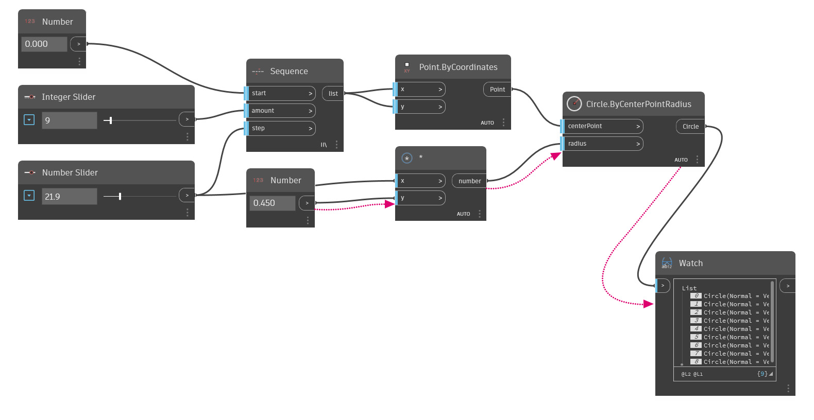
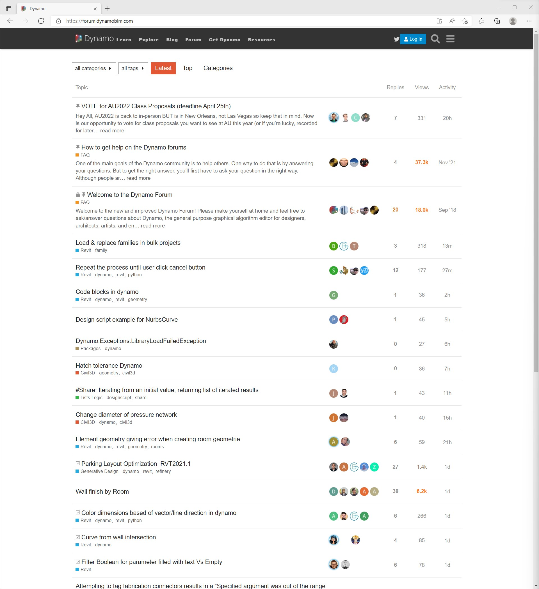

# Introduction

Dynamo is a visual programming platform that enables designers to define the relationships and the sequences of actions that compose custom algorithms. Dynamo is an open-source project on Github, giving everyone an opportunity to contribute to its development.

#### What is the purpose of this guide? 

The purpose of this guide is to help you navigate the range of C# development possibilities for Dynamo from how to create zero-touch nodes to building extensions.

> The Dynamo source on GitHub

The strength of Dynamo as an ever-growing platform is a product of the incredible community of users contributing to its development. Become an active part of this conversation by following [the Blog](https://dynamobim.org/blog/), providing original content to [the Gallery](https://dynamobim.org/gallery/), or engaging others in [the Forum](https://forum.dynamobim.com).

> The Dynamo Forum

#### Looking for an introduction to Dynamo? 

If you are looking for a guide to visual programming in Dynamo, please visit the [Dynamo Primer](http://dynamoprimer.com/en/). This invaluable resource covers the foundational concepts of visual programming in Dynamo and development options in the Dynamo workspace such as DesignScript, Python, and Zero-Touch.

> The Dynamo Primer

#### What additional online resources do we provide? 

**Dynamo**: Download the latest stable and daily builds of Dynamo

[https://dynamobim.com/download/](https://dynamobim.com/download/)

**Dynamo GitHub**: Dynamo is an open-source development project on Github.

[https://github.com/DynamoDS/Dynamo](https://github.com/DynamoDS/Dynamo)

**Dynamo Github Wiki**: This has been the primary resource for developer documentation.

[https://github.com/DynamoDS/Dynamo/wiki](https://github.com/DynamoDS/Dynamo/wiki)

**Node Naming Standards** provides standards and guidelines for naming categories, nodes, and input and output ports in Dynamo.

[https://github.com/DynamoDS/Dynamo/wiki/Naming-Standards](https://github.com/DynamoDS/Dynamo/wiki/Naming-Standards)

**Dynamo Language/API guide**: Dynamo's API documentation currently covers the core functionality

[https://dynamods.github.io/DynamoAPI/](https://dynamods.github.io/DynamoAPI/)

**DynamoBIM** The best source for additional information, learning content, and forums is the DynamoBIM website.

[https://dynamobim.org](https://dynamobim.org)

**Dynamo Dictionary** A searchable database of all Dynamo nodes

[https://dictionary.dynamobim.com/](https://dictionary.dynamobim.com)

**DesignScript Language Guide** A PDF guide to writing DesignScript

[PDF](https://dynamobim.org/wp-content/uploads/forum-assets/colin-mccroneautodesk-com/07/10/Dynamo\_language\_guide\_version\_1.pdf)

#### How can I suggest changes to this guide? 

This documentation is open to suggestions. These can be made directly in Github by creating change requests.
