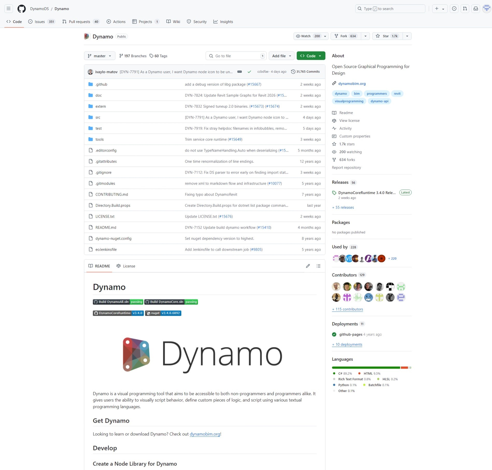

# Guida introduttiva per sviluppatori 

#### Qual è lo scopo di questa guida? 

Lo scopo di questa guida è quello di aiutare l'utente a navigare tra le varie possibilità di sviluppo in C# per Dynamo, da come creare nodi zero-touch alla compilazione di estensioni.

> La sorgente di Dynamo su GitHub

#### Quali risorse aggiuntive per gli sviluppatori forniamo? 

**Dynamo**: scaricare le build stabili e giornaliere più recenti di Dynamo.

[https://dynamobuilds.com/](https://dynamobuilds.com/)

**Dynamo GitHub**: Dynamo è un progetto di sviluppo open source su GitHub.

[https://github.com/DynamoDS/Dynamo](https://github.com/DynamoDS/Dynamo)

**Wiki per Dynamo su GitHub**: questa è stata la risorsa principale per la documentazione per gli sviluppatori.

[https://github.com/DynamoDS/Dynamo/wiki](https://github.com/DynamoDS/Dynamo/wiki)

**Standard di denominazione dei nodi**: forniscono standard e linee guida per la denominazione di categorie, nodi e porte di input e output in Dynamo.

[https://github.com/DynamoDS/Dynamo/wiki/Naming-Standards](https://github.com/DynamoDS/Dynamo/wiki/Naming-Standards)

**Guida all'API/alla lingua di Dynamo**: la documentazione sull'API di Dynamo attualmente copre le funzionalità principali.

[https://dynamods.github.io/DynamoAPI/](https://dynamods.github.io/DynamoAPI/)

**DynamoBIM** La migliore fonte per ulteriori informazioni, contenuto di formazione e forum è il sito Web di DynamoBIM.

[https://dynamobim.org](https://dynamobim.org)

**Dizionario di Dynamo**: un database consultabile di tutti i nodi di Dynamo.

[https://dictionary.dynamobim.com/](https://dictionary.dynamobim.com)

**Guida al linguaggio DesignScript**: una guida in formato PDF per la scrittura di DesignScript.

[PDF](https://dynamobim.org/wp-content/uploads/forum-assets/colin-mccroneautodesk-com/07/10/Dynamo\_language\_guide\_version\_1.pdf)

#### In che modo è possibile suggerire modifiche a questa guida? 

Questa documentazione è aperta a eventuali suggerimenti. Questi possono essere creati direttamente in GitHub creando richieste di modifica.
