# Compilazione di DynamoRevit dall'origine

I file di origine di DynamoRevit sono inoltre ospitati sulla pagina di DynamoDS su GitHub per consentire agli sviluppatori di apportare contributi e compilare versioni beta. La compilazione di DynamoRevit dall'origine segue generalmente lo stesso processo di Dynamo, ad eccezione di alcuni dettagli importanti:

* DynamoRevit fa riferimento agli assiemi di Dynamo, quindi questi devono essere creati con i pacchetti NuGet corrispondenti. Ad esempio, DynamoRevit 2.x non verrà caricato in Dynamo 1.3.
* DynamoRevit è specifico delle versioni di Revit, ad esempio: il ramo di DynamoRevit 2018 deve essere eseguita in Revit 2018.

Per questa guida utilizzeremo i seguenti elementi:

* Revit 2023
* La build più recente di DynamoRevit sul ramo `Revit2023`
* La build più recente di Dynamo

Per garantire una corretta compilazione, verranno clonati e creati entrambi i repository di Dynamo e DynamoRevit da utilizzare in questa simulazione.

_Nota La creazione manuale di Dynamo prima di DynamoRevit è necessaria solo se si sta creando Dynamo 1.x e DynamoRevit 1.x. Le versioni più recenti del repository di DynamoRevit si basano su Gestione pacchetti NuGet per le dipendenze di Dynamo necessarie per la creazione. Sebbene una build di DynamoRevit 2.x non richieda il pull manuale di Dynamo, sarà comunque necessario disporre dei file `dlls` di Core in un altro punto per eseguire effettivamente DynamoRevit`addin`, pertanto vale la pena di eseguire il pull e la compilazione di Dynamo comunque. Per ulteriori informazioni, vedere __[Compilazione del repository utilizzando Visual Studio](#building-the-repository-using-Visual-Studio)_.

#### Individuazione del repository di DynamoRevit su GitHub <a href="#locating-the-dynamorevit-repository-on-github" id="locating-the-dynamorevit-repository-on-github"></a>

Il codice per il progetto di DynamoRevit si trova in un repository su GitHub separato dal codice sorgente di Dynamo principale. Questo repository contiene i file di origine per i nodi specifici di Revit e il modulo aggiuntivo di Revit che carica Dynamo. Le build di DynamoRevit per versioni diverse di Revit (ad esempio, 2016, 2017 o 2018) sono organizzate come rami nel repository.

L'origine di DynamoRevit è ospitata qui: [https://github.com/DynamoDS/DynamoRevit](https://github.com/DynamoDS/DynamoRevit).

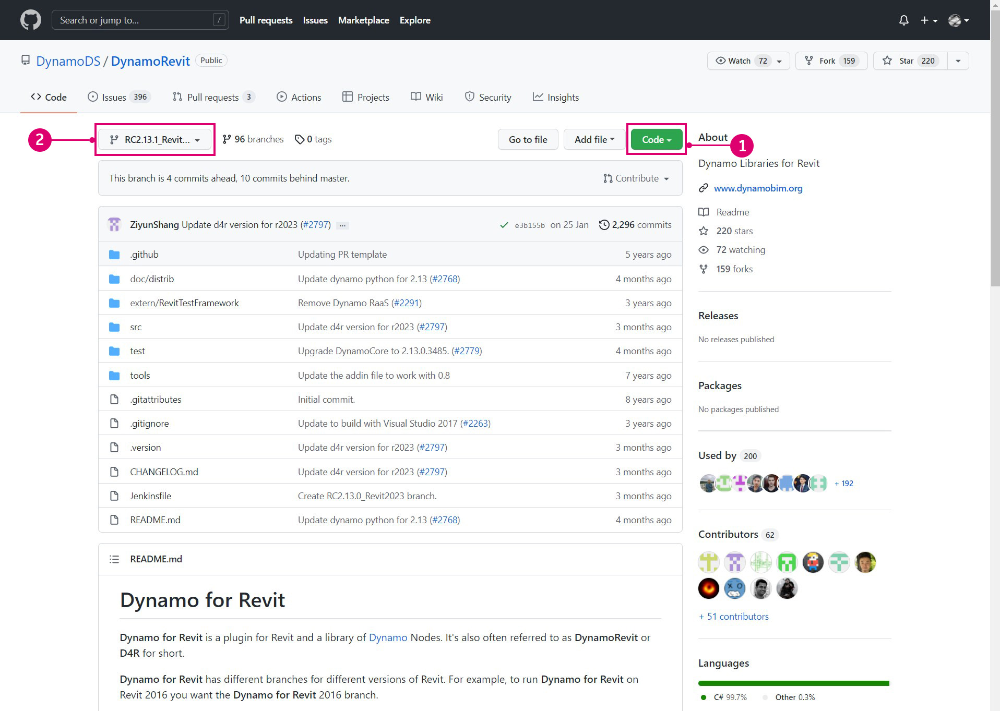

> 1. Clonare o scaricare il repository.
> 2. I rami di DynamoRevit fanno riferimento alle versioni di Revit.

#### Clonazione del repository mediante git <a href="#cloning-the-repository-using-git" id="cloning-the-repository-using-git"></a>

In un processo simile al pull del repository di Dynamo, utilizzeremo il comando clone di git per clonare DynamoRevit e specificare il ramo che corrisponde alla versione di Revit. Per iniziare, apriremo un'interfaccia della riga di comando e imposteremo la directory corrente sul percorso in cui desideriamo clonare i file.

`cd C:\Users\username\Documents\GitHub` modifica la directory corrente.

> Sostituire `username` con il nome utente.

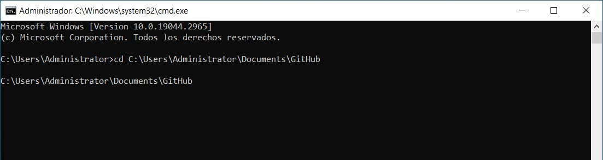

Ora possiamo clonare il repository in questa directory. Sebbene sia necessario specificare un ramo del repository, possiamo passare a questo ramo dopo la clonazione.

`git clone https://github.com/DynamoDS/DynamoRevit.git` clona il repository da un URL remoto e, per default, passa al ramo principale.

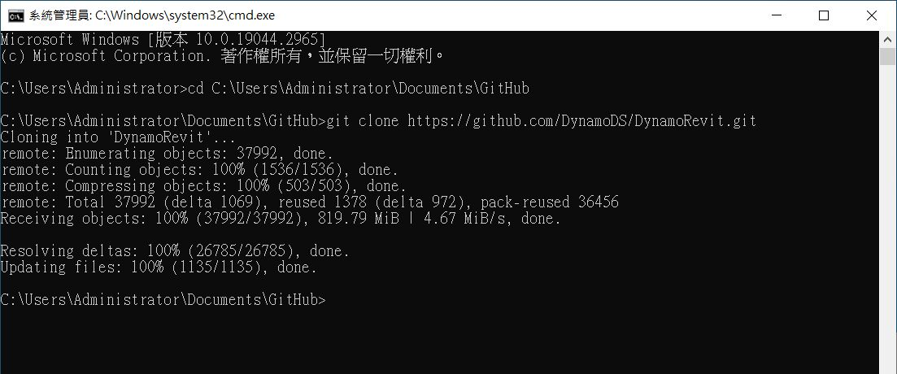

Una volta terminata la clonazione del repository, cambiare la directory corrente con la cartella del repository e passare al ramo corrispondente alla versione di Revit installata. In questo esempio, utilizziamo Revit RC2.13.1_Revit2023. Tutti i rami remoti possono essere visualizzati nella pagina su GitHub nel menu a discesa Branch.

`cd C:\Users\username\Documents\GitHub\DynamoRevit` modifica la directory in DynamoRevit.\
 `git checkout RC2.13.1_Revit2023` imposta il ramo corrente su `RC2.13.1_Revit2023`.\
 `git branch` verifica in quale ramo siamo e mostra gli altri che esistono localmente.

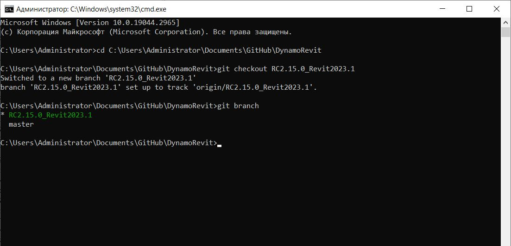

> Il ramo con un asterisco è quello attualmente estratto. Il ramo `Revit2018` è visibile perché lo abbiamo estratto in precedenza, pertanto esiste localmente.

È importante scegliere il ramo corretto del repository per assicurarsi che, quando il progetto viene compilato in Visual Studio, faccia riferimento agli assiemi nella versione corretta della directory di installazione di Revit, in particolare `RevitAPI.dll` e `RevitAPIUI.dll`.

#### Compilazione del repository utilizzando Visual Studio <a href="#building-dynamo-revit" id="building-dynamo-revit"></a>

Prima di compilare il repository, è necessario ripristinare i pacchetti NuGet con il file `restorepackages.bat` situato nella cartella `src`. Questo file .bat utilizza Gestione pacchetti [NuGet](https://www.nuget.org) per eseguire il pull dei file binari creati di Dynamo Core, di cui DynamoRevit ha bisogno. Si potrebbe anche scegliere di compilarli manualmente, ma solo se si stanno apportando modifiche a DynamoRevit e non a Dynamo Core. In questo modo, è possibile iniziare a lavorare più velocemente. Assicurarsi di eseguire il file come amministratore.

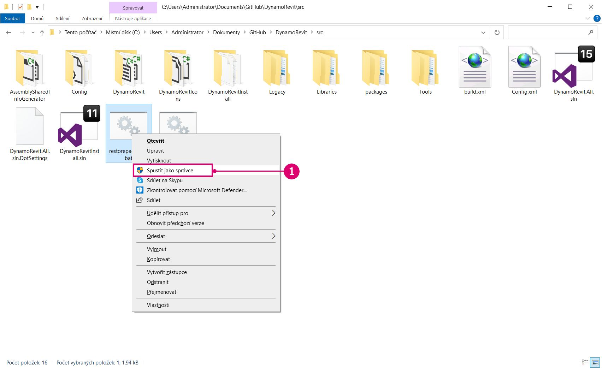

> 1. Fare clic con il pulsante destro del mouse su `restorepackages.bat` e selezionare `Run as administrator`.

Se i pacchetti vengono ripristinati correttamente, una cartella `packages` verrà aggiunta alla cartella `src` con i pacchetti NuGet della versione beta più recenti.

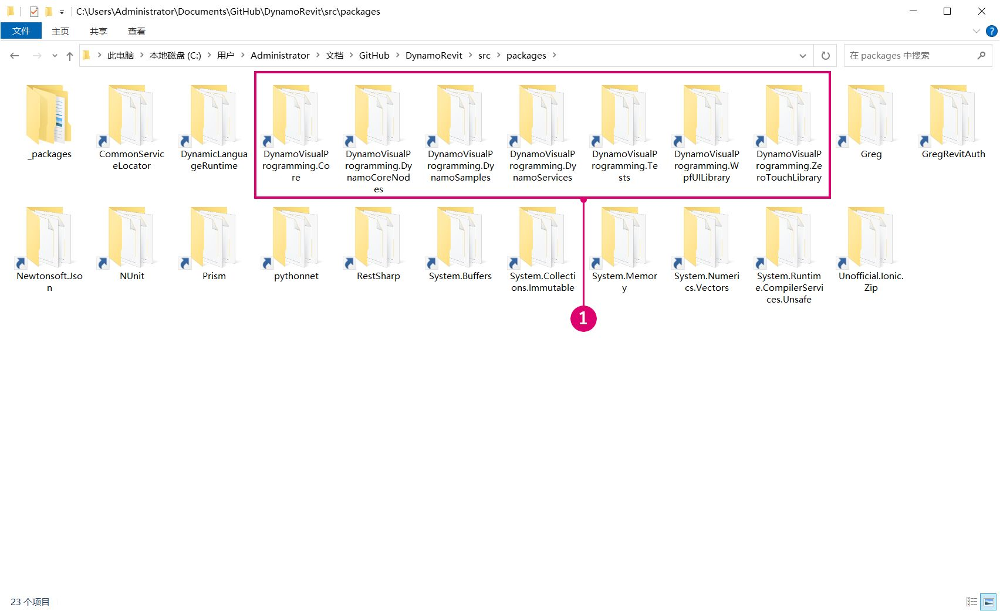

> 1. I pacchetti NuGet di Dynamo della versione beta più recenti

Una volta ripristinati i pacchetti, aprire il file della soluzione di Visual Studio `DynamoRevit.All.sln` in `src` e creare la soluzione. Inizialmente la build potrebbe avere problemi a trovare `AssemblySharedInfo.cs`. In questo caso, la riesecuzione della build risolverà il problema.

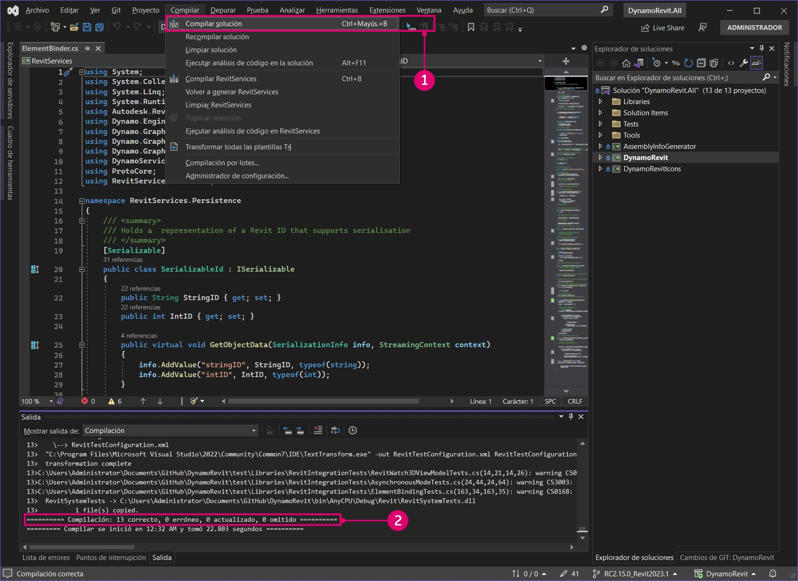

> 1. Selezionare `Build > Build Solution`.
> 2. Verificare che la build sia stata eseguita correttamente nella finestra Output. Dovrebbe essere visualizzato il messaggio `===== Build: 13 succeeded, 0 failed, 0 up-to-date, 0 skipped =====`.

#### Esecuzione di una build locale di DynamoRevit in Revit <a href="#running-a-local-build-of-dynamorevit-in-revit" id="running-a-local-build-of-dynamorevit-in-revit"></a>

Per riconoscere DynamoRevit, in Revit è richiesto un file .addin, che il [programma di installazione](http://dynamobim.org/download/) creerà automaticamente. Nello sviluppo è necessario creare manualmente un file .addin che punti alla build di DynamoRevit che si desidera, in particolare l'assieme `DynamoRevitDS.dll`. Dobbiamo inoltre puntare DynamoRevit ad una build di Dynamo.

Creare un file `Dynamo.addin` nella cartella Addins di Revit che si trova in `C:\ProgramData\Autodesk\Revit\Addins\2023`. Abbiamo già installato una versione di DynamoRevit, quindi modificheremo il file esistente in modo che punti alla nuova build.

```
<?xml version="1.0" encoding="utf-8" standalone="no"?>
<RevitAddIns>
<AddIn Type="Application">
<Name>Dynamo For Revit</Name>
<Assembly>"C:\Users\username\Documents\GitHub\DynamoRevit\bin\AnyCPU\Debug\Revit\DynamoRevitDS.dll"</Assembly>
<AddInId>8D83C886-B739-4ACD-A9DB-1BC78F315B2B</AddInId>
<FullClassName>Dynamo.Applications.DynamoRevitApp</FullClassName>
<VendorId>ADSK</VendorId>
<VendorDescription>Dynamo</VendorDescription>
</AddIn>
</RevitAddIns>
```

* Specificare il percorso del file `DynamoRevitDS.dll` all'interno di `<Assembly>...</Assembly>`.

In alternativa, possiamo fare in modo che il modulo aggiuntivo carichi il selettore di versione anziché un assieme specifico.

```
<?xml version="1.0" encoding="utf-8" standalone="no"?>
<RevitAddIns>
<AddIn Type="Application">
<Name>Dynamo For Revit</Name>
<Assembly>"C:\Users\username\Documents\GitHub\DynamoRevit\bin\AnyCPU\Debug\Revit\DynamoRevitVersionSelector.dll"</Assembly>
<AddInId>8D83C886-B739-4ACD-A9DB-1BC78F315B2B</AddInId>
<FullClassName>Dynamo.Applications.VersionLoader</FullClassName>
<VendorId>ADSK</VendorId>
<VendorDescription>Dynamo</VendorDescription>
</AddIn>
</RevitAddIns>
```

* Impostare il percorso del file `<Assembly>...</Assembly>` su `DynamoRevitVersionSelector.dll`.
* `<FullClassName>...</FullClassName>` specifica la classe di cui creare un'istanza dall'assieme a cui abbiamo puntato con il percorso dell'elemento assieme indicato sopra. Questa classe sarà il punto di ingresso per il modulo aggiuntivo.

Inoltre, dobbiamo rimuovere la cartella di Dynamo esistente fornita con Revit. A tale scopo, accedere a `C:\\Program Files\Autodesk\Revit 2023\AddIns ` e rimuovere le due cartelle che contengono **Dynamo** - `DynamoForRevit` e `DynamoPlayerForRevit`. È possibile eliminarle o eseguirne il backup in una cartella separata se è necessario recuperare la cartella di Dynamo for Revit originale.


Il secondo passaggio consiste nell'aggiungere un percorso di file per gli assiemi di Dynamo Core al file `Dynamo.config` nella cartella `bin` di DynamoRevit. DynamoRevit li carica quando il modulo aggiuntivo viene aperto in Revit. Questo file .config consente di puntare il modulo aggiuntivo DynamoRevit a versioni diverse di Dynamo Core per lo sviluppo e la verifica delle modifiche sia in Dynamo Core che in DynamoRevit.

Il codice dovrebbe avere un aspetto simile al seguente:

```
<?xml version="1.0" encoding="utf-8"?>
<configuration>
  <appSettings>
     <add key="DynamoRuntime" value="C:\Users\username\Documents\GitHub\Dynamo\bin\AnyCPU\Debug"/>
  </appSettings>
</configuration>
```

* Aggiungere il percorso della directory della cartella `bin` a `<add key/>`.

> Abbiamo clonato e creato Dynamo subito prima di questa simulazione per garantire che funzioni correttamente con DynamoRevit. Il percorso della directory punta a questa build.

Ora, quando si apre Revit, dovrebbe essere presente un modulo aggiuntivo Dynamo nella scheda Gestisci.

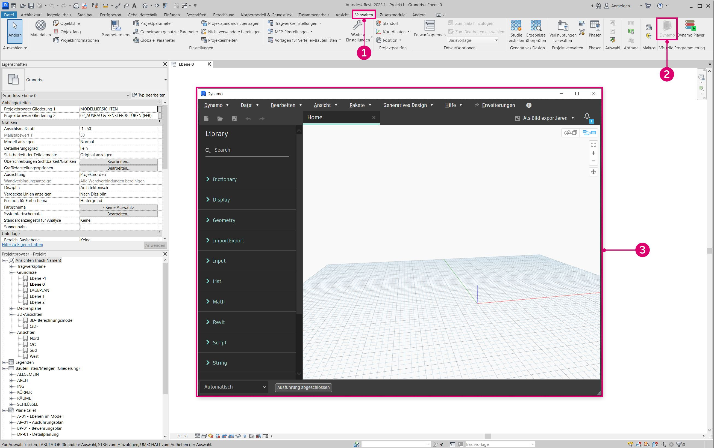

> 1. Selezionare `Manage`.
> 2. Fare clic sull'icona del modulo aggiuntivo Dynamo.
> 3. Un'istanza di DynamoRevit.

Se viene visualizzata una finestra di dialogo di errore che mostra gli assiemi mancanti, è probabile che si sia verificata una mancata corrispondenza tra le versioni di Dynamo Core create e quelle caricate in fase di esecuzione. Ad esempio, DynamoRevit con i pacchetti beta più recenti 2.0 di Dynamo Core non funzionerà se si tenta di avviarlo utilizzando i file .dll di Dynamo 1.3. Assicurarsi che entrambe i repository siano della stessa versione e che DynamoRevit stia eseguendo il pull di una versione corrispondente delle dipendenze NuGet. Questi sono definiti nel file `package.json` del repository di DynamoRevit.

#### Debug di DynamoRevit utilizzando Visual Studio <a href="#debugging-dynamorevit-using-visual-studio" id="debugging-dynamorevit-using-visual-studio"></a>

Nella sezione precedente, **Compilazione di Dynamo dall'origine**, abbiamo introdotto brevemente il debug in Visual Studio e come associare Visual Studio ad un processo. Utilizzando un'eccezione nel nodo Wall.ByCurveAndHeight come esempio, verrà illustrato come eseguire l'associazione ad un processo, impostare i punti di interruzione, eseguire il codice una riga alla volta e utilizzare lo stack di chiamate per determinare l'origine dell'eccezione. Questi strumenti di debug si applicano in genere ai workflow di sviluppo di file .net e sono utili per l'esplorazione al di fuori di questa guida.

* L'**associazione ad un processo** collega un'applicazione in esecuzione a Visual Studio per il debug. Se si desidera eseguire il debug di un funzionamento che si verifica in una build di DynamoRevit, è possibile aprire i file di origine di DynamoRevit in Visual Studio e associare il processo `Revit.exe`, che è il processo principale del modulo aggiuntivo DynamoRevit. Visual Studio utilizza un [file di simboli](https://msdn.microsoft.com/en-us/library/ms241613.aspx) (`.pbd`) per stabilire la connessione tra gli assiemi in esecuzione in DynamoRevit e il codice sorgente.
* I **punti di interruzione** stabiliscono le righe del codice sorgente in cui l'applicazione verrà messa in pausa prima dell'esecuzione. Se un nodo causa l'arresto anomalo di DynamoRevit o restituisce un risultato imprevisto, è possibile aggiungere un punto di interruzione all'origine del nodo per mettere in pausa il processo, eseguire l'istruzione nel codice ed esaminare i valori attivi delle variabili fino a quando non viene individuata la causa del problema.
* L'**esecuzione del codice una riga alla volta** consente di spostarsi nel codice sorgente riga per riga. È possibile eseguire le funzioni una alla volta, eseguire l'istruzione in una chiamata di funzione o uscire dalla funzione attualmente in esecuzione.
*   **Lo stack di chiamate** mostra la funzione che un processo è attualmente in esecuzione rispetto alle chiamate di funzione precedenti che hanno richiamato questa chiamata di funzione. Per visualizzare questa finestra, in Visual Studio è disponibile la finestra Call Stack. Ad esempio, se si raggiunge un'eccezione al di fuori del codice sorgente, è possibile visualizzare il percorso del codice chiamante nello stack di chiamate.

    > [2,000 Things You Should Know About C#](https://csharp.2000things.com/2013/05/20/847-how-the-call-stack-works/) presenta una spiegazione più approfondita degli stack di chiamate.

Il nodo **Wall.ByCurveAndHeight** genera un'eccezione quando viene fornito il valore PolyCurve come input curve con il messaggio: _To BSPlineCurve Not Implemented_. Con il debug si può capire perché esattamente il nodo non accetta questo tipo di geometria come input per il parametro curve. In questo esempio, si presuppone che DynamoRevit sia stato creato correttamente e possa essere eseguito come modulo aggiuntivo per Revit.

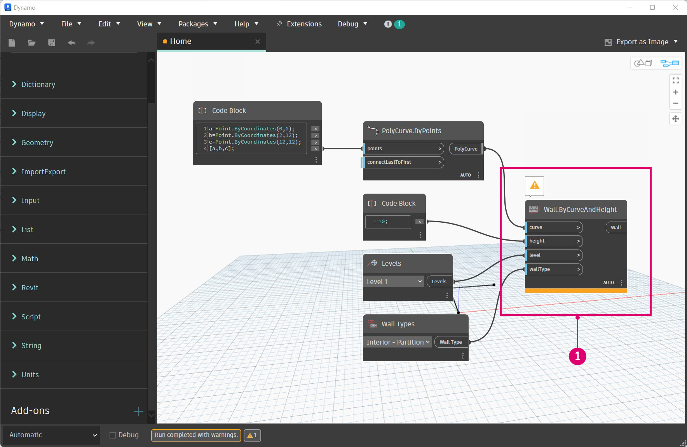

> 1. Il nodo Wall.ByCurveAndHeight che genera un'eccezione

Iniziare aprendo il file della soluzione `DynamoRevit.All.sln`, avviare Revit e avviare il modulo aggiuntivo DynamoRevit. Quindi, associare Visual Studio al processo di Revit con la finestra `Attach to Process`.

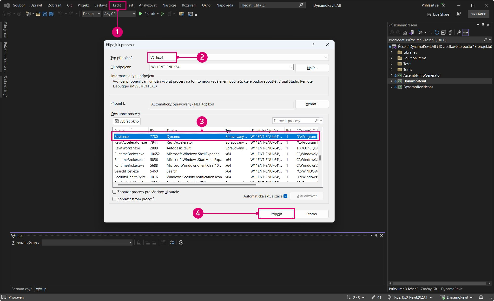

> È necessario che Revit e DynamoRevit siano in esecuzione per essere mostrati come processo disponibile
>
> 1. Aprire la finestra `Attach to Process` selezionando `Debug > Attach to Process...`.
> 2. Impostare `Transport` su `Default`.
> 3. Selezionare `Revit.exe`.
> 4. Selezionare `Attach`.

Con Visual Studio associato a Revit, aprire il codice sorgente Wall.ByCurveAndHeight in `Wall.cs`. È possibile trovare questa opzione in Solution Explorer in `Libraries > RevitNodes > Elements` nell'area `Public static constructors` del file. Impostare un punto di interruzione nel costruttore del tipo di muro in modo, che quando il nodo viene eseguito in Dynamo, il processo si interrompa e si possa eseguire ogni singola riga di codice. In genere, i costruttori di tipo zero-touch di Dynamo iniziano con `By<parameters>`.


> 1. Il file di classe con il costruttore per Wall.ByCurveAndHeight
> 2. Impostare un punto di interruzione facendo clic a sinistra del numero di riga o facendo clic con il pulsante destro del mouse sulla riga di codice e selezionare `Breakpoint > Insert Breakpoint`.

Con il punto di interruzione impostato, è necessario eseguire il processo attraverso la funzione Wall.ByCurveAndHeight. La funzione può essere eseguita nuovamente in Dynamo riconnettendo un filo ad una delle relative porte, il che forzerà la riesecuzione del nodo. Il punto di interruzione verrà rilevato in Visual Studio.

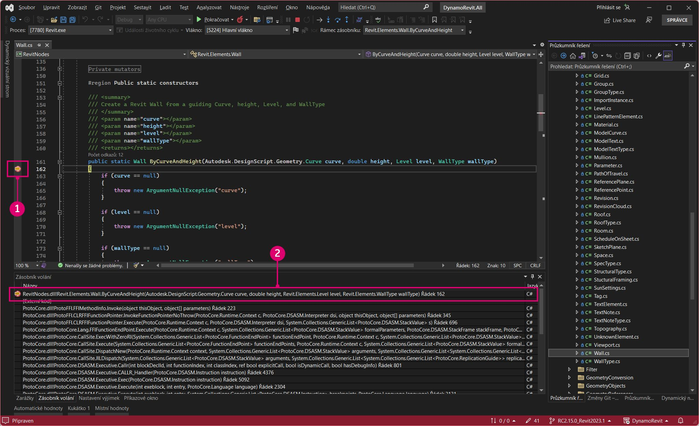

> 1. L'icona del punto di interruzione cambia quando viene rilevato
> 2. La finestra Call Stack che mostra il metodo successivo

Ora eseguire ogni riga del costruttore fino a quando non viene rilevata l'eccezione. Il codice evidenziato in giallo è l'istruzione successiva da eseguire.

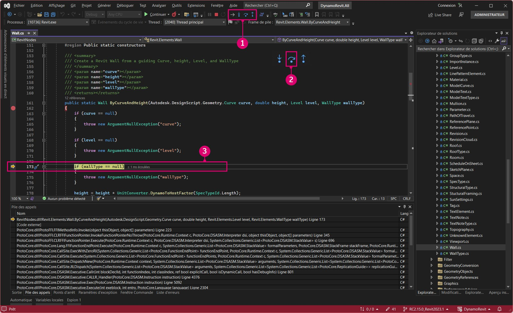

> 1. Gli strumenti di debug per la navigazione nel codice
> 2. Premere `Step Over` per eseguire il codice evidenziato, quindi sospendere l'esecuzione dopo la restituzione della funzione.
> 3. L'istruzione successiva da eseguire è indicata dall'evidenziazione gialla e dalla freccia.

Se si continua a eseguire la funzione, si rileverà l'eccezione visualizzata nella finestra di DynamoRevit. Osservando la finestra Call Stack, si può vedere che l'eccezione è stata originariamente generata da un metodo denominato `Autodesk.Revit.CurveAPIUtils.CreateNurbsCurve`. Fortunatamente l'eccezione è gestita qui, pertanto Dynamo non è stato arrestato in modo anomalo. Il processo di debug ha fornito il contesto per il problema, portandoci a un altro metodo nel codice sorgente.

Poiché non si tratta di una libreria open source, non si possono apportare modifiche. Ora che si hanno ulteriori informazioni, è possibile segnalare il problema con maggiore contesto, presentando un [problema](https://guides.github.com/features/issues/) su GitHub o si potrebbe proporre una soluzione per questo problema eseguendo una richiesta pull.

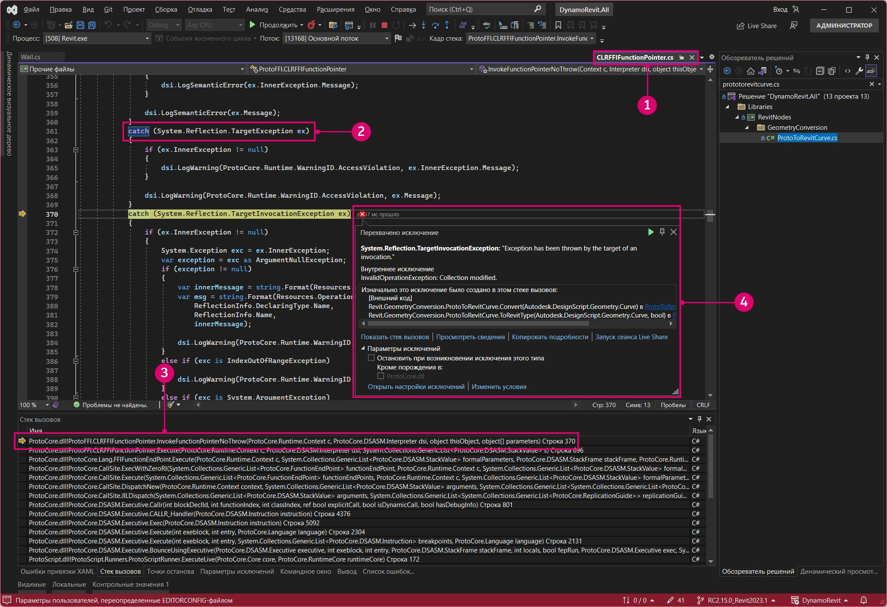

> 1. Quando si rileva l'istruzione che causa l'eccezione in `Walls.cs`, il processo di debug ci avvicina il più possibile alla causa del problema nel codice utente all'interno di `ProtoToRevitCurve.cs`.
> 2. L'istruzione che causa l'eccezione in `ProtoToRevitCurve.cs`
> 3. Nella finestra Call Stack, è possibile vedere che l'eccezione proviene da codice non utente.
> 4. Una finestra a comparsa che fornisce informazioni sull'eccezione

Questo processo può essere applicato a qualsiasi file di origine utilizzato. Se si sta sviluppando una libreria di nodi zero-touch per Dynamo Studio, è possibile aprire l'origine della libreria e associare un processo di Dynamo per eseguire il debug della libreria dei nodi. Anche se tutto funziona perfettamente, il debug è un ottimo modo per esplorare il codice e scoprire come funziona.

#### Pull dell'ultima build <a href="#pull-latest-build" id="pull-latest-build"></a>

Questo processo è quasi identico al pull delle modifiche per Dynamo, tranne per il fatto che è necessario verificare di trovarsi nel ramo corretto. Utilizzare il comando `git branch` nel repository di DynamoRevit per vedere quali rami sono disponibili localmente e quali sono attualmente estratti.

`cd C:\Users\username\Documents\GitHub\DynamoRevit` imposta la directory corrente sul repository di DynamoRevit. \
 `git branch` verifica che ci troviamo nel ramo corretto, `RC2.13.1_Revit2023`.\
 `git pull origin RC2.13.1_Revit2023` esegue il pull delle modifiche dal ramo `RC2.13.1_Revit2023` di origine remota.

L'origine punta semplicemente all'URL originale clonato.


> Si desidera essere consapevoli del ramo in cui ci si trova attualmente e di quello da cui ci sta eseguendo il pull per evitare, ad esempio, di effettuare il pull delle modifiche da `RC2.13.1_Revit2023` a `Revit2018`.

Come indicato in **Creazione di Dynamo dall'origine**, quando si è pronti per inviare una modifica al repository di DynamoRevit, è possibile creare una richiesta pull seguendo le linee guida del team di Dynamo riportate nella sezione Richieste pull.
