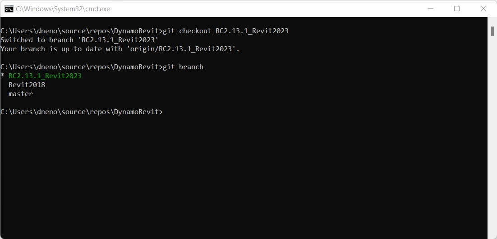

# Sestavení doplňku DynamoRevit ze zdroje

Zdrojové soubory doplňku DynamoRevit jsou také umístěny na Githubu DynamoDS, kde mohou vývojáři vytvářet příspěvky a sestavovat beta verze. Sestavení doplňku DynamoRevit ze zdroje obecně probíhá stejným způsobem jako u aplikace Dynamo s výjimkou několika důležitých detailů:

* Doplněk DynamoRevit odkazuje na sestavy aplikace Dynamo, proto by měly být vytvořeny pomocí odpovídajících balíčků NuGet. Doplněk DynamoRevit 2.x například nebude načten do aplikace Dynamo 1.3.
* Doplněk DynamoRevit je specifický pro konkrétní verzi aplikace Revit, například větev doplňku DynamoRevit 2018 by měla být spuštěna v aplikaci Revit 2018.

V této příručce použijeme následující zdroje:

* Revit 2023
* Nejnovější sestavení doplňku DynamoRevit založené na větvi aplikace `Revit2023`
* Nejnovější sestavení aplikace Dynamo

Abychom zajistili úspěšné sestavení, naklonujeme a sestavíme úložiště aplikace Dynamo a doplňku DynamoRevit, která použijeme v této ukázce.

_Poznámka: Ruční sestavení aplikace Dynamo před doplňkem DynamoRevit je nutné pouze v případě, že vytváříte aplikaci Dynamo 1.x a doplněk DynamoRevit 1.x. Novější verze úložiště doplňku DynamoRevit se při tvorbě závislostí aplikace Dynamo potřebných k sestavení spoléhají na správce balíčků NuGet. I když sestavení doplňku DynamoRevit 2.x nevyžaduje ruční stažení aplikace Dynamo, budete stále potřebovat základní knihovny `dlls`, abyste mohli `addin` DynamoRevit skutečně spustit, proto se vyplatí aplikaci Dynamo stáhnout a sestavit tak jako tak. Další informace naleznete níže:_ [_Tvorba úložiště pomocí aplikace Visual Studio_](#building-the-repository-using-Visual-Studio)

#### Vyhledání úložiště doplňku DynamoRevit na Githubu <a href="#locating-the-dynamorevit-repository-on-github" id="locating-the-dynamorevit-repository-on-github"></a>

Kód projektu doplňku DynamoRevit se nachází v samostatném úložišti na Githubu, které je odděleno od základního zdrojového kódu aplikace Dynamo. Toto úložiště obsahuje zdrojové soubory pro uzly specifické pro aplikaci Revit a doplněk aplikace Revit, který načítá aplikaci Dynamo. Sestavení doplňku DynamoRevit pro různé verze aplikace Revit (například 2016, 2017 nebo 2018) jsou v úložišti uspořádána jako větve.

Zdroj doplňku DynamoRevit je hostován zde: [https://github.com/DynamoDS/DynamoRevit](https://github.com/DynamoDS/DynamoRevit)


> 1. Klonování nebo stáhnutí úložiště
> 2. Větve doplňku DynamoRevit odkazují na verze aplikace Revit.

#### Klonování úložiště pomocí systému git <a href="#cloning-the-repository-using-git" id="cloning-the-repository-using-git"></a>

Podobně jako při získávání úložiště aplikace Dynamo použijeme příkaz git clone ke klonování doplňku DynamoRevit a k určení větve, která odpovídá verzi aplikace Revit. Nejprve otevřeme rozhraní příkazového řádku a nastavíme aktuální adresář do umístění, do kterého chcete soubory klonovat.

`cd C:\Users\username\Documents\GitHub` změní aktuální adresář

> Parametr `username` nahraďte svým uživatelským jménem.


Nyní můžeme do tohoto adresáře naklonovat úložiště. I když bude nutné zadat větev úložiště, můžeme se na ni po klonování přepnout.

Příkaz `git clone https://github.com/DynamoDS/DynamoRevit.git` naklonuje úložiště ze vzdálené adresy URL a ve výchozím nastavení přepne na hlavní větev.


Po dokončení klonování úložiště změňte aktuální adresář na složku úložiště a přepněte na větev, která odpovídá nainstalované verzi aplikace Revit. V tomto příkladu používáme aplikaci Revit RC2.13.1_Revit2023. Všechny vzdálené větve lze zobrazit na stránce Githubu v rozevírací nabídce Branch (Větev).

Příkaz `cd C:\Users\username\Documents\GitHub\DynamoRevit` změní adresář na DynamoRevit.\
 Příkaz `git checkout RC2.13.1_Revit2023` nastaví aktuální větev na `RC2.13.1_Revit2023`. \
 Příkaz `git branch` ověří, ve které větvi se nacházíme, a zobrazí ostatní větve, které existují místně.



> Větev s hvězdičkou je aktuálně rezervovaná větev. Větev `Revit2018` se zobrazuje, protože jsme ji dříve zarezervovali, takže existuje místně.

Je důležité vybrat správnou větev úložiště, abyste zajistili, že při vytváření projektu v aplikaci Visual Studio bude projekt odkazovat na sestavy ve správné verzi instalačního adresáře aplikace Revit, konkrétně `RevitAPI.dll` a `RevitAPIUI.dll`.

#### Vytvoření úložiště pomocí aplikace Visual Studio <a href="#building-dynamo-revit" id="building-dynamo-revit"></a>

Před vytvořením úložiště bude nutné obnovit balíčky NuGet se souborem `restorepackages.bat` umístěným ve složce `src`. Tento soubor BAT používá správce balíčku [nuget](https://www.nuget.org) k získání vestavěných sestavených binárních souborů jádra aplikace Dynamo, které potřebuje doplněk DynamoRevit. Můžete se také rozhodnout sestavit je ručně, ale pouze pokud provádíte změny v doplňku DynamoRevit a ne v jádře aplikace Dynamo. Díky tomu bude začátek práce rychlejší. Nezapomeňte tento soubor spustit jako správce.

.

> 1. Klikněte pravým tlačítkem myši na soubor `restorepackages.bat` a vyberte příkaz `Run as administrator`.

Pokud jsou balíčky úspěšně obnoveny, složka `packages` bude přidána do složky `src` s nejnovějšími balíčky NuGet beta verze aplikace.


> 1. Nejnovější balíčky NuGet beta verze aplikace Dynamo

Po obnovení balíčků otevřete soubor řešení aplikace Visual Studio `DynamoRevit.All.sln` ve složce `src` a vytvořte řešení. Sestavení může mít zpočátku potíže s vyhledáním souboru `AssemblySharedInfo.cs`. Pokud se tak stane, vyřešte tento problém opětovným spuštěním sestavení.


> 1. Vyberte `Build > Build Solution`.
> 2. V okně Výstup ověřte, zda sestavení proběhlo úspěšně. Měla by se zobrazit následující zpráva: `===== Build: 13 succeeded, 0 failed, 0 up-to-date, 0 skipped =====`.

#### Spuštění místního sestavení doplňku DynamoRevit v aplikaci Revit <a href="#running-a-local-build-of-dynamorevit-in-revit" id="running-a-local-build-of-dynamorevit-in-revit"></a>

Aplikace Revit vyžaduje k rozpoznání doplňku DynamoRevit soubor doplňku, který [instalační program](http://dynamobim.org/download/) vytvoří automaticky. Při vývoji je nutné ručně vytvořit soubor doplňku odkazující na sestavení doplňku DynamoRevit, které chceme používat, konkrétně na sestavu `DynamoRevitDS.dll`. Také musíme doplněk DynamoRevit odkázat na sestavení aplikace Dynamo.

Vytvořte soubor `Dynamo.addin` ve složce doplňku aplikace Revit, která se nachází v umístění `C:\ProgramData\Autodesk\Revit\Addins\2023`. Již jsme nainstalovali verzi doplňku DynamoRevit, takže stačí upravit existující soubor tak, aby ukazoval na nové sestavení.

```
<?xml version="1.0" encoding="utf-8" standalone="no"?>
<RevitAddIns>
<AddIn Type="Application">
<Name>Dynamo For Revit</Name>
<Assembly>"C:\Users\username\Documents\GitHub\DynamoRevit\bin\AnyCPU\Debug\Revit\DynamoRevitDS.dll"</Assembly>
<AddInId>8D83C886-B739-4ACD-A9DB-1BC78F315B2B</AddInId>
<FullClassName>Dynamo.Applications.DynamoRevitApp</FullClassName>
<VendorId>ADSK</VendorId>
<VendorDescription>Dynamo</VendorDescription>
</AddIn>
</RevitAddIns>
```

* Zadejte cestu k souboru `DynamoRevitDS.dll` uvnitř parametru `<Assembly>...</Assembly>`.

Případně můžeme nechat doplněk načíst nástroj pro výběr verze místo konkrétní sestavy.

```
<?xml version="1.0" encoding="utf-8" standalone="no"?>
<RevitAddIns>
<AddIn Type="Application">
<Name>Dynamo For Revit</Name>
<Assembly>"C:\Users\username\Documents\GitHub\DynamoRevit\bin\AnyCPU\Debug\Revit\DynamoRevitVersionSelector.dll"</Assembly>
<AddInId>8D83C886-B739-4ACD-A9DB-1BC78F315B2B</AddInId>
<FullClassName>Dynamo.Applications.VersionLoader</FullClassName>
<VendorId>ADSK</VendorId>
<VendorDescription>Dynamo</VendorDescription>
</AddIn>
</RevitAddIns>
```

* Nastavte cestu k souboru `<Assembly>...</Assembly>` na `DynamoRevitVersionSelector.dll`.
* Parametr `<FullClassName>...</FullClassName>` určuje, pro kterou třídu se má vytvořit instance ze sestavy, na kterou jsme odkázali pomocí výše uvedené cesty k prvku sestavy. Tato třída bude vstupním bodem pro náš doplněk.

Kromě toho je nutné odebrat existující aplikaci Dynamo dodávanou s aplikací Revit. Přejděte do složky `C:\\Program Files\Autodesk\Revit 2023\AddIns ` a odstraňte dvě složky, které obsahují aplikaci **Dynamo** – `DynamoForRevit` a `DynamoPlayerForRevit`. Můžete je buď odstranit, nebo je zálohovat do samostatné složky, pokud potřebujete obnovit původní aplikaci Dynamo pro aplikaci Revit.


Druhým krokem je přidání cesty k souborům sestav jádra aplikace Dynamo do souboru `Dynamo.config` ve složce `bin` doplňku DynamoRevit. Doplněk DynamoRevit je načte při otevření doplňku v aplikaci Revit. Tento konfigurační soubor umožňuje odkazovat doplněk DynamoRevit na různé verze jádra aplikace Dynamo při vývoji a testování změn v jádru i v doplňku DynamoRevit.

Kód by měl vypadat následovně:

```
<?xml version="1.0" encoding="utf-8"?>
<configuration>
  <appSettings>
     <add key="DynamoRuntime" value="C:\Users\username\Documents\GitHub\Dynamo\bin\AnyCPU\Debug"/>
  </appSettings>
</configuration>
```

* Přidejte cestu adresáře složky `bin` do `<add key/>`

> Aplikaci Dynamo jsme naklonovali a vytvořili těsně před touto ukázkou, abychom zajistili, že bude s doplňkem DynamoRevit dobře fungovat. Cesta adresáře odkazuje na toto sestavení.

Když nyní otevřete aplikaci Revit, měl by se na kartě Správa nacházet doplněk Dynamo.


> 1. Vyberte kartu `Manage`.
> 2. Klikněte na ikonu doplňku Dynamo.
> 3. Instance doplňku DynamoRevit

Pokud se zobrazí chybové okno s chybějícími sestavami, je pravděpodobné, že se neshodují verze DynamoCore, které jste sestavili, a verze, které se načítají za běhu. Například doplněk DynamoRevit s nejnovějšími balíčky DynamoCore verze 2.0 beta nebude fungovat, pokud se jej pokusíte spustit pomocí knihoven DLL aplikace Dynamo 1.3. Ujistěte se, že obě úložiště mají stejnou verzi a doplněk DynamoRevit získává odpovídající verzi závislých položek nuget. Ty jsou definovány v souboru `package.json` úložiště DynamoRevit.

#### Ladění doplňku DynamoRevit pomocí aplikace Visual Studio <a href="#debugging-dynamorevit-using-visual-studio" id="debugging-dynamorevit-using-visual-studio"></a>

V předchozí části popisující **sestavení aplikace Dynamo ze zdroje** jsme stručně představili ladění v aplikaci Visual Studio a způsob připojení aplikace Visual Studio k procesu. Na příkladu výjimky v uzlu Wall.ByCurveAndHeight si ukážeme, jak se připojit k procesu, nastavíme body přerušení, projdeme kód a pomocí zásobníku volání určíme zdroj výjimky. Tyto nástroje pro ladění platí obecně pro pracovní postupy vývoje v prostředí .net a stojí za to je prozkoumat i mimo tuto příručku.

* **Připojení k procesu** propojí spuštěnou aplikaci s aplikací Visual Studio za účelem ladění. Pokud chceme ladit chování, které se vyskytuje v sestavení doplňku DynamoRevit, můžeme otevřít zdrojové soubory doplňku DynamoRevit v aplikaci Visual Studio a připojit proces `Revit.exe`, který je nadřazeným procesem doplňku DynamoRevit. Aplikace Visual Studio používá k vytvoření připojení mezi sestavami spouštěné doplňkem DynamoRevit a zdrojovým kódem [soubor symbolů](https://msdn.microsoft.com/en-us/library/ms241613.aspx) (`.pbd`).
* **Body přerušení** vytvoří ve zdrojovém kódu řádky, ve kterých bude aplikace před spuštěním pozastavena. Pokud nějaký uzel způsobuje selhání doplňku DynamoRevit nebo vrací neočekávaný výsledek, můžeme do zdroje uzlu přidat bod přerušení a proces pozastavit, zobrazit kód a kontrolovat živé hodnoty proměnných, dokud nenajdeme příčinu problému.
* **Krokování kódem** prochází zdrojový kód řádek po řádku. Můžeme spouštět funkce jednu po druhé, vstoupit do volání funkce nebo vyskočit z právě prováděné funkce.
*   **Zásobník volání** zobrazuje funkci, kterou proces právě spouští, ve vztahu k předchozím voláním funkcí, která vyvolala toto volání funkce. Aplikace Visual Studio nabízí k tomuto zobrazení okno zásobníku volání. Pokud například dojde k výjimce mimo zdrojový kód, můžeme v zásobníku volání vidět cestu k volajícímu kódu.

    > Na webu [2 000 Things You Should Know About C#](https://csharp.2000things.com/2013/05/20/847-how-the-call-stack-works/) (2 000 věcí, které byste měli vědět o C#) naleznete podrobnější vysvětlení zásobníků hovorů.

Uzel **Wall.ByCurveAndHeight** vyvolá výjimku, pokud je jako vstup křivky zadán objekt PolyCurve, s následující zprávou: _„Metoda převodu na objekt BSPlineCurve není implementována.“_ Pomocí ladění můžeme zjistit, proč přesně tento typ geometrie uzel nepřijme jako vstup pro parametr křivky. V tomto příkladu předpokládáme, že doplněk DynamoRevit byl úspěšně vytvořen a lze jej spustit jako doplněk aplikace Revit.


> 1. Uzel Wall.ByCurveAndHeight vyvolávající výjimku

Začněte otevřením souboru řešení `DynamoRevit.All.sln`, spuštěním aplikace Revit a spuštěním doplňku DynamoRevit. Poté pomocí okna `Attach to Process` připojte aplikaci Visual Studio k procesu aplikace Revit.


> Aplikace Revit a doplněk DynamoRevit je třeba spustit, aby se zobrazily jako dostupný proces.
>
> 1. Výběrem nabídky `Debug > Attach to Process...` otevřete okno `Attach to Process`.
> 2. Nastavte `Transport` na `Default`
> 3. Vyberte proces `Revit.exe`.
> 4. Klikněte na tlačítko `Attach`.

S aplikací Visual Studio připojenou k aplikaci Revit otevřete zdrojový kód uzlu Wall.ByCurveAndHeight v souboru `Wall.cs`. Tento kód naleznete v Průzkumníku řešení v části `Libraries > RevitNodes > Elements` v oblasti `Public static constructors` souboru. Nastavte bod přerušení v konstruktoru typu stěny tak, aby se při spuštění uzlu v aplikaci Dynamo proces přerušil a mohli jsme jednotlivě procházet každý řádek kódu. Konstruktory typu Zero-Touch aplikace Dynamo obvykle začínají na `By<parameters>`.


> 1. Soubor třídy s konstruktorem pro uzel Wall.ByCurveAndHeight
> 2. Bod přerušení nastavíte buď kliknutím vlevo od čísla řádku, nebo kliknutím pravým tlačítkem myši na řádek kódu a výběrem možnosti `Breakpoint > Insert Breakpoint`.

Po nastavení bodu přerušení je potřeba, aby proces proběhl včetně spuštění funkce Wall.ByCurveAndHeight. Funkci lze v aplikaci Dynamo znovu spustit opakovaným připojením drátu k jednomu z portů uzlu, což vynutí opakované spuštění uzlu. Proces dojde v aplikaci Visual Studio až do bodu přerušení.


> 1. Po dosažení bodu přerušení se změní jeho ikona.
> 2. Okno Call Stack (Zásobník volání) zobrazující metodu, která je na řadě.

Nyní procházejte jednotlivé řádky v konstruktoru, dokud nenarazíte na výjimku. Kód zvýrazněný žlutě je další příkaz, který má být spuštěn.


> 1. Nástroje ladění pro navigaci v kódu
> 2. Stisknutím ikony `Step Over` spustíte zvýrazněný kód a po návratu funkce pozastavíte jeho provádění.
> 3. Další příkaz, který se má spustit, označený žlutým zvýrazněním a šipkou

Když budeme funkcí dále procházet, narazíme na výjimku, která se zobrazí v okně doplňku DynamoRevit. Při pohledu na okno zásobníku volání je vidět, že výjimka byla původně vyvolána metodou s názvem `Autodesk.Revit.CurveAPIUtils.CreateNurbsCurve`. Naštěstí je zde tato výjimka ošetřena, takže aplikace Dynamo neselhala. Proces ladění nám poskytl kontext problému tím, že nás přivedl k jiné metodě ve zdrojovém kódu.

Protože se nejedná o knihovnu s otevřeným zdrojovým kódem, nemůžeme zde provádět změny. Když nyní máme více informací, můžeme problém nahlásit s poskytnutím širšího kontextu vyplněním [problému](https://guides.github.com/features/issues/) na Githubu nebo můžeme navrhnout řešení tohoto problému podáním žádosti o přijetí změn.


> 1. Když narazíme na příkaz způsobující výjimku v souboru `Walls.cs`, proces ladění nás přivede co nejblíže k jádru problému v uživatelském kódu uvnitř souboru `ProtoToRevitCurve.cs`.
> 2. Příkaz způsobující výjimku v souboru `ProtoToRevitCurve.cs`.
> 3. V zásobníku volání vidíme, že výjimka pochází z neuživatelského kódu.
> 4. Místní okno s informacemi o výjimce.

Tento proces lze použít u všech zdrojových souborů, se kterými pracujete. Pokud vyvíjíme knihovnu uzlů Zero-Touch pro aplikaci Dynamo Studio, můžeme otevřít zdroj knihovny a připojit proces aplikace Dynamo pro účely ladění knihovny uzlů. I když vše funguje bezchybně, ladění je skvělý způsob, jak prozkoumat kód a zjistit, jak věci fungují.

#### Získání nejnovějšího sestavení <a href="#pull-latest-build" id="pull-latest-build"></a>

Tento proces je téměř identický se získáváním změn pro aplikaci Dynamo, jen je třeba se ujistit, že se nacházíme ve správné větvi. Pomocí příkazu `git branch` v úložišti aplikace DynamoRevit zjistíte, které větve jsou k dispozici místně a které jsou aktuálně zarezervované.

Příkaz `cd C:\Users\username\Documents\GitHub\DynamoRevit` nastaví aktuální adresář do úložiště aplikace DynamoRevit.\
 Příkaz `git branch` ověřuje, zda se nacházíte ve správné větvi, tj. `RC2.13.1_Revit2023`.\
 Příkaz `git pull origin RC2.13.1_Revit2023` získává změny ze vzdálené původní větve `RC2.13.1_Revit2023`.

Parametr origin jednoduše odkazuje na původní adresu URL, kterou jsme klonovali.


> Chceme si být vědomi, ve které větvi se momentálně nacházíme a ze které se získáváme změny, abychom se vyhnuli například získávání změn z `RC2.13.1_Revit2023` do `Revit2018`.

Jak je uvedeno v části popisující **sestavení aplikace Dynamo ze zdroje**, až budeme připraveni odeslat změnu do úložiště doplňku DynamoRevit, můžeme vytvořit požadavek na přijetí změn podle pokynů týmu aplikace Dynamo uvedených v části Žádosti o přijetí změn.
