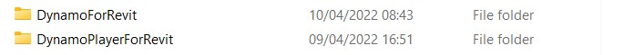
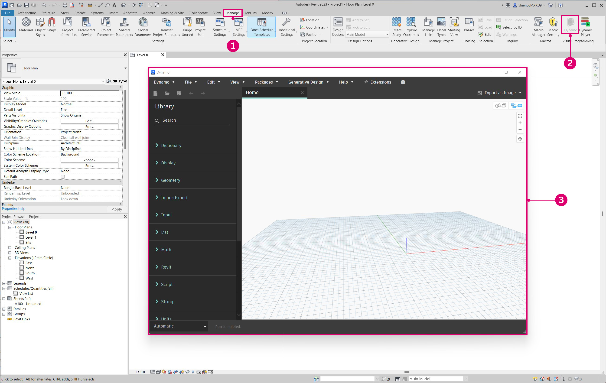

# Générer DynamoRevit à partir de la source 

Les fichiers sources de DynamoRevit sont également hébergés sur DynamoDS Github pour que les développeurs puissent apporter des contributions et générer des versions bêta. Générer DynamoRevit à partir des sources suit généralement le même processus que Dynamo à l’exception de quelques détails importants :

* DynamoRevit fait référence aux assemblages Dynamo, qui doivent donc être générés avec les packages NuGet correspondants. Par exemple, DynamoRevit 2.x ne se chargera pas dans Dynamo 1.3.
* DynamoRevit est spécifique aux versions de Revit, par exemple, la branche DynamoRevit 2018 devrait fonctionner sur Revit 2018.

Pour ce guide, nous utiliserons ce qui suit :

* Revit 2023 ;
* la dernière version de DynamoRevit sur la branche `Revit2023` ;
* la dernière version de Dynamo.

Pour assurer une génération réussie, nous allons cloner et générer les dépôts Dynamo et DynamoRevit pour les utiliser dans ce guide.

_Remarque : générer Dynamo manuellement avant DynamoRevit n’est nécessaire que si vous générez Dynamo 1.x et DynamoRevit 1.x. Les versions plus récentes du dépôt DynamoRevit s’appuient sur le gestionnaire de package NuGet pour les dépendances de Dynamo nécessaires à la génération. Bien qu’une génération de DynamoRevit 2.x ne nécessite pas de tirer Dynamo manuellement, vous aurez toujours besoin du noyau `dlls` ailleurs pour exécuter DynamoRevit `addin`. Il est donc préférable de tirer et de générer Dynamo. Pour en savoir plus, consultez la rubrique ci-dessous :_ [_Générer le dépôt avec Visual Studio_](#building-the-repository-using-Visual-Studio)

#### Localiser le dépôt DynamoRevit sur Github <a href="#locating-the-dynamorevit-repository-on-github" id="locating-the-dynamorevit-repository-on-github"></a>

Le code du projet DynamoRevit se trouve dans un dépôt séparé sur Github du code source principal de Dynamo. Ce dépôt contient les fichiers sources pour les nœuds spécifiques à Revit et le complément Revit qui charge Dynamo. Les générations de DynamoRevit pour différentes versions de Revit (2016, 2017 ou 2018, par exemple) sont organisées comme des branches dans le dépôt.

La source de DynamoRevit est hébergée ici : [https://github.com/DynamoDS/DynamoRevit](https://github.com/DynamoDS/DynamoRevit)


> 1. Cloner ou télécharger le dépôt
> 2. Les branches de DynamoRevit font référence aux versions de Revit

#### Cloner le dépôt en utilisant git <a href="#cloning-the-repository-using-git" id="cloning-the-repository-using-git"></a>

De la même manière que pour le dépôt Dynamo, nous allons utiliser la commande git clone pour cloner DynamoRevit et spécifier la branche qui correspond à notre version de Revit. Pour commencer, nous allons ouvrir une interface en ligne de commande et placer le répertoire courant là où nous voulons cloner les fichiers.

`cd C:\Users\username\Documents\GitHub` change le répertoire actuel

> Remplacez `username` par votre nom d’utilisateur


Nous pouvons maintenant cloner le dépôt dans ce répertoire. Même si nous devons spécifier une branche du dépôt, nous pouvons basculer vers cette branche après le clonage.

`git clone https://github.com/DynamoDS/DynamoRevit.git` clone le dépôt à partir d’une URL distante et bascule par défaut sur la branche master.


Une fois que le clonage du dépôt est terminé, changez le répertoire courant en dossier du dépôt et passez à la branche qui correspond à la version installée de Revit. Pour cet exemple, nous utilisons Revit RC2.13.1_Revit2023. Toutes les branches distantes peuvent être consultées sur la page Github dans le menu déroulant Branche.

`cd C:\Users\username\Documents\GitHub\DynamoRevit` change le répertoire en DynamoRevit. \
`git checkout RC2.13.1_Revit2023` définit la branche actuelle sur `RC2.13.1_Revit2023`.\
`git branch` vérifie la branche sur laquelle nous nous trouvons et affiche les autres branches qui existent localement.


> La branche avec un astérisque est celle qui est en cours d’extraction. La branche `Revit2018` est affichée, car nous l’avons précédemment extraite, elle existe donc localement.

Il est important de choisir la bonne branche du dépôt pour s’assurer que lorsque le projet sera générer dans Visual Studio, il fera référence aux assemblages dans la bonne version du répertoire d’installation de Revit, à savoir `RevitAPI.dll` et `RevitAPIUI.dll`.

#### Générer un dépôt à l’aide de Visual Studio <a href="#building-dynamo-revit" id="building-dynamo-revit"></a>

Avant de générer le dépôt, nous devons restaurer les packages NuGet avec le fichier `restorepackages.bat` situé dans le dossier `src`. Ce fichier .bat utilise le gestionnaire de package [nuget](https://www.nuget.org) pour tirer les fichiers binaires intégrés de Dynamo Core, dont DynamoRevit a besoin. Vous pouvez également choisir de les générer manuellement, à condition de ne faire que des changements dans DynamoRevit et non dans Dynamo Core. Cela permet de démarrer plus rapidement. Veillez à exécuter ce fichier en tant qu’administrateur.


> 1. Cliquez avec le bouton droit de la souris sur `restorepackages.bat` et sélectionnez `Run as administrator`.

Si les packages sont restaurés avec succès, un dossier `packages` sera ajouté au dossier `src` avec les derniers packages NuGet bêta.


> 1. La dernière version bêta des packages Dynamo NuGet

Une fois les packages restaurés, ouvrez le fichier de solution `DynamoRevit.All.sln` Visual Studio dans `src` et générez la solution. La génération peut initialement rencontrer des problèmes pour trouver `AssemblySharedInfo.cs`. Si c’est le cas, exécutez à nouveau la génération pour résoudre ce problème.


> 1. Sélectionnez `Build > Build Solution`.
> 2. Vérifiez que la génération a réussi dans la fenêtre de sortie. Un message devrait indiquer `===== Build: 13 succeeded, 0 failed, 0 up-to-date, 0 skipped =====`.

#### Exécuter une génération locale de DynamoRevit dans Revit <a href="#running-a-local-build-of-dynamorevit-in-revit" id="running-a-local-build-of-dynamorevit-in-revit"></a>

Revit requiert un fichier de complément pour reconnaître DynamoRevit, ce que le [programme d’installation](http://dynamobim.org/download/) créerait automatiquement. Dans le développement, nous devons créer manuellement un fichier de complément qui pointe vers la génération de DynamoRevit que nous voulons utiliser, en particulier l’assemblage `DynamoRevitDS.dll`. Nous devons également faire pointer DynamoRevit vers une génération de Dynamo.

Créez un fichier `Dynamo.addin` dans le dossier des compléments Revit situé dans `C:\ProgramData\Autodesk\Revit\Addins\2023`. Nous avions déjà installé une version de DynamoRevit, nous allons donc simplement éditer le fichier existant pour qu’il pointe vers la nouvelle génération.

```
<?xml version="1.0" encoding="utf-8" standalone="no"?>
<RevitAddIns>
<AddIn Type="Application">
<Name>Dynamo For Revit</Name>
<Assembly>"C:\Users\username\Documents\GitHub\DynamoRevit\bin\AnyCPU\Debug\Revit\DynamoRevitDS.dll"</Assembly>
<AddInId>8D83C886-B739-4ACD-A9DB-1BC78F315B2B</AddInId>
<FullClassName>Dynamo.Applications.DynamoRevitApp</FullClassName>
<VendorId>ADSK</VendorId>
<VendorDescription>Dynamo</VendorDescription>
</AddIn>
</RevitAddIns>
```

* Spécifiez le chemin d’accès au fichier de `DynamoRevitDS.dll` dans `<Assembly>...</Assembly>`.

Nous pouvons également faire en sorte que le complément charge le sélecteur de version au lieu d’un assemblage spécifique.

```
<?xml version="1.0" encoding="utf-8" standalone="no"?>
<RevitAddIns>
<AddIn Type="Application">
<Name>Dynamo For Revit</Name>
<Assembly>"C:\Users\username\Documents\GitHub\DynamoRevit\bin\AnyCPU\Debug\Revit\DynamoRevitVersionSelector.dll"</Assembly>
<AddInId>8D83C886-B739-4ACD-A9DB-1BC78F315B2B</AddInId>
<FullClassName>Dynamo.Applications.VersionLoader</FullClassName>
<VendorId>ADSK</VendorId>
<VendorDescription>Dynamo</VendorDescription>
</AddIn>
</RevitAddIns>
```

* Définissez le chemin d’accès au fichier `<Assembly>...</Assembly>` sur `DynamoRevitVersionSelector.dll`.
* `<FullClassName>...</FullClassName>` spécifie quelle classe doit être instanciée à partir de l’assemblage que nous avons pointé avec le chemin de l’élément d’assemblage ci-dessus. Cette classe sera le point d’entrée de notre complément.

En outre, nous devons supprimer la version existante de Dynamo qui est livrée avec Revit. Pour ce faire, accédez à `C:\\Program Files\Autodesk\Revit 2023\AddIns ` et supprimez les deux dossiers qui contiennent **Dynamo** : `DynamoForRevit` et `DynamoPlayerForRevit`. Vous pouvez les supprimer ou les sauvegarder dans un dossier séparé si vous avez besoin de récupérer la version originale de Dynamo for Revit.



La deuxième étape consiste à ajouter un chemin d’accès au fichier `Dynamo.config` dans le dossier `bin` de DynamoRevit pour les assemblages de Dynamo Core. DynamoRevit les chargera lorsque le complément sera ouvert dans Revit. Ce fichier de configuration vous permet de faire pointer votre complément DynamoRevit vers différentes versions de Dynamo Core pour développer et tester des changements à la fois dans Dynamo Core et dans DynamoRevit.

Le code devrait ressembler à ceci :

```
<?xml version="1.0" encoding="utf-8"?>
<configuration>
  <appSettings>
     <add key="DynamoRuntime" value="C:\Users\username\Documents\GitHub\Dynamo\bin\AnyCPU\Debug"/>
  </appSettings>
</configuration>
```

* Ajoutez le chemin d’accès au répertoire du dossier `bin` à `<add key/>`.

> Nous avons cloné et généré Dynamo juste avant ce guide pour nous assurer qu’il fonctionnera correctement avec DynamoRevit. Le chemin d’accès au répertoire pointe vers cette génération.

Désormais, lorsque nous ouvrons Revit, un complément Dynamo doit se trouver dans l’onglet Gérer.



> 1. Sélectionnez `Manage`
> 2. Cliquez sur l’icône du complément Dynamo
> 3. Une instance de DynamoRevit

Si une boîte de dialogue d’erreur s’affiche et indique des assemblages manquants, il est probable qu’il existe une différence entre les versions de DynamoCore sur lesquelles vous avez effectué la génération et celles que vous chargez au moment de l’exécution. Par exemple, DynamoRevit avec les derniers packages bêta 2.0 de DynamoCore ne fonctionnera pas si vous essayez de le démarrer en utilisant les .dll de Dynamo 1.3. Assurez-vous que les deux dépôts sont de la même version et que DynamoRevit tire une version correspondante des dépendances nuget. Celles-ci sont définies dans le fichier `package.json` du dépôt DynamoRevit.

#### Déboguer DynamoRevit avec Visual Studio <a href="#debugging-dynamorevit-using-visual-studio" id="debugging-dynamorevit-using-visual-studio"></a>

Dans la section précédente, **Générer Dynamo à partir de la source**, nous avons brièvement présenté le débogage dans Visual Studio et la manière d’attacher Visual Studio à un processus. En utilisant une exception dans le nœud Wall.ByCurveAndHeight comme exemple, nous verrons comment s’attacher à un processus, définir des points d’arrêt, parcourir le code et utiliser la pile d’exécution pour déterminer la source de l’exception. Ces outils de débogage s’appliquent généralement aux flux de travail de développement .net et méritent d’être explorés en dehors de ce guide.

* **Attacher au processus** lie une application en cours d’exécution à Visual Studio pour le débogage. Si vous souhaitez déboguer un comportement qui se produit dans une version de DynamoRevit, vous pouvez ouvrir les fichiers source DynamoRevit dans Visual Studio et attacher le processus `Revit.exe`, qui est le processus parent du complément DynamoRevit. Visual Studio utilise un [fichier de symboles](https://msdn.microsoft.com/en-us/library/ms241613.aspx) (`.pbd`) pour faire le lien entre les assemblages que DynamoRevit exécute et le code source.
* **Les points d’arrêt** établissent des lignes dans le code source où l’application fera une pause avant de s’exécuter. Si un nœud provoque le blocage de DynamoRevit ou renvoie un résultat inattendu, nous pouvons ajouter un point d’arrêt à la source du nœud pour mettre le processus en pause, entrer dans le code et inspecter les valeurs en direct des variables jusqu’à ce que nous trouvions la racine du problème.
* **Parcourir le code** permet de parcourir le code source ligne par ligne. Nous pouvons exécuter les fonctions une par une, passer à un appel de fonction ou quitter la fonction en cours d’exécution.
*   **La pile d’exécution** affiche la fonction qu’un processus est en train d’exécuter par rapport aux appels de fonction précédents qui ont invoqué cet appel de fonction. Visual Studio dispose d’une fenêtre Pile d’exécution pour afficher cela. Par exemple, si nous rencontrons une exception en dehors du code source, nous pouvons voir le chemin vers le code appelant dans la pile d’exécution.

    > [2,000 Things You Should Know About C#](https://csharp.2000things.com/2013/05/20/847-how-the-call-stack-works/) (2 000 choses que vous devriez savoir sur le C#) contient des explications plus approfondies des piles d’exécution.

Le nœud **Wall.ByCurveAndHeight** lève une exception lorsqu’il reçoit une PolyCurve comme courbe d’entrée, avec le message suivant : _« To BSPlineCurve Not Implemented »_ (Vers BSPlineCurve, non implémenté). Avec le débogage, nous pouvons comprendre pourquoi exactement le nœud n’accepte pas ce type de géométrie comme entrée pour le paramètre de courbe. Pour cet exemple, nous supposons que DynamoRevit a été généré avec succès et qu’il peut être exécuté en tant que complément pour Revit.


> 1. Le nœud Wall.ByCurveAndHeight lève une exception

Commencez par ouvrir le fichier de solution `DynamoRevit.All.sln`, démarrez Revit et démarrez le complément DynamoRevit. Attachez ensuite Visual Studio au processus Revit à l’aide de la fenêtre `Attach to Process`.


> Revit et DynamoRevit doivent être en cours d’exécution pour apparaître comme un processus disponible.
>
> 1. Ouvrez la fenêtre `Attach to Process` en sélectionnant `Debug > Attach to Process...`
> 2. Définissez `Transport` sur `Default`
> 3. Sélectionnez `Revit.exe`
> 4. Sélectionnez `Attach`

Visual Studio étant attaché à Revit, ouvrez le code source Wall.ByCurveAndHeight dans `Wall.cs`. Nous pouvons le trouver dans l’explorateur de solutions sous `Libraries > RevitNodes > Elements` dans la partie `Public static constructors` du fichier. Définissez un point d’arrêt dans le constructeur du type de mur de sorte que lorsque le nœud est exécuté dans Dynamo, le processus s’interrompt et nous pouvons parcourir chaque ligne de code individuellement. En général, les constructeurs du type Dynamo Zero-Touch commencent par `By<parameters>`.


> 1. Le fichier de classe avec le constructeur pour Wall.ByCurveAndHeight.
> 2. Définissez un point d’arrêt en cliquant à gauche du numéro de ligne ou en cliquant avec le bouton droit de la souris sur la ligne de code et en sélectionnant `Breakpoint > Insert Breakpoint`.

Une fois le point d’arrêt défini, nous devons exécuter le processus avec la fonction Wall.ByCurveAndHeight. La fonction peut être exécutée à nouveau dans Dynamo en reconnectant un fil à l’un de ses ports, ce qui forcera le nœud à s’exécuter à nouveau. Le point d’arrêt sera atteint dans Visual Studio.


> 1. L’icône du point d’arrêt change lorsqu’il est atteint
> 2. La fenêtre de la pile d’exécution montre la méthode suivante

Nous allons maintenant parcourir chaque ligne du constructeur jusqu’à ce que nous rencontrions l’exception. Le code surligné en jaune est la prochaine instruction à exécuter.


> 1. Les outils de débogage pour parcourir le code
> 2. Appuyez sur `Step Over` pour exécuter le code en surbrillance, puis suspendez l’exécution après le retour de la fonction
> 3. La prochaine instruction à exécuter est indiquée par le texte surligné en jaune et la flèche

Si nous continuons à parcourir la fonction, nous atteindrons l’exception qui s’est affichée dans la fenêtre DynamoRevit. En regardant la fenêtre de la pile d’exécution, nous pouvons voir que l’exception a été levée à l’origine à partir d’une méthode appelée `Autodesk.Revit.CurveAPIUtils.CreateNurbsCurve`. Heureusement, l’exception est gérée ici, de sorte que Dynamo ne se bloque pas. Le processus de débogage a permis de contextualiser le problème en nous amenant à une autre méthode dans le code source.

Comme il ne s’agit pas d’une bibliothèque open source, nous ne pouvons pas y apporter de modifications. Maintenant que nous avons plus d’informations, nous pouvons signaler le problème avec plus de contexte en soumettant un [problème](https://guides.github.com/features/issues/) Git ou nous pouvons proposer une solution alternative pour résoudre ce problème en faisant une demande de tirage.


> 1. Lorsque nous atteignons l’instruction à l’origine de l’exception dans `Walls.cs`, le processus de débogage nous rapproche le plus possible de l’origine du problème dans le code utilisateur dans `ProtoToRevitCurve.cs`
> 2. L’instruction à l’origine de l’exception dans `ProtoToRevitCurve.cs`
> 3. Dans la pile d’exécution, nous pouvons voir que l’exception provient d’un code non-utilisateur
> 4. Une fenêtre contextuelle nous donnant des informations sur l’exception

Ce processus peut être appliqué à tous les fichiers sources avec lesquels nous travaillons. Si nous développons une bibliothèque de nœuds Zero-Touch pour Dynamo Studio, nous pouvons ouvrir la source de la bibliothèque et attacher un processus Dynamo pour déboguer la bibliothèque de nœuds. Même si vous ne rencontre pas de problème, le débogage est un excellent moyen d’explorer le code et de découvrir comment les choses fonctionnent.

#### Tirer la dernière version <a href="#pull-latest-build" id="pull-latest-build"></a>

Ce processus est presque identique à celui du tirage de modifications pour Dynamo, sauf que nous devons nous assurer que nous sommes sur la bonne branche. Utilisez la commande `git branch` dans le dépôt DynamoRevit pour voir quelles branches sont disponibles localement et lesquelles sont actuellement vérifiées.

`cd C:\Users\username\Documents\GitHub\DynamoRevit` place le répertoire courant dans le dépôt DynamoRevit. \
 `git branch` vérifie que nous sommes sur la bonne branche, `RC2.13.1_Revit2023`.\
 `git pull origin RC2.13.1_Revit2023` tire les changements de la branche d’origine distante `RC2.13.1_Revit2023`.

L’origine pointe simplement vers l’url originale que nous avons clonée.


> Nous devons être attentifs à la branche actuelle et à la branche de tirage pour éviter de tirer les changements de `RC2.13.1_Revit2023` vers `Revit2018` par exemple.

Comme indiqué dans la section **Générer Dynamo à partir de la source**, lorsque nous sommes prêts à soumettre une modification au dépôt DynamoRevit, nous pouvons créer une demande de tirage en suivant les instructions de l’équipe Dynamo décrites dans la section Demandes de tirage.
