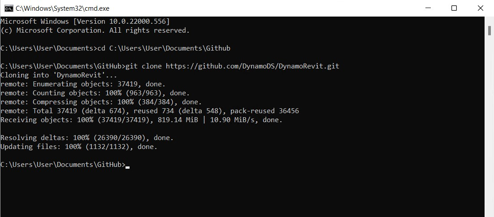
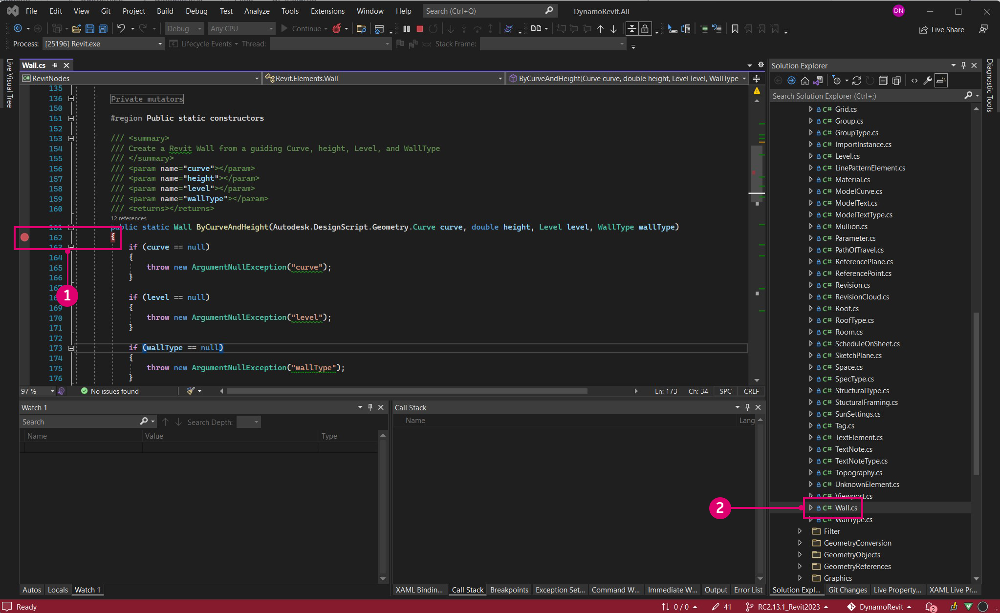

# Compilar o DynamoRevit da origem

Os arquivos de origem do DynamoRevit também estão hospedados no DynamoDS Github para que os desenvolvedores façam contribuições e compilem versões beta. A compilação do DynamoRevit da origem geralmente segue o mesmo processo que o Dynamo, com exceção de alguns detalhes importantes:

* O DynamoRevit faz referência a montagens do Dynamo, portanto, elas devem ser compiladas com pacotes NuGet correspondentes. Por exemplo, o DynamoRevit 2.x não será carregado no Dynamo 1.3.
* O DynamoRevit é específico para as versões do Revit, por exemplo: a ramificação do DynamoRevit 2018 deve ser executada no Revit 2018.

Para este guia, usaremos o seguinte:

* Revit 2023
* A compilação mais recente do DynamoRevit compilada na ramificação `Revit2023`
* A compilação mais recente do Dynamo

Para garantir uma compilação bem-sucedida, clonaremos e compilaremos os repositórios do Dynamo e do DynamoRevit para usar nesta apresentação.

_Observação: A compilação manual do Dynamo antes do DynamoRevit só será necessária se você estiver compilando o Dynamo 1.x e o DynamoRevit 1.x – as versões mais recentes do repositório do DynamoRevit dependem do gerenciador de pacotes do NuGet para as dependências do Dynamo necessárias para a compilação. Embora uma compilação do DynamoRevit 2.x não exija a extração manual do Dynamo, você ainda precisará do `add-in` principal em outro lugar para realmente executar os `dlls` do DynamoRevit. Portanto, vale a pena extrair e compilar o Dynamo. Veja mais abaixo:_ [_Compilar o repositório usando o Visual Studio_](#building-the-repository-using-Visual-Studio)

### Localização do repositório do DynamoRevit no Github <a href="#locating-the-dynamorevit-repository-on-github" id="locating-the-dynamorevit-repository-on-github"></a>

O código do projeto DynamoRevit reside em um repositório separado no Github do código-fonte do Dynamo principal. Esse repositório contém os arquivos de origem para nós específicos do Revit e o complemento do Revit que carrega o Dynamo. As compilações do DynamoRevit para diferentes versões do Revit (2016, 2017 ou 2018, por exemplo) são organizadas como ramificações no repositório.

A origem do DynamoRevit está hospedada aqui: [https://github.com/DynamoDS/DynamoRevit](https://github.com/DynamoDS/DynamoRevit)


> 1. Clonar ou fazer download do repositório
> 2. As ramificações do DynamoRevit fazem referência a versões do Revit

### Clonar o repositório usando o git <a href="#cloning-the-repository-using-git" id="cloning-the-repository-using-git"></a>

Em um processo semelhante ao da extração do repositório do Dynamo, usaremos o comando git clone para clonar o DynamoRevit e especificaremos a ramificação que corresponde à nossa versão do Revit. Para começar, abriremos uma interface de linha de comando e definiremos o diretório atual para o local onde desejamos clonar os arquivos.

`cd C:\Users\username\Documents\GitHub` altera o diretório atual

> Substitua `username` por seu nome de usuário


Agora podemos clonar o repositório para esse diretório. Embora precisemos especificar uma ramificação do repositório, podemos alternar para essa ramificação após a clonagem.

`git clone https://github.com/DynamoDS/DynamoRevit.git` clona o repositório de um URL remoto e, por padrão, alterna para a ramificação mestre.



Quando o repositório tiver terminado a clonagem, altere o diretório atual para a pasta do repositório e alterne para a ramificação que corresponde à versão instalada do Revit. Neste exemplo, estamos usando o Revit RC2.13.1_Revit2023. Todas as ramificações remotas podem ser visualizadas na página do Github no menu suspenso Ramificações.

`cd C:\Users\username\Documents\GitHub\DynamoRevit` altera o diretório para DynamoRevit. \
`git checkout RC2.13.1_Revit2023` define a ramificação atual como `RC2.13.1_Revit2023`.\
 `git branch` verifica em qual ramificação estamos e mostra as outras que existem localmente.


> A ramificação com um asterisco é a que está atualmente verificada. A ramificação `Revit2018` é exibida porque já foi verificada anteriormente e, portanto, ela existe localmente.

É importante escolher a ramificação correta do repositório para assegurar que, quando o projeto for compilado no Visual Studio, ele fará referência a montagens na versão correta do diretório de instalação do Revit, especificamente `RevitAPI.dll` e `RevitAPIUI.dll`.

### Compilar o repositório usando o Visual Studio <a href="#building-dynamo-revit" id="building-dynamo-revit"></a>

Antes de compilar o repositório, precisaremos restaurar os pacotes NuGet com o arquivo `restorepackages.bat` localizado na pasta `src`. Esse arquivo bat usa o gerenciador de pacotes [NuGet](https://www.nuget.org) para extrair os binários compilados do Dynamo Core, necessários para o DynamoRevit. Você também pode optar por compilá-los manualmente, mas se somente estiver fazendo alterações no DynamoRevit e não no núcleo do Dynamo. Isso torna mais rápido começar. Certifique-se de executar esse arquivo como administrador.


> 1. Clicar com o botão direito do mouse em `restorepackages.bat` e selecione `Run as administrator`

Se os pacotes forem restaurados com êxito, uma pasta `packages` será adicionada à pasta `src` com os pacotes beta NuGet mais recentes.


> 1. Os pacotes beta mais recentes do Dynamo NuGet

Com os pacotes restaurados, abra o arquivo de solução `DynamoRevit.All.sln` do Visual Studio em `src` e compile a solução. A compilação pode ter problemas para encontrar `AssemblySharedInfo.cs` inicialmente. Se isso acontecer, a nova execução da compilação resolverá esse problema.


> 1. Selecionar `Build > Build Solution`
> 2. Verificar se a compilação foi bem-sucedida na janela Saída. A mensagem deve ser `===== Build: 13 succeeded, 0 failed, 0 up-to-date, 0 skipped =====`.

### Executar uma compilação local do DynamoRevit no Revit <a href="#running-a-local-build-of-dynamorevit-in-revit" id="running-a-local-build-of-dynamorevit-in-revit"></a>

O Revit requer um arquivo de complemento para reconhecer o DynamoRevit, algo que o [instalador](http://dynamobim.org/download/) criaria automaticamente. Durante o desenvolvimento, precisamos criar manualmente um arquivo de complemento que aponte para a compilação do DynamoRevit que desejamos usar, especificamente a montagem `DynamoRevitDS.dll`. Também precisamos apontar o DynamoRevit para uma compilação do Dynamo.

Crie um arquivo `Dynamo.addin` na pasta de complementos do Revit localizada em `C:\ProgramData\Autodesk\Revit\Addins\2023`. Já tínhamos uma versão do DynamoRevit instalada, portanto, vamos apenas editar o arquivo existente para apontar para a nova compilação.

```
<?xml version="1.0" encoding="utf-8" standalone="no"?>
<RevitAddIns>
<AddIn Type="Application">
<Name>Dynamo For Revit</Name>
<Assembly>"C:\Users\username\Documents\GitHub\DynamoRevit\bin\AnyCPU\Debug\Revit\DynamoRevitDS.dll"</Assembly>
<AddInId>8D83C886-B739-4ACD-A9DB-1BC78F315B2B</AddInId>
<FullClassName>Dynamo.Applications.DynamoRevitApp</FullClassName>
<VendorId>ADSK</VendorId>
<VendorDescription>Dynamo</VendorDescription>
</AddIn>
</RevitAddIns>
```

* Especificar o caminho do arquivo de `DynamoRevitDS.dll` dentro de `<Assembly>...</Assembly>`.

Como alternativa, podemos fazer com que o complemento carregue o seletor de versão em vez de uma montagem específica.

```
<?xml version="1.0" encoding="utf-8" standalone="no"?>
<RevitAddIns>
<AddIn Type="Application">
<Name>Dynamo For Revit</Name>
<Assembly>"C:\Users\username\Documents\GitHub\DynamoRevit\bin\AnyCPU\Debug\Revit\DynamoRevitVersionSelector.dll"</Assembly>
<AddInId>8D83C886-B739-4ACD-A9DB-1BC78F315B2B</AddInId>
<FullClassName>Dynamo.Applications.VersionLoader</FullClassName>
<VendorId>ADSK</VendorId>
<VendorDescription>Dynamo</VendorDescription>
</AddIn>
</RevitAddIns>
```

* Definir o caminho do arquivo `<Assembly>...</Assembly>` como `DynamoRevitVersionSelector.dll`
* `<FullClassName>...</FullClassName>` especifica a classe a ser instanciada da montagem que apontamos com o caminho do elemento de montagem acima. Essa classe será o ponto de entrada de nosso complemento.

Além disso, precisamos remover o Dynamo existente que é fornecido com o Revit. Para fazer isso, vá para `C:\\Program Files\Autodesk\Revit 2023\AddIns ` e remova as duas pastas que contêm o **Dynamo** – `DynamoForRevit` e `DynamoPlayerForRevit`. Será possível excluí-los ou fazer backup deles em uma pasta separada se for necessário recuperar o Dynamo for Revit original.


A segunda etapa é adicionar um caminho de arquivo para as montagens principais do Dynamo ao arquivo `Dynamo.config` na pasta `bin` do DynamoRevit. O DynamoRevit carregará essas montagens quando o complemento for aberto no Revit. Esse arquivo de configuração permite apontar o complemento do DynamoRevit para diferentes versões do núcleo do Dynamo para desenvolver e testar as alterações no núcleo e no DynamoRevit.

O código deve se parecer com o seguinte:

```
<?xml version="1.0" encoding="utf-8"?>
<configuration>
  <appSettings>
     <add key="DynamoRuntime" value="C:\Users\username\Documents\GitHub\Dynamo\bin\AnyCPU\Debug"/>
  </appSettings>
</configuration>
```

* Adicionar o caminho do diretório da pasta `bin` a `<add key/>`

> Clonamos e compilamos o Dynamo logo antes dessa apresentação para garantir que ele funcionará bem com o DynamoRevit. O caminho do diretório aponta para essa compilação.

Agora, quando abrimos o Revit, deverá haver um complemento do Dynamo localizado na guia Gerenciar.


> 1. Selecionar `Manage`
> 2. Clicar no ícone do complemento do Dynamo
> 3. Uma instância do DynamoRevit

Se uma janela de caixa de diálogo de erro aparecer mostrando montagens ausentes, é provável que tenha havido uma incompatibilidade entre as versões do DynamoCore compiladas e as que estão sendo carregadas no tempo de execução. Por exemplo, o DynamoRevit com os pacotes beta 2.0 mais recentes do DynamoCore não funcionará se você tentar iniciá-lo usando os dlls do Dynamo 1.3. Certifique-se de que ambos os repositórios sejam da mesma versão e que o DynamoRevit esteja extraindo uma versão correspondente das dependências do NuGet. Essas são definidas no arquivo `package.json` do repositório do DynamoRevit.

### Depurar o DynamoRevit usando o Visual Studio <a href="#debugging-dynamorevit-using-visual-studio" id="debugging-dynamorevit-using-visual-studio"></a>

Na seção anterior, **Compilar o Dynamo da origem**, apresentamos brevemente a depuração no Visual Studio e como anexar o Visual Studio a um processo. Usando uma exceção no nó Wall.ByCurveAndHeight como exemplo, vamos analisar como anexar a um processo, definir pontos de quebra, passar pelo código e usar a pilha de chamadas para determinar a origem da exceção. Essas ferramentas de depuração geralmente se aplicam aos fluxos de trabalho de desenvolvimento do .net e vale a pena explorá-los fora deste guia.

* **Anexar ao processo** vincula um aplicativo em execução ao Visual Studio para depuração. Se quisermos depurar o comportamento que ocorre em uma compilação do DynamoRevit, poderemos abrir os arquivos de origem do DynamoRevit no Visual Studio e anexar o processo `Revit.exe`, que é o processo principal do complemento DynamoRevit. O Visual Studio usa um [arquivo de símbolo](https://msdn.microsoft.com/en-us/library/ms241613.aspx) (`.pbd`) para fazer a conexão entre as montagens que o DynamoRevit está executando e o código-fonte.
* **Pontos de quebra**: estabelecem linhas no código-fonte onde o aplicativo pausará antes da execução. Se um nó estiver causando um erro fatal do DynamoRevit ou retornar um resultado inesperado, poderemos adicionar um ponto de quebra à origem do nó para pausar o processo, entrar no código e inspecionar os valores ao vivo das variáveis até que encontremos a causa do problema
* **Passar pelo código** explica a origem, linha por linha. Podemos executar funções uma a uma, entrar em uma chamada de função ou sair da função que estamos executando no momento.
*   A **pilha de chamadas** mostra a função que um processo está executando no momento em relação às chamadas de função anteriores que invocaram essa chamada de função. O Visual Studio tem uma janela Pilha de chamadas para exibir isso. Por exemplo, se ocorrer uma exceção fora do código-fonte, poderemos ver o caminho para o código de chamada na pilha de chamadas.

    > [2,000 Things You Should Know About C#](https://csharp.2000things.com/2013/05/20/847-how-the-call-stack-works/) (2.000 coisas que você deve saber sobre C#) têm uma explicação mais detalhada das pilhas de chamadas

O nó **Wall.ByCurveAndHeight** gera uma exceção quando recebe uma PolyCurve como sua entrada de curva com a mensagem: _“Para BSPlineCurve não implementado”_. Com a depuração, podemos descobrir por que exatamente o nó não aceitará esse tipo de geometria como uma entrada para o parâmetro de curva. Neste exemplo, estamos assumindo que o DynamoRevit foi criado com êxito e pode ser executado como um complemento do Revit.


> 1. O nó Wall.ByCurveAndHeight está gerando uma exceção

Comece abrindo o arquivo de solução `DynamoRevit.All.sln`, inicie o Revit e inicie o complemento DynamoRevit. Em seguida, anexe o Visual Studio ao processo do Revit com a janela `Attach to Process`.


> O Revit e o Dynamo Revit precisam estar em execução para serem exibidos como um processo disponível
>
> 1. Abrir a janela `Attach to Process` selecionando `Debug > Attach to Process...`
> 2. Definir `Transport` como `Default`
> 3. Selecionar `Revit.exe`
> 4. Selecionar `Attach`

Com o Visual Studio anexado ao Revit, abra o código-fonte Wall.ByCurveAndHeight em `Wall.cs`. Podemos encontrar isso no Gerenciador de soluções em `Libraries > RevitNodes > Elements` na região `Public static constructors` do arquivo. Defina um ponto de quebra no construtor do tipo de parede para que quando o nó for executado no Dynamo, o processo seja interrompido e possamos percorrer cada linha de código individualmente. Normalmente, os construtores do tipo sem toque do Dynamo começam com `By<parameters>`.



> 1. O arquivo de classe com o construtor para Wall.ByCurveAndHeight
> 2. Defina um ponto de quebra clicando à esquerda do número da linha ou clicando com o botão direito do mouse na linha de código e selecione `Breakpoint > Insert Breakpoint`.

Com o ponto de quebra definido, precisamos que o processo seja executado através da função Wall.ByCurveAndHeight. A função pode ser executada novamente no Dynamo reconectando um fio a uma de suas portas, o que forçará o nó a ser executado novamente. O ponto de quebra será atingido no Visual Studio.


> 1. O ícone do ponto de quebra muda quando é pressionado
> 2. A janela Pilha de chamadas mostrando o método ativo seguinte

Agora, passe o cursor sobre cada linha no construtor até que a exceção seja atingida. O código realçado em amarelo é a próxima declaração a ser executada.


> 1. As ferramentas de depuração para navegação no código
> 2. Pressionar `Step Over` para executar o código realçado e, em seguida, suspender a execução após a função retornar
> 3. A próxima instrução a ser executada, indicada pelo realce e pela seta amarelas

Se continuarmos a percorrer a função, veremos a exceção exibida na janela do DynamoRevit. Observando a janela Pilha de chamadas, poderemos ver que a exceção foi originalmente acionada com base em um método chamado `Autodesk.Revit.CurveAPIUtils.CreateNurbsCurve`. Felizmente, a exceção é tratada aqui, portanto, o Dynamo não teve um erro fatal. O processo de depuração forneceu contexto para o problema, trazendo-nos para outro método no código-fonte.

Como não é uma biblioteca de código aberto, não poderemos fazer alterações. Agora que temos mais informações, poderemos relatar o problema com mais contexto preenchendo um [problema](https://guides.github.com/features/issues/) do github ou poderemos propor uma solução alternativa para esse problema, fazendo uma solicitação de extração.


> 1. Quando pressionamos a instrução que causa a exceção em `Walls.cs`, o processo de depuração nos aproxima o mais possível da causa do problema no código do usuário dentro de `ProtoToRevitCurve.cs`
> 2. A declaração que causou a exceção em `ProtoToRevitCurve.cs`
> 3. Na Pilha de chamadas, podemos ver que a exceção é proveniente do código que não é do usuário
> 4. Uma janela pop-up que nos fornece informações sobre a exceção

Esse processo pode ser aplicado a qualquer arquivo de origem com o qual estamos trabalhando. Se estivermos desenvolvendo uma biblioteca de nós sem toque para o Dynamo Studio, poderemos abrir a origem da biblioteca e anexar um processo do Dynamo para depurar a biblioteca de nós. Mesmo que tudo funcione perfeitamente, a depuração é uma ótima maneira de explorar o código e descobrir como as coisas estão funcionando.

### Extrair a compilação mais recente <a href="#pull-latest-build" id="pull-latest-build"></a>

Esse processo é quase idêntico à extração de alterações para o Dynamo, exceto que precisaremos garantir que estamos na ramificação correta. Use o comando `git branch` no repositório do DynamoRevit para ver quais ramificações estão disponíveis localmente e quais estão desmarcadas.

`cd C:\Users\username\Documents\GitHub\DynamoRevit` define o diretório atual para o repositório do DynamoRevit. \
`git branch` verifica se estamos na ramificação correta, `RC2.13.1_Revit2023`.\
 `git pull origin RC2.13.1_Revit2023` extrai as alterações da ramificação `RC2.13.1_Revit2023` da origem remota.

A origem simplesmente aponta para a URL original que clonamos.


> Temos de ter certeza de qual é a ramificação em que estamos atualmente e qual é a que estamos extraindo para evitar, por exemplo, a extração de alterações de `RC2.13.1_Revit2023` para `Revit2018`.

Conforme mencionado em **Compilar o Dynamo da origem**, quando estivermos prontos para enviar uma alteração ao repositório do DynamoRevit, poderemos criar uma solicitação de extração seguindo as diretrizes da equipe do Dynamo definidas na seção Solicitações de extração.
