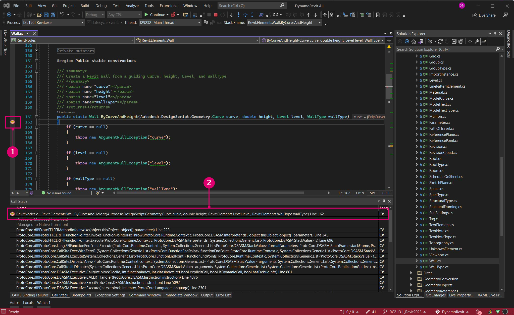
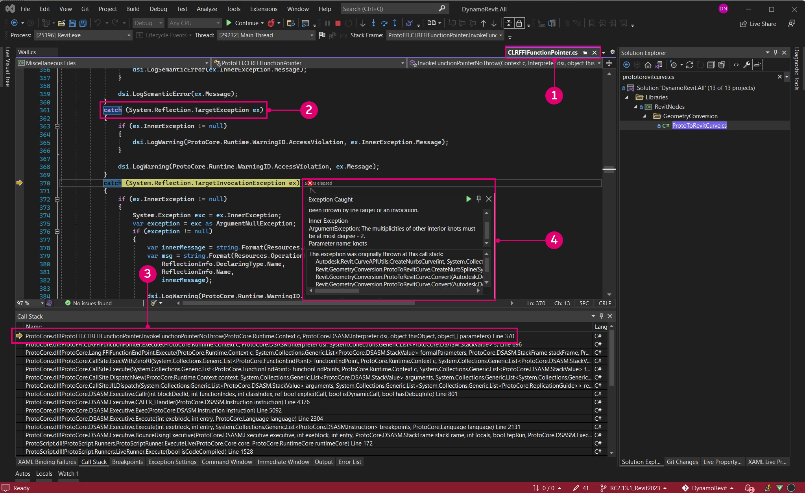

# Erstellen von DynamoRevit aus Quelldateien

Die DynamoRevit-Quelldateien werden auch im DynamoDS-GitHub gehostet, damit Entwickler Beiträge einbringen und Beta-Versionen erstellen können. Die Erstellung von DynamoRevit aus Quelldateien folgt im Allgemeinen dem gleichen Prozess wie bei Dynamo, mit Ausnahme einiger wichtiger Details:

* DynamoRevit referenziert Dynamo-Assemblys. Diese sollten daher mit entsprechenden NuGet-Paketen erstellt werden. DynamoRevit 2.x lässt sich beispielsweise nicht in Dynamo 1.3 laden.
* DynamoRevit ist für bestimmte Revit-Versionen spezifisch. Beispiel: Die Verzweigung DynamoRevit 2018 muss unter Revit 2018 ausgeführt werden.

In diesem Handbuch verwenden wir folgende Versionen:

* Revit 2023
* Den neuesten DynamoRevit-Build in der Verzweigung `Revit2023`
* Den neuesten Dynamo-Build

Um einen erfolgreichen Build zu gewährleisten, werden sowohl das Dynamo- als auch das DynamoRevit-Repository, die für diese exemplarische Vorgehensweise verwendet werden, geklont und erstellt.

_Anmerkung: Die manuelle Erstellung von Dynamo vor DynamoRevit ist nur erforderlich, wenn Sie Dynamo 1.x und DynamoRevit 1.x erstellen. Neuere Versionen des DynamoRevit-Repositorys basieren auf dem NuGet-Paket-Manager für die zum Erstellen erforderlichen Dynamo-Abhängigkeiten. Auch wenn beim Build DynamoRevit 2.x kein manueller Abruf von Dynamo erforderlich ist, benötigen Sie die `dlls`-Kerndateien dennoch an anderer Stelle, um das DynamoRevit-`add-in` auszuführen. Es lohnt sich also, Dynamo dennoch abzurufen und zu erstellen. Weitere Informationen finden Sie unten:_ [_Erstellen des Repositorys mit Visual Studio_](#building-the-repository-using-Visual-Studio)

### Suchen des DynamoRevit-Repositorys auf GitHub <a href="#locating-the-dynamorevit-repository-on-github" id="locating-the-dynamorevit-repository-on-github"></a>

Der Code für das DynamoRevit-Projekt befindet sich in einem separaten Repository auf GitHub, nicht in dem Repository, in dem sich der Dynamo-Kernquellcode befindet. Dieses Repository enthält die Quelldateien für Revit-spezifische Blöcke und das Revit-Zusatzmodul, das Dynamo lädt. Builds von DynamoRevit für verschiedene Versionen von Revit (z. B. 2016, 2017 oder 2018) sind im Repository als Verzweigungen angeordnet.

Die DynamoRevit-Quelldateien befinden sich hier: [https://github.com/DynamoDS/DynamoRevit](https://github.com/DynamoDS/DynamoRevit).


> 1. Klonen oder laden Sie das Repository herunter.
> 2. Die DynamoRevit-Verzweigungen referenzieren Revit-Versionen.

### Klonen des Repositorys mithilfe von Git <a href="#cloning-the-repository-using-git" id="cloning-the-repository-using-git"></a>

Ähnlich wie beim Abrufen des Dynamo-Repositorys verwenden wir den Git-Befehl zum Klonen, um DynamoRevit zu klonen und die Verzweigung anzugeben, die unserer Revit-Version entspricht. Zunächst öffnen wir eine Befehlszeilenschnittstelle und legen das aktuelle Verzeichnis auf den Speicherort fest, an den wir die Dateien klonen möchten.

`cd C:\Users\username\Documents\GitHub` ändert das aktuelle Verzeichnis.

> Ersetzen Sie `username` durch Ihren Benutzernamen.


Jetzt können wir das Repository in dieses Verzeichnis klonen. Wir müssen eine Verzweigung des Repositorys angeben. Wir können jedoch nach dem Klonen zu dieser Verzweigung wechseln.

`git clone https://github.com/DynamoDS/DynamoRevit.git` klont das Repository von einer Remote-URL und wechselt vorgabemäßig zur Hauptverzweigung.


Nachdem das Klonen des Repositorys abgeschlossen ist, ändern Sie das aktuelle Verzeichnis in den Repository-Ordner, und wechseln Sie zu der Verzweigung, die der installierten Version von Revit entspricht. In diesem Beispiel wird Revit RC2.13.1_Revit2023 verwendet. Alle Remote-Verzweigungen können auf der GitHub-Seite im Dropdown-Menü Branch angezeigt werden.

`cd C:\Users\username\Documents\GitHub\DynamoRevit` ändert das Verzeichnis in DynamoRevit.\
 `git checkout RC2.13.1_Revit2023` setzt die aktuelle Verzweigung auf `RC2.13.1_Revit2023`.\
 `git branch` überprüft, in welcher Verzweigung wir uns befinden, und zeigt die anderen Verzweigungen an, die lokal verfügbar sind.


> Die Verzweigung mit einem Sternchen ist die derzeit ausgecheckte Verzweigung. Die Verzweigung `Revit2018` wird angezeigt, da wir diese zuvor ausgecheckt haben, sodass sie lokal verfügbar ist.

Es ist wichtig, die richtige Verzweigung des Repositorys zu wählen, um sicherzustellen, dass beim Erstellen des Projekts in Visual Studio Assemblys in der richtigen Version des Revit-Installationsverzeichnisses referenziert werden, insbesondere `RevitAPI.dll` und `RevitAPIUI.dll`.

### Erstellen des Repositorys mit Visual Studio <a href="#building-dynamo-revit" id="building-dynamo-revit"></a>

Bevor wir das Repository erstellen, müssen wir die NuGet-Pakete mit der Datei `restorepackages.bat` im Ordner `src` wiederherstellen. Diese BAT-Datei verwendet den [NuGet](https://www.nuget.org) Package Manager, um die für DynamoRevit erforderlichen, erstellten Binärdateien von Dynamo Core abzurufen. Sie können diese auch manuell erstellen, aber nur, wenn Sie nur Änderungen an DynamoRevit und nicht an Dynamo Core vornehmen. So können Sie schneller durchstarten. Führen Sie diese Datei als Administrator aus.


> 1. Klicken Sie mit der rechten Maustaste auf `restorepackages.bat`, und wählen Sie `Run as administrator`.

Wenn die Pakete erfolgreich wiederhergestellt wurden, wird ein `packages`-Ordner mit den neuesten NuGet-Beta-Paketen zum Ordner `src` hinzugefügt.


> 1. Die neuesten Dynamo-NuGet-Beta-Pakete

Nachdem die Pakete wiederhergestellt wurden, öffnen Sie die Visual Studio-Projektmappendatei `DynamoRevit.All.sln` in `src`, und erstellen Sie die Projektmappe. Der Build kann `AssemblySharedInfo.cs` möglicherweise zunächst nicht finden. Wenn dies der Fall ist, kann dieses Problem durch erneutes Ausführen des Builds behoben werden.


> 1. Wählen Sie `Build > Build Solution` aus.
> 2. Überprüfen Sie im Ausgabefenster, ob die Erstellung erfolgreich war. Es sollte eine Meldung ähnlich der folgenden angezeigt werden: `===== Build: 13 succeeded, 0 failed, 0 up-to-date, 0 skipped =====`.

### Ausführen eines lokalen Builds von DynamoRevit in Revit <a href="#running-a-local-build-of-dynamorevit-in-revit" id="running-a-local-build-of-dynamorevit-in-revit"></a>

Revit benötigt eine Zusatzmoduldatei, um DynamoRevit zu erkennen. Diese würde vom [Installationsprogramm](http://dynamobim.org/download/) automatisch erstellt. In der Entwicklung müssen wir manuell eine Zusatzmoduldatei erstellen, die auf den gewünschten Build von DynamoRevit verweist, insbesondere auf die Assembly `DynamoRevitDS.dll`. Außerdem müssen wir DynamoRevit auf einen Dynamo-Build verweisen.

Erstellen Sie eine `Dynamo.addin`-Datei im Zusatzmodulordner von Revit, der sich unter `C:\ProgramData\Autodesk\Revit\Addins\2023` befindet. Wir haben bereits eine Version von DynamoRevit installiert, daher bearbeiten wir einfach die vorhandene Datei, um auf den neuen Build zu verweisen.

```
<?xml version="1.0" encoding="utf-8" standalone="no"?>
<RevitAddIns>
<AddIn Type="Application">
<Name>Dynamo For Revit</Name>
<Assembly>"C:\Users\username\Documents\GitHub\DynamoRevit\bin\AnyCPU\Debug\Revit\DynamoRevitDS.dll"</Assembly>
<AddInId>8D83C886-B739-4ACD-A9DB-1BC78F315B2B</AddInId>
<FullClassName>Dynamo.Applications.DynamoRevitApp</FullClassName>
<VendorId>ADSK</VendorId>
<VendorDescription>Dynamo</VendorDescription>
</AddIn>
</RevitAddIns>
```

* Geben Sie den Dateipfad von `DynamoRevitDS.dll` in `<Assembly>...</Assembly>` an.

Alternativ können wir auch festlegen, dass das Zusatzmodul die Versionsauswahl anstelle einer bestimmten Assembly lädt.

```
<?xml version="1.0" encoding="utf-8" standalone="no"?>
<RevitAddIns>
<AddIn Type="Application">
<Name>Dynamo For Revit</Name>
<Assembly>"C:\Users\username\Documents\GitHub\DynamoRevit\bin\AnyCPU\Debug\Revit\DynamoRevitVersionSelector.dll"</Assembly>
<AddInId>8D83C886-B739-4ACD-A9DB-1BC78F315B2B</AddInId>
<FullClassName>Dynamo.Applications.VersionLoader</FullClassName>
<VendorId>ADSK</VendorId>
<VendorDescription>Dynamo</VendorDescription>
</AddIn>
</RevitAddIns>
```

* Legen Sie den Dateipfad für `<Assembly>...</Assembly>` auf `DynamoRevitVersionSelector.dll` fest.
* `<FullClassName>...</FullClassName>` gibt an, welche Klasse aus der Assembly instanziiert werden soll, auf die mit dem oben angegebenen Assembly-Elementpfad verwiesen wurde. Diese Klasse wird als Einstiegspunkt für das Zusatzmodul verwendet.

Außerdem müssen wir die vorhandene Dynamo-Version entfernen, die im Lieferumfang von Revit enthalten ist. Wechseln Sie dazu zu `C:\\Program Files\Autodesk\Revit 2023\AddIns `, und entfernen Sie die beiden Ordner, die **Dynamo** enthalten: `DynamoForRevit` und `DynamoPlayerForRevit`. Sie können sie entweder löschen oder in einem separaten Ordner sichern, wenn Sie die Originalversion von Dynamo for Revit wiederherstellen müssen.


Der zweite Schritt besteht darin, einen Dateipfad für die Dynamo Core-Assemblys zur Datei `Dynamo.config` im Ordner `bin` von DynamoRevit hinzuzufügen. DynamoRevit lädt diese, wenn das Zusatzmodul in Revit geöffnet wird. In dieser Konfigurationsdatei können Sie Ihr DynamoRevit-Zusatzmodul auf verschiedene Versionen von Dynamo Core verweisen lassen, um Änderungen sowohl in Core als auch in DynamoRevit zu entwickeln und zu testen.

Der Code sollte wie folgt aussehen:

```
<?xml version="1.0" encoding="utf-8"?>
<configuration>
  <appSettings>
     <add key="DynamoRuntime" value="C:\Users\username\Documents\GitHub\Dynamo\bin\AnyCPU\Debug"/>
  </appSettings>
</configuration>
```

* Fügen Sie den Verzeichnispfad des Ordners `bin` zu `<add key/>` hinzu.

> Wir haben Dynamo direkt vor dieser exemplarischen Vorgehensweise geklont und erstellt, um sicherzustellen, dass Dynamo gut mit DynamoRevit funktioniert. Der Verzeichnispfad verweist auf diesen Build.

Wenn wir jetzt Revit öffnen, sollte sich auf der Registerkarte Verwalten ein Dynamo-Zusatzmodul befinden.


> 1. Wählen Sie `Manage` aus.
> 2. Klicken Sie auf das Symbol für das Dynamo-Zusatzmodul.
> 3. Eine Instanz von DynamoRevit.

Wenn ein Fehler-Dialogfeld mit fehlenden Assemblys angezeigt wird, ist es wahrscheinlich, dass ein Konflikt zwischen den von Ihnen erstellten Versionen von DynamoCore und den Versionen, die Sie zur Laufzeit laden, aufgetreten ist. Beispiel: DynamoRevit mit den neuesten 2.0-Beta-Paketen von DynamoCore funktioniert nicht, wenn Sie versuchen, die Anwendung mit Dynamo 1.3-DLL-Dateien zu starten. Stellen Sie sicher, dass beide Repositorys dieselbe Version aufweisen und DynamoRevit eine übereinstimmende Version der NutGet-Abhängigkeiten abruft. Diese werden in der Datei `package.json` des DynamoRevit-Repositorys definiert.

### Debugging in DynamoRevit mithilfe von Visual Studio <a href="#debugging-dynamorevit-using-visual-studio" id="debugging-dynamorevit-using-visual-studio"></a>

Im vorherigen Abschnitt **Erstellen von Dynamo aus Quelldateien** haben wir das Debugging in Visual Studio kurz vorgestellt und beschrieben, wie Visual Studio an einen Prozess angehängt werden kann. Anhand einer Beispielausnahme im Block Wall.ByCurveAndHeight werden Sie durch das Anhängen an einen Prozess, das Festlegen von Haltepunkten, das Durchgehen durch Code und das Ermitteln der Quelle der Ausnahme mithilfe der Aufrufliste geführt. Diese Debugging-Werkzeuge gelten generell für .NET-Entwicklungsarbeitsabläufe. Daher ist es sinnvoll, sich außerhalb dieses Handbuchs eingehender mit diesen zu beschäftigen.

* **An den Prozess anhängen**: Hierbei wird eine laufende Anwendung zum Debuggen mit Visual Studio verknüpft. Wenn wir für das Verhalten in einem Build von DynamoRevit eine Fehlerbehebung durchführen möchten, können wir die DynamoRevit-Quelldateien in Visual Studio öffnen und den `Revit.exe`-Prozess anhängen. Dies ist der übergeordnete Prozess des DynamoRevit-Zusatzmoduls. Visual Studio verwendet eine [Symboldatei](https://msdn.microsoft.com/de-de/library/ms241613.aspx) (`.pbd`), um die Verbindung zwischen den Assemblys, die DynamoRevit ausführt, und dem Quellcode herzustellen.
* **Haltepunkte** definieren im Quellcode Zeilen, an denen die Anwendung vor dem Ausführen angehalten wird. Wenn ein Block einen Absturz von DynamoRevit verursacht oder ein unerwartetes Ergebnis zurückgibt, können wir einen Haltepunkt zur Quelle des Blocks hinzufügen, um den Vorgang anzuhalten, den Code einzusehen und die Live-Werte der Variablen zu überprüfen, bis wir die Ursache des Problems gefunden haben.
* **Code durchgehen**: Hierbei wird die Quelle Zeile für Zeile durchlaufen. Wir können Funktionen nacheinander ausführen, einen Funktionsaufruf schrittweise ausführen oder die gerade ausgeführte Funktion verlassen.
*   **Die Aufrufliste** zeigt die Funktion an, die derzeit von einem Prozess ausgeführt wird, im Vergleich zu den vorherigen Funktionsaufrufen, die diesen Funktionsaufruf veranlasst haben. Visual Studio verfügt über ein Aufruflistenfenster, um dies anzuzeigen. Wenn wir beispielsweise eine Ausnahme außerhalb des Quellcodes erreichen, können wir den Pfad zum aufrufenden Code in der Aufrufliste sehen.

    > Im Artikel [2,000 Things You Should Know About C#](https://csharp.2000things.com/2013/05/20/847-how-the-call-stack-works/) erhalten Sie eine ausführlichere Erläuterung zu Aufruflisten.

Der Block **Wall.ByCurveAndHeight** gibt eine Ausnahme mit der folgenden Meldung aus, wenn er eine PolyCurve als Kurveneingabe erhält: _To BSPlineCurve Not Implemented_. Durch das Debugging können wir herausfinden, warum genau der Block diesen Geometrietyp nicht als Eingabe für den Kurvenparameter akzeptiert. In diesem Beispiel wird davon ausgegangen, dass DynamoRevit erfolgreich erstellt wurde und als Zusatzmodul für Revit ausgeführt werden kann.


> 1. Der Block Wall.ByCurveAndHeight löst eine Ausnahme aus.

Öffnen Sie zunächst die Projektmappendatei `DynamoRevit.All.sln`, starten Sie Revit, und starten Sie dann das DynamoRevit-Zusatzmodul. Hängen Sie anschließend im Fenster `Attach to Process` Visual Studio an den Revit-Prozess an.


> Revit und DynamoRevit müssen ausgeführt werden, um als verfügbare Prozesse angezeigt zu werden.
>
> 1. Öffnen Sie das Fenster `Attach to Process` durch Auswahl von `Debug > Attach to Process...`.
> 2. Legen Sie `Transport` auf `Default` fest.
> 3. Wählen Sie `Revit.exe` aus.
> 4. Wählen Sie `Attach` aus.

Wenn Visual Studio an Revit angehängt ist, öffnen Sie den Wall.ByCurveAndHeight-Quellcode in `Wall.cs`. Wir finden diesen im Projektmappen-Explorer unter `Libraries > RevitNodes > Elements` im Bereich `Public static constructors` der Datei. Legen Sie im Konstruktor des Wandtyps einen Haltepunkt fest, sodass bei Ausführung eines Blocks in Dynamo der Prozess unterbrochen wird und wir die Codezeilen einzeln durchgehen können. Normalerweise beginnen Dynamo-Konstruktoren vom Typ Zero-Touch mit `By<parameters>`.


> 1. Die Klassendatei mit dem Konstruktor für Wall.ByCurveAndHeight.
> 2. Legen Sie einen Haltepunkt fest, indem Sie entweder links neben die Zeilennummer klicken oder mit der rechten Maustaste auf die Codezeile klicken und `Breakpoint > Insert Breakpoint` auswählen.

Nachdem der Haltepunkt festgelegt wurde, muss der Prozess durch die Funktion Wall.ByCurveAndHeight laufen. Die Funktion kann in Dynamo erneut ausgeführt werden, indem erneut eine Verbindung mit einem der Anschlüsse hergestellt wird. Dadurch wird eine erneute Ausführung des Blocks erzwungen. Der Haltepunkt wird in Visual Studio erreicht.



> 1. Das Symbol für den Haltepunkt ändert sich, wenn er erreicht wird.
> 2. Das Fenster mit der Aufrufliste zeigt die als Nächstes angewendete Methode.

Überspringen Sie nun die einzelnen Zeilen im Konstruktor, bis die Ausnahme erreicht wird. Der gelb hervorgehobene Code ist die nächste auszuführende Anweisung.


> 1. Die Debugging-Werkzeuge für die Navigation im Code.
> 2. Drücken Sie `Step Over`, um den markierten Code auszuführen, und unterbrechen Sie dann die Ausführung, nachdem die Funktion zurückgegeben wurde.
> 3. Die nächste auszuführende Anweisung, angegeben durch die gelbe Hervorhebung und den Pfeil.

Wenn wir weiter durch die Funktion gehen, erreichen wir die Ausnahme, die im DynamoRevit-Fenster angezeigt wird. Im Fenster mit der Aufrufliste können wir sehen, dass die Ausnahme ursprünglich von einer Methode mit dem Namen `Autodesk.Revit.CurveAPIUtils.CreateNurbsCurve` ausgelöst wurde. Glücklicherweise wird die Ausnahme hier verarbeitet, sodass Dynamo nicht abgestürzt ist. Der Debugging-Prozess hat den Kontext für das Problem zugänglich gemacht, indem eine andere Methode im Quellcode ermittelt wurde.

Da dies keine Open-Source-Bibliothek ist, können wir dort keine Änderungen vornehmen. Jetzt, da wir über weitere Informationen verfügen, können wir das Problem mit mehr Kontext melden, indem wir eine GitHub-[Anfrage](https://docs.github.com/de/issues/tracking-your-work-with-issues/about-issues) übermitteln. Oder wir können eine Lösung für dieses Problem vorschlagen, indem wir eine Pull-Anforderung stellen.



> 1. Wenn wir in `Walls.cs` auf die Anweisung treffen, die die Ausnahme verursacht, gelangen wir durch den Debugging-Prozess so nah wie möglich an die Ursache des Problems im Benutzercode in `ProtoToRevitCurve.cs`.
> 2. Die Anweisung, die die Ausnahme in `ProtoToRevitCurve.cs` verursacht.
> 3. In der Aufrufliste sehen wir, dass die Ausnahme aus Nichtbenutzercode stammt.
> 4. Ein Popup-Fenster mit Informationen zur Ausnahme.

Dieser Vorgang kann auf alle Quelldateien angewendet werden, mit denen wir arbeiten. Wenn wir eine Bibliothek mit Zero-Touch-Blöcken für Dynamo Studio entwickeln, können wir die Quelle der Bibliothek öffnen und einen Dynamo-Prozess anhängen, um für die Blockbibliothek ein Debugging durchzuführen. Auch wenn alles perfekt funktioniert, ist das Debugging eine gute Möglichkeit, Code zu prüfen und herauszufinden, wie bestimmte Aspekte funktionieren.

### Abrufen des neuesten Builds <a href="#pull-latest-build" id="pull-latest-build"></a>

Dieser Vorgang ist fast identisch mit dem Abrufen von Änderungen für Dynamo, mit der Ausnahme, dass wir sicherstellen müssen, dass wir uns in der richtigen Verzweigung befinden. Verwenden Sie den Befehl `git branch` im DynamoRevit-Repository, um zu sehen, welche Verzweigungen lokal verfügbar und welche derzeit ausgecheckt sind.

`cd C:\Users\username\Documents\GitHub\DynamoRevit` legt das aktuelle Verzeichnis auf das DynamoRevit-Repository fest.\
 `git branch` überprüft, ob wir uns in der richtigen Verzweigung, `RC2.13.1_Revit2023`, befinden.\
 `git pull origin RC2.13.1_Revit2023` ruft Änderungen aus der Remote-Ursprungsverzweigung `RC2.13.1_Revit2023` ab.

Der Ursprung verweist einfach auf die ursprüngliche URL, die wir geklont haben.


> Wir sollten hier sorgsam darauf achten, in welcher Verzweigung wir uns gerade befinden und von welcher Verzweigung wir Daten abrufen, um zu vermeiden, dass Änderungen beispielsweise von `RC2.13.1_Revit2023` in `Revit2018` abgerufen werden.

Wie unter **Erstellen von Dynamo aus Quelldateien** erwähnt, können wir eine Pull-Anforderung erstellen, wenn wir bereit sind, eine Änderung an das DynamoRevit-Repository zu übermitteln. Dabei folgen wir den Richtlinien des Dynamo-Teams, die im Abschnitt zu Pull-Anforderungen beschrieben werden.
