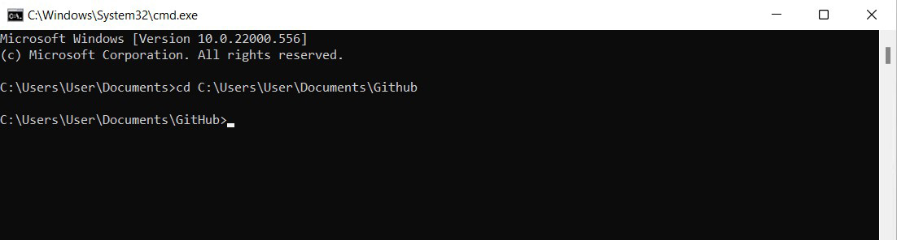
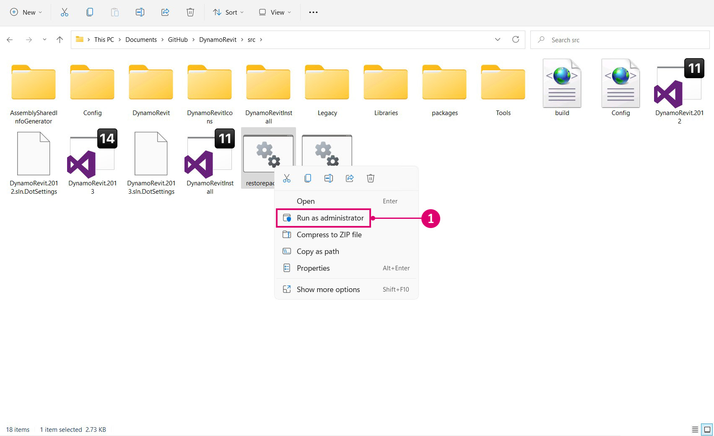
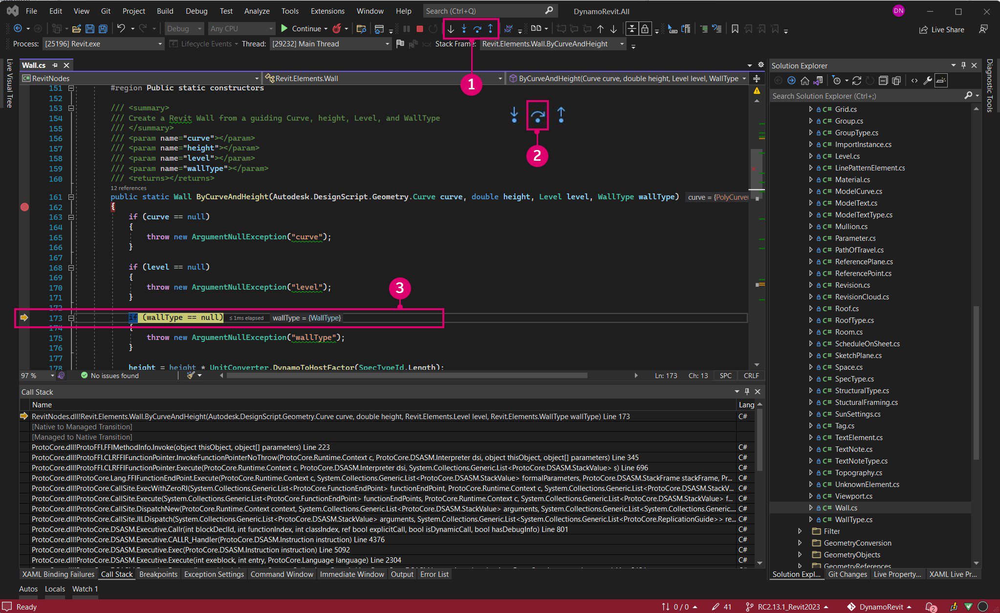

# 소스에서 DynamoRevit 빌드하기

개발자가 기여하고 베타 버전을 빌드할 수 있도록 DynamoRevit 소스 파일도 DynamoDS Github에 호스팅됩니다. 소스에서 DynamoRevit을 빌드하는 작업은 몇 가지 중요한 세부 사항을 제외하고는 일반적으로 Dynamo와 동일한 프로세스를 따릅니다.

* DynamoRevit은 Dynamo 어셈블리를 참조하므로 일치하는 NuGet 패키지를 사용하여 빌드해야 합니다. 예를 들어, DynamoRevit 2.x는 Dynamo 1.3에 로드되지 않습니다.
* DynamoRevit은 Revit 버전에 따라 따릅니다. 예를 들어, DynamoRevit 2018 분기는 Revit 2018에서 실행되어야 합니다.

이 안내서에서는 다음을 사용합니다.

* Revit 2023
* 분기 `Revit2023`의 최신 DynamoRevit 빌드
* 최신 Dynamo 빌드

성공적으로 빌드할 수 있도록 이 연습에서 사용할 Dynamo 및 DynamoRevit 리포지토리를 모두 복제하고 빌드할 것입니다.

_참고: Dynamo 1.x 및 DynamoRevit 1.x를 빌드하는 경우에만 Dynamo를 수동으로 빌드해야 합니다. 최신 버전의 DynamoRevit 리포지토리에서는 빌드하는 데 필요한 Dynamo 종속성을 위해 NuGet 패키지 관리자를 사용합니다. DynamoRevit 2.x 빌드에서는 Dynamo를 수동으로 끌어올 필요가 없지만 실제로 DynamoRevit `addin` 을 실행하려면 다른 곳에 여전히 코어 `dlls` 가 필요하므로 Dynamo를 끌어오고 빌드하는 것이 좋습니다. 자세한 내용은 아래에 나오는_ [_Visual Studio를 사용하여 리포지토리 빌드_](#building-the-repository-using-Visual-Studio)를 참조하십시오.

#### Github에서 DynamoRevit 리포지토리 찾기 <a href="#locating-the-dynamorevit-repository-on-github" id="locating-the-dynamorevit-repository-on-github"></a>

DynamoRevit 프로젝트에 대한 코드는 핵심 Dynamo 소스 코드와는 별도로 Github의 리포지토리에 있습니다. 이 리포지토리에는 Revit 전용 노드에 대한 소스 파일과 Dynamo를 로드하는 Revit 애드인이 포함되어 있습니다. 다른 버전의 Revit(예: 2016, 2017 또는 2018)용 DynamoRevit 빌드는 리포지토리에 분기로 구성됩니다.

DynamoRevit 소스는 [https://github.com/DynamoDS/DynamoRevit](https://github.com/DynamoDS/DynamoRevit)에 호스팅됩니다.


> 1. 리포지토리 복제 또는 다운로드
> 2. DynamoRevit의 분기는 Revit 버전을 참조합니다.

#### git을 사용하여 리포지토리 복제하기 <a href="#cloning-the-repository-using-git" id="cloning-the-repository-using-git"></a>

Dynamo 리포지토리를 끌어오는 것과 유사한 프로세스로 git 복제 명령을 사용하여 DynamoRevit을 복제하고 Revit 버전과 일치하는 분기를 지정합니다. 시작하기 위해 명령행 인터페이스를 열고 파일을 복제할 위치로 현재 디렉토리를 설정합니다.

`cd C:\Users\username\Documents\GitHub`는 현재 디렉토리를 변경합니다.

> `username`을 사용자 이름으로 바꿉니다.



이제 리포지토리를 이 디렉토리에 복제할 수 있습니다. 리포지토리의 분기를 지정해야 하지만, 복제 후 이 분기로 전환할 수 있습니다.

`git clone https://github.com/DynamoDS/DynamoRevit.git`은 원격 URL에서 리포지토리를 복제하고 기본적으로 마스터 분기로 전환합니다.


리포지토리의 복제가 완료되면 현재 디렉토리를 리포지토리 폴더로 변경하고 설치된 Revit 버전과 일치하는 분기로 전환합니다. 이 예에서는 Revit RC2.13.1_Revit2023을 사용합니다. 모든 원격 분기는 Github 페이지의 분기 드롭다운 메뉴에서 확인할 수 있습니다.

`cd C:\Users\username\Documents\GitHub\DynamoRevit`은 디렉토리를 DynamoRevit으로 변경합니다. \
 `git checkout RC2.13.1_Revit2023`은 현재 분기를 `RC2.13.1_Revit2023`으로 설정합니다.\
 `git branch`는 현재 사용 중인 분기를 확인하고, 로컬에 있는 다른 분기를 표시합니다.


> 별표가 있는 분기는 현재 체크아웃된 분기입니다. `Revit2018` 분기가 표시되는 이유는 이전에 체크아웃하여 로컬에 존재하기 때문입니다.

Visual Studio에서 프로젝트를 빌드할 때 올바른 버전의 Revit 설치 디렉토리(특히 `RevitAPI.dll` 및 `RevitAPIUI.dll`)에서 어셈블리를 참조하도록 리포지토리의 올바른 분기를 선택하는 것이 중요합니다.

#### Visual Studio를 사용하여 리포지토리 빌드하기 <a href="#building-dynamo-revit" id="building-dynamo-revit"></a>

리포지토리를 빌드하기 전에 `src` 폴더에 있는 `restorepackages.bat` 파일을 사용하여 NuGet 패키지를 복원해야 합니다. 이 bat 파일은 [nuget](https://www.nuget.org) 패키지 관리자를 사용하여 Dynamo Revit에 필요한 Dynamo 코어의 빌드된 바이너리를 끌어옵니다. DynamoRevit만 변경하고 Dynamo 코어는 변경하지 않는 경우에는 이러한 바이너리를 수동으로 빌드하도록 선택할 수도 있습니다. 이렇게 하면 더 빠르게 시작할 수 있습니다. 이 파일을 관리자 권한으로 실행해야 합니다.



> 1. 마우스 오른쪽 버튼으로 `restorepackages.bat`를 클릭하여 `Run as administrator`를 선택합니다.

패키지가 성공적으로 복원되면 최신 베타 NuGet 패키지가 있는 `packages` 폴더가 `src` 폴더에 추가됩니다.


> 1. 최신 베타 Dynamo NuGet 패키지

패키지가 복원되면 `src`에서 `DynamoRevit.All.sln` Visual Studio 솔루션 파일을 열고 솔루션을 빌드합니다. 빌드 초기에는 `AssemblySharedInfo.cs`를 찾는 데 어려움이 있을 수 있습니다. 이러한 경우 빌드를 다시 실행하면 이 이슈가 해결됩니다.


> 1. `Build > Build Solution`을 선택합니다.
> 2. 출력 창에서 빌드가 성공적으로 수행되었는지 확인합니다. `===== Build: 13 succeeded, 0 failed, 0 up-to-date, 0 skipped =====`라는 메시지가 표시되어야 합니다.

#### Revit에서 DynamoRevit의 로컬 빌드 실행하기 <a href="#running-a-local-build-of-dynamorevit-in-revit" id="running-a-local-build-of-dynamorevit-in-revit"></a>

Revit은 [설치 프로그램](http://dynamobim.org/download/)이 자동으로 생성하는 애드인 파일이 있어야 DynamoRevit을 인식할 수 있습니다. 개발 단계에서는 사용할 DynamoRevit 빌드, 특히 `DynamoRevitDS.dll` 어셈블리를 가리키는 애드인 파일을 수동으로 생성해야 합니다. 또한 DynamoRevit이 Dynamo의 빌드를 가리키도록 지정해야 합니다.

`C:\ProgramData\Autodesk\Revit\Addins\2023`에 있는 Revit의 애드인 폴더에 `Dynamo.addin` 파일을 생성합니다. DynamoRevit 버전이 이미 설치되어 있으므로 새 빌드를 가리키도록 기존 파일을 편집하겠습니다.

```
<?xml version="1.0" encoding="utf-8" standalone="no"?>
<RevitAddIns>
<AddIn Type="Application">
<Name>Dynamo For Revit</Name>
<Assembly>"C:\Users\username\Documents\GitHub\DynamoRevit\bin\AnyCPU\Debug\Revit\DynamoRevitDS.dll"</Assembly>
<AddInId>8D83C886-B739-4ACD-A9DB-1BC78F315B2B</AddInId>
<FullClassName>Dynamo.Applications.DynamoRevitApp</FullClassName>
<VendorId>ADSK</VendorId>
<VendorDescription>Dynamo</VendorDescription>
</AddIn>
</RevitAddIns>
```

* `<Assembly>...</Assembly>` 안으로 `DynamoRevitDS.dll`의 파일 경로를 지정합니다.

애드인에서 특정 어셈블리 대신 버전 선택기를 로드하도록 할 수도 있습니다.

```
<?xml version="1.0" encoding="utf-8" standalone="no"?>
<RevitAddIns>
<AddIn Type="Application">
<Name>Dynamo For Revit</Name>
<Assembly>"C:\Users\username\Documents\GitHub\DynamoRevit\bin\AnyCPU\Debug\Revit\DynamoRevitVersionSelector.dll"</Assembly>
<AddInId>8D83C886-B739-4ACD-A9DB-1BC78F315B2B</AddInId>
<FullClassName>Dynamo.Applications.VersionLoader</FullClassName>
<VendorId>ADSK</VendorId>
<VendorDescription>Dynamo</VendorDescription>
</AddIn>
</RevitAddIns>
```

* `<Assembly>...</Assembly>` 파일 경로를 `DynamoRevitVersionSelector.dll`로 설정합니다.
* `<FullClassName>...</FullClassName>`은 위에서 어셈블리 요소 경로로 지정한 어셈블리에서 인스턴스화할 클래스를 지정합니다. 이 클래스는 애드인의 시작점이 될 것입니다.

또한 Revit과 함께 제공되는 기존 Dynamo를 제거해야 합니다. 이를 위해 `C:\\Program Files\Autodesk\Revit 2023\AddIns `로 이동하여 **Dynamo** - `DynamoForRevit` 및 `DynamoPlayerForRevit`이 포함된 두 개의 폴더를 제거합니다. 원래 Dynamo for Revit을 복구해야 하는 경우 개별 폴더에서 삭제하거나 백업할 수 있습니다.


두 번째 단계는 Dynamo 코어 어셈블리의 파일 경로를 DynamoRevit의 `bin` 폴더에 있는 `Dynamo.config` 파일에 추가하는 것입니다. DynamoRevit은 애드인이 Revit에서 열릴 때 이러한 파일을 로드합니다. 이 구성 파일을 사용하면 DynamoRevit 애드인이 Dynamo 코어의 다른 버전을 가리키도록 지정하여 Core와 DynamoRevit 모두에서 변경 사항을 개발 및 테스트할 수 있습니다.

코드는 다음과 같아야 합니다.

```
<?xml version="1.0" encoding="utf-8"?>
<configuration>
  <appSettings>
     <add key="DynamoRuntime" value="C:\Users\username\Documents\GitHub\Dynamo\bin\AnyCPU\Debug"/>
  </appSettings>
</configuration>
```

* `bin` 폴더의 디렉토리 경로를 `<add key/>`에 추가합니다.

> 이 연습을 시작하기 직전에 Dynamo를 복제하고 빌드하여 DynamoRevit과 잘 연동되는지 확인했습니다. 디렉토리 경로는 이 빌드를 가리킵니다.

이제 Revit을 열면 관리 탭에 Dynamo 애드인이 있습니다.


> 1. `Manage`를 선택합니다.
> 2. Dynamo 애드인 아이콘을 클릭합니다.
> 3. DynamoRevit의 인스턴스

누락된 어셈블리가 표시된 오류 대화상자 창이 나타나면 빌드한 DynamoCore 버전과 런타임 시 로드하는 버전이 일치하지 않는 것일 수 있습니다. 예를 들어, 최신 2.0 베타 패키지의 DynamoCore가 포함된 DynamoRevit은 Dynamo 1.3 dlls를 사용하여 시작하려고 하면 작동하지 않습니다. 두 리포지토리의 버전이 동일하고 DynamoRevit이 일치하는 버전의 nuget 종속성을 끌어오고 있는지 확인합니다. 이것은 DynamoRevit 리포지토리의 `package.json` 파일에 정의되어 있습니다.

#### Visual Studio를 사용하여 DynamoRevit 디버깅하기 <a href="#debugging-dynamorevit-using-visual-studio" id="debugging-dynamorevit-using-visual-studio"></a>

이전 섹션인 **소스에서 Dynamo 빌드하기**에서는 Visual Studio에서 디버깅하는 방법과 Visual Studio를 프로세스에 연결하는 방법을 간략하게 설명했습니다. Wall.ByCurveAndHeight 노드의 예외를 예로 들어, 프로세스에 연결하고, 중단점을 설정하고, 코드를 단계별로 실행하고, 호출 스택을 사용하여 예외의 소스를 확인하는 방법을 살펴보겠습니다. 이러한 디버깅 도구는 일반적으로 .net 개발 워크플로우에 적용되며 다른 리소스를 통해 살펴볼 가치가 있습니다.

* **프로세스에 연결**은 디버깅을 위해 실행 중인 응용프로그램을 Visual Studio에 연결합니다. DynamoRevit 빌드에서 발생하는 동작을 디버깅하려면 Visual Studio에서 DynamoRevit 소스 파일을 열고 DynamoRevit 애드인의 상위 프로세스인 `Revit.exe` 프로세스를 연결하면 됩니다. Visual Studio는 [기호 파일](https://msdn.microsoft.com/en-us/library/ms241613.aspx)(`.pbd`)을 사용하여 DynamoRevit이 실행 중인 어셈블리와 소스 코드를 연결합니다.
* **중단점**은 소스 코드에서 응용프로그램이 실행되기 전에 일시 중지되는 줄을 설정합니다. 노드로 인해 DynamoRevit이 충돌하거나 예기치 않은 결과가 반환되는 경우, 노드 소스에 중단점을 추가하여 프로세스를 일시 중지하고, 코드를 한 단계씩 실행하고, 문제의 근본 원인을 찾을 때까지 변수의 실시간 값을 검사할 수 있습니다
* **단계별로 코드 실행하기**는 소스를 한 줄씩 실행합니다. 함수를 하나씩 실행하거나, 함수 호출을 한 단계씩 실행하거나, 현재 실행 중인 함수에서 나갈 수 있습니다.
*   **호출 스택**은 이 함수 호출을 호출한 이전 함수 호출과 관련하여 프로세스가 현재 실행 중인 함수를 표시합니다. Visual Studio에는 이러한 함수를 표시하는 호출 스택 창이 있습니다. 예를 들어, 소스 코드 외부의 예외에 도달하면 호출 스택에서 호출 코드에 대한 경로를 볼 수 있습니다.

    > [C#에 대해 알아야 할 2,000가지 사항](https://csharp.2000things.com/2013/05/20/847-how-the-call-stack-works/)에서 호출 스택에 대해 더 자세히 알아볼 수 있습니다.

**Wall.ByCurveAndHeight** 노드는 곡선 입력으로 PolyCurve가 지정되면 _"BSPlineCurve까지가 구현되지 않음"_ 이라는 메시지와 함께 예외를 발생시킵니다. 디버깅을 통해 노드가 이 형상 유형을 곡선 매개변수의 입력으로 허용하지 않는 이유를 정확히 파악할 수 있습니다. 이 예에서는 DynamoRevit이 성공적으로 빌드되어 Revit용 애드인으로 실행할 수 있다고 가정합니다.


> 1. 예외를 발생시키는 Wall.ByCurveAndHeight 노드

먼저 `DynamoRevit.All.sln` 솔루션 파일을 열고 Revit을 시작한 다음 DynamoRevit 애드인을 시작합니다. 그런 다음 `Attach to Process` 창을 사용하여 Visual Studio를 Revit 프로세스에 연결합니다.


> 사용 가능한 프로세스로 표시하려면 Revit과 DynamoRevit이 실행 중이어야 합니다.
>
> 1. `Debug > Attach to Process...`를 선택하여 `Attach to Process` 창을 엽니다.
> 2. `Transport`을 `Default`로 설정합니다.
> 3. `Revit.exe`를 선택합니다.
> 4. `Attach`를 선택합니다.

Visual Studio가 Revit에 연결된 상태로 `Wall.cs`에서 Wall.ByCurveAndHeight 소스 코드를 엽니다. 솔루션 탐색기에서 파일의 `Public static constructors` 영역에 있는 `Libraries > RevitNodes > Elements` 아래에서 찾을 수 있습니다. 벽 유형의 생성자에서 중단점을 설정하여 Dynamo에서 노드가 실행될 때 프로세스가 중단되고 코드의 각 줄을 개별적으로 실행해 볼 수 있도록 합니다. 일반적으로 Dynamo zero touch 유형 생성자는 `By<parameters>`로 시작합니다.


> 1. Wall.ByCurveAndHeight의 생성자가 있는 클래스 파일
> 2. 줄 번호 왼쪽을 클릭하거나 코드 줄을 마우스 오른쪽 버튼으로 클릭하여 중단점을 설정하고 `Breakpoint > Insert Breakpoint`를 선택합니다.

중단점을 설정한 후에는 Wall.ByCurveAndHeight 함수를 통해 프로세스를 실행해야 합니다. 포트 중 하나에 와이어를 다시 연결하면 노드가 강제로 다시 실행되므로, 이 함수를 다시 실행할 수 있습니다. 중단점이 Visual Studio에서 적중됩니다.


> 1. 중단점 아이콘은 적중되면 변경됩니다.
> 2. 다음 메서드를 보여주는 호출 스택 창이 표시됩니다.

이제 예외에 도달할 때까지 생성자의 각 줄을 실행합니다. 노란색으로 강조 표시된 코드가 다음에 실행될 문입니다.



> 1. 코드 탐색용 디버깅 도구
> 2. `Step Over`를 눌러 강조 표시된 코드를 실행한 다음 함수가 반환되면 실행을 일시 중단합니다.
> 3. 실행할 다음 문은 노란색 강조 표시 및 화살표로 표시됩니다.

함수를 계속 실행하면 DynamoRevit 창에 발생한 예외가 표시됩니다. 호출 스택 창을 보면 예외가 `Autodesk.Revit.CurveAPIUtils.CreateNurbsCurve`라는 메서드에서 처음 발생했음을 알 수 있습니다. 다행히도 예외는 여기에서 처리되므로 Dynamo에서 충돌이 발생하지 않았습니다. 디버깅 프로세스는 소스 코드의 다른 메서드로 이동하여 이슈에 대한 컨텍스트를 제공했습니다.

이 라이브러리는 오픈 소스 라이브러리가 아니므로 변경할 수 없습니다. 지금까지 많은 정보를 살펴보았으므로, 이제 더 많은 컨텍스트와 함께 github [이슈](https://guides.github.com/features/issues/)를 제기하여 이슈를 보고하거나 끌어오기 요청을 통해 이 이슈에 대한 해결 방법을 제안할 수 있습니다.


> 1. `Walls.cs`에서 예외를 유발하는 문에 도달하면 디버깅 프로세스를 통해 `ProtoToRevitCurve.cs` 내의 사용자 코드에서 이슈의 근본 원인에 최대한 가깝게 이동할 수 있습니다
> 2. 예외를 유발하는 문은 `ProtoToRevitCurve.cs`입니다.
> 3. 호출 스택에서 예외가 비사용자 코드에서 발생하는 것을 확인할 수 있습니다.
> 4. 예외에 대한 정보를 제공하는 팝업 창이 표시됩니다.

이 프로세스는 작업 중인 모든 소스 파일에 적용할 수 있습니다. Dynamo Studio용 Zero-Touch 노드 라이브러리를 개발하는 경우 라이브러리의 소스를 열고 Dynamo 프로세스를 연결하여 노드 라이브러리를 디버깅할 수 있습니다. 모든 것이 완벽하게 작동하더라도 디버깅은 코드를 탐색하고 작동 방식을 파악할 수 있는 유용한 방법입니다.

#### 최신 빌드 끌어오기 <a href="#pull-latest-build" id="pull-latest-build"></a>

이 프로세스는 올바른 분기에 있는지 확인해야 한다는 점을 제외하면 Dynamo에 대한 변경 사항을 끌어오는 것과 거의 동일합니다. DynamoRevit 리포지토리에서 `git branch` 명령을 사용하여 로컬에서 사용할 수 있는 분기와 현재 체크아웃된 분기를 확인할 수 있습니다.

`cd C:\Users\username\Documents\GitHub\DynamoRevit`은 현재 디렉토리를 DynamoRevit 리포지토리로 설정합니다.\
 `git branch`는 현재 올바른 분기인 `RC2.13.1_Revit2023`에 있는지 확인합니다.\
 `git pull origin RC2.13.1_Revit2023`은 원격 원점 `RC2.13.1_Revit2023` 분기에서 변경 사항을 끌어옵니다.

원점은 단순히 복제한 원래 URL을 가리킵니다.


> 예를 들어 `RC2.13.1_Revit2023`에서 `Revit2018`로 변경 사항을 끌어오지 않도록, 현재 어느 분기에 있고 어떤 분기에서 끌어오고 있는지 확인해야 합니다.

**소스에서 Dynamo 빌드하기**에 설명된 대로, 변경 사항을 DynamoRevit 리포지토리에 제출할 준비가 되면 가져오기 요청 섹션에 명시된 Dynamo 팀의 지침에 따라 끌어오기 요청을 생성할 수 있습니다.
