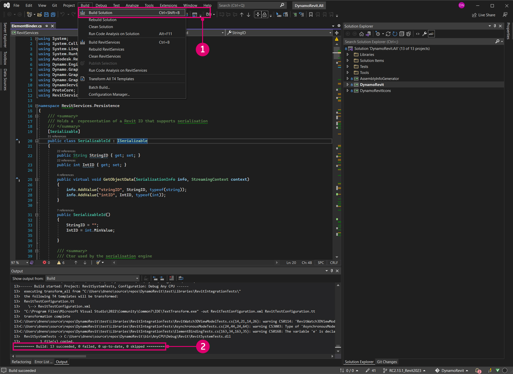

# ソースから DynamoRevit をビルドする

DynamoRevit ソース ファイルも、開発者が関与してベータ版をビルドできるように DynamoDS の GitHub にホストされています。ソースから DynamoRevit をビルドする場合は、通常は Dynamo と同じプロセスを実行しますが、重要な詳細がいくつかあります。

* DynamoRevit は Dynamo のアセンブリを参照するため、一致する NuGet パッケージを使用してビルドする必要があります。たとえば、DynamoRevit 2.x は Dynamo 1.3 にロードされません。
* DynamoRevit は Revit のバージョンに固有です。たとえば、DynamoRevit 2018 ブランチは Revit 2018 で実行する必要があります。

このガイドでは、次のバージョンを使用します。

* Revit 2023
* ブランチ `Revit2023` 上の最新の DynamoRevit ビルド
* 最新の Dynamo ビルド

正常なビルドを確実にするために、この説明で使用する Dynamo と DynamoRevit の両方のリポジトのクローンを作成してビルドします。

_注: Dynamo 1.x と DynamoRevit 1.x をビルドする場合にのみ DynamoRevit の前に Dynamo を手動でビルドする必要があります。これより新しいバージョンの DynamoRevit リポジトリでは、NuGet パッケージ マネージャを使用してビルドに必要な Dynamo の依存関係を取得します。DynamoRevit 2.x のビルドでは Dynamo を手動でプルする必要はありませんが、DynamoRevit `add-in` を実際に実行するには別の場所にコア `dlls` が必要であるため、やはり Dynamo のプルおよびビルドが必要です。詳細については、「[_Visual Studio を使用してリポジトリをビルドする_](#building-the-repository-using-Visual-Studio)」を参照してください。_

### GitHub で DynamoRevit リポジトリを見つける <a href="#locating-the-dynamorevit-repository-on-github" id="locating-the-dynamorevit-repository-on-github"></a>

DynamoRevit プロジェクトのコードは、GitHub で、Dynamo のソース コードとは別のリポジトリにあります。このリポジトリには、Revit 固有のノードのソース ファイルと、Dynamo をロードする Revit アドインが含まれています。Revit の異なるバージョン(2016、2017、2018 など)の DynamoRevit のビルドは、リポジトリ内でブランチとして構成されています。

DynamoRevit のソースは、[https://github.com/DynamoDS/DynamoRevit](https://github.com/DynamoDS/DynamoRevit) にホストされています。


> 1. リポジトリをクローン作成またはダウンロードします。
> 2. DynamoRevit のブランチで Revit のバージョンを参照します。

### git を使用してリポジトリのクローンを作成する <a href="#cloning-the-repository-using-git" id="cloning-the-repository-using-git"></a>

Dynamo リポジトリのプルと同様のプロセスで、git clone コマンドを使用して DynamoRevit のクローンを作成し、Revit のバージョンに一致するブランチを指定します。まず、コマンド ライン インタフェースを開き、ファイルのクローンを作成する場所に現在のフォルダを設定します。

`cd C:\Users\username\Documents\GitHub` で、現在のフォルダを変更します。

> `username` をユーザ名に置き換えます。


これで、リポジトリのクローンをこのフォルダに作成できました。リポジトリのブランチを指定する必要がありますが、クローン作成後にこのブランチに切り替えできます。

`git clone https://github.com/DynamoDS/DynamoRevit.git` で、リポジトリのクローンをリモート URL から作成すると、既定でマスター ブランチに切り替わります。


リポジトリのクローン作成が完了したら、現在のフォルダをリポジトリ フォルダに変更し、インストールされている Revit のバージョンと一致するブランチに切り替えます。この例では、Revit の RC2.13.1_Revit2023 を使用しています。すべてのリモート ブランチは、GitHub ページのブランチのドロップダウン メニューで確認できます。

`cd C:\Users\username\Documents\GitHub\DynamoRevit` で、フォルダが DynamoRevit に変更されます。\
 `git checkout RC2.13.1_Revit2023` で、現在のブランチが `RC2.13.1_Revit2023` に設定されます。\
 `git branch` で、現在のブランチと、ローカルに存在するその他のブランチが表示されます。


> アスタリスクが付いたブランチが、現在チェック アウトされているブランチです。`Revit2018` ブランチが表示されているのは、以前にチェック アウトしているため、ローカルに存在します。

Visual Studio でのプロジェクトのビルドの際に、確実に Revit の正しいバージョンのインストール フォルダ内のアセンブリ(具体的には、`RevitAPI.dll` および `RevitAPIUI.dll`)を参照するには、リポジトリの正しいブランチを選択することが重要です。

### Visual Studio を使用してリポジトリをビルドする <a href="#building-dynamo-revit" id="building-dynamo-revit"></a>

リポジトリをビルドする前に、`src` フォルダにある `restorepackages.bat` ファイルを使用して NuGet パッケージを復元する必要があります。この bat ファイルは、[NuGet](https://www.nuget.org) パッケージ マネージャを使用して、DynamoRevit で必要な Dynamo Core のビルド済みのバイナリをプルします。Dynamo Core を変更せずに DynamoRevit のみを変更する場合は、バイナリを手動でビルドすることもできます。これにより、より迅速に作業を開始できます。このファイルは必ず管理者として実行してください。


> 1. `restorepackages.bat` を右クリックして、`Run as administrator` を選択します。

パッケージが正常に復元された場合は、最新のベータ版 NuGet パッケージを含む `packages` フォルダが `src` フォルダに追加されます。


> 1. 最新のベータ版 Dynamo NuGet パッケージ

パッケージが復元された状態で、`src` にある Visual Studio ソリューション ファイル `DynamoRevit.All.sln` を開き、ソリューションをビルドします。最初はビルドで `AssemblySharedInfo.cs` が見つからない場合があります。その場合は、ビルドを再実行するとこの問題が解決します。



> 1. `Build > Build Solution` を選択します。
> 2. 出力ウィンドウでビルドが正常に作成されたことを確認します。「`===== Build: 13 succeeded, 0 failed, 0 up-to-date, 0 skipped =====`」というメッセージが表示されるはずです。

### Revit で DynamoRevit のローカル ビルドを実行する <a href="#running-a-local-build-of-dynamorevit-in-revit" id="running-a-local-build-of-dynamorevit-in-revit"></a>

Revit には、DynamoRevit を認識するためのアドイン ファイルが必要です。[インストーラ](http://dynamobim.org/download/)で自動的に作成される場合もあります。開発の際には、使用する DynamoRevit のビルドを指定するアドイン ファイル、具体的には `DynamoRevitDS.dll` アセンブリを手動で作成する必要があります。また、DynamoRevit で Dynamo のビルドを指定する必要があります。

`C:\ProgramData\Autodesk\Revit\Addins\2023` にある Revit のアドイン フォルダに `Dynamo.addin` ファイルを作成します。あるバージョンの DynamoRevit が既にインストールされているため、新しいビルドを指定するように既存のファイルを編集するのみです。

```
<?xml version="1.0" encoding="utf-8" standalone="no"?>
<RevitAddIns>
<AddIn Type="Application">
<Name>Dynamo For Revit</Name>
<Assembly>"C:\Users\username\Documents\GitHub\DynamoRevit\bin\AnyCPU\Debug\Revit\DynamoRevitDS.dll"</Assembly>
<AddInId>8D83C886-B739-4ACD-A9DB-1BC78F315B2B</AddInId>
<FullClassName>Dynamo.Applications.DynamoRevitApp</FullClassName>
<VendorId>ADSK</VendorId>
<VendorDescription>Dynamo</VendorDescription>
</AddIn>
</RevitAddIns>
```

* `<Assembly>...</Assembly>` 内で `DynamoRevitDS.dll` のファイル パスを指定します。

または、特定のアセンブリの代わりに、アドインでバージョン セレクタをロードできます。

```
<?xml version="1.0" encoding="utf-8" standalone="no"?>
<RevitAddIns>
<AddIn Type="Application">
<Name>Dynamo For Revit</Name>
<Assembly>"C:\Users\username\Documents\GitHub\DynamoRevit\bin\AnyCPU\Debug\Revit\DynamoRevitVersionSelector.dll"</Assembly>
<AddInId>8D83C886-B739-4ACD-A9DB-1BC78F315B2B</AddInId>
<FullClassName>Dynamo.Applications.VersionLoader</FullClassName>
<VendorId>ADSK</VendorId>
<VendorDescription>Dynamo</VendorDescription>
</AddIn>
</RevitAddIns>
```

* `<Assembly>...</Assembly>` ファイル パスを `DynamoRevitVersionSelector.dll` に設定します
* `<FullClassName>...</FullClassName>` で、上記のアセンブリ要素パスを使用して指したアセンブリからインスタンス化するクラスを指定します。このクラスが、アドインのエントリ ポイントになります。

さらに、Revit に付属している既存の Dynamo を削除する必要があります。これを行うには、`C:\\Program Files\Autodesk\Revit 2023\AddIns ` で、**Dynamo** を含む 2 つのフォルダ(`DynamoForRevit` および `DynamoPlayerForRevit`)を削除します。削除できますが、元の Dynamo for Revit を復元する必要がある場合は別のフォルダにバックアップすることもできます。


次の手順では、Dynamo Core アセンブリのファイル パスを、DynamoRevit の `bin` フォルダ内の `Dynamo.config` ファイルに追加します。DynamoRevit は、アドインを Revit で開いたときに、これらのアセンブリをロードします。この config ファイルを使用すると、さまざまなバージョンの Dynamo Core に DynamoRevit アドインを指定し、開発と変更のテストを Core と DynamoRevit の両方で実施できます。

コードは次のようになります。

```
<?xml version="1.0" encoding="utf-8"?>
<configuration>
  <appSettings>
     <add key="DynamoRuntime" value="C:\Users\username\Documents\GitHub\Dynamo\bin\AnyCPU\Debug"/>
  </appSettings>
</configuration>
```

* `bin` フォルダのフォルダ パスを `<add key/>` に追加します

> このコードが DynamoRevit で適切に動作するように、この手順の前に Dynamo のクローンを作成してビルドしました。フォルダ パスはこのビルドを指します。

Revit を開くと、[管理]タブに Dynamo アドインがあるはずです。

![[管理]タブにある Dynamo アドイン](images/revit-dynamo.jpg)

> 1. `Manage` を選択します。
> 2. Dynamo アドインのアイコンをクリックします。
> 3. DynamoRevit のインスタンス

エラー ダイアログ ウィンドウにアセンブリが見つからないと表示される場合は、構築された DynamoCore のバージョンと実行時にロードするバージョンが一致していない可能性があります。たとえば、DynamoCore の最新の 2.0 ベータ版パッケージに対応する DynamoRevit は、Dynamo 1.3 dll を使用して起動しようとしても動作しません。両方のリポジトリが同じバージョンであり、DynamoRevit が一致するバージョンの NuGet 依存関係をプルしていることを確認します。これらは、DynamoRevit リポジトリの `package.json` ファイルで定義されています。

### Visual Studio を使用して DynamoRevit をデバッグする <a href="#debugging-dynamorevit-using-visual-studio" id="debugging-dynamorevit-using-visual-studio"></a>

前のセクション「**ソースから Dynamo をビルドする**」では、Visual Studio でのデバッグと、プロセスに Visual Studio をアタッチする方法について簡単に説明しました。例として、Wall.ByCurveAndHeight ノードの例外を使用して、プロセスへのアタッチ、ブレーク ポイントの設定、コードのステップ実行、およびコール スタックを使用した例外のソースの決定方法について説明します。これらのデバッグ ツールは、一般的に .net 開発ワークフローに適用され、このガイド以外でも役立ちます。

* **プロセスにアタッチ**すると、実行中のアプリケーションが Visual Studio にリンクされ、デバッグできます。DynamoRevit のビルドで発生する動作をデバッグする場合は、Visual Studio で DynamoRevit ソース ファイルを開き、DynamoRevit アドインの親プロセスである `Revit.exe` プロセスをアタッチできます。Visual Studio は、[シンボル ファイル](https://msdn.microsoft.com/en-us/library/ms241613.aspx)(`.pbd`)を使用して、DynamoRevit が実行しているアセンブリとソース コードとの間に接続を作成します。
* **ブレーク ポイント**をソース コード内の行に設定すると、アプリケーションがその行を実行する前に一時停止します。ノードが原因で DynamoRevit がクラッシュしたり、予期しない結果が返された場合は、ノードのソースにブレーク ポイントを追加してプロセスを一時停止し、コードにステップ インして、問題の原因が見つかるまで実行中の変数の値を検査できます
* **コードをステップ実行する**と、ソースを 1 行ずつ確認できます。関数を 1 つずつ実行したり、関数呼び出しにステップ インしたり、現在実行中の関数から抜けることができます。
*   **コール スタック**では、プロセスが現在実行している関数が表示され、この関数呼び出しを起動したそれまでの関数呼び出しも表示されます。Visual Studio には、これを表示するコール スタック ウィンドウがあります。たとえば、ソース コードの範囲外で例外に達した場合には、コール スタックに呼び出しコードへのパスが表示されます。

    > 「[C# に関して知っておくべき 2,000 のこと](https://csharp.2000things.com/2013/05/20/847-how-the-call-stack-works/)」では、コール スタックについて詳しく説明しています。

**Wall.ByCurveAndHeight** ノードは、curve 入力として PolyCurve を指定すると例外をスローし、「_To BSPlineCurve が実装されていません_」というメッセージが表示されます。デバッグを使用すると、ノードがこのジオメトリ タイプを曲線パラメータの入力として受け取らない理由が正確にわかります。この例では、DynamoRevit が正常にビルドされ、Revit のアドインとして実行できるものとします。


> 1. 例外をスローしている Wall.ByCurveAndHeight ノード

最初にソリューション ファイル `DynamoRevit.All.sln` を開き、Revit を起動して、DynamoRevit アドインを起動します。次に、`Attach to Process` ウィンドウで Revit プロセスに Visual Studio をアタッチします。


> 使用可能なプロセスとして表示するには、Revit と DynamoRevit を実行している必要があります。
>
> 1. `Debug > Attach to Process...` を選択して `Attach to Process` ウィンドウを開きます。
> 2. `Transport` を `Default` に設定します。
> 3. `Revit.exe` を選択します。
> 4. `Attach` を選択します。

Visual Studio を Revit にアタッチした状態で、`Wall.cs` にある Wall.ByCurveAndHeight ソース コードを開きます。これは、ファイルの `Public static constructors` 領域の `Libraries > RevitNodes > Elements` の下にある Solution Explorer で見つけることができます。壁タイプのコンストラクタでブレーク ポイントを設定します。これにより、Dynamo でノードを実行したときにプロセスが中断され、コードの各行を個別にステップ実行できます。通常、Dynamo の Zero Touch タイプのコンストラクタは、`By<parameters>` で始まります。


> 1. Wall.ByCurveAndHeight のコンストラクタを含むクラス ファイル
> 2. 行番号の左をクリックするか、コードの行を右クリックして `Breakpoint > Insert Breakpoint` を選択し、ブレークポイントを設定します。

ブレークポイントを設定して、プロセスで Wall.ByCurveAndHeight 関数を実行する必要があります。この関数は、ワイヤをいずれかのポートに再接続することで、Dynamo で再実行でき、ノードが強制的に再実行されます。Visual Studio でブレークポイントにヒットします。


> 1. ブレークポイントのアイコンは、ヒットすると変化します。
> 2. 次に始まるメソッドを示すコール スタック ウィンドウ

ここで、例外にヒットするまでコンストラクタの各行をステップ オーバーします。黄色でハイライト表示されたコードが、次に実行されるステートメントです。


> 1. コードをナビゲートするためのデバッグ ツール
> 2. `Step Over` を押してハイライト表示されたコードを実行すると、関数が返された後に実行が一時停止します
> 3. 黄色のハイライトと矢印で示された、次に実行するステートメント

関数をステップ実行し続けると、DynamoRevit ウィンドウに表示された例外にヒットします。コール スタック ウィンドウを見ると、例外が元は `Autodesk.Revit.CurveAPIUtils.CreateNurbsCurve` というメソッドからスローされたことがわかります。ここでは例外が処理されているため、Dynamo はクラッシュしませんでした。デバッグ プロセスによって、ソース コード内の別のメソッドが表示されて、問題のコンテキストがわかりました。

これはオープン ソース ライブラリではないため、変更を加えることはできませんが、詳細な情報が得られたため、GitHub の [Issue](https://docs.github.com/ja/issues/tracking-your-work-with-issues/about-issues) を提出して問題を詳しくレポートしたり、プル リクエストを行ってこの問題の回避策を提案できます。


> 1. `Walls.cs` で例外が発生するステートメントにヒットした際に、デバッグ プロセスにより、`ProtoToRevitCurve.cs` 内のユーザ コードで問題の原因を詳しく調べることができます。
> 2. `ProtoToRevitCurve.cs` 内の例外が発生するステートメント。
> 3. コール スタックで、例外がユーザ　コード以外から発生していることが確認できます。
> 4. 例外に関する情報を表示するポップアップ ウィンドウ。

このプロセスは、作業中のソース ファイルに適用できます。Dynamo Studio 用の Zero-Touch ノードのライブラリを開発している場合は、ライブラリのソースを開いて Dynamo プロセスをアタッチするとノード ライブラリをデバッグできます。すべてが完全に機能していても、デバッグは、コードを調べて動作の仕組みを理解するのに最適な方法です。

### 最新ビルドをプルする <a href="#pull-latest-build" id="pull-latest-build"></a>

このプロセスは、Dynamo の変更をプルするプロセスとほとんど同じですが、正しいブランチにいることを確認する必要があります。DynamoRevit リポジトリで `git branch` コマンドを使用して、ローカルで使用可能なブランチと現在チェック アウトされているブランチを確認します。

`cd C:\Users\username\Documents\GitHub\DynamoRevit` で、現在のフォルダを DynamoRevit リポジトリに設定します。\
 `git branch` で、正しいブランチ `RC2.13.1_Revit2023` にいることを確認します。\
 `git pull origin RC2.13.1_Revit2023` で、リモートの元の `RC2.13.1_Revit2023` ブランチから変更をプルします。

「origin」は単にクローンの作成元の URL を指しています。


> ここでは、現在どのブランチにいるか、またどのブランチからプルするかに注意し、たとえば、`RC2.13.1_Revit2023` から `Revit2018` に変更をプルしないようにします。

「**ソースから Dynamo をビルドする**」で説明したように、DynamoRevit リポジトリに対する変更を送信できる場合は、「プル リクエスト」セクションに記載されている Dynamo チームのガイドラインに従って、プル リクエストを作成できます。
