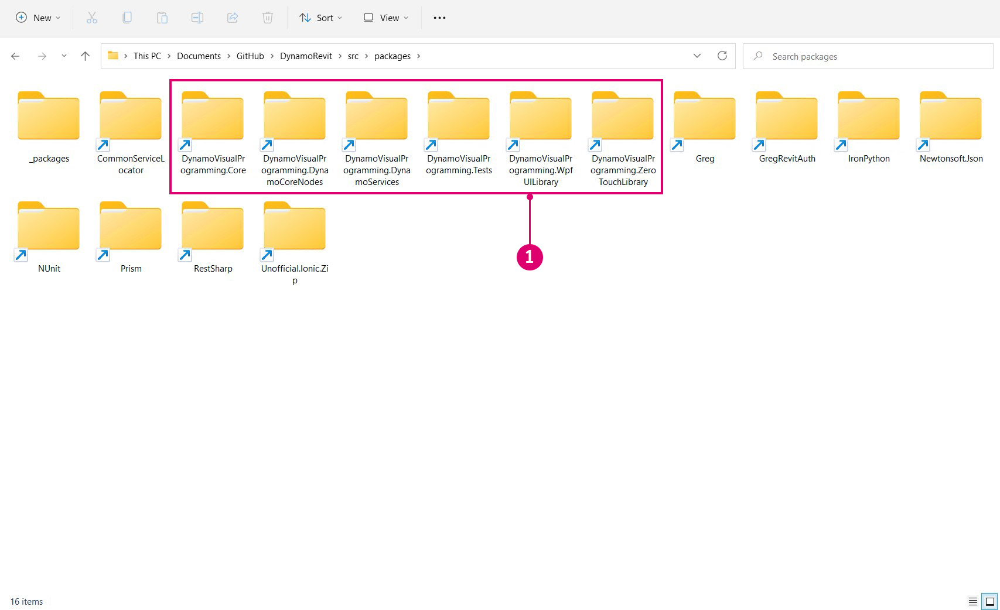
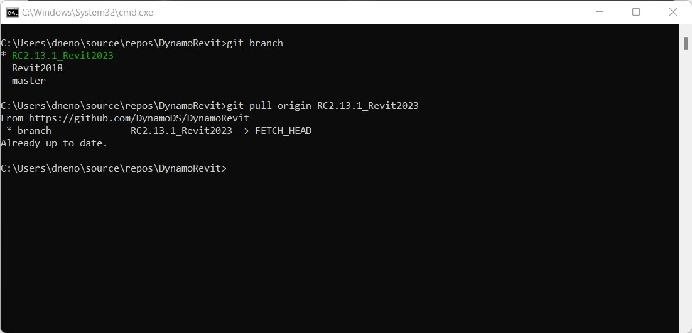

# 從原始碼建置 DynamoRevit

DynamoRevit 原始碼檔案也託管在 DynamoDS Github 上，開發人員可以參與並建置 Beta 版本。從原始碼建置 DynamoRevit 的程序通常與 Dynamo 相同，但有一些重要的細節例外：

* DynamoRevit 參考 Dynamo 組合，因此應使用相符的 NuGet 套件建置這些組合。例如，DynamoRevit 2.x 不會載入至 Dynamo 1.3。
* DynamoRevit 與 Revit 版本有關，例如：DynamoRevit 2018 分支應在 Revit 2018 上執行。

本指南將使用下列項目：

* Revit 2023
* 在分支 `Revit2023` 上的最新 DynamoRevit 建置版本
* 最新的 Dynamo 建置版本

為確保能成功建置，我們將複製並建置 Dynamo 和 DynamoRevit 兩個儲存庫在此逐步解說中使用。

_注意事項：只有當您建置 Dynamo 1.x 和 DynamoRevit 1.x 時，才需要在 DynamoRevit 之前手動建置 Dynamo - 較新版本的 DynamoRevit 儲存庫依賴 NuGet 套件管理員，才能獲得建置所需的 Dynamo 相依性。雖然 DynamoRevit 2.x 的建置版本不需要手動提取 Dynamo，但您在其他位置仍然需要核心 `dlls` 才能真正執行 DynamoRevit `addin` \- 因此無論如何還是要提取和建置 Dynamo。參閱更多資訊：_[_使用 Visual Studio 建置儲存庫_](#building-the-repository-using-Visual-Studio)

#### 在 Github 上找出 DynamoRevit 儲存庫 <a href="#locating-the-dynamorevit-repository-on-github" id="locating-the-dynamorevit-repository-on-github"></a>

DynamoRevit 專案的程式碼與核心 Dynamo 原始程式碼在 Github 是位在不同的儲存庫中。此儲存庫包含 Revit 特定節點的原始碼檔案，以及載入 Dynamo 的 Revit 增益集。適用於不同 Revit 版本 (例如 2016、2017 或 2018) 的 DynamoRevit 建置版本在儲存庫中會整理成不同的分支。

DynamoRevit 的原始碼託管在此：[https://github.com/DynamoDS/DynamoRevit](https://github.com/DynamoDS/DynamoRevit)


> 1. 複製或下載儲存庫
> 2. DynamoRevit 的分支參考 Revit 版本

#### 使用 git 複製儲存庫 <a href="#cloning-the-repository-using-git" id="cloning-the-repository-using-git"></a>

在與提取 Dynamo 儲存庫類似的過程中，我們將使用 git clone 指令來複製 DynamoRevit，並指定與 Revit 版本相符的分支。首先，我們開啟指令行介面，將目前目錄設定為要將檔案複製到的位置。

`cd C:\Users\username\Documents\GitHub` 會變更目前目錄

> 將 `username` 取代為您的使用者名稱


現在，我們可以將儲存庫複製到此目錄中。雖然我們需要指定儲存庫的分支，但可以在複製後切換到此分支。

`git clone https://github.com/DynamoDS/DynamoRevit.git` 會從遠端 URL 複製儲存庫，然後依預設切換到主分支。


儲存庫完成複製後，將目前目錄變更為儲存庫資料夾，並切換至與所安裝 Revit 版本相符的分支。在此範例中，我們使用 Revit RC2.13.1_Revit2023。在 Github 頁面上的「Branch」下拉式功能表中可以檢視所有遠端分支。

`cd C:\Users\username\Documents\GitHub\DynamoRevit` 會將目錄變更為 DynamoRevit。\
 `git checkout RC2.13.1_Revit2023` 會將目前分支設定為 `RC2.13.1_Revit2023`。\
 `git branch` 會確認我們所在的分支，並顯示本端存在的其他分支。


> 有星號的分支是目前出庫使用的分支。畫面顯示的是 `Revit2018` 分支，因為我們先前已將其出庫使用，因此它位於本端。

選擇正確的儲存庫分支很重要，這樣才能確保專案在 Visual Studio 中建置時，會參考 Revit 安裝目錄正確版本 (尤其是 `RevitAPI.dll` 和 `RevitAPIUI.dll`) 中的組合。

#### 使用 Visual Studio 建置儲存庫 <a href="#building-dynamo-revit" id="building-dynamo-revit"></a>

在建置儲存庫之前，我們需要使用 `src` 資料夾中的 `restorepackages.bat` 檔案還原 NuGet 套件。此 bat 檔案使用 [nuget](https://www.nuget.org) 套件管理員提取 DynamoRevit 所需的 Dynamo 核心已建置二進位檔案。您也可以選擇手動建置這些元件，但如果您只是對 DynamoRevit (而不是 Dynamo 核心) 進行變更，這樣可以更快開始。請務必以管理員身分執行此檔案。


> 1. 以右鍵按一下 `restorepackages.bat`，然後選取「`Run as administrator`」

如果成功還原套件，則會在 `src` 資料夾中新增一個 `packages` 資料夾，當中包含最新的 Beta 版 NuGet 套件。



> 1. 最新的 Beta 版 Dynamo NuGet 套件

還原套件後，開啟 `src` 中的 `DynamoRevit.All.sln` Visual Studio 方案檔，然後建置方案。建置作業一開始可能找不到 `AssemblySharedInfo.cs`。如果是，重新執行建置可以解決此問題。


> 1. 選取「`Build > Build Solution`」
> 2. 在「Output (輸出)」視窗中確認建置成功。訊息應為 `===== Build: 13 succeeded, 0 failed, 0 up-to-date, 0 skipped =====`。

#### 在 Revit 中執行 DynamoRevit 的本端建置版本 <a href="#running-a-local-build-of-dynamorevit-in-revit" id="running-a-local-build-of-dynamorevit-in-revit"></a>

Revit 需要增益集檔案才能辨識 DynamoRevit，[安裝程式](http://dynamobim.org/download/)會自動建立此檔案。在開發過程中，我們需要手動建立一個指向我們要使用的 DynamoRevit 建置版本的增益集檔案，明確來說是 `DynamoRevitDS.dll` 組合。我們還需要將 DynamoRevit 指向 Dynamo 的建置版本。

在 Revit 的增益集資料夾 `C:\ProgramData\Autodesk\Revit\Addins\2023` 中建立 `Dynamo.addin` 檔案。我們已經安裝 DynamoRevit 版本，因此我們只要編輯既有檔案以指向新的建置版本。

```
<?xml version="1.0" encoding="utf-8" standalone="no"?>
<RevitAddIns>
<AddIn Type="Application">
<Name>Dynamo For Revit</Name>
<Assembly>"C:\Users\username\Documents\GitHub\DynamoRevit\bin\AnyCPU\Debug\Revit\DynamoRevitDS.dll"</Assembly>
<AddInId>8D83C886-B739-4ACD-A9DB-1BC78F315B2B</AddInId>
<FullClassName>Dynamo.Applications.DynamoRevitApp</FullClassName>
<VendorId>ADSK</VendorId>
<VendorDescription>Dynamo</VendorDescription>
</AddIn>
</RevitAddIns>
```

* 在 `<Assembly>...</Assembly>` 內指定 `DynamoRevitDS.dll` 的檔案路徑。

或者，我們可以使用增益集載入版本選取器，而非特定組合。

```
<?xml version="1.0" encoding="utf-8" standalone="no"?>
<RevitAddIns>
<AddIn Type="Application">
<Name>Dynamo For Revit</Name>
<Assembly>"C:\Users\username\Documents\GitHub\DynamoRevit\bin\AnyCPU\Debug\Revit\DynamoRevitVersionSelector.dll"</Assembly>
<AddInId>8D83C886-B739-4ACD-A9DB-1BC78F315B2B</AddInId>
<FullClassName>Dynamo.Applications.VersionLoader</FullClassName>
<VendorId>ADSK</VendorId>
<VendorDescription>Dynamo</VendorDescription>
</AddIn>
</RevitAddIns>
```

* 將 `<Assembly>...</Assembly>` 檔案路徑設定為 `DynamoRevitVersionSelector.dll`
* `<FullClassName>...</FullClassName>` 使用上面的組合元素路徑，指定要從我們所指向的組合實體化的類別。此類別將是我們增益集的進入點。

此外，我們需要移除 Revit 隨附的既有 Dynamo。若要執行，請移至 `C:\\Program Files\Autodesk\Revit 2023\AddIns ` 並移除包含 **Dynamo** 的兩個資料夾 - `DynamoForRevit` 和 `DynamoPlayerForRevit`。如果需要恢復原始的 Dynamo for Revit，您可以刪除這兩個資料夾，或備份到單獨的資料夾中。


第二步是在 DynamoRevit 的 `bin` 資料夾中的 `Dynamo.config` 檔案新增 Dynamo 核心組合的檔案路徑。在 Revit 中開啟增益集時，DynamoRevit 將載入這些組合。此規劃檔可讓您將 DynamoRevit 增益集指向不同版本的 Dynamo 核心，供您同時在核心和 DynamoRevit 中開發和測試變更。

程式碼應如下所示：

```
<?xml version="1.0" encoding="utf-8"?>
<configuration>
  <appSettings>
     <add key="DynamoRuntime" value="C:\Users\username\Documents\GitHub\Dynamo\bin\AnyCPU\Debug"/>
  </appSettings>
</configuration>
```

* 將 `bin` 資料夾的目錄路徑加到 `<add key/>` 中

> 我們在此逐步解說之前才複製並建置 Dynamo，確保能與 DynamoRevit 順利搭配運作。目錄路徑指向此建置版本。

現在開啟 Revit 時，「管理」頁籤中應該有 Dynamo 增益集。


> 1. 選取「`Manage`」
> 2. 按一下 Dynamo 增益集圖示
> 3. 一個 DynamoRevit 例證

如果出現錯誤對話方塊視窗顯示缺少組合，可能是您建置所依據的 DynamoCore 版本與您在執行時期載入的 DynamoCore 版本不相符。例如，如果您嘗試使用 Dynamo 1.3 dll 啟動 DynamoCore，則 DynamoRevit 搭配最新的 DynamoCore 2.0 Beta 套件將無法運作。請確保兩個儲存庫的版本相同，且 DynamoRevit 提取的是相符版本的 nuget 相依性。這些版本定義在 DynamoRevit 儲存庫的 `package.json` 檔案中。

#### 使用 Visual Studio 為 DynamoRevit 除錯 <a href="#debugging-dynamorevit-using-visual-studio" id="debugging-dynamorevit-using-visual-studio"></a>

在上一節〈**從原始碼建置 Dynamo**〉中，我們簡單介紹了在 Visual Studio 中進行除錯，以及如何將 Visual Studio 附加到處理序。以 Wall.ByCurveAndHeight 節點中的例外狀況為例，我們將逐步瞭解如何附加到處理序、設定中斷點、逐步執行程式碼，以及使用呼叫堆疊來判斷例外狀況的來源。這些除錯工具通常適用於 .net 開發工作流程，值得您在參考本指南之餘進行探索。

* **附加至處理序**可將執行中的應用程式連結至 Visual Studio 進行除錯。如果我們要為 DynamoRevit 建置版本中發生的行為進行除錯，可以在 Visual Studio 中開啟 DynamoRevit 原始碼檔案，然後附加 `Revit.exe` 處理序，這是 DynamoRevit 增益集的父處理序。Visual Studio 使用[符號檔](https://msdn.microsoft.com/en-us/library/ms241613.aspx) (`.pbd`) 來連接 DynamoRevit 正在執行的組合與原始程式碼。
* **中斷點**會在原始程式碼中建立幾行程式碼，應用程式會在這幾行暫停後再執行。如果某個節點導致 DynamoRevit 當機或傳回非預期結果，我們可以在節點的原始碼中加入中斷點暫停處理序、逐步檢查程式碼，以及檢查變數的即時值，直到找到問題的根本原因
* **逐行執行程式碼**會逐行執行原始碼。我們可以逐一執行函數、逐步檢查函數呼叫，或跳出目前執行的函數。
*   **呼叫堆疊**會顯示處理序目前正在執行且與叫用此函數呼叫的前一個函數呼叫相關的函數。Visual Studio 有一個「呼叫堆疊」視窗可顯示此內容。例如，如果在原始程式碼外遇到例外狀況，可以查看呼叫堆疊中呼叫程式碼的路徑。

    > [您應該瞭解 C# 的 2,000 件事](https://csharp.2000things.com/2013/05/20/847-how-the-call-stack-works/)對呼叫堆疊有更深入的說明

**Wall.ByCurveAndHeight** 節點在給定一條 PolyCurve 做為其曲線輸入時擲出例外狀況並顯示以下訊息：_「未實施目標 BSPlineCurve」_。透過除錯，我們可以找出節點為什麼不接受此幾何圖形類型做為曲線參數的輸入。在此範例中，我們假設 DynamoRevit 已成功建置，並可做為 Revit 的增益集執行。


> 1. Wall.ByCurveAndHeight 節點擲出例外狀況

首先開啟 `DynamoRevit.All.sln` 方案檔，啟動 Revit，然後啟動 DynamoRevit 增益集。然後使用「`Attach to Process`」視窗將 Visual Studio 附加到 Revit 處理序。


> Revit 和 DynamoRevit 必須執行才能顯示為可用處理序
>
> 1. 選取「`Debug > Attach to Process...`」以開啟「`Attach to Process`」視窗
> 2. 將「`Transport`」設定為「`Default`」
> 3. 選取 `Revit.exe`
> 4. 選取「`Attach`」

將 Visual Studio 附加到 Revit 後，開啟 `Wall.cs` 中的 Wall.ByCurveAndHeight 原始程式碼。我們可以在「方案總管」的「`Libraries > RevitNodes > Elements`」下，在檔案的 `Public static constructors` 區域找到這段程式碼。在牆類型的建構函式中設定中斷點，以便在 Dynamo 中執行節點時，處理序會中斷，我們可以逐行執行程式碼。Dynamo zero touch 類型的建構函式通常以 `By<parameters>` 開頭。


> 1. 具有 Wall.ByCurveAndHeight 建構函式的類別檔案
> 2. 按一下行號的左側，或在程式碼行上按一下右鍵並選取「`Breakpoint > Insert Breakpoint`」可設定中斷點。

設定中斷點後，我們需要處理序逐步執行 Wall.ByCurveAndHeight 函數。在 Dynamo 中將配線重新連接至其中一個埠 (這會強制節點重新執行)，可再次執行此函數。在 Visual Studio 中會叫用中斷點。


> 1. 中斷點圖示在叫用時會變更
> 2. 「呼叫堆疊」視窗顯示下一個即將執行的方法

現在，請逐步檢查建構函式中的每一行，直到遇到例外狀況。以黃色亮顯的程式碼是下一個要執行的陳述式。


> 1. 用於瀏覽程式碼的除錯工具
> 2. 按「`Step Over`」以執行亮顯的程式碼，然後在函數傳回後暫停執行
> 3. 要執行的下一個陳述式，以黃色亮顯和箭頭指示

如果我們繼續逐步執行函數，將會遇到 DynamoRevit 視窗中顯示的例外狀況。查看「呼叫堆疊」視窗，我們可以看到例外狀況一開始是從名為 `Autodesk.Revit.CurveAPIUtils.CreateNurbsCurve` 的方法所擲出。多虧這裡已經處理了例外狀況，因此 Dynamo 沒有當機。除錯程序將我們引導到原始式碼中的另一個方法，提供發生問題的脈絡。

由於這不是開放原始碼資源庫，因此我們無法在該處進行變更 - 現在，我們擁有更多資訊，可以透過提交 Github [問題](https://guides.github.com/features/issues/)回報問題更多內容，或者我們可以針對此問題提出提取請求以提供解決方法。


> 1. 當我們叫用導致 `Walls.cs` 中發生例外狀況的陳述式時，除錯程序會盡可能將我們引導到使用者程式碼中 `ProtoToRevitCurve.cs` 內發生問題的根本所在位置
> 2. 導致 `ProtoToRevitCurve.cs` 中例外狀況的陳述式
> 3. 在「呼叫堆疊」中，我們可以看到例外狀況是來自非使用者程式碼
> 4. 提供例外狀況相關資訊的快顯視窗

此程序可套用至我們處理的任何原始碼檔案。如果我們要開發 Dynamo Studio 的 Zero-Touch 節點資源庫，可以開啟資源庫的原始碼並附加 Dynamo 處理序，為節點資源庫除錯。即使一切正常，除錯也是探索程式碼並瞭解其運作方式的絕佳方式。

#### 提取最新建置版本 <a href="#pull-latest-build" id="pull-latest-build"></a>

此程序幾乎與提取 Dynamo 的變更相同，但是需要確保位於正確的分支。在 DynamoRevit 儲存庫中使用 `git branch` 指令，查看哪些分支可在本端使用，哪些分支目前已出庫使用。

`cd C:\Users\username\Documents\GitHub\DynamoRevit` 將目前目錄設定為 DynamoRevit 儲存庫。\
 `git branch` 確認我們位於正確的分支`RC2.13.1_Revit2023`。\
 `git pull origin RC2.13.1_Revit2023` 會從遠端的原點 `RC2.13.1_Revit2023` 分支提取變更。

原點只是指向我們複製的原始 URL。



> 我們希望在此注意目前所在的分支，以及我們要從哪個分支提取，以避免將變更從 `RC2.13.1_Revit2023` 提取到例如 `Revit2018`。

如〈**從原始碼建置　Dynamo**〉中所述，當我們準備好將變更提交到 DynamoRevit 儲存庫時，可以按照 Dynamo 團隊在〈提取請求〉一節所列的指導方針建立提取請求。
