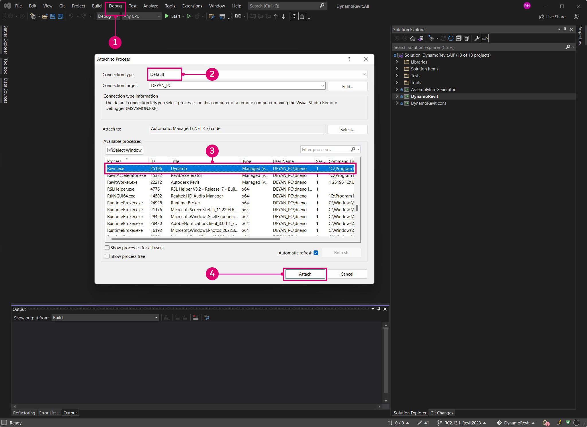

# 从源代码构建 DynamoRevit

DynamoRevit 源文件也托管在 DynamoDS GitHub 上，可供开发人员参与修改并构建 Beta 版。从源代码构建 DynamoRevit 通常遵循与 Dynamo 相同的过程，但一些重要细节除外：

* DynamoRevit 会参照 Dynamo 程序集，因此应使用匹配的 NuGet 软件包构建这些程序集。例如，DynamoRevit 2.x 不会载入到 Dynamo 1.3 中。
* DynamoRevit 特定于 Revit 版本，例如：DynamoRevit 2018 分支应在 Revit 2018 上运行。

在本手册中，我们将使用以下内容：

* Revit 2023
* 基于分支 `Revit2023` 的最新 DynamoRevit 构建
* 最新 Dynamo 构建

为了确保构建成功，我们将克隆并构建要在本漫游中使用的 Dynamo 和 DynamoRevit 存储库。

_注意：仅当构建 Dynamo 1.x 和 DynamoRevit 1.x 时，才需要在 Dynamo 之前手动构建 Dynamo - 较新版本的 DynamoRevit 存储库依赖 NuGet 软件包管理器来构建所需的 Dynamo 依存关系。虽然 DynamoRevit 2.x 的构建不需要手动拉取 Dynamo，但仍需要在其他地方使用核心 `dlls` 来实际运行 DynamoRevit `add-in` \- 因此，无论如何，拉取和构建 Dynamo 都是值得的。详见下文：_ [_使用 Visual Studio 构建存储库_](#building-the-repository-using-Visual-Studio)

### 在 GitHub 上查找 DynamoRevit 存储库 <a href="#locating-the-dynamorevit-repository-on-github" id="locating-the-dynamorevit-repository-on-github"></a>

DynamoRevit 项目的代码位于 GitHub 上独立于核心 Dynamo 源代码的存储库中。此存储库包含 Revit 特定节点的源文件和载入 Dynamo 的 Revit 附加模块。针对不同版本的 Revit（例如，2016、2017 或 2018）的 DynamoRevit 构建会在存储库中组织为分支。

DynamoRevit 的源代码托管在此处：[https://github.com/DynamoDS/DynamoRevit](https://github.com/DynamoDS/DynamoRevit)


> 1. 克隆或下载存储库
> 2. DynamoRevit 的分支参照 Revit 版本

### 使用 git 克隆存储库 <a href="#cloning-the-repository-using-git" id="cloning-the-repository-using-git"></a>

在与拉取 Dynamo 存储库类似的过程中，我们将使用 git 克隆命令来克隆 DynamoRevit 并指定与我们的 Revit 版本匹配的分支。首先，我们将打开命令行界面，然后将当前目录设置为要将文件克隆到的位置。

`cd C:\Users\username\Documents\GitHub` 更改当前目录

> 将 `username` 替换为您的用户名


现在，我们可以将存储库克隆到此目录中。尽管我们需要指定存储库的分支，但可以在克隆后切换到该分支。

`git clone https://github.com/DynamoDS/DynamoRevit.git` 从远程 URL 克隆存储库，然后默认切换到主分支。


在存储库克隆完成后，将当前目录更改为存储库文件夹，然后切换到与已安装版本的 Revit 匹配的分支。在本例中，我们使用的是 Revit RC2.13.1_Revit2023。可以在 GitHub 页面上的“分支”下拉菜单中查看所有远程分支。

`cd C:\Users\username\Documents\GitHub\DynamoRevit` 将目录更改为 DynamoRevit。\
 `git checkout RC2.13.1_Revit2023` 将当前分支设置为 `RC2.13.1_Revit2023`。\
 `git branch` 确认我们所在的分支，并显示本地存在的其他分支。


> 带星号的分支是当前已检出的分支。`Revit2018` 分支之所以显示，是因为我们之前已将其检出，所以它存在于本地。

请务必选择存储库的正确分支，以确保在 Visual Studio 中构建项目时，它将参照 Revit 安装目录的正确版本中的程序集，尤其是 `RevitAPI.dll` 和 `RevitAPIUI.dll`。

### 使用 Visual Studio 构建存储库 <a href="#building-dynamo-revit" id="building-dynamo-revit"></a>

在构建存储库之前，我们需要使用 `src` 文件夹中的 `restorepackages.bat` 文件恢复 NuGet 软件包。该 bat 文件会使用 [NuGet](https://www.nuget.org) 软件包管理器来拉取 DynamoRevit 所需的 Dynamo 核心的已构建二进制文件。但如果您仅对 DynamoRevit 进行更改，而不是对 Dynamo 核心进行更改，也可以选择手动构建这些文件。这样可以更快地开始运行。确保以管理员身份运行此文件。


> 1. 在 `restorepackages.bat` 上单击鼠标右键，然后选择 `Run as administrator`

如果软件包已成功恢复，则 `packages` 文件夹将添加到 `src` 文件夹（包含最新 Beta 版 NuGet 软件包）中。


> 1. 最新 Beta 版 Dynamo NuGet 软件包

在软件包恢复后，打开 `src` 中的 `DynamoRevit.All.sln` Visual Studio 解决方案文件，然后构建解决方案。该构建最初可能难以找到 `AssemblySharedInfo.cs`。如果是这样，则重新运行构建即会解决该问题。


> 1. 选择 `Build > Build Solution`
> 2. 在“输出”窗口中确认构建是否已成功。消息应为 `===== Build: 13 succeeded, 0 failed, 0 up-to-date, 0 skipped =====`。

### 在 Revit 中运行 DynamoRevit 的本地构建 <a href="#running-a-local-build-of-dynamorevit-in-revit" id="running-a-local-build-of-dynamorevit-in-revit"></a>

Revit 需要一个附加模块文件来识别 DynamoRevit，[安装程序](http://dynamobim.org/download/)会自动创建该文件。在开发过程中，我们需要手动创建一个指向我们要使用的 DynamoRevit 构建的附加模块文件，尤其是 `DynamoRevitDS.dll` 程序集。我们还需要将 DynamoRevit 指向 Dynamo 的构建。

在 Revit 的附加模块文件夹（位于 `C:\ProgramData\Autodesk\Revit\Addins\2023` 中）中创建 `Dynamo.addin` 文件。我们已安装了一个版本的 DynamoRevit，因此我们只需编辑现有文件以指向新构建。

```
<?xml version="1.0" encoding="utf-8" standalone="no"?>
<RevitAddIns>
<AddIn Type="Application">
<Name>Dynamo For Revit</Name>
<Assembly>"C:\Users\username\Documents\GitHub\DynamoRevit\bin\AnyCPU\Debug\Revit\DynamoRevitDS.dll"</Assembly>
<AddInId>8D83C886-B739-4ACD-A9DB-1BC78F315B2B</AddInId>
<FullClassName>Dynamo.Applications.DynamoRevitApp</FullClassName>
<VendorId>ADSK</VendorId>
<VendorDescription>Dynamo</VendorDescription>
</AddIn>
</RevitAddIns>
```

* 在 `<Assembly>...</Assembly>` 内，指定 `DynamoRevitDS.dll` 的文件路径。

或者，我们可以让附加模块载入版本选择器，而不是特定的程序集。

```
<?xml version="1.0" encoding="utf-8" standalone="no"?>
<RevitAddIns>
<AddIn Type="Application">
<Name>Dynamo For Revit</Name>
<Assembly>"C:\Users\username\Documents\GitHub\DynamoRevit\bin\AnyCPU\Debug\Revit\DynamoRevitVersionSelector.dll"</Assembly>
<AddInId>8D83C886-B739-4ACD-A9DB-1BC78F315B2B</AddInId>
<FullClassName>Dynamo.Applications.VersionLoader</FullClassName>
<VendorId>ADSK</VendorId>
<VendorDescription>Dynamo</VendorDescription>
</AddIn>
</RevitAddIns>
```

* 将 `<Assembly>...</Assembly>` 文件路径设置为 `DynamoRevitVersionSelector.dll`
* `<FullClassName>...</FullClassName>` 指定哪些类要从我们使用上述程序集元素路径指向的程序集实例化。此类将成为我们附加模块的入口点。

此外，我们还需要删除 Revit 附带的现有 Dynamo。要执行此操作，请转到 `C:\\Program Files\Autodesk\Revit 2023\AddIns ` 并删除包含**“Dynamo”**的两个文件夹：`DynamoForRevit` 和 `DynamoPlayerForRevit`。如果需要恢复原始 Dynamo for Revit，可以删除它们，也可以将它们备份在单独的文件夹中。


第二步是将 Dynamo 核心程序集的文件路径添加到 DynamoRevit 的 `bin` 文件夹中的 `Dynamo.config` 文件。当附加模块在 Revit 中打开时，DynamoRevit 将载入这些文件。通过此配置文件，可以将 DynamoRevit 附加模块指向不同版本的 Dynamo 核心，以在核心和 DynamoRevit 中开发和测试更改。

代码应如下所示：

```
<?xml version="1.0" encoding="utf-8"?>
<configuration>
  <appSettings>
     <add key="DynamoRuntime" value="C:\Users\username\Documents\GitHub\Dynamo\bin\AnyCPU\Debug"/>
  </appSettings>
</configuration>
```

* 将 `bin` 文件夹的目录路径添加到 `<add key/>`

> 我们在此漫游之前就已克隆并构建了 Dynamo，以确保它能够与 DynamoRevit 一起正常工作。目录路径指向此构建。

现在，当我们打开 Revit 时，“管理”选项卡中应该有一个 Dynamo 附加模块。


> 1. 选择 `Manage`
> 2. 单击 Dynamo 附加模块图标
> 3. 一个 DynamoRevit 的实例

如果出现一个错误对话框窗口（其中显示缺少的程序集），则很可能是您构建的 DynamoCore 版本与运行时载入的版本不匹配。例如，如果您尝试使用 Dynamo 1.3 dll 启动 DynamoRevit（其中包含 DynamoCore 的最新 2.0 Beta 版软件包），则它将无法工作。请确保两个存储库的版本相同，并且 DynamoRevit 拉取的是版本匹配的 NuGet 依存关系。在 DynamoRevit 存储库的 `package.json` 文件中定义这些依存关系。

### 使用 Visual Studio 调试 DynamoRevit <a href="#debugging-dynamorevit-using-visual-studio" id="debugging-dynamorevit-using-visual-studio"></a>

在上一节（**从源代码构建 Dynamo**）中，我们简要介绍了在 Visual Studio 中调试以及如何将 Visual Studio 附着到进程。以 Wall.ByCurveAndHeight 节点中的异常为例，我们将介绍如何附着到进程、设置断点、单步调试代码，以及使用调用堆栈来确定异常的来源。这些调试工具通常适用于 .net 开发工作流，值得在本手册之外进行探索。

* **“附着到进程”**会将正在运行的应用程序链接到 Visual Studio，以进行调试。如果我们要调试 DynamoRevit 构建中发生的行为，则我们可以在 Visual Studio 中打开 DynamoRevit 源文件，然后附着 `Revit.exe` 进程，该进程是 DynamoRevit 附加模块的父进程。Visual Studio 使用[符号文件](https://msdn.microsoft.com/en-us/library/ms241613.aspx) (`.pbd`)，以在 DynamoRevit 正在执行的程序集和源代码之间建立连接。
* **“断点”**会在源代码中建立应用程序将在执行之前暂停的代码行。如果某个节点导致 DynamoRevit 崩溃或返回意外结果，则我们可以向节点的源代码添加断点以暂停该过程、单步执行代码并检查变量的实时值，直到找到问题的根源。
* **“单步调试代码”**会逐行遍历源代码。我们可以逐个运行函数、单步执行函数调用，或跳出当前正在执行的函数。
*   **“调用堆栈”**会相对于涉及此函数调用的以前函数调用，显示进程当前正在运行的函数。Visual Studio 有一个“调用堆栈”窗口来显示此内容。例如，如果我们在源代码之外遇到异常，则我们可以在调用堆栈中查看调用代码的路径。

    > [2,000 Things You Should Know About C#](https://csharp.2000things.com/2013/05/20/847-how-the-call-stack-works/) 对调用堆栈进行了更深入的说明。

当给定 PolyCurve 作为**“Wall.ByCurveAndHeight”**节点的曲线输入时，该节点会抛出异常，并显示消息：_“未实现 BSPlineCurve”_。通过调试，我们可以弄清楚节点不会接受此几何图形类型作为曲线参数的输入的确切原因。在本例中，我们假定 DynamoRevit 已成功构建，并可以作为 Revit 的附加模块运行。


> 1. Wall.ByCurveAndHeight 节点抛出异常

首先打开 `DynamoRevit.All.sln` 解决方案文件、启动 Revit，然后启动 DynamoRevit 附加模块。然后，使用 `Attach to Process` 窗口将 Visual Studio 附着到 Revit 进程。



> Revit 和 DynamoRevit 需要运行才能显示为可用进程
>
> 1. 通过选择 `Debug > Attach to Process...` 来打开 `Attach to Process` 窗口
> 2. 将 `Transport` 设置为 `Default`
> 3. 选择 `Revit.exe`
> 4. 选择 `Attach`

在将 Visual Studio 附着到 Revit 后，打开 `Wall.cs` 中的 Wall.ByCurveAndHeight 源代码。我们可以在“解决方案资源管理器”的 `Libraries > RevitNodes > Elements` 下的文件的 `Public static constructors` 区域中找到此内容。在墙类型的构造函数中设置断点，以便在 Dynamo 中执行节点时，该进程会中断，然后我们可以分别单步调试每行代码。通常，Dynamo Zero Touch 类型构造函数以 `By<parameters>` 开头。


> 1. 具有 Wall.ByCurveAndHeight 构造函数的类文件
> 2. 设置断点，方法是单击行号的左侧，或者在代码行上单击鼠标右键并选择 `Breakpoint > Insert Breakpoint`。

在设置断点后，我们需要该进程运行穿过 Wall.ByCurveAndHeight 函数。通过将导线重新连接到 Dynamo 的一个端口（这将强制节点重新执行），可以在 Dynamo 中再次执行该函数。断点将在 Visual Studio 中命中。


> 1. 断点图标会在断点命中后发生变化
> 2. 显示下一个方法的“调用堆栈”窗口

现在，单步执行构造函数中的每一行，直到我们遇到异常。以黄色亮显的代码是要运行的下一条语句。


> 1. 用于导航代码的调试工具
> 2. 按 `Step Over` 以运行亮显的代码，然后在函数返回后暂停执行
> 3. 要运行的下一条语句由黄色亮显和箭头指示

如果我们继续单步调试该功能，我们将遇到在 DynamoRevit 窗口中显示的异常。在“调用堆栈”窗口中，我们可以看到异常最初抛出自名为 `Autodesk.Revit.CurveAPIUtils.CreateNurbsCurve` 的方法。值得庆幸的是，异常在此处得到处理，因此 Dynamo 未崩溃。调试过程通过将我们引入到源代码中的其他方法，来为问题提供上下文。

由于这不是一个开源库，因此我们无法在此处进行更改 - 由于我们有详细信息，因此我们可以通过填写 GitHub [问题](https://guides.github.com/features/issues/)来报告问题以及更多上下文，也可以针对此问题提出解决方案，以进行拉取请求。


> 1. 当我们在 `Walls.cs` 中遇到导致异常的语句时，调试过程使我们尽可能接近 `ProtoToRevitCurve.cs` 中用户代码中问题的根源
> 2. 在 `ProtoToRevitCurve.cs` 中导致异常的语句
> 3. 在调用堆栈中，我们可以看到异常来自非用户代码
> 4. 一个为我们提供有关异常的信息的弹出窗口

此过程可应用于我们正在处理的任何源文件。如果我们正在为 Dynamo Studio 开发一个 Zero-Touch 节点库，则我们可以打开该库的源代码，然后附着一个 Dynamo 进程来调试节点库。即使一切正常，调试也是探索代码和了解工作原理的绝佳方法。

### 拉取最新构建 <a href="#pull-latest-build" id="pull-latest-build"></a>

此过程与为 Dynamo 拉取更改几乎相同，但我们需要确保位于正确的分支上。使用 DynamoRevit 存储库中的 `git branch` 命令，可查看哪些分支在本地可用以及哪些分支当前已检出。

`cd C:\Users\username\Documents\GitHub\DynamoRevit` 将当前目录设置为 DynamoRevit 存储库。\
 `git branch` 确认我们位于正确的分支上，`RC2.13.1_Revit2023`.\
 `git pull origin RC2.13.1_Revit2023` 从远程来源 `RC2.13.1_Revit2023` 分支拉取更改。

来源仅指向我们克隆的原始 URL。


> 例如，我们需要注意当前位于哪个分支上，以及要从哪个分支拉取，从而避免将更改从 `RC2.13.1_Revit2023` 拉取到 `Revit2018` 中。

如**从源代码构建 Dynamo** 中所述，当我们准备好向 DynamoRevit 存储库提交更改时，我们可以按照 Dynamo 团队在“拉取请求”部分中提供的准则来创建拉取请求。
