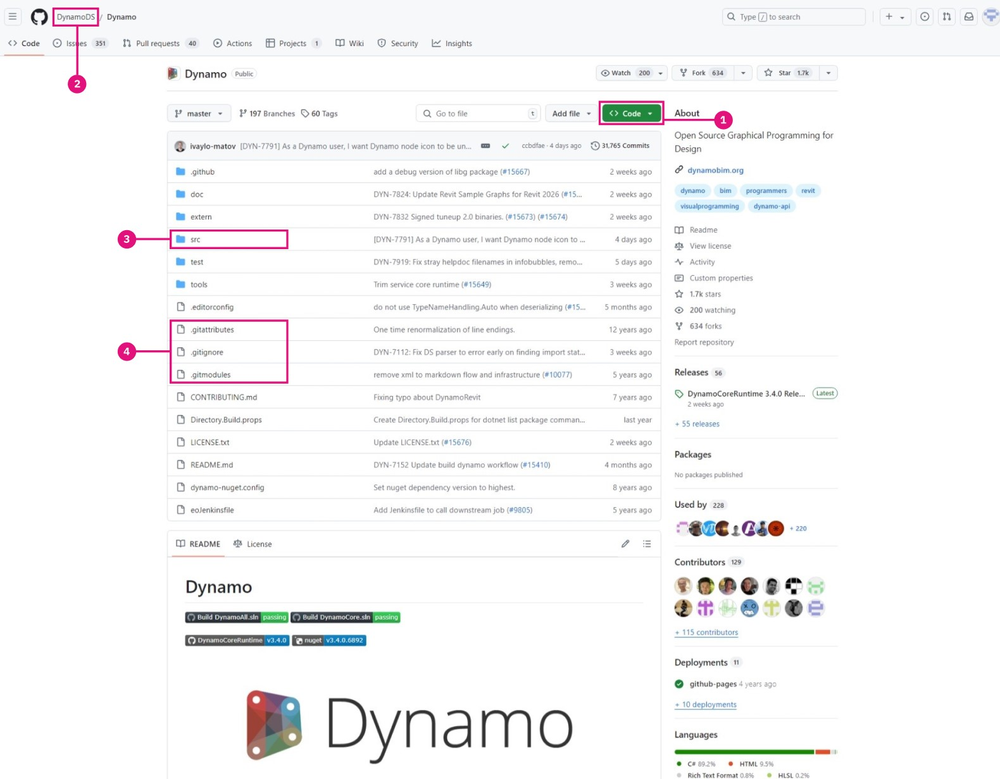

# Build Dynamo from Source

Dynamo's source is hosted on Github for anyone to clone and make contributions to. In this chapter, we will walk through how to clone the repository using git, compile the source files with Visual Studio, run and debug a local build, and pull any new changes from Github.

### Locating the Dynamo repositories on Github 

Github is a hosting service based on [git](https://help.github.com/articles/git-and-github-learning-resources/), a version control system for tracking changes and coordinating work between people. Git is a tool we can leverage to download Dynamo's source files, and keep them updated with a few commands. Using this method will avoid the unnecessary and inherently messy work of downloading and manually replacing the source files at every update. The git version control system will track any differences between a local and remote code repository.

Dynamo's source is hosted on the DynamoDS Github in this repository: [https://github.com/DynamoDS/Dynamo](https://github.com/DynamoDS/Dynamo)

> The Dynamo source files.
>
> 1. Clone or download the entire repository
> 2. View other DynamoDS repositories
> 3. Dynamo's source files
> 4. Git specific files

### Pulling the Dynamo repository using git 

Before we can clone the repository, we need to install git. Follow this [short guide](https://help.github.com/articles/set-up-git/#setting-up-git) for installation steps, and how to setup a GitHub username and email. For this example, we will be using git on the command line. This guide assumes you will be using windows but you can also use git on mac or Linux to clone the dynamo source.

We need a URL for the Dynamo repository to clone from. This can be found in the "Clone or download" button on the repository page. Copy the URL to paste into command prompt.

> 1. Select "Clone or download"
> 2. Copy the URL

With git installed, we can clone the Dynamo repository. Start by opening command prompt. Then use the change directory command `cd` to navigate to the folder where we want the source files to be cloned to. In this case, we have created a folder called `Github` in `Documents`.

`cd C:\Users\username\Documents\GitHub`

> Replace "username" with your user name

In the next step we will run a git command to clone the Dynamo repository to the location we specified. The URL in the command is obtained by clicking on the "Clone or Download" button on Github. Run this command in the command terminal. Note that this will clone the Dynamo repo master branch which is most updated code for Dynamo, and will contain to the latest version of Dynamo code. This branch changes daily.

`git clone https://github.com/DynamoDS/Dynamo.git`

We know git is working if the cloning operation completed successfully. In the file explorer, navigate to the directory where you cloned to see the source files. the directory structure should look identical to the Dynamo repository's master branch on Github.

> 1. Dynamo's source files
> 2. Git files

### Building the repository using Visual Studio 

With the source files now cloned to our local machine, we can build an executable file for Dynamo. In order to do this, we will need to set up the Visual Studio IDE and ensure that the .NET Framework and DirectX are installed.

* Download and install [Microsoft Visual Studio Community](https://visualstudio.microsoft.com/vs/community/), a free, fully-featured IDE (integrated development environment - later versions may work as well)
* Download and install [Microsoft .NET Framework 4.5](https://www.microsoft.com/en-us/download/details.aspx?id=30653) or later
* Install Microsoft DirectX from the local Dynamo repository (`Dynamo\tools\install\Extra\DirectX\DXSETUP.exe`)

> .NET and DirectX may already be installed.

> **Note:** Breaking change - [**Visual Studio 2022**](https://visualstudio.microsoft.com/vs/community/) **/** [**Visual Studio 2026 Insider**](https://visualstudio.microsoft.com/insiders/) Required
>
> Starting in late 2025, Dynamo will implement the `dotnet10.0` framework. To develop against this framework, you'll need Visual Studio 2022 Preview or Visual Studio 2026 Insider (or later) as the stable versions don't yet support .NET 10.0.
>
> **Installing Visual Studio 2022 Preview / 2026 insider alongside your existing installation:**
>
> 1. Open the **Visual Studio Installer** (search for it in your Start menu)
> 2. Click **Update** to ensure you have the latest installer version
> 3. Go to the **Available** tab
> 4. Find **Visual Studio 2022 Preview / 2026 Insider** (Community, Professional, or Enterprise)
> 5. Click **Install** to add it alongside your existing Visual Studio installation

.png>) .png>)

Once everything is finished installing, we can start Visual Studio and open the `Dynamo.All.sln` solution located in `Dynamo\src`.

> 1. Select `File > Open > Project/Solution`
> 2. Browse to the Dynamo repository and open the `src` folder
> 3. Select the `Dynamo.All.sln` solution file
> 4. Select `Open`

Before we can build the solution, a few settings should be specified. We should first build a debug version of Dynamo so visual studio can gather more information while debugging to help us develop, and we want to target AnyCPU.

> These will become folders inside the `bin` folder
>
> 1. For this example we chose `Debug` as the Solution Configuration
> 2. Set the Solution Platform to `Any CPU`

With the project open, we can build the solution. This process will create a DynamoSandbox.exe file that we can run.

> Building the project will restore NuGet dependencies.
>
> 1. Select `Build > Build Solution`
> 2. Verify that the build was successful in the Output window, it should read similar to `==== Build: 69 succeeded, 0 failed, 0 up-to-date, 0 skipped ====`

### Running a local build 

If Dynamo builds successfully, a `bin` folder will be created in the Dynamo repository with the DynamoSandbox.exe file. In our case, we're building with the Debug option, so the executable file is located in `bin\AnyCPU\Debug`. Running this will open a local build of Dynamo.

> 1. The DynamoSandbox executable we just built. Run this to start Dynamo.

Now we are almost fully set up to start developing for Dynamo.

For instructions on building Dynamo for other platforms (e.g. Linux or OS X) visit this [wiki page](https://github.com/DynamoDS/Dynamo/wiki/Dynamo-on-Linux,-Mac).

### Debugging a local build using Visual Studio 

Debugging is a process of identifying, isolating, and correcting a bug or issue. Once Dynamo has been successfully built from source, we can use several tools in Visual Studio to debug a running application, the DynamoRevit add-in for example. We can analyze its source code to find the root of an issue, or watch the currently executing code. For a more detailed explanation of how to debug and navigate code in Visual Studio, refer to the [Visual Studio Docs](https://docs.microsoft.com/en-us/visualstudio/debugger/navigating-through-code-with-the-debugger).

For the standalone Dynamo application, DynamoSandbox, we will cover two options for debugging:

* Build and start Dynamo directly from Visual Studio
* Attach Visual Studio to a running process of Dynamo

Starting Dynamo from Visual Studio rebuilds the solution for every debugging session if required, so if we made changes to the source they will be incorporated when debugging. With the `Dynamo.All.sln` solution still open, select `Debug`, `AnyCPU`, and `DynamoSandbox` from the drop-down menus and then click `Start`. This will build Dynamo and start a new process (DynamoSandbox.exe), and attach Visual Studio's debugger to it.

> Build and start the application directly from Visual Studio
>
> 1. Set configuration to `Debug`
> 2. Set platform to `Any CPU`
> 3. Set startup project to `DynamoSandbox`
> 4. Click `Start` to begin the debugging process

Alternatively, we may want to debug a Dynamo process that is already running to troubleshoot an issue with a specific graph open or package. For this purpose, we would open the project's source files in Visual Studio and attach to a running Dynamo process using the `Attach to Process` debug menu item.

> Attach a running process to Visual Studio
>
> 1. Select `Debug > Attach to Process...`
> 2. Choose `DynamoSandbox.exe`
> 3. Select `Attach`

In both situations we are attaching the debugger to a process we wish to debug. We can set break points in the code before or after starting the debugger that will cause the process to pause immediately before executing that line of code. If an uncaught exception is thrown while debugging, Visual Studio will jump to where it occurred in the source code. This is an efficient method for finding simple crashes, unhandled exceptions, and to understand the execution flow of an application.

> While debugging DynamoSandbox, we set a breakpoint in the Color.ByARGB node's constructor that causes the Dynamo process to pause when the node is instantiated. If this node was throwing an exception or causing Dynamo to crash, we could step through each line in the constructor to find where the issue was occurring.
>
> 1. The breakpoint
> 2. The call stack showing the function which is currently being executed and previous function calls.

In the next section, **Build DynamoRevit from Source,** we will walk through a specific example of debugging, and explain how to set break points, step through code, and read the call stack.

### Pulling latest build 

Since the Dynamo source is hosted on Github, the easiest way to keep local source files updated is by pulling changes using git commands.

Using the command line, set the current directory to the Dynamo repository:

`cd C:\Users\username\Documents\GitHub\Dynamo`

> Replace `"username"` with your username

Use the following command to pull the latest changes:

`git pull origin master`

> 1. Here we can see that the local repository has been updated with changes from the remote.

In addition to pulling updates, there are four more git workflows to be familiar with.

* **Fork** the Dynamo repository to create a copy separate from the original. Any changes made here will not affect the original repository and updates can be fetched from or submitted with pull requests. Fork is not a git command, but is a workflow that github adds - the fork, pull request model is one of the most common workflows for contributing to open source projects online. It is worth learning if you want to contribute to Dynamo.
* **Branch** - work on experiments or new features isolated from other work in branches. This makes sending pull requests easier.
* Make **commits** often, after completing a unit of work, and after a change that may want to be undone. A commit records changes to the repository and will be visible when making a pull request to the main Dynamo repository.
* Create **pull requests** when changes are ready to be officially proposed to the main Dynamo repository.

The Dynamo team has specific instructions on creating pull requests. Refer to the Pull Requests section in this documentation for more detailed items to address.

See this [documentation page](https://git-scm.com/docs) for a reference list of git commands.
