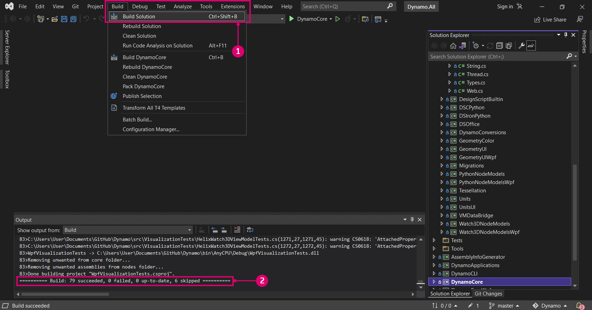

# 소스에서 Dynamo 빌드하기

Dynamo의 소스는 누구나 복제하고 기여할 수 있도록 Github에 호스팅됩니다. 이 장에서는 git을 사용하여 리포지토리를 복제하고, Visual Studio에서 소스 파일을 컴파일하고, 로컬 빌드를 실행 및 디버깅하고, Github에서 새로운 변경 사항을 끌어오는 방법을 살펴봅니다.

### Github에서 Dynamo 리포지토리 찾기 

Github는 변경 사항을 추적하고 작업자 간 작업을 조정하기 위한 버전 관리 시스템인 [git](https://docs.github.com/ko/get-started/quickstart/git-and-github-learning-resources)을 기반으로 하는 호스팅 서비스입니다. git은 Dynamo의 소스 파일을 다운로드하고 몇 가지 명령으로 소스 파일을 지속적으로 업데이트하는 데 활용할 수 있는 도구입니다. 이 방법을 사용하면 업데이트할 때마다 소스 파일을 다운로드하고 수동으로 바꾸는 불필요하고 번거로운 작업을 피할 수 있습니다. git 버전 관리 시스템은 로컬 코드 리포지토리와 원격 코드 리포지토리 간의 차이를 추적합니다.

Dynamo의 소스는 [https://github.com/DynamoDS/Dynamo](https://github.com/DynamoDS/Dynamo) 리포지토리의 DynamoDS Github에 호스팅됩니다.

> Dynamo 소스 파일입니다.
>
> 1. 전체 리포지토리 복제 또는 다운로드
> 2. 다른 DynamoDS 리포지토리 보기
> 3. Dynamo의 소스 파일
> 4. Git 관련 파일

### git을 사용하여 Dynamo 리포지토리 끌어오기 

리포지토리를 복제하려면 먼저 git을 설치해야 합니다. 설치 단계 및 GitHub 사용자 이름 및 이메일을 설정하는 방법에 대해서는 이 [간략한 안내서](https://docs.github.com/ko/get-started/quickstart/set-up-git#setting-up-git)를 따르십시오. 이 예에서는 명령행에서 git을 사용할 것입니다. 이 안내서에서는 Windows를 사용한다고 가정하지만, mac 또는 Linux에서도 git을 사용하여 Dynamo 소스를 복제할 수 있습니다.

복제할 Dynamo 리포지토리의 URL을 파악해야 합니다. 이 기능은 리포지토리 페이지의 "복제 또는 다운로드" 버튼에서 찾을 수 있습니다. URL을 복사하여 명령 프롬프트에 붙여넣습니다.

> 1. "복제 또는 다운로드"를 선택합니다.
> 2. URL을 복사합니다.

git이 설치되어 있으면 Dynamo 리포지토리를 복제할 수 있습니다. 명령 프롬프트를 열어서 시작합니다. 그런 다음 디렉토리 변경 명령 `cd`를 사용하여 소스 파일을 복제할 폴더를 탐색합니다. 여기에서는 `Documents`에 `Github`라는 폴더를 생성했습니다.

`cd C:\Users\username\Documents\GitHub`

> "username"을 사용자 이름으로 바꿉니다.

다음 단계에서는 git 명령을 실행하여 Dynamo 리포지토리를 지정한 위치에 복제합니다. 명령의 URL은 Github에서 "복제 또는 다운로드" 버튼을 클릭하여 확인할 수 있습니다. 명령 터미널에서 이 명령을 실행합니다. 그러면 Dynamo의 가장 최신 업데이트 코드인 Dynamo 리포지토리 마스터 분기가 복제되고 최신 버전의 Dynamo 코드가 포함됩니다. 이 분기는 매일 변경됩니다.

`git clone https://github.com/DynamoDS/Dynamo.git`

복제 작업이 성공적으로 완료되면 git이 잘 작동하는 것입니다. 파일 탐색기에서 복제한 디렉토리로 이동하여 소스 파일을 확인합니다. 디렉토리 구조는 Github의 Dynamo 리포지토리의 마스터 분기와 동일할 것입니다.

> 1. Dynamo의 소스 파일
> 2. Git 파일

### Visual Studio를 사용하여 리포지토리 빌드하기 

소스 파일이 로컬 컴퓨터에 복제되면, 이제 Dynamo용 실행 파일을 빌드할 수 있습니다. 이를 위해서는 Visual Studio IDE를 설정하고 .NET Framework 및 DirectX가 설치되어 있는지 확인해야 합니다.

* 완전한 기능을 갖춘 무료 IDE(통합 개발 환경)인 [Microsoft Visual Studio Community 2015](https://my.visualstudio.com/Downloads/Results)(이후 버전도 작동할 수 있음)를 다운로드한 후 설치합니다.
* [Microsoft .NET Framework 4.5](https://www.microsoft.com/ko-kr/download/details.aspx?id=30653) 이상 버전을 다운로드한 후 설치합니다.
* 로컬 Dynamo 리포지토리에서 Microsoft DirectX(`Dynamo\tools\install\Extra\DirectX\DXSETUP.exe`)를 설치합니다.

> .NET 및 DirectX가 이미 설치되어 있을 수 있습니다.

설치가 모두 완료되면 Visual Studio를 시작하고 `Dynamo\src`에 있는 `Dynamo.All.sln` 솔루션을 열 수 있습니다.

> 1. `File > Open > Project/Solution`을 선택합니다.
> 2. Dynamo 리포지토리로 이동하여 `src` 폴더를 엽니다.
> 3. `Dynamo.All.sln` 솔루션 파일을 선택합니다.
> 4. `Open`을 선택합니다.

솔루션을 빌드하려면 먼저 몇 가지 설정을 지정해야 합니다. 먼저 Visual Studio가 디버깅하면서 개발하는 데 도움이 되는 더 많은 정보를 수집할 수 있도록 Dynamo의 디버그 버전을 빌드해야 합니다. 여기서는 AnyCPU를 대상 플랫폼으로 지정하겠습니다.

> `bin` 폴더 안에 폴더가 생성됩니다.
>
> 1. 이 예에서는 솔루션 구성으로 `Debug`를 선택했습니다.
> 2. 솔루션 플랫폼을 `Any CPU`로 설정합니다.

프로젝트가 열리면 솔루션을 빌드할 수 있습니다. 이 프로세스를 수행하면 실행할 수 있는 DynamoSandbox.exe 파일이 생성됩니다.

> 프로젝트를 빌드하면 NuGet 종속성이 복원됩니다.
>
> 1. `Build > Build Solution`을 선택합니다.
> 2. 빌드가 성공적으로 수행되어 출력 창에 `==== Build: 69 succeeded, 0 failed, 0 up-to-date, 0 skipped ====`와 유사하게 표시되는지 확인합니다.

### 로컬 빌드 실행하기 

Dynamo가 성공적으로 빌드되면 DynamoSandbox.exe 파일이 있는 `bin` 폴더가 Dynamo 리포지토리에 생성됩니다. 이 예에서는 디버그 옵션을 사용하여 빌드하고 있으므로 실행 파일은 `bin\AnyCPU\Debug`에 있습니다. 이 파일을 실행하면 Dynamo의 로컬 빌드가 열립니다.

> 1. 방금 빌드한 DynamoSandbox 실행 파일입니다. 이 실행 파일을 실행하여 Dynamo를 시작합니다.

이제 Dynamo를 위한 개발을 시작할 준비가 거의 완료되었습니다.

다른 플랫폼(예: Linux 또는 OS X)용 Dynamo를 빌드하는 방법에 대한 지침은 이 [wiki 페이지](https://github.com/DynamoDS/Dynamo/wiki/Dynamo-on-Linux,-Mac)를 참조하십시오.

### Visual Studio를 사용하여 로컬 빌드 디버깅하기 

디버깅은 버그 또는 이슈를 식별하고 가려내고 해결하는 프로세스입니다. Dynamo가 소스에서 성공적으로 빌드되면 Visual Studio의 여러 도구를 사용하여 실행 중인 응용프로그램(예: DynamoRevit 애드인)을 디버깅할 수 있습니다. 또한, 소스 코드를 분석하여 이슈의 근본 원인을 찾거나 현재 실행 중인 코드를 확인할 수 있습니다. Visual Studio에서 코드를 디버깅하고 탐색하는 방법에 대한 자세한 내용은 [Visual Studio 문서](https://docs.microsoft.com/ko-kr/visualstudio/debugger/navigating-through-code-with-the-debugger)를 참조하십시오.

독립 실행형 Dynamo 응용프로그램인 DynamoSandbox의 두 가지 디버깅 옵션을 살펴보겠습니다.

* Visual Studio에서 직접 Dynamo 빌드 및 시작하기
* Visual Studio를 실행 중인 Dynamo 프로세스에 연결하기

Visual Studio에서 Dynamo를 시작하면 필요한 경우 모든 디버깅 세션에 대해 솔루션이 다시 빌드되므로, 소스를 변경하면 디버깅할 때 변경 사항이 포함됩니다. `Dynamo.All.sln` 솔루션이 열려 있는 상태로 드롭다운 메뉴에서 `Debug`, `AnyCPU` 및 `DynamoSandbox`를 선택한 다음 `Start`를 클릭합니다. 이렇게 하면 Dynamo가 빌드되고 새 프로세스(DynamoSandbox.exe)가 시작되고 Visual Studio의 디버거가 이 프로세스에 연결됩니다.

> Visual Studio에서 직접 응용프로그램 빌드 및 시작하기
>
> 1. 구성을 `Debug`로 설정합니다.
> 2. 플랫폼을 `Any CPU`로 설정합니다.
> 3. 시작 프로젝트를 `DynamoSandbox`로 설정합니다.
> 4. `Start`를 클릭하여 디버깅 프로세스를 시작합니다.

또는 특정 그래프가 열려 있거나 패키지에 대한 이슈를 해결하기 위해 이미 실행 중인 Dynamo 프로세스를 디버깅할 수도 있습니다. 이렇게 하려면 Visual Studio에서 프로젝트의 소스 파일을 열고 `Attach to Process` 디버그 메뉴 항목을 사용하여 실행 중인 Dynamo 프로세스에 연결합니다.

> 실행 중인 프로세스를 Visual Studio에 연결하기
>
> 1. `Debug > Attach to Process...`를 선택합니다.
> 2. `DynamoSandbox.exe`를 선택합니다.
> 3. `Attach`를 선택합니다.

두 상황에서 모두 디버깅하려는 프로세스에 디버거를 연결하겠습니다. 디버거를 시작하기 전이나 후에 코드에서 중단점을 설정하여 해당 코드 줄을 실행하기 직전에 프로세스가 중지되도록 할 수 있습니다. 디버깅하는 동안 예기치 않은 예외가 발생하면 Visual Studio는 소스 코드에서 예외가 발생한 위치로 이동됩니다. 이 방법은 단순한 충돌과 처리되지 않은 예외를 찾고 응용프로그램의 실행 흐름을 파악하는 데 효율적입니다.

> DynamoSandbox를 디버깅하는 동안, 노드가 인스턴스화될 때 Dynamo 프로세스가 일시 중지되도록 Color.ByARGB 노드의 생성자에 중단점을 설정했습니다. 이 노드로 인해 예외가 발생하거나 Dynamo가 충돌하는 경우 생성자의 각 줄을 단계별로 실행하여 이슈가 발생한 위치를 찾을 수 있습니다.
>
> 1. 중단점
> 2. 현재 실행 중인 함수와 이전 함수 호출을 보여 주는 호출 스택

다음 섹션인 **소스에서 DynamoRevit 빌드하기**에서는 디버깅 관련 예를 안내하고, 중단점을 설정하고 코드를 단계별로 실행하고 호출 스택을 읽는 방법에 대해 설명합니다.

### 최신 빌드 끌어오기 

Dynamo 소스는 Github에 호스팅되므로 로컬 소스 파일을 업데이트하는 가장 쉬운 방법은 git 명령을 사용하여 변경 사항을 끌어오는 것입니다.

명령행을 사용하여 현재 디렉토리를 Dynamo 리포지토리로 설정합니다.

`cd C:\Users\username\Documents\GitHub\Dynamo`

> `"username"`을 사용자 이름으로 바꿉니다.

다음 명령을 사용하여 최신 변경 사항을 끌어옵니다.

`git pull origin master`

> 1. 로컬 리포지토리가 원격 변경 사항으로 업데이트된 것을 볼 수 있습니다.

업데이트 끌어오기 외에도 익숙해져야 할 네 가지 git 워크플로우가 더 있습니다.

* Dynamo 리포지토리를 **포크**하여 원본과 별도로 사본을 생성합니다. 여기서 변경한 사항은 원래 리포지토리에는 영향을 주지 않으며, 끌어오기 요청에서 업데이트를 가져오거나 끌어오기 요청과 함께 업데이트를 제출할 수 있습니다. 포크는 git 명령이 아니라 github가 추가하는 워크플로우입니다. 포크, 끌어오기 요청 모델은 온라인에서 오픈 소스 프로젝트에 기여하는 가장 일반적인 워크플로우 중 하나입니다. Dynamo에 기여하고 싶은 경우 알아 두면 좋습니다.
* **분기** \- 실험 또는 새 기능을 분기의 다른 작업에서 분리하여 작업할 수 있습니다. 이렇게 하면 끌어오기 요청을 더 쉽게 보낼 수 있습니다.
* 작업 단위를 완료한 후, 그리고 실행 취소하고 싶을 수 있는 변경 사항이 있을 때 자주 **커밋**합니다. 커밋은 리포지토리에 대한 변경 사항을 기록하며 주 Dynamo 리포지토리에 대해 끌어오기 요청을 수행할 때 표시됩니다.
* 변경 사항을 주 Dynamo 리포지토리에 공식적으로 제안할 준비가 되면 **끌어오기 요청**을 생성합니다.

Dynamo 팀은 끌어오기 요청 생성과 관련된 지침을 구체적으로 마련해 두었습니다. 자세한 내용은 이 문서의 끌어오기 요청 섹션을 참조하십시오.

git 명령의 참조 목록은 이 [문서 페이지](https://git-scm.com/docs)를 참조하십시오.
