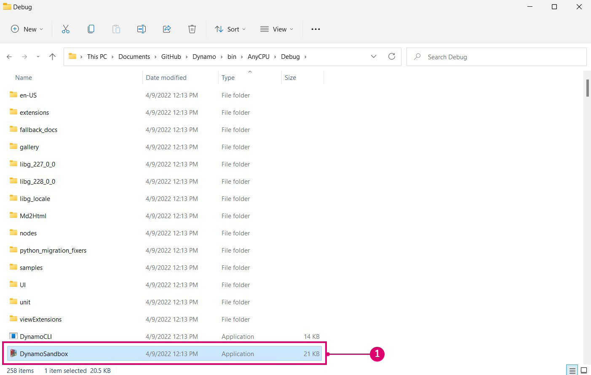

# Sestavení aplikace Dynamo ze zdroje 

Zdroj aplikace Dynamo je hostován na Githubu, kde jej může kdokoli klonovat a přispívat do něj. V této kapitole si ukážeme, jak klonovat úložiště pomocí gitu, kompilovat zdrojové soubory pomocí aplikace Visual Studio, spustit a ladit místní sestavení a získat všechny nové změny z Githubu.

#### Vyhledání úložišť aplikace Dynamo na Githubu 

Github je hostovací služba založená na [gitu](https://help.github.com/articles/git-and-github-learning-resources/), systému pro správu verzí, který slouží ke sledování změn a koordinaci práce mezi lidmi. Git je nástroj, který můžeme využít ke stažení zdrojových souborů aplikace Dynamo a jejich aktualizaci pomocí několika příkazů. Použitím této metody se vyhnete zbytečné a nepřehledné práci se stahováním a ručním nahrazováním zdrojových souborů při každé aktualizaci. Systém správy verzí git bude sledovat veškeré rozdíly mezi místním a vzdáleným úložištěm kódů.

Zdroj aplikace Dynamo je hostován na Githubu DynamoDS v tomto úložišti: [https://github.com/DynamoDS/Dynamo](https://github.com/DynamoDS/Dynamo).

> Zdrojové soubory aplikace Dynamo.
>
> 1. Klonování nebo stáhnutí celého úložiště
> 2. Zobrazení dalších úložišť DynamoDS
> 3. Zdrojové soubory aplikace Dynamo
> 4. Specifické soubory Gitu

#### Získání úložiště aplikace Dynamo pomocí gitu 

Než bude možné úložiště klonovat, je třeba nainstalovat git. V této [krátké příručce](https://help.github.com/articles/set-up-git/#setting-up-git) naleznete postup instalace a nastavení uživatelského jména a e-mailu pro github. V tomto příkladu použijeme git na příkazovém řádku. Tato příručka předpokládá, že budete používat systém Windows, ale ke klonování zdroje aplikace Dynamo můžete použít také git v systému Mac nebo Linux.

Potřebujeme adresu URL úložiště aplikace Dynamo, ze kterého se bude klonovat. Tu najdeme v tlačítku Clone or download (Klonovat nebo stáhnout) na stránce úložiště. Zkopírujte adresu URL, kterou chcete vložit do příkazového řádku.

> 1. Vyberte možnost Clone or download (Klonovat nebo stáhnout).
> 2. Zkopírujte adresu URL.

S nainstalovaným gitem můžeme klonovat úložiště aplikace Dynamo. Začněte otevřením příkazového řádku. Poté pomocí příkazu pro změnu adresáře `cd` přejděte do složky, do které chcete zdrojové soubory klonovat. V tomto případě jsme vytvořili složku s názvem `Github` ve složce `Documents`.

`cd C:\Users\username\Documents\GitHub`

> Parametr „username“ nahraďte svým uživatelským jménem.

V dalším kroku spustíme příkaz gitu, který naklonuje úložiště aplikace Dynamo do zadaného umístění. Adresu URL v příkazu získáte kliknutím na tlačítko Clone or download (Klonovat nebo stáhnout) na Githubu. Tento příkaz spusťte v příkazovém řádku. Tímto příkazem se naklonuje hlavní větev úložiště aplikace Dynamo, která obsahuje nejaktuálnější verzi kódu aplikace Dynamo. Tato větev se denně mění.

`git clone https://github.com/DynamoDS/Dynamo.git`

Pokud byla operace klonování úspěšně dokončena, víme, že git funguje. V Průzkumníku souborů přejděte do adresáře, do kterého jste klonovali, a zobrazte zdrojové soubory. Struktura adresáře by měla vypadat stejně jako hlavní větev úložiště aplikace Dynamo na Githubu.

> 1. Zdrojové soubory aplikace Dynamo
> 2. Soubory Git

#### Vytvoření úložiště pomocí aplikace Visual Studio 

Pomocí zdrojových souborů, které jsou nyní klonovány do místního počítače, můžeme vytvořit spustitelný soubor pro aplikaci Dynamo. Za tímto účelem je nutné nastavit prostředí Visual Studio IDE a zajistit instalaci rozhraní .NET Framework a DirectX.

* Stáhněte a nainstalujte [Microsoft Visual Studio Community 2015](https://my.visualstudio.com/Downloads/Results), bezplatné, plně vybavené integrované vývojové prostředí (IDE – mohou fungovat i novější verze).
* Stáhněte a nainstalujte rozhraní [Microsoft .NET Framework 4.5](https://www.microsoft.com/en-us/download/details.aspx?id=30653) nebo novější.
* Nainstalujte rozhraní Microsoft DirectX z místního úložiště aplikace Dynamo (`Dynamo\tools\install\Extra\DirectX\DXSETUP.exe`).

> Rozhraní .NET a DirectX již mohou být nainstalovány.

Po dokončení instalace můžete spustit aplikaci Visual Studio a otevřít řešení `Dynamo.All.sln`, které se nachází v umístění `Dynamo\src`.

> 1. Vyberte `File > Open > Project/Solution`.
> 2. Přejděte do úložiště aplikace Dynamo a otevřete složku `src`.
> 3. Vyberte soubor řešení `Dynamo.All.sln`.
> 4. Klikněte na tlačítko `Open`.

Než budeme moct vytvořit řešení, je třeba zadat několik nastavení. Nejprve bychom měli vytvořit ladicí verzi aplikace Dynamo, aby aplikace Visual Studio mohla získat další informace při ladění, které nám pomůžou s vývojem, přičemž jako platformu vybereme možnost „AnyCPU“.

> Tyto složky se stanou složkami ve složce `bin`.
>
> 1. V tomto příkladu jsme jako konfiguraci řešení vybrali `Debug`.
> 2. Nastavte platformu řešení na `Any CPU`

S otevřeným projektem můžeme vytvořit řešení. Tento proces vytvoří soubor DynamoSandbox.exe, který můžeme spustit.

> Vytvořením projektu se obnoví závislosti NuGet.
>
> 1. Vyberte `Build > Build Solution`.
> 2. V okně Výstup ověřte, zda sestavení proběhlo úspěšně. Měla by se zobrazit zpráva podobná této: `==== Build: 69 succeeded, 0 failed, 0 up-to-date, 0 skipped ====`

#### Spuštění místního sestavení 

Pokud sestavení aplikace Dynamo proběhlo úspěšně, vytvoří se v úložišti aplikace Dynamo složka `bin` se souborem DynamoSandbox.exe. V našem případě vytváříme sestavení s možností Debug, takže spustitelný soubor se nachází v umístění `bin\AnyCPU\Debug`. Spuštěním tohoto souboru otevřete místní sestavení aplikace Dynamo.

> 1. Spustitelný soubor DynamoSandbox, který jsme právě vytvořili. Jeho spuštěním spustíte aplikaci Dynamo.

Nyní jsme téměř plně připraveni začít s vývojem pro aplikaci Dynamo.

Pokyny k vytváření aplikace Dynamo pro další platformy (například Linux nebo OS X) naleznete na této [stránce Wiki](https://github.com/DynamoDS/Dynamo/wiki/Dynamo-on-Linux,-Mac).

#### Ladění místního sestavení pomocí aplikace Visual Studio 

Ladění je proces identifikace, izolování a opravy chyby nebo problému. Po úspěšném sestavení aplikace Dynamo ze zdroje můžeme pomocí několika nástrojů v aplikaci Visual Studio ladit spuštěnou aplikaci, například doplněk DynamoRevit. Můžeme analyzovat jeho zdrojový kód a najít příčinu problému nebo sledovat aktuálně prováděný kód. Podrobnější informace o tom, jak ladit a procházet kód v aplikaci Visual Studio, naleznete v [dokumentaci k aplikaci Visual Studio](https://docs.microsoft.com/en-us/visualstudio/debugger/navigating-through-code-with-the-debugger).

V případě samostatné aplikace Dynamo, DynamoSandbox, se budeme zabývat dvěma možnostmi ladění:

* Sestavení a spuštění aplikace Dynamo přímo z aplikace Visual Studio
* Připojení aplikace Visual Studio ke spuštěnému procesu aplikace Dynamo

Spuštění aplikace Dynamo z aplikace Visual Studio v případě potřeby znovu sestaví řešení pro každou relaci ladění, takže pokud jsme provedli změny zdroje, budou při ladění začleněny. Se stále otevřeným řešením `Dynamo.All.sln` vyberte v rozevíracích nabídkách možnosti `Debug`, `AnyCPU` a `DynamoSandbox` a klikněte na tlačítko `Start`. Tím se vytvoří aplikace Dynamo, spustí se nový proces (DynamoSandbox.exe) a připojí se k němu ladicí program aplikace Visual Studio.

> Vytvořte a spusťte aplikaci přímo z aplikace Visual Studio.
>
> 1. Nastavte konfiguraci na `Debug`.
> 2. Nastavte platformu na `Any CPU`.
> 3. Nastavte spouštěný projekt na `DynamoSandbox`.
> 4. Kliknutím na tlačítko `Start` zahajte proces ladění.

Případně můžete chtít ladit proces aplikace Dynamo, který je již spuštěný, abyste vyřešili problém s konkrétním otevřeným grafem nebo balíčkem. Za tímto účelem otevřete zdrojové soubory projektu v aplikaci Visual Studio a připojte je ke spuštěnému procesu aplikace Dynamo pomocí položky nabídky ladění `Attach to Process`.

> Připojení spuštěného procesu k aplikaci Visual Studio
>
> 1. Vyberte `Debug > Attach to Process...`.
> 2. Zvolte soubor `DynamoSandbox.exe`.
> 3. Klikněte na tlačítko `Attach`.

V obou případech připojujeme ladicí program k procesu, který chceme ladit. V kódu můžeme před nebo po spuštění ladicího programu nastavit body přerušení, které způsobí, že se proces zastaví bezprostředně před provedením tohoto řádku kódu. Pokud je během ladění vyvolána nezachycená výjimka, aplikace Visual Studio přejde na místo jejího výskytu ve zdrojovém kódu. Jedná se o efektivní metodu hledání jednoduchých selhání, neošetřených výjimek a pochopení toku spuštění aplikace.

> Při ladění aplikace DynamoSandbox jsme nastavili bod přerušení v konstruktoru uzlu Colour.ByARGB, který způsobí pozastavení procesu aplikace Dynamo při vytvoření instance uzlu. Pokud tento uzel způsobí výjimku nebo selhání aplikace Dynamo, můžeme postupně projít jednotlivé řádky konstruktoru a zjistit, kde k problému došlo.
>
> 1. Bod přerušení
> 2. Zásobník volání zobrazující funkci, která je právě vykonávána, a předchozí volání funkcí.

V další části **Sestavení doplňku DynamoRevit ze zdroje** si ukážeme konkrétní příklad ladění a vysvětlíme, jak nastavit body přerušení, krokovat kód a číst zásobník volání.

#### Získání nejnovějšího sestavení 

Protože je zdroj aplikace Dynamo hostován na Githubu, nejjednodušším způsobem, jak aktualizovat místní zdrojové soubory, je získávání změn pomocí příkazů git.

Pomocí příkazového řádku nastavte aktuální adresář na úložiště aplikace Dynamo:

`cd C:\Users\username\Documents\GitHub\Dynamo`

> Parametr `"username"` nahraďte svým uživatelským jménem.

K získání nejnovějších změn použijte následující příkaz:

`git pull origin master`

> 1. Zde je vidět, že místní úložiště bylo aktualizováno změnami ze vzdáleného úložiště.

Kromě získávání aktualizací je třeba znát další čtyři pracovní postupy gitu.

* **Rozvětvením** úložiště aplikace Dynamo vytvoříte kopii oddělenou od originálu. Jakékoli změny zde provedené nebudou mít vliv na původní úložiště a aktualizace mohou být získávány z úložiště nebo do něj odesílány pomocí žádostí o přijetí změn. Rozvětvení (fork) není příkaz gitu. Je to pracovní postup, který přidává github – rozvětvení a žádost o přijetí změn je jedním z nejběžnějších pracovních postupů pro přispívání do projektů s otevřeným zdrojovým kódem online. Chcete-li přispívat do aplikace Dynamo, je vhodné se ho naučit.
* **Větev** (branch) – umožňuje pracovat na experimentech nebo nových prvcích izolovaně od ostatní práce ve větvích. Díky tomu je odesílání žádostí o přijetí změn jednodušší.
* Často provádějte **zápisy** (commit), zejména po dokončení pracovní jednotky a po změně, kterou možná budete chtít vrátit zpět. Zápis zaznamenává změny v úložišti a bude viditelný při zadávání žádosti o přijetí změn do hlavního úložiště aplikace Dynamo.
* Vytvářejte **žádosti o přijetí změn** (pull request), když jsou změny připraveny k oficiálnímu navržení do hlavního úložiště aplikace Dynamo.

Tým aplikace Dynamo má konkrétní pokyny pro vytváření žádostí o přijetí změn. Podrobnější informace najdete v části Žádosti o přijetí změn v této dokumentaci.

Na této [stránce dokumentace](https://git-scm.com/docs) naleznete referenční seznam příkazů git.
