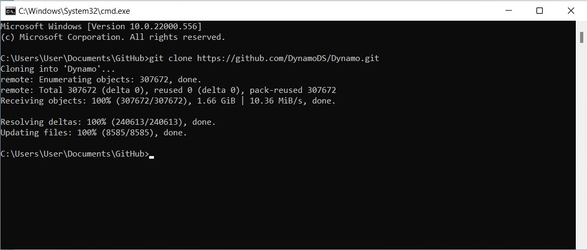

# 从源代码构建 Dynamo

Dynamo 的源代码托管在 GitHub 上，可供任何人克隆并参与修改。在这一章中，我们将漫游如何使用 git 克隆存储库、使用 Visual Studio 编译源文件、运行和调试本地构建，以及从 GitHub 中拉取任何新更改。

### 在 GitHub 上查找 Dynamo 存储库 

GitHub 是一种基于 [Git](https://docs.github.com/zh/get-started/quickstart/git-and-github-learning-resources) 的托管服务，它是一个版本控制系统，可用于跟踪更改并协调用户之间的工作。Git 是一种工具，我们可以利用它来下载 Dynamo 的源文件，并可以通过几条命令来保持更新这些源文件。通过使用此方法，将避免每次更新时下载和手动替换源文件这一不必要的固有混乱工作。Git 版本控制系统将跟踪本地和远程代码存储库之间的任何差异。

Dynamo 的源代码托管在 DynamoDS GitHub 上的以下存储库中：[https://github.com/DynamoDS/Dynamo](https://github.com/DynamoDS/Dynamo)

> Dynamo 源文件。
>
> 1. 克隆或下载整个存储库
> 2. 查看其他 DynamoDS 存储库
> 3. Dynamo 的源文件
> 4. Git 特定文件

### 使用 Git 拉取 Dynamo 存储库 

在可以克隆存储库之前，我们需要先安装 Git。请跟随此[简短手册](https://docs.github.com/zh/get-started/quickstart/set-up-git#setting-up-git)来了解安装步骤，以及如何设置 GitHub 用户名和电子邮件地址。在本例中，我们将在命令行中使用 Git。本手册假定您将使用的是 Windows，但也可以在 Mac 或 Linux 中使用 Git 来克隆 Dynamo 源代码。

我们需要一个 Dynamo 存储库的 URL，以通过其进行克隆。这可以在存储库页面上的“克隆或下载”按钮中找到。复制要粘贴到命令提示中的 URL。

> 1. 选择“Clone or download”
> 2. 复制 URL

在完成安装 Git 后，我们就可以克隆 Dynamo 库。首先打开命令提示。然后，使用更改目录命令 `cd`，以导航到要将源文件克隆到的目标文件夹。在本例中，我们在 `Documents` 中已创建了一个名为 `Github` 的文件夹。

`cd C:\Users\username\Documents\GitHub`

> 将“username”替换为您的用户名

在下一步中，我们将运行一个 git 命令，以将 Dynamo 存储库克隆到我们指定的位置。通过单击 GitHub 上的“克隆或下载”按钮，可获取命令中的 URL。在命令终端中运行此命令。请注意，这将克隆 Dynamo 存储库主分支（它是 Dynamo 的最新代码），并将包含到最新版本的 Dynamo 代码。此分支每天都会发生变化。

`git clone https://github.com/DynamoDS/Dynamo.git`

如果克隆操作成功完成，则我们知道 Git 工作正常。在文件资源管理器中，导航到克隆的目录以查看源文件。目录结构看起来应与 GitHub 上 Dynamo 存储库的主分支相同。

> 1. Dynamo 的源文件
> 2. Git 文件

### 使用 Visual Studio 构建存储库 

在源文件现已克隆到我们的本地计算机后，我们可以为 Dynamo 构建可执行文件。为此，我们需要设置 Visual Studio IDE，并确保已安装 .NET Framework 和 DirectX。

* 下载并安装 [Microsoft Visual Studio Community 2015](https://my.visualstudio.com/Downloads/Results)，这是一个功能齐全的免费 IDE（集成开发环境 - 更高版本也可以使用）
* 下载并安装 [Microsoft .NET Framework 4.5](https://www.microsoft.com/zh-cn/download/details.aspx?id=30653) 或更高版本
* 从本地 Dynamo 存储库 (`Dynamo\tools\install\Extra\DirectX\DXSETUP.exe`) 安装 Microsoft DirectX

> 可能已安装 .NET 和 DirectX。

在完成所有安装后，我们就可以启动 Visual Studio，然后打开位于 `Dynamo\src` 中的 `Dynamo.All.sln` 解决方案。

> 1. 选择 `File > Open > Project/Solution`
> 2. 浏览到 Dynamo 库并打开 `src` 文件夹
> 3. 选择 `Dynamo.All.sln` 解决方案文件
> 4. 选择 `Open`

在可以构建解决方案之前，应先指定一些设置。我们应该先构建调试版本的 Dynamo，以便 Visual Studio 可以在调试期间收集更多信息来帮助我们开发，并且我们希望以 AnyCPU 为目标。

> 这些将成为 `bin` 文件夹内的文件夹
>
> 1. 在本例中，我们选择 `Debug` 作为解决方案配置
> 2. 将解决方案平台设置为 `Any CPU`

在项目打开后，我们可以构建解决方案。此过程将创建一个我们可以运行的 DynamoSandbox.exe 文件。

> 通过构建项目，将恢复 NuGet 依存关系。
>
> 1. 选择 `Build > Build Solution`
> 2. 在“输出”窗口中确认构建是否已成功，其内容应类似于 `==== Build: 69 succeeded, 0 failed, 0 up-to-date, 0 skipped ====`

### 运行本地构建 

如果 Dynamo 构建成功，则会在 Dynamo 存储库中创建一个 `bin` 文件夹，其中包含 DynamoSandbox.exe 文件。在我们的案例中，我们使用“调试”选项进行构建，因此可执行文件位于 `bin\AnyCPU\Debug` 中。运行此文件会打开 Dynamo 的本地构建。

> 1. 我们刚刚构建的 DynamoSandbox 可执行文件。运行此文件以启动 Dynamo。

现在，我们几乎已完全准备好开始为 Dynamo 开发。

有关为其他平台（例如，Linux 或 OS X）构建 Dynamo 的说明，请访问此 [Wiki 页面](https://github.com/DynamoDS/Dynamo/wiki/Dynamo-on-Linux,-Mac)。

### 使用 Visual Studio 调试本地构建 

调试是一个识别、隔离和更正错误或问题的过程。在从源代码成功构建 Dynamo 后，我们可以使用 Visual Studio 中的多款工具来调试正在运行的应用程序（例如，DynamoRevit 附加模块）。我们可以分析它的源代码来查找问题的根源，也可以观察当前正在执行的代码。有关如何在 Visual Studio 中调试和导览代码的更详细说明，请参见 [Visual Studio 文档](https://docs.microsoft.com/zh-cn/visualstudio/debugger/navigating-through-code-with-the-debugger)。

对于单机版 Dynamo 应用程序 DynamoSandbox，我们会介绍两个用于调试的选项：

* 直接从 Visual Studio 构建并启动 Dynamo
* 将 Visual Studio 附加到正在运行的 Dynamo 进程

如果需要，从 Visual Studio 启动 Dynamo 会为每个调试会话重新构建解决方案；因此，如果我们对源代码进行更改，则在调试时将合并这些更改。在 `Dynamo.All.sln` 解决方案仍打开的情况下，从下拉菜单中选择 `Debug`、`AnyCPU` 和 `DynamoSandbox`，然后单击 `Start`。这将构建 Dynamo 并启动一个新进程 (DynamoSandbox.exe)，然后将 Visual Studio 的调试器附加到该进程。

> 直接从 Visual Studio 构建和启动应用程序
>
> 1. 将配置设置为 `Debug`
> 2. 将平台设置为 `Any CPU`
> 3. 将启动项目设置为 `DynamoSandbox`
> 4. 单击 `Start` 以开始调试过程

或者，我们可能希望调试已在运行的 Dynamo 进程，以解决特定图形打开或打包的问题。为此，我们将在 Visual Studio 中打开项目的源文件，然后使用 `Attach to Process` 调试菜单项附加到正在运行的 Dynamo 进程。

> 将正在运行的进程附加到 Visual Studio
>
> 1. 选择 `Debug > Attach to Process...`
> 2. 选择 `DynamoSandbox.exe`
> 3. 选择 `Attach`

在这两种情况下，我们都会将调试器附加到要调试的进程。我们可以在启动调试器之前或之后在代码中设置断点，这将导致进程在执行该行代码之前立即暂停。如果在调试期间引发未捕获的异常，则 Visual Studio 会跳转到源代码中发生异常的位置。这是一种用于查找简单崩溃、未处理的异常以及了解应用程序执行流的有效方法。

> 在调试 DynamoSandbox 期间，我们在 Color.ByARGB 节点的构造函数中设置一个断点，这会导致 Dynamo 进程在节点实例化时暂停。如果此节点抛出异常或导致 Dynamo 崩溃，则我们可以单步调试构造函数中的每一行，以查找出现问题的位置。
>
> 1. 断点
> 2. 显示当前正在执行的函数和以前的函数调用的调用堆栈。

在下一节（**从源代码构建 DynamoRevit**）中，我们将漫游一个特定的调试示例，并说明如何设置断点、单步调试代码和读取调用堆栈。

### 拉取最新构建 

由于 Dynamo 源代码托管在 GitHub 上，因此保持更新本地源文件的最简单方法是使用 Git 命令拉取更改。

使用命令行，将当前目录设置为 Dynamo 存储库：

`cd C:\Users\username\Documents\GitHub\Dynamo`

> 将 `"username"` 替换为您的用户名

使用以下命令，可拉取最新更改：

`git pull origin master`

> 1. 在此处，我们可以看到本地存储库已使用远程存储库中的更改进行了更新。

除了拉取更新外，还有四个 Git 工作流需要熟悉。

* **分叉** Dynamo 存储库，以创建一个独立于原始存储库的副本。此处所做的任何更改都不会影响原始存储库，并且可以使用拉取请求来获取或提交更新。分叉不是一个 Git 命令，而是 GitHub 添加的一个工作流 - 分叉、拉取请求模型是用于在线参与开源项目的最常见工作流之一。如果您要参与 Dynamo，它是值得学习的。
* **分支** \- 与分支中的其他工作隔离的实验工作或新功能。这使发送拉取请求更容易。
* 在完成一个工作单元之后和在可能需要撤消的更改之后，经常进行**提交**。提交会记录对存储库的更改，并将在向主 Dynamo 存储库发出拉取请求时可见。
* 当更改准备好正式提交给主 Dynamo 存储库时，创建**拉取请求**。

Dynamo 团队会提供有关创建拉取请求的具体说明。请参见本文档中的“拉取请求”部分，以了解要解决的更详细项目。

有关 Git 命令的参照列表，请参见此[文档页面](https://git-scm.com/docs)。
