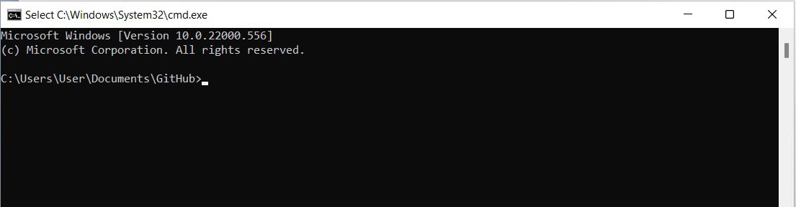

# 從原始碼建置 Dynamo

Dynamo 的原始碼託管在 Github，可供任何人複製並提出貢獻。在本章中，我們將逐步瞭解如何使用 git 複製儲存庫、使用 Visual Studio 編譯原始碼檔案、執行本端建置版本並除錯，以及從 Github 提取任何新變更。

### 在 Github 上找出 Dynamo 儲存庫 

Github 是一種以 [git](https://help.github.com/articles/git-and-github-learning-resources/) 為基礎的託管服務，是一種可追蹤變更並協調不同使用者工作的版本控制系統。Git 是一種工具，我們可以利用它來下載 Dynamo 的原始碼檔案，並透過一些指令保持更新。使用此方法可避免每次更新時都要手動下載和取代原始碼檔案這些不必要且繁雜的工作。Git 版本控制系統會追蹤本端和遠端程式碼儲存庫之間的任何差異。

Dynamo 的原始碼託管在 DynamoDS Github 上的 [https://github.com/DynamoDS/Dynamo](https://github.com/DynamoDS/Dynamo) 儲存庫

> Dynamo 原始碼檔案。
>
> 1. 複製或下載整個儲存庫
> 2. 檢視其他 DynamoDS 儲存庫
> 3. Dynamo 的原始碼檔案
> 4. Git 特有的檔案

### 使用 git 提取 Dynamo 儲存庫 

在複製儲存庫之前，必須先安裝 git。請遵循此[簡短指南](https://help.github.com/articles/set-up-git/#setting-up-git)以瞭解安裝步驟，以及如何設定 GitHub 使用者名稱和電子郵件。在此範例中，我們將在指令行使用 git。本指南假設您使用 Windows，但您也可以在 mac 或 Linux 上使用 git 複製 Dynamo 原始碼。

我們需要 Dynamo 儲存庫的 URL 才能從中複製。您可以在儲存庫頁面的「Clone or download (複製或下載)」按鈕中找到。複製要貼至指令提示的 URL。

> 1. 選取「Clone or download」
> 2. 複製 URL

安裝 git 後，我們可以複製 Dynamo 儲存庫。先開啟指令提示。然後，使用變更目錄指令 `cd` 瀏覽到要將原始碼檔案複製到的資料夾。在此範例中，我們在 `Documents` 中建立了一個名為 `Github` 的資料夾。

`cd C:\Users\username\Documents\GitHub`

> 將「username」取代為您的使用者名稱

下一步，我們要執行 git 指令，將 Dynamo 儲存庫複製到我們指定的位置。在 Github 上按一下「Clone or Download」按鈕，取得指令中的 URL。在指令終端機中執行此指令。請注意，這會複製 Dynamo 儲存庫主分支，主分支是 Dynamo 最新的程式碼，包含最新版本的 Dynamo 程式碼。此分支每天都會變更。

`git clone https://github.com/DynamoDS/Dynamo.git`

如果複製作業成功完成，我們就知道 git 正在運作。在檔案總管中，瀏覽到您複製的目錄以查看原始碼檔案。目錄結構應該與 Github 上 Dynamo 儲存庫的主分支相同。

> 1. Dynamo 的原始碼檔案
> 2. Git 檔案

### 使用 Visual Studio 建置儲存庫 

將原始碼檔案複製到本端電腦後，我們可以建置 Dynamo 的可執行檔。要執行此作業，我們需要設定 Visual Studio IDE，並確保已安裝 .NET Framework 和 DirectX。

* 下載並安裝 [Microsoft Visual Studio Community 2015](https://my.visualstudio.com/Downloads/Results)，這是一款免費且功能齊全的 IDE (整合式開發環境 - 更高版本也同樣能運作)
* 下載並安裝 [Microsoft .NET Framework 4.5](https://www.microsoft.com/zh-tw/download/details.aspx?id=30653) 或更高版本
* 從本端 Dynamo 儲存庫安裝 Microsoft DirectX (`Dynamo\tools\install\Extra\DirectX\DXSETUP.exe`)

> .NET 和 DirectX 可能已經安裝。

> **注意：**重大變更 - 需要 **Visual Studio 2022 Preview/Visual Studio 2026 Insider**
> 
> 從 2025 年底開始，Dynamo 將導入 `dotnet10.0` 架構。若要針對此架構進行開發，您需要 Visual Studio 2022 Preview 或 Visual Studio 2026 Insider (或更高版本)，因為穩定版本還不支援 .NET 10.0。
> 
> **將 Visual Studio 2022 Preview/2026 Insider 與現有安裝內容一起安裝：**
> 1. 開啟 **Visual Studio 安裝程式** (在「開始」功能表中搜尋)
> 2. 按一下**「更新」**確定您有最新的安裝程式版本
> 3. 移至**「可用」**頁籤
> 4. 尋找 **Visual Studio 2022 Preview/2026 Insider** (Community、Professional 或 Enterprise)
> 5. 按一下**「安裝」**將它加入現有的 Visual Studio 安裝
> 
 

所有檔案安裝完成後，我們可以啟動 Visual Studio，並開啟位於 `Dynamo\src` 的 `Dynamo.All.sln` 方案。

> 1. 選取「`File > Open > Project/Solution`」
> 2. 瀏覽至 Dynamo 儲存庫並開啟 `src` 資料夾
> 3. 選取 `Dynamo.All.sln` 方案檔
> 4. 選取「`Open`」

在建置方案之前，必須先指定一些設定。我們要先建置 Dynamo 的除錯版本，讓 Visual Studio 在除錯時可以收集更多資訊協助我們開發，而且我們要以 AnyCPU 作為目標。

> 這些設定會變成 `bin` 資料夾內的資料夾
>
> 1. 在此範例中，我們選擇「`Debug`」做為「Solution Configuration (方案組態)」
> 2. 將「Solution Platform (方案平台)」設定為「`Any CPU`」

開啟專案後，我們可以建置方案。此處理序將會建立一個可以執行的 DynamoSandbox.exe 檔案。

> 建置專案會還原 NuGet 相依性。
>
> 1. 選取「`Build > Build Solution`」
> 2. 在「Output (輸出)」視窗中確認建置成功，看起來應該類似 `==== Build: 69 succeeded, 0 failed, 0 up-to-date, 0 skipped ====`

### 執行本端建置版本 

如果 Dynamo 建置成功，Dynamo 儲存庫中會建立一個包含 DynamoSandbox.exe 檔案的 `bin` 資料夾。在我們的範例中，我們使用「Debug (除錯)」選項建置，因此可執行檔位於 `bin\AnyCPU\Debug`。執行此檔案將開啟 Dynamo 的本端建置版本。

> 1. 我們剛剛建置的 DynamoSandbox 可執行檔。執行此檔案以啟動 Dynamo。

我們現在已經幾乎設定好，可以開始開發 Dynamo。

如需有關為其他平台 (例如 Linux 或 OS X) 建置 Dynamo 的指示，請造訪此 [Wiki 頁面](https://github.com/DynamoDS/Dynamo/wiki/Dynamo-on-Linux,-Mac)。

### 使用 Visual Studio 為本端建置版本除錯 

除錯是識別、隔離和修正錯誤或問題的一個過程。從原始碼成功建置 Dynamo 後，我們可以使用 Visual Studio 中的數種工具為執行中的應用程式 (例如 DynamoRevit 增益集) 除錯。我們可以分析其原始程式碼以尋找問題的根本原因，或監看目前正在執行的程式碼。如需有關如何在 Visual Studio 中除錯和瀏覽程式碼的更詳細說明，請參閱 [Visual Studio 文件](https://docs.microsoft.com/zh-tw/visualstudio/debugger/navigating-through-code-with-the-debugger)。

對於單機版 Dynamo 應用程式 DynamoSandbox，我們將介紹兩個用於除錯的選項：

* 直接從 Visual Studio 建置並啟動 Dynamo
* 將 Visual Studio 附加到 Dynamo 正在執行的處理序

從 Visual Studio 啟動 Dynamo 時，如果需要，會為每個除錯階段作業重新建置方案，因此如果我們對原始碼做了變更，除錯時會納入這些變更。在 `Dynamo.All.sln` 方案仍開啟的情況下，從下拉功能表中選取「`Debug`」、「`AnyCPU`」和「`DynamoSandbox`」，然後按一下「`Start`」。這會建置 Dynamo 並啟動一個新的處理序 (DynamoSandbox.exe)，並將 Visual Studio 的除錯程式附加到該處理序。

> 直接從 Visual Studio 建置並啟動應用程式
>
> 1. 將組態設定為「`Debug`」
> 2. 將平台設定為「`Any CPU`」
> 3. 將啟動專案設定為「`DynamoSandbox`」
> 4. 按一下「`Start`」以開始為處理序除錯

或者，我們可能想要為已在執行的 Dynamo 處理序除錯，以疑難排解特定圖表開啟或套件的問題。基於這個原因，我們會在 Visual Studio 中開啟專案的原始碼檔案，並使用「`Attach to Process`」除錯功能表項目附加到執行中的 Dynamo 處理序。

> 將正在執行的處理序附加到 Visual Studio
>
> 1. 選取「`Debug > Attach to Process...`」
> 2. 選擇「`DynamoSandbox.exe`」
> 3. 選取「`Attach`」

在這兩種情況下，我們都會將除錯程式附加到要除錯的處理序。我們可以在啟動除錯程式之前或之後設定程式碼中的中斷點，這會導致處理序在執行該行程式碼之前立即暫停。如果在除錯時擲回未攔截的例外狀況，Visual Studio 會跳到原始程式碼中發生該例外狀況的位置。這是一種尋找簡單當機、未處理例外狀況，以及瞭解應用程式執行流的有效方法。

> 為 DynamoSandbox 除錯時，我們在 Color.ByARGB 節點的建構函式中設定一個中斷點，這會導致 Dynamo 處理序在節點具現化時暫停。如果此節點擲出例外狀況或導致 Dynamo 當機，我們可以逐步執行建構函式中的每一行，以尋找發生問題的位置。
>
> 1. 中斷點
> 2. 顯示目前正在執行之函式和先前函式呼叫的呼叫堆疊。

在下一節〈**從原始碼建置 DynamoRevit**〉中，我們將逐步介紹除錯的特定範例，並說明如何設定中斷點、逐步執行程式碼，以及解讀呼叫堆疊。

### 提取最新建置版本 

由於 Dynamo 原始碼託管在 Github 上，因此讓本端原始碼檔案保持更新最簡單的方式是使用 git 指令提取變更。

使用指令行，將目前目錄設定為 Dynamo 儲存庫：

`cd C:\Users\username\Documents\GitHub\Dynamo`

> 將 `"username"` 取代為您的使用者名稱

使用下列指令提取最新變更：

`git pull origin master`

> 1. 在此，我們可以看到本端儲存庫已經以遠端的變更更新。

除了提取更新，還有四個 git 工作流程需要熟悉。

* **Fork (分岔)** Dynamo 儲存庫，建立一份與原始儲存庫分開的複本。此處所做的任何變更都不會影響原始儲存庫，也可以從中擷取更新或利用提取請求來提交更新。Fork 不是 git 指令，而是 github 新增的一個工作流程 - 分岔-提取請求模型是參與線上開放原始碼專案其中一個最常見的工作流程。如果您想要為 Dynamo 做出貢獻，請學習這項功能。
* **Branch (分支)** \- 在分支內容中獨立於其他工作進行實驗或新功能。這可讓您更輕鬆地傳送提取請求。
* 在完成一部分工作之後，以及做了可能想要退回的變更之後，請經常進行 **commit (認可)**。認可動作會記錄對儲存庫的變更，在對主要 Dynamo 儲存庫提出提取請求時，也會看到該筆認可內容。
* 當準備好正式將變更提出到主要 Dynamo 儲存庫時，請建立 **pull request (提取請求)**。

Dynamo 團隊對於建立提取請求有特定指示。請參閱本文件中的〈提取請求〉一節，以瞭解要處理的更多詳細項目。

請參閱此[文件頁面](https://git-scm.com/docs)，以取得 git 指令的參考清單。
