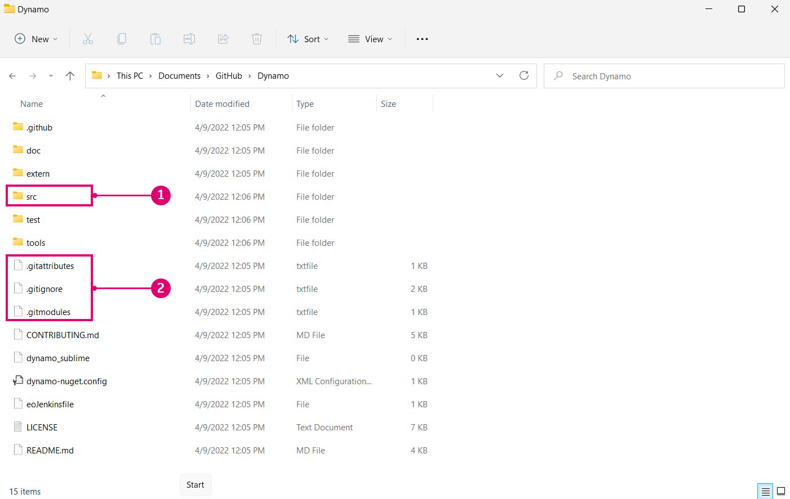
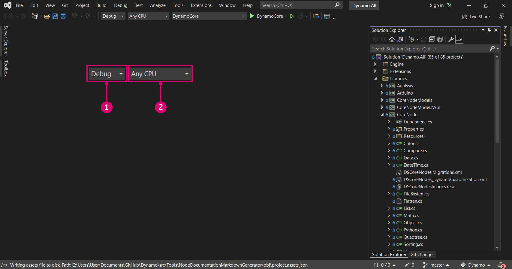

# Kompilowanie dodatku Dynamo ze źródła

Źródło dodatku Dynamo jest hostowane w serwisie Github, w którym każdy może je klonować i współtworzyć. W tym rozdziale omówimy sposób klonowania repozytorium za pomocą narzędzia git, kompilowania plików źródłowych za pomocą programu Visual Studio, uruchamiania i debugowania kompilacji lokalnej oraz ściągania (pull) nowych zmian z serwisu Github.

### Znajdowanie repozytorium dodatku Dynamo w serwisie Github 

Github to usługa hostingu oparta na narzędziu [git](https://help.github.com/articles/git-and-github-learning-resources/), systemie kontroli wersji umożliwiającym śledzenie zmian i koordynowanie pracy wielu osób. Git to narzędzie, za pomocą którego można pobierać pliki źródłowe dodatku Dynamo i aktualizować je przy użyciu kilku poleceń. Stosowanie tej metody pozwala uniknąć niepotrzebnego i nieuporządkowanego pobierania i ręcznego zastępowania plików źródłowych przy każdej aktualizacji. System kontroli wersji git śledzi wszelkie różnice między lokalnym i zdalnym repozytorium kodu.

Źródło dodatku Dynamo jest hostowane w witrynie DynamoDS w serwisie GitHub w tym repozytorium: [https://github.com/DynamoDS/Dynamo](https://github.com/DynamoDS/Dynamo)

> Pliki źródłowe dodatku Dynamo.
>
> 1. Klonowanie lub pobieranie całego repozytorium
> 2. Wyświetlanie innych repozytoriów DynamoDS
> 3. Pliki źródłowe dodatku Dynamo
> 4. Pliki charakterystyczne narzędzia git

### Ściąganie (pull) repozytorium dodatku Dynamo za pomocą narzędzia git 

Zanim będzie można sklonować repozytorium, należy zainstalować narzędzie git. Postępuj zgodnie z tym [krótkim przewodnikiem](https://help.github.com/articles/set-up-git/#setting-up-git), aby zapoznać się z krokami instalacji oraz konfigurowania nazwy użytkownika i adresu e-mail w serwisie GitHub. W tym przykładzie użyjemy narzędzia git w wierszu polecenia. W tym podręczniku przyjęto, że jest używany system Windows, ale narzędzia git można też używać w systemie Mac lub Linux, aby sklonować źródło dodatku Dynamo.

Do sklonowania potrzebny jest adres URL repozytorium dodatku Dynamo. Można go znaleźć za pomocą przycisku „Clone or download” (Klonuj lub pobierz) na stronie repozytorium. Skopiuj adres URL, aby wkleić go do wiersza polecenia.

> 1. Wybierz przycisk „Clone or download” (Klonuj lub pobierz)
> 2. Skopiuj adres URL

Po zainstalowaniu narzędzia git można sklonować repozytorium dodatku Dynamo. Rozpocznij od otwarcia wiersza polecenia. Następnie za pomocą polecenia do zmiany katalogu, `cd`, przejdź do folderu, do którego mają zostać sklonowane pliki źródłowe. W tym przypadku utworzyliśmy folder o nazwie `Github` w folderze `Documents`.

`cd C:\Users\username\Documents\GitHub`

> Zastąp ciąg „username” swoją nazwą użytkownika

W następnym kroku uruchomimy polecenie git, aby sklonować repozytorium dodatku Dynamo do określonego położenia. Adres URL do użycia w tym poleceniu można uzyskać, klikając przycisk „Clone or download” (Klonuj lub pobierz) w serwisie GitHub. Uruchom to polecenie w terminalu poleceń. Uwaga: spowoduje to sklonowanie gałęzi głównej repozytorium dodatku Dynamo, która jest najczęściej aktualizowanym kodem dodatku Dynamo i zawiera najnowszą wersję kodu dodatku Dynamo. Ta gałąź zmienia się codziennie.

`git clone https://github.com/DynamoDS/Dynamo.git`

Jeśli operacja klonowania zakończyła się pomyślnie, oznacza to, że narzędzie git działa. W eksploratorze plików przejdź do katalogu, do którego sklonowano pliki źródłowe. Struktura katalogu powinna wyglądać tak samo jak gałąź główna repozytorium dodatku Dynamo w serwisie Github.

> 1. Pliki źródłowe dodatku Dynamo
> 2. Pliki git

### Kompilowanie repozytorium za pomocą programu Visual Studio 

Po sklonowaniu plików źródłowych na komputer lokalny można utworzyć plik wykonywalny dla dodatku Dynamo. W tym celu należy skonfigurować środowisko IDE programu Visual Studio oraz upewnić się, że zainstalowano programy .NET Framework i DirectX.

* Pobierz i zainstaluj oprogramowanie [Microsoft Visual Studio Community 2015](https://my.visualstudio.com/Downloads/Results) — bezpłatne i w pełni funkcjonalne środowisko IDE (czyli zintegrowane środowisko programistyczne — mogą się również sprawdzić nowsze wersje)
* Pobierz i zainstaluj program [Microsoft .NET Framework 4.5](https://www.microsoft.com/pl-pl/download/details.aspx?id=30653) lub nowszy
* Zainstaluj program Microsoft DirectX z lokalnego repozytorium dodatku Dynamo (`Dynamo\tools\install\Extra\DirectX\DXSETUP.exe`)

> Programy .NET i DirectX mogą być już zainstalowane.

Po zakończeniu instalacji można uruchomić program Visual Studio i otworzyć rozwiązanie `Dynamo.All.sln` znajdujące się w folderze `Dynamo\src`.

> 1. Wybierz opcję `File > Open > Project/Solution`
> 2. Przejdź do repozytorium dodatku Dynamo i otwórz folder `src`
> 3. Wybierz plik rozwiązania `Dynamo.All.sln`
> 4. Wybierz opcję `Open`

Przed skompilowaniem rozwiązania należy określić kilka ustawień. Najpierw należy skompilować wersję dodatku Dynamo do debugowania, aby zebrać w programie Visual Studio więcej informacji w ramach debugowania na potrzeby programowania. Jako platformy docelowej należy użyć AnyCPU.

> Staną się one folderami w folderze `bin`
>
> 1. W tym przykładzie jako konfigurację rozwiązania wybraliśmy opcję `Debug`
> 2. Jako platformę rozwiązania ustaw `Any CPU`

Przy otwartym projekcie możemy skompilować rozwiązanie. W tym procesie zostanie utworzony plik DynamoSandbox.exe, który można uruchomić.

> Skompilowanie projektu spowoduje przywrócenie zależności NuGet.
>
> 1. Wybierz opcję `Build > Build Solution`
> 2. Sprawdź, czy kompilacja została zakończona pomyślnie w oknie danych wyjściowych. Komunikat powinien przypominać następujący: `==== Build: 69 succeeded, 0 failed, 0 up-to-date, 0 skipped ====`

### Uruchamianie kompilacji lokalnej 

Jeśli dodatek Dynamo zostanie skompilowany pomyślnie, w repozytorium dodatku Dynamo zostanie utworzony folder `bin` z plikiem DynamoSandbox.exe. W tym przypadku tworzymy plik wykonywalny za pomocą opcji Debug, dlatego znajduje się on w folderze `bin\AnyCPU\Debug`. Uruchomienie tego pliku spowoduje otwarcie kompilacji lokalnej dodatku Dynamo.

> 1. Nowo skompilowany plik wykonywalny DynamoSandbox. Uruchom ten plik, aby uruchomić dodatek Dynamo.

Wszystko jest już prawie gotowe do rozpoczęcia pracy nad dodatkiem Dynamo.

Instrukcje dotyczące kompilowania dodatku Dynamo dla innych platform (np. Linux lub OS X) można znaleźć na [tej stronie wiki](https://github.com/DynamoDS/Dynamo/wiki/Dynamo-on-Linux,-Mac).

### Debugowanie kompilacji lokalnej za pomocą programu Visual Studio 

Debugowanie to proces identyfikowania, izolowania i usuwania błędów lub problemów. Po pomyślnym skompilowaniu dodatku Dynamo ze źródła można za pomocą kilku narzędzi w programie Visual Studio debugować uruchomioną aplikację, na przykład dodatek DynamoRevit. Można przeanalizować kod źródłowy aplikacji, aby znaleźć źródło problemu, lub obserwować wykonywanie kodu na bieżąco. Aby uzyskać bardziej szczegółowe wyjaśnienia dotyczące debugowania i nawigowania po kodzie w programie Visual Studio, zapoznaj się z [dokumentacją programu Visual Studio w witrynie Docs](https://docs.microsoft.com/pl-pl/visualstudio/debugger/navigating-through-code-with-the-debugger).

W przypadku autonomicznej aplikacji Dynamo, DynamoSandbox, omówimy dwie opcje debugowania:

* Kompilowanie i uruchamianie dodatku Dynamo bezpośrednio z programu Visual Studio
* Dołączanie programu Visual Studio do uruchomionego procesu dodatku Dynamo

W przypadku uruchamiania dodatku Dynamo z programu Visual Studio rozwiązanie jest ponownie kompilowane dla każdej sesji debugowania, jeśli jest to wymagane. Jeśli więc wprowadzono zmiany w źródle, zostają one uwzględnione podczas debugowania. Przy otwartym rozwiązaniu `Dynamo.All.sln` wybierz z menu rozwijanego opcje `Debug`, `AnyCPU` i `DynamoSandbox`, a następnie kliknij opcję `Start`. Spowoduje to skompilowanie dodatku Dynamo i uruchomienie nowego procesu (DynamoSandbox.exe), a następnie dołączenie do niego debugera programu Visual Studio.

> Kompilowanie i uruchamianie aplikacji bezpośrednio z programu Visual Studio
>
> 1. Ustaw konfigurację na `Debug`
> 2. Ustaw platformę na `Any CPU`
> 3. Ustaw projekt startowy na `DynamoSandbox`
> 4. Kliknij opcję `Start`, aby rozpocząć proces debugowania

Można również debugować proces dodatku Dynamo, który jest już uruchomiony, aby rozwiązać problem z określonym otwartym wykresem lub pakietem. W tym celu należy otworzyć pliki źródłowe projektu w programie Visual Studio i dołączyć program do uruchomionego procesu dodatku Dynamo za pomocą elementu menu debugowania `Attach to Process`.

> Dołączanie uruchomionego procesu do programu Visual Studio
>
> 1. Wybierz opcję `Debug > Attach to Process...`
> 2. Wybierz opcję `DynamoSandbox.exe`
> 3. Wybierz opcję `Attach`

W obu sytuacjach dołączamy debuger do procesu, który chcemy debugować. Przed lub po uruchomieniu debugera możemy ustawić punkty przerwania w kodzie, co spowoduje wstrzymanie procesu bezpośrednio przed wykonaniem danego wiersza kodu. Jeśli podczas debugowania zostanie zgłoszony nieprzechwycony wyjątek, program Visual Studio przeskoczy do miejsca, w którym ten wyjątek wystąpił w kodzie źródłowym. Jest to efektywna metoda wyszukiwania prostych awarii oraz nieobsługiwanych wyjątków i analizowania procesu wykonywania aplikacji.

> Podczas debugowania aplikacji DynamoSandbox ustawiamy punkt przerwania w konstruktorze węzła Colour.ByARGB, który powoduje wstrzymanie procesu dodatku Dynamo po utworzeniu wystąpienia węzła. Jeśli ten węzeł zgłaszał wyjątek lub powodował awarię dodatku Dynamo, można krokowo wykonywać poszczególne wiersze w konstruktorze, aby sprawdzić, gdzie wystąpił problem.
>
> 1. Punkt przerwania
> 2. Stos wywołań ze wskazaniem obecnie wykonywanej funkcji i poprzednimi wywołaniami funkcji.

W następnej sekcji **Kompilowanie dodatku DynamoRevit ze źródła** omówimy konkretny przykład debugowania i wyjaśnimy, jak ustawiać punkty przerwania, krokowo wykonywać kod i odczytywać stos wywołań.

### Ściąganie (pull) najnowszej kompilacji 

Ponieważ źródło dodatku Dynamo znajduje się w serwisie Github, najprostszym sposobem zaktualizowania lokalnych plików źródłowych jest ściągnięcie (pull) zmian za pomocą poleceń git.

Za pomocą tego wiersza polecenia ustaw repozytorium dodatku Dynamo jako katalog bieżący:

`cd C:\Users\username\Documents\GitHub\Dynamo`

> Zastąp ciąg `"username"` swoją nazwą użytkownika

Za pomocą następującego polecenia ściągnij najnowsze zmiany:

`git pull origin master`

> 1. Widać tutaj, że repozytorium lokalne zostało zaktualizowane o zmiany wprowadzone zdalnie.

Oprócz ściągania (pull) aktualizacji dostępne są cztery inne ważne procesy robocze, które warto znać.

* **Rozwidlanie (fork)** repozytorium dodatku Dynamo umożliwiające utworzenie kopii oddzielnej od oryginału. Żadne zmiany wprowadzone w tym miejscu nie wpływają na repozytorium oryginalne, a aktualizacje można pobierać (fetch) lub przesyłać za pomocą próśb o ściągnięcie (pull). Rozwidlenie (fork) nie jest poleceniem narzędzia git, lecz procesem roboczym dodanym w serwisie GitHub — model używania rozwidlenia (fork) i prośby o ściągnięcie (pull) jest jednym z najpopularniejszych procesów roboczych wykorzystywanych przy współtworzeniu projektów open source w trybie online. Osoby chcące współtworzyć dodatek Dynamo powinny się z nim zapoznać.
* **Gałąź (branch)** — pracuj nad eksperymentami lub nowymi elementami odizolowanymi od innych prac w gałęziach. Ułatwia to wysyłanie próśb o ściągnięcie (pull).
* Często wykonuj **zatwierdzenia (commit)**, szczególnie po ukończeniu jednostek pracy i po wprowadzeniu zmian mogących wymagać cofnięcia. Zatwierdzenie (commit) powoduje zarejestrowanie zmian w repozytorium i będzie widoczne podczas wysyłania prośby o ściągnięcie (pull) do repozytorium głównego dodatku Dynamo.
* Twórz **prośby o ściągnięcie (pull)**, gdy zmiany są gotowe do oficjalnego zaproponowania ich w repozytorium głównym dodatku Dynamo.

Zespół dodatku Dynamo utworzył szczegółowe instrukcje dotyczące tworzenia próśb o ściągnięcie (pull). Szczegółowe informacje na temat tego, co należy uwzględnić, można znaleźć w sekcji „Prośby o ściągnięcie (pull)” w tej dokumentacji.

Na tej [stronie dokumentacji](https://git-scm.com/docs) podano listę referencyjną poleceń narzędzia git.
