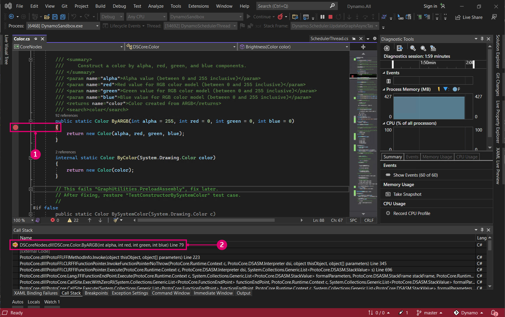

# Compilar Dynamo a partir del código fuente

El código fuente de Dynamo está alojado en GitHub para que cualquiera pueda clonarlo y contribuir a él. En este capítulo, veremos cómo clonar el repositorio mediante git, compilar los archivos de código fuente con Visual Studio, ejecutar y depurar una compilación local, y extraer todos los nuevos cambios de GitHub.

### Ubicación de los repositorios de Dynamo en GitHub 

GitHub es un servicio de alojamiento basado en [git](https://docs.github.com/es/get-started/quickstart/git-and-github-learning-resources), un sistema de control de versiones para el seguimiento de cambios y la coordinación del trabajo entre personas. Git es una herramienta que podemos aprovechar para descargar los archivos de código fuente de Dynamo y mantenerlos actualizados con unos pocos comandos. Este método evitará el trabajo innecesario e intrínsecamente engorroso de descargar y sustituir manualmente los archivos de código fuente en cada actualización. El sistema de control de versiones de git identificará cualquier diferencia entre un repositorio de código local y uno remoto.

El código fuente de Dynamo está alojado en el GitHub de DynamoDS, en este repositorio: [https://github.com/DynamoDS/Dynamo](https://github.com/DynamoDS/Dynamo).

> Los archivos de código fuente de Dynamo
>
> 1. Clone o descargue todo el repositorio.
> 2. Vea otros repositorios de DynamoDS.
> 3. Archivos de código fuente de Dynamo.
> 4. Archivos específicos de git.

### Extracción del repositorio de Dynamo mediante git 

Antes de poder clonar el repositorio, debemos instalar git. Siga esta [breve guía](https://docs.github.com/es/get-started/quickstart/set-up-git#setting-up-git) para conocer los pasos de instalación y cómo configurar un nombre de usuario y una dirección de correo electrónico de GitHub. En este ejemplo, utilizaremos git en la línea de comando. En esta guía, se presupone que utilizará Windows, pero también puede usar git en Mac o Linux para clonar el código fuente de Dynamo.

Necesitamos una dirección URL desde la que clonar el repositorio de Dynamo. Para obtenerla, se puede utilizar el botón para clonar o descargar de la página del repositorio. Copie la dirección URL para pegarla en la solicitud de comando.

> 1. Seleccione la opción para clonar o descargar.
> 2. Copie la dirección URL.

Con git instalado, podemos clonar el repositorio de Dynamo. Abra primero la solicitud de comando. A continuación, utilice el comando de cambio de directorio `cd` para desplazarse a la carpeta en la que desea clonar los archivos de código fuente. En este caso, hemos creado una carpeta denominada `Github` en `Documents`.

`cd C:\Users\username\Documents\GitHub`

> Sustituya "username" por su nombre de usuario.

En el paso siguiente, ejecutaremos un comando de git para clonar el repositorio de Dynamo en la ubicación especificada. Para obtener la dirección URL del comando, haga clic en el botón para clonar o descargar en GitHub. Ejecute este comando en el terminal de comando. Tenga en cuenta que esto clonará la ramificación principal del repositorio de Dynamo, que es el código más actualizado para Dynamo, y contendrá la última versión del código de Dynamo. Esta ramificación cambia diariamente.

`git clone https://github.com/DynamoDS/Dynamo.git`

Sabemos que git funciona sin problemas si la operación de clonación se ha completado correctamente. En el explorador de archivos, desplácese al directorio en el que se ha realizado la clonación para ver los archivos de código fuente. La estructura de directorios debe ser idéntica a la ramificación principal del repositorio de Dynamo en GitHub.

> 1. Archivos de código fuente de Dynamo
> 2. Archivos de git

### Compilación del repositorio mediante Visual Studio 

Ahora que los archivos de código fuente se han clonado en el equipo local, podemos compilar un archivo ejecutable para Dynamo. Para ello, debemos configurar el IDE de Visual Studio y garantizar que .NET Framework y DirectX estén instalados.

* Descargue e instale [Microsoft Visual Studio Community 2015](https://my.visualstudio.com/Downloads/Results), un IDE (entorno de desarrollo integrado) gratuito con todas las funciones (también se pueden utilizar las versiones posteriores).
* Descargue e instale [Microsoft .NET Framework 4.5](https://www.microsoft.com/es-es/download/details.aspx?id=30653) o una versión posterior.
* Instale Microsoft DirectX desde el repositorio local de Dynamo (`Dynamo\tools\install\Extra\DirectX\DXSETUP.exe`).

> Es posible que .NET y DirectX ya estén instalados.

Una vez que todo haya terminado de instalarse, podemos iniciar Visual Studio y abrir la solución `Dynamo.All.sln` ubicada en `Dynamo\src`.

> 1. Seleccione `File > Open > Project/Solution`.
> 2. Vaya al repositorio de Dynamo y abra la carpeta `src`.
> 3. Seleccione el archivo de la solución `Dynamo.All.sln`.
> 4. Seleccione `Open`.

Antes de poder compilar la solución, se deben especificar algunos parámetros. Debemos compilar primero una versión de depuración de Dynamo para que Visual Studio pueda recopilar más información durante la depuración a fin de ayudarnos en el proceso de desarrollo; además, deseamos señalar a AnyCPU.

> Estos elementos se convertirán en carpetas dentro de la carpeta `bin`.
>
> 1. En este ejemplo, hemos elegido `Debug` como configuración de la solución.
> 2. Establezca la plataforma de la solución en `Any CPU`.

Con el proyecto abierto, podemos compilar la solución. Este proceso creará un archivo DynamoSandbox.exe que podemos ejecutar.

> Al compilar el proyecto, se restablecerán las dependencias de NuGet.
>
> 1. Seleccione `Build > Build Solution`.
> 2. Compruebe que la compilación se haya realizado correctamente en la ventana de salida, que debería ser similar a la siguiente: `==== Build: 69 succeeded, 0 failed, 0 up-to-date, 0 skipped ====`.

### Ejecución de una compilación local 

Si Dynamo se compila correctamente, se creará una carpeta `bin` en el repositorio de Dynamo con el archivo DynamoSandbox.exe. En nuestro caso, realizamos la compilación con la opción de depuración, por lo que el archivo ejecutable se encuentra en `bin\AnyCPU\Debug`. Al ejecutar esta acción, se abrirá una compilación local de Dynamo.

> 1. El archivo ejecutable de DynamoSandbox que acabamos de crear. Ejecútelo para iniciar Dynamo.

Ahora ya casi podemos empezar a desarrollar en Dynamo.

Para obtener instrucciones sobre la compilación de Dynamo para otras plataformas (por ejemplo, OS X o Linux), visite esta [página wiki](https://github.com/DynamoDS/Dynamo/wiki/Dynamo-on-Linux,-Mac).

### Depuración de una compilación local mediante Visual Studio 

La depuración es un proceso de identificación, aislamiento y corrección de errores o problemas. Una vez que Dynamo se haya creado correctamente a partir del código fuente, podemos utilizar varias herramientas de Visual Studio para depurar una aplicación en ejecución, por ejemplo, el complemento DynamoRevit. Podemos analizar su código fuente para encontrar la raíz de un problema u observar el código que se está ejecutando en ese momento. Para obtener una explicación más detallada sobre cómo desplazarse por el código en Visual Studio y cómo depurarlo, consulte la [documentación de Visual Studio](https://docs.microsoft.com/es-es/visualstudio/debugger/navigating-through-code-with-the-debugger).

Para la aplicación de Dynamo independiente, DynamoSandbox, se abordarán estas dos opciones de depuración:

* Compile e inicie Dynamo directamente desde Visual Studio.
* Asocie Visual Studio a un proceso en ejecución de Dynamo.

El inicio de Dynamo desde Visual Studio vuelve a compilar la solución para cada sesión de depuración si es necesario, por lo que si hemos realizado cambios en el código fuente, estos se incorporarán al depurar. Con la solución `Dynamo.All.sln` aún abierta, seleccione `Debug`, `AnyCPU` y `DynamoSandbox` en los menús desplegables y, a continuación, haga clic en `Start`. Esta acción compilará Dynamo e iniciará un nuevo proceso (DynamoSandbox.exe) y asociará el depurador de Visual Studio a él.

> Compile e inicie la aplicación directamente desde Visual Studio.
>
> 1. Establezca la configuración en `Debug`.
> 2. Establezca la plataforma en `Any CPU`.
> 3. Establezca el proyecto de inicio en `DynamoSandbox`.
> 4. Haga clic en `Start` para iniciar el proceso de depuración.

También es posible que deseemos depurar un proceso de Dynamo que ya se esté ejecutando para solucionar un problema con un gráfico abierto o un paquete específico. Para ello, debemos abrir los archivos de código fuente del proyecto en Visual Studio y asociarlos a un proceso de Dynamo en ejecución mediante el elemento del menú de depuración `Attach to Process`.

> Asociar un proceso en ejecución a Visual Studio
>
> 1. Seleccione `Debug > Attach to Process...`.
> 2. Seleccione `DynamoSandbox.exe`.
> 3. Seleccione `Attach`.

En ambas situaciones, se asocia el depurador a un proceso que deseamos depurar. Podemos establecer puntos de interrupción en el código antes o después de iniciar el depurador que provocarán que el proceso se detenga justo antes de ejecutar esa línea de código. Si se produce una excepción no detectada durante la depuración, Visual Studio saltará a la ubicación en la que se produjo en el código fuente. Se trata de un método eficaz para detectar bloqueos sencillos y excepciones no gestionadas, y para conocer el flujo de ejecución de una aplicación.

> Al depurar DynamoSandbox, establecemos un punto de interrupción en el constructor del nodo Color.ByARGB que provoca que el proceso de Dynamo se detenga cuando se crea una instancia del nodo. Si este nodo genera una excepción o provoca el bloqueo de Dynamo, podemos recorrer cada línea del constructor para identificar dónde se produce el problema.
>
> 1. El punto de interrupción
> 2. La pila de llamadas que muestra la función que se está ejecutando en ese momento y las llamadas a funciones anteriores

En la siguiente sección, **Compilar DynamoRevit a partir del código fuente**, veremos un ejemplo específico de depuración y explicaremos cómo establecer puntos de interrupción, recorrer el código y leer la pila de llamadas.

### Extracción de la última compilación 

Dado que el código fuente de Dynamo se aloja en GitHub, la forma más sencilla de mantener actualizados los archivos de código fuente locales es extraer los cambios mediante comandos de git.

Con la línea de comando, establezca el directorio actual en el repositorio de Dynamo, como se indica a continuación:

`cd C:\Users\username\Documents\GitHub\Dynamo`

> Sustituya `"username"` por su nombre de usuario.

Utilice el siguiente comando para extraer los cambios más recientes:

`git pull origin master`

> 1. Aquí podemos ver que el repositorio local se ha actualizado con los cambios desde el origen remoto.

Además de extraer actualizaciones, existen otros cuatro flujos de trabajo de git con los que puede familiarizarse.

* **Bifurque** el repositorio de Dynamo para crear una copia independiente del original. Los cambios realizados aquí no afectarán al repositorio original y las actualizaciones se pueden obtener o enviar con solicitudes de incorporación de cambios. La bifurcación no es un comando de git, sino un flujo de trabajo que añade GitHub; la bifurcación, el modelo de solicitud de incorporación de cambios, es uno de los flujos de trabajo más comunes para contribuir a los proyectos de código abierto en línea. Merece la pena aprenderlo si desea realizar aportaciones a Dynamo.
* **Ramificación**: utilice las ramificaciones para colaborar en experimentos o en nuevas funciones aisladas de otros trabajos. Esto facilita el envío de solicitudes de incorporación de cambios.
* Lleve a cabo a menudo **confirmaciones** después de completar una tarea y tras un cambio que desee deshacer. Una confirmación registra los cambios en el repositorio y estará visible al realizar una solicitud de incorporación de cambios en el repositorio principal de Dynamo.
* Cree **solicitudes de incorporación de cambios** cuando los cambios estén listos para proponerse oficialmente en el repositorio principal de Dynamo.

El equipo de Dynamo tiene instrucciones específicas sobre la creación de solicitudes de incorporación de cambios. Consulte la sección Solicitudes de incorporación de cambios de esta documentación para obtener información más detallada.

Consulte esta [página de documentación](https://git-scm.com/docs) para obtener una lista de referencia de los comandos de git.
