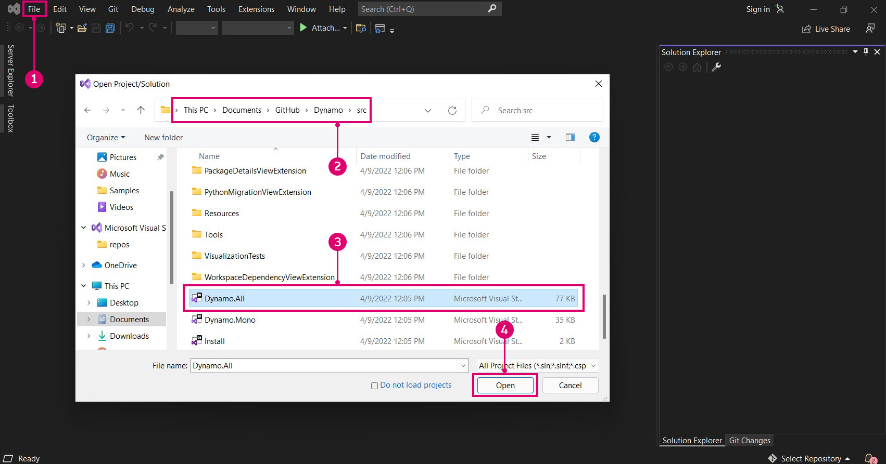
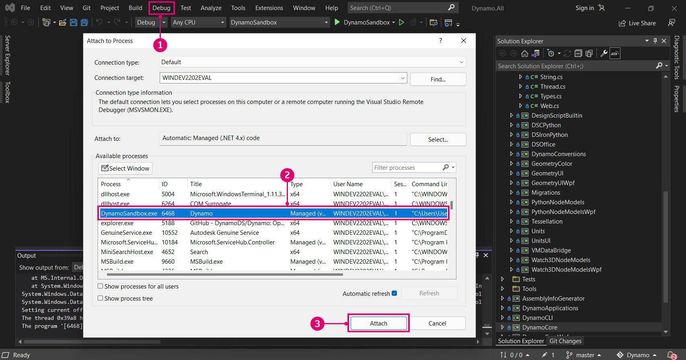

# Erstellen von Dynamo aus Quelldateien

Die Quelldateien von Dynamo werden auf GitHub gehostet, sodass jeder sie klonen und dazu beitragen kann. In diesem Kapitel erfahren Sie, wie Sie das Repository mithilfe von Git klonen, die Quelldateien mit Visual Studio kompilieren, einen lokalen Build ausführen und ein Debugging für diesen durchführen sowie neue Änderungen aus GitHub abrufen.

### Suchen der Dynamo-Repositorys auf GitHub 

GitHub ist ein Hosting-Dienst, der auf [Git](https://docs.github.com/de/get-started/quickstart/git-and-github-learning-resources), einem Versionskontrollsystem zur Änderungsverfolgung und Koordination der Arbeit zwischen verschiedenen Personen, basiert. Git ist ein Werkzeug, mit dem wir die Quelldateien von Dynamo herunterladen und mit ein paar Befehlen auf dem neuesten Stand halten können. Mit dieser Methode vermeiden wir die unnötige und von Natur aus unübersichtliche Arbeit des Herunterladens und manuellen Ersetzens der Quelldateien bei jedem Update. Das Git-Versionskontrollsystem verfolgt alle Unterschiede zwischen einem lokalen und einem Remote-Code-Repository.

Die Quelldateien von Dynamo werden im DynamoDS-GitHub im folgenden Repository gehostet: [https://github.com/DynamoDS/Dynamo](https://github.com/DynamoDS/Dynamo).

> Dynamo-Quelldateien
>
> 1. Klonen oder laden Sie das gesamte Repository herunter.
> 2. Zeigen Sie andere DynamoDS-Repositorys an.
> 3. Dynamo-Quelldateien
> 4. Git-spezifische Dateien

### Abrufen des Dynamo-Repositorys mit Git 

Bevor wir das Repository klonen können, müssen wir Git installieren. Befolgen Sie diese [Kurzanleitung](https://docs.github.com/de/get-started/quickstart/set-up-git#setting-up-git), um die Installationsschritte auszuführen und zu erfahren, wie Sie einen GitHub-Benutzernamen und eine GitHub-E-Mail-Adresse einrichten. In diesem Beispiel verwenden wir Git in der Befehlszeile. In diesem Handbuch wird davon ausgegangen, dass Sie Windows verwenden. Sie können Git jedoch auch unter Mac oder Linux verwenden, um die Dynamo-Quelle zu klonen.

Wir benötigen eine URL für das Dynamo-Repository, von dem geklont werden soll. Sie finden diese auf der Repository-Seite unter der Schaltfläche Clone or Download. Kopieren Sie die URL zum Einfügen in die Befehlszeile.

> 1. Wählen Sie Clone or Download aus.
> 2. Kopieren Sie die URL.

Wenn Git installiert ist, können wir das Dynamo-Repository klonen. Öffnen Sie zunächst die Eingabeaufforderung. Navigieren Sie dann unter Verwendung des Befehls zum Ändern des Verzeichnisses `cd` zu dem Ordner, in den die Quelldateien geklont werden sollen. In diesem Fall haben wir unter `Documents` einen Ordner mit dem Namen `Github` erstellt.

`cd C:\Users\username\Documents\GitHub`

> Ersetzen Sie username durch Ihren Benutzernamen.

Im nächsten Schritt führen wir einen Git-Befehl aus, um das Dynamo-Repository an den angegebenen Speicherort zu klonen. Die URL im Befehl wird durch Klicken auf die Schaltfläche Clone or Download auf GitHub abgerufen. Führen Sie diesen Befehl im Befehlsterminal aus. Beachten Sie, dass dadurch die Hauptverzweigung für das Dynamo-Repository geklont wird, bei der es sich um den aktuellen Code für Dynamo handelt und der die neueste Version von Dynamo-Code enthält. Diese Verzweigung ändert sich täglich.

`git clone https://github.com/DynamoDS/Dynamo.git`

Wir wissen, dass Git funktioniert, wenn der Klonvorgang erfolgreich abgeschlossen wurde. Navigieren Sie im Datei-Explorer zu dem Verzeichnis, in das Sie die Quelldateien geklont haben, um sie anzuzeigen. Die Verzeichnisstruktur sollte der Hauptverzweigung des Dynamo-Repositorys auf GitHub entsprechen.

> 1. Dynamo-Quelldateien
> 2. Git-Dateien

### Erstellen des Repositorys mit Visual Studio 

Nachdem die Quelldateien nun auf den lokalen Computer geklont wurden, können wir eine ausführbare Datei für Dynamo erstellen. Dazu müssen wir die Visual Studio-IDE einrichten und sicherstellen, dass .NET Framework und DirectX installiert sind.

* Laden Sie die kostenlose, voll funktionsfähige IDE (Integrated Development Environment, integrierte Entwicklungsumgebung) [Microsoft Visual Studio Community 2015](https://my.visualstudio.com/Downloads/Results) herunter, und installieren Sie sie (spätere Versionen funktionieren möglicherweise ebenfalls).
* Laden Sie [Microsoft .NET Framework 4.5](https://www.microsoft.com/de-de/download/details.aspx?id=30653) oder höher herunter, und installieren Sie die Software.
* Installieren Sie Microsoft DirectX aus dem lokalen Dynamo-Repository (`Dynamo\tools\install\Extra\DirectX\DXSETUP.exe`).

> .NET und DirectX sind möglicherweise bereits installiert.

> **Anmerkung:** Umfassende Änderung – **Visual Studio 2022 Preview/Visual Studio 2026 Insider** erforderlich
> 
> Ab Ende 2025 wird das `dotnet10.0`-Framework in Dynamo implementiert. Für die Entwicklung mit diesem Framework benötigen Sie Visual Studio 2022 Preview oder Visual Studio 2026 Insider (oder höher), da die stabilen Versionen .NET 10.0 noch nicht unterstützen.
> 
> **So installieren Sie Visual Studio 2022 Preview/2026 Insider neben Ihrer vorhandenen Installation**
> 1. Öffnen Sie das **Visual Studio-Installationsprogramm** (Sie finden es über das Startmenü).
> 2. Klicken Sie auf **Update** um sicherzustellen, dass Sie über die neueste Version des Installationsprogramms verfügen.
> 3. Wechseln Sie zur Registerkarte **Available**.
> 4. Suchen Sie **Visual Studio 2022 Preview/2026 Insider** (Community, Professional oder Enterprise).
> 5. Klicken Sie auf **Install**, um es parallel zu Ihrer vorhandenen Visual Studio-Installation hinzuzufügen.
> 
 

Sobald die Installation abgeschlossen ist, können wir Visual Studio starten und die Projektmappe `Dynamo.All.sln` unter `Dynamo\src` öffnen.

> 1. Wählen Sie `File > Open > Project/Solution` aus.
> 2. Navigieren Sie zum Dynamo-Repository, und öffnen Sie den Ordner `src`.
> 3. Wählen Sie die Projektmappendatei `Dynamo.All.sln` aus.
> 4. Wählen Sie `Open` aus.

Bevor wir die Projektmappe erstellen können, müssen einige Einstellungen angegeben werden. Zunächst sollten wir eine Debugversion von Dynamo erstellen, damit Visual Studio während des Debugging weitere Informationen sammeln kann, um uns bei der Entwicklung zu unterstützen. Außerdem sollten wir AnyCPU als Ziel verwenden.

> Diese werden zu Ordnern im Ordner `bin`.
>
> 1. In diesem Beispiel haben wir `Debug` als Projektmappenkonfiguration gewählt.
> 2. Setzen Sie die Projektmappenplattform auf `Any CPU`.

Wenn das Projekt geöffnet ist, können wir die Projektmappe erstellen. Durch diesen Vorgang wird eine DynamoSandbox.exe-Datei erstellt, die ausgeführt werden kann.

> Durch das Erstellen des Projekts werden NuGet-Abhängigkeiten wiederhergestellt.
>
> 1. Wählen Sie `Build > Build Solution` aus.
> 2. Stellen Sie im Ausgabefenster sicher, dass der Build erfolgreich war. Er sollte in etwa wie folgt lauten: `==== Build: 69 succeeded, 0 failed, 0 up-to-date, 0 skipped ====`

### Ausführen eines lokalen Builds 

Wenn Dynamo erfolgreich erstellt wurde, wird im Dynamo-Repository ein Ordner namens `bin` mit der Datei DynamoSandbox.exe erstellt. In unserem Fall verwenden wir die Option Debug für die Erstellung, sodass sich die ausführbare Datei unter `bin\AnyCPU\Debug` befindet. Durch Ausführen dieser Datei wird ein lokaler Build von Dynamo geöffnet.

> 1. Die ausführbare DynamoSandbox-Datei, die wir gerade erstellt haben. Führen Sie diese Datei aus, um Dynamo zu starten.

Damit sind wir fast bereit, um mit der Entwicklung für Dynamo zu beginnen.

Anweisungen zum Erstellen von Dynamo für andere Plattformen (z. B. Linux oder OS X) finden Sie auf dieser [Wiki-Seite](https://github.com/DynamoDS/Dynamo/wiki/Dynamo-on-Linux,-Mac).

### Debuggen eines lokalen Builds mithilfe von Visual Studio 

Beim Debuggen werden Fehler oder Probleme identifiziert, isoliert und behoben. Nachdem Dynamo erfolgreich aus den Quelldateien erstellt wurde, können wir verschiedene Werkzeuge in Visual Studio verwenden, um das Debugging für eine laufende Anwendung, z. B. das DynamoRevit-Zusatzmodul, durchzuführen. Wir können den Quellcode analysieren, um die Ursache eines Problems zu finden, oder den derzeit ausgeführten Code überwachen. Eine ausführlichere Beschreibung des Debugging und der Navigation durch Code in Visual Studio finden Sie in den [Visual Studio-Dokumenten](https://docs.microsoft.com/de-de/visualstudio/debugger/navigating-through-code-with-the-debugger).

Für die eigenständige Dynamo-Anwendung DynamoSandbox werden zwei Optionen für das Debugging behandelt:

* Erstellen und Starten von Dynamo direkt über Visual Studio
* Anhängen von Visual Studio an einen laufenden Dynamo-Prozess

Durch Starten von Dynamo über Visual Studio wird die Projektmappe ggf. für jede Debugging-Sitzung neu erstellt. Wenn wir also Änderungen an den Quelldateien vorgenommen haben, werden diese beim Debuggen berücksichtigt. Lassen Sie die Projektmappe `Dynamo.All.sln` geöffnet, wählen Sie `Debug`, `AnyCPU` und `DynamoSandbox` aus den Dropdown-Menüs aus, und klicken Sie dann auf `Start`. Dadurch wird Dynamo erstellt, ein neuer Prozess (DynamoSandbox.exe) gestartet und der Visual Studio-Debugger an diesen angehängt.

> Erstellen und starten Sie die Anwendung direkt über Visual Studio.
>
> 1. Legen Sie die Konfiguration auf `Debug` fest.
> 2. Legen Sie die Plattform auf `Any CPU` fest.
> 3. Legen Sie das Startprojekt auf `DynamoSandbox` fest.
> 4. Klicken Sie auf `Start`, um den Debugging-Vorgang zu starten.

Alternativ können wir das Debugging auch für einen bereits ausgeführten Dynamo-Prozess durchführen, um ein Problem mit einem bestimmten geöffneten Diagramm oder Paket zu beheben. Zu diesem Zweck öffnen wir die Quelldateien des Projekts in Visual Studio und hängen sie mithilfe des Debug-Menüelements `Attach to Process` an einen laufenden Dynamo-Prozess an.

> Anhängen eines laufenden Prozesses an Visual Studio
>
> 1. Wählen Sie `Debug > Attach to Process...` aus.
> 2. Wählen Sie `DynamoSandbox.exe`.
> 3. Wählen Sie `Attach` aus.

In beiden Fällen hängen wir den Debugger an einen Prozess an, für den wir das Debugging ausführen möchten. Wir können vor oder nach dem Starten des Debuggers Haltepunkte im Code festlegen, die unmittelbar vor dem Ausführen dieser Codezeile eine Unterbrechung des Vorgangs bewirken. Wenn beim Debuggen eine nicht abgefangene Ausnahme ausgelöst wird, springt Visual Studio im Quellcode an die Stelle, an der diese aufgetreten ist. Dies ist eine effiziente Methode, um einfache Abstürze und nicht behandelte Ausnahmen zu finden und den Ausführungsablauf einer Anwendung zu verstehen.

> Beim Debuggen von DynamoSandbox legen wir im Konstruktor des Blocks Color.ByARGB einen Haltepunkt fest, der bewirkt, dass der Dynamo-Prozess angehalten wird, wenn der Block instanziiert wird. Wenn dieser Block eine Ausnahme ausgelöst hat oder zu einem Absturz von Dynamo führte, können wir die einzelnen Zeilen im Konstruktor durchgehen, um zu ermitteln, wo das Problem aufgetreten ist.
>
> 1. Der Haltepunkt
> 2. Die Aufrufliste, die die derzeit ausgeführte Funktion und frühere Funktionsaufrufe anzeigt.

Im nächsten Abschnitt, **Erstellen von DynamoRevit aus Quelldateien**, wird ein spezifisches Debugging-Beispiel vorgestellt. Außerdem wird erläutert, wie Sie Haltepunkte festlegen, Code durchgehen und die Aufrufliste lesen.

### Abrufen des aktuellen Builds 

Da die Dynamo-Quelldateien auf GitHub gehostet werden, lassen sich lokale Quelldateien am einfachsten auf dem aktuellen Stand halten, indem Sie Änderungen mithilfe von Git-Befehlen abrufen.

Legen Sie mithilfe der Befehlszeile das aktuelle Verzeichnis auf das Dynamo-Repository fest:

`cd C:\Users\username\Documents\GitHub\Dynamo`

> Ersetzen Sie `"username"` durch Ihren Benutzernamen.

Verwenden Sie den folgenden Befehl, um die neuesten Änderungen abzurufen:

`git pull origin master`

> 1. Hier sehen wir, dass das lokale Repository mit Änderungen aus dem Remote-Repository aktualisiert wurde.

Zusätzlich zum Abrufen von Aktualisierungen gibt es vier weitere Git-Arbeitsabläufe, mit denen Sie sich vertraut machen sollten.

* **Fork**: Spalten Sie das Dynamo-Repository auf, um eine vom Original separate Kopie zu erstellen. Hier vorgenommene Änderungen wirken sich nicht auf das ursprüngliche Repository aus. Aktualisierungen können mit Pull-Anforderungen abgerufen oder übermittelt werden. Fork ist kein Git-Befehl, sondern ein Arbeitsablauf, der von GitHub hinzugefügt wird. Das Fork-Pull-Anforderungsmodell ist einer der häufigsten Arbeitsabläufe für Online-Beiträge zu Open-Source-Projekten. Sie sollten sich näher damit beschäftigen, wenn Sie zu Dynamo beitragen möchten.
* **Verzweigung**: Experimentieren Sie, oder arbeiten Sie an neuen Funktionen, unabhängig von den anderen Vorgängen in Verzweigungen. Dies erleichtert das Senden von Pull-Anforderungen.
* Führen Sie häufig **Commits** aus, nachdem Sie einen Arbeitsschritt abgeschlossen haben bzw. nach Änderungen, die möglicherweise rückgängig gemacht werden sollen. Ein Commit zeichnet Änderungen im Repository auf und wird angezeigt, wenn eine Pull-Anforderung an das Dynamo-Haupt-Repository gestellt wird.
* Erstellen Sie **Pull-Anforderungen**, wenn Änderungen bereit sind, offiziell im Dynamo-Haupt-Repository vorgeschlagen zu werden.

Das Dynamo-Team verfügt über spezielle Anweisungen zum Erstellen von Pull-Anforderungen. Weitere Informationen finden Sie im Abschnitt zu Pull-Anforderungen in dieser Dokumentation.

Eine Referenzliste der Git-Befehle finden Sie auf dieser [Dokumentationsseite](https://git-scm.com/docs).
