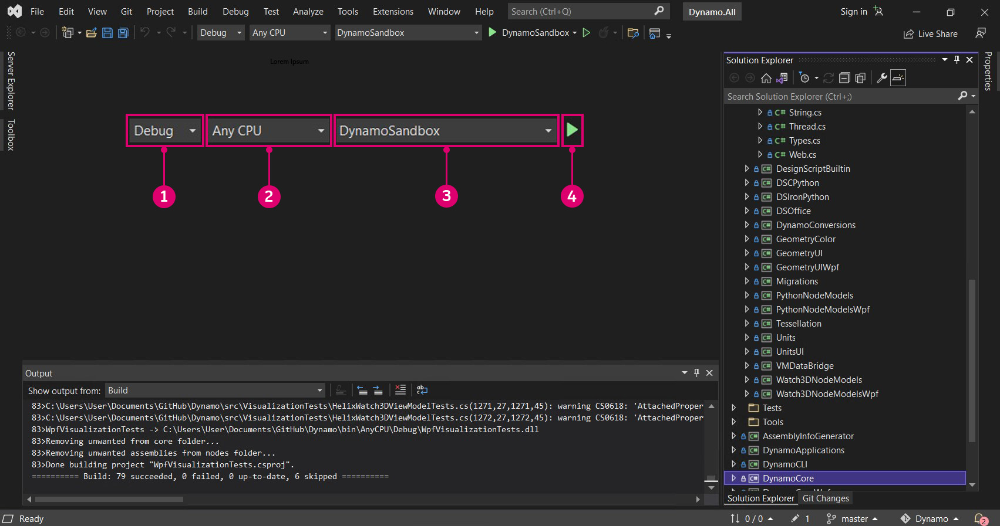
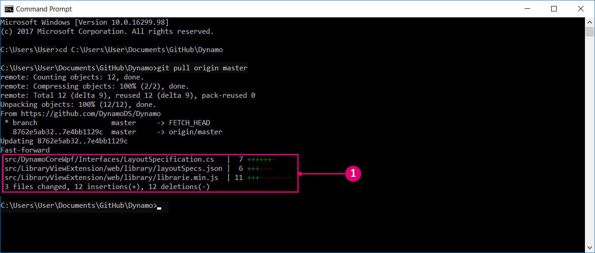

# Сборка Dynamo на основе исходного кода 

Исходный код Dynamo размещен на GitHub в общем доступе, чтобы любой разработчики могли клонировать его и предлагать улучшения. В этой главе мы рассмотрим клонирование репозитория с помощью Git, компиляцию исходных файлов с помощью Visual Studio, запуск и отладку локальной сборки, а также получение новых изменений из GitHub.

#### Поиск репозиториев Dynamo на GitHub 

GitHub — это хостинговая служба на базе [Git](https://help.github.com/articles/git-and-github-learning-resources/), системы управления версиями, которая позволяет отслеживать изменения и координировать работу пользователей. Git можно использовать для скачивания исходных файлов Dynamo и их обновления с помощью нескольких команд. Этот метод позволяет избежать ненужной и изначально сложной работы по скачивании и замене исходных файлов при каждом обновлении вручную. Система управления версиями Git отслеживает любые различия между локальным и удаленным репозиториями кода.

Исходный код Dynamo размещен в репозитории DynamoDS на GitHub: [https://github.com/DynamoDS/Dynamo](https://github.com/DynamoDS/Dynamo)

> Исходные файлы Dynamo.
>
> 1. Клонирование или скачивание всего репозитория
> 2. Другие репозитории DynamoDS
> 3. Исходные файлы Dynamo
> 4. Файлы, относящиеся к Git

#### Извлечение репозитория Dynamo с помощью Git 

Установите Git, прежде чем клонировать репозиторий. Это [краткое руководство](https://help.github.com/articles/set-up-git/#setting-up-git) содержит инструкции по установке и настройке адреса электронной почты и имени пользователя на GitHub. В нашем примере мы будем использовать Git в командной строке. В этом руководстве предполагается, что вы работаете в Windows, но вы также можете использовать Git для клонирования исходных файлов Dynamo в macOC или Linux.

Нам нужен URL-адрес для клонирования репозитория Dynamo. Его можно найти, нажав кнопку «Clone or download» (Клонировать или скачать) на странице репозитория. Скопируйте URL-адрес для вставки в командную строку.

> 1. Нажмите «Clone or download» (Клонировать или скачать).
> 2. Скопируйте URL.

После установки Git можно клонировать хранилище Dynamo. Для начала откройте командную строку. Затем с помощью команды смены каталога `cd` перейдите к папке, в которую необходимо клонировать исходные файлы. В нашем примере мы создали папку с именем `Github` в папке `Documents`.

`cd C:\Users\username\Documents\GitHub`

> Замените username на ваше имя пользователя

На следующем этапе мы выполним команду Git, чтобы клонировать хранилище Dynamo в указанную папку. URL в команде можно получить, нажав кнопку Clone or download (Клонировать или скачать) на GitHub. Выполните эту команду в командной строке терминала. Обратите внимание, что эта операция приведет к клонированию главной ветви репозитория Dynamo, где хранится последняя версия кода Dynamo. Эта ветвь меняется ежедневно.

`git clone https://github.com/DynamoDS/Dynamo.git`

Если операция клонирования успешно завершена, Git будет работать. В проводнике перейдите в папку, в которую были скопированы исходные файлы. Структура папок должна выглядеть так же, как в главной ветви репозитория Dynamo на Github.

> 1. Исходные файлы Dynamo
> 2. Файлы Git

#### Создание репозитория с помощью Visual Studio 

Мы клонировали исходные файлы на локальный компьютер и теперь можем собрать исполняемый файл для Dynamo. Для этого потребуется настроить среду разработки Visual Studio IDE и убедиться, что .NET Framework и DirectX установлены.

* Скачайте и установите [Microsoft Visual Studio Community 2015](https://my.visualstudio.com/Downloads/Results) (или более поздних версий) — бесплатную полнофункциональную IDE (интегрированную среду разработки).
* Скачайте и установите [Microsoft .NET Framework 4.5](https://www.microsoft.com/en-us/download/details.aspx?id=30653) или более поздней версии.
* Установите Microsoft DirectX из локального репозитория Dynamo (`Dynamo\tools\install\Extra\DirectX\DXSETUP.exe`).

> Возможно, .NET и DirectX уже установлены.

После завершения установки запустим Visual Studio и откроем файл `Dynamo.All.sln`, который находится в папке `Dynamo\src`.

> 1. Выберите `File > Open > Project/Solution` (Файл > Открыть > Проект/решение).
> 2. Перейдите в репозиторий Dynamo и откройте папку `src`.
> 3. Выберите файл решения `Dynamo.All.sln`.
> 4. Нажмите `Open` (Открыть).

Прежде чем собрать решение, необходимо указать несколько параметров. Сначала необходимо создать отладочную версию Dynamo — так Visual Studio сможет собирать больше информации во время отладки, чтобы помочь нам в разработке. В качестве целевой платформы выберите AnyCPU (любой ЦП).

> Они будут преобразованы в папки в каталоге `bin`
>
> 1. В данном примере выбрано `Debug` (Отладка) в качестве конфигурации решения.
> 2. Задайте для платформы решения значение `Any CPU`.

Открыв проект, мы можем выполнить сборку решения. В результате этого процесса будет создан файл DynamoSandbox.exe, доступный для запуска.

> При сборке проекта будут восстановлены зависимости NuGet.
>
> 1. Выберите `Build > Build Solution` (Сборка > Собрать решение).
> 2. В окне вывода отобразится сообщение об успешной сборке. Например: `==== Build: 69 succeeded, 0 failed, 0 up-to-date, 0 skipped ====`.

#### Выполнение локальной сборки 

Если сборка Dynamo выполнена успешно, в репозитории Dynamo будет создана папка `bin` с файлом DynamoSandbox.exe. Мы выполняем сборку с параметром Debug, поэтому исполняемый файл находится в папке `bin\AnyCPU\Debug`. При запуске откроется локальная сборка Dynamo.

> 1. Только что созданный исполняемый файл DynamoSandbox. Выполните его, чтобы запустить Dynamo.

На этом этапе все почти готово для разработки для Dynamo.

Инструкции по сборке Dynamo для других платформ (например, Linux или OS X) см. на [вики-странице](https://github.com/DynamoDS/Dynamo/wiki/Dynamo-on-Linux,-Mac).

#### Отладка локальной сборки с помощью Visual Studio 

Отладка представляет собой процесс выявления, изоляции и исправления ошибок или проблем. После успешной сборки Dynamo на основе исходного кода можно использовать несколько инструментов Visual Studio для отладки выполняющегося приложения. Например, надстройку DynamoRevit. Мы можем проанализировать исходный код, чтобы найти причину проблемы, или просмотреть выполняемый в данный момент код. Более подробное описание процедуры отладки кода и навигации по нему в Visual Studio см. в [документации по Visual Studio](https://docs.microsoft.com/en-us/visualstudio/debugger/navigating-through-code-with-the-debugger).

Для автономного приложения Dynamo, DynamoSandbox, мы рассмотрим два варианта отладки:

* Создание и запуск Dynamo непосредственно из Visual Studio.
* Присоединение Visual Studio к запущенному процессу Dynamo.

При запуске Dynamo из Visual Studio решение собирается заново для каждого сеанса отладки, если это необходимо. После редактирования исходного кода внесенные изменения будут учтены при отладке. Не закрывая решение `Dynamo.All.sln`, выберите `Debug`, `AnyCPU` и `DynamoSandbox` в раскрывающемся меню, а затем нажмите `Start` (Запуск). При этом будет выполнена сборка Dynamo, запущен новый процесс (DynamoSandbox.exe) и к нему присоединен отладчик Visual Studio.

> Создание и запуск приложения непосредственно из Visual Studio
>
> 1. Выберите конфигурацию `Debug` (Отладка).
> 2. Выберите платформу `Any CPU` (Любой ЦП).
> 3. Выберите для проекта `DynamoSandbox`.
> 4. Нажмите `Start` (Запуск), чтобы начать процесс отладки.

Кроме того, можно выполнить отладку уже запущенного процесса Dynamo для устранения неполадки, связанной с открытым графиком или пакетом. Для этого необходимо открыть исходные файлы проекта в Visual Studio и присоединить их к выполняющемуся процессу Dynamo с помощью элемента меню отладки `Attach to Process` (Присоединить к процессу).

> Присоединение выполняющегося процесса к Visual Studio
>
> 1. Выберите `Debug > Attach to Process...` (Отладка > Присоединить к процессу)
> 2. Выберите `DynamoSandbox.exe`.
> 3. Выберите `Attach` (Присоединить).

В обоих случаях мы подключаем отладчик к процессу, который необходимо отладить. Можно задать точки прерывания в коде до или после запуска отладчика. Процесс приостановится непосредственно перед выполнением этой строки кода. Если во время отладки возникло неперехваченное исключение, Visual Studio перейдет к месту его возникновения в исходном коде. Это эффективный метод обнаружения простых сбоев, необработанных исключений и для понимания хода выполнения приложения.

> При отладке DynamoSandbox мы устанавливаем точку прерывания в конструкторе узла Color.ByARGB. В результате процесс Dynamo приостанавливается при создании узла. Если этот узел вызвал исключение или сбой в работе Dynamo, можно пошагово выполнить каждую строку в конструкторе, чтобы найти, где возникла проблема.
>
> 1. Точка прерывания
> 2. Стек вызовов, отображающий выполняемую в данный момент функцию и предыдущие вызовы функции.

В следующем разделе, **Сборка DynamoRevit на основе исходного кода**, мы рассмотрим конкретный пример отладки и объясним, как задать точки прерывания, пошагово выполнить код и прочитать стек вызовов.

#### Извлечение последней сборки 

Поскольку исходный код Dynamo размещен на Github, проще всего обновлять локальные исходные файлы с помощью команд Git.

В командной строке выберите в качестве текущего каталога репозиторий Dynamo:

`cd C:\Users\username\Documents\GitHub\Dynamo`

> Замените `"username"` на ваше имя пользователя

Используйте следующую команду для извлечения последних изменений:

`git pull origin master`

> 1. Здесь видно, что локальный репозиторий был обновлен с учетом изменений в удаленном репозитории.

Помимо извлечения обновлений нужно знать еще о четырех рабочих процессах Git.

* Создайте **вилку** репозитория Dynamo, чтобы получить копию, отдельную от оригинала. Внесенные здесь изменения не повлияют на исходный репозиторий, но мы можем извлекать обновления и отправлять запросы на слияние. Создание вилок — это один из самых популярных способов разработки проектов с открытым исходным кодом на GitHub. Если вы хотите предложить улучшения для Dynamo, ознакомьтесь с этим методом.
* **Ветвь** позволяет работать над новыми и экспериментальными функциями отдельно от других ветвей. Этот подход упрощает отправку запросов на слияние.
* Выполняйте **фиксацию** после каждой выполненной задачи и изменения, которое может потребоваться отменить. Фиксация изменений записывается в репозиторий и отображается при отправке запроса на слияние в основное хранилище Dynamo.
* Создавайте **запросы на внесение изменений**, чтобы предложить изменения для главного репозитория Dynamo.

Команда Dynamo предоставляет специальные инструкции по созданию запросов на слияние. Дополнительные сведения см. в разделе «Запросы на слияние» этого руководства.

Список команд Git см. на [странице документации](https://git-scm.com/docs).
