# Начало работы

Прежде чем приступить к разработке, важно создать прочную основу для нового проекта. Сообщество разработчиков Dynamo предлагает несколько шаблонов проектов, которые можно использовать в качестве отправной точки, однако будет полезно изучить, как начать проект с нуля. Создание проекта с нуля позволит лучше понять процесс разработки.

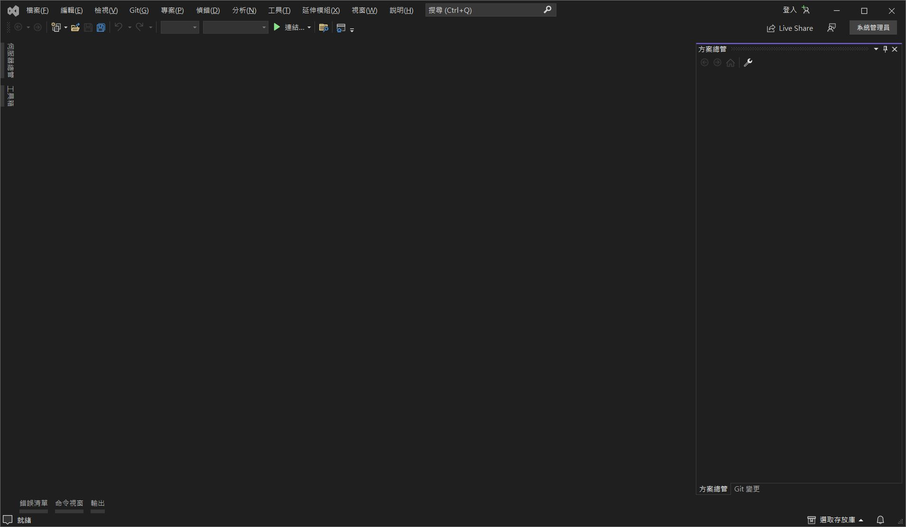

#### Создание проекта Visual Studio <a href="#creating-a-visual-studio-project" id="creating-a-visual-studio-project"></a>

Visual Studio — это многофункциональная среда разработки, в которой можно создавать проекты, добавлять ссылки, создавать файлы `.dlls` и выполнять отладку. При создании нового проекта Visual Studio также создается решение, структура для организации проектов. В одном решении можно создать несколько проектов, которые будут собраны вместе. Чтобы создать узел ZeroTouch, необходимо запустить новый проект Visual Studio, в котором будет создана библиотека классов C# и собран файл `.dll`.


> Окно New Project (Создать проект) в Visual Studio
>
> 1. Для начала откройте Visual Studio и создайте новый проект: `File > New > Project` (Файл > Создать > Проект).
> 2. Выберите шаблон проекта `Class Library` (Библиотека классов).
> 3. Присвойте проекту имя (мы назвали проект MyCustomNode).
> 4. Задайте путь к файлу проекта. В нашем примере мы оставим расположение по умолчанию
> 5. Нажмите `Ok`.

Visual Studio автоматически создаст и откроет файл C#. Мы должны присвоить ему соответствующее имя, настроить рабочее пространство и заменить код по умолчанию на этот метод умножения.

```
 namespace MyCustomNode
 {
     public class SampleFunctions
     {
         public static double MultiplyByTwo(double inputNumber)
         {
             return inputNumber * 2.0;
         }
     }
 }
```

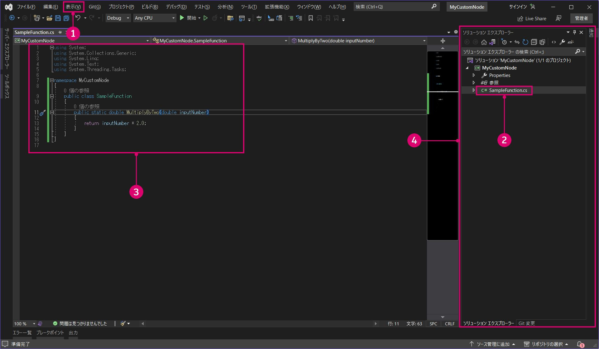

> 1. Откройте обозреватель решений и окна вывода в меню `View` (Вид).
> 2. Переименуйте файл `Class1.cs` в `SampleFunctions.cs` в обозревателе решений справа.
> 3. Добавьте приведенный выше код для функции умножения. Позднее мы рассмотрим, как Dynamo читает классы C#.
> 4. Обозреватель решений предоставляет доступ ко всем компонентам проекта.
> 5. Окно вывода понадобится позже, чтобы проверить, успешно ли выполнена сборка.

Следующий шаг — собрать проект. Но сначала необходимо кое-что проверить. Убедитесь, что в качестве целевой платформы выбрано `Any CPU` или `x64`, а флажок `Prefer 32-bit` (Предпочтительно 32-разрядная) в свойствах проекта снят.

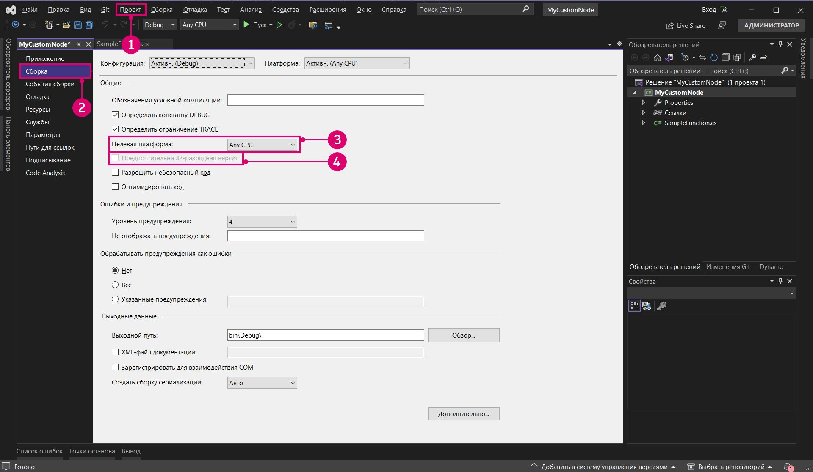

> 1. Откройте свойства проекта, выбрав `Project > "ProjectName" Properties` (Проект > Свойства имя_проекта).
> 2. Выберите страницу `Build` (Сборка).
> 3. Выберите `Any CPU` или `x64` в раскрывающемся меню.
> 4. Убедитесь, что флажок `Prefer 32-bit` (Предпочтительно 32-разрядная) снят.

Теперь можно собрать проект, чтобы создать файл `.dll`. Для этого выберите `Build Solution` (Собрать решение) в меню `Build` (Сборка) или нажмите клавиши `CTRL+SHIFT+B`.

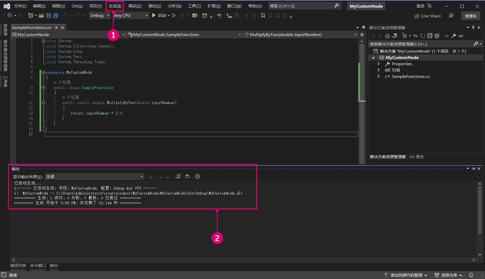

> 1. Выберите `Build > Build Solution` (Сборка > Собрать решение).
> 2. Чтобы определить, успешно ли собран проект, проверьте окно вывода.

Если проект собран успешно, в папке проекта `bin` появится файл `.dll` с именем `MyCustomNode`. В нашем примере мы оставили путь к файлу проекта, как указано в Visual Studio по умолчанию: `c:\users\username\documents\visual studio 2015\Projects`. Давайте рассмотрим структуру файлов проекта.

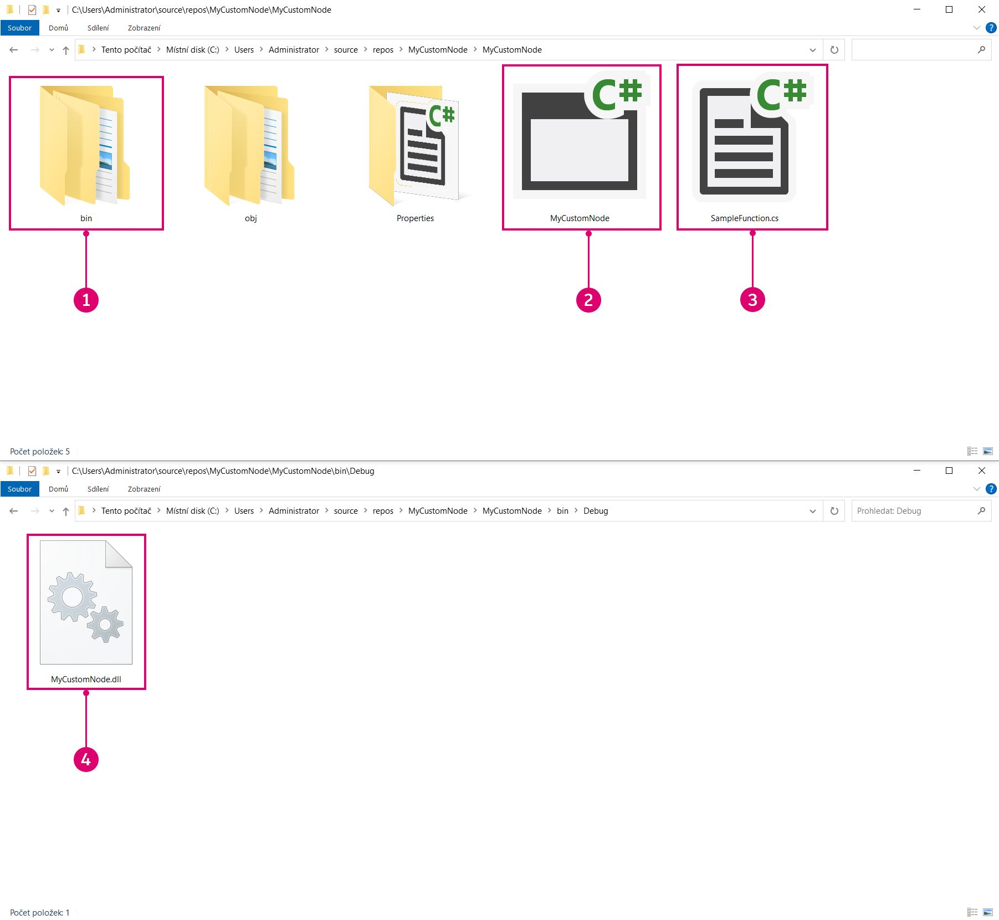

> 1. Папка `bin` содержит файл `.dll`, собранный в Visual Studio.
> 2. Файл проекта Visual Studio.
> 3. Файл класса.
> 4. Поскольку в конфигурации решения задано значение `Debug` (Отладка), `.dll` будет создан в `bin\Debug`.

Теперь можно открыть Dynamo и импортировать `.dll`. С помощью функции добавления перейдите к папке проекта `bin` и выберите файл `.dll`, который требуется открыть.

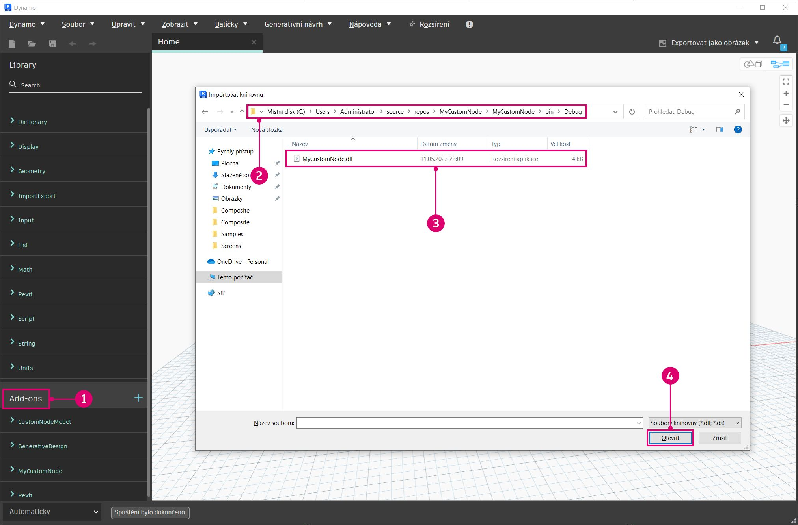

> 1. Нажмите кнопку Add (Добавить) для импорта `.dll`.
> 2. Перейдите к папке проекта. Наш проект находится в папке файла Visual Studio по умолчанию: `C:\Users\username\Documents\Visual Studio 2015\Projects\MyCustomNode`.
> 3. Выберите `MyCustomNode.dll` для импорта.
> 4. Нажмите `Open` (Открыть), чтобы загрузить `.dll`.

Если категория была создана в библиотеке с именем `MyCustomNode`, то DLL-файл импортирован успешно. Однако Dynamo создал два узла, а мы хотели, чтобы узел был один. В следующем разделе вы узнаете, почему так происходит и как Dynamo считывает DLL-файл.


> 1. MyCustomNode в библиотеке Dynamo. Категория «Библиотека» определяется именем `.dll`.
> 2. SampleFunctions.MultiplyByTwo в рабочей области.

#### Способы чтения классов и методов в Dynamo <a href="#how-dynamo-reads-classes-and-methods" id="how-dynamo-reads-classes-and-methods"></a>

Когда Dynamo загружает DLL-файл, он предоставляет все открытые статические методы в виде узлов. Конструкторы, методы и свойства преобразуются в узлы Create, Action и Query соответственно. В нашем примере умножения метод `MultiplyByTwo()` становится узлом Action в Dynamo. Это связано с тем, что узел назван в соответствии с методом и классом.

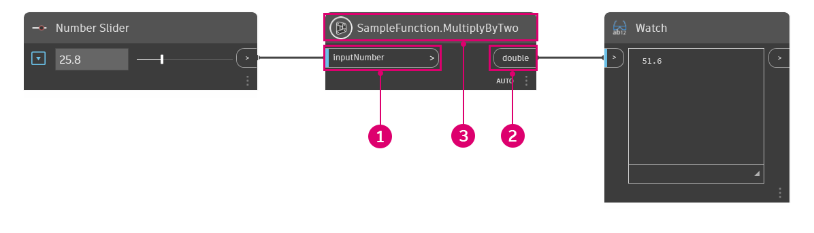

> 1. Входным данным присваивается имя `inputNumber` на основе имени параметра метода.
> 2. По умолчанию выходным данным присваивается имя `double`, так как это возвращаемый тип данных.
> 3. Узел называется `SampleFunctions.MultiplyByTwo`, так как содержит имена классов и методов.

В приведенном выше примере был создан дополнительный узел `SampleFunctions` Create: мы явно не предоставили конструктор, поэтому он был создан автоматически. Этого можно избежать, создав пустой частный конструктор в классе `SampleFunctions`.

```
namespace MyCustomNode
{
    public class SampleFunctions
    {
        //The empty private constructor.
        //This will be not imported into Dynamo.
        private SampleFunctions() { }

        //The public multiplication method. 
        //This will be imported into Dynamo.
        public static double MultiplyByTwo(double inputNumber)
        {
            return inputNumber * 2.0;
        }
    }
}
```

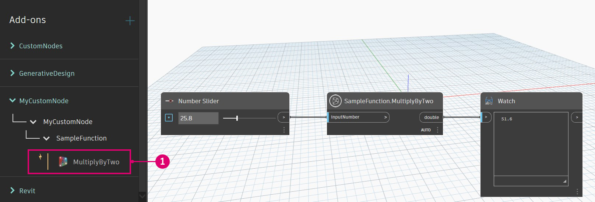

> 1. Dynamo импортировал метод в качестве узла Create.

#### Добавление ссылок на пакеты Dynamo NuGet <a href="#adding-dynamo-nuget-package-references" id="adding-dynamo-nuget-package-references"></a>

Узел умножения очень простой и не требует ссылок на Dynamo. Если необходимо получить доступ к функциям Dynamo, например для создания геометрии, используйте пакеты Dynamo NuGet.

* [ZeroTouchLibrary](https://www.nuget.org/packages/DynamoVisualProgramming.ZeroTouchLibrary/2.0.0-beta3026) — пакет для создания библиотек автоматических узлов для Dynamo, который содержит следующие библиотеки: DynamoUnits.dll, ProtoGeometry.dll
* [WpfUILibrary](https://www.nuget.org/packages/DynamoVisualProgramming.WpfUILibrary/2.0.0-beta3026) — пакет для сборки библиотек узлов Dynamo с пользовательским интерфейсом в WPF, который содержит следующие библиотеки: DynamoCoreWpf.dll, CoreNodeModels.dll, CoreNodeModelWpf.dll
* [DynamoServices](https://www.nuget.org/packages/DynamoVisualProgramming.WpfUILibrary/2.0.0-beta3026) — библиотека DynamoServices для Dynamo
* [Core](https://www.nuget.org/packages/DynamoVisualProgramming.Core/2.0.0-beta3026) — инфраструктура модульного и системного тестирования для Dynamo, которая содержит следующие библиотеки: DSIronPython.dll, DynamoApplications.dll, DynamoCore.dll, DynamoInstallDetective.dll, DynamoShapeManager.dll, DynamoUtilities.dll, ProtoCore.dll, VMDataBridge.dll
* [Tests](https://www.nuget.org/packages/DynamoVisualProgramming.Tests/2.0.0-beta3026) — инфраструктура модульного и системного тестирования для Dynamo, которая содержит следующие библиотеки: DynamoCoreTests.dll, SystemTestServices.dll, TestServices.dll
* [DynamoCoreNodes](https://www.nuget.org/packages/DynamoVisualProgramming.DynamoCoreNodes/2.0.0-beta3026) — пакет для сборки базовых узлов Dynamo, содержащий следующие библиотеки: Analysis.dll, GeometryColor.dll, DSCoreNodes.dll

Чтобы ссылаться на эти пакеты в проекте Visual Studio, скачайте пакет из NuGet по ссылкам выше и вручную укажите ссылки на DLL-файлы или используйте диспетчер пакетов NuGet в Visual Studio. Сначала мы рассмотрим, как их установить с помощью NuGet в Visual Studio.

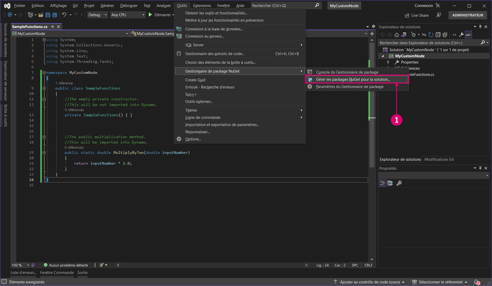

> 1. Откройте диспетчер пакетов NuGet, выбрав `Tools > NuGet Package Manager > Manage NuGet Packages for Solution...` (Инструменты > Диспетчер пакетов NuGet > Управлять пакетами NuGet для решения).

Это диспетчер пакетов NuGet. В этом окне мы видим установленные для проекта пакеты и можем искать другие пакеты. Если выпущена новая версия пакета DynamoServices, можно обновить пакеты в этом разделе или вернуться к более ранней версии.

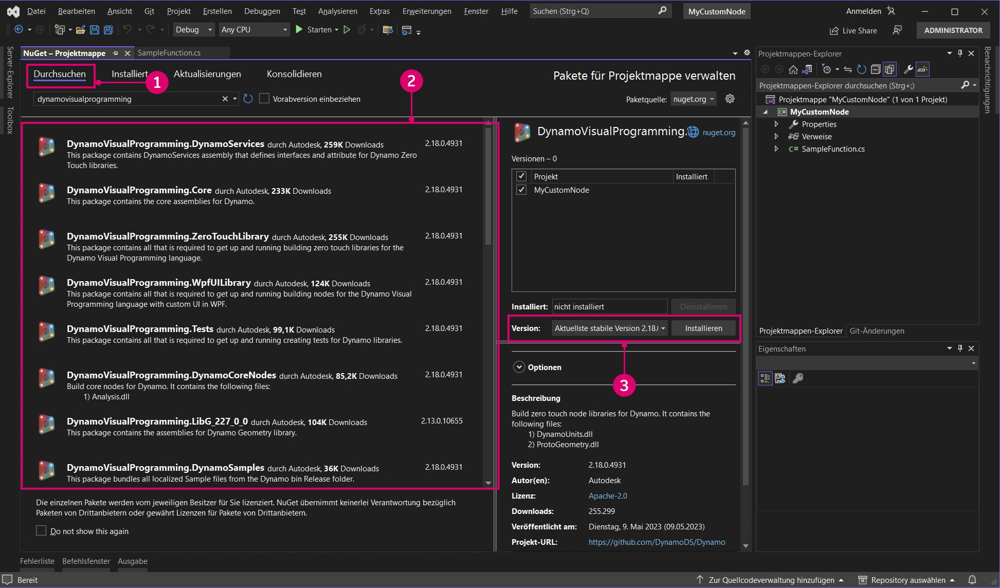

> 1. Нажмите кнопку обзора и найдите DynamoVisualProgramming, чтобы открыть пакеты Dynamo.
> 2. Пакеты Dynamo. Нажмите на один из пакетов, чтобы просмотреть его текущую версию и описание содержимого.
> 3. Выберите нужную версию пакета и нажмите кнопку Install (Установить). Пакет будет установлен для проекта, в котором вы работаете. Так как используется последняя стабильная версия Dynamo 1.3, выберите соответствующую версию пакета.

Чтобы вручную добавить пакет, загруженный из обозревателя, откройте диспетчер ссылок в обозревателе решений и перейдите к нужному пакету.

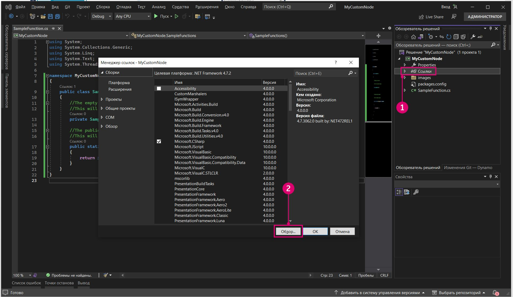

> 1. Щелкните правой кнопкой мыши `References` (Ссылки) и выберите `Add Reference` (Добавить ссылку).
> 2. Нажмите `Browse` (Обзор), чтобы перейти к папке пакета.

Итак, мы настроили Visual Studio и добавили `.dll` в Dynamo. Теперь у нас есть надежная основа для дальнейшей работы. И это только начало. Далее вы узнаете, как создать пользовательский узел.
