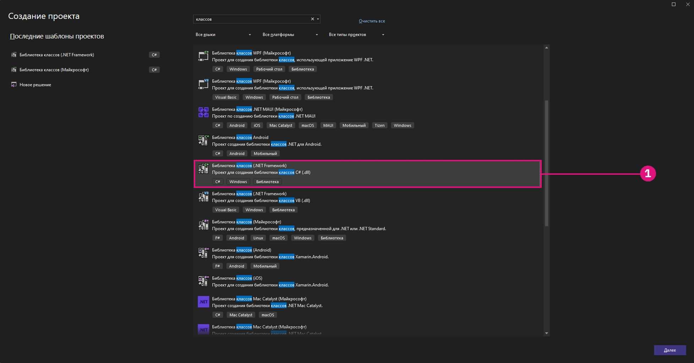

# スタートアップ 

開発に取り組む前に、新しいプロジェクトのための強固な基盤を築くことが重要です。Dynamo 開発者のコミュニティには複数のプロジェクト テンプレートがあり、ここから始めると便利ですが、プロジェクトをゼロから開始する方法を理解することはさらに重要です。プロジェクトをゼロから構築すると、開発プロセスをより深く理解できます。


#### Visual Studio プロジェクトを作成する <a href="#creating-a-visual-studio-project" id="creating-a-visual-studio-project"></a>

Visual Studio は、プロジェクトの作成、参照の追加、`.dlls` のビルド、デバッグを行うことができる強力な IDE です。新しいプロジェクトを作成する際に、Visual Studio ではプロジェクトを編成するための構造であるソリューションも作成します。複数のプロジェクトを、単一のソリューション内に配置し、まとめてビルドできます。ZeroTouch ノードを作成するには、C# クラス ライブラリを記述して `.dll` をビルドする新しい Visual Studio プロジェクトを開始する必要があります。




> Visual Studio の新しいプロジェクトのウィンドウ
>
> 1. まず、Visual Studio を開いて、`File > New > Project` で新しいプロジェクトを作成します。
> 2. `Class Library` プロジェクト テンプレートを選択します。
> 3. プロジェクトに名前を付けます(この例ではプロジェクトに MyCustomNode という名前を付けています)。
> 4. プロジェクトのファイル パスを設定します。この例では、既定の場所のままにします。
> 5. `Ok` を選択します。

Visual Studio では自動的に C# ファイルを作成して開きます。適切な名前を付け、ワークスペースを設定し、既定のコードを次の乗算方法で置き換える必要があります。

```
 namespace MyCustomNode
 {
     public class SampleFunctions
     {
         public static double MultiplyByTwo(double inputNumber)
         {
             return inputNumber * 2.0;
         }
     }
 }
```


> 1. [`View`]からソリューション エクスプローラ ウィンドウと出力ウィンドウを開きます。
> 2. 右側のソリューション エクスプローラで、ファイル `Class1.cs` の名前を `SampleFunctions.cs` に変更します。
> 3. 乗算関数として上記のコードを追加します。Dynamo での C# クラスの読み込み方法については、後で詳しく説明します。
> 4. ソリューション エクスプローラ: ここでプロジェクト内のすべてにアクセスできます。
> 5. 出力ウィンドウ: ビルドが成功したかどうかを後で確認する場合に必要になります。

次の手順ではプロジェクトをビルドしますが、その前に設定をいくつか確認する必要があります。まず、プロジェクトのプロパティで、[Platform target]に `Any CPU` または `x64` が選択され、`Prefer 32-bit` がオフになっていることを確認します。


> 1. `Project > "ProjectName" Properties` を選択して、プロジェクトのプロパティを開きます。
> 2. `Build` ページを選択します。
> 3. ドロップダウン メニューから `Any CPU` または `x64` を選択します。
> 4. `Prefer 32-bit` がオフになっていることを確認します。

これで、`.dll` を作成するためにプロジェクトをビルドできるようになりました。これを行うには、[`Build`]メニューから[`Build Solution`]を選択するか、ショートカット `CTRL+SHIFT+B` を使用します。


> 1. `Build > Build Solution` を選択します。
> 2. 出力ウィンドウを確認すると、プロジェクトが正常にビルドされたかどうかを判断できます。

プロジェクトが正常にビルドされた場合、プロジェクトの `bin` フォルダに `MyCustomNode` という名前の `.dll` が作成されます。この例では、プロジェクトのファイル パスを Visual Studio の既定である `c:\users\username\documents\visual studio 2015\Projects` のままにしました。プロジェクトのファイル構造を確認します。


> 1. `bin` フォルダには、Visual Studio でビルドされた `.dll` が含まれています。
> 2. Visual Studio プロジェクト ファイル。
> 3. クラス ファイル。
> 4. ソリューション構成を `Debug` に設定したため、`.dll` は `bin\Debug` に作成されます。

これで、Dynamo を開いて `.dll` を読み込むことができるようになりました。追加機能を使用して、プロジェクトの `bin` の場所にナビゲートし、`.dll` を選択して開きます。


> 1. `.dll` を読み込むため、[追加]ボタンを選択します。
> 2. プロジェクトの場所にナビゲートします。プロジェクトは、Visual Studio の既定のファイル パス `C:\Users\username\Documents\Visual Studio 2015\Projects\MyCustomNode` にあります。
> 3. 読み込む `MyCustomNode.dll` を選択します。
> 4. [`Open`]をクリックして `.dll` をロードします。

ライブラリに `MyCustomNode` という名前のカテゴリが作成されている場合は、.dll が正常に読み込まれています。しかし、単一のノードを作成しようとしたところ、Dynamo で 2 つのノードが作成されました。次のセクションでは、このようになる理由と、Dynamo による .dll の読み込みについて説明します。


> 1. Dynamo ライブラリ内の MyCustomNode。ライブラリのカテゴリは、`.dll` の名前によって決まります。
> 2. キャンバス上の SampleFunctions.MultiplyByTwo。

#### Dynamo によるクラスとメソッドを読み込む仕組み <a href="#how-dynamo-reads-classes-and-methods" id="how-dynamo-reads-classes-and-methods"></a>

Dynamo は .dll をロードする際、すべてのパブリック静的メソッドをノードとして公開します。コンストラクタ、メソッド、およびプロパティは、それぞれ Create ノード、Action ノード、および Query ノードに変換されます。この乗算の例では、`MultiplyByTwo()` メソッドが Dynamo で Action ノードになります。これは、ノードの名前がそのメソッドとクラスに基づいて付けられているためです。


> 1. 入力には、メソッドのパラメータ名に基づいて `inputNumber` という名前が付けられています。
> 2. 出力に既定で `double` という名前が付けられているのは、これが返されるデータ タイプであるためです。
> 3. ノードに `SampleFunctions.MultiplyByTwo` という名前が付けられているのは、クラス名とメソッド名であるためです。

上記の例では、さらに `SampleFunctions` という Create ノードが作成されました。これは、明示的にコンストラクタを指定しなかったために自動的に作成されたことが原因です。これを回避するには、`SampleFunctions` クラスに空のプライベート コンストラクタを作成します。

```
namespace MyCustomNode
{
    public class SampleFunctions
    {
        //The empty private constructor.
        //This will be not imported into Dynamo.
        private SampleFunctions() { }

        //The public multiplication method. 
        //This will be imported into Dynamo.
        public static double MultiplyByTwo(double inputNumber)
        {
            return inputNumber * 2.0;
        }
    }
}
```


> 1. Dynamo が Create ノードとしてメソッドを読み込みました。

#### Dynamo NuGet パッケージの参照設定を追加する <a href="#adding-dynamo-nuget-package-references" id="adding-dynamo-nuget-package-references"></a>

乗算ノードは非常に単純なため、Dynamo への参照設定は必要ありません。たとえば、ジオメトリを作成するために Dynamo の機能にアクセスする場合は、Dynamo NuGet パッケージを参照する必要があります。

* [ZeroTouchLibrary](https://www.nuget.org/packages/DynamoVisualProgramming.ZeroTouchLibrary/2.0.0-beta3026) \- Dynamo の Zero Touch ノード ライブラリをビルドするためのパッケージであり、DynamoUnits.dll、ProtoGeometry.dll というライブラリが含まれています。
* [WpfUILibrary](https://www.nuget.org/packages/DynamoVisualProgramming.WpfUILibrary/2.0.0-beta3026) \- WPF のカスタム UI を含む Dynamo のノード ライブラリをビルドするためのパッケージであり、DynamoCoreWpf.dll、CoreNodeModels.dll、CoreNodeModelWpf.dll というライブラリが含まれています。
* [DynamoServices](https://www.nuget.org/packages/DynamoVisualProgramming.WpfUILibrary/2.0.0-beta3026) \- Dynamo の DynamoServices ライブラリ。
* [Core](https://www.nuget.org/packages/DynamoVisualProgramming.Core/2.0.0-beta3026) \- Dynamo の単位およびシステムのテスト インフラストラクチャであり、DSIronPython.dll、DynamoApplications.dll、DynamoCore.dll、DynamoInstallDetective.dll、DynamoShapeManager.dll、DynamoUtilities.dll、ProtoCore.dll、VMDataBridge.dll というライブラリが含まれています。
* [Tests](https://www.nuget.org/packages/DynamoVisualProgramming.Tests/2.0.0-beta3026) \- Dynamo の単位およびシステムのテスト インフラストラクチャであり、DynamoCoreTests.dll、SystemTestServices.dll、TestServices.dll というライブラリが含まれています。
* [DynamoCoreNodes](https://www.nuget.org/packages/DynamoVisualProgramming.DynamoCoreNodes/2.0.0-beta3026) \- Dynamo のコア ノードをビルドするためのパッケージであり、Analysis.dll、GeometryColor.dll、DSCoreNodes.dll というライブラリが含まれています。

Visual Studio プロジェクトでこれらのパッケージを参照するには、上記のリンクで NuGet からパッケージをダウンロードして .dll を手動で参照するか、Visual Studio の NuGet パッケージ マネージャ を使用します。まず、Visual Studio で NuGet を使用してインストールする方法について説明します。


> 1. `Tools > NuGet Package Manager > Manage NuGet Packages for Solution...` を選択して NuGet パッケージ マネージャを開きます。

次の図が NuGet パッケージ マネージャです。このウィンドウには、プロジェクトにインストールされているパッケージが表示され、ユーザは他のパッケージを参照できます。DynamoServices パッケージの新しいバージョンがリリースされた場合は、ここからパッケージを更新できます。前のバージョンに戻すこともできます。


> 1. [参照]を選択し、DynamoVisualProgramming を検索して Dynamo パッケージを表示します。
> 2. Dynamo パッケージです。いずれかを選択すると、そのパッケージの現在のバージョンと内容の説明が表示されます。
> 3. 必要なパッケージのバージョンを選択し、[インストール]をクリックします。これにより、作業中の特定のプロジェクトにパッケージがインストールされます。Dynamo の最新の公式リリースであるバージョン 1.3 を使用しているため、対応するパッケージのバージョンを選択します。

ブラウザからダウンロードしたパッケージを手動で追加するには、ソリューション エクスプローラから Reference Manager を開いてパッケージを参照します。


> 1. [`References`]を右クリックして、[`Add Reference`]を選択します。
> 2. [`Browse`]を選択して、パッケージの場所にナビゲートします。

Visual Studio が適切に構成され、Dynamo に `.dll` が正常に追加されたため、今後、コンセプトの強固な基盤となります。これは第一歩にすぎないため、引き続きカスタム ノードの作成方法の詳細について確認してください。
