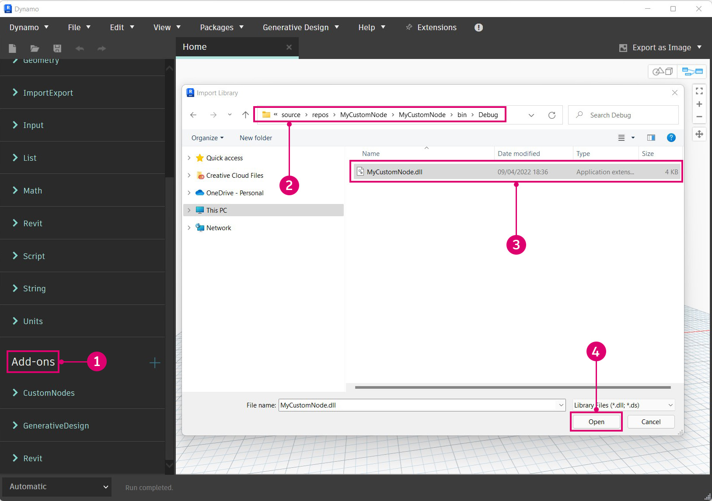

# Erste Schritte

Bevor wir mit der Entwicklung beginnen, ist es wichtig, ein solides Fundament für ein neues Projekt zu schaffen. Die Dynamo-Entwickler-Community verfügt über mehrere Projektvorlagen, die sich hervorragend als Ausgangspunkt eignen. Ein umfassendes Verständnis, wie Sie ein Projekt von Grund auf neu beginnen, ist jedoch noch wertvoller. Der Aufbau eines Projekts von Grund auf ermöglicht ein tieferes Verständnis des Entwicklungsprozesses.


#### Erstellen eines Visual Studio-Projekts <a href="#creating-a-visual-studio-project" id="creating-a-visual-studio-project"></a>

Visual Studio ist eine leistungsstarke IDE, in der wir ein Projekt erstellen, Referenzen hinzufügen, `.dll`-Dateien generieren und debuggen können. Beim Erstellen eines neuen Projekts erstellt Visual Studio außerdem eine Projektmappe, eine Struktur zum Organisieren von Projekten. In einer einzelnen Projektmappe können mehrere Projekte enthalten sein, die zusammen erstellt werden können. Um einen Zero-Touch-Block zu erstellen, müssen wir ein neues Visual Studio-Projekt starten, in im wir eine C#-Klassenbibliothek schreiben und eine `.dll`-Datei erstellen.


> Fenster Neues Projekt in Visual Studio
>
> 1. Öffnen Sie zunächst Visual Studio, und erstellen Sie ein neues Projekt: `File > New > Project`
> 2. Wählen Sie die Projektvorlage `Class Library`.
> 3. Geben Sie dem Projekt einen Namen (wir haben das Projekt MyCustomNode genannt).
> 4. Legen Sie den Dateipfad für das Projekt fest. In diesem Beispiel belassen wir den Vorgabespeicherort.
> 5. Wählen Sie `Ok` aus.

Visual Studio erstellt und öffnet automatisch eine C#-Datei. Sie sollten einen angemessenen Namen vergeben, den Arbeitsbereich einrichten und den Vorgabecode durch diese Multiplikationsmethode ersetzen:

```
 namespace MyCustomNode
 {
     public class SampleFunctions
     {
         public static double MultiplyByTwo(double inputNumber)
         {
             return inputNumber * 2.0;
         }
     }
 }
```


> 1. Öffnen Sie den Projektmappen-Explorer und die Ausgabefenster über `View`.
> 2. Benennen Sie die Datei `Class1.cs` im Projektmappen-Explorer auf der rechten Seite in `SampleFunctions.cs` um.
> 3. Fügen Sie den oben genannten Code für die Multiplikationsfunktion hinzu. Die Details dazu, wie Dynamo Ihre C#-Klassen liest, werden wir später behandeln.
> 4. Projektmappen-Explorer: Hiermit erhalten Sie Zugriff auf alle Elemente in Ihrem Projekt.
> 5. Ausgabefenster: Dieses wird später benötigt, um zu sehen, ob der Build erfolgreich war.

Der nächste Schritt besteht darin, das Projekt zu erstellen. Zuvor müssen wir jedoch einige Einstellungen überprüfen. Stellen Sie zunächst sicher, dass `Any CPU` oder `x64` als Plattformziel ausgewählt und `Prefer 32-bit` in den Projekteigenschaften deaktiviert ist.


> 1. Öffnen Sie die Projekteigenschaften, indem Sie `Project > "ProjectName" Properties` auswählen.
> 2. Wählen Sie die Seite `Build` aus.
> 3. Wählen Sie im Dropdown-Menü die Option `Any CPU` oder `x64` aus.
> 4. Stellen Sie sicher, dass `Prefer 32-bit` deaktiviert ist.

Jetzt können wir das Projekt erstellen, um eine `.dll`-Datei zu generieren. Wählen Sie dazu entweder `Build Solution` aus dem Menü `Build` aus, oder verwenden Sie den Kurzbefehl `CTRL+SHIFT+B`.


> 1. Wählen Sie `Build > Build Solution` aus.
> 2. Sie können feststellen, ob Ihr Projekt erfolgreich erstellt wurde, indem Sie das Ausgabefenster überprüfen.

Wenn das Projekt erfolgreich erstellt wurde, wird im Ordner `bin` des Projekts eine `.dll`-Datei mit dem Namen `MyCustomNode` angezeigt. In diesem Beispiel haben wir die Visual Studio-Vorgabe für den Projektdateipfad `c:\users\username\documents\visual studio 2015\Projects` beibehalten. Sehen wir uns nun die Dateistruktur des Projekts an.


> 1. Der Ordner `bin` enthält die in Visual Studio erstellte `.dll`-Datei.
> 2. Die Visual Studio-Projektdatei
> 3. Die Klassendatei
> 4. Da unsere Projektmappen-Konfiguration auf `Debug` festgelegt wurde, wird die `.dll`-Datei unter `bin\Debug` erstellt.

Jetzt können wir Dynamo öffnen und die `.dll`-Datei importieren. Navigieren Sie mit der Funktion Hinzufügen zum `bin`-Speicherort des Projekts, und wählen Sie die zu öffnende `.dll`-Datei aus.



> 1. Wählen Sie die Schaltfläche Hinzufügen, um eine `.dll`-Datei zu importieren.
> 2. Navigieren Sie zum Projektspeicherort. Das Projekt befindet sich unter dem Vorgabedateipfad von Visual Studio: `C:\Users\username\Documents\Visual Studio 2015\Projects\MyCustomNode`.
> 3. Wählen Sie die zu importierende Datei `MyCustomNode.dll` aus.
> 4. Klicken Sie auf `Open`, um die `.dll`-Datei zu laden.

Wenn eine Kategorie mit dem Namen `MyCustomNode` in der Bibliothek erstellt wird, wurde die DLL-Datei erfolgreich importiert. Dynamo hat jedoch zwei Blöcke erstellt, obwohl wir einen einzelnen Block erhalten wollten. Im nächsten Abschnitt werden wir erläutern, warum dies geschieht und wie Dynamo DLL-Dateien liest.


> 1. MyCustomNode in der Dynamo-Bibliothek. Die Bibliothekskategorie wird durch den Namen der `.dll`-Datei bestimmt.
> 2. SampleFunctions.MultiplyByTwo im Ansichtsbereich.

#### So liest Dynamo Klassen und Methoden <a href="#how-dynamo-reads-classes-and-methods" id="how-dynamo-reads-classes-and-methods"></a>

Wenn Dynamo eine DLL-Datei lädt, werden alle öffentlichen statischen Methoden als Blöcke angezeigt. Konstruktoren, Methoden und Eigenschaften werden in Erstellungs-, Aktions- und Abfrageblöcke umgewandelt. In unserem Multiplikationsbeispiel wird die Methode `MultiplyByTwo()` zu einem Aktionsblock in Dynamo. Dies liegt daran, dass der Block basierend auf der zugehörigen Methode und Klasse benannt wurde.


> 1. Die Eingabe erhält basierend auf dem Parameternamen der Methode den Namen `inputNumber`.
> 2. Die Ausgabe erhält vorgabemäßig den Namen `double`, da es sich hierbei um den zurückgegebenen Datentyp handelt.
> 3. Der Block erhält den Namen `SampleFunctions.MultiplyByTwo`, da dies die Klassen- und Methodennamen sind.

Im obigen Beispiel wurde der zusätzliche Erstellungsblock `SampleFunctions` erzeugt, da wir nicht explizit einen Konstruktor bereitgestellt haben, und daher automatisch einer erstellt wurde. Dies kann durch Erstellen eines leeren privaten Konstruktors in der Klasse `SampleFunctions` vermieden werden.

```
namespace MyCustomNode
{
    public class SampleFunctions
    {
        //The empty private constructor.
        //This will be not imported into Dynamo.
        private SampleFunctions() { }

        //The public multiplication method. 
        //This will be imported into Dynamo.
        public static double MultiplyByTwo(double inputNumber)
        {
            return inputNumber * 2.0;
        }
    }
}
```


> 1. Dynamo hat unsere Methode als Erstellungsblock importiert.

#### Hinzufügen von Dynamo-NuGet-Paketreferenzen <a href="#adding-dynamo-nuget-package-references" id="adding-dynamo-nuget-package-references"></a>

Der Block für die Multiplikation ist sehr einfach, und es sind keine Referenzen auf Dynamo erforderlich. Wenn wir beispielsweise auf eine Dynamo-Funktion zum Erstellen von Geometrie zugreifen möchten, müssen wir die Dynamo-NuGet-Pakete referenzieren.

* [ZeroTouchLibrary](https://www.nuget.org/packages/DynamoVisualProgramming.ZeroTouchLibrary/2.0.0-beta3026): Paket zum Erstellen von Zero-Touch-Blockbibliotheken für Dynamo mit den folgenden Bibliotheken: DynamoUnits.dll, ProtoGeometry.dll.
* [WpfUILibrary](https://www.nuget.org/packages/DynamoVisualProgramming.WpfUILibrary/2.0.0-beta3026): Paket zum Erstellen von Blockbibliotheken für Dynamo mit angepasster Benutzeroberfläche in WPF, die die folgenden Bibliotheken enthält: DynamoCoreWpf.dll, CoreNodeModels.dll, CoreNodeModelWpf.dll.
* [DynamoServices](https://www.nuget.org/packages/DynamoVisualProgramming.WpfUILibrary/2.0.0-beta3026): DynamoServices-Bibliothek für Dynamo.
* [Core](https://www.nuget.org/packages/DynamoVisualProgramming.Core/2.0.0-beta3026): Komponenten- und System-Testinfrastruktur für Dynamo, die die folgenden Bibliotheken enthält: DSIronPython.dll, DynamoApplications.dll, DynamoCore.dll, DynamoInstallDetective.dll, DynamoShapeManager.dll, DynamoUtilities.dll, ProtoCore.dll, VMDataBridge.Bridge.dll.
* [Tests](https://www.nuget.org/packages/DynamoVisualProgramming.Tests/2.0.0-beta3026): Komponenten- und System-Testinfrastruktur für Dynamo, die die folgenden Bibliotheken enthält: DynamoCoreTests.dll, SystemTestServices.dll, TestServices.dll.
* [DynamoCoreNodes](https://www.nuget.org/packages/DynamoVisualProgramming.DynamoCoreNodes/2.0.0-beta3026): Paket zum Erstellen von Core-Blöcken für Dynamo, das die folgenden Bibliotheken enthält: Analysis.dll, GeometryColor.dll, DSCoreNodes.dll.

Um diese Pakete in einem Visual Studio-Projekt zu referenzieren, laden Sie das Paket entweder von NuGet unter den oben genannten Links herunter und referenzieren die DLL-Dateien manuell, oder verwenden Sie den NuGet-Paket-Manager in Visual Studio. Zunächst gehen wir die Schritte zum Installieren mit NuGet in Visual Studio durch.


> 1. Öffnen Sie den NuGet-Paket-Manager, indem Sie `Tools > NuGet Package Manager > Manage NuGet Packages for Solution...` auswählen.

Dies ist der NuGet-Paket-Manager. In diesem Fenster wird angezeigt, welche Pakete für das Projekt installiert wurden, und der Benutzer kann nach anderen Paketen suchen. Wenn eine neue Version des DynamoServices-Pakets veröffentlicht wird, können Pakete von hier aus aktualisiert oder auf eine frühere Version zurückgesetzt werden.


> 1. Wählen Sie Durchsuchen, und suchen Sie nach DynamoVisualProgramming, um die Dynamo-Pakete aufzurufen.
> 2. Die Dynamo-Pakete. Wenn Sie eines auswählen, werden die aktuelle Version und eine Beschreibung des Inhalts angezeigt.
> 3. Wählen Sie die gewünschte Paketversion aus, und klicken Sie auf Installieren. Dadurch wird ein Paket für das spezifische Projekt installiert, an dem Sie gerade arbeiten. Da wir die neueste stabile Version von Dynamo, Version 1.3, verwenden, wählen Sie die entsprechende Paketversion aus.

Um ein aus dem Browser heruntergeladenes Paket manuell hinzuzufügen, öffnen Sie den Verweis-Manager im Projektmappen-Explorer und suchen nach dem Paket.


> 1. Klicken Sie mit der rechten Maustaste auf `References`, und wählen Sie `Add Reference` aus.
> 2. Wählen Sie `Browse` aus, um zum Paketspeicherort zu navigieren.

Nachdem Visual Studio ordnungsgemäß konfiguriert wurde und wir erfolgreich eine `.dll`-Datei zu Dynamo hinzugefügt haben, verfügen wir über eine solide Grundlage für die nun folgenden Konzepte. Dies ist nur der Anfang. Bleiben Sie daher weiter dabei, um mehr über das Erstellen eines benutzerdefinierten Blocks zu erfahren.
