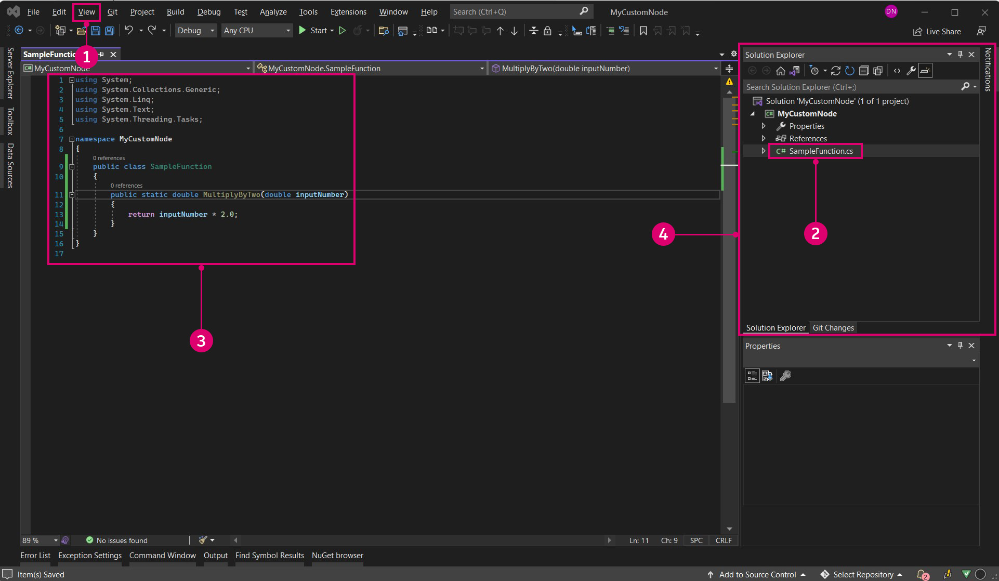
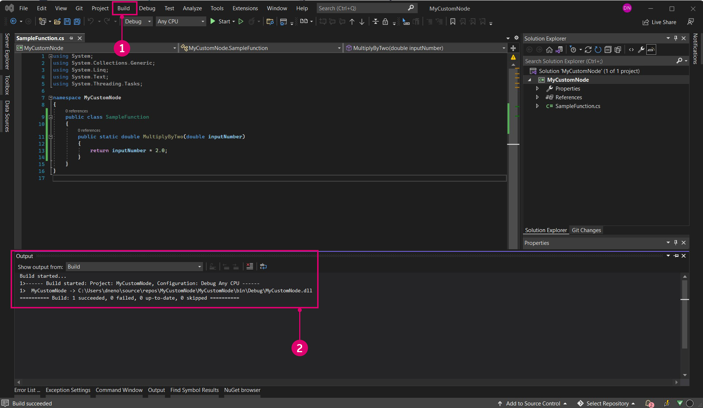
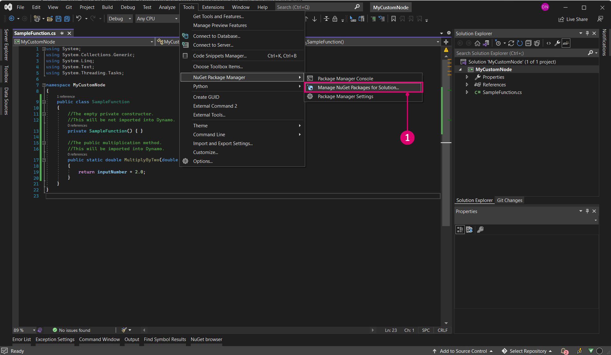

# Guia de introdução 

Antes de entrar no desenvolvimento, é importante compilar uma base sólida para um novo projeto. Há vários modelos de projeto na comunidade de desenvolvedores do Dynamo que são excelentes locais para começar, mas uma compreensão de como iniciar um projeto do zero é ainda mais valiosa. A compilação de um projeto desde o início proporcionará uma compreensão mais profunda do processo de desenvolvimento.


#### Criar um projeto do Visual Studio <a href="#creating-a-visual-studio-project" id="creating-a-visual-studio-project"></a>

O Visual Studio é um IDE poderoso, onde podemos criar um projeto, adicionar referências, compilar `.dlls` e depurar. Ao criar um novo projeto, o Visual Studio também criará uma Solução, uma estrutura para organizar projetos. Vários projetos podem existir em uma única solução e podem ser compilados juntos. Para criar um nó Sem toque, precisaremos iniciar um novo projeto do Visual Studio no qual gravaremos uma biblioteca de classe C# e compilaremos um `.dll`.


> Janela Novo projeto no Visual Studio
>
> 1. Começar abrindo o Visual Studio e criando um novo projeto: `File > New > Project`
> 2. Selecionar o modelo de projeto `Class Library`
> 3. Nomear o projeto (nomeamos o projeto MyCustomNode)
> 4. Definir o caminho do arquivo para o projeto. Para este exemplo, vamos deixá-lo na localização padrão
> 5. Selecionar `Ok`

O Visual Studio criará e abrirá automaticamente um arquivo C#. Deve ser atribuído um nome apropriado, deve ser configurado o espaço de trabalho e substituído o código padrão por este método de multiplicação.

```
 namespace MyCustomNode
 {
     public class SampleFunctions
     {
         public static double MultiplyByTwo(double inputNumber)
         {
             return inputNumber * 2.0;
         }
     }
 }
```



> 1. Abrir o Gerenciador de soluções e as janelas Saída em `View`.
> 2. Renomear o arquivo `Class1.cs` `SampleFunctions.cs` no Gerenciador de soluções à direita.
> 3. Adicionar o código acima para a função de multiplicação. Abordaremos as especificações de como o Dynamo lerá as classes C# mais adiante.
> 4. O Gerenciador de soluções fornece acesso a tudo no projeto.
> 5. Janela Saída: precisaremos dela mais tarde para ver se a compilação foi bem-sucedida.

A próxima etapa é compilar o projeto, mas antes de fazer isso, há algumas configurações que precisamos verificar. Primeiro, assegure-se de que `Any CPU` ou `x64` esteja selecionado como o destino da plataforma e que `Prefer 32-bit` esteja desmarcado nas Propriedades do projeto.


> 1. Abrir as propriedades do projeto selecionando `Project > "ProjectName" Properties`
> 2. Selecionar a página `Build`
> 3. Selecionar `Any CPU` ou `x64` no menu suspenso
> 4. Garantir que `Prefer 32-bit` está desmarcado

Agora podemos compilar o projeto para criar um `.dll`. Para isso, selecione `Build Solution` no menu `Build` ou use o atalho `CTRL+SHIFT+B`.



> 1. Selecionar `Build > Build Solution`
> 2. É possível determinar se o projeto foi compilado com êxito verificando a janela Saída

Se o projeto tiver sido compilado com êxito, haverá um `.dll` nomeado `MyCustomNode` na pasta do projeto `bin`. Para este exemplo, deixamos o caminho de arquivo do projeto como padrão do Visual Studio em `c:\users\username\documents\visual studio 2015\Projects`. Vamos dar uma olhada na estrutura de arquivos do projeto.


> 1. A pasta `bin` contém o `.dll` criado no Visual Studio.
> 2. O arquivo de projeto do Visual Studio.
> 3. O arquivo de classe.
> 4. Como nossa configuração de solução foi definida como `Debug`, o `.dll` será criado em `bin\Debug`.

Agora, podemos abrir o Dynamo e importar o `.dll`. Com o recurso Adicionar, navegue até a localização do projeto `bin` e selecione o `.dll` que deseja abrir.


> 1. Selecionar o botão Adicionar para importar um `.dll`
> 2. Navegar até a localização do projeto. Nosso projeto está localizado no caminho de arquivo padrão do Visual Studio: `C:\Users\username\Documents\Visual Studio 2015\Projects\MyCustomNode`
> 3. Selecionar o `MyCustomNode.dll` a ser importado
> 4. Clicar em `Open` para carregar o `.dll`

Se uma categoria for criada na biblioteca chamada `MyCustomNode`, significa que o .dll foi importado com êxito. No entanto, o Dynamo criou dois nós do que queríamos ser um nó único. Na próxima seção, explicaremos por que isso acontece e como o Dynamo lê um .dll.


> 1. MyCustomNode na biblioteca do Dynamo. A categoria da biblioteca é determinada pelo nome `.dll`.
> 2. SampleFunctions.MultiplyByTwo na tela.

#### Como o Dynamo lê as classes e os métodos <a href="#how-dynamo-reads-classes-and-methods" id="how-dynamo-reads-classes-and-methods"></a>

Quando o Dynamo carrega um .dll, ele exporá todos os métodos estáticos públicos como nós. Construtores, métodos e propriedades serão transformados em nós Criar, Ação e Consulta, respectivamente. No nosso exemplo de multiplicação, o método `MultiplyByTwo()` se torna num nó Ação no Dynamo. Isso ocorre porque o nó foi nomeado com base em seu método e classe.


> 1. A entrada é nomeada `inputNumber` com base no nome do parâmetro do método.
> 2. A saída é nomeada `double` por padrão porque esse é o tipo de dados que está sendo retornado.
> 3. O nó é nomeado `SampleFunctions.MultiplyByTwo` porque esses são os nomes de classe e método.

No exemplo acima, o nó adicional Criar `SampleFunctions` foi criado porque não fornecemos explicitamente um construtor e, portanto, um foi criado automaticamente. Podemos evitar isso criando um construtor privado vazio em nossa classe `SampleFunctions`.

```
namespace MyCustomNode
{
    public class SampleFunctions
    {
        //The empty private constructor.
        //This will be not imported into Dynamo.
        private SampleFunctions() { }

        //The public multiplication method. 
        //This will be imported into Dynamo.
        public static double MultiplyByTwo(double inputNumber)
        {
            return inputNumber * 2.0;
        }
    }
}
```


> 1. O Dynamo importou nosso método como um nó Criar

#### Adicionar referências do pacote NuGet do Dynamo <a href="#adding-dynamo-nuget-package-references" id="adding-dynamo-nuget-package-references"></a>

O nó de multiplicação é muito simples e não é necessário fazer referências ao Dynamo. Se quisermos acessar qualquer funcionalidade do Dynamo para criar geometria, por exemplo, precisaremos fazer referência aos pacotes NuGet do Dynamo.

* [ZeroTouchLibrary](https://www.nuget.org/packages/DynamoVisualProgramming.ZeroTouchLibrary/2.0.0-beta3026) – Pacote para a compilação de bibliotecas de nós sem toque para o Dynamo que contém as seguintes bibliotecas: DynamoUnits.dll, ProtoGeometry.dll
* [WpfUILibrary](https://www.nuget.org/packages/DynamoVisualProgramming.WpfUILibrary/2.0.0-beta3026) – Pacote para bibliotecas de nós de compilação do Dynamo com interface de usuário personalizada no WPF que contém as seguintes bibliotecas: DynamoCoreWpf.dll, CoreNodeModels.dll, CoreNodeModelWpf.dll
* [DynamoServices](https://www.nuget.org/packages/DynamoVisualProgramming.WpfUILibrary/2.0.0-beta3026) – Biblioteca do DynamoServices para o Dynamo
* [Core](https://www.nuget.org/packages/DynamoVisualProgramming.Core/2.0.0-beta3026) – Infraestrutura de teste da unidade e do sistema para o Dynamo que contém as seguintes bibliotecas: DSIronPython.dll, DynamoApplications.dll, DynamoCore.dll, DynamoInstallDetetive.dll, DynamoShapeManager.dll, DynamoUtilities.dll, ProtoCore.dll, VMDataBridge.dll
* [Tests](https://www.nuget.org/packages/DynamoVisualProgramming.Tests/2.0.0-beta3026) – Infraestrutura de teste da unidade e do sistema para o Dynamo que contém as seguintes bibliotecas: DynamoCoreTests.dll, SystemTestServices.dll, TestServices.dll
* [DynamoCoreNodes](https://www.nuget.org/packages/DynamoVisualProgramming.DynamoCoreNodes/2.0.0-beta3026) – Pacote para a compilação de nós principais do Dynamo que contém as seguintes bibliotecas: Analysis.dll, GeometryColor.dll, DSCoreNodes.dll

Para fazer referência a esses pacotes em um projeto do Visual Studio, faça o download do pacote NuGet nos links acima e faça referência manualmente aos .dlls ou use o Gerenciador de pacotes NuGet no Visual Studio. Primeiro, podemos analisar como instalá-los com o NuGet no Visual Studio.



> 1. Abra o Gerenciador de pacotes NuGet selecionando `Tools > NuGet Package Manager > Manage NuGet Packages for Solution...`

Esse é o Gerenciador de pacotes NuGet. Essa janela mostra quais pacotes foram instalados para o projeto e permite que o usuário procure outros. Se uma nova versão do pacote DynamoServices for liberada, os pacotes poderão ser atualizados daqui ou revertidos para uma versão anterior.


> 1. Selecionar Procurar e pesquisar DynamoVisualProgramming para ativar os pacotes do Dynamo.
> 2. Pacotes do Dynamo. Selecionar um mostrará a versão atual e a descrição do que está dentro.
> 3. Selecionar a versão do pacote necessária e clicar em instalar. Isso instala um pacote para o projeto específico no qual você está trabalhando. Como estamos usando a versão estável mais recente do Dynamo, a versão 1.3, escolha a versão do pacote correspondente.

Para adicionar manualmente um pacote transferido por download do navegador, abra o Gerenciador de referências no Gerenciador de soluções e procure o pacote.


> 1. Clicar com o botão direito do mouse em `References` e selecionar `Add Reference`.
> 2. Selecionar `Browse` para navegar para a localização do pacote.

Agora que o Visual Studio está configurado corretamente e adicionamos com êxito um `.dll` ao Dynamo, temos uma base sólida para os conceitos daqui para frente. Este é apenas o início, portanto, siga em frente para saber mais sobre como criar um nó personalizado.
