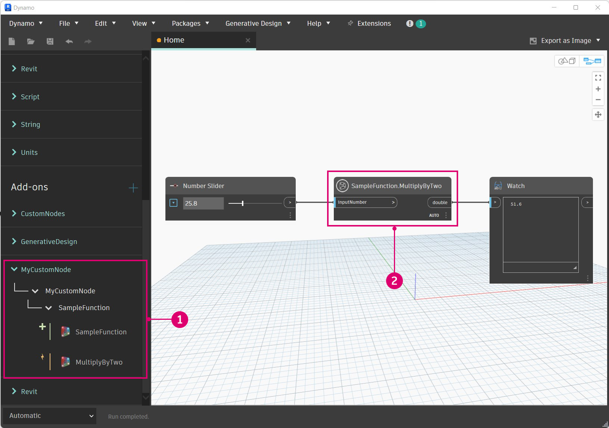
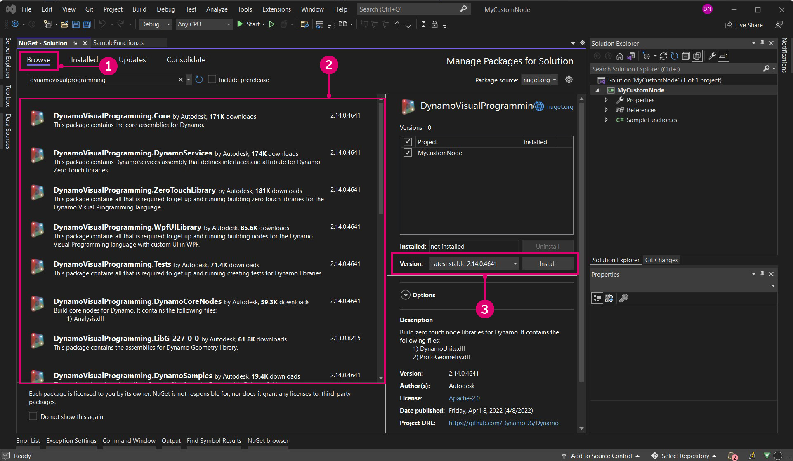

# 快速入门

在开始开发之前，请务必为新项目打下坚实基础。Dynamo 开发人员社区中的多个项目模板是绝佳的起点，但了解如何从头开始构建项目更有价值。通过从头开始构建项目，将能够更深入地了解开发过程。


#### 创建 Visual Studio 项目 <a href="#creating-a-visual-studio-project" id="creating-a-visual-studio-project"></a>

Visual Studio 是一个功能强大的 IDE，我们可以在其中创建项目、添加参照、构建 `.dlls` 和调试。在创建新项目时，Visual Studio 还会创建一个解决方案，即用于组织项目的结构。多个项目可以存在于一个解决方案中，并可以一起构建。要创建 ZeroTouch 节点，我们需要开始一个新的 Visual Studio 项目，我们将在该项目中编写一个 C# 类库并构建一个 `.dll`。


> Visual Studio 中的“新建项目”窗口
>
> 1. 首先打开 Visual Studio 并创建一个新项目：`File > New > Project`
> 2. 选择 `Class Library` 项目模板
> 3. 为项目命名（我们已将项目命名为“MyCustomNode”）
> 4. 设置项目的文件路径。在本例中，我们将其保留在默认位置
> 5. 选择 `Ok`

Visual Studio 将自动创建并打开一个 C# 文件。我们应为其指定一个合适名称、设置工作空间，并将默认代码替换为以下乘法方法。

```
 namespace MyCustomNode
 {
     public class SampleFunctions
     {
         public static double MultiplyByTwo(double inputNumber)
         {
             return inputNumber * 2.0;
         }
     }
 }
```


> 1. 从 `View` 打开“解决方案资源管理器”和“输出”窗口。
> 2. 在右侧的“解决方案资源管理器”中，将 `Class1.cs` 文件重命名为 `SampleFunctions.cs`。
> 3. 为乘法函数添加上述代码。我们稍后会介绍 Dynamo 将如何读取您的 C# 类的详情。
> 4. 解决方案资源管理器：该资源管理器使您能够访问项目中的所有内容。
> 5. “输出”窗口：我们稍后会需要使用该窗口来查看构建是否已成功。

下一步是构建项目，但在构建之前，我们需要检查一些设置。首先，确保已选择 `Any CPU` 或 `x64` 作为平台目标，并确保在“项目特性”中未选中 `Prefer 32-bit`。


> 1. 通过选择 `Project > "ProjectName" Properties` 打开项目特性
> 2. 选择 `Build` 页面
> 3. 从下拉菜单中选择 `Any CPU` 或 `x64`
> 4. 确保未选中 `Prefer 32-bit`

现在，我们可以构建项目以创建 `.dll`。要执行此操作，请从 `Build` 菜单中选择 `Build Solution`，或使用快捷键 `CTRL+SHIFT+B`。


> 1. 选择 `Build > Build Solution`
> 2. 可以通过检查“输出”窗口来确定您的项目是否已成功构建

如果项目已成功构建，则项目的 `bin` 文件夹中会有一个名为 `MyCustomNode` 的 `.dll`。在本例中，我们已将项目的文件路径保留为 Visual Studio 的默认路径：`c:\users\username\documents\visual studio 2015\Projects`。让我们来看一下项目的文件结构。


> 1. `bin` 文件夹包含从 Visual Studio 构建的 `.dll`。
> 2. Visual Studio 项目文件。
> 3. 类文件。
> 4. 由于我们的解决方案配置已设置为 `Debug`，因此将在 `bin\Debug` 中创建 `.dll`。

现在，我们可以打开 Dynamo 并输入 `.dll`。使用“添加”功能时，导航到项目的 `bin` 位置，然后选择要打开的 `.dll`。


> 1. 选择“添加”按钮以输入 `.dll`
> 2. 浏览到项目位置。我们的项目位于 Visual Studio 的默认文件路径：`C:\Users\username\Documents\Visual Studio 2015\Projects\MyCustomNode`
> 3. 选择要输入的 `MyCustomNode.dll`
> 4. 单击 `Open` 以载入 `.dll`

如果在名为 `MyCustomNode` 的库中创建了一个类别，则表示 .dll 已成功输入！但是，Dynamo 创建了两个节点，而我们希望这两个节点成为单个节点。在下一节中，我们将解释发生这种情况的原因，以及 Dynamo 读取 .dll 的方式。



> 1. Dynamo 库中的 MyCustomNode。“库”类别由 `.dll` 名称确定。
> 2. 画布上的 SampleFunctions.MultiplyByTwo。

#### Dynamo 读取类和方法的方式 <a href="#how-dynamo-reads-classes-and-methods" id="how-dynamo-reads-classes-and-methods"></a>

在 Dynamo 载入 .dll 后，它会将所有公有静态方法显示为节点。构造函数、方法和特性将分别转换为 Create、Action 和 Query 节点。在我们的乘法示例中，`MultiplyByTwo()` 方法会在 Dynamo 中成为 Action 节点。这是因为节点已根据其方法和类进行命名。


> 1. 输入根据方法的参数名称命名为 `inputNumber`。
> 2. 输出默认命名为 `double`，因为这是要返回的数据类型。
> 3. 节点命名为 `SampleFunctions.MultiplyByTwo`，因为这些是类和方法名称。

在上面的示例中，创建了额外的 `SampleFunctions` Create 节点，因为我们没有显式地提供构造函数，因此自动创建了一个构造函数。我们可以通过在 `SampleFunctions` 类中创建一个空的私有构造函数，来避免出现这种情况。

```
namespace MyCustomNode
{
    public class SampleFunctions
    {
        //The empty private constructor.
        //This will be not imported into Dynamo.
        private SampleFunctions() { }

        //The public multiplication method. 
        //This will be imported into Dynamo.
        public static double MultiplyByTwo(double inputNumber)
        {
            return inputNumber * 2.0;
        }
    }
}
```


> 1. Dynamo 已将我们的方法输入为 Create 节点

#### 添加 Dynamo NuGet 软件包参照 <a href="#adding-dynamo-nuget-package-references" id="adding-dynamo-nuget-package-references"></a>

乘法节点非常简单，不需要参照 Dynamo。例如，如果我们要访问 Dynamo 的任何功能来创建几何图形，则我们需要参照 Dynamo NuGet 软件包。

* [ZeroTouchLibrary](https://www.nuget.org/packages/DynamoVisualProgramming.ZeroTouchLibrary/2.0.0-beta3026) \- 用于为 Dynamo 构建 Zero Touch 节点库的软件包，其中包含以下库：DynamoUnits.dll、ProtoGeometry.dll
* [WpfUILibrary](https://www.nuget.org/packages/DynamoVisualProgramming.WpfUILibrary/2.0.0-beta3026) \- 用于为在 WPF 中有自定义 UI 的 Dynamo 构建节点库的软件包，其中包含以下库：DynamoCoreWpf.dll、CoreNodeModels.dll、CoreNodeModelWpf.dll
* [DynamoServices](https://www.nuget.org/packages/DynamoVisualProgramming.WpfUILibrary/2.0.0-beta3026) \- Dynamo 的 DynamoServices 库
* [核心](https://www.nuget.org/packages/DynamoVisualProgramming.Core/2.0.0-beta3026) \- Dynamo 的单位和系统测试基础结构，其中包含以下库：DSIronPython.dll、DynamoApplications.dll、DynamoCore.dll、DynamoInstallDetective.dll、DynamoShapeManager.dll、DynamoUtilities.dll、ProtoCore.dll、VMDataBridge.dll
* [测试](https://www.nuget.org/packages/DynamoVisualProgramming.Tests/2.0.0-beta3026) \- Dynamo 的单位和系统测试基础结构，其中包含以下库：DynamoCoreTests.dll、SystemTestServices.dll、TestServices.dll
* [DynamoCoreNodes](https://www.nuget.org/packages/DynamoVisualProgramming.DynamoCoreNodes/2.0.0-beta3026) \- 用于为 Dynamo 构建核心节点的软件包，其中包含以下库：Analysis.dll、GeometryColor.dll、DSCoreNodes.dll

要在 Visual Studio 项目中参照这些软件包，请通过上述链接从 NuGet 中下载软件包并手动参照 .dll，或者在 Visual Studio 中使用 NuGet 软件包管理器。首先，我们可以漫游如何在 Visual Studio 中使用 NuGet 安装它们。


> 1. 通过选择 `Tools > NuGet Package Manager > Manage NuGet Packages for Solution...` 来打开 NuGet 软件包管理器

这是 NuGet 软件包管理器。此窗口会显示已为项目安装的软件包，并允许用户浏览其他软件包。如果发布了新版本的 DynamoServices 软件包，则可以从此处更新软件包或将其恢复为早期版本。



> 1. 选择“浏览并搜索 DynamoVisualProgramming”以显示 Dynamo 软件包。
> 2. Dynamo 软件包。选择一个软件包即会显示其当前版本，以及内部内容的描述。
> 3. 选择所需的软件包版本，然后单击“安装”。这将为您要处理的特定项目安装一个软件包。由于我们使用的是 Dynamo 的最新稳定版本 1.3，因此请选择相应的软件包版本。

要手动添加从浏览器下载的软件包，请从“解决方案资源管理器”打开“参照管理器”，然后浏览到该软件包。


> 1. 在 `References` 上单击鼠标右键，然后选择 `Add Reference`。
> 2. 选择 `Browse` 以导航到软件包位置。

现在，Visual Studio 已正确配置，并且我们已成功将 `.dll` 添加到 Dynamo，这样我们就为后续概念奠定了坚实基础。这仅仅是一个开始，因此请继续学习，以详细了解如何创建自定义节点。
