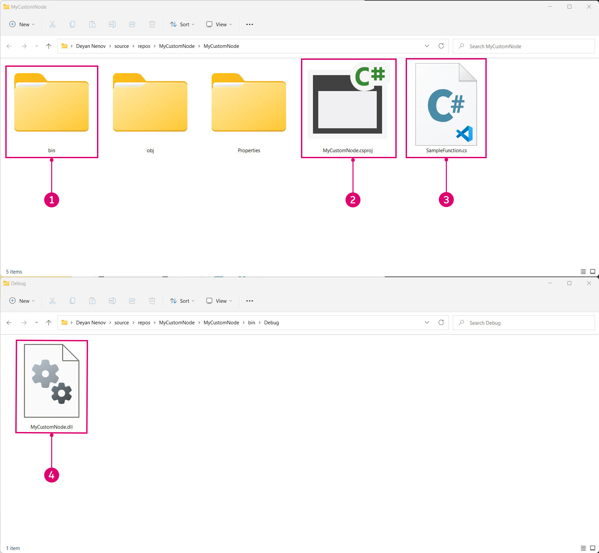

# Začínáme
 
Než se pustíte do vývoje, je důležité vybudovat pevné základy nového projektu. V komunitě vývojářů aplikace Dynamo existuje několik šablon projektů, které jsou vynikajícím východiskem pro zahájení práce, ale ještě cennější je porozumět tomu, jak začít projekt od začátku. Vytvoření projektu od základů umožní hlubší pochopení procesu vývoje.


#### Vytvoření projektu aplikace Visual Studio <a href="#creating-a-visual-studio-project" id="creating-a-visual-studio-project"></a>

Visual Studio je výkonné integrované vývojové prostředí, ve kterém můžeme vytvořit projekt, přidat odkazy, vytvořit knihovny `.dlls` a provádět ladění. Při tvorbě nového projektu vytvoří aplikace Visual Studio také tzv. řešení, což je struktura pro uspořádání projektů. V rámci jednoho řešení může existovat více projektů, které lze vytvářet společně. Chcete-li vytvořit uzel ZeroTouch, bude nutné vytvořit nový projekt aplikace Visual Studio, do kterého zapíšeme knihovnu tříd C# a vytvoříme knihovnu `.dll`.


> Okno Nový projekt v aplikaci Visual Studio
>
> 1. Začněte otevřením aplikace Visual Studio a vytvořením nového projektu: `File > New > Project`.
> 2. Vyberte šablonu projektu `Class Library`.
> 3. Pojmenujte projekt (v tomto příkladu je název projektu MyCustomNode).
> 4. Nastavte cestu k souboru projektu. V tomto příkladu jej necháme ve výchozím umístění.
> 5. Klikněte na tlačítko `Ok`.

Aplikace Visual Studio automaticky vytvoří a otevře soubor v jazyce C#. Měli bychom mu dát vhodný název, nastavit pracovní prostor a nahradit výchozí kód touto metodou násobení.

```
 namespace MyCustomNode
 {
     public class SampleFunctions
     {
         public static double MultiplyByTwo(double inputNumber)
         {
             return inputNumber * 2.0;
         }
     }
 }
```


> 1. Z nabídky `View` otevřete okna Průzkumník řešení a Výstup.
> 2. V Průzkumníku řešení na pravé straně přejmenujte soubor `Class1.cs` na `SampleFunctions.cs`.
> 3. Přidejte výše uvedený kód pro funkci násobení. Způsob, jak aplikace Dynamo přečte vaše třídy C#, probereme později.
> 4. Průzkumník řešení: Poskytuje přístup ke všem položkám v projektu.
> 5. Okno Výstup: Později jej budeme potřebovat, abychom zjistili, zda bylo sestavení úspěšné.

Dalším krokem je sestavení projektu, ale před provedením tohoto kroku je třeba zkontrolovat několik nastavení. Nejprve se ujistěte, že jako cílová platforma je vybrána možnost `Any CPU` nebo `x64` a že ve vlastnostech projektu není zaškrtnuto políčko `Prefer 32-bit`.


> 1. Otevřete vlastnosti projektu výběrem `Project > "ProjectName" Properties`.
> 2. Vyberte stránku `Build`.
> 3. V rozevírací nabídce vyberte možnost `Any CPU` nebo `x64`.
> 4. Ujistěte se, že není zaškrtnuto políčko `Prefer 32-bit`.

Nyní můžeme sestavit projekt, který vytvoří knihovnu `.dll`. To provedete buď výběrem položky `Build Solution` v nabídce `Build` nebo pomocí klávesové zkratky `CTRL+SHIFT+B`.


> 1. Vyberte `Build > Build Solution`.
> 2. Úspěšné sestavení projektu můžete ověřit v okně Výstup.

Pokud byl projekt úspěšně vytvořen, bude ve složce projektu `bin` uvedena knihovna `.dll` s názvem `MyCustomNode`. V tomto příkladu jsme pro cestu k souborům projektu ponechali výchozí nastavení aplikace Visual Studio, tj. `c:\users\username\documents\visual studio 2015\Projects`. Podívejme se na strukturu souborů projektu.



> 1. Složka `bin` obsahuje knihovnu `.dll` vytvořenou z aplikace Visual Studio.
> 2. Soubor projektu aplikace Visual Studio.
> 3. Soubor třídy.
> 4. Protože byla konfigurace řešení nastavena na `Debug`, bude knihovna `.dll` vytvořena ve složce `bin\Debug`.

Nyní můžeme otevřít aplikaci Dynamo a importovat knihovnu `.dll`. Pomocí funkce Přidat přejděte do umístění projektu `bin` a vyberte knihovnu `.dll`, kterou chcete otevřít.


> 1. Klikněte na tlačítko Přidat, abyste mohli importovat knihovnu `.dll`.
> 2. Přejděte do umístění projektu. Projekt se nachází ve výchozí cestě k souborům aplikace Visual Studio: `C:\Users\username\Documents\Visual Studio 2015\Projects\MyCustomNode`
> 3. Vyberte soubor `MyCustomNode.dll`, který chcete importovat.
> 4. Kliknutím na tlačítko `Open` načtěte soubor `.dll`.

Pokud je v knihovně vytvořena kategorie s názvem `MyCustomNode`, byla knihovna .dll úspěšně importována! Aplikace Dynamo však vytvořila dva uzly, přičemž my jsme chtěli mít pouze jeden uzel. V další části vysvětlíme, proč k tomu dochází a jak aplikace Dynamo načítá knihovnu .dll.


> 1. Kategorie MyCustomNode v knihovně aplikace Dynamo. Kategorie knihovny je určena názvem knihovny `.dll`.
> 2. Uzel SampleFunctions.MultiplyByTwo na kreslicí ploše.

#### Jak aplikace Dynamo čte třídy a metody <a href="#how-dynamo-reads-classes-and-methods" id="how-dynamo-reads-classes-and-methods"></a>

Když aplikace Dynamo načte knihovnu .dll, zobrazí všechny veřejné statické metody jako uzly. Konstruktory, metody a vlastnosti budou převedeny na uzly pro tvorbu, akci a dotazování. V našem příkladu násobení se metoda `MultiplyByTwo()` v aplikaci Dynamo stane uzlem akce. Je tomu tak proto, že uzel byl pojmenován na základě své metody a třídy.


> 1. Vstup je pojmenován `inputNumber` na základě názvu parametru metody.
> 2. Ve výchozím nastavení je výstup pojmenován `double`, protože se jedná o tento vrácený typ dat.
> 3. Uzel je pojmenován `SampleFunctions.MultiplyByTwo`, protože se jedná o názvy tříd a metod.

Ve výše uvedeném příkladu byl vytvořen uzel tvorby `SampleFunctions`, protože jsme explicitně neposkytli konstruktor, a proto byl vytvořen automaticky. Tomu se můžeme vyhnout vytvořením prázdného soukromého konstruktoru ve třídě `SampleFunctions`.

```
namespace MyCustomNode
{
    public class SampleFunctions
    {
        //The empty private constructor.
        //This will be not imported into Dynamo.
        private SampleFunctions() { }

        //The public multiplication method. 
        //This will be imported into Dynamo.
        public static double MultiplyByTwo(double inputNumber)
        {
            return inputNumber * 2.0;
        }
    }
}
```


> 1. Aplikace Dynamo naimportovala naši metodu jako uzel tvorby.

#### Přidání referencí na balíčky NuGet aplikace Dynamo<a href="#adding-dynamo-nuget-package-references" id="adding-dynamo-nuget-package-references"></a>

Uzel násobení je velmi jednoduchý a nejsou nutné žádné odkazy na aplikaci Dynamo. Pokud ale chceme získat přístup k některé z funkcí aplikace Dynamo, například k vytváření geometrie, bude nutné odkazovat na balíčky NuGet aplikace Dynamo.

* [ZeroTouchLibrary](https://www.nuget.org/packages/DynamoVisualProgramming.ZeroTouchLibrary/2.0.0-beta3026) – Balíček pro vytváření knihoven uzlů Zero Touch pro aplikaci Dynamo, který obsahuje následující knihovny: DynamoUnits.dll a ProtoGeometry.dll.
* [WpfUILibrary](https://www.nuget.org/packages/DynamoVisualProgramming.WpfUILibrary/2.0.0-beta3026) – Balíček pro vytváření knihoven uzlů pro aplikaci Dynamo s vlastním uživatelským rozhraním ve WPF, který obsahuje následující knihovny: DynamoCoreWpf.dll, CoreNodeModels.dll a CoreNodeModelWpf.dll.
* [DynamoServices](https://www.nuget.org/packages/DynamoVisualProgramming.WpfUILibrary/2.0.0-beta3026) – Knihovna DynamoServices pro aplikaci Dynamo.
* [Core](https://www.nuget.org/packages/DynamoVisualProgramming.Core/2.0.0-beta3026) – Infrastruktura pro testování jednotek a systémů pro aplikaci Dynamo, která obsahuje následující knihovny: DSIronPython.dll, DynamoApplications.dll, DynamoCore.dll, DynamoInstallDetective.dll, DynamoShapeManager.dll, DynamoUtilities.dll, ProtoCore.dll a VMDataBridge.dll.
* [Tests](https://www.nuget.org/packages/DynamoVisualProgramming.Tests/2.0.0-beta3026) – Infrastruktura pro testování jednotek a systémů aplikace Dynamo, která obsahuje následující knihovny: DynamoCoreTests.dll, SystemTestServices.dll a TestServices.dll.
* [DynamoCoreNodes](https://www.nuget.org/packages/DynamoVisualProgramming.DynamoCoreNodes/2.0.0-beta3026) – Balíček pro vytváření hlavních uzlů pro aplikaci Dynamo, který obsahuje následující knihovny: Analysis.dll, GeometryColour.dll a DSCoreNodes.dll.

Chcete-li v projektu aplikace Visual Studio odkazovat na tyto balíčky, stáhněte si požadovaný balíček z webu NuGet pomocí výše uvedených odkazů a ručně odkazujte na knihovny .dll, nebo použijte Správce balíčků NuGet v aplikaci Visual Studio. Nejprve si ukážeme, jak je nainstalovat pomocí Správce balíčků NuGet v aplikaci Visual Studio.


> 1. Otevřete Správce balíčků NuGet výběrem možnosti `Tools > NuGet Package Manager > Manage NuGet Packages for Solution...`.

Toto je Správce balíčků NuGet. Toto okno ukazuje, jaké balíčky byly pro projekt nainstalovány, a umožňuje uživateli vyhledat další. Pokud je vydána nová verze balíčku DynamoServices, lze odtud balíčky aktualizovat nebo vrátit ke starší verzi.


> 1. Klikněte na tlačítko Procházet a vyhledáním položky DynamoVisualProgramming zobrazte balíčky aplikace Dynamo.
> 2. Balíčky aplikace Dynamo Výběrem některého z nich zobrazíte jeho aktuální verzi a popis toho, co je uvnitř.
> 3. Vyberte verzi balíčku, kterou potřebujete, a klikněte na tlačítko Instalovat. Tím se nainstaluje balíček pro konkrétní projekt, se kterým pracujete. Protože používáme nejnovější stabilní verzi aplikace Dynamo, verzi 1.3, vyberte odpovídající verzi balíčku.

Chcete-li ručně přidat balíček stažený z prohlížeče, otevřete Správce odkazů z Průzkumníku řešení a vyhledejte požadovaný balíček.


> 1. Klikněte pravým tlačítkem myši na položku `References` a vyberte příkaz `Add Reference`.
> 2. Klikněte na tlačítko `Browse` a přejděte do umístění balíčku.

Nyní, když je aplikace Visual Studio správně nakonfigurována a úspěšně jsme přidali knihovnu `.dll` do aplikace Dynamo, máme pevný základ pro další koncepty. Toto je pouze začátek, proto pokračujte dalším tématem, ve kterém se dozvíte více o tom, jak vytvořit vlastní uzel.
