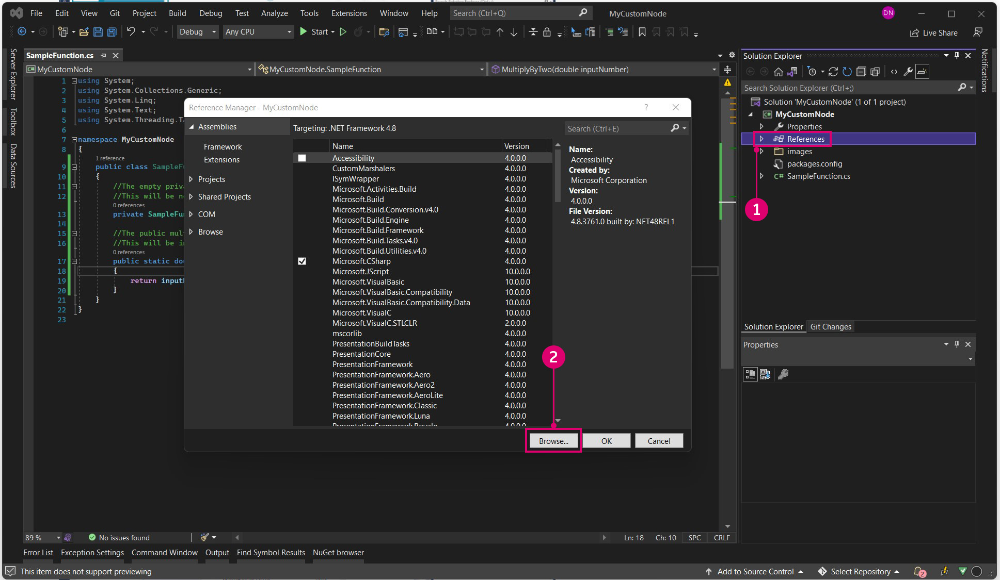

# Introducción

Antes de iniciar el proceso de desarrollo, es importante sentar unas bases sólidas para un nuevo proyecto. Hay varias plantillas de proyectos en la comunidad de desarrolladores de Dynamo que suponen excelentes puntos de partida, pero es más valioso conocer cómo iniciar un proyecto desde cero. Compilar un proyecto desde el principio nos permitirá comprender mejor el proceso de desarrollo.


#### Creación de un proyecto de Visual Studio <a href="#creating-a-visual-studio-project" id="creating-a-visual-studio-project"></a>

Visual Studio es un eficaz IDE en el que podemos crear un proyecto, añadir referencias, compilar archivos `.dlls` y depurar. Al crear un nuevo proyecto, Visual Studio también creará una solución, una estructura para organizar los proyectos. Pueden existir varios proyectos dentro de una misma solución y compilarse juntos. Para crear un nodo Zero-Touch, deberemos iniciar un nuevo proyecto de Visual Studio en el que escribiremos una biblioteca de clases de C# y compilaremos un archivo `.dll`.


> La ventana Nuevo proyecto en Visual Studio
>
> 1. Para empezar, abra Visual Studio y cree un nuevo proyecto mediante `File > New > Project`.
> 2. Elija la plantilla de proyecto `Class Library`.
> 3. Asigne un nombre al proyecto (en este caso, "MyCustomNode").
> 4. Establezca la ruta de archivo del proyecto. En este ejemplo, utilizaremos la ubicación por defecto.
> 5. Seleccione `Ok`.

Visual Studio creará y abrirá automáticamente un archivo de C#. Se recomienda asignarle un nombre adecuado, configurar el espacio de trabajo y reemplazar el código por defecto por este método de multiplicación.

```
 namespace MyCustomNode
 {
     public class SampleFunctions
     {
         public static double MultiplyByTwo(double inputNumber)
         {
             return inputNumber * 2.0;
         }
     }
 }
```


> 1. Abra el Explorador de soluciones y las ventanas de salida desde `View`.
> 2. Cambie el nombre del archivo `Class1.cs` a `SampleFunctions.cs` en el Explorador de soluciones ubicado a la derecha.
> 3. Añada el código anterior para la función de multiplicación. Más adelante, abordaremos cómo Dynamo leerá sus clases de C#.
> 4. El Explorador de soluciones: esta herramienta le proporciona acceso a todo lo que contiene el proyecto.
> 5. La ventana de salida: la necesitaremos más adelante para ver si la compilación se ha realizado correctamente.

El siguiente paso es compilar el proyecto, pero, antes de ello, hay que comprobar algunos parámetros. Asegúrese de que `Any CPU` o `x64` esté seleccionado como destino de la plataforma y de que `Prefer 32-bit` está desactivado en Propiedades del proyecto.


> 1. Seleccione `Project > "ProjectName" Properties` para abrir las propiedades del proyecto.
> 2. Seleccione la página `Build`.
> 3. Seleccione `Any CPU` o `x64` en el menú desplegable.
> 4. Asegúrese de que `Prefer 32-bit` está desactivado.

Ahora podemos compilar el proyecto para crear un archivo `.dll`. Para ello, seleccione `Build Solution` en el menú `Build` o utilice el método abreviado `CTRL+MAYÚS+B`.


> 1. Seleccione `Build > Build Solution`.
> 2. Puede comprobar la ventana de salida para determinar si el proyecto se ha compilado correctamente.

Si es así, habrá un archivo `.dll` denominado `MyCustomNode` en la carpeta `bin` del proyecto. Para este ejemplo, hemos dejado la ruta de archivo del proyecto como la ruta por defecto de Visual Studio en `c:\users\username\documents\visual studio 2015\Projects`. Veamos la estructura de archivos del proyecto.


> 1. La carpeta `bin` contiene el archivo `.dll` generado desde Visual Studio.
> 2. El archivo de proyecto de Visual Studio.
> 3. El archivo de clase.
> 4. Dado que la configuración de la solución se ha establecido en `Debug`, se creará el archivo `.dll` en `bin\Debug`.

Ahora podemos abrir Dynamo e importar el archivo `.dll`. Con la función Agregar, acceda a la ubicación del proyecto `bin` y seleccione el archivo `.dll` para abrirlo.


> 1. Seleccione el botón Agregar para importar un archivo `.dll`.
> 2. Acceda a la ubicación del proyecto. El proyecto se encuentra en la ruta de archivo por defecto de Visual Studio, `C:\Users\username\Documents\Visual Studio 2015\Projects\MyCustomNode`.
> 3. Seleccione el archivo `MyCustomNode.dll` que desea importar.
> 4. Haga clic en `Open` para cargar el archivo `.dll`.

Si se ha creado una categoría en la biblioteca denominada `MyCustomNode`, el archivo .dll se ha importado correctamente. Sin embargo, Dynamo ha creado dos nodos a partir de lo que deseábamos que fuera un único nodo. En la siguiente sección, explicaremos por qué sucede esto y cómo Dynamo lee un archivo .dll.


> 1. "MyCustomNode" en la biblioteca de Dynamo. La categoría Biblioteca viene determinada por el nombre del archivo `.dll`.
> 2. SampleFunctions.MultiplyByTwo en el lienzo.

#### Cómo lee Dynamo las clases y los métodos <a href="#how-dynamo-reads-classes-and-methods" id="how-dynamo-reads-classes-and-methods"></a>

Cuando Dynamo carga un archivo .dll, se muestran todos los métodos estáticos públicos como nodos. Los constructores, los métodos y las propiedades se convertirán en nodos de creación, acción y consulta respectivamente. En el ejemplo de multiplicación, el método `MultiplyByTwo()` se convierte en un nodo de acción en Dynamo. Esto se debe a que al nodo se le ha asignado un nombre en función de su método y clase.


> 1. La entrada se denomina `inputNumber` en función del nombre de parámetro del método.
> 2. La salida se denomina `double` por defecto, ya que es el tipo de datos que se devuelve.
> 3. El nodo se denomina `SampleFunctions.MultiplyByTwo` porque este nombre hace referencia a su clase y método.

En el ejemplo anterior, se ha creado el nodo de creación adicional `SampleFunctions` porque no hemos proporcionado explícitamente un constructor y, por lo tanto, se ha creado uno automáticamente. Para evitar esto, se puede crear un constructor privado vacío en la clase `SampleFunctions`.

```
namespace MyCustomNode
{
    public class SampleFunctions
    {
        //The empty private constructor.
        //This will be not imported into Dynamo.
        private SampleFunctions() { }

        //The public multiplication method. 
        //This will be imported into Dynamo.
        public static double MultiplyByTwo(double inputNumber)
        {
            return inputNumber * 2.0;
        }
    }
}
```


> 1. Dynamo ha importado el método como un nodo de creación.

#### Adición de referencias de paquetes NuGet de Dynamo <a href="#adding-dynamo-nuget-package-references" id="adding-dynamo-nuget-package-references"></a>

El nodo de multiplicación es muy sencillo y no se requieren referencias a Dynamo. Si deseamos acceder a cualquier funcionalidad de Dynamo para crear geometría, por ejemplo, deberemos hacer referencia a los paquetes NuGet de Dynamo.

* [ZeroTouchLibrary](https://www.nuget.org/packages/DynamoVisualProgramming.ZeroTouchLibrary/2.0.0-beta3026): paquete para crear bibliotecas de nodos Zero-Touch para Dynamo que contiene las siguientes bibliotecas: DynamoUnits.dll y ProtoGeometry.dll.
* [WpfUILibrary](https://www.nuget.org/packages/DynamoVisualProgramming.WpfUILibrary/2.0.0-beta3026): paquete para crear bibliotecas de nodos para Dynamo con la interfaz de usuario personalizada en WPF que contiene las siguientes bibliotecas: DynamoCoreWpf.dll, CoreNodeModels.dll y CoreNodeModelWpf.dll.
* [DynamoServices](https://www.nuget.org/packages/DynamoVisualProgramming.WpfUILibrary/2.0.0-beta3026): biblioteca DynamoServices para Dynamo.
* [Core](https://www.nuget.org/packages/DynamoVisualProgramming.Core/2.0.0-beta3026): infraestructura de pruebas de unidades y del sistema para Dynamo que contiene las siguientes bibliotecas: DSIronPython.dll, DynamoApplications.dll, DynamoCore.dll, DynamoInstallDetective.dll, DynamoShapeManager.dll, DynamoUtilities.dll, ProtoCore.dll y VMDataBridge.dll.
* [Tests](https://www.nuget.org/packages/DynamoVisualProgramming.Tests/2.0.0-beta3026): infraestructura de pruebas unitarias y del sistema para Dynamo que contiene las siguientes bibliotecas: DynamoCoreTests.dll, SystemTestServices.dll y TestServices.dll.
* [DynamoCoreNodes](https://www.nuget.org/packages/DynamoVisualProgramming.DynamoCoreNodes/2.0.0-beta3026): paquete para compilar nodos de Dynamo Core para Dynamo que contiene las siguientes bibliotecas: Analysis.dll, GeometryColor.dll y DSCoreNodes.dll.

Para hacer referencia a estos paquetes en un proyecto de Visual Studio, descargue el paquete NuGet en los vínculos anteriores y haga referencia manualmente a los archivos .dll o utilice el administrador de paquetes NuGet en Visual Studio. Podemos ver primero cómo instalarlos con NuGet en Visual Studio.


> 1. Abra el administrador de paquetes NuGet. Para ello, seleccione `Tools > NuGet Package Manager > Manage NuGet Packages for Solution...`.

Este es el administrador de paquetes NuGet. En esta ventana, se muestran los paquetes que se han instalado para el proyecto y permite al usuario buscar otros. Si se publica una nueva versión del paquete DynamoServices, los paquetes pueden actualizarse desde aquí o restablecerse a una versión anterior.


> 1. Seleccione Examinar y busque DynamoVisualProgramming para abrir los paquetes de Dynamo.
> 2. Los paquetes de Dynamo. Al seleccionar uno, se mostrará su versión actual y la descripción de su contenido.
> 3. Seleccione la versión del paquete que necesita y haga clic en Instalar. Esta acción instala un paquete para el proyecto específico en el que está trabajando. Dado que utilizamos la versión estable más reciente de Dynamo, la 1.3, elija la versión del paquete correspondiente.

Para añadir manualmente un paquete descargado desde el navegador, abra el Administrador de referencias desde el Explorador de soluciones y busque el paquete.



> 1. Haga clic con el botón derecho en `References` y seleccione `Add Reference`.
> 2. Seleccione `Browse` para acceder a la ubicación del paquete.

Ahora que Visual Studio se ha configurado correctamente y hemos añadido correctamente un archivo `.dll` a Dynamo, tenemos una base sólida para los conceptos que se van a abordar a continuación. Esto es solo el principio, así que siga leyendo para obtener más información sobre cómo crear un nodo personalizado.
