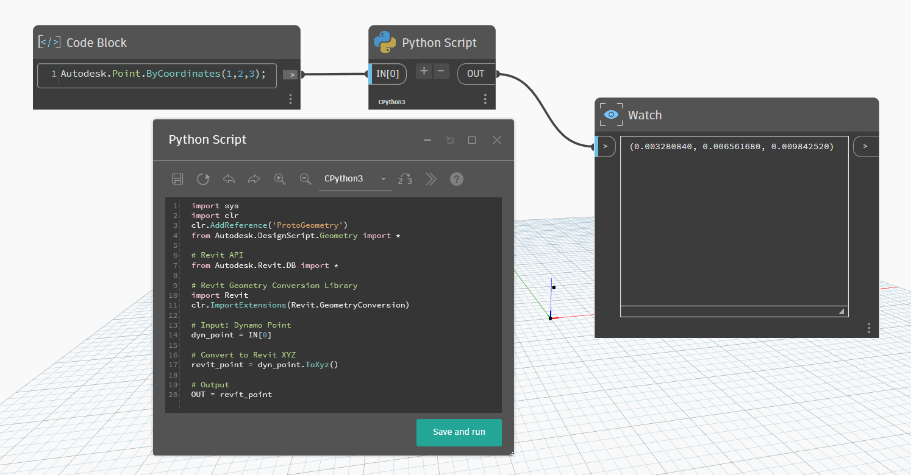
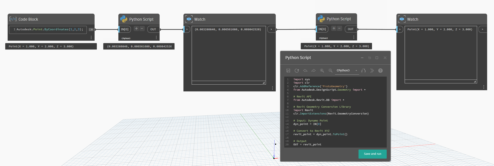
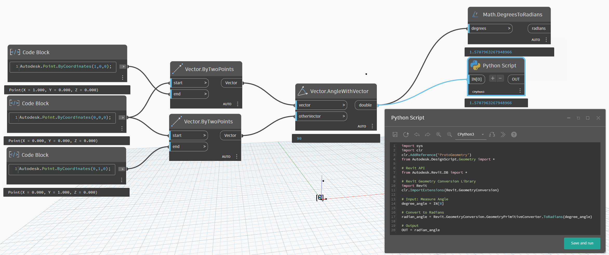
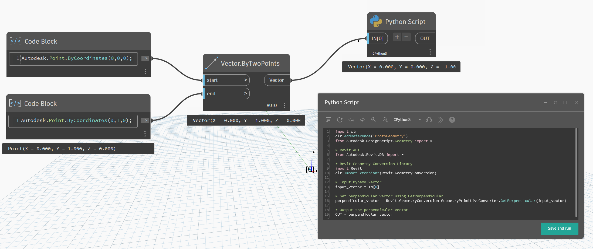

# Revit 用の Dynamo 向けの開発

## `GeometryPrimitiveConverter.cs` のメソッドを使用する

DynamoRevit コード ライブラリの [GeometryPrimitiveConverter](https://github.com/DynamoDS/DynamoRevit/blob/master/src/Libraries/RevitNodes/GeometryConversion/GeometryPrimitiveConverter.cs) クラスには、Revit ジオメトリ タイプと Dynamo ジオメトリ タイプの間で変換を実行するためのさまざまなメソッドが用意されています。これらのメソッドは、Revit モデルを操作する Dynamo スクリプトでジオメトリを操作する場合に便利です。

### メソッドのカテゴリ

`GeometryPrimitiveConverter.cs` メソッドは、次の 4 つの主要なカテゴリに分類できます。

1. **Proto to Revit タイプ**: Dynamo (Proto)タイプを Revit タイプに変換するメソッドです。
2. **Revit to Proto タイプ**: Revit タイプを Dynamo (Proto)タイプに変換するメソッドです。
3. **Degrees & Radians**: 度とラジアン間の変換を行うメソッドです。
4. **X & UZ**: 垂直ベクトルの取得を扱うメソッドです。 

### Proto to Revit タイプ

#### ToRevitBoundingBox

Dynamo 座標系と 2 つの定義点(最小と最大)から Revit BoundingBoxXYZ を作成します。

`public static Autodesk.Revit.DB.BoundingBoxXYZ ToRevitBoundingBox(
            Autodesk.DesignScript.Geometry.CoordinateSystem cs,
            Autodesk.DesignScript.Geometry.Point minPoint,
            Autodesk.DesignScript.Geometry.Point maxPoint, bool convertUnits = true)`

#### ToRevitType (BoundingBox)

Dynamo BoundingBox を Revit BoundingBoxXYZ に変換します。

convertUnits フラグ(既定は true)は、座標を Dynamo の単位系から Revit の内部単位系に変換するかどうかを決定します。

`public static Autodesk.Revit.DB.BoundingBoxXYZ ToRevitType(this Autodesk.DesignScript.Geometry.BoundingBox bb, bool convertUnits = true)`

#### ToRevitType (Point)

Dynamo ポイントを Revit XYZ に変換します。

convertUnits フラグ(既定値は true)は、必要に応じて座標を変換します。

`public static Autodesk.Revit.DB.XYZ ToRevitType(this Autodesk.DesignScript.Geometry.Point pt, bool convertUnits = true)`

#### ToRevitType (Vector)

Dynamo ベクトルを Revit XYZ に変換します。

convertUnits フラグの既定値は false です。ベクトルは方向と大きさを表しており、通常は単位変換が不要なためです。変換は、ベクトルの方向と長さに影響を与える可能性があります。 

`public static Autodesk.Revit.DB.XYZ ToRevitType(this Vector vec, bool convertUnits = false)`

#### ToXyz (Point)

Dynamo ポイントを Revit XYZ に変換します。

`public static Autodesk.Revit.DB.XYZ ToXyz(this Autodesk.DesignScript.Geometry.Point pt, bool convertUnits = true)`

#### ToXyz (Vector)

Dynamo ベクトルを Revit XYZ に変換します。

convertUnits フラグの既定値は false です。ベクトルは方向と大きさを表しており、通常は単位変換が不要なためです。変換は、ベクトルの方向と長さに影響を与える可能性があります。 

`public static Autodesk.Revit.DB.XYZ ToXyz(this Vector vec, bool convertUnits = false)`

#### ToTransform

Dynamo 座標系を Revit Transform に変換します。

`public static Autodesk.Revit.DB.Transform ToTransform(this CoordinateSystem cs, bool convertUnits = true)`

#### ToPlane

Dynamo 平面を Revit 平面に変換します。

`public static Autodesk.Revit.DB.Plane ToPlane(this Autodesk.DesignScript.Geometry.Plane plane, bool convertUnits = true)`

#### ToXyzs (Points)

Dynamo ポイント オブジェクトのコレクションを Revit XYZ コレクションに変換します。

XYZ のリストを返します。 `public static List<XYZ> ToXyzs(this List<Autodesk.DesignScript.Geometry.Point> list, bool convertUnits = true)`

XYZ の配列を返します。 `public static XYZ[] ToXyzs(this Autodesk.DesignScript.Geometry.Point[] list, bool convertUnits = true)`

#### ToXyzs (Vectors)

Dynamo ベクトル オブジェクトの配列を Revit XYZ ベクトルの配列に変換します。

`public static XYZ[] ToXyzs(this Autodesk.DesignScript.Geometry.Vector[] list, bool convertUnits = false)`

#### ToDoubleArray

倍精度値の配列を Revit の DoubleArray に変換します。

`public static DoubleArray ToDoubleArray(this double[] list)`

#### ToUvs

各内部配列が値のペア(U と V)を表す 2 次元配列(double[][])を、Revit UV オブジェクトの配列に変換します。

`internal static Autodesk.Revit.DB.UV[] ToUvs(this double[][] uvArr)`

#### ToDSUvs

各内部配列が値のペア(U と V)を表す 2 次元配列(double[][])を、Dynamo UV オブジェクトの配列に変換します。

`internal static Autodesk.DesignScript.Geometry.UV[] ToDSUvs(this double[][] uvArr)`

#### Proto To Revit タイプの使用例

この例では、ToXyz (Point)メソッドを使用して、Dynamo Point.ByCoordinates を Revit XYZ にすばやく簡単に変換する方法を示します。 



```
# Load the Python Standard and DesignScript Libraries
import sys
import clr
clr.AddReference('ProtoGeometry')
from Autodesk.DesignScript.Geometry import *

# Revit API
from Autodesk.Revit.DB import *

# Revit Geometry Conversion Library
import Revit
clr.ImportExtensions(Revit.GeometryConversion)

# Input: Dynamo Point
dyn_point = IN[0]

# Convert to Revit XYZ
revit_point = dyn_point.ToXyz()

# Output
OUT = revit_point

```


### Revit to Proto タイプ

#### ToProtoType (BoundingBox)

Revit BoundingBoxXYZ を Dynamo BoundingBox に変換します。

`public static Autodesk.DesignScript.Geometry.BoundingBox ToProtoType(this Autodesk.Revit.DB.BoundingBoxXYZ xyz, bool convertUnits = true)`

#### ToPoint (XYZ)

Revit XYZ を Dynamo ポイントに変換します。

`public static Autodesk.DesignScript.Geometry.Point ToPoint(this XYZ xyz, bool convertUnits = true)`

#### ToProtoType (Point)

Revit ポイントを Dynamo ポイントに変換します。

`public static Autodesk.DesignScript.Geometry.Point ToProtoType(this Autodesk.Revit.DB.Point point, bool convertUnits = true)`

#### ToVector (XYZ)

Revit XYZ を Dynamo ベクトルに変換します。

`public static Vector ToVector(this XYZ xyz, bool convertUnits = false)`

#### ToProtoType (UV)

Revit UV を Dynamo UV に変換します。

`public static Autodesk.DesignScript.Geometry.UV ToProtoType(this Autodesk.Revit.DB.UV uv)`

#### ToPlane (Revit Plane)

Revit 平面を Dynamo 平面に変換します。

`public static Autodesk.DesignScript.Geometry.Plane ToPlane(this Autodesk.Revit.DB.Plane plane, bool convertUnits = true)`

#### ToCoordinateSystem

Revit Transform を Dynamo 座標系に変換します。

`public static CoordinateSystem ToCoordinateSystem(this Transform t, bool convertUnits = true)`

#### ToPoints

Revit XYZ ポイントのリストを Dynamo ポイントのリストに変換します。

`public static List<Autodesk.DesignScript.Geometry.Point> ToPoints(this List<XYZ> list, bool convertUnits = true)`

#### Revit To Proto タイプの使用例

この例では、.ToPoint (XYZ)メソッドを使用して、Revit XYZ を Dynamo ポイントにすばやく簡単に変換する方法を示します。 



```
import sys
import clr
clr.AddReference('ProtoGeometry')
from Autodesk.DesignScript.Geometry import *

# Revit API
from Autodesk.Revit.DB import *

# Revit Geometry Conversion Library
import Revit
clr.ImportExtensions(Revit.GeometryConversion)

# Input: Dynamo Point
dyn_point = IN[0]

# Convert to Revit XYZ
revit_point = dyn_point.ToPoint()

# Output
OUT = revit_point
```

### Degrees & Radians

#### ToRadians

度単位をラジアン単位に変換します。

`public static double ToRadians(this double degrees)
{
    return degrees * Math.PI / 180.0;
}`

#### ToDegrees

ラジアン単位を度単位に変換します。

`public static double ToDegrees(this double degrees)
{
    return degrees * 180.0 / Math.PI;
}`

#### Degrees & Radians の使用例

この例では、.ToRadians メソッドを使用して、度単位をラジアン単位にすばやく簡単に変換する方法を示します。 



```
import sys
import clr
clr.AddReference('ProtoGeometry')
from Autodesk.DesignScript.Geometry import *

# Revit API
from Autodesk.Revit.DB import *

# Revit Geometry Conversion Library
import Revit
clr.ImportExtensions(Revit.GeometryConversion)

# Input: Measure Angle
degree_angle = IN[0]

# Convert to Radians
radian_angle = Revit.GeometryConversion.GeometryPrimitiveConverter.ToRadians(degree_angle)

# Output
OUT = radian_angle
```
### X & UZ

#### GetPerpendicular (XYZ)

このメソッドは、指定された `XYZ` ベクトルに垂直な`XYZ` ベクトルを返します。

` public static XYZ GetPerpendicular(this XYZ xyz)`

#### GetPerpendicular (Vector)

このメソッドは、指定されたDynamo `Vector` に垂直な Dynamo `Vector` を返します。

` public static Vector GetPerpendicular(this Vector vector)`

#### X & UZ の使用例

この例では、.GetPerpendicular メソッドを使用して、入力されたベクトルに対し垂直なベクトルをすばやく簡単に取得する方法を示します。 



```
import clr
clr.AddReference('ProtoGeometry')
from Autodesk.DesignScript.Geometry import *

# Revit API
from Autodesk.Revit.DB import *

# Revit Geometry Conversion Library
import Revit
clr.ImportExtensions(Revit.GeometryConversion)

# Input Dynamo Vector
input_vector = IN[0]

# Get perpendicular vector using GetPerpendicular
perpendicular_vector = Revit.GeometryConversion.GeometryPrimitiveConverter.GetPerpendicular(input_vector)

# Output the perpendicular vector
OUT = perpendicular_vector

```
