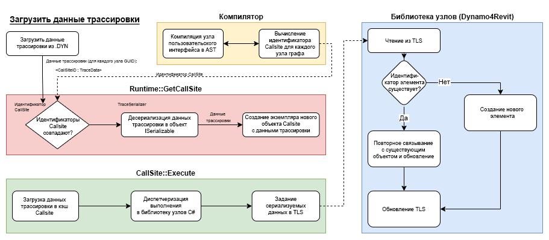

# Dynamo 集成

您已找到 Dynamo 可视化编程语言的集成文档。

本指南将讨论如何在应用程序中托管 Dynamo 的各个方面，以使用户能够使用可视化编程与应用程序交互。

内容：

* [本简介](13-dynamo-integration.md#dynamo-integration) 对本指南包含的内容以及 Dynamo 内容的高级概述。
* [Dynamo 自定义入口点](13-dynamo-integration.md#dynamo-custom-entry-point) 如何创建 DynamoModel 以及从何处开始。
* [元素绑定和追踪](13-dynamo-integration.md#-element-binding-and-trace) 使用 Dynamo 的追踪机制将图形中的节点绑定到其在主机中的结果。
* [Dynamo Revit 选择节点](13-dynamo-integration.md#-dynamo-revit-selection-nodes) 如何实现允许用户从主机中选择对象或数据并将其作为输入传递到 Dynamo 图表的节点。
* [Dynamo 内置软件包概述](13-dynamo-integration.md#dynamo-built-in-packages-overview) 什么是 Dynamo 标准库，以及如何使用基本机制随集成一起交付软件包。

**一些用语：**

我们将在这些文档中互换使用术语 Dynamo 脚本、图形和程序，来指代用户在 Dynamo 中创建的代码。

## Dynamo 自定义入口点

#### Dynamo Revit 作为示例

[https://github.com/DynamoDS/DynamoRevit/blob/master/src/DynamoRevit/DynamoRevit.cs#L534](https://github.com/DynamoDS/DynamoRevit/blob/master/src/DynamoRevit/DynamoRevit.cs#L534)

`DynamoModel` 是托管 Dynamo 的应用程序的入口点。它表示 Dynamo 应用程序。模型是顶级根对象，其中包含对构成 Dynamo 应用程序和 DesignScript 虚拟机的其他重要数据结构和对象的参照。

配置对象用于在构造 `DynamoModel` 时设置通用参数。

此文档中的示例摘自 DynamoRevit 实现，这是一种集成，其中 Revit 作为附加模块托管 `DynamoModel`。（Revit 的插件架构）。加载此附加模块后，它将启动 `DynamoModel`，然后通过 `DynamoView` 和 `DynamoViewModel` 向用户显示该附加模块。

Dynamo 是一个 c# .net 项目，要在应用程序中使用它，您需要能够托管和执行 .net 代码。

DynamoCore 是一个跨平台计算引擎和核心模型集合，可以使用 .net 或 mono（将来称为 .net 核心）构建。但 DynamoCoreWPF 包含仅限 Windows 的 Dynamo UI 组件，无法在其他平台上进行编译。

### 自定义 Dynamo 入口点的步骤

要初始化 `DynamoModel`，集成器需要从主机代码中的某个位置执行这些步骤。

### 从主机预加载共享的 Dynamo Dll。

目前，D4R 中的列表仅包含 `Revit\SDA\bin\ICSharpCode.AvalonEdit.dll.` 这样做是为了避免 Dynamo 和 Revit 之间存在库版本冲突。例如，当 `AvalonEdit` 发生冲突时，代码块的功能可能会完全中断。该问题在 Dynamo 1.1.x [https://github.com/DynamoDS/Dynamo/issues/7130 中报告](https://github.com/DynamoDS/Dynamo/issues/7130)并且还可以手动重现。如果集成器发现主机函数与 Dynamo 之间存在库冲突，建议首先执行此操作。有时需要这样做来阻止其他插件或主机应用程序本身加载不兼容的共享依存关系版本。更好的解决方案是通过匹配版本来解决版本冲突，或者在可能的情况下在主机的 app.config 中使用 .net 绑定重定向。

### 加载 ASM

#### 什么是 ASM 和 LibG

ASM 是 Dynamo 所基于的 ADSK 几何图形库。

LibG 是围绕 ASM 几何内核的 .Net 用户友好型包装器。libG 与 ASM 共享其版本控制方案 - 它使用 ASM 的相同主版本号和次版本号来指示它是特定 ASM 版本的相应包装器。给定 ASM 版本时，相应的 libG 版本应相同。在大多数情况下，LibG 应该适用于特定主版本的所有 ASM 版本。例如，LibG 223 应该能够加载任何 ASM 223 版本。

#### 加载 ASM 的 Dynamo 沙盒

Dynamo 沙盒设计为能够使用多个 ASM 版本，为此，多个 libG 版本捆绑在一起并随核心一起提供。Dynamo Shape Manager 中提供了搜索 ASM 随附的 Autodesk 产品功能的内置功能，因此 Dynamo 可以从这些产品加载 ASM，并使几何图形节点工作，而无需将其显式加载到主机应用程序中。目前存在的产品列表是：

```
private static readonly List<string> ProductsWithASM = new List<string>() 

 { "Revit", "Civil", "Robot Structural Analysis", "FormIt" }; 
```

Dynamo 将搜索 Windows 注册表，并查找此列表中的 Autodesk 产品是否安装在用户的计算机上，如果其中任何产品已安装，则它将搜索 ASM 二进制文件、获取版本并在 Dynamo 中查找相应的 libG 版本。

给定 ASM 版本，以下 ShapeManager API 将拾取相应的 libG 预加载器位置进行加载。如果存在完全匹配的版本，则将使用该版本，否则将加载下面版本最接近但主版本相同的 libG。

例如，如果 Dynamo 与 Revit 开发内部版本集成，其中有较新的 ASM 内部版本 225.3.0，则 Dynamo 将尝试使用 libG 225.3.0（如果存在），否则将尝试使用低于其首选的最接近的主版本，即 225.0.0。

`public static string GetLibGPreloaderLocation(Version asmVersion, string dynRootFolder)`

#### 从主机加载 ASM 的 Dynamo 进程内集成

Revit 是 ASM 产品搜索列表中的第一个条目，这意味着默认情况下，`DynamoSandbox.exe` 将首先尝试从 Revit 加载 ASM，我们仍要确保集成的 D4R 工作会话从当前 Revit 加载 ASM 主机：例如，如果计算机上用户同时具有 R2018 和 R2020，则从 R2020 启动 D4R 时，D4R 应使用 R2020 ASM 225，而不是使用 R2018 中的 ASM 223。集成器将需要实现对以下内容的类似调用，以强制加载其指定版本。

```
internal static Version PreloadAsmFromRevit() 

{ 

     var asmLocation = AppDomain.CurrentDomain.BaseDirectory; 
     Version libGVersion = findRevitASMVersion(asmLocation); 
     var dynCorePath = DynamoRevitApp.DynamoCorePath; 
     var preloaderLocation = DynamoShapeManager.Utilities.GetLibGPreloaderLocation(libGVersion, dynCorePath); 
     Version preLoadLibGVersion = PreloadLibGVersion(preloaderLocation); 
     DynamoShapeManager.Utilities.PreloadAsmFromPath(preloaderLocation, asmLocation); 
     return preLoadLibGVersion; 

} 
```

#### 从自定义路径加载 ASM 的 Dynamo

最近，我们添加了 `DynamoSandbox.exe` 和 `DynamoCLI.exe` 以加载特定 ASM 版本的功能。要跳过正常的注册表搜索行为，可以使用 `--GeometryPath` 标志强制 Dynamo 从特定路径加载 ASM。

`DynamoSandbox.exe --GeometryPath "somePath/To/ASMDirectory"`

### 创建 StartConfiguration

StartupConfiguration 用于将 DynamoModel 作为参数传入，这表示它包含您希望如何自定义 Dynamo 任务设置的几乎所有定义。根据设置以下特性的方式，Dynamo 集成可能会因不同的集成器而异。例如，不同的集成器可以设置不同的 Python 模板路径或显示的数字格式。

它包括以下内容：

* DynamoCorePath // 加载的 DynamoCore 二进制文件所在的位置
* DynamoHostPath // Dynamo 集成二进制文件的位置
* GeometryFactoryPath // 已加载的 libG 二进制文件所在的位置
* PathResolver // 帮助解析各种文件的对象
* PreloadLibraryPaths // 预加载节点二进制文件所在的位置，例如 DSOffice.dll
* AdditionalNodeDirectories // 其他节点二进制文件的位置
* AdditionalResolutionPaths // 加载库时可能需要的其他依赖项的其他程序集解决路径
* UserDataRootFolder // 用户数据文件夹，例如 `"AppData\Roaming\Dynamo\Dynamo Revit"`
* CommonDataRootFolder // 用于保存自定义定义、示例等的默认文件夹
* Context // 集成器主机名 + 版本 `(Revit<BuildNum>)`
* SchedulerThread // 实现 `ISchedulerThread` 的集成器调度程序线程 - 对于大多数集成商来说，这是主 UI 线程，或者他们可以从任何线程访问其 API。
* StartInTestMode // 当前会话是否为测试自动化会话 - 修改一系列 Dynamo 行为 - 除非您正在编写测试，否则请勿使用。
* AuthProvider // 集成器的 IAuthProvider 实现，例如 RevitOxygenProvider 实现处于 Greg.dll 中 - 用于 packageManager 上载集成。

### 首选项

默认首选项设置路径由 `PathManager.PreferenceFilePath` 管理，例如 `"AppData\\Roaming\\Dynamo\\Dynamo Revit\\2.5\\DynamoSettings.xml"`。集成器可以决定是否也要将自定义的首选项设置文件发送到需要与路径管理器匹配的位置。以下是序列化的首选项设置特性：

* IsFirstRun // 指示是否是首次运行此版本的 Dynamo，例如用于确定是否需要显示 GA 选择加入/退出消息。还用于确定在启动新 Dynamo 版本时是否需要移植旧版 Dynamo 首选项设置，以便用户获得一致的体验
* IsUsageReportingApproved // 指示是否批准使用情况报告
* IsAnalyticsReportingApproved // 指示分析报告是否获得批准
* LibraryWidth // Dynamo 左侧库面板的宽度。
* ConsoleHeight // 控制台显示器的高度
* ShowPreviewBubbles // 指示是否应显示预览气泡
* ShowConnector // 指示是否显示连接器
* ConnectorType // 指示连接器类型：Bezier 或多段线
* BackgroundPreviews // 指示指定背景预览的活动状态
* RenderPrecision // 渲染精度级别 - 越低，生成三角形越少的网格。越高，在背景预览中生成的几何图形越平滑。128 对于预览几何图形来说是一个很好的快速数字。
* ShowEdges // 指示是否渲染曲面边和实体边
* ShowDetailedLayout // 未使用
* WindowX，WindowY // Dynamo 窗口的最后一个 X、Y 坐标
* WindowW，WindowH // Dynamo 窗口的最后一个宽度、高度
* UseHardwareAcceleration // Dynamo 是否应该使用硬件加速（如果支持）
* NumberFormat // 用于在预览气泡 toString（） 中显示数字的小数精度。
* MaxNumRecentFiles // 要保存的最近文件路径的最大数量
* RecentFiles // 最近打开的文件路径的列表，接触此列表将直接影响 Dynamo 启动页面中的最近使用的文件列表
* BackupFiles // 备份文件路径列表
* CustomPackageFolders // 包含 Zero Touch 二进制文件和目录路径的文件夹列表，将对这些二进制文件和目录路径进行扫描以查找软件包和自定义节点。
* PackageDirectoriesToUninstall // 软件包管理器用于确定哪些软件包标记为要删除的软件包列表。如果可能，在 Dynamo 启动期间将删除这些路径。
* PythonTemplateFilePath // 创建新的 PythonScript 节点时要用作起始模板的 Python (.py) 文件的路径 - 可用于为集成设置自定义 Python 模板。
* BackupInterval // 表示图表将自动保存多长时间（以毫秒为单位）
* BackupFilesCount // 表示将进行多少次备份
* PackageDownloadTouAccepted // 指示用户是否已接受从软件包管理器下载软件包的使用条款
* OpenFileInManualExecutionMode // 指示 OpenFileDialog 中“在手动模式下打开”复选框的默认状态
* NamespacesToExcludeFromLibrary // 指示哪些（如果有）名称空间不应显示在 Dynamo 节点库中。字符串格式：“[库名称]:[完全限定名称空间]”

序列化首选项设置的示例：

```xml
<PreferenceSettings xmlns:xsd="http://www.w3.org/2001/XMLSchema" xmlns:xsi="http://www.w3.org/2001/XMLSchema-instance"> 

<IsFirstRun>false</IsFirstRun> 

<IsUsageReportingApproved>false</IsUsageReportingApproved> 

<IsAnalyticsReportingApproved>false</IsAnalyticsReportingApproved> 

<LibraryWidth>204</LibraryWidth> 

<ConsoleHeight>0</ConsoleHeight> 

<ShowPreviewBubbles>true</ShowPreviewBubbles> 

<ShowConnector>true</ShowConnector> 

<ConnectorType>BEZIER</ConnectorType> 

<BackgroundPreviews> 

<BackgroundPreviewActiveState> 

<Name>IsBackgroundPreviewActive</Name> 

<IsActive>true</IsActive> 

</BackgroundPreviewActiveState> 

<BackgroundPreviewActiveState> 

<Name>IsRevitBackgroundPreviewActive</Name> 

<IsActive>true</IsActive> 

</BackgroundPreviewActiveState> 

</BackgroundPreviews> 

<IsBackgroundGridVisible>true</IsBackgroundGridVisible> 

<RenderPrecision>128</RenderPrecision> 

<ShowEdges>false</ShowEdges> 

<ShowDetailedLayout>true</ShowDetailedLayout> 

<WindowX>553</WindowX> 

<WindowY>199</WindowY> 

<WindowW>800</WindowW> 

<WindowH>676</WindowH> 

<UseHardwareAcceleration>true</UseHardwareAcceleration> 

<NumberFormat>f3</NumberFormat> 

<MaxNumRecentFiles>10</MaxNumRecentFiles> 

<RecentFiles> 

<string></string> 

</RecentFiles> 

<BackupFiles> 

<string>..AppData\Roaming\Dynamo\Dynamo Revit\backup\backup.DYN</string> 

</BackupFiles> 

<CustomPackageFolders> 

<string>..AppData\Roaming\Dynamo\Dynamo Revit\2.5</string> 

</CustomPackageFolders> 

<PackageDirectoriesToUninstall /> 

<PythonTemplateFilePath /> 

<BackupInterval>60000</BackupInterval> 

<BackupFilesCount>1</BackupFilesCount> 

<PackageDownloadTouAccepted>true</PackageDownloadTouAccepted> 

<OpenFileInManualExecutionMode>false</OpenFileInManualExecutionMode> 

<NamespacesToExcludeFromLibrary> 

<string>ProtoGeometry.dll:Autodesk.DesignScript.Geometry.TSpline</string> 

</NamespacesToExcludeFromLibrary> 

</PreferenceSettings> 
```

* Extensions // 实现 IExtension 的扩展列表，如果为空，Dynamo 将从默认路径（Dynamo 文件夹下的 `extensions` 文件夹）加载扩展
* IsHeadless // 指示 Dynamo 是否在没有 UI 的情况下启动，会影响分析。
* UpdateManager // 集成器的 UpdateManager 实现，请参见上述描述
* ProcessMode // 等效于 TaskProcessMode，如果在测试模式下则同步，否则异步 - 这将控制调度程序的行为。单线程环境也可以将其设置为同步。

使用目标 StartConfiguration 启动 `DynamoModel`

将 StartConfig 传递到启动 `DynamoModel` 后，DynamoCore 会监督实际细节，以确保使用指定的详细信息正确初始化 Dynamo 会话。初始化 `DynamoModel` 后，各个集成器需要执行一些设置后步骤，例如，在 D4R 中，订阅事件以监视 Revit 主机事务或文档更新、Python 节点自定义等。

### 让我们进入“可视化编程”部分

要初始化 `DynamoViewModel` 和 `DynamoView`，您需要先构造一个 `DynamoViewModel` - 这可以使用 `DynamoViewModel.Start` 静态方法完成。请参见下文：

```c#

    viewModel = DynamoViewModel.Start(
                    new DynamoViewModel.StartConfiguration()
                    {
                        CommandFilePath = commandFilePath,
                        DynamoModel = model,
                        Watch3DViewModel = 
                            HelixWatch3DViewModel.TryCreateHelixWatch3DViewModel(
                                null,
                                new Watch3DViewModelStartupParams(model), 
                                model.Logger),
                        ShowLogin = true
                    });
     
     var view = new DynamoView(viewModel);

```

`DynamoViewModel.StartConfiguration` 的选项比模型的配置少得多。它们大多是不言自明的 - 除非您编写测试用例，否则可以忽略 `CommandFilePath`。

`Watch3DViewModel` 参数控制背景预览和 watch3d 节点如何显示三维几何图形。如果实现所需的接口，可以使用自己的实现。

要构建 `DynamoView`，所需要的只是 `DynamoViewModel`。视图是一个窗口控件，可以使用 WPF 进行显示。

### DynamoSandbox.exe 示例：

DynamoSandbox.exe 是一个用于测试、使用和试验 DynamoCore 的开发环境。这是一个很好的检出示例，可以查看 `DynamoCore` 和 `DynamoCoreWPF` 组件是如何加载和设置的。您可以在[此处](https://github.com/DynamoDS/Dynamo/blob/master/src/DynamoSandbox/DynamoCoreSetup.cs#L37)看到一些入口点。

## 图元绑定和跟踪

#### 概述

_跟踪_是 DynamoCore 中的一种机制，支持将数据序列化到 .dyn（Dynamo 文件）。至关重要的是，此数据对 Dynamo 图形中节点的调用站点具有键控。

从磁盘打开 Dynamo 图形时，其中保存的跟踪数据会与图形的节点重新关联。

#### 词汇表：

* 跟踪机制：
  * 在 Dynamo 中实施元素绑定
  * 跟踪机制可用于确保对象反弹到其创建的几何图形
  * 调用站点和跟踪机制句柄提供节点实现器可用于重新链接的持久 GUID
* 调用站点
  * 可执行文件包含多个调用站点。这些调用站点用于将执行分派到需要从中分派执行的各个位置：
    * C# 库
    * 内置方法
    * DesignScript 函数
    * 自定义节点（DS 功能）
* TraceSerializer
  * 将 `ISerializable` 和 `[Serializable]` 标记的类序列化到跟踪中。
  * 将数据的序列化和反序列化处理到跟踪中。
  * TraceBinder 控制将反序列化数据绑定到运行时类型。（创建真实类的实例）

#### 它是什么样子的？

***

跟踪数据将序列化到 .dyn 文件内名为 Bindings 的特性内。这是 callsites-ids -> 数据的阵列。调用站点是在 Designscript 虚拟机中调用节点的特定位置/实例。值得一提的是，Dynamo 图形中的节点可能会被多次调用，因此可能会为单个节点实例创建多个调用站点。

```json
"Bindings": [
    {
      "NodeId": "1e83cc25-7de6-4a7c-a702-600b79aa194d",
      "Binding": {
        "WrapperObject_InClassDecl-1_InFunctionScope-1_Instance0_1e83cc25-7de6-4a7c-a702-600b79aa194d":  "Base64 Encoded Data"
      }
    },
    {
      "NodeId": "c69c7bec-d54b-4ead-aea8-a3f45bea9ab2",
      "Binding": {
        "WrapperObject_InClassDecl-1_InFunctionScope-1_Instance0_c69c7bec-d54b-4ead-aea8-a3f45bea9ab2": "Base64 Encoded Data"
      }
    }
  ],

 
```

_不_ 建议依赖序列化 base64 编码数据的格式。

#### 我们试图解决什么问题。

***

人们希望在函数执行时保存任意数据的原因有很多，但在这种情况下，开发“跟踪”是为了解决用户在构建和迭代在主机应用程序中创建元素的软件程序时经常遇到的特定问题。

我们称之为 `Element Binding` 的问题，其想法是这样的：

用户开发和运行 Dynamo 图形时，可能会在主机应用程序模型中生成新图元。例如，假设用户有一个小程序，可以在建筑模型中生成 100 扇门。这些门的数量和位置由其程序控制。

用户第一次运行该程序时，它会生成这 100 扇门。

稍后，当用户修改其程序的输入并重新执行它时 - 他们的程序将 _（无元素绑定）_ 创建 100 扇新门，旧门和新门仍将存在于模型中。

***

由于 Dynamo 是一个实时编程环境，并且具有 `"Automatic"` 运行模式，在该模式中，对图形的更改会触发新的执行，因此这会使许多程序运行的结果很快使模型混乱。

我们发现这通常不是用户所期望的，相反，在启用元素绑定的情况下，图形执行的先前结果会被清理、删除或修改。哪一种（_删除或修改_）取决于主机 API 的灵活性。启用图元绑定后，在用户 Dynamo 程序的第 2 次、第 3 次或第 50 次运行后 - 模型中只有 100 扇门。

这需要的不仅仅是能够将数据序列化到 .dyn 文件 - 正如您将在下面看到的，DynamoRevit 中有一些基于跟踪构建的机制来支持这些重新绑定的工作流。

***

现在是时候提一下另一个重要的用例了，即像 Revit 这样的主机的图元绑定。由于启用图元绑定时创建的图元会尝试保留现有图元 ID（修改现有图元），因此在主机应用程序中基于这些图元构建的逻辑在 Dynamo 程序运行后将继续存在。例如：

让我们回到我们的建筑模型示例。

我们先运行一个禁用图元绑定的示例 - 这次用户有一个生成一些建筑墙的程序。

他们运行其程序，它会在主机应用程序中生成一些墙。然后，他们离开 Dynamo 图形，并使用常规 Revit 工具在这些墙中放置一些窗。这些窗作为 Revit 模型的一部分绑定到这些特定墙。

用户重新启动 Dynamo 并再次运行图形 - 现在，就像在上一个示例中一样，它们有两组墙。第一组中添加了窗户，但没有添加新墙。

如果已启用图元绑定，我们可以保留在没有 Dynamo 的情况下在主机应用程序中手动完成的现有工作。例如，如果在用户第二次运行其程序时启用了绑定，则墙将被修改，而不是删除，并且主机应用程序中所做的下游更改将保留。模型将包含带窗的墙 - 而不是处于不同状态的两组墙。

***


#### 图元绑定与跟踪的比较

***

跟踪是 Dynamo 核心中的一种机制 - 它利用数据的调用点静态变量将数据映射到图形中函数的调用点，如上所述。

它还允许您在写入 Zero Touch Dynamo 节点时将任意数据序列化到 .dyn 文件。通常不建议这样做，因为这意味着潜在可传输的 Zero Touch 代码现在依赖于 Dynamo 核心。

不要依赖 .dyn 文件中数据的序列化格式 - 而是使用 [Serializable] 属性和接口

另一方面，ElementBinding 基于跟踪 API 构建，并在 Dynamo 集成 _（Dynamo、Revit、Dynamo4Civil 等）_ 中实现

#### 跟踪 API

一些值得了解的低级别跟踪 API 包括：

```c#
public static ISerializable GetTraceData(string key)
///Returns the data that is bound to a particular key

public static void SetTraceData(string key, ISerializable value)
///Set the data bound to a particular key
```

您可以在下面的示例中看到使用了它们

要与 Dynamo 已从现有文件加载或正在生成的跟踪数据进行交互，您可以查看以下内容：

```c#
 public IDictionary<Guid, List<CallSite.RawTraceData>> 
 GetTraceDataForNodes(IEnumerable<Guid> nodeGuids, Executable executable)
```

[GetTraceDataForNodes](https://github.com/DynamoDS/Dynamo/blob/master/src/Engine/ProtoCore/RuntimeData.cs#L218)

[RuntimeTrace.cs](https://github.com/DynamoDS/Dynamo/blob/master/src/Engine/ProtoCore/RuntimeData.cs)

#### 来自节点的简单跟踪示例

***

此处的 [DynamoSamples 存储库](https://github.com/DynamoDS/DynamoSamples/blob/master/src/SampleLibraryZeroTouch/Examples/TraceExample.cs)中提供了直接使用跟踪的 Dynamo 节点示例

那里的课程总结解释了跟踪的要点：

```
  /*
     * After a graph update, Dynamo typically disposes of all
     * objects created during the graph update. But what if there are 
     * objects which are expensive to re-create, or which have other
     * associations in a host application? You wouldn't want those those objects
     * re-created on every graph update. For example, you might 
     * have an external database whose records contain data which needs
     * to be re-applied to an object when it is created in Dynamo.
     * In this example, we use a wrapper class, TraceExampleWrapper, to create 
     * TraceExampleItem objects which are stored in a static dictionary 
     * (they could be stored in a database as well). On subsequent graph updates, 
     * the objects will be retrieved from the data store using a trace id stored 
     * in the trace cache.
     */
```

此示例直接使用 DynamoCore 中的跟踪 API，以在特定节点执行时存储一些数据。在这种情况下，词典将扮演主机应用程序模型的角色 - 例如 Revit 的模型数据库。

粗略的设置是：

静态实用程序类 `TraceExampleWrapper` 将作为节点导入到 Dynamo 中。它包含一个方法 `ByString`，它将创建 `TraceExampleItem` - 这些是包含 `description` 特性的常规 .net 对象。

每个 `TraceExampleItem` 都序列化到表示为 `TraceableId` 的跟踪中 - 这只是一个包含标记为 `[Serializeable]` 的 `IntId` 类，因此可以使用 `SOAP` Formatter 对其进行序列化。有关可序列化属性的详细信息，请参见[此处](https://docs.microsoft.com/zh-cn/dotnet/api/system.serializableattribute?view=netframework-4.8)

您还必须实现[此处](https://docs.microsoft.com/zh-cn/dotnet/api/system.runtime.serialization.iserializable?view=netframework-4.8)定义的 `ISerializable` 接口

```c#
    [IsVisibleInDynamoLibrary(false)]
    [Serializable]
    public class TraceableId : ISerializable
    {
    }
```

此类是为我们希望保存到跟踪中的每个 `TraceExampleItem` 创建的，经过序列化、base64 编码并在保存图形时保存到磁盘，以便可以重新关联绑定，甚至以后在现有元素字典之上重新打开图形时也是如此。在此示例中，这行不通，因为字典不像 Revit 文档那样是持久的。

最后，等式的最后一部分是 `TraceableObjectManager`，它类似于 `DynamoRevit` 中的 `ElementBinder` - 它管理主机的文档模型中的对象与我们存储在 Dynamo 跟踪中的数据之间的关系。

当用户首次运行包含该 `TraceExampleWrapper.ByString` 节点的图形时，使用新 ID 创建新 `TraceableId` 时，`TraceExampleItem` 将存储在映射到该新 ID 的词典中，我们将 `TraceableID` 存储在跟踪中。

在图形的下一次运行中，我们在跟踪中查找，找到我们存储在那里的 ID，找到映射到该 ID 的对象，然后返回该对象！我们不是创建全新的对象，而是修改现有对象。

创建单个 `TraceExampleItem` 的两次连续图形执行的流程如下所示：


下一个示例使用一个更真实的 DynamoRevit 节点用例演示了相同的概念。

#### 跟踪示意图

 

#### 注意：

在最新版本的 Dynamo 中，TLS（线程本地存储）使用已替换为使用静态成员。

#### 元素绑定实现示例

***

让我们快速看一下使用 DynamoRevit 实施图元绑定的节点时是什么样子，这类似于上面给定墙创建示例中使用的节点类型。

***

```c#
    private void InitWall(Curve curve, Autodesk.Revit.DB.WallType wallType, Autodesk.Revit.DB.Level baseLevel, double height, double offset, bool flip, bool isStructural)
        {
            // This creates a new wall and deletes the old one
            TransactionManager.Instance.EnsureInTransaction(Document);

            //Phase 1 - Check to see if the object exists and should be rebound
            var wallElem =
                ElementBinder.GetElementFromTrace<Autodesk.Revit.DB.Wall>(Document);

            bool successfullyUsedExistingWall = false;
            //There was a modelcurve, try and set sketch plane
            // if you can't, rebuild 
            if (wallElem != null && wallElem.Location is Autodesk.Revit.DB.LocationCurve)
            {
                var wallLocation = wallElem.Location as Autodesk.Revit.DB.LocationCurve;
                <SNIP>

                    if(!CurveUtils.CurvesAreSimilar(wallLocation.Curve, curve))
                        wallLocation.Curve = curve;

                  <SNIP>
                
            }

            var wall = successfullyUsedExistingWall ? wallElem :
                     Autodesk.Revit.DB.Wall.Create(Document, curve, wallType.Id, baseLevel.Id, height, offset, flip, isStructural);
            InternalSetWall(wall);

            TransactionManager.Instance.TransactionTaskDone();

            // delete the element stored in trace and add this new one
            ElementBinder.CleanupAndSetElementForTrace(Document, InternalWall);
        }
```

上面的代码演示了墙图元的示例构造函数 - 此构造函数将从 Dynamo 中的节点调用，如下所示：`Wall.byParams`

构造函数执行的重要阶段与元素绑定相关：

1. 使用 `elementBinder` 检查在过去的运行中是否有任何以前创建的对象绑定到此调用站点。`ElementBinder.GetElementFromTrace<Autodesk.Revit.DB.Wall>`
2. 如果是这样，请尝试修改该墙，而不是创建新墙。

```c#
 if(!CurveUtils.CurvesAreSimilar(wallLocation.Curve, curve))
                        wallLocation.Curve = curve;
```

3. 否则，请创建一面新的墙。

```c#
  var wall = successfullyUsedExistingWall ? wallElem :
                     Autodesk.Revit.DB.Wall.Create(Document, curve, wallType.Id, baseLevel.Id, height, offset, flip, isStructural);
                     
```

4. 删除刚刚从跟踪中检索到的旧元素，然后添加新元素，以便将来可以查找此元素：

```c#
 ElementBinder.CleanupAndSetElementForTrace(Document, InternalWall);
```

### 讨论

#### 效率

* 目前，每个序列化跟踪对象都使用 SOAP xml 格式进行序列化 - 这非常冗长，并且重复了大量信息。然后，数据进行两次 base64 编码 - 这在序列化或反序列化方面效率不高。如果内部格式不是建立在这种基础上，将来可以改进这一点。我们再次重申，不要依赖静态序列化数据的格式。

#### ElementBinding 是否应该默认处于启用状态？

* 在某些情况下，不需要元素绑定。如果用户是高级 Dynamo 用户，正在开发一个应多次运行以生成随机分组图元的程序，该怎么办？程序的意图是在每次运行程序时创建其他元素。如果没有阻止元素绑定工作的解决方法，则此用例难以实现。可以在集成级别禁用 elementBinding - 但这应该是 Dynamo 的核心功能。目前尚不清楚此功能应该有多细粒度：节点级别、调用站点级别、整个 Dynamo 任务、工作空间等？

## Dynamo Revit 选择节点（它们是什么？）

通常，这些节点让用户以某种方式描述它们希望参照的活动 Revit 文档的子集。用户可以通过多种方式参照 Revit 图元（如下所述），节点的结果输出可能是 Revit 图元包装器（DynamoRevit 包装器）或某些 Dynamo 几何图形（转换自 Revit 几何图形）。这些输出类型之间的差异将有助于在其他主机集成的上下文中考虑。

在较高级别上，**将这些节点概念化的一个好方法是作为一个函数，它接受一个图元 ID，并返回指向该图元或表示该图元的某个几何图形的指针。**

DynamoRevit 中有多个 `Selection` 节点。我们可以将它们分为至少两组：


1.  用户 UI 拾取：

    例如，此类别中的 `DynamoRevit` 节点包括 `SelectModelElement`、`SelectElementFace`

    这些节点允许用户切换到 Revit UI 上下文，选择一个图元或图元集，捕获这些图元的 ID，并运行一些转换函数 - 创建包装器，或者提取并从图元转换几何图形。运行的转换取决于用户选择的节点类型。
2.  文档查询：

    此类别中的示例节点包括 `AllElementsOfClass`、`AllElementsOfCategory`

    这些节点允许用户在整个文档中查询图元子集。这些节点通常会返回指向基本 Revit 图元的包装器。这些包装器是 DynamoRevit 体验中不可或缺的一部分，可提供更高级的功能（如图元绑定），并允许 Dynamo 集成器拾取和选择将哪些主机 API 作为节点显示给用户。

### Dynamo Revit 用户工作流：

#### 示例用例

1.
   * 用户选择具有 `SelectModelElement` 的 Revit 墙 - Dynamo 墙包装器将返回到图表中（在节点预览气泡中可见）
   * 用户放置“Element.Geometry”节点并将 `SelectModelElement` 输出附加到此新节点。提取包裹墙的几何图形，并使用 libG API 转换为 Dynamo 几何图形。
   * 用户将图形切换到自动运行模式。
   * 用户修改 Revit 中的原始墙。
   * 当 Revit 文档引发事件，表示某些图元已更新时，将自动重新运行该图形。选择节点会监视此事件，并会看到它选择的图元的 ID 已修改。

### DynamoCivil 用户工作流：

D4C 中的工作流与上述针对 Revit 的描述非常相似，以下是 D4C 中两组典型的选择节点：


### 问题：

*   由于文档修改更新程序，`DynamoRevit` 中实现无限循环的选择节点很容易构建：想象一下，一个节点监视所有元素的文档，然后在此节点下游的某个位置创建新元素。该程序在执行时将触发循环。`DynamoRevit` 尝试使用事务 ID 以各种方式捕获这些情况，并避免在元素构造函数的输入未更改时修改文档。

    如果在主机应用程序中修改了选定图元时启动了图形的自动执行，则需要考虑这一点！
* `DynamoRevit` 中的选择节点在引用 WPF 的 `RevitUINodes.dll` 项目中实现。这可能不是问题，但值得注意，具体取决于您的目标平台。

### 数据流程图


### 技术实现（参考上图）：

选择节点通过继承常规 `SelectionBase` 类型来实现：`SelectionBase<TSelection, TResult>` 和构件的最小集：

* `BuildOutputAST` 方法的实现 - 此方法需要返回一个 AST，该 AST 将在未来的某个时间点执行该节点。对于 Selection 节点，它应从图元 ID 返回图元或几何图形。[https://github.com/DynamoDS/DynamoRevit/blob/master/src/Libraries/RevitNodesUI/Selection.cs#L280](https://github.com/DynamoDS/DynamoRevit/blob/master/src/Libraries/RevitNodesUI/Selection.cs#L280)
* 实现 `BuildOutputAST` 是实现 `NodeModel`/UI 节点时最困难的部分之一。最好将尽可能多的逻辑放入 C# 函数，并且直接将 AST 函数调用节点嵌入到 AST 中。请注意，这里 `node` 是抽象语法树中的 AST 节点，而不是 Dynamo 图中的节点。


* 序列化 -
  *   由于这些是显式 `NodeModel` 派生类型（而不是 ZeroTouch），因此它们还需要实现将在从 .dyn 文件反序列化节点期间使用的 [JsonConstructor]。

      主机中的图元参照应保存到 .dyn 文件，以便在用户打开包含此节点的图形时，仍会设置其选择。Dynamo 中的 NodeModel 节点使用 json.net 进行序列化，任何公有特性都将使用 Json.net 自动序列化 - 使用 [JsonIgnore] 属性仅序列化必要的内容。
* “文档查询”节点更简单一些，因为它们不需要存储对任何图元 ID 的参考。有关 `ElementQueryBase` 类和派生类实现，请参见下文。执行时，这些节点会调用 Revit API 并在基础文档中查询图元，然后执行前面提到的到几何图形或 Revit 图元包装器的转换。

### 参考：

#### DynamoCore 基类：

* [https://github.com/DynamoDS/Dynamo/blob/ec10f936824152e7dd7d6d019efdcda0d78a5264/src/Libraries/CoreNodeModels/Selection.cs](https://github.com/DynamoDS/Dynamo/blob/ec10f936824152e7dd7d6d019efdcda0d78a5264/src/Libraries/CoreNodeModels/Selection.cs)
* [NodeModel 案例研究 - 自定义 UI](11_developer_primer/3_developing_for_dynamo/5-nodemodel-case-study-custom-ui.md)
* [更新 Dynamo 2.x 的软件包和 Dynamo 库](11_developer_primer/3_developing_for_dynamo/6-updating-your-packages-and-dynamo-libraries-for-dynamo-2x.md)
* [更新 Dynamo 3.x 的软件包和 Dynamo 库](11_developer_primer/3_developing_for_dynamo/updating-your-packages-and-dynamo-libraries-for-dynamo-3x-Net8.md)

#### DynamoRevit：

* [https://github.com/DynamoDS/DynamoRevit/blob/master/src/Libraries/RevitNodesUI/Selection.cs](https://github.com/DynamoDS/DynamoRevit/blob/master/src/Libraries/RevitNodesUI/Selection.cs)
* [https://github.com/DynamoDS/DynamoRevit/blob/master/src/Libraries/RevitNodesUI/Elements.cs](https://github.com/DynamoDS/DynamoRevit/blob/master/src/Libraries/RevitNodesUI/Elements.cs)

## Dynamo 内置软件包概述

内置软件包机制旨在通过利用 `PackageLoader` 和 `PackageManager` 扩展实现的 Dynamo 软件包载入功能，将更多节点内容与 Dynamo Core 捆绑在一起，而无需扩展核心本身。

在本文档中，我们将互换使用术语“内置软件包”、“Dynamo 内置软件包”、“内置软件包”来表示相同的含义。

### 我应该将软件包作为内置软件包交付吗？

* 软件包必须具有带签名的二进制入口点，否则不会被加载。
* 应尽一切努力避免这些软件包中的破坏性更改。这意味着软件包内容应具有自动化测试。
* 语义版本控制，最好使用语义版本控制方案对软件包进行版本控制，并在软件包说明或文档中将其传达给用户。
* 自动化测试！请参阅上文，如果使用内置软件包机制包含一个软件包，则对于用户来说，它似乎是产品的一部分，应该像产品一样进行测试。
* 高级润色：图标、节点文档、本地化内容。
* 不要交付您或您的团队无法维护的软件包。
* 不要以这种方式交付第三方包裹（见上文）。

基本上，您应该能够完全控制软件包、能够修复软件包、使其保持更新，并能够针对 Dynamo 和产品中的最新更改对其进行测试。您还需要签名的能力。

### 内置软件包与主机集成特定软件包

我们希望 `Built-In Packages` 成为核心功能，即所有用户均可访问的软件包集，即使他们无权访问软件包管理器也是如此。当前，支持此功能的基本机制是直接在 Dynamo 核心目录中为软件包提供一个额外的默认加载位置（相对于 DynamoCore.dll）。

尽管存在一些约束，但此位置将可供 ADSK Dynamo 客户和集成商分发其特定于集成的软件包。_（例如，Dynamo Formit 集成需要自定义的 Dynamo Formit 软件包）。_

由于核心包和主机特定包的底层加载机制是相同的 - 有必要确保以这种方式分发的包不会导致用户对核心 `Built-In Packages` 包与仅在单个主机产品中可用的集成特定包之间的混淆。我们建议，为了避免用户混淆，在与 Dynamo 团队讨论时应引入特定于主机的软件包。

### 软件包本地化

由于 `Built-In Packages` 中包含的软件包将可供更多客户使用，并且我们对它们做出的保证将更加严格（见上文），因此应对其进行本地化。

对于用于 `Built-In Packages` 包含的内部 ADSK 软件包 - 当前无法将本地化内容发布到软件包管理器的限制不是阻碍因素，因为软件包不一定需要发布到软件包管理器。

使用解决方法，可以手动创建（甚至发布）软件包的 /bin 文件夹中具有 culture 子目录的软件包。

首先，在软件包的 `/bin` 文件夹下手动创建所需的特定于区域的子目录。

如果出于某些原因，还需要将软件包发布到软件包管理器，则必须先发布缺少这些区域性子目录的软件包版本 - 然后使用 DynamoUI `publish package version` 发布该软件包的新版本。Dynamo 中的新版本上载不应删除 `/bin` 下的文件夹和文件，这些文件夹和文件是使用 Windows 文件资源管理器手动添加的。Dynamo 中的软件包上载过程将更新，以处理将来对本地化文件的要求。

如果这些区域性子目录与节点/扩展二进制文件位于同一目录中，则 .net 运行时会加载这些区域性子目录，而不会出现任何问题。

有关资源程序集和 .resx 文件的详细信息，请参见：[https://docs.microsoft.com/zh-cn/dotnet/framework/resources/creating-resource-files-for-desktop-apps](https://docs.microsoft.com/zh-cn/dotnet/framework/resources/creating-resource-files-for-desktop-apps)。

您可能会创建 `.resx` 文件并使用 Visual Studio 对其进行编译。对于给定程序集 `xyz.dll` - 生成的资源将编译为新的程序集 `xyz.resources.dll` \- 如上所述，此程序集的位置和名称非常重要。

生成的 `xyz.resources.dll` 应位于如下位置：`package\bin\culture\xyz.resources.dll`。

要访问软件包中的本地化字符串，可以使用 ResourceManager，但更简单的方法是，您应该能够从已为其添加 `.resx` 文件的程序集中引用 `Properties.Resources.YourLocalizedResourceName`。例如，请参阅：

[https://github.com/DynamoDS/Dynamo/blob/master/src/Libraries/CoreNodes/List.cs#L457](https://github.com/DynamoDS/Dynamo/blob/master/src/Libraries/CoreNodes/List.cs#L457) 获取有关本地化错误消息的示例

或 [https://github.com/DynamoDS/Dynamo/blob/master/src/Libraries/CoreNodeModels/ColorRange.cs#L19](https://github.com/DynamoDS/Dynamo/blob/master/src/Libraries/CoreNodeModels/ColorRange.cs#L19) 获取特定于本地化的 Dynamo 的 NodeDescription Attribute 字符串的示例。

或 [https://github.com/DynamoDS/DynamoSamples/blob/master/src/SampleLibraryUI/Examples/LocalizedCustomNodeModel.cs](https://github.com/DynamoDS/DynamoSamples/blob/master/src/SampleLibraryUI/Examples/LocalizedCustomNodeModel.cs) 获取另一个示例。

### 节点库布局

通常，当 Dynamo 从软件包加载节点时，它会将节点放置在节点库中的 `Addons` 部分中。为了更好地将内置软件包节点与其他内置内容集成，我们添加了内置软件包作者提供部分 `layout specification` 文件以帮助将新节点放置到 `default` 库部分中正确的顶级类别的功能。

例如，以下布局规格 json 文件，如果在路径中找到 `package/extra/layoutspecs.json` 会将 `path` 指定的节点放置到 `default` 部分的 `Revit` 类别中，这是主要的内置节点部分。

请注意，如果考虑从内置软件包导入的节点与布局规范中包含的路径进行匹配，这些节点将具有前缀 `bltinpkg://`。

```json
{
  "sections": [
    {
      "text": "default",
      "iconUrl": "",
      "elementType": "section",
      "showHeader": false,
      "include": [ ],
      "childElements": [
        {
          "text": "Revit",
          "iconUrl": "",
          "elementType": "category",
          "include": [],
          "childElements": [
            {
              "text": "some sub group name",
              "iconUrl": "",
              "elementType": "group",
              "include": [
                {
                  "path": "bltinpkg://namespace.namespace",
                  "inclusive": false
                }
              ],
              "childElements": []
            }
          ]
        }
      ]
    }
  ]
}
```

复杂的布局修改没有得到很好的测试或支持，这种特定布局规范加载的目的是将整个软件包命名空间移动到特定的主机类别下，如 `Revit` 或 `Formit`。
