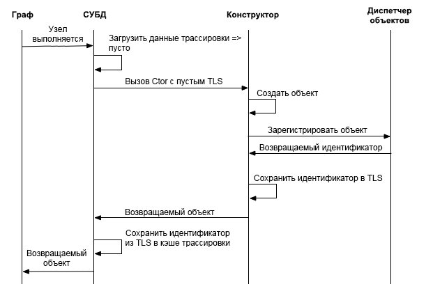
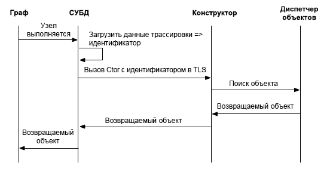
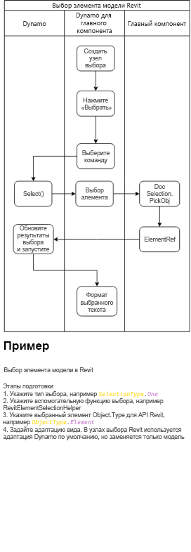

# Dynamo Integration

You have found the integration documentation for the Dynamo visual programming language.

This guide will discuss various aspects of how to host Dynamo in your application to enable your users to interact with your application using visual programming.

Contents:
* [This Intro](#dynamo-integration) High level overview of what this guide includes, and what Dynamo is all about.
* [Dynamo Custom Entry Point](#dynamo-custom-entry-point) How to create a DynamoModel and where to start.
* [Element Binding and Trace](#-element-binding-and-trace) Using Dynamo's trace mechanism to bind nodes in the graph to their results in your host.
* [Dynamo Revit Selection Nodes](#-dynamo-revit-selection-nodes) How to implement nodes that allow users to select objects or data from your host and pass them as inputs to the Dynamo graph. 
* [Dynamo Built-In Packages Overview](#dynamo-built-in-packages-overview) What is the Dynamo Standard Library, and how to use the underlying mechanism to ship packages with your integration.


##### Some diction:
We will use the terms dynamo script, graph, and program interchangeably in these documents to refer to the code users create in dynamo.

## Dynamo Custom Entry Point
#### Dynamo Revit as Example 

[https://github.com/DynamoDS/DynamoRevit/blob/master/src/DynamoRevit/DynamoRevit.cs#L534](https://github.com/DynamoDS/DynamoRevit/blob/master/src/DynamoRevit/DynamoRevit.cs#L534)

The `DynamoModel` is the entry point for an application hosting Dynamo – it represents a Dynamo Application. The model is the top level root object which contains references to the other important data structures and objects that make up the dynamo application and DesignScript virtual machine. 

A configuration object is used to set common parameters on the `DynamoModel` when it is constructed. 

The examples in this document are taken from the DynamoRevit implementation, which is an integration where Revit hosts a `DynamoModel` as an Add-in. (Plugin architecture for Revit). When this Add-in loads – it starts a `DynamoModel` and then displays it to the user with a `DynamoView` and `DynamoViewModel`. 

Dynamo is a c# .net project and to use it in process in your application you need to be able to host and execute .net code.

DynamoCore is a cross platform compute engine and collection of core models, which can be built with .net or mono (in the future .net core).
But DynamoCoreWPF contains the windows only UI components of Dynamo and will not compile on other platforms.

### Steps to Customize your Dynamo Entry Point 

To Initialize the `DynamoModel`, integrators will need to do these steps from somewhere in the host's code.

### Preload shared Dynamo Dlls from host.  

Currently the list in D4R only includes `Revit\SDA\bin\ICSharpCode.AvalonEdit.dll.` This is done to avoid library version conflicts between Dynamo and Revit. E.g. When conflicts on `AvalonEdit` happen, the function of code block can be totally broken. The issue is reported in Dynamo 1.1.x at https://github.com/DynamoDS/Dynamo/issues/7130 and, also manually reproducible. If integrators found library conflicts between host function and Dynamo, it is suggested to do this as a first step. This is sometimes required to stop other plugin or the host application itself from loading an incompatible version of as shared dependency. A better solution is to resolve the version conflict by aligning the version - or to use a .net binding redirect in the host’s app.config if possible. 
 

### Loading ASM 

#### What are ASM and LibG

ASM is the ADSK geometry library that Dynamo's is built on top of.

LibG is .Net user-friendly wrapper around ASM geometry kernel. libG shares its versioning scheme with ASM - it is using the same major and minor version number of ASM to indicate it is the corresponding wrapper of particular ASM version. When given an ASM version, the corresponding libG version should be the same. LibG in most cases should work with all versions of ASM of a particular major version. For example - LibG 223 - should be able to load any ASM 223 version.


#### Dynamo Sandbox loading ASM 

Dynamo Sandbox is designed to be able to work with multiple ASM versions, to accomplish this, multiple libG versions are bundled and shipped with the core. There is built-in functionality in Dynamo Shape Manager to search for Autodesk products which are shipped with ASM, so Dynamo can load ASM from these products and have geometry nodes work without explicitly being loaded into a host application. The products list as it exists today is: 
```
private static readonly List<string> ProductsWithASM = new List<string>() 

 { "Revit", "Civil", "Robot Structural Analysis", "FormIt" }; 
```
Dynamo will search the windows registry and find if the Autodesk products in this list are installed on the user’s machine, if any of these are installed, then it will search for ASM binaries, and will get the version and look for a corresponding libG version in Dynamo.  

Given the ASM version, the following ShapeManager API will pick the corresponding libG preloader location to load. If there is an exact version match it will be used, otherwise the closest versioned libG below, but with the same major version will be loaded.  

E.g. If Dynamo is integrated with a Revit dev build where there is a newer ASM build 225.3.0, Dynamo will try to use libG 225.3.0 if it exists, otherwise it will try to use the closest major version less than its first choice, ie 225.0.0. 

`public static string GetLibGPreloaderLocation(Version asmVersion, string dynRootFolder)` 

#### Dynamo in-process integration loading ASM from host 

Revit is  the first entry in the ASM product search list, which means by default `DynamoSandbox.exe` will try to load ASM from Revit first, we still want to make sure the integrated D4R working session loads ASM from the current Revit host: e.g. if user has both R2018 and R2020 on computer, when launching D4R from R2020, D4R should be using ASM 225 from R2020 instead of ASM 223 from R2018. Integrators will need to implement similar calls to the following to force their specified version to load. 

```
internal static Version PreloadAsmFromRevit() 

{ 

     var asmLocation = AppDomain.CurrentDomain.BaseDirectory; 
     Version libGVersion = findRevitASMVersion(asmLocation); 
     var dynCorePath = DynamoRevitApp.DynamoCorePath; 
     var preloaderLocation = DynamoShapeManager.Utilities.GetLibGPreloaderLocation(libGVersion, dynCorePath); 
     Version preLoadLibGVersion = PreloadLibGVersion(preloaderLocation); 
     DynamoShapeManager.Utilities.PreloadAsmFromPath(preloaderLocation, asmLocation); 
     return preLoadLibGVersion; 

} 
```

#### Dynamo loading ASM from a customized path 

Recently we have added the ability for `DynamoSandbox.exe` and `DynamoCLI.exe` to load a particular ASM version. To skip the normal registry search behavior, you can use the `–gp` flag to force Dynamo to load ASM from a particular path. 

`DynamoSandbox.exe -gp “somePath/To/ASMDirectory/” `

  


### Create A StartConfiguration 

The StartupConfiguration is used to pass in as a param for initializing DynamoModel which indicates that it contains almost all the definitions for how you would like to customize your Dynamo session settings. Depending on how the following properties are set, the Dynamo integration could vary between different integrators. E.g. different integrators could set different python template paths or number formats displayed. 

It consists of the following: 

* DynamoCorePath // Where the loading DynamoCore binaries are located

* DynamoHostPath // Where the Dynamo integration binaries are located

* GeometryFactoryPath // Where loaded libG binaries are located

* PathResolver //object that helps to resolve various files

* PreloadLibraryPaths // where are preloaded nodes binaries located, e.g. DSOffice.dll 

* AdditionalNodeDirectories // Where additional node binaries are located
 
* AdditionalResolutionPaths // Additional assembly resolution paths for other dependencies that might be required while loading libraries 

* UserDataRootFolder // User data folder, e.g. `"AppData\Roaming\Dynamo\Dynamo Revit"` 

* CommonDataRootFolder // Default folder for saving custom definitions, samples, etc.

* Context // Integrator host name + version `(Revit<BuildNum>)`

* SchedulerThread // Integrator scheduler thread implementing `ISchedulerThread` - for most integrators this is the Main UI thread or from whatever thread they can access their API.

* StartInTestMode // Whether the current session is a test automation session - modifies a bunch of Dynamo behavior - don't use unless you are writing tests.

* AuthProvider // Integrator’s implementation of IAuthProvider, e.g. RevitOxygenProvider implementation is in Greg.dll - Used for packageManager upload integration. 

### Preferences 

Default preference setting path is managed by `PathManager.PreferenceFilePath`, e.g. `"AppData\\Roaming\\Dynamo\\Dynamo Revit\\2.5\\DynamoSettings.xml"`. Integrators can decide if they would like to also ship a customized preference setting file to a location which needs to be aligned with path manager. The following are preference setting properties which are serialized: 

* IsFirstRun // Indicates if it is the first time running this version of dynamo, e.g. used to determine if need to display GA opt-in/out message. Also used to determine if it’s needed to migrate the legacy Dynamo preference setting when launching a new Dynamo version, so users have consistent experience 

* IsUsageReportingApproved // Indicates whether usage reporting is approved or not 

* IsAnalyticsReportingApproved // Indicates whether analytics reporting is approved or not 

* LibraryWidth // The width of the Dynamo left library panel. 

* ConsoleHeight // The height of the console display 

* ShowPreviewBubbles // Indicates if preview bubbles should be displayed 

* ShowConnector // Indicates if connectors are displayed 

* ConnectorType //Indicates the type of connector: Bezier or Polyline 

* BackgroundPreviews // Indicates active state of the specified background preview 

* RenderPrecision // The level of render precision - lower generates meshes with less triangles. Higher will generate smoother geometry in the background preview. 128 is a good fast number for preview geometry.

* ShowEdges // Indicates whether surface and solid edges will be rendered 

* ShowDetailedLayout // UNUSED

* WindowX, WindowY // Last X, Y coordinate of the Dynamo window 

* WindowW, WindowH // Last width, height of the Dynamo window 

* UseHardwareAcceleration // Should Dynamo use hardware acceleration if it is supported 

* NumberFormat // The decimal precision used to display numbers in preview bubble toString(). 

* MaxNumRecentFiles // The maximum number of recent file paths to be saved 

* RecentFiles // A list of recently opened file paths, touching this will directly affect the recent files list in Dynamo start up page 

* BackupFiles // A list of backup file paths 

* CustomPackageFolders // A list of folders containing zero-touch binaries and directory paths that will be scanned for packages and custom nodes.

* PackageDirectoriesToUninstall // A list of packages used by the Package Manager to determine which packages are marked for deletion. These paths will be deleted if possible during Dynamo startup.

* PythonTemplateFilePath // Path to the Python (.py) file to use as a starting template when creating a new PythonScript Node - this can be used to setup a custom python template for your integration.

* BackupInterval // Indicates how long (in milliseconds) will the graph be automatically saved 

* BackupFilesCount // Indicates how many backups will be made 

* PackageDownloadTouAccepted // Indicates if the user has accepted the terms of use for downloading packages from package manager 

* OpenFileInManualExecutionMode // Indicates the default state of the "Open in Manual Mode" checkbox in OpenFileDialog 

* NamespacesToExcludeFromLibrary // Indicates which (if any) namespaces should not be displayed in the Dynamo node library. String format: "[library name]:[fully qualified namespace]" 

An example of serialized preference settings: 

``` xml 
<PreferenceSettings xmlns:xsd="http://www.w3.org/2001/XMLSchema" xmlns:xsi="http://www.w3.org/2001/XMLSchema-instance"> 

<IsFirstRun>false</IsFirstRun> 

<IsUsageReportingApproved>false</IsUsageReportingApproved> 

<IsAnalyticsReportingApproved>false</IsAnalyticsReportingApproved> 

<LibraryWidth>204</LibraryWidth> 

<ConsoleHeight>0</ConsoleHeight> 

<ShowPreviewBubbles>true</ShowPreviewBubbles> 

<ShowConnector>true</ShowConnector> 

<ConnectorType>BEZIER</ConnectorType> 

<BackgroundPreviews> 

<BackgroundPreviewActiveState> 

<Name>IsBackgroundPreviewActive</Name> 

<IsActive>true</IsActive> 

</BackgroundPreviewActiveState> 

<BackgroundPreviewActiveState> 

<Name>IsRevitBackgroundPreviewActive</Name> 

<IsActive>true</IsActive> 

</BackgroundPreviewActiveState> 

</BackgroundPreviews> 

<IsBackgroundGridVisible>true</IsBackgroundGridVisible> 

<RenderPrecision>128</RenderPrecision> 

<ShowEdges>false</ShowEdges> 

<ShowDetailedLayout>true</ShowDetailedLayout> 

<WindowX>553</WindowX> 

<WindowY>199</WindowY> 

<WindowW>800</WindowW> 

<WindowH>676</WindowH> 

<UseHardwareAcceleration>true</UseHardwareAcceleration> 

<NumberFormat>f3</NumberFormat> 

<MaxNumRecentFiles>10</MaxNumRecentFiles> 

<RecentFiles> 

<string></string> 

</RecentFiles> 

<BackupFiles> 

<string>..AppData\Roaming\Dynamo\Dynamo Revit\backup\backup.DYN</string> 

</BackupFiles> 

<CustomPackageFolders> 

<string>..AppData\Roaming\Dynamo\Dynamo Revit\2.5</string> 

</CustomPackageFolders> 

<PackageDirectoriesToUninstall /> 

<PythonTemplateFilePath /> 

<BackupInterval>60000</BackupInterval> 

<BackupFilesCount>1</BackupFilesCount> 

<PackageDownloadTouAccepted>true</PackageDownloadTouAccepted> 

<OpenFileInManualExecutionMode>false</OpenFileInManualExecutionMode> 

<NamespacesToExcludeFromLibrary> 

<string>ProtoGeometry.dll:Autodesk.DesignScript.Geometry.TSpline</string> 

</NamespacesToExcludeFromLibrary> 

</PreferenceSettings> 
``` 
 

* Extensions // A list of extensions implementing IExtension, if it’s null, Dynamo will load extensions from the default path (`extensions` folder under Dynamo folder) 

* IsHeadless // Indicates if Dynamo is launched without UI, effects Analytics. 

* UpdateManager // Integrator’s implementation of UpdateManager, see description above 

* ProcessMode // Equivalent to TaskProcessMode, Synchronous if in test mode, otherwise Asynchronous - This controls the behavior of the scheduler. Single threaded environments may also set this to synchronous.

Use the target StartConfiguration to launch `DynamoModel`

Once the StartConfig is passed to launch `DynamoModel`, DynamoCore will oversee the actual specifics to make sure Dynamo session is initialized correctly with the details specified. There should be some after set-up steps individual integrators will need to do after `DynamoModel` is initialized, e.g. in D4R, events are subscribed to watch for Revit host transactions or document updates, Python Node customization, etc. 

 ### Let's get to the 'visual programming' part already

To Initialize `DynamoViewModel` and `DynamoView`, you'll need to first construct a `DynamoViewModel` - which can be done
using the `DynamoViewModel.Start` static method. See below:

``` c#

    viewModel = DynamoViewModel.Start(
                    new DynamoViewModel.StartConfiguration()
                    {
                        CommandFilePath = commandFilePath,
                        DynamoModel = model,
                        Watch3DViewModel = 
                            HelixWatch3DViewModel.TryCreateHelixWatch3DViewModel(
                                null,
                                new Watch3DViewModelStartupParams(model), 
                                model.Logger),
                        ShowLogin = true
                    });
     
     var view = new DynamoView(viewModel);

```

The `DynamoViewModel.StartConfiguration` has much fewer options than the Model's config. They are mostly self explanatory - the `CommandFilePath` can be ignored unless you are writing a test case.


The `Watch3DViewModel` parameter controls how the background preview and watch3d nodes display 3d geometry. You can use your own implementation if you implement the required interfaces.

To construct the `DynamoView`, all that is required is the `DynamoViewModel`. The View is a window control and can be shown using WPF.

 ### DynamoSandbox.exe example:

 DynamoSandbox.exe is a development environment for testing, using, and experimenting with DynamoCore. It's a great example to checkout to see how `DynamoCore` and `DynamoCoreWPF` components are loaded and setup.
`
 You can see some of the entry point [here](https://github.com/DynamoDS/Dynamo/blob/master/src/DynamoSandbox/DynamoCoreSetup.cs#L37)

 ## Element Binding and Trace

#### overview

*Trace* is a mechanism in Dynamo core, that is capable of serializing data into the .dyn (dynamo file). Crucially, this data is keyed to the call-sites of nodes within the dynamo graph.

When a Dynamo graph is opened from disk, the trace data saved therein is re-associated with the nodes of the graph.

#### glossary:
* Trace mechanism:
    
  * Implements Element Binding in Dynamo
  * The trace mechanism can be used to ensure that objects are rebound to geometry that they created
  * The Callsite and trace mechanism handle providing a persistent GUID that the node implementor can use for relinking

* Callsite

  * The executable contains multiple callsites. These callsites are used to dispatch execution to the various places where they need to be dispatched from:
    * C# library
    * Built-in method
    * DesignScript function
    * Custom node (DS function)

* TraceSerializer
  * Serializes `ISerializable` and `[Serializable]` marked classes into trace.
  * Handles serialization and deserialization of data into trace.
  * TraceBinder controls binding deserialized data to a runtime type. (creates instance of real class)

#### What does it look like?
----

Trace data is serialized into the .dyn file inside a property called Bindings. This is an array of callsites-ids -> data. A callsite is the particular location/instance where a node is called in the designscript virtual machine. It's worth mentioning that nodes in a dynamo graph may be called multiple times and thus multiple callsites might be created for a single node instance.

```json
"Bindings": [
    {
      "NodeId": "1e83cc25-7de6-4a7c-a702-600b79aa194d",
      "Binding": {
        "WrapperObject_InClassDecl-1_InFunctionScope-1_Instance0_1e83cc25-7de6-4a7c-a702-600b79aa194d":  "Base64 Encoded Data"
      }
    },
    {
      "NodeId": "c69c7bec-d54b-4ead-aea8-a3f45bea9ab2",
      "Binding": {
        "WrapperObject_InClassDecl-1_InFunctionScope-1_Instance0_c69c7bec-d54b-4ead-aea8-a3f45bea9ab2": "Base64 Encoded Data"
      }
    }
  ],

 
```

 it is *NOT* advisable to depend on the format of the serialized base64encoded data.


#### What problem are we trying to solve.
----


There are many reasons why one would want to save arbitrary data as a result of a function execution, but in this case trace was developed to solve a specific problem that users encounter frequently as they build and iterate on software programs that create elements in host applications.

The problem is one we have called `Element Binding` and the idea is this:

As a user develops and runs a Dynamo graph they will likely be generating new elements in the host application model. For our example
let's say the user has a small program that generates 100 doors in an architectural model. The number and location of these doors is controlled by their program.

The first time the user runs the program, it generates these 100 doors.

Later when the user modifies an input to their program, and re-executes it - their program will *(without element binding)* create 100 new doors, the old doors will still exist in the model along with the new ones.

----

Because Dynamo is a live programming environment and features an `"Automatic"` run mode where changes to the graph trigger a new execution this can quickly clutter a model with the results of many program runs.


We have found this is not usually what users expect, instead with element binding enabled the previous results of a graph execution are cleaned up and deleted or modified. Which one (*delete or modified*) depends on the flexibility of your host's API. With element binding enabled, after the second, third, or 50th run of the user's dynamo program - there are only 100 doors in the model.

This requires more than just being able to serialize data into the .dyn file - and as you will see below there are mechanisms in DynamoRevit built on top of trace to support these rebinding workflows.

----

This is an appropriate time to mention the other important use case of element binding for hosts like Revit. Because elements that were created when element binding was enabled will attempt to keep the existing element IDs (modify existing elements) - logic which was built on top of these elements in the host application will continue to exist after a dynamo program is run. For example:

Let's return to our architectural model example.

Let's run through an example first with element binding disabled - This time the user has a program that generates some architectural walls.

 They run their program, and it generates some walls in the host application. They then leave the dynamo graph, and use normal Revit tools to place some windows into those walls. The windows are bound to these specific walls as part of the Revit model.

The user starts Dynamo back up and runs the graph again - now, like in our last example, they have two sets of walls. The first set has the windows added to it, but the new walls do not.

If element binding had been enabled we can retain the existing work that was done manually in the host application without Dynamo. For example, if binding was enabled when the user ran their program the second time, the walls would be modified, not deleted, and the downstream changes made in the host application would persist. The model would contain walls with windows - instead of two sets of walls in various states.

-----


#### Element binding compared to trace
----

Trace is a mechanism in dynamo core - it utilizes a static variable of callsites to data to map your data to the callsite of a function in the graph, as described above.

It also allows you to serialize arbitrary data into the .dyn file when writing zero touch dynamo nodes. This is not generally advisable as it means the potentially transferable zero touch code now has a dependency on dynamo core.

Do not rely on the serialized format of the data in the .dyn file - instead use the [Serializable] attribute and interface

ElementBinding on the other hand is a built on top of the trace apis and is implemented in the dynamo integration *(DynamoRevit Dynamo4Civil etc.)*


#### Trace APIs
some of the low level Trace APIs worth knowing about are:

``` c#
public static ISerializable GetTraceData(string key)
///Returns the data that is bound to a particular key

public static void SetTraceData(string key, ISerializable value)
///Set the data bound to a particular key
```

you can see these used in the example below

to interact with the trace data that Dynamo has loaded from an existing file or is generating 
you can look at:

```c#
 public IDictionary<Guid, List<CallSite.RawTraceData>> 
 GetTraceDataForNodes(IEnumerable<Guid> nodeGuids, Executable executable)
```
[GetTraceDataForNodes](https://github.com/DynamoDS/Dynamo/blob/master/src/Engine/ProtoCore/RuntimeData.cs#L218)

[RuntimeTrace.cs](https://github.com/DynamoDS/Dynamo/blob/master/src/Engine/ProtoCore/RuntimeData.cs)


#### Simple Trace example from a node
----
An example of a Dynamo node which uses trace directly is provided here in the [DynamoSamples repo](https://github.com/DynamoDS/DynamoSamples/blob/master/src/SampleLibraryZeroTouch/Examples/TraceExample.cs)

The summary of the class there explains the gist of what trace is all about:

```
  /*
     * After a graph update, Dynamo typically disposes of all
     * objects created during the graph update. But what if there are 
     * objects which are expensive to re-create, or which have other
     * associations in a host application? You wouldn't want those those objects
     * re-created on every graph update. For example, you might 
     * have an external database whose records contain data which needs
     * to be re-applied to an object when it is created in Dynamo.
     * In this example, we use a wrapper class, TraceExampleWrapper, to create 
     * TraceExampleItem objects which are stored in a static dictionary 
     * (they could be stored in a database as well). On subsequent graph updates, 
     * the objects will be retrieved from the data store using a trace id stored 
     * in the trace cache.
     */
```

This example uses the trace apis in DynamoCore directly to store some data whenever a particular node executes. In this case a dictionary plays the part of the host application model - like Revit's model database.

The rough setup is:

A static util class `TraceExampleWrapper` is imported as a node into Dynamo. 
it contains a single method `ByString` which creates `TraceExampleItem` - These are regular .net objects which contain a `description` property.

Each `TraceExampleItem` is serialized into trace represented as a `TraceableId` - this is just a class containing an `IntId` which is marked `[Serializeable]` so it can be serialized with `SOAP` Formatter.
see [here for more info on the serializable attribute](https://docs.microsoft.com/en-us/dotnet/api/system.serializableattribute?view=netframework-4.8)

You must also implement the `ISerializable` interface defined [here](https://docs.microsoft.com/en-us/dotnet/api/system.runtime.serialization.iserializable?view=netframework-4.8)


``` c#
    [IsVisibleInDynamoLibrary(false)]
    [Serializable]
    public class TraceableId : ISerializable
    {
    }
```

This class is created for each `TraceExampleItem` we wish to save into trace, serialized, base64encoded and saved to disk when the graph is saved so that bindings can be re-associated, even later when the graph is opened back up on top of an existing dictionary of elements. That won't work well in the case of this example since the dictionary is not really persistent like a Revit document is.

Finally the last part of the equation is the `TraceableObjectManager`, which is similar to the `ElementBinder` in `DynamoRevit` - this manages the relationship between the objects present in the host's document model and the data we have stored in dynamo trace.

When a user runs a graph containing the `TraceExampleWrapper.ByString` node for the first time a new `TraceableId` is created with a new id, the `TraceExampleItem` is stored in the dictionary mapped to that new ID, and we store the `TraceableID` in trace.

On the next run of the graph - we look in trace, find the ID we stored there, find the object mapped to that ID, and return that object! Instead of creating a brand new object, we modify the existing one.

The flow of two consecutive executions of graph that creates a single `TraceExampleItem` looks like this:





The same idea is illustrated in the next example with a more realistic DynamoRevit node use case.

#### Trace Diagram


#### NOTE :
in recent versions of Dynamo TLS(thread local storage) use has been replaced with static member use.

#### Element binding implementation example

-----
Let's quickly take a look at what a node that is using element binding looks like when implemented for DynamoRevit, this is analogous to the type of node used above in the given wall creation examples.


---


``` c#
    private void InitWall(Curve curve, Autodesk.Revit.DB.WallType wallType, Autodesk.Revit.DB.Level baseLevel, double height, double offset, bool flip, bool isStructural)
        {
            // This creates a new wall and deletes the old one
            TransactionManager.Instance.EnsureInTransaction(Document);

            //Phase 1 - Check to see if the object exists and should be rebound
            var wallElem =
                ElementBinder.GetElementFromTrace<Autodesk.Revit.DB.Wall>(Document);

            bool successfullyUsedExistingWall = false;
            //There was a modelcurve, try and set sketch plane
            // if you can't, rebuild 
            if (wallElem != null && wallElem.Location is Autodesk.Revit.DB.LocationCurve)
            {
                var wallLocation = wallElem.Location as Autodesk.Revit.DB.LocationCurve;
                <SNIP>

                    if(!CurveUtils.CurvesAreSimilar(wallLocation.Curve, curve))
                        wallLocation.Curve = curve;

                  <SNIP>
                
            }

            var wall = successfullyUsedExistingWall ? wallElem :
                     Autodesk.Revit.DB.Wall.Create(Document, curve, wallType.Id, baseLevel.Id, height, offset, flip, isStructural);
            InternalSetWall(wall);

            TransactionManager.Instance.TransactionTaskDone();

            // delete the element stored in trace and add this new one
            ElementBinder.CleanupAndSetElementForTrace(Document, InternalWall);
        }
```

The above code illustrates a sample constructor for a wall element - this constructor would be called from a node in dynamo like:
`Wall.byParams`

The important phases of the constructor's execution as they relate to element binding are:

1. Use the `elementBinder` to check if there are any previously created objects which were bound to this callsite in a past run.
`ElementBinder.GetElementFromTrace<Autodesk.Revit.DB.Wall>`
2. If so ,then try to modify that wall instead of creating a new one.

```c#
 if(!CurveUtils.CurvesAreSimilar(wallLocation.Curve, curve))
                        wallLocation.Curve = curve;
```

3. Else create a new a wall.
```c#
  var wall = successfullyUsedExistingWall ? wallElem :
                     Autodesk.Revit.DB.Wall.Create(Document, curve, wallType.Id, baseLevel.Id, height, offset, flip, isStructural);
                     
```

4. Delete the old element we just retrieved from trace, and add our new one so we can look up this element in the future:
```c#
 ElementBinder.CleanupAndSetElementForTrace(Document, InternalWall);
```

### Discussion

#### Efficiency
* Currently each serialize trace object is serialized using SOAP xml formatting - this is quite verbose and duplicates a lot of information. Then the data is base64 encoded twice - This is not efficient in terms of serialization or deserialization. This can be improved in the future if the internal format is not built on top of. Again, we repeat, do not rely on the format of the serialized data at rest.

#### Should ElementBinding be on by default?
* There are use cases where element binding is not desired. What if one is an advanced dynamo user developing a program which should be run multiple times to generate random groupings elements. The programs intent is to create additional elements each time the program is run. This use case is not easily achievable without workarounds to stop element binding from working.
It's possible to disable elementBinding at the integration level - but likely this should be a core Dynamo functionality. It is not clear how granular this functionality should be: node level? callsite level?, Entire Dynamo session? Workspace? etc.

## Dynamo Revit Selection Nodes (what are they?) 

In general, these nodes let the user somehow describe a subset of the active Revit document they wish to reference. There are various ways the user might reference a Revit element (described below), and the resulting output of the node may be a Revit element wrapper (DynamoRevit wrapper) or some Dynamo geometry (Converted from Revit geometry). The difference between these output types will be useful to consider in the context of other host integrations.

At a high level, **a good way to conceptualize these nodes is as a function which accepts an element id – and returns a pointer to that element or some geometry which represents that element.** 

There are multiple `“Selection”` Nodes in DynamoRevit – We can break them into at least two groups: 


 

1. User UI pick: 

    Example `DynamoRevit` nodes in this category are `SelectModelElement`, `SelectElementFace`

    These nodes allow the user to switch into the Revit UI context and select an element or set of elements, the ids of these elements are captured, and some conversion function is run – either a wrapper is created or geometry is extracted and converted from the element. The conversion which runs depends on the type of node the user chooses. 

2. Document Query: 

    Example nodes in this category are `AllElementsOfClass`, `AllElementsOfCategory`

    These nodes allow the user to query the entire document for a subset of elements – these nodes usually return wrappers which point to the underlying Revit elements. These wrappers are integral to the DynamoRevit experience allowing more advanced functionality like element binding, and allowing Dynamo integrators to pick and choose what Host APIs are exposed as nodes to the users.


### Dynamo Revit User Workflows: 

#### Example Cases 

1. 
    * User selects a Revit wall with `SelectModelElement` - A Dynamo Wall wrapper is returned into the graph (visible in the node’s preview bubble) 

    * User places the Element.Geometry node and attaches the `SelectModelElement` output to this new node – the wrapped wall’s geometry is extracted and converted to Dynamo geometry using the libG API. 

    * The user switches the graph into Automatic run mode. 

    * The user modifies the original wall in Revit. 

    * The graph is re-run automatically as the Revit document raised an event signaling some elements were updated – the selection node watches this event and see that’s the id of the element it has selected has been modified. 

### DynamoCivil User Workflows: 

The workflows in D4C is very similar to the description above for Revit, here are two typical sets of selection nodes in D4C:  


### Issues: 

* Because of the document modification updater which selection nodes in `DynamoRevit` implement – infinite loops are easy to build:
Imagine a node watching the document for all elements, and then creating new elements somewhere downstream of this node. This program, when executed, will trigger a loop. `DynamoRevit` tries to catch these case in various ways using transaction ids, and to it avoids modifying the document when inputs to element constructors have not changed.

    This needs to be considered if Automatic execution of the graph is initiated when a selected element is modified in the host application! 

* Selection nodes in `DynamoRevit` are implemented in `RevitUINodes.dll` project which references WPF – This may be a non issue – but is worth being aware of depending on your target platform. 
 

### Data Flow Diagrams




### Technical Implementation: (refer to above diagrams): 

Selection nodes are implemented by inheriting from the generic `SelectionBase` types: `SelectionBase<TSelection, TResult> ` and a minimal set of members: 

* Implementation of a `BuildOutputAST` Method – this method needs to return an AST, which will be executed at some point in the future, when the node is to be executed. In the case of Selection nodes, it should return elements or geometry from the element ids. https://github.com/DynamoDS/DynamoRevit/blob/master/src/Libraries/RevitNodesUI/Selection.cs#L280 

* Implementing `BuildOutputAST` is one of the most difficult parts of implementing `NodeModel` / UI nodes.  It is best to put as much logic as you can into a c# function, and simply embed an AST function call node into the AST. Note that here `node` is an AST node in the abstract syntax tree – not a Node in the Dynamo graph. 


* Serialization -  

  * Because these are explicit `NodeModel` derived types (not ZeroTouch) they also require implementing a [JsonConstructor] that will be used during deserialization of the node from a .dyn file. 

    The element references from the host should be saved into the .dyn file so that when a user opens a graph containing this node, their selection is still set. NodeModel nodes in Dynamo use json.net to serialize, any public properties will be serialized automatically using Json.net - use the [JsonIgnore] attribute to only serialize what is necessary. 

* Document Query nodes are a bit simpler as they do not need to store a reference to any Element IDs – see below for the `ElementQueryBase` class and derived class implementations. When executed these nodes make a call to the Revit API and query the underlying document for elements, and perform the previously mentioned conversion to either geometry or Revit element wrappers. 

### References:

#### DynamoCore base classes: 

* [https://github.com/DynamoDS/Dynamo/blob/ec10f936824152e7dd7d6d019efdcda0d78a5264/src/Libraries/CoreNodeModels/Selection.cs](https://github.com/DynamoDS/Dynamo/blob/ec10f936824152e7dd7d6d019efdcda0d78a5264/src/Libraries/CoreNodeModels/Selection.cs )

* [NodeModel Case Study - Custom UI](11\_developer\_primer/3\_developing\_for\_dynamo/5-nodemodel-case-study-custom-ui.md)
* [Updating your Packages and Dynamo Libraries for Dynamo 2.x](11\_developer\_primer/3\_developing\_for\_dynamo/6-updating-your-packages-and-dynamo-libraries-for-dynamo-2x.md)
* [Updating your Packages and Dynamo Libraries for Dynamo 3.x](11\_developer\_primer/3\_developing\_for\_dynamo/updating-your-packages-and-dynamo-libraries-for-dynamo-3x-Net8.md)


#### DynamoRevit: 

* [https://github.com/DynamoDS/DynamoRevit/blob/master/src/Libraries/RevitNodesUI/Selection.cs](https://github.com/DynamoDS/DynamoRevit/blob/master/src/Libraries/RevitNodesUI/Selection.cs )

* [https://github.com/DynamoDS/DynamoRevit/blob/master/src/Libraries/RevitNodesUI/Elements.cs](https://github.com/DynamoDS/DynamoRevit/blob/master/src/Libraries/RevitNodesUI/Elements.cs)


## Dynamo Built-In Packages Overview

The Built-In Packages mechanism is an effort to bundle more node content with Dynamo Core without expanding the core itself by leveraging the dynamo package loading functionality implemented by the `PackageLoader` and `PackageManager` extension.

In this doc we'll interchangeably use the terms Built-In Packages, Dynamo Built-In Packages, builtin packages to mean the same thing.

### Should I ship a package as a Built-In Package?
* The package must have signed binary entry points or it will not be loaded.
* Every effort should be made to avoid breaking changes in these packages. This means the package content should have automated tests.
* Semantic versioning, it's probably a good idea to version your package using a semantic versioning scheme, and to communicate it to users in the package description or docs.
* Automated tests! Please see above, if a package is included using the Built-In Package mechanism, to a user it appears to be part of the product and should be tested like a product.
* High level of polish: icons, node docs, localized content.
* Don't ship packages that you or your team cannot maintain.
* Don't ship third party packages this way (see above).

Basically, you should have full control over the package, the ability to fix it, keep it updated, and to test it against the latest changes in Dynamo and your product. You also need the ability to sign it.


### Built-In Packages versus Host Integration Specific Packages

We are intending the `Built-In Packages` to be a core feature, a set of packages that all users gain access to, even if they do not have access to the package manager. Currently the underlying mechanism to support this feature is an additional default loading location for packages directly in the dynamo core directory - relative to DynamoCore.dll.

With some constraints this location will be useable for ADSK Dynamo clients and integrators to distribute their integration specific packages. *(for example, the Dynamo Formit integration requires a custom Dynamo Formit package).*

Because the underlying loading mechanism is the same for both core and host specific packages - it will be necessary to make sure that packages distributed this way do not lead to user confusion about core `Built-In Packages` packages vs. integration specific packages that are only available in a single host product. We advise that that to avoid user confusion host-specific packages should be introduced in discussion with the Dynamo teams.


### Package Localization

Because packages included in the `Built-In Packages` will be available to more customers and the guarantees we make about them will be stricter (see above) they should be localized.

For internal ADSK packages intended for `Built-In Packages` inclusion - the current limitations of not being able to publish localized content to the package manager are not blockers as the packages don't necessarily need to be published to the package manager.

Using a workaround it's possible to manually create (and even publish) packages with culture subdirectories in the /bin folder of a package.

First create the culture specific subdirectories you require under the packages `/bin` folder manually. 

If for some reason, the package needs to also be published to the package manager then you must first publish a version of the package that is missing these culture subdirectories - then publish a new version of the package using the DynamoUI `publish package version`. The new version upload in Dynamo should not delete your folders and files under`/bin`, which you have added manually using the windows file explorer. The package upload process in Dynamo will be updated to deal with the requirements for localized files in the future.

These culture subdirectories are loaded without issue by the .net runtime if they are located in the same directory as the node / extension binaries.

For more information on resource assemblies and .resx files please see: [https://docs.microsoft.com/en-us/dotnet/framework/resources/creating-resource-files-for-desktop-apps](https://docs.microsoft.com/en-us/dotnet/framework/resources/creating-resource-files-for-desktop-apps).

You'll likely be creating the `.resx` files and compiling them with visual studio. For a given assembly `xyz.dll` - the resulting resources will be compiled to a new assembly `xyz.resources.dll` - as is described above the location and name of this assembly are important.

The generated `xyz.resources.dll` should be located as follows:
`package\bin\culture\xyz.resources.dll`.

To access the localized strings in your package - you can use the ResourceManager - but even simpler you should be able to refer to the `Properties.Resources.YourLocalizedResourceName` from within the assembly you have added a `.resx` file for. For example, see: 

[https://github.com/DynamoDS/Dynamo/blob/master/src/Libraries/CoreNodes/List.cs#L457](https://github.com/DynamoDS/Dynamo/blob/master/src/Libraries/CoreNodes/List.cs#L457) for an example of a localized error message

or [https://github.com/DynamoDS/Dynamo/blob/master/src/Libraries/CoreNodeModels/ColorRange.cs#L19](https://github.com/DynamoDS/Dynamo/blob/master/src/Libraries/CoreNodeModels/ColorRange.cs#L19) for an example of a localized Dynamo specific NodeDescription Attribute string.

or [https://github.com/DynamoDS/DynamoSamples/blob/master/src/SampleLibraryUI/Examples/LocalizedCustomNodeModel.cs](https://github.com/DynamoDS/DynamoSamples/blob/master/src/SampleLibraryUI/Examples/LocalizedCustomNodeModel.cs) for another example.

### Node Library Layout

Normally, when Dynamo loads nodes from a package, it places them in the `Addons` section in the node library. To better integrate built-in package nodes with other built-in content, we've added the ability for built-in package authors to supply a partial `layout specification` file to help place the new nodes into the correct top level category in the `default` library section.

For example, the following layout spec json file, if found at the path `package/extra/layoutspecs.json` will place the nodes specified by `path` into the `Revit` category in the `default` section which is the main built-in nodes section.

note that nodes imported from a builtin package will have the prefix `bltinpkg://` when they are considered for matching against a path included in the layout spec.

```json
{
  "sections": [
    {
      "text": "default",
      "iconUrl": "",
      "elementType": "section",
      "showHeader": false,
      "include": [ ],
      "childElements": [
        {
          "text": "Revit",
          "iconUrl": "",
          "elementType": "category",
          "include": [],
          "childElements": [
            {
              "text": "some sub group name",
              "iconUrl": "",
              "elementType": "group",
              "include": [
                {
                  "path": "bltinpkg://namespace.namespace",
                  "inclusive": false
                }
              ],
              "childElements": []
            }
          ]
        }
      ]
    }
  ]
}
```

Complex layout modifications are not well tested or supported, the intention for this particular layout specification loading is to move an entire package namespace under a particular host category like `Revit` or `Formit`. 