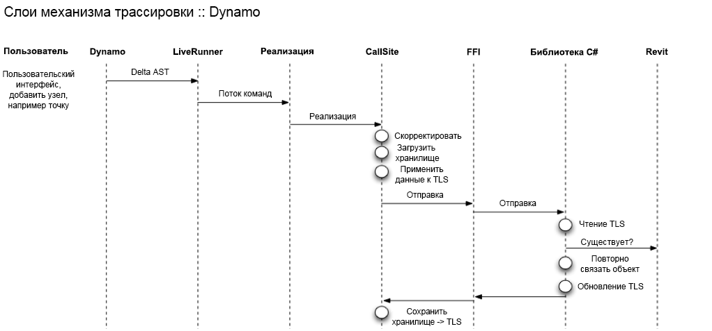

# Integrace pro aplikaci Dynamo

Vítejte v dokumentaci pro tvorbu integrací pro vizuální programovací jazyk aplikace Dynamo.

Tato příručka se zabývá různými aspekty hostování aplikace Dynamo ve vaší aplikaci, abyste uživatelům umožnili interakci s vaší aplikací pomocí vizuálního programování.

Obsah:
* [Tento úvod](#dynamo-integration) Základní přehled toho, co tato příručka obsahuje a o čem je aplikace Dynamo.
* [Vlastní vstupní bod aplikace Dynamo](#dynamo-custom-entry-point) Jak vytvořit DynamoModel a kde začít.
* [Vázání a trasování prvků](#-element-binding-and-trace) Použití mechanismu trasování aplikace Dynamo ke svázání uzlů v grafu s  jejich výsledky v hostiteli.
* [Uzly Selection doplňku Dynamo Revit ](#-dynamo-revit-selection-nodes) Jak implementovat uzly, které uživatelům umožňují vybírat objekty nebo data z hostitele a předávat je jako vstupy do grafu Dynamo. 
* [Přehled vestavěných balíčků aplikace Dynamo](#dynamo-built-in-packages-overview) Co je standardní knihovna Dynamo a jak používat základní mechanismus k dodávání balíčků s integrací.


##### Poznámky k terminologii:
V této příručce budeme k označení kódu, který uživatelé vytvářejí v aplikaci Dynamo, používat zaměnitelné termíny skript, graf a program aplikace Dynamo.

## Vlastní vstupní bod aplikace Dynamo
#### Dynamo Revit jako příklad 

[https://github.com/DynamoDS/DynamoRevit/blob/master/src/DynamoRevit/DynamoRevit.cs#L534](https://github.com/DynamoDS/DynamoRevit/blob/master/src/DynamoRevit/DynamoRevit.cs#L534)

`DynamoModel` je vstupním bodem pro aplikaci hostující Dynamo; představuje aplikaci Dynamo. Model je kořenový objekt nejvyšší úrovně, který obsahuje odkazy na další důležité datové struktury a objekty, které tvoří aplikaci Dynamo a virtuální počítač DesignScript. 

Objekt konfigurace se používá k nastavení běžných parametrů `DynamoModel` při jeho vytváření. 

Příklady v tomto dokumentu jsou převzaty z implementace DynamoRevit, což je integrace, kde Revit hostuje `DynamoModel` jako doplněk. (Architektura modulu plug-in pro aplikaci Revit). Po načtení tohoto doplňku se spustí `DynamoModel` a ten se zobrazí uživateli pomocí `DynamoView` a `DynamoViewModel`. 

Dynamo je projekt využívající jazyk C# a rozhraní .NET a chcete-li jej použít v procesu ve vaší aplikaci, musíte být schopni hostovat a spouštět kód rozhraní .NET.

DynamoCore je multiplatformní výpočetní modul a kolekce základních modelů, které lze vytvořit pomocí rozhraní .NET nebo Mono (v budoucnu .Net Core). DynamoCoreWPF však obsahuje komponenty uživatelského rozhraní Dynamo pouze pro systém Windows a na jiných platformách se nezkompiluje.

### Kroky k přizpůsobení vstupního bodu aplikace Dynamo 

K inicializaci `DynamoModel` budou muset integrátory provést tyto kroky v kódu hostitele.

### Předběžné načtení sdílených knihoven DLL aplikace Dynamo z hostitele.  

V současné době seznam v D4R obsahuje pouze knihovnu `Revit\SDA\bin\ICSharpCode.AvalonEdit.dll.`. Důvodem je to, aby se zabránilo konfliktům verzí knihoven v aplikacích Dynamo a Revit. Pokud například dojde ke konfliktům s knihovnou `AvalonEdit`, může být funkce bloku kódu zcela nefunkční. Tento problém je hlášen pro aplikaci Dynamo 1.1.x na adrese https://github.com/DynamoDS/Dynamo/issues/7130 a je také ručně reprodukovatelný. Pokud integrátory zjistí konflikty knihoven mezi hostitelskou funkcí a aplikací Dynamo, doporučujeme provést tento krok jako první. Někdy je to nutné, aby jiný modul plug-in nebo samotná hostitelská aplikace nenačetly nekompatibilní verzi aplikace jako sdílenou závislost. Lepším řešením je vyřešit konflikt verzí vyrovnáním verze nebo použít přesměrování vazby .NET v souboru app.config hostitele, pokud je to možné. 
 

### Načítání ASM 

#### Co jsou ASM a LibG

ASM je knihovna geometrie aplikace ADSK, na které je postavena aplikace Dynamo.

LibG je uživatelsky přívětivá obálka rozhraní .Net kolem jádra geometrie ASM. LibG sdílí své schéma správy verzí s ASM – používá stejné číslo hlavní a vedlejší verze ASM, které označuje, že se jedná o odpovídající obálku konkrétní verze ASM. Když je zadána verze ASM, odpovídající verze LibG by měla být stejná. Obálka LibG by ve většině případů měla fungovat se všemi verzemi ASM konkrétní hlavní verze. Například verze LibG 223 by měla být schopna načíst libovolnou verzi ASM 223.


#### Načítání ASM aplikací Dynamo Sandbox 

Aplikace Dynamo Sandbox je navržena tak, aby byla schopna pracovat s více verzemi ASM. Za tímto účelem je k jádru přibaleno a dodáváno více verzí LibG. Nástroj Dynamo Shape Manager obsahuje vestavěnou funkci k vyhledávání produktů Autodesk dodávaných s ASM, takže aplikace Dynamo může načítat ASM z těchto produktů a nechat uzly geometrie pracovat, aniž by byly explicitně načteny do hostitelské aplikace. Seznam produktů je v současné podobě následující: 
```
private static readonly List<string> ProductsWithASM = new List<string>() 

 { "Revit", "Civil", "Robot Structural Analysis", "FormIt" }; 
```
Aplikace Dynamo prohledá registr systému Windows a zjistí, zda jsou v počítači uživatele nainstalovány produkty Autodesk uvedené v tomto seznamu. Pokud jsou některé z nich nainstalovány, vyhledá binární soubory ASM, zjistí jejich verzi a vyhledá odpovídající verzi libG v aplikaci Dynamo.  

S ohledem na verzi ASM vybere následující rozhraní API ShapeManager odpovídající umístění předběžného načtení obálky libG, která se má načíst. Pokud existuje přesná shoda verzí, bude použita, jinak se načte nejbližší nižší verze libG, ale se stejnou hlavní verzí.  

Pokud například aplikace Dynamo integrována s vývojovým sestavením aplikace Revit, které obsahuje novější sestavení ASM 225.3.0, pokusí se aplikace Dynamo použít libG 225.3.0, pokud existuje, jinak se pokusí použít nejbližší hlavní verzi nižší než první volba, tj. 225.0.0. 

`public static string GetLibGPreloaderLocation(Version asmVersion, string dynRootFolder)` 

#### Načtení ASM integrací aplikace Dynamo z hostitele 

Revit je první položkou v seznamu vyhledávání produktů ASM, což znamená, že ve výchozím nastavení se soubor `DynamoSandbox.exe` pokusí načíst ASM nejprve z aplikace Revit. Přitom chceme zajistit, aby integrovaná pracovní relace D4R načítala ASM z aktuální verze hostitelské aplikace Revit: např. pokud má uživatel v počítači nainstalovanou aplikaci R2018 i R2020, při spuštění D4R z aplikace R2020 by se měla použít ASM 225 z aplikace R2020 místo ASM 223 z aplikace R2018. Integrátory budou muset implementovat podobná volání, jako je níže uvedené, aby vynutili načtení jimi určené verze. 

```
internal static Version PreloadAsmFromRevit() 

{ 

     var asmLocation = AppDomain.CurrentDomain.BaseDirectory; 
     Version libGVersion = findRevitASMVersion(asmLocation); 
     var dynCorePath = DynamoRevitApp.DynamoCorePath; 
     var preloaderLocation = DynamoShapeManager.Utilities.GetLibGPreloaderLocation(libGVersion, dynCorePath); 
     Version preLoadLibGVersion = PreloadLibGVersion(preloaderLocation); 
     DynamoShapeManager.Utilities.PreloadAsmFromPath(preloaderLocation, asmLocation); 
     return preLoadLibGVersion; 

} 
```

#### Načtení ASM aplikací Dynamo z přizpůsobené cesty 

Nedávno jsme do souborů `DynamoSandbox.exe` a `DynamoCLI.exe` přidali možnost načíst konkrétní verzi ASM. Chcete-li přeskočit běžné chování vyhledávání v registru, můžete pomocí příznaku `�gp` vynutit, aby aplikace Dynamo načetla ASM z konkrétní určité cesty. 

`DynamoSandbox.exe -gp �somePath/To/ASMDirectory/� `

  


### Vytvoření souboru StartConfiguration 

Soubor StartupConfiguration se používá jako parametr k inicializaci objektu DynamoModel, což znamená, že obsahuje téměř všechny definice, jak chcete přizpůsobit nastavení relace Dynamo. V závislosti na tom, jak jsou nastaveny následující vlastnosti, se může integrace aplikace Dynamo u různých integrátorů lišit. Různé integrátory mohou například nastavit různé cesty k šablonám jazyka Python nebo formáty zobrazovaných čísel. 

Skládá se z následujících částí: 

* DynamoCorePath // Umístění načítaných binárních souborů DynamoCore.

* DynamoHostPath // Umístění binárních souborů integrace aplikace Dynamo.

* GeometryFactoryPath // Umístění načtených binárních souborů libG.

* PathResolver // Objekt, který pomáhá rozpoznat různé soubory.

* PreloadLibraryPaths // Umístění binárních souborů předběžně načítaných uzlů, např. DSOffice.dll. 

* AdditionalNodeDirectories // Umístění binárních souborů dalších uzlů.
 
* AdditionalResolutionPaths // Cesta k sestavení pro další závislosti, které mohou být vyžadovány při načítání knihoven. 

* UserDataRootFolder // Složka uživatelských dat, např. `"AppData\Roaming\Dynamo\Dynamo Revit"`. 

* CommonDataRootFolder // Výchozí složka pro ukládání vlastních definic, ukázek, atd.

* Kontext // Název hostitele integrátoru + verze `(Revit<BuildNum>)`.

* SchedulerThread // Vlákno plánovače integrátoru implementující `ISchedulerThread` – pro většinu integrátorů je to hlavní vlákno uživatelského rozhraní nebo jakékoli vlákno, ze kterého mohou přistupovat ke svému rozhraní API.

* StartInTestMode // Určuje, zda je aktuální relace testovací automatizační relací. Mění řadu chování aplikace Dynamo – nepoužívejte, pokud nepíšete testy.

* AuthProvider // Implementace IAuthProvider v integrátoru, např. implementace RevitOxygenProvider v knihovně Greg.dll. Používá se k odesílání integrace nástrojem Package Manager. 

### Předvolby 

Výchozí cesta k nastavení předvoleb je řízena parametrem `PathManager.PreferenceFilePath`, např. `"AppData\\Roaming\\Dynamo\\Dynamo Revit\\2.5\\DynamoSettings.xml"`. Integrátory se mohou rozhodnout, zda chtějí do umístění, které je třeba sladit se správcem cest, dodat také přizpůsobený soubor nastavení předvoleb. Následují vlastnosti nastavení předvoleb, které jsou serializovány: 

* IsFirstRun // Označuje, zda je tato verze aplikace Dynamo spuštěna poprvé, používá se například k určení, zda je nutné zobrazit zprávu o přihlášení/odhlášení GA. Slouží také k určení, zda je při spuštění nové verze Dynamo nutné migrovat starší nastavení předvoleb aplikace Dynamo, aby uživatelé měli konzistentní prostředí. 

* IsUsageReportingApproved // Označuje, zda jsou schváleny zprávy o využití či nikoli. 

* IsUsageReportingApproved // Označuje, zda jsou schváleny analytické zprávy či nikoli. 

* LibraryWidth // Šířka levého panelu knihovny aplikace Dynamo. 

* ConsoleHeight // Výška zobrazení konzole. 

* ShowPreviewBubbles // Označuje, zda se zobrazí bubliny náhledu. 

* ShowConnector // Označuje, zda se zobrazí konektory. 

* ConnectorType // Označuje typ konektoru: beziérova křivka nebo křivka 

* BackgroundPreviews // Označuje aktivní stav zadaného náhledu na pozadí. 

* RenderPrecision // Úroveň přesnosti rendrování – nižší generuje sítě s menším počtem trojúhelníků. Vyšší přesnost vygeneruje hladší geometrii v náhledu na pozadí. Dobré číslo pro rychlé rendrování geometrie náhledu je 128.

* ShowEdges // Označuje, zda budou rendrovány hrany povrchů a těles. 

* ShowDetailedLayout // NEPOUŽÍVANÉ

* WindowX, WindowY // Poslední souřadnice X, Y okna aplikace Dynamo. 

* WindowW, WindowH // Poslední šířka a výška okna aplikace Dynamo. 

* UseHardwareAcceleration // Aplikace Dynamo použije hardwarovou akceleraci, pokud je podporována. 

* NumberFormat // Přesnost na desetinná místa použitá k zobrazení čísel v bublině náhledu toString(). 

* MaxNumRecentFiles // Maximální počet posledních cest k souborům, které mají být uloženy. 

* RecentFiles // Seznam cest k naposledy otevřených souborům. Změna tohoto nastavení přímo ovlivní seznam posledních souborů na úvodní stránce aplikace Dynamo 

* BackupFiles // Seznam cest k záložním souborům. 

* CustomPackageFolders // Seznam složek obsahujících binární soubory Zero-Touch a cesty k adresářům, u kterých budou kontrolovány balíčky a vlastní uzly.

* PackageDirectoriesToUninstall // Seznam balíčků, pomocí nichž nástroj Package Manager určuje, které balíčky jsou označeny k odstranění. Pokud je to možné, budou tyto cesty odstraněny během spuštění aplikace Dynamo.

* PythonTemplateFilePath // Cesta k souboru jazyka Python (.py), který se použije jako výchozí šablona při vytváření nového uzlu PythonScript. Lze ji použít k nastavení vlastní šablony jazyka Python pro vaši integraci.

* BackupInterval // Označuje, jak dlouho (v milisekundách) se bude graf automaticky ukládat. 

* BackupFilesCount // Označuje, kolik záloh bude vytvořeno. 

* PackageDownloadTouAccepted // Označuje, zda uživatel přijal podmínky používání pro stahování balíčků z nástroje Package Manager. 

* OpenFileInManualExecutionMode // Označuje výchozí stav zaškrtávacího políčka Otevřít v režimu ručního spuštění v dialogu pro otevření souboru. 

* NamespacesToExcludeFromLibrary //Určuje, které (pokud existují) jmenné prostory by se neměly zobrazovat v knihovně uzlů aplikace Dynamo. Formát řetězce: „[název knihovny]:[plně kvalifikovaný jmenný prostor]“ 

Příklad nastavení serializovaných předvoleb: 

``` xml 
<PreferenceSettings xmlns:xsd="http://www.w3.org/2001/XMLSchema" xmlns:xsi="http://www.w3.org/2001/XMLSchema-instance"> 

<IsFirstRun>false</IsFirstRun> 

<IsUsageReportingApproved>false</IsUsageReportingApproved> 

<IsAnalyticsReportingApproved>false</IsAnalyticsReportingApproved> 

<LibraryWidth>204</LibraryWidth> 

<ConsoleHeight>0</ConsoleHeight> 

<ShowPreviewBubbles>true</ShowPreviewBubbles> 

<ShowConnector>true</ShowConnector> 

<ConnectorType>BEZIER</ConnectorType> 

<BackgroundPreviews> 

<BackgroundPreviewActiveState> 

<Name>IsBackgroundPreviewActive</Name> 

<IsActive>true</IsActive> 

</BackgroundPreviewActiveState> 

<BackgroundPreviewActiveState> 

<Name>IsRevitBackgroundPreviewActive</Name> 

<IsActive>true</IsActive> 

</BackgroundPreviewActiveState> 

</BackgroundPreviews> 

<IsBackgroundGridVisible>true</IsBackgroundGridVisible> 

<RenderPrecision>128</RenderPrecision> 

<ShowEdges>false</ShowEdges> 

<ShowDetailedLayout>true</ShowDetailedLayout> 

<WindowX>553</WindowX> 

<WindowY>199</WindowY> 

<WindowW>800</WindowW> 

<WindowH>676</WindowH> 

<UseHardwareAcceleration>true</UseHardwareAcceleration> 

<NumberFormat>f3</NumberFormat> 

<MaxNumRecentFiles>10</MaxNumRecentFiles> 

<RecentFiles> 

<string></string> 

</RecentFiles> 

<BackupFiles> 

<string>..AppData\Roaming\Dynamo\Dynamo Revit\backup\backup.DYN</string> 

</BackupFiles> 

<CustomPackageFolders> 

<string>..AppData\Roaming\Dynamo\Dynamo Revit\2.5</string> 

</CustomPackageFolders> 

<PackageDirectoriesToUninstall /> 

<PythonTemplateFilePath /> 

<BackupInterval>60000</BackupInterval> 

<BackupFilesCount>1</BackupFilesCount> 

<PackageDownloadTouAccepted>true</PackageDownloadTouAccepted> 

<OpenFileInManualExecutionMode>false</OpenFileInManualExecutionMode> 

<NamespacesToExcludeFromLibrary> 

<string>ProtoGeometry.dll:Autodesk.DesignScript.Geometry.TSpline</string> 

</NamespacesToExcludeFromLibrary> 

</PreferenceSettings> 
``` 
 

* Extensions // Seznam rozšíření implementujících IExtension. Pokud je hodnota null, Dynamo načte rozšíření z výchozí cesty (složka `extensions` ve složce Dynamo). 

* IsHeadless // Označuje, zda je aplikace Dynamo spuštěna bez uživatelského rozhraní (ovlivňuje analytiku). 

* UpdateManager // Implementace nástroje UpdateManager v integrátoru, viz popis výše. 

* ProcessMode // Ekvivalent k TaskProcessMode. Synchronní, pokud je v testovacím režimu, jinak asynchronní. Řídí chování plánovače. Prostředí s jedním vláknem mohou také nastavit tuto hodnotu jako synchronní.

Použijte cílový soubor StartConfiguration ke spuštění `DynamoModel`

Po předání souboru StartConfig ke spuštění `DynamoModel`, bude komponenta DynamoCore sledovat skutečné specifikace, aby zajistila, že relace aplikace Dynamo bude správně inicializována se zadanými podrobnostmi. Po inicializaci `DynamoModel` by jednotlivé integrátory měly provést několik následných kroků nastavení, např. v D4R jsou události přihlášeny ke sledování transakcí hostitelské aplikace Revit nebo aktualizací dokumentů, přizpůsobení uzlu jazyka Python atd. 

 ### Přejděme k vizuálnímu programování

Chcete-li inicializovat `DynamoViewModel` a `DynamoView`, budete muset nejprve vytvořit `DynamoViewModel`, což lze provést pomocí statické metody `DynamoViewModel.Start`. Viz níže:

``` c#

    viewModel = DynamoViewModel.Start(
                    new DynamoViewModel.StartConfiguration()
                    {
                        CommandFilePath = commandFilePath,
                        DynamoModel = model,
                        Watch3DViewModel = 
                            HelixWatch3DViewModel.TryCreateHelixWatch3DViewModel(
                                null,
                                new Watch3DViewModelStartupParams(model), 
                                model.Logger),
                        ShowLogin = true
                    });
     
     var view = new DynamoView(viewModel);

```

`DynamoViewModel.StartConfiguration` má mnohem méně možností než konfigurace modelu. Většina z nich jsou samovysvětlující – `CommandFilePath` lze ignorovat, pokud nepíšete testovací případ.


Parametr `Watch3DViewModel` určuje,určuje, jak uzly náhledu na pozadí a uzly watch3d zobrazují 3D geometrii. Pokud implementujete požadovaná rozhraní, můžete použít vlastní implementaci.

Chcete-li vytvořit `DynamoView`, vše, co je potřeba, je `DynamoViewModel`. Pohled je ovládací prvek okna a může být zobrazen pomocí WPF.

 ### Příklad souboru DynamoSandbox.exe

 DynamoSandbox.exe je vývojové prostředí pro testování a používání komponenty DynamoCore a experimentování s ní. Je to skvělý příklad, na kterém si můžete prohlédnout, jak se načítají a nastavují komponenty `DynamoCore` a `DynamoCoreWPF`. Některé vstupní body si můžete prohlédnout [zde](https://github.com/DynamoDS/Dynamo/blob/master/src/DynamoSandbox/DynamoCoreSetup.cs#L37)

 ## Vazba a trasování prvků

#### přehled

*Trasování* je mechanismus v jádře aplikace Dynamo, který dokáže serializovat data do souboru .dyn (soubor aplikace Dynamo). Důležité je, že tato data jsou klíčová pro místa volání uzlů v grafu aplikace Dynamo.

Při otevření grafu aplikace Dynamo z disku se data trasování, která jsou v něm uložena, znovu přiřadí k uzlům grafu.

#### Slovníček pojmů:
* Mechanismus trasování:
    
  * Implementuje vazbu prvků v aplikaci Dynamo.
  * Pomocí mechanismu trasování lze zajistit, aby objekty byly znovu svázány s geometrií, kterou vytvořily.
  * Místo volání a mechanismus trasování řídí poskytování trvalého GUID, který může implementátor uzlu použít pro opětovné propojení.

* Místo volání (callsite)

  * Spustitelný soubor obsahuje více míst volání. Tato místa volání slouží k odeslání provedení na různá místa, odkud mají být odeslána:
    * Knihovna C#
    * Vestavěná metoda
    * Funkce jazyka DesignScript
    * Vlastní uzel (funkce DS)

* Serializátor trasování (TraceSerializer)
  * Serializuje třídy označené `ISerializable` a `[Serializable]` do trasování.
  * Zpracovává serializaci a deserializaci dat do trasování.
  * TraceBinder řídí vazbu deserializovaných dat na typ modulu runtime. (Vytvoří instanci skutečné třídy.)

#### Jak to vypadá?
----

Data trasování jsou serializována do souboru .dyn uvnitř vlastnosti nazvané Bindings. Jedná se o pole ID míst volání -> data. Místo volání je konkrétní umístění/instance, kde je ve virtuálním počítači DesignScript volán uzel. Je vhodné zmínit, že uzly v grafu aplikace Dynamo mohou být volány vícekrát, a proto může být pro jednu instanci uzlu vytvořeno více míst volání.

```json
"Bindings": [
    {
      "NodeId": "1e83cc25-7de6-4a7c-a702-600b79aa194d",
      "Binding": {
        "WrapperObject_InClassDecl-1_InFunctionScope-1_Instance0_1e83cc25-7de6-4a7c-a702-600b79aa194d":  "Base64 Encoded Data"
      }
    },
    {
      "NodeId": "c69c7bec-d54b-4ead-aea8-a3f45bea9ab2",
      "Binding": {
        "WrapperObject_InClassDecl-1_InFunctionScope-1_Instance0_c69c7bec-d54b-4ead-aea8-a3f45bea9ab2": "Base64 Encoded Data"
      }
    }
  ],

 
```

 *NENÍ* vhodné spoléhat na formát serializovaných dat s kódováním base64.


#### Jaký problém se snažíme vyřešit.
----


Existuje mnoho důvodů, proč chtít ukládat libovolná data jako výsledek provádění funkce, ale v tomto případě bylo trasování vyvinuto k řešení konkrétního problému, se kterým se uživatelé často setkávají při sestavování a iteraci softwarových programů, které vytvářejí prvky v hostitelských aplikacích.

Tento problém jsme nazvali `Element Binding` a jeho podstata je následující:

Když uživatel vyvíjí a spouští graf aplikace Dynamo, bude pravděpodobně generovat nové prvky v modelu hostitelské aplikace. Řekněme například, že uživatel má malý program, který generuje 100 dveří v architektonickém modelu. Počet a umístění těchto dveří řídí jeho program.

Když uživatel spustí program poprvé, vygeneruje těchto 100 dveří.

Později, když uživatel upraví vstup ve svém programu a znovu jej spustí, jeho program bude *(bez vazby prvků)* vytvoří 100 nových dveří, přičemž staré dveře budou v modelu stále existovat spolu s novými.

----

Vzhledem k tomu, že Dynamo je živé programovací prostředí a obsahuje režim spuštění `"Automatic"`, kdy změny v grafu aktivují nové spuštění, může to rychle zahltit model výsledky mnoha spuštění programu.


Zjistili jsme, že to obvykle není to, co uživatelé očekávají. Místo toho se při povolené vazbě prvků předchozí výsledky spuštění grafu vyčistí a odstraní nebo upraví. Která z těchto akcí (*odstranění nebo úprava*) proběhne, závisí na flexibilitě rozhraní API hostitele. Při povolené vazbě prvků bude po druhém, třetím nebo padesátém spuštění uživatelského programu model aplikace Dynamo obsahovat stále pouze 100 dveří.

To vyžaduje víc než jen serializaci dat do souboru .dyn. Jak uvidíte níže, v doplňku DynamoRevit existují mechanismy, které jsou založeny na trasování a podporují tyto pracovní postupy opětovného vázání.

----

Nyní je vhodná doba zmínit další důležitý případ použití vazby prvků pro hostitele, jako je Revit. Vzhledem k tomu, že prvky, které byly vytvořeny při povolení vazby prvků, se pokusí zachovat existující ID prvků (upravit existující prvky), logika, která byla vytvořena nad těmito prvky v hostitelské aplikaci, bude existovat i po spuštění programu pro aplikaci Dynamo. Příklad:

Vraťme se k příkladu architektonického modelu.

Nejprve si projděme příklad se zakázanou vazbou prvků – tentokrát má uživatel program, který generuje některé architektonické stěny.

 Spustí svůj program a ten v hostitelské aplikaci vygeneruje několik stěn. Uživatel poté opustí graf aplikace Dynamo a pomocí běžných nástrojů aplikace Revit umístí do těchto stěn několik oken. Okna jsou svázána s těmito konkrétními stěnami jako součást modelu aplikace Revit.

Uživatel znovu spustí aplikaci Dynamo a znovu spustí graf – nyní má stejně jako v našem posledním příkladu dvě sady stěn. První sada obsahuje přidaná okna, ale nové stěny nikoliv.

Pokud by byla povolena vazba prvků, můžeme zachovat stávající práci, která byla provedena ručně v hostitelské aplikaci bez aplikace Dynamo. Pokud by například byly povoleny vazby, když uživatel spustil svůj program podruhé, stěny by byly upraveny, nikoli odstraněny, a následné změny provedené v hostitelské aplikaci by zůstaly zachovány. Model by obsahoval stěny s okny, místo dvou sad stěn v různých stavech.

-----


#### Vazba prvků vs. trasování
----

Trasování je mechanismus v jádře aplikace Dynamo. Využívá statickou proměnnou míst volání dat k mapování dat na místo volání funkce v grafu, jak je popsáno výše.

Umožňuje také serializovat libovolná data do souboru .dyn při zápisu uzlů Zero-Touch aplikace Dynamo. To se obecně nedoporučuje, protože to znamená, že potenciálně přenositelný kód Zero Touch má nyní závislost na jádře aplikace Dynamo.

Nespoléhejte se na serializovaný formát dat v souboru .dyn. Místo toho použijte atribut [Serializable] a rozhraní.

Vazba prvků je naproti tomu vytvořena nad rozhraními API pro trasování a je implementována v integraci aplikace Dynamo *(DynamoRevit, Dynamo4Civil atd.)*


#### Rozhraní API pro trasování
Mezi nízkoúrovňová rozhraní API pro trasování, která stojí za to znát, patří:

``` c#
public static ISerializable GetTraceData(string key)
///Returns the data that is bound to a particular key

public static void SetTraceData(string key, ISerializable value)
///Set the data bound to a particular key
```

Jejich použití si můžete prohlédnout v následujícím příkladu

Chcete-li pracovat s daty trasování, která aplikace Dynamo načetla z existujícího souboru nebo která generuje, můžete se podívat na následující příklad:

```c#
 public IDictionary<Guid, List<CallSite.RawTraceData>> 
 GetTraceDataForNodes(IEnumerable<Guid> nodeGuids, Executable executable)
```
[GetTraceDataForNodes](https://github.com/DynamoDS/Dynamo/blob/master/src/Engine/ProtoCore/RuntimeData.cs#L218)

[RuntimeTrace.cs](https://github.com/DynamoDS/Dynamo/blob/master/src/Engine/ProtoCore/RuntimeData.cs)


#### Příklad jednoduchého trasování z uzlu
----
Příklad uzlu Dynamo, který používá trasování přímo, naleznete zde v [úložišti DynamoSamples](https://github.com/DynamoDS/DynamoSamples/blob/master/src/SampleLibraryZeroTouch/Examples/TraceExample.cs)

Shrnutí třídy v tomto příkladu vysvětluje podstatu toho, o čem je trasování:

```
  /*
     * After a graph update, Dynamo typically disposes of all
     * objects created during the graph update. But what if there are 
     * objects which are expensive to re-create, or which have other
     * associations in a host application? You wouldn't want those those objects
     * re-created on every graph update. For example, you might 
     * have an external database whose records contain data which needs
     * to be re-applied to an object when it is created in Dynamo.
     * In this example, we use a wrapper class, TraceExampleWrapper, to create 
     * TraceExampleItem objects which are stored in a static dictionary 
     * (they could be stored in a database as well). On subsequent graph updates, 
     * the objects will be retrieved from the data store using a trace id stored 
     * in the trace cache.
     */
```

Tento příklad používá rozhraní API pro trasování v komponentě DynamoCore k uložení některých dat, kdykoli se spustí konkrétní uzel. V tomto případě hraje slovník roli modelu hostitelské aplikace. podobně jako databáze modelů aplikace Revit.

Hrubé nastavení je následující:

Statická třída `TraceExampleWrapper` je importována jako uzel do aplikace Dynamo. Obsahuje jedinou metodu, `ByString`, která vytváří `TraceExampleItem`. Jedná se o běžné objekty rozhraní .net, které obsahují vlastnost `description`.

Každý objekt `TraceExampleItem` je serializován do trasování reprezentovanému jako `TraceableId`. Jedná se pouze o třídu obsahující `IntId`, která je označena jako `[Serializeable]`, takže může být serializována pomocí formátovacího modulu `SOAP`. Další informace o atributu Serializable najdete [zde](https://docs.microsoft.com/cs-cz/dotnet/api/system.serializableattribute?view=netframework-4.8)

Je také nutné implementovat rozhraní `ISerializable` definované [zde](https://docs.microsoft.com/cs-cz/dotnet/api/system.runtime.serialization.iserializable?view=netframework-4.8).


``` c#
    [IsVisibleInDynamoLibrary(false)]
    [Serializable]
    public class TraceableId : ISerializable
    {
    }
```

Tato třída je vytvořena pro každý objekt `TraceExampleItem`, který chceme uložit do trasování, serializována, zakódována ve formátu base64 a uložena na disk při uložení grafu, aby bylo možné vazby znovu asociovat, a to i později, když je graf znovu otevřen nad existujícím slovníkem prvků. To v tomto příkladu nebude dobře fungovat, protože slovník není ve skutečnosti trvalý jako dokument aplikace Revit.

A konečně poslední částí rovnice je `TraceableObjectManager`, který se podobá `ElementBinder` v aplikaci `DynamoRevit`. Řídí vztah mezi objekty přítomnými v modelu dokumentu hostitele a daty, která jsme uložili v trasování aplikace Dynamo.

Když uživatel poprvé spustí graf obsahující uzel `TraceExampleWrapper.ByString`, vytvoří se nový `TraceableId` s novým ID, `TraceExampleItem` se uloží do slovníku namapovaného na toto nové ID a `TraceableID` se uloží do trasování.

Při dalším spuštění grafu prohledáme trasování, vyhledáme uložené ID, najdeme objekt namapovaný na toto ID a vrátíme tento objekt! Místo vytvoření zcela nového objektu upravíme ten stávající.

Průběh dvou po sobě jdoucích spuštění grafu, který vytvoří jeden objekt `TraceExampleItem`, vypadá takto:


Stejná myšlenka je znázorněna v dalším příkladu s realističtějším případem použití uzlu doplňku DynamoRevit.

#### Schéma trasování

 

#### POZNÁMKA:
V posledních verzích aplikace Dynamo bylo použití TLS (thread local storage – místní úložiště vlákna) nahrazeno použitím statického člena.

#### Příklad implementace vazby prvků

-----
Pojďme prozkoumat, jak vypadá uzel, který používá vazbu prvků, pokud je implementován pro doplněk DynamoRevit. Jedná se o obdobu typu uzlu použitého výše v příkladech vytváření stěn.


---


``` c#
    private void InitWall(Curve curve, Autodesk.Revit.DB.WallType wallType, Autodesk.Revit.DB.Level baseLevel, double height, double offset, bool flip, bool isStructural)
        {
            // This creates a new wall and deletes the old one
            TransactionManager.Instance.EnsureInTransaction(Document);

            //Phase 1 - Check to see if the object exists and should be rebound
            var wallElem =
                ElementBinder.GetElementFromTrace<Autodesk.Revit.DB.Wall>(Document);

            bool successfullyUsedExistingWall = false;
            //There was a modelcurve, try and set sketch plane
            // if you can't, rebuild 
            if (wallElem != null && wallElem.Location is Autodesk.Revit.DB.LocationCurve)
            {
                var wallLocation = wallElem.Location as Autodesk.Revit.DB.LocationCurve;
                <SNIP>

                    if(!CurveUtils.CurvesAreSimilar(wallLocation.Curve, curve))
                        wallLocation.Curve = curve;

                  <SNIP>
                
            }

            var wall = successfullyUsedExistingWall ? wallElem :
                     Autodesk.Revit.DB.Wall.Create(Document, curve, wallType.Id, baseLevel.Id, height, offset, flip, isStructural);
            InternalSetWall(wall);

            TransactionManager.Instance.TransactionTaskDone();

            // delete the element stored in trace and add this new one
            ElementBinder.CleanupAndSetElementForTrace(Document, InternalWall);
        }
```

Výše uvedený kód znázorňuje ukázkový konstruktor pro prvek stěny. Tento konstruktor by byl volán z uzlu v aplikaci Dynamo jako: `Wall.byParams`

Důležité fáze provádění konstruktoru, které se vztahují k vazbě prvků, jsou:

1. Pomocí `elementBinder` zkontrolujte, zda existují dříve vytvořené objekty, které byly v minulém spuštění svázány s tímto místem volání. `ElementBinder.GetElementFromTrace<Autodesk.Revit.DB.Wall>`
2. Pokud ano, zkuste tuto stěnu upravit místo toho, abyste vytvářeli novou.

```c#
 if(!CurveUtils.CurvesAreSimilar(wallLocation.Curve, curve))
                        wallLocation.Curve = curve;
```

3. Jinak vytvořte novou stěnu.
```c#
  var wall = successfullyUsedExistingWall ? wallElem :
                     Autodesk.Revit.DB.Wall.Create(Document, curve, wallType.Id, baseLevel.Id, height, offset, flip, isStructural);
                     
```

4. Odstraňte starý prvek, který jsme právě načetli z trasování, a přidejte nový, abyste mohli tento prvek v budoucnu vyhledat:
```c#
 ElementBinder.CleanupAndSetElementForTrace(Document, InternalWall);
```

### Diskuze

#### Účinnost
* V současné době je každý objekt trasování serializován pomocí formátování SOAP xml. To je poměrně podrobné a duplikuje mnoho informací. Pak jsou data dvakrát kódována ve formátu base64, což není efektivní z hlediska serializace ani deserializace. To lze v budoucnu zlepšit, pokud nebude vytvořen vnitřní formát. Znovu opakujeme, nespoléhejte se na formát serializovaných dat v klidovém stavu.

#### Měla by být vazba prvků ve výchozím nastavení zapnutá?
* Existují případy použití, kdy vazba prvků není žádoucí. Co když pokročilý uživatel aplikace Dynamo vyvíjí program, který má být spuštěn vícekrát, aby generoval náhodné seskupení prvků. Záměrem programu je vytvořit další prvky při každém spuštění programu. Tento případ použití není snadno dosažitelný bez alternativních řešení, která by zabránila fungování vazby prvků. Je možné zakázat vazbu prvků na úrovni integrace, ale pravděpodobně by se mělo jednat o základní funkci aplikace Dynamo. Není jasné, jak podrobná by tato funkce měla být. Na úrovni uzlu? Na úrovni místa volání? Celá relace aplikace Dynamo? Pracovní plocha? atd.

## Uzly výběru doplňku Dynamo Revit (co jsou zač?) 

Tyto uzly obecně umožňují uživateli nějakým způsobem popsat podmnožinu aktivního dokumentu aplikace Revit, na který chtějí odkazovat. Existují různé způsoby, jak může uživatel odkazovat na prvek aplikace Revit (jsou popsány níže), přičemž výsledným výstupem uzlu může být obálka prvku aplikace Revit (obálka doplňku DynamoRevit) nebo geometrie aplikace Dynamo (převedená z geometrie aplikace Revit). Rozdíl mezi těmito typy výstupů je vhodné zvážit v kontextu dalších integrací hostitele.

Na vysoké úrovni je **dobré si tyto uzly představit jako funkci, která přijímá ID prvku a vrací ukazatel na tento prvek nebo nějakou geometrii, která tento prvek reprezentuje.** 

V doplňku DynamoRevit existuje více uzlů `�Selection�`. Můžeme je rozdělit nejméně do dvou skupin: 


 

1. Uživatelský výběr pomocí UI: 

    Příklady uzlů doplňku `DynamoRevit` v této kategorii jsou `SelectModelElement` a `SelectElementFace`

    Tyto uzly umožňují uživateli přepnout do kontextu uživatelského rozhraní aplikace Revit a vybrat prvek nebo sadu prvků, přičemž se zaznamená ID těchto prvků a spustí se nějaká převodní funkce – buď se vytvoří obálka, nebo se z prvku extrahuje a převede geometrie. Převod, který se spustí, závisí na typu uzlu, který uživatel vybere. 

2. Dotaz na dokument: 

    Příklady uzlů v této kategorii jsou `AllElementsOfClass` a `AllElementsOfCategory`.

    Tyto uzly umožňují uživatel dotazovat celý dokument na sadu prvků, tyto uzly obvykle vracejí obálky, které odkazují na podkladové prvky aplikace Revit. Tyto obálky jsou nedílnou součástí doplňku DynamoRevit. Umožňují pokročilejší funkce, jako je vazba prvků, a integrátorům aplikace Dynamo umožňují vybírat hostitelská rozhraní API, která budou uživatelům přístupná jako uzly.


### Uživatelské pracovní postupy v doplňku Dynamo Revit: 

#### Vzorové případy 

1. 
    * Uživatel vybere stěnu aplikace Revit pomocí uzlu `SelectModelElement` – do grafu se vrátí obálka stěny aplikace Dynamo (viditelná v bublině náhledu uzlu). 

    * Uživatel umístí uzel Element.Geometry a připojí k tomuto novému uzlu výstup uzlu `SelectModelElement`. Geometrie zabalené stěny se extrahuje a převede na geometrii aplikace Dynamo pomocí rozhraní API libG. 

    * Uživatel přepne graf do režimu automatického spuštění. 

    * Uživatel upraví původní stěnu v aplikaci Revit. 

    * Graf se automaticky znovu spustí, když dokument aplikace Revit vyvolá událost signalizující, že některé prvky byly aktualizovány. Uzel výběru sleduje tuto událost a vidí, že ID vybraného prvku bylo změněno. 

### Uživatelské pracovní postupy v doplňku DynamoCivil: 

Pracovní postupy v D4C jsou velmi podobné výše uvedenému popisu pro aplikaci Revit, zde jsou dvě typické sady uzlů výběru v D4C:  


### Problémy: 

* Díky aktualizačnímu nástroji pro změnu dokumentu, který implementují uzly výběru v doplňku `DynamoRevit`, lze snadno vytvářet nekonečné smyčky: Představte si uzel, který sleduje všechny prvky v dokumentu a pak vytváří nové prvky někde za tímto uzlem. Tento program po spuštění spustí smyčku. `DynamoRevit` se snaží tyto případy zachytit různými způsoby pomocí ID transakcí a vyhnout se úpravám dokumentu, pokud se nezměnily vstupy do konstruktorů prvků.

    To je třeba vzít v úvahu, pokud je aktivováno automatické spuštění grafu při změně vybraného prvku v hostitelské aplikaci! 

* Uzly výběru v doplňku `DynamoRevit` jsou implementovány v projektu `RevitUINodes.dll`, který odkazuje na WPF. To nemusí být problém, ale v závislosti na vaší cílové platformě stojí za to o tom vědět. 
 

### Diagramy datových toků


### Technická implementace (viz výše uvedená schémata): 

Uzly výběru jsou implementovány děděním z obecných typů `SelectionBase`: `SelectionBase<TSelection, TResult> ` a minimální sada členů: 

* Implementace metody `BuildOutputAST` – Tato metoda musí vracet AST, který bude proveden v určitém okamžiku v budoucnosti, kdy bude uzel spuštěn. V případě uzlů Selection by měla vracet prvky nebo geometrii z ID prvků. https://github.com/DynamoDS/DynamoRevit/blob/master/src/Libraries/RevitNodesUI/Selection.cs#L280 

* Implementace metody `BuildOutputAST` je jednou z nejobtížnějších částí implementace uzlů `NodeModel` / uzlů uživatelského rozhraní. Nejlepší je vložit do funkce jazyka C# co nejvíce logiky a jednoduše vložit uzel volání funkce AST do AST. Všimněte si, že `node` zde je uzel AST v abstraktním stromu syntaxe, nikoli uzel v grafu Dynamo. 


* Serializace  

  * Vzhledem k tomu, že se jedná o explicitní odvozené typy uzlu `NodeModel` (nikoli ZeroTouch), vyžadují také implementaci konstruktoru [JsonConstructor], který bude použit při deserializaci uzlu ze souboru .dyn. 

    Odkazy na prvky z hostitele by měly být uloženy do souboru .dyn, aby uživatel při otevření grafu obsahujícího tento uzel měl stále nastaven svůj výběr. Uzly NodeModel v aplikaci Dynamo používají k serializaci json.net. Všechny veřejné vlastnosti budou serializovány automaticky pomocí json.net – pomocí atributu [JsonIgnore] serializujte pouze to, co je nezbytné. 

* Uzly dotazů na dokumentu jsou o něco jednodušší, protože není nutné ukládat odkaz na ID prvků. Níže naleznete informace o implementacích tříd `ElementQueryBase` a odvozených tříd. Po spuštění tyto uzly volají rozhraní API aplikace Revit a dotazují prvky zdrojového dokumentu, následně provedou výše uvedený převod na geometrii nebo obálky prvků aplikace Revit. 

### Reference:

#### Základní třídy DynamoCore: 

* [https://github.com/DynamoDS/Dynamo/blob/ec10f936824152e7dd7d6d019efdcda0d78a5264/src/Libraries/CoreNodeModels/Selection.cs](https://github.com/DynamoDS/Dynamo/blob/ec10f936824152e7dd7d6d019efdcda0d78a5264/src/Libraries/CoreNodeModels/Selection.cs )

* [Případová studie uzlu NodeModel – vlastní uživatelské rozhraní](11\_developer\_primer/3\_developing\_for\_dynamo/5-nodemodel-case-study-custom-ui.md)
* [Aktualizace balíčků a knihoven aplikace Dynamo pro aplikaci Dynamo 2.x](11\_developer\_primer/3\_developing\_for\_dynamo/6-updating-your-packages-and-dynamo-libraries-for-dynamo-2x.md)
* [Aktualizace balíčků a knihoven aplikace Dynamo pro aplikaci Dynamo 3.x](11\_developer\_primer/3\_developing\_for\_dynamo/updating-your-packages-and-dynamo-libraries-for-dynamo-3x-Net8.md)


#### DynamoRevit: 

* [https://github.com/DynamoDS/DynamoRevit/blob/master/src/Libraries/RevitNodesUI/Selection.cs](https://github.com/DynamoDS/DynamoRevit/blob/master/src/Libraries/RevitNodesUI/Selection.cs )

* [https://github.com/DynamoDS/DynamoRevit/blob/master/src/Libraries/RevitNodesUI/Elements.cs](https://github.com/DynamoDS/DynamoRevit/blob/master/src/Libraries/RevitNodesUI/Elements.cs)


## Přehled vestavěných balíčků aplikace Dynamo

Mechanismus vestavěných balíčků umožňuje propojit větší množství obsahu uzlů s jádrem aplikace Dynamo bez rozšiřování samotného jádra, a to pomocí funkce načítání balíčků aplikace Dynamo implementované rozšířením `PackageLoader` a `PackageManager`.

V tomto dokumentu budeme zaměnitelně používat termíny vestavěné balíčky a vestavěné balíčky aplikace Dynamo, které znamenají totéž.

### Mám balíček dodávat jako vestavěný balíček?
* Balíček musí mít podepsané binární vstupní body, jinak nebude načten.
* Je třeba vynaložit veškeré úsilí, aby se zabránilo změnám v těchto balíčcích způsobujícím chyby. To znamená, že obsah balíčku by měl zahrnovat automatizované testy.
* Je vhodné spravovat verzi balíčku pomocí schématu sémantické správy verzí a sdělit ji uživatelům v popisu balíčku nebo v dokumentaci.
* Automatizované testy! Viz výše – pokud je balíček zahrnut pomocí mechanismu vestavěného balíčku, uživateli se jeví jako součást produktu a proto by měl být testován jako produkt.
* Vysoká úroveň vyladění: ikony, dokumentace uzlů, lokalizovaný obsah.
* Nedodávejte balíčky, které vy nebo váš tým nemůžete spravovat.
* Nedodávejte tímto způsobem balíčky třetích stran (viz výše).

V zásadě byste měli mít nad balíčkem plnou kontrolu, možnost jej opravovat, aktualizovat a testovat jej na nejnovější změny v aplikaci Dynamo a vašem produktu. Potřebujete také možnost jej podepsat.


### Vestavěné balíčky vs. balíčky specifické pro integraci hostitele

Naším záměrem je, aby `Built-In Packages` byly základní funkcí, sadou balíčků, ke kterým mají přístup všichni uživatelé, i když nemají přístup k nástroji Package Manager. V současné době je základním mechanismem pro podporu této funkce dodatečné výchozí umístění pro načítání balíčků přímo v základním adresáři aplikace Dynamo, v němž se nachází soubor DynamoCore.dll.

S určitými omezeními bude toto umístění použitelné pro klienty a integrátory aplikace Autodesk Dynamo k distribuci jejich balíčků specifických pro integraci. *(Například integrace aplikace Dynamo FormIt vyžaduje vlastní balíček Dynamo FormIt.)*

Vzhledem k tomu, že základní mechanismus načítání je stejný pro základní balíčky i balíčky specifické pro hostitele, bude nutné zajistit, aby balíčky distribuované tímto způsobem nezpůsobovaly u uživatelů nejasnosti ohledně základních balíčků `Built-In Packages` a balíčků specifickými pro integraci, které jsou k dispozici pouze v jednom hostitelském produktu. Doporučujeme, aby v zájmu zamezení zmatení uživatelů byly balíčky specifické pro hostitele projednány s týmy aplikace Dynama.


### Lokalizace balíčku

Vzhledem k tomu, že balíčky zahrnuté v `Built-In Packages` budou dostupné většímu počtu a záruky, které na ně poskytujeme, budou přísnější (viz výše), měly by být lokalizovány.

U interních balíčků Autodesk určených k zařazení do `Built-In Packages` současná omezení spočívající v nemožnosti publikovat lokalizovaný obsah v nástroji Package Manager nejsou překážkou, protože balíčky nemusí být nutně publikovány v tomto nástroji.

Pomocí dočasného řešení je možné ručně vytvořit (a dokonce publikovat) balíčky s podadresáři jazykové verze ve složce /bin balíčku.

Nejprve ručně vytvořte požadované podadresáře specifické pro jazykovou verzi ve složce `/bin` balíčků. 

Pokud je z nějakého důvodu nutné balíček také publikovat v nástroji Package Manager, je nutné nejprve publikovat verzi balíčku, ve které tyto podadresáře specifické pro jazykovou verzi chybí, a poté publikovat novou verzi balíčku pomocí příkazu `publish package version` v uživatelském rozhraní aplikace Dynamo. Při odeslání nové verze do aplikace Dynamo by neměly být odstraněny složky a soubory v adresáři `/bin`, které jste přidali ručně pomocí Průzkumníku souborů systému Windows. Proces odesílání balíčků v aplikaci Dynamo bude aktualizován, aby odpovídal budoucím požadavkům na lokalizované soubory.

Tyto podadresáře jazykových verzí jsou bez problémů načítány modulem runtime .net, pokud se nacházejí ve stejném adresáři jako binární soubory uzlu nebo rozšíření.

Další informace o sestavách prostředků a souborech .resx naleznete zde: [https://docs.microsoft.com/en-us/dotnet/framework/resources/creating-resource-files-for-desktop-apps](https://docs.microsoft.com/cs-cz/dotnet/framework/resources/creating-resource-files-for-desktop-apps).

Pravděpodobně budete vytvářet soubory `.resx` a kompilovat je pomocí aplikace Visual Studio. Pro danou sestavu `xyz.dll` budou výsledné prostředky zkompilovány do nové sestavy `xyz.resources.dll`. Jak je popsáno výše, důležité je umístění a název této sestavy.

Vygenerovaná sestava `xyz.resources.dll` by měly být umístěna následovně: `package\bin\culture\xyz.resources.dll`.

Pro přístup k lokalizovaným řetězcům v balíčku můžete použít Správce zdrojů, ale ještě jednodušší je odkazovat se na `Properties.Resources.YourLocalizedResourceName` ze sestavy, pro kterou jste přidali soubor `.resx`. Viz například: 

[https://github.com/DynamoDS/Dynamo/blob/master/src/Libraries/CoreNodes/List.cs#L457](https://github.com/DynamoDS/Dynamo/blob/master/src/Libraries/CoreNodes/List.cs#L457) – příklad lokalizované chybové zprávy

[https://github.com/DynamoDS/Dynamo/blob/master/src/Libraries/CoreNodeModels/ColorRange.cs#L19](https://github.com/DynamoDS/Dynamo/blob/master/src/Libraries/CoreNodeModels/ColorRange.cs#L19) – příklad lokalizovaného řetězce atributu NodeDescription specifického pro aplikaci Dynamo.

[https://github.com/DynamoDS/DynamoSamples/blob/master/src/SampleLibraryUI/Examples/LocalizedCustomNodeModel.cs](https://github.com/DynamoDS/DynamoSamples/blob/master/src/SampleLibraryUI/Examples/LocalizedCustomNodeModel.cs) – jiný příklad.

### Rozvržení knihovny uzlů

Když aplikace Dynamo načítá uzly z balíčku, obvykle je umístí do oddílu `Addons` v knihovně uzlů. Za účelem lepší integrace vestavěných uzlů balíčků s jiným vestavěným obsahem jsme přidali možnost, aby autoři vestavěných balíčků mohli dodat soubor obsahující částečnou specifikaci rozvržení, který pomůže umístit nové uzly do správné kategorie nejvyšší úrovně v oddílu `default` v knihovně.

Například následující soubor json obsahující specifikaci rozvržení, pokud je nalezen v cestě `package/extra/layoutspecs.json`, umístí uzly zadané parametrem `path` do kategorie `Revit` v oddílu `default`, který je hlavní oddíl pro vestavěné uzly.

Všimněte si, že uzly importované z vestavěného balíčku budou mít předponu `bltinpkg://`, pokud budou zvažovány pro porovnání s cestou zahrnutou ve specifikaci rozvržení.

```json
{
  "sections": [
    {
      "text": "default",
      "iconUrl": "",
      "elementType": "section",
      "showHeader": false,
      "include": [ ],
      "childElements": [
        {
          "text": "Revit",
          "iconUrl": "",
          "elementType": "category",
          "include": [],
          "childElements": [
            {
              "text": "some sub group name",
              "iconUrl": "",
              "elementType": "group",
              "include": [
                {
                  "path": "bltinpkg://namespace.namespace",
                  "inclusive": false
                }
              ],
              "childElements": []
            }
          ]
        }
      ]
    }
  ]
}
```

Složité úpravy rozvržení nejsou dobře otestovány ani podporovány. Záměrem načtení této konkrétní specifikace rozvržení je přesunout celý jmenný prostor balíčku do konkrétní kategorie hostitele, jako je `Revit` nebo `Formit`. 