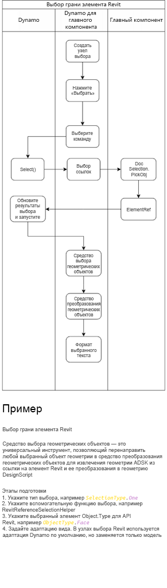
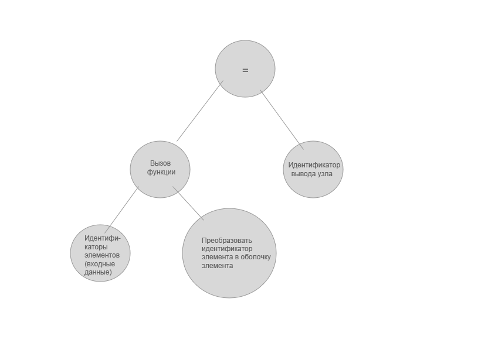

# Integracja z dodatkiem Dynamo

Witamy w dokumentacji integracji dla języka programowania wizualnego dodatku Dynamo.

W tym podręczniku omówiono różne aspekty osadzania dodatku Dynamo w aplikacji, aby umożliwić użytkownikom interakcję z aplikacją za pomocą programowania wizualnego.

Zawartość:
* [To wprowadzenie](#dynamo-integration) — ogólne omówienie tego, co zawiera ten podręcznik oraz czym jest i do czego służy dodatek Dynamo.
* [Niestandardowy punkt wejścia dodatku Dynamo](#dynamo-custom-entry-point) — jak utworzyć DynamoModel i od czego zacząć.
* [Śledzenie i powiązywanie elementów](#-element-binding-and-trace) — używanie mechanizmu śledzenia dodatku Dynamo do powiązywania węzłów na wykresie z ich wynikami w programie nadrzędnym.
* [Węzły wyboru dodatku Dynamo Revit](#-dynamo-revit-selection-nodes) — jak zaimplementować węzły umożliwiające użytkownikom wybieranie obiektów lub danych z programu nadrzędnego i przekazywanie ich jako danych wejściowych do wykresu Dynamo. 
* [Przegląd pakietów wbudowanych dodatku Dynamo](#dynamo-built-in-packages-overview) — czym jest standardowa biblioteka dodatku Dynamo i jak używać tego mechanizmu źródłowego do dostarczania pakietów z integracją.


##### Informacje o terminologii:
W tych dokumentach będziemy używać zamiennie terminów „skrypt”, „wykres” i „program” „dodatku dynamo” w odniesieniu do kodu tworzonego przez użytkowników w dodatku Dynamo.

## Niestandardowy punkt wejścia dodatku Dynamo
#### Dodatek Dynamo Revit jako przykład 

[https://github.com/DynamoDS/DynamoRevit/blob/master/src/DynamoRevit/DynamoRevit.cs#L534](https://github.com/DynamoDS/DynamoRevit/blob/master/src/DynamoRevit/DynamoRevit.cs#L534)

`DynamoModel` jest punktem wejścia dla aplikacji nadrzędnej dodatku Dynamo — reprezentuje aplikację Dynamo. Ten model jest obiektem głównym najwyższego poziomu, który zawiera odniesienia do innych ważnych struktur danych i obiektów tworzących aplikację Dynamo oraz maszynę wirtualną DesignScript. 

Do ustawiania parametrów wspólnych w `DynamoModel` podczas konstruowania tego modelu służy obiekt konfiguracji. 

Przykłady w tym dokumencie zaczerpnięto z implementacji DynamoRevit, czyli integracji, w której program Revit jest programem nadrzędnym `DynamoModel` używanego jako dodatek. (Architektura wtyczek do programu Revit). Wczytanie tego dodatku powoduje uruchomienie `DynamoModel`, a następnie wyświetlenie go użytkownikowi z `DynamoView` i `DynamoViewModel`. 

Dodatek Dynamo jest projektem w języku C# .NET i aby używać go w procesie w aplikacji, musisz mieć możliwość hostowania i wykonywania kodu .NET.

DynamoCore to wieloplatformowy silnik obliczeniowy i kolekcja modeli podstawowych, które można kompilować przy użyciu platformy .NET lub Mono (w przyszłości .NET Core). Jednak narzędzie DynamoCoreWPF zawiera komponenty interfejsu użytkownika dodatku Dynamo tylko dla systemu Windows i nie można go kompilować na innych platformach.

### Kroki dostosowywania punktu wejścia dodatku Dynamo 

Aby zainicjować `DynamoModel`, twórcy integracji muszą wykonać te kroki w dowolnym miejscu w kodzie programu nadrzędnego.

### Wstępne wczytywanie udostępnionych plików dll dodatku Dynamo z programu nadrzędnego  

Obecnie lista w dodatku D4R zawiera tylko plik `Revit\SDA\bin\ICSharpCode.AvalonEdit.dll.`. Ma to na celu uniknięcie konfliktów wersji bibliotek między dodatkiem Dynamo i programem Revit. np. w przypadku konfliktów dotyczących biblioteki `AvalonEdit` funkcja bloku kodu może zostać całkowicie uszkodzona. Problem został zgłoszony dla dodatku Dynamo 1.1.x (w https://github.com/DynamoDS/Dynamo/issues/7130) i można go również odtworzyć ręcznie. Jeśli twórcy integracji wykryją konflikty bibliotek między funkcją programu nadrzędnego a dodatkiem Dynamo, zaleca się zrobienie tego w pierwszej kolejności. Czasami jest to wymagane, aby powstrzymać inną wtyczkę lub samą aplikację nadrzędną przed wczytaniem niezgodnej wersji jako zależności współdzielonej. Lepszym rozwiązaniem jest rozstrzygnięcie konfliktu wersji przez dopasowanie wersji — lub użycie przekierowania powiązania .net w pliku app.config programu nadrzędnego, jeśli to możliwe. 
 

### Wczytywanie ASM 

#### Czym są ASM i libG

ASM to biblioteka geometrii ADSK, na której opiera się dodatek Dynamo.

Biblioteka libG to przyjazne dla użytkownika platformy .Net opakowanie dla jądra geometrii ASM. Biblioteka libG współdzieli schemat obsługi wersji z biblioteką ASM — używany jest w jej przypadku ten sam numer wersji głównej i pomocniczej co w przypadku ASM, aby wskazać, że jest to odpowiednie opakowanie określonej wersji ASM. Wersja biblioteki libG odpowiadająca danej wersji biblioteki ASM powinna być taka sama. Biblioteka libG w większości przypadków powinna współdziałać ze wszystkimi wersjami biblioteki ASM w określonej wersji głównej. Na przykład biblioteka libG 223 powinna być w stanie wczytać dowolną wersję biblioteki ASM 223.


#### Środowisko Dynamo Sandbox wczytujące bibliotekę ASM 

Środowisko Dynamo Sandbox zaprojektowano pod kątem współdziałania z wieloma wersjami biblioteki ASM. W tym celu z rdzeniem dostarczanych jest wiele wersji biblioteki libG. Menedżer kształtów dodatku Dynamo zawiera wbudowaną funkcję wyszukiwania produktów firmy Autodesk dostarczanych z biblioteką ASM, dzięki czemu dodatek Dynamo może wczytywać bibliotekę ASM z tych produktów i zapewniać działanie węzłów geometrii bez jawnego wczytywania ich do aplikacji nadrzędnej. Aktualna lista produktów przedstawia się następująco: 
```
private static readonly List<string> ProductsWithASM = new List<string>() 

 { "Revit", "Civil", "Robot Structural Analysis", "FormIt" }; 
```
Dodatek Dynamo przeszuka rejestr systemu Windows i sprawdzi, czy produkty firmy Autodesk z tej listy są zainstalowane na komputerze użytkownika. Jeśli którykolwiek z nich jest zainstalowany, dodatek wyszuka pliki binarne ASM i pobierze tę wersję oraz wyszuka odpowiednią wersję biblioteki libG w dodatku Dynamo.  

Na podstawie wersji biblioteki ASM następujący interfejs API ShapeManager wybierze odpowiednią lokalizację mechanizmu wstępnego wczytywania biblioteki libG do wczytania. Jeśli istnieje dokładnie zgodna wersja, zostanie ona użyta. W przeciwnym razie zostanie wczytana najbliższa niższa wersja biblioteki libG, ale z tą samą wersją główną.  

np. Jeśli dodatek Dynamo jest zintegrowany z kompilacją deweloperską programu Revit, w której istnieje nowsza kompilacja biblioteki ASM — 225.3.0, dodatek Dynamo spróbuje użyć biblioteki libG 225.3.0, jeśli ta biblioteka istnieje. W przeciwnym razie spróbuje użyć najbliższej wersji głównej niższej niż pierwsza wybrana, czyli 225.0.0. 

`public static string GetLibGPreloaderLocation(Version asmVersion, string dynRootFolder)` 

#### Wewnątrzprocesowa integracja dodatku Dynamo wczytująca bibliotekę z poziomu programu nadrzędnego 

Program Revit jest pierwszą pozycją na liście wyszukiwania produktów z biblioteką ASM, co oznacza, że domyślnie program `DynamoSandbox.exe` będzie próbował wczytać bibliotekę ASM z programu Revit. Następnie chcemy się upewnić, że zintegrowana sesja robocza dodatku D4R wczytuje bibliotekę ASM z bieżącego programu nadrzędnego Revit: np. jeśli użytkownik ma na komputerze zarówno wersję R2018, jak i wersję R2020, podczas uruchamiania dodatku D4R z wersji R2020 dodatek D4R powinien używać biblioteki ASM 225 z wersji R2020, a nie ASM 223 z R2018. Twórcy integracji muszą zaimplementować wywołania podobne do poniższych, aby wymusić wczytanie określonej wersji. 

```
internal static Version PreloadAsmFromRevit() 

{ 

     var asmLocation = AppDomain.CurrentDomain.BaseDirectory; 
     Version libGVersion = findRevitASMVersion(asmLocation); 
     var dynCorePath = DynamoRevitApp.DynamoCorePath; 
     var preloaderLocation = DynamoShapeManager.Utilities.GetLibGPreloaderLocation(libGVersion, dynCorePath); 
     Version preLoadLibGVersion = PreloadLibGVersion(preloaderLocation); 
     DynamoShapeManager.Utilities.PreloadAsmFromPath(preloaderLocation, asmLocation); 
     return preLoadLibGVersion; 

} 
```

#### Dodatek Dynamo wczytuje bibliotekę ASM z dostosowanej ścieżki 

Ostatnio dodaliśmy możliwość wczytywania określonej wersji biblioteki ASM przez programy `DynamoSandbox.exe` i `DynamoCLI.exe`. Aby pominąć normalne przeszukiwanie rejestru, można użyć flagi `�gp`, aby wymusić na dodatku Dynamo wczytywanie biblioteki ASM z określonej ścieżki. 

`DynamoSandbox.exe -gp �somePath/To/ASMDirectory/� `

  


### Tworzenie konfiguracji początkowej 

Konfiguracja początkowa (StartupConfiguration) jest przekazywana jako parametr do inicjowania DynamoModel, co wskazuje, że zawiera ona prawie wszystkie definicje sposobu dostosowywania ustawień sesji dodatku Dynamo. W zależności od sposobu ustawienia następujących właściwości integracja dodatku Dynamo może się różnić w zależności od różnych twórców integracji. Np. różni twórcy integracji mogą ustawiać różne ścieżki szablonów w języku Python lub wyświetlane formaty liczb. 

Ten komponent składa się z następujących elementów: 

* DynamoCorePath // Gdzie znajdują się pliki binarne DynamoCore wczytywania

* DynamoHostPath // Gdzie znajdują się pliki binarne integracji dodatku Dynamo

* GeometryFactoryPath // Gdzie znajdują się wczytywane pliki binarne biblioteki libG

* PathResolver //obiekt, który pomaga w rozstrzyganiu lokalizacji różnych plików

* PreloadLibraryPaths // Gdzie znajdują się wstępnie wczytywane pliki binarne węzłów, np. DSOffice.dll 

* AdditionalNodeDirectories // Gdzie znajdują się dodatkowe pliki binarne węzłów
 
* AdditionalResolutionPaths // Dodatkowe ścieżki rozstrzygania zespołów dla innych zależności, które mogą być wymagane podczas wczytywania bibliotek 

* UserDataRootFolder // Folder danych użytkownika, np. `"AppData\Roaming\Dynamo\Dynamo Revit"` 

* CommonDataRootFolder // Domyślny folder do zapisywania definicji niestandardowych, przykładów itp.

* Context // Nazwa i wersja programu nadrzędnego twórcy integracji `(Revit<BuildNum>)`

* SchedulerThread // Wątek harmonogramu twórcy integracji implementujący `ISchedulerThread` — w przypadku większości twórców integracji jest to główny wątek interfejsu użytkownika lub dowolny wątek, z którego mogą uzyskać dostęp do interfejsu API.

* StartInTestMode // Czy bieżąca sesja jest sesją automatyzacji testów — modyfikuje zestaw zachowań dodatku Dynamo — nie należy używać tej funkcji, chyba że podczas pisania testów.

* AuthProvider // Implementacja interfejsu IAuthProvider danego twórcy integracji, np. implementacja RevitOxygenProvider znajduje się w bibliotece Greg.dll używanej do integracji przekazywania packageManager. 

### Preferencje 

Domyślną ścieżką ustawień preferencji zarządza się za pomocą wartości `PathManager.PreferenceFilePath`, np. `"AppData\\Roaming\\Dynamo\\Dynamo Revit\\2.5\\DynamoSettings.xml"`. Twórcy integracji mogą zdecydować, czy chcą również dostarczyć niestandardowy plik ustawień preferencji do lokalizacji, która musi być zgodna z menedżerem ścieżek. Poniżej przedstawiono właściwości ustawień preferencji, które są serializowane: 

* IsFirstRun // Wskazuje, czy jest to pierwsze uruchomienie danej wersji dodatku Dynamo, np. służy do określenia, czy należy wyświetlić komunikat o wyrażeniu zgody na lub rezygnacji z GA. Służy również do określenia, czy jest wymagana migracja starszych ustawień preferencji dodatku Dynamo podczas uruchamiania nowej wersji dodatku Dynamo, aby zapewnić użytkownikom spójne środowisko 

* IsUsageReportingApproved // Wskazuje, czy zatwierdzono raporty użycia 

* IsAnalyticsReportingApproved // Wskazuje, czy zatwierdzono raporty analityczne 

* LibraryWidth // Szerokość lewego panelu biblioteki dodatku Dynamo. 

* ConsoleHeight // Wysokość ekranu konsoli 

* ShowPreviewBubbles // Wskazuje, czy dymki podglądu powinny być wyświetlane 

* ShowConnector // Wskazuje, czy są wyświetlane złącza 

* ConnectorType //Wskazuje typ złącza: Beziera lub polilinia 

* BackgroundPreviews // Wskazuje aktywny stan określonego podglądu tła 

* RenderPrecision: // Poziom dokładności renderowania — niższy generuje siatki z mniejszą liczbą trójkątów. Ustawienie wyższego spowoduje wygenerowanie gładszej geometrii w podglądzie tła. Wartość 128 zapewnia dobry i szybki podgląd geometrii.

* ShowEdges // Wskazuje, czy będą renderowane krawędzie powierzchni i bryły 

* ShowDetailedLayout // Nieużywane

* WindowX, WindowY // Ostatnia współrzędna X, Y okna dodatku Dynamo 

* WindowW, WindowH // Ostatnia szerokość, wysokość okna dodatku Dynamo 

* UseHardwareAcceleration // Określa, czy dodatek Dynamo powinien używać przyspieszenia sprzętowego, jeśli jest ono obsługiwane 

* NumberFormat // Dokładność dziesiętna używana do wyświetlania liczb w dymku podglądu funkcji toString(). 

* MaxNumRecentFiles // Maksymalna liczba ostatnio używanych ścieżek plików do zapisania 

* RecentFiles // Lista ścieżek ostatnio otwartych plików — zmiana tej listy wpłynie bezpośrednio na listę ostatnio używanych plików na stronie startowej dodatku Dynamo 

* BackupFiles // Lista ścieżek plików kopii zapasowej 

* CustomPackageFolders // Lista folderów zawierających pliki binarne typu Zero Touch i ścieżki katalogów, które będą skanowane w poszukiwaniu pakietów i węzłów niestandardowych.

* PackageDirectoriesToUninstall // Lista pakietów używana przez Menedżera pakietów do określenia, które pakiety mają zostać oznaczone do usunięcia. Te ścieżki zostaną usunięte, jeśli będzie to możliwe podczas uruchamiania dodatku Dynamo.

* PythonTemplateFilePath // Ścieżka pliku w języku Python (.py) używana jako szablon początkowy podczas tworzenia nowego węzła PythonScript — tej pozycji można użyć do skonfigurowania szablonu niestandardowego w języku Python dla integracji.

* BackupInterval // Wskazuje, co jaki czas (w milisekundach) wykres będzie automatycznie zapisywany 

* BackupFilesCount // Wskazuje, ile kopii zapasowych zostanie utworzonych 

* PackageDownloadTouAccepted // Wskazuje, czy użytkownik zaakceptował Warunki użytkowania pobierania pakietów z Menedżera pakietów 

* OpenFileInManualExecutionMode // Wskazuje domyślny stan pola wyboru „Otwórz w trybie ręcznym” w oknie dialogowym OpenFileDialog 

* NamespacesToExcludeFromLibrary // Wskazuje, które (jeśli w ogóle jakieś) przestrzenie nazw nie powinny być wyświetlane w bibliotece węzłów dodatku Dynamo. Format ciągu: „[nazwa biblioteki]:[w pełni kwalifikowana przestrzeń nazw]” 

Przykład zserializowanych ustawień preferencji: 

``` xml 
<PreferenceSettings xmlns:xsd="http://www.w3.org/2001/XMLSchema" xmlns:xsi="http://www.w3.org/2001/XMLSchema-instance"> 

<IsFirstRun>false</IsFirstRun> 

<IsUsageReportingApproved>false</IsUsageReportingApproved> 

<IsAnalyticsReportingApproved>false</IsAnalyticsReportingApproved> 

<LibraryWidth>204</LibraryWidth> 

<ConsoleHeight>0</ConsoleHeight> 

<ShowPreviewBubbles>true</ShowPreviewBubbles> 

<ShowConnector>true</ShowConnector> 

<ConnectorType>BEZIER</ConnectorType> 

<BackgroundPreviews> 

<BackgroundPreviewActiveState> 

<Name>IsBackgroundPreviewActive</Name> 

<IsActive>true</IsActive> 

</BackgroundPreviewActiveState> 

<BackgroundPreviewActiveState> 

<Name>IsRevitBackgroundPreviewActive</Name> 

<IsActive>true</IsActive> 

</BackgroundPreviewActiveState> 

</BackgroundPreviews> 

<IsBackgroundGridVisible>true</IsBackgroundGridVisible> 

<RenderPrecision>128</RenderPrecision> 

<ShowEdges>false</ShowEdges> 

<ShowDetailedLayout>true</ShowDetailedLayout> 

<WindowX>553</WindowX> 

<WindowY>199</WindowY> 

<WindowW>800</WindowW> 

<WindowH>676</WindowH> 

<UseHardwareAcceleration>true</UseHardwareAcceleration> 

<NumberFormat>f3</NumberFormat> 

<MaxNumRecentFiles>10</MaxNumRecentFiles> 

<RecentFiles> 

<string></string> 

</RecentFiles> 

<BackupFiles> 

<string>..AppData\Roaming\Dynamo\Dynamo Revit\backup\backup.DYN</string> 

</BackupFiles> 

<CustomPackageFolders> 

<string>..AppData\Roaming\Dynamo\Dynamo Revit\2.5</string> 

</CustomPackageFolders> 

<PackageDirectoriesToUninstall /> 

<PythonTemplateFilePath /> 

<BackupInterval>60000</BackupInterval> 

<BackupFilesCount>1</BackupFilesCount> 

<PackageDownloadTouAccepted>true</PackageDownloadTouAccepted> 

<OpenFileInManualExecutionMode>false</OpenFileInManualExecutionMode> 

<NamespacesToExcludeFromLibrary> 

<string>ProtoGeometry.dll:Autodesk.DesignScript.Geometry.TSpline</string> 

</NamespacesToExcludeFromLibrary> 

</PreferenceSettings> 
``` 
 

* Extensions // Lista rozszerzeń implementujących interfejs IExtension; jeśli ma wartość null, dodatek Dynamo będzie wczytywać rozszerzenia ze ścieżki domyślnej (folderu `extensions` w folderze dodatku Dynamo) 

* IsHeadless // Wskazuje, czy dodatek Dynamo został uruchomiony bez interfejsu użytkownika — wpływa na analizę. 

* UpdateManager // Implementacja UpdateManager danego twórcy integracji, patrz opis powyżej 

* ProcessMode // Odpowiednik TaskProcessMode; synchroniczny w trybie testowym; w przeciwnym razie asynchroniczny — steruje zachowaniem harmonogramu. W środowiskach jednowątkowych można również ustawić dla tej opcji wartość synchroniczną.

Używanie docelowej konfiguracji StartConfiguration do uruchomienia `DynamoModel`

Po przekazaniu parametru StartConfig w celu uruchomienia `DynamoModel` dodatek DynamoCore będzie nadzorował rzeczywiste konkretne elementy, aby upewnić się, że sesja dodatku Dynamo została poprawnie zainicjowana z określonymi szczegółami. Integratorzy powinni wykonać pewne kroki pokonfiguracyjne po zainicjowaniu `DynamoModel`, np. w dodatku D4R subskrybowane są zdarzenia do obserwowania transakcji programu nadrzędnego Revit lub aktualizacji dokumentów, dostosowywania węzłów w języku Python itp. 

 ### Czas na „programowanie wizualne”

Aby zainicjować `DynamoViewModel` i `DynamoView`, należy najpierw utworzyć `DynamoViewModel` — można to zrobić za pomocą metody statycznej `DynamoViewModel.Start`. Zobacz poniżej:

``` c#

    viewModel = DynamoViewModel.Start(
                    new DynamoViewModel.StartConfiguration()
                    {
                        CommandFilePath = commandFilePath,
                        DynamoModel = model,
                        Watch3DViewModel = 
                            HelixWatch3DViewModel.TryCreateHelixWatch3DViewModel(
                                null,
                                new Watch3DViewModelStartupParams(model), 
                                model.Logger),
                        ShowLogin = true
                    });
     
     var view = new DynamoView(viewModel);

```

Konfiguracja `DynamoViewModel.StartConfiguration` zapewnia znacznie mniej opcji niż konfiguracja modelu. Są one w większości oczywiste — `CommandFilePath` można zignorować, chyba że piszesz przypadek testowy.


Parametr `Watch3DViewModel` określa, w jaki sposób w węzłach podglądu tła i watch3d jest wyświetlana geometria 3D. Możesz użyć własnej implementacji, jeśli zaimplementujesz wymagane interfejsy.

Do skonstruowania `DynamoView` wystarczy `DynamoViewModel`. Ten widok jest kontrolką okna i może być wyświetlany przy użyciu platformy WPF.

 ### Przykład dotyczący programu DynamoSandbox.exe:

 DynamoSandbox.exe to środowisko programistyczne do testowania i używania dodatku DynamoCore oraz eksperymentowania z nim. Jest to doskonały przykład pozwalający przekonać się, w jaki sposób są wczytywane i konfigurowane komponenty `DynamoCore` i `DynamoCoreWPF`. Niektóre punkty wejścia można zobaczyć [tutaj](https://github.com/DynamoDS/Dynamo/blob/master/src/DynamoSandbox/DynamoCoreSetup.cs#L37)

 ## Śledzenie i powiązywanie elementów

#### przegląd

*Śledzenie* jest mechanizmem dodatku Dynamo Core, który umożliwia serializowanie danych do pliku .dyn (pliku dodatku Dynamo). Co najważniejsze, dane te są powiązywane z miejscami wywołań (callsite) węzłów na wykresie Dynamo.

W razie otwarcia wykresu Dynamo z dysku zapisane w nim dane śledzenia zostają ponownie skojarzone z węzłami wykresu.

#### słownik:
* Mechanizm śledzenia:
    
  * Implementuje powiązywanie elementów w dodatku Dynamo
  * Mechanizm śledzenia może być używany do zapewnienia ponownego powiązywania obiektów z geometrią, którą utworzyły
  * Mechanizm miejsca wywołania (Callsite) i śledzenia obsługuje dostarczanie trwałego identyfikatora GUID, którego można użyć w ramach implementacji węzła do ponownego połączenia

* Miejsce wywołania (Callsite)

  * Plik wykonywalny zawiera wiele miejsc wywołań. Te miejsca wywołań służą do wykonania wysyłania do różnych miejsc, w których należy wykonać wysyłanie:
    * Biblioteka C#
    * Metoda wbudowana
    * Funkcja DesignScript
    * Węzeł niestandardowy (funkcja DS)

* TraceSerializer
  * Serializuje oznaczone klasy `ISerializable` i `[Serializable]` do postaci śladu.
  * Obsługuje serializację i deserializację danych do postaci śladu.
  * Komponent TraceBinder steruje powiązywaniem zdeserializowanych danych z typem środowiska uruchomieniowego. (Tworzy wystąpienie klasy rzeczywistej)

#### Jak to wygląda?
----

Dane śledzenia są serializowane do pliku .dyn wewnątrz właściwości o nazwie Bindings. Jest to szyk: identyfikatory miejsc wywołań -> dane. Miejsce wywołania to określone położenie/wystąpienie, w którym na maszynie wirtualnej DesignScript jest wywoływany węzeł. Warto wspomnieć, że węzły na wykresie Dynamo mogą być wywoływane wielokrotnie, w związku z czym dla jednego wystąpienia węzła może zostać utworzonych wiele miejsc wywołań.

```json
"Bindings": [
    {
      "NodeId": "1e83cc25-7de6-4a7c-a702-600b79aa194d",
      "Binding": {
        "WrapperObject_InClassDecl-1_InFunctionScope-1_Instance0_1e83cc25-7de6-4a7c-a702-600b79aa194d":  "Base64 Encoded Data"
      }
    },
    {
      "NodeId": "c69c7bec-d54b-4ead-aea8-a3f45bea9ab2",
      "Binding": {
        "WrapperObject_InClassDecl-1_InFunctionScope-1_Instance0_c69c7bec-d54b-4ead-aea8-a3f45bea9ab2": "Base64 Encoded Data"
      }
    }
  ],

 
```

 *NIE* zaleca się polegania na formacie zserializowanych danych Base64Encoded.


#### Jaki problem próbujemy rozwiązać.
----


Istnieje wiele powodów do zapisywania dowolnych danych w wyniku wykonania funkcji, ale w tym przypadku śledzenie opracowano w celu rozwiązania konkretnego problemu, z którym użytkownicy często spotykają się podczas tworzenia i iterowania programów oprogramowania tworzących elementy w aplikacjach nadrzędnych.

Problem to ten określony jako `Element Binding`, a pomysł jest następujący:

Gdy użytkownik opracowuje i uruchamia wykres Dynamo, prawdopodobnie będzie generował nowe elementy w modelu aplikacji nadrzędnej. W naszym przykładzie załóżmy, że użytkownik ma mały program, który generuje 100 par drzwi w modelu architektonicznym. Liczba i lokalizacja tych drzwi są kontrolowane przez ten program.

Przy pierwszym uruchomieniu programu generuje on te 100 par drzwi.

Później, gdy użytkownik zmodyfikuje dane wejściowe programu i wykona go ponownie, program *(bez powiązywania elementów)* utworzy 100 nowych par drzwi, stare pary drzwi będą nadal istnieć w modelu wraz z nowymi.

----

Ponieważ dodatek Dynamo jest środowiskiem programowania na żywo i obejmuje tryb uruchamiania `"Automatic"`, w ramach którego zmiany na wykresie wyzwalają nowy wykonanie, może to szybko zaśmiecić model wynikami z wielu przebiegów programu.


Stwierdziliśmy, że zwykle nie tego oczekują użytkownicy. Zamiast tego przy włączonym powiązywaniu elementów wyniki poprzedniego wykonania wykresu są czyszczone, usuwane lub modyfikowane. To, które z tych rozwiązań (*usunięcie czy zmodyfikowanie*) zostanie zastosowane, zależy od elastyczności interfejsu API programu nadrzędnego. Przy włączonym powiązywaniu elementów po drugim, trzecim lub pięćdziesiątym wykonaniu programu dodatku Dynamo użytkownika w modelu pozostaje tylko 100 par drzwi.

Wymaga to czegoś więcej niż tylko możliwości serializacji danych do pliku .dyn — jak pokazano poniżej, w dodatku DynamoRevit istnieją mechanizmy oparte na śledzeniu, które obsługują te procesy robocze ponownego powiązywania.

----

Jest to odpowiedni moment, aby wspomnieć o innym ważnym przypadku użycia powiązywania elementów w przypadku programów nadrzędnych, takich jak program Revit. Ponieważ elementy utworzone przy włączonym powiązywaniu elementów będą próbowały zachować istniejące identyfikatory elementów (zmodyfikować istniejące elementy) — logika utworzona na podstawie tych elementów w aplikacji nadrzędnej będzie nadal istnieć po uruchomieniu programu dodatku Dynamo. Przykładowo:

Wróćmy do naszego przykładowego modelu architektonicznego.

Najpierw przeanalizujmy przykład z wyłączonym powiązywaniem elementów — tym razem użytkownik ma program, który generuje pewne ściany architektoniczne.

 Użytkownik uruchamia ten program, a ten generuje pewne ściany w aplikacji nadrzędnej. Następnie użytkownik opuszcza wykres Dynamo i za pomocą zwykłych narzędzi programu Revit umieszcza kilka okien w tych ścianach. Okna są powiązane z tymi konkretnymi ścianami jako część modelu programu Revit.

Użytkownik ponownie uruchamia dodatek Dynamo i ponownie uruchamia wykres — teraz, podobnie jak w ostatnim przykładzie, ma dwa zestawy ścian. Pierwszy zestaw ma dodane okna, ale nowy zestaw ścian — nie.

Gdyby włączono powiązywanie elementów, można by było zachować dotychczasową pracę wykonaną ręcznie w aplikacji nadrzędnej bez dodatku Dynamo. Przykładowo jeśli powiązanie byłoby włączone, gdy użytkownik uruchomił program po raz drugi, ściany zostałyby zmodyfikowane, a nie usunięte, a dalsze zmiany wprowadzone w aplikacji nadrzędnej zostałyby zachowane. Model zawierałby ściany z oknami, zamiast dwóch zestawów ścian w różnych stanach.

-----


#### Powiązywanie elementów w porównaniu ze śledzeniem
----

Śledzenie jest mechanizmem w dodatku Dynamo Core — wykorzystuje zmienną statyczną miejsc wywołań danych (callsite), aby odwzorowywać dane na miejsce wywołania funkcji na wykresie, jak opisano powyżej.

Mechanizm ten umożliwia też serializację dowolnych danych do pliku .dyn podczas zapisywania węzłów Dynamo typu Zero Touch. Na ogół nie jest to zalecane, ponieważ oznacza to, że potencjalnie przenoszony kod Zero Touch staje się zależny od dodatku Dynamo Core.

Nie należy polegać na serializowanym formacie danych w pliku .dyn — zamiast tego należy używać atrybutu [Serializable] oraz interfejsu

Natomiast mechanizm powiązywania elementów (ElementBinding) jest oparty na interfejsach API śledzenia i jest zaimplementowany w integracji dodatku Dynamo *(DynamoRevit, Dynamo4Civil itp.)*


#### Interfejsy API śledzenia
Niektóre z niskopoziomowych interfejsów API śledzenia, o których warto wiedzieć, to:

``` c#
public static ISerializable GetTraceData(string key)
///Returns the data that is bound to a particular key

public static void SetTraceData(string key, ISerializable value)
///Set the data bound to a particular key
```

Poniżej przedstawiono przykład ich zastosowania

Na potrzeby interakcji z danymi śledzenia wczytanymi przez dodatek Dynamo z istniejącego pliku lub wygenerowanymi można obejrzeć następujące elementy:

```c#
 public IDictionary<Guid, List<CallSite.RawTraceData>> 
 GetTraceDataForNodes(IEnumerable<Guid> nodeGuids, Executable executable)
```
[GetTraceDataForNodes](https://github.com/DynamoDS/Dynamo/blob/master/src/Engine/ProtoCore/RuntimeData.cs#L218)

[RuntimeTrace.cs](https://github.com/DynamoDS/Dynamo/blob/master/src/Engine/ProtoCore/RuntimeData.cs)


#### Przykład prostego śledzenia z węzła
----
Przykład węzła Dynamo, który bezpośrednio używa funkcji śledzenia, znajduje się tutaj w [repozytorium DynamoSamples](https://github.com/DynamoDS/DynamoSamples/blob/master/src/SampleLibraryZeroTouch/Examples/TraceExample.cs)

Podsumowanie klasy zawiera wyjaśnienie istotę tego, o co chodzi w śledzeniu:

```
  /*
     * After a graph update, Dynamo typically disposes of all
     * objects created during the graph update. But what if there are 
     * objects which are expensive to re-create, or which have other
     * associations in a host application? You wouldn't want those those objects
     * re-created on every graph update. For example, you might 
     * have an external database whose records contain data which needs
     * to be re-applied to an object when it is created in Dynamo.
     * In this example, we use a wrapper class, TraceExampleWrapper, to create 
     * TraceExampleItem objects which are stored in a static dictionary 
     * (they could be stored in a database as well). On subsequent graph updates, 
     * the objects will be retrieved from the data store using a trace id stored 
     * in the trace cache.
     */
```

W tym przykładzie interfejsy API śledzenia w dodatku DynamoCore są używane bezpośrednio do zapisywania niektórych danych za każdym razem, gdy dany węzeł jest wykonywany. W tym przypadku słownik odgrywa rolę modelu aplikacji nadrzędnej, podobnie jak baza danych modelu programu Revit.

Ogólnie konfiguracja jest następująca:

Statyczna klasa narzędziowa `TraceExampleWrapper` jest importowana jako węzeł do dodatku Dynamo. Zawiera pojedynczą metodę `ByString` tworzącą element `TraceExampleItem` — są to zwykłe obiekty .net, które zawierają właściwość `description`.

Każdy obiekt `TraceExampleItem` jest serializowany do postaci śladu reprezentowanego za pomocą `TraceableId` — jest to po prostu klasa zawierająca `IntId` z oznaczeniem `[Serializeable]`, aby umożliwić serializację za pomocą elementu formatującego `SOAP`. [Tutaj można uzyskać więcej informacji na temat atrybutu serializable](https://docs.microsoft.com/pl-pl/dotnet/api/system.serializableattribute?view=netframework-4.8)

Należy również zaimplementować interfejs `ISerializable` zdefiniowany [tutaj](https://docs.microsoft.com/pl-pl/dotnet/api/system.runtime.serialization.iserializable?view=netframework-4.8)


``` c#
    [IsVisibleInDynamoLibrary(false)]
    [Serializable]
    public class TraceableId : ISerializable
    {
    }
```

Ta klasa jest tworzona dla każdego obiektu `TraceExampleItem`, który chcemy zapisać w postaci śladu, zserializować, zakodować w formacie base64 i zapisać na dysku podczas zapisywania wykresu, aby można było ponownie skojarzyć powiązania, nawet później, gdy wykres zostanie otwarty z powrotem na tle istniejącego słownika elementów. Nie będzie to działać poprawnie w tym przykładzie, ponieważ słownik nie jest tak naprawdę trwały, tak jak dokument programu Revit.

Ostatnią częścią równania jest `TraceableObjectManager`, który jest podobny do `ElementBinder` w `DynamoRevit` — zarządza relacją między obiektami obecnymi w modelu dokumentu programu nadrzędnego a danymi przechowywanymi w śladzie dodatku Dynamo.

Gdy użytkownik uruchamia wykres zawierający węzeł `TraceExampleWrapper.ByString` po raz pierwszy, zostaje utworzony nowy element `TraceableId` z nowym identyfikatorem, obiekt `TraceExampleItem` zostaje zapisany w słowniku zamapowanym na ten nowy identyfikator, a element `TraceableID` zostaje zapisany w śladzie.

Przy następnym uruchomieniu wykresu szukamy w śladzie, znajdujemy zapisany tam identyfikator, znajdujemy obiekt zamapowany na ten identyfikator i zwracamy ten obiekt. Zamiast tworzyć zupełnie nowy obiekt, modyfikujemy istniejący.

Przepływ dwóch kolejnych wykonań wykresu, który tworzy pojedynczy obiekt `TraceExampleItem` wygląda następująco:


Ten sam pomysł przedstawiono w następnym przykładzie z bardziej realistycznym przypadkiem użycia węzła DynamoRevit.

#### Diagram śledzenia

 

#### UWAGA:
W najnowszych wersjach dodatku Dynamo używanie TLS (lokalnego magazynu wątków) zastąpiono używaniem elementu statycznego.

#### Przykład implementacji powiązywania elementów

-----
Przyjrzyjmy się pokrótce temu, jak wygląda węzeł korzystający z powiązywania elementów w przypadku zaimplementowaniu go w dodatku DynamoRevit. Jest to analogiczne do typu węzła używanego powyżej w podanych przykładach z tworzeniem ścian.


---


``` c#
    private void InitWall(Curve curve, Autodesk.Revit.DB.WallType wallType, Autodesk.Revit.DB.Level baseLevel, double height, double offset, bool flip, bool isStructural)
        {
            // This creates a new wall and deletes the old one
            TransactionManager.Instance.EnsureInTransaction(Document);

            //Phase 1 - Check to see if the object exists and should be rebound
            var wallElem =
                ElementBinder.GetElementFromTrace<Autodesk.Revit.DB.Wall>(Document);

            bool successfullyUsedExistingWall = false;
            //There was a modelcurve, try and set sketch plane
            // if you can't, rebuild 
            if (wallElem != null && wallElem.Location is Autodesk.Revit.DB.LocationCurve)
            {
                var wallLocation = wallElem.Location as Autodesk.Revit.DB.LocationCurve;
                <SNIP>

                    if(!CurveUtils.CurvesAreSimilar(wallLocation.Curve, curve))
                        wallLocation.Curve = curve;

                  <SNIP>
                
            }

            var wall = successfullyUsedExistingWall ? wallElem :
                     Autodesk.Revit.DB.Wall.Create(Document, curve, wallType.Id, baseLevel.Id, height, offset, flip, isStructural);
            InternalSetWall(wall);

            TransactionManager.Instance.TransactionTaskDone();

            // delete the element stored in trace and add this new one
            ElementBinder.CleanupAndSetElementForTrace(Document, InternalWall);
        }
```

Powyższy kod ilustruje przykładowy konstruktor elementu ściany — ten konstruktor zostałby wywołany z węzła w dodatku Dynamo, na przykład: `Wall.byParams`

Oto ważne etapy wykonywania konstruktora w odniesieniu do powiązywania elementów:

1. Użyj `elementBinder`, aby sprawdzić, czy istnieją wcześniej utworzone obiekty, które były powiązane z tym miejscem wywołania w poprzednim uruchomieniu. `ElementBinder.GetElementFromTrace<Autodesk.Revit.DB.Wall>`
2. Jeśli tak, spróbuj zmodyfikować tę ścianę, zamiast tworzyć nową.

```c#
 if(!CurveUtils.CurvesAreSimilar(wallLocation.Curve, curve))
                        wallLocation.Curve = curve;
```

3. W przeciwnym razie utwórz nową ścianę.
```c#
  var wall = successfullyUsedExistingWall ? wallElem :
                     Autodesk.Revit.DB.Wall.Create(Document, curve, wallType.Id, baseLevel.Id, height, offset, flip, isStructural);
                     
```

4. Usuń stary element, który właśnie pobrano ze śladu, i dodaj nowy, aby można było wyszukać ten element w przyszłości:
```c#
 ElementBinder.CleanupAndSetElementForTrace(Document, InternalWall);
```

### Omówienie

#### Sprawność
* Obecnie każdy obiekt śledzenia z serializowaniem jest serializowany przy użyciu formatowania xml SOAP — jest to dość rozwlekłe i obejmuje powielanie dużej ilości informacji. Następnie dane są kodowane dwukrotnie do postaci base64 — nie jest to wydajne pod względem serializacji ani deserializacji. Może to zostać poprawione w przyszłości, jeśli format wewnętrzny nie jest oparty na innym. Jeszcze raz przypominamy, że nie należy polegać na formacie danych zserializowanych w spoczynku.

#### Czy powiązywanie elementów (ElementBinding) powinno być domyślnie włączone?
* Istnieją przykłady zastosowań, w których powiązywanie elementów nie jest pożądane. Co zrobić w sytuacji, gdy zaawansowany użytkownik dodatku Dynamo tworzy program, który powinien być wielokrotnie uruchamiany w celu generowania losowych elementów grupowań? Celem programu jest utworzenie dodatkowych elementów przy każdym uruchomieniu programu. Nie jest łatwo zrealizować ten przypadek bez stosowania obejść na potrzeby zapobiegania działaniu powiązywania elementów. Powiązywanie elementów można wyłączyć na poziomie integracji, ale prawdopodobnie powinna to być funkcja podstawowa dodatku Dynamo. Nie jest jasne, jak szeroki powinien być zasięg tej funkcjonalności: na poziomie węzła, na poziomie miejsca wywołania, na poziomie całej sesji dodatku Dynamo czy może na poziomie obszaru roboczego — itd.

## Węzły wyboru dodatku Dynamo Revit (czym są?) 

Ogólnie rzecz biorąc, węzły te umożliwiają użytkownikowi opisanie podzestawu aktywnego dokumentu programu Revit, do którego chce utworzyć odniesienie. Istnieją różne sposoby, w jakie użytkownik może odwoływać się do elementu programu Revit (opisane poniżej), a wynikowe dane wyjściowe węzła mogą być opakowaniem elementu programu Revit (opakowaniem dodatku DynamoRevit) lub geometrią dodatku Dynamo (przekonwertowaną z geometrii programu Revit). Różnica między tymi typami danych wyjściowych będzie przydatna do rozważenia w kontekście innych integracji programu nadrzędnego.

Ogólnie rzecz biorąc, **dobrym sposobem myślenia o tych węzłach jest traktowanie ich jako funkcji, która przyjmuje identyfikator elementu i zwraca wskaźnik do tego elementu lub geometrię reprezentującą ten element.** 

W dodatku DynamoRevit istnieje wiele węzłów wyboru (`�Selection�`). Można je podzielić na co najmniej dwie grupy: 


 

1. Wskazywanie w interfejsie użytkownika: 

    Przykładowe węzły `DynamoRevit` w tej kategorii to `SelectModelElement`, `SelectElementFace`

    Te węzły umożliwiają użytkownikowi przełączenie się do kontekstu interfejsu użytkownika programu Revit i wybranie elementu lub zestawu elementów. Identyfikatory tych elementów są przechwytywane i uruchamiana jest jedna z funkcji konwersji — utworzone zostaje opakowanie lub z elementu zostaje wyodrębniona i przekonwertowana geometria. Przebieg konwersji zależy od typu węzła wybranego przez użytkownika. 

2. Zapytanie dotyczące dokumentu: 

    Przykładowe węzły w tej kategorii to `AllElementsOfClass`, `AllElementsOfCategory`

    Te węzły umożliwiają użytkownikowi zbadanie całego dokumentu w poszukiwaniu podzestawu elementów. Węzły te zazwyczaj zwracają opakowania, które wskazują źródłowe elementy programu Revit. Te opakowania są integralną częścią środowiska dodatku DynamoRevit. Udostępniają one bardziej zaawansowane funkcje, takie jak powiązywanie elementów, i umożliwiają twórcom integracji dodatku Dynamo wybieranie, które interfejsy API programu nadrzędnego mają być udostępniane użytkownikom jako węzły.


### Procesy użytkownika dodatku Dynamo Revit: 

#### Przykłady 

1. 
    * Użytkownik wybiera ścianę programu Revit za pomocą węzła `SelectModelElement` — do wykresu zwracane jest opakowanie ściany dodatku Dynamo (widoczne w dymku podglądu węzła). 

    * Użytkownik umieszcza węzeł Element.Geometry i dołącza do tego nowego węzła dane wyjściowe węzła `SelectModelElement`. Geometria ściany w opakowaniu zostaje wyodrębniona i przekonwertowana na geometrię dodatku Dynamo przy użyciu interfejsu API libG. 

    * Użytkownik przełącza wykres w tryb uruchamiania automatycznego. 

    * Użytkownik modyfikuje ścianę pierwotną w programie Revit. 

    * Wykres jest automatycznie ponownie uruchamiany, ponieważ dokument programu Revit wywołał zdarzenie sygnalizujące zaktualizowanie niektórych elementów — węzeł wyboru obserwuje to zdarzenie i dostrzega, że identyfikator wybranego elementu został zmodyfikowany. 

### Procesy użytkownika dodatku DynamoCivil: 

Procesy robocze w dodatku D4C są bardzo podobne do opisanych powyżej dla programu Revit. Poniżej przedstawiono dwa typowe zestawy węzłów wyboru w dodatku D4C:  


### Problemy: 

* Z powodu aktualizatora modyfikacji dokumentu, który jest implementowany w węzłach wyboru w `DynamoRevit`, można łatwo wytworzyć pętle nieskończone: wyobraźmy sobie, że węzeł obserwuje dokument pod kątem wszystkich elementów, a następnie tworzy nowe elementy gdzieś na dalszym etapie po danym węźle. Ten program po uruchomieniu wyzwoli pętlę. Dodatek `DynamoRevit` stara się wychwycić ten przypadek na różne sposoby, używając identyfikatorów transakcji, aby uniknąć zmodyfikowania dokumentu, gdy dane wejściowe konstruktorów elementów nie uległy zmianie.

    Należy to uwzględnić, jeśli po zmodyfikowaniu wybranego elementu w aplikacji nadrzędnej jest inicjowane automatyczne wykonanie wykresu. 

* Węzły wyboru w dodatku `DynamoRevit` są implementowane w projekcie `RevitUINodes.dll`, który odwołuje się do platformy WPF. Może to nie stanowić problemu, ale warto mieć tego świadomość w zależności od platformy docelowej. 
 

### Diagramy przepływu danych





### Implementacja techniczna: (patrz powyższe schematy): 

Węzły wyboru są implementowane przez dziedziczenie z typów ogólnych `SelectionBase`: `SelectionBase<TSelection, TResult> ` i minimalnego zestawu elementów: 

* Implementacja metody `BuildOutputAST` — ta metoda musi zwrócić drzewo AST, które zostanie wykonane w pewnym momencie w przyszłości, kiedy ma zostać wykonany węzeł. W przypadku węzłów wyboru powinny zostać zwrócone elementy lub geometria na podstawie identyfikatorów elementów. https://github.com/DynamoDS/DynamoRevit/blob/master/src/Libraries/RevitNodesUI/Selection.cs#L280 

* Implementacja metody `BuildOutputAST` jest jedną z najtrudniejszych części implementacji węzłów `NodeModel`/interfejsu użytkownika. Najlepiej jest umieścić jak największą część logiki w funkcji C# i po prostu osadzić węzeł z wywołaniem funkcji AST w drzewie AST. Należy pamiętać, że w tym przypadku `node` jest węzłem AST w drzewie składni abstrakcyjnej, a nie węzłem wykresu Dynamo. 




* Serializacja —  

  * Ponieważ są to jawne typy pochodne `NodeModel` (a nie ZeroTouch), wymagają one również zaimplementowania konstruktora [JsonConstructor], który będzie używany podczas deserializacji węzła z pliku .dyn. 

    Odniesienia do elementów z programu nadrzędnego powinny być zapisane w pliku .dyn, tak aby po otwarciu przez użytkownika wykresu zawierającego ten węzeł wybór był nadal ustawiony. Węzły NodeModel w dodatku Dynamo używają biblioteki Json.net do serializacji. Wszystkie właściwości publiczne są serializowane automatycznie przy użyciu biblioteki Json.net — użyj atrybutu [JsonIgnore] w celu serializowania tylko tego, co jest niezbędne. 

* Węzły zapytań dotyczących dokumentu są nieco prostsze, ponieważ nie muszą przechowywać odwołań do żadnych identyfikatorów elementów — patrz poniżej, aby zapoznać się z implementacjami klasy `ElementQueryBase` i klas pochodnych. W przypadku wykonania węzły te wywołują interfejs API programu Revit i wysyłają zapytanie dotyczące elementów do dokumentu źródłowego, a następnie wykonują wspomnianą wcześniej konwersję na geometrię lub opakowania elementów programu Revit. 

### Odniesienia:

#### Klasy bazowe DynamoCore: 

* [https://github.com/DynamoDS/Dynamo/blob/ec10f936824152e7dd7d6d019efdcda0d78a5264/src/Libraries/CoreNodeModels/Selection.cs](https://github.com/DynamoDS/Dynamo/blob/ec10f936824152e7dd7d6d019efdcda0d78a5264/src/Libraries/CoreNodeModels/Selection.cs )

* [Analiza przypadku NodeModel — niestandardowy interfejs użytkownika](11\_developer\_primer/3\_developing\_for\_dynamo/5-nodemodel-case-study-custom-ui.md)
* [Aktualizowanie pakietów i bibliotek dodatku Dynamo dla dodatku Dynamo 2.x](11\_developer\_primer/3\_developing\_for\_dynamo/6-updating-your-packages-and-dynamo-libraries-for-dynamo-2x.md)
* [Aktualizowanie pakietów i bibliotek dodatku Dynamo dla dodatku Dynamo 3.x](11\_developer\_primer/3\_developing\_for\_dynamo/updating-your-packages-and-dynamo-libraries-for-dynamo-3x-Net8.md)


#### DynamoRevit: 

* [https://github.com/DynamoDS/DynamoRevit/blob/master/src/Libraries/RevitNodesUI/Selection.cs](https://github.com/DynamoDS/DynamoRevit/blob/master/src/Libraries/RevitNodesUI/Selection.cs )

* [https://github.com/DynamoDS/DynamoRevit/blob/master/src/Libraries/RevitNodesUI/Elements.cs](https://github.com/DynamoDS/DynamoRevit/blob/master/src/Libraries/RevitNodesUI/Elements.cs)


## Przegląd pakietów wbudowanych dodatku Dynamo

Mechanizm pakietów wbudowanych ma na celu dołączenie do dodatku Dynamo Core większej ilości zawartości węzłów bez rozszerzania samego rdzenia (Core) przez wykorzystanie funkcji wczytywania pakietów dodatku Dynamo zaimplementowanej przez rozszerzenia `PackageLoader` i `PackageManager`.

W tym dokumencie będziemy używać zamiennie terminów „pakiety wbudowane” i „pakiety wbudowane dodatku Dynamo” — oznaczają one to samo.

### Czy należy dostarczyć pakiet jako pakiet wbudowany?
* Pakiet musi mieć podpisane binarne punkty wejścia — w przeciwnym razie nie zostanie wczytany.
* Należy dołożyć wszelkich starań w celu uniknięcia zmian powodujących niezgodności w tych pakietach. Oznacza to, że zawartość pakietu powinna obejmować testy automatyczne.
* Semantyczna obsługa wersji — prawdopodobnie dobrym pomysłem jest obsługa wersji pakietu przy użyciu semantycznego schematu obsługi wersji i poinformowanie o tym użytkowników w opisie lub dokumentacji pakietu.
* Testy automatyczne. Patrz powyżej: jeśli pakiet jest dołączony za pomocą mechanizmu pakietów wbudowanych, dla użytkownika wygląda on jak część produktu i powinien być testowany jak produkt.
* Wysoki poziom dopracowania: ikony, dokumentacja węzłów, zlokalizowana treść.
* Nie dostarczaj pakietów, których Ty lub Twój zespół nie możecie obsługiwać.
* Nie dostarczaj pakietów innych firm tą metodą (patrz wyżej).

Ogólnie użytkownik powinien mieć pełną kontrolę nad pakietem, możliwość jego naprawiania, aktualizowania i testowania pod kątem najnowszych zmian w dodatku Dynamo i w produkcie. Musisz też być w stanie podpisać pakiet.


### Pakiety wbudowane a pakiety charakterystyczne dla integracji z programem nadrzędnym

`Built-In Packages` to ma być funkcja podstawowa — zestaw pakietów, do których dostęp uzyskują wszyscy użytkownicy, nawet jeśli nie mają dostępu do Menedżera pakietów. Obecnie mechanizmem źródłowym obsługującym tę funkcję jest dodatkowa domyślna lokalizacja wczytywania pakietów bezpośrednio w katalogu Dynamo Core — względna wobec biblioteki DynamoCore.dll.

Z pewnymi ograniczeniami tej lokalizacji mogą używać klienci i twórcy integracji dodatku ADSK Dynamo do dystrybucji pakietów charakterystycznych dla integracji. *(Na przykład integracja dodatku Dynamo z programem Formit wymaga niestandardowego pakietu Dynamo dla programu Formit).*

Ponieważ mechanizm źródłowy wczytywania jest taki sam zarówno dla pakietów podstawowych, jak i dla pakietów charakterystycznych dla integracji z programem nadrzędnym, konieczne będzie upewnienie się, że pakiety dystrybuowane w ten sposób nie powodują u użytkowników mylenia pakietów podstawowych `Built-In Packages` z pakietami charakterystycznymi dla integracji, które są dostępne tylko w jednym produkcie programu nadrzędnego. Zaleca się, aby w celu uniknięcia pomyłek u użytkowników przedstawić wprowadzenie dotyczące pakietów charakterystycznych dla programu nadrzędnego w ramach dyskusji z zespołami ds. dodatku Dynamo.


### Lokalizacja pakietu

Ponieważ pakiety z zestawu `Built-In Packages` będą dostępne dla większej liczby klientów, a gwarancje, których w związku z nimi udzielamy, będą bardziej rygorystyczne (patrz wyżej), powinny one być zlokalizowane.

W przypadku wewnętrznych pakietów ADSK przeznaczonych do dołączenia do zestawu `Built-In Packages` — bieżące ograniczenia związane z brakiem możliwości opublikowania zlokalizowanej zawartości w Menedżerze pakietów nie blokują działań, ponieważ pakiety niekoniecznie muszą być publikowane w Menedżerze pakietów.

Korzystając z obejścia, można ręcznie tworzyć (a nawet publikować) pakiety z podkatalogami kultur w folderze /bin pakietu.

Najpierw ręcznie utwórz potrzebne podkatalogi charakterystyczne dla kultur w folderze `/bin` pakietów. 

Jeśli z jakiegoś powodu pakiet musi zostać opublikowany również w Menedżerze pakietów, należy najpierw opublikować wersję pakietu bez tych podkatalogów kultur, a następnie opublikować nową wersję pakietu za pomocą DynamoUI `publish package version`. Przekazanie nowej wersji w dodatku Dynamo nie powinno skutkować usunięciem folderów i plików w folderze `/bin`, które zostały dodane ręcznie za pomocą Eksploratora plików systemu Windows. Proces przekazywania pakietów w dodatku Dynamo zostanie zaktualizowany, aby w przyszłości spełniał wymagania dotyczące zlokalizowanych plików.

Te podkatalogi kultur są bez problemu wczytywane przez środowisko uruchomieniowe platformy .net, jeśli znajdują się w tym samym katalogu co pliki binarne węzłów/rozszerzeń.

Aby uzyskać więcej informacji na temat zespołów zasobów i plików resx, zobacz: [https://docs.microsoft.com/pl-pl/dotnet/framework/resources/creating-resource-files-for-desktop-apps](https://docs.microsoft.com/pl-pl/dotnet/framework/resources/creating-resource-files-for-desktop-apps).

Prawdopodobnie będziesz tworzyć pliki `.resx` i kompilować je za pomocą programu Visual Studio. Dla danego pliku `xyz.dll` zespołu — wynikowe zasoby zostaną skompilowane do postaci nowego pliku `xyz.resources.dll` zespołu — jak opisano powyżej, ważne są położenie i nazwa tego zespołu.

Wygenerowany plik `xyz.resources.dll` powinien znajdować się w następującej ścieżce: `package\bin\culture\xyz.resources.dll`.

Aby uzyskać dostęp do zlokalizowanych ciągów w pakiecie, można użyć komponentu ResourceManager — jest jednak jeszcze prostszy sposób: powinno być możliwe odwoływanie się do zasobu `Properties.Resources.YourLocalizedResourceName` z poziomu zespołu, dla którego dodano plik `.resx`. Zobacz: 

[https://github.com/DynamoDS/Dynamo/blob/master/src/Libraries/CoreNodes/List.cs#L457](https://github.com/DynamoDS/Dynamo/blob/master/src/Libraries/CoreNodes/List.cs#L457), aby zapoznać się z przykładem zlokalizowanego komunikatu o błędzie.

Lub [https://github.com/DynamoDS/Dynamo/blob/master/src/Libraries/CoreNodeModels/ColorRange.cs#L19](https://github.com/DynamoDS/Dynamo/blob/master/src/Libraries/CoreNodeModels/ColorRange.cs#L19), aby poznać przykład zlokalizowanego ciągu atrybutu NodeDescription charakterystycznego dla dodatku Dynamo.

Lub [https://github.com/DynamoDS/DynamoSamples/blob/master/src/SampleLibraryUI/Examples/LocalizedCustomNodeModel.cs](https://github.com/DynamoDS/DynamoSamples/blob/master/src/SampleLibraryUI/Examples/LocalizedCustomNodeModel.cs), aby poznać inny przykład.

### Układ biblioteki węzłów

Zazwyczaj gdy dodatek Dynamo wczytuje węzły z pakietu, umieszcza je w sekcji `Addons` w bibliotece węzłów. Aby lepiej zintegrować węzły pakietów wbudowanych z inną zawartością wbudowaną, dodaliśmy możliwość dostarczania przez autorów pakietów wbudowanych częściowego pliku `layout specification` w celu ułatwienia umieszczania nowych węzłów we właściwej kategorii najwyższego poziomu w sekcji biblioteki `default`.

Na przykład jeśli następujący plik JSON specyfikacji układu zostanie znaleziony w ścieżce `package/extra/layoutspecs.json`, spowoduje umieszczenie węzłów określonych przez `path` w kategorii `Revit` w sekcji `default`, która jest główną sekcją węzłów wbudowanych.

Należy pamiętać, że węzły zaimportowane z pakietu wbudowanego będą miały przedrostek `bltinpkg://`, gdy będzie rozważane ich dopasowanie względem ścieżki uwzględnionej w specyfikacji układu.

```json
{
  "sections": [
    {
      "text": "default",
      "iconUrl": "",
      "elementType": "section",
      "showHeader": false,
      "include": [ ],
      "childElements": [
        {
          "text": "Revit",
          "iconUrl": "",
          "elementType": "category",
          "include": [],
          "childElements": [
            {
              "text": "some sub group name",
              "iconUrl": "",
              "elementType": "group",
              "include": [
                {
                  "path": "bltinpkg://namespace.namespace",
                  "inclusive": false
                }
              ],
              "childElements": []
            }
          ]
        }
      ]
    }
  ]
}
```

Złożone modyfikacje układu nie zostały dobrze przetestowane ani nie są dobrze obsługiwane. Celem wczytywania tej konkretnej specyfikacji układu jest przeniesienie całej przestrzeni nazw pakietu do określonej kategorii programu nadrzędnego, takiej jak `Revit` lub `Formit`. 