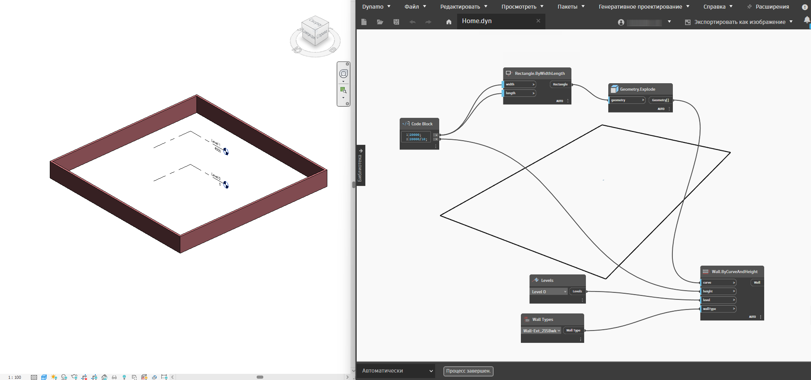

# Dynamo 整合

您已經找到 Dynamo 視覺程式設計語言的整合文件。

本指南將探討如何在應用程式中主控 Dynamo 的各種面向，讓使用者能夠使用視覺程式設計與應用程式互動。

內容：

* [本簡介](13-dynamo-integration.md#dynamo-integration) 重點概述本指南涵蓋的內容，以及關於 Dynamo 的所有內容。
* [Dynamo 自訂進入點](13-dynamo-integration.md#dynamo-custom-entry-point) 如何建立 DynamoModel 以及如何開始。
* [元素繫結和追蹤](13-dynamo-integration.md#-element-binding-and-trace) 使用 Dynamo 的追蹤機制，將圖表中的節點繫結至主體中的結果。
* [Dynamo Revit Selection 節點](13-dynamo-integration.md#-dynamo-revit-selection-nodes) 如何實作節點，讓使用者選取主體中的物件或資料，並將其作為輸入傳入 Dynamo 圖表。
* [Dynamo 內建套件概述](13-dynamo-integration.md#dynamo-built-in-packages-overview) 什麼是 Dynamo 標準資源庫，以及如何使用底層機制透過整合方式遞送套件。

**一些用語：**

我們將在這些文件中交替使用 Dynamo 腳本、圖表和程式這幾個詞彙，來指稱使用者在 Dynamo 中建立的程式碼。

## Dynamo 自訂進入點

#### 以 Dynamo Revit 作為範例

[https://github.com/DynamoDS/DynamoRevit/blob/master/src/DynamoRevit/DynamoRevit.cs#L534](https://github.com/DynamoDS/DynamoRevit/blob/master/src/DynamoRevit/DynamoRevit.cs#L534)

`DynamoModel` 是主控 Dynamo 之某個應用程式的進入點 - 它代表的是一個 Dynamo 應用程式。模型是頂層根物件，此物件會參考組成 Dynamo 應用程式和 DesignScript 虛擬機器的其他重要資料結構和物件。

建構 `DynamoModel` 時，會使用規劃物件來設定上面的一般參數。

本文件中的範例取材自 DynamoRevit 實作，Revit 在此整合中主控 `DynamoModel` 作為增益集。(適用於 Revit 的外掛程式架構)。載入此增益集時，它會啟動一個 `DynamoModel`，然後使用 `DynamoView` 和 `DynamoViewModel` 向使用者顯示。

Dynamo 是一種 C# .NET 專案，若要在應用程式的程序中使用它，您必須能夠主控和執行 .NET 程式碼。

DynamoCore 是一個跨平台的計算引擎和核心模型集合，可使用 .NET 或 Mono (在未來的 .NET Core 中) 建置。但 DynamoCoreWPF 包含 Dynamo 僅限 Windows 的 UI 元件，無法在其他平台編譯。

### 自訂 Dynamo 進入點的步驟

若要初始化 `DynamoModel`，整合者必須在主體程式碼中的某個位置執行這些步驟。

### 從主體預先載入共用的 Dynamo Dll。

D4R 中的清單目前只包含 `Revit\SDA\bin\ICSharpCode.AvalonEdit.dll.` 這樣做是為了避免 Dynamo 與 Revit 之間的資源庫版本發生衝突。例如，當 `AvalonEdit` 發生衝突時，Code Block 的功能可能會被完全破壞。此問題已在 Dynamo 1.1.x https://github.com/DynamoDS/Dynamo/issues/7130 中進行回報，也可手動重現。如果整合者發現主體函數和 Dynamo 之間發生資源庫衝突，建議首先執行此作業。有時必須執行此作業，來阻止其他外掛程式或主體應用程式本身載入與共用相依性不相容的版本。更好的解決方式是讓版本一致來解決版本衝突 - 或者如果可能，在主體的 app.config 中使用 .net 繫結重新導向。

### 載入 ASM

#### 什麼是 ASM 和 LibG

ASM 是建置 Dynamo 的基礎 ADSK 幾何圖形資源庫。

LibG 是包裝 ASM 幾何圖形核心的 .Net 人性化包裝函式。libG 與 ASM 共用其版本控制配置 - 它使用與 ASM 相同的主要和次要版本號碼，來指出它是特定 ASM 版本的對應包裝函式。如果給定 ASM 版本，對應的 libG 版本應該相同。在大多數情況下，LibG 應該可以搭配特定主要版本的所有 ASM 版本運作。例如 LibG 223，應該能夠載入任何 ASM 223 版本。

#### Dynamo Sandbox 載入 ASM

Dynamo Sandbox 設計的目的是為了能夠使用多個 ASM 版本，為了達到這個目的，會將多個 libG 版本捆綁在一起並隨核心一起遞送。Dynamo Shape Manager 中提供內建功能，可搜尋 ASM 隨附的 Autodesk 產品，因此 Dynamo 可以從這些產品載入 ASM，讓幾何圖形節點無需明確載入至主體應用程式即可運作。目前存在的產品清單為：

```
private static readonly List<string> ProductsWithASM = new List<string>() 

 { "Revit", "Civil", "Robot Structural Analysis", "FormIt" }; 
```

Dynamo 會搜尋 Windows 登錄，尋找此清單中的 Autodesk 產品是否已安裝在使用者的電腦上 (如果已安裝其中任何一個)，接著會搜尋 ASM 二進位檔，取得版本並尋找 Dynamo 中對應的 libG 版本。

找到 ASM 版本後，以下 ShapeManager API 將挑選要載入的對應 libG 預載程式位置。如果有確切符合的版本，則會使用該版本，否則會載入最接近的較低版次，但主要版本相同的 libG。

例如，如果 Dynamo 與有較新版 ASM 建置版本 225.3.0 的 Revit 開發建置版本整合，Dynamo 會嘗試使用 libG 225.3.0 (如果有)，否則會嘗試使用小於其首選的最接近主要版本，即 225.0.0。

`public static string GetLibGPreloaderLocation(Version asmVersion, string dynRootFolder)`

#### Dynamo 程序內整合從主體載入 ASM

Revit 是 ASM 產品搜尋清單中的第一個項目，這表示預設情況下，`DynamoSandbox.exe` 會先嘗試從 Revit 載入 ASM，我們仍需要確保整合的 D4R 工作階段作業會從目前 Revit 主體載入 ASM：例如，如果使用者電腦同時有 R2018 和 R2020，則從 R2020 啟動 D4R 時，D4R 應使用 R2020 的 ASM 225，而不是 R2018 的 ASM 223。整合者需要實作類似下列內容的呼叫，以強制載入其指定的版本。

```
internal static Version PreloadAsmFromRevit() 

{ 

     var asmLocation = AppDomain.CurrentDomain.BaseDirectory; 
     Version libGVersion = findRevitASMVersion(asmLocation); 
     var dynCorePath = DynamoRevitApp.DynamoCorePath; 
     var preloaderLocation = DynamoShapeManager.Utilities.GetLibGPreloaderLocation(libGVersion, dynCorePath); 
     Version preLoadLibGVersion = PreloadLibGVersion(preloaderLocation); 
     DynamoShapeManager.Utilities.PreloadAsmFromPath(preloaderLocation, asmLocation); 
     return preLoadLibGVersion; 

} 
```

#### Dynamo 從自訂路徑載入 ASM

我們最近增加 `DynamoSandbox.exe` 和 `DynamoCLI.exe` 載入特定 ASM 版本的功能。若要略過正常的登錄搜尋行為，您可以使用 `�gp` 旗標強制 Dynamo 從特定路徑載入 ASM。

`DynamoSandbox.exe -gp �somePath/To/ASMDirectory/�`

### 建立 StartConfiguration

使用 StartupConfiguration 的方式是作為參數傳入來初始化 DynamoModel，這表示它包含您想要如何自訂 Dynamo 階段作業設定的幾乎所有定義。根據以下性質的設定方式，Dynamo 整合可能會因不同的整合者而異。例如，不同的整合者可能會設定不同的 python 樣板路徑，或顯示的數值格式。

包括以下內容：

* DynamoCorePath // 載入 DynamoCore 二進位檔所在的位置。
* DynamoHostPath // Dynamo 整合二進位檔所在的位置。
* GeometryFactoryPath // 載入的 libG 二進位檔所在的位置。
* PathResolver //協助解析各種檔案的物件。
* PreloadLibraryPaths // 預載節點二進位檔 (例如 DSOffice.dll) 所在的位置。
* AdditionalNodeDirectories // 其他節點二進位檔所在的位置。
* AdditionalResolutionPaths // 載入資源庫時可能需要的其他相依性的額外組合解決方案路徑。
* UserDataRootFolder // 使用者資料資料夾，例如 `"AppData\Roaming\Dynamo\Dynamo Revit"`。
* CommonDataRootFolder // 用於儲存自訂定義、範例等的預設資料夾。
* Context // 整合者主體名稱 + 版本 `(Revit<BuildNum>)`。
* SchedulerThread // 實作 `ISchedulerThread` 的整合者排程器執行緒 - 對於大多數整合者而言，這是主要 UI 執行緒或可存取其 API 的任何執行緒。
* StartInTestMode // 目前階段作業是否為測試自動化階段作業 - 修改一堆 Dynamo 行為 - 除非您正在撰寫測試，否則請不要使用。
* AuthProvider // 整合者的 IAuthProvider 實作，例如 RevitOxygenProvider 實作是在 Greg.dll - 用於 packageManager 上傳整合。

### 偏好

預設偏好設定路徑由 `PathManager.PreferenceFilePath` (例如 `"AppData\\Roaming\\Dynamo\\Dynamo Revit\\2.5\\DynamoSettings.xml"`) 管理。整合者可以決定是否也要將自訂的偏好設定檔案遞送到需要與路徑管理員一致的位置。以下是序列化的偏好設定性質：

* IsFirstRun // 表示是否是第一次執行此版本的 Dynamo，例如用於判斷是否需要顯示 GA 選擇加入/退出訊息。也會用於判斷在啟動新的 Dynamo 版本時，是否需要移轉舊式 Dynamo 偏好設定，讓使用者獲得一致的體驗。
* IsUsageReportingApproved // 指出使用情況報告是否已核准。
* IsAnalyticsReportingApproved // 指出分析報告是否已核准。
* LibraryWidth // Dynamo 左側資源庫面板的寬度。
* ConsoleHeight // 主控台顯示的高度。
* ShowPreviewBubbles // 指出是否應顯示預覽標示圈。
* ShowConnector // 指出是否顯示連接器。
* ConnectorType // 指出連接器類型：Bezier 或 Polyline (聚合線)。
* BackgroundPreviews // 指出指定背景預覽的作用中狀態。
* RenderPrecision // 彩現精確度等級 - 越低表示會產生三角形數越少的網格。越高表示會在背景預覽中產生越平滑的幾何圖形。128 對於預覽幾何圖形是一個很適合可靠的數字。
* ShowEdges // 指出是否將彩現曲面和實體邊。
* ShowDetailedLayout // 未使用。
* WindowX、WindowY // Dynamo 視窗的最後 X、Y 座標。
* WindowW、WindowH // Dynamo 視窗的最後寬度、高度。
* UseHardwareAcceleration // Dynamo 是否應使用硬體加速 (如果支援)。
* NumberFormat // 用於在預覽標示圈 toString() 中顯示數字的小數精確度。
* MaxNumRecentFiles // 要儲存的最近檔案路徑最大數目。
* RecentFiles // 最近開啟的檔案路徑清單，修改此設定會直接影響 Dynamo 開始頁面中的最近使用檔案清單。
* BackupFiles // 備份檔案路徑清單。
* CustomPackageFolders // 包含 zero-touch 二進位檔和目錄路徑的資料夾清單，系統會掃描這些資料夾中是否有套件和自訂節點。
* PackageDirectoriesToUninstall // Package Manager 用來判斷哪些套件被標記為刪除的套件清單。在 Dynamo 啟動期間會刪除這些路徑 (如果可以)。
* PythonTemplateFilePath // 建立新的 PythonScript 節點時用作起始樣板的 Python (.py) 檔案路徑 - 可用來設定自訂 Python 樣板以進行整合。
* BackupInterval // 指出自動儲存圖表的時間長度 (以毫秒為單位)。
* BackupFilesCount // 指出要進行的備份數量。
* PackageDownloadTouAccepted // 指出使用者是否已接受使用條款從 Package Manager 下載套件。
* OpenFileInManualExecutionMode // 指出「開啟檔案」對話方塊中「以手動模式開啟」勾選方塊的預設狀態。
* NamespacesToExcludeFromLibrary // 指出哪些名稱空間 (如果有) 不應顯示在 Dynamo 節點資源庫中。字串格式："[資源庫名稱]:[完整名稱空間]"。

序列化偏好設定的範例：

```xml
<PreferenceSettings xmlns:xsd="http://www.w3.org/2001/XMLSchema" xmlns:xsi="http://www.w3.org/2001/XMLSchema-instance"> 

<IsFirstRun>false</IsFirstRun> 

<IsUsageReportingApproved>false</IsUsageReportingApproved> 

<IsAnalyticsReportingApproved>false</IsAnalyticsReportingApproved> 

<LibraryWidth>204</LibraryWidth> 

<ConsoleHeight>0</ConsoleHeight> 

<ShowPreviewBubbles>true</ShowPreviewBubbles> 

<ShowConnector>true</ShowConnector> 

<ConnectorType>BEZIER</ConnectorType> 

<BackgroundPreviews> 

<BackgroundPreviewActiveState> 

<Name>IsBackgroundPreviewActive</Name> 

<IsActive>true</IsActive> 

</BackgroundPreviewActiveState> 

<BackgroundPreviewActiveState> 

<Name>IsRevitBackgroundPreviewActive</Name> 

<IsActive>true</IsActive> 

</BackgroundPreviewActiveState> 

</BackgroundPreviews> 

<IsBackgroundGridVisible>true</IsBackgroundGridVisible> 

<RenderPrecision>128</RenderPrecision> 

<ShowEdges>false</ShowEdges> 

<ShowDetailedLayout>true</ShowDetailedLayout> 

<WindowX>553</WindowX> 

<WindowY>199</WindowY> 

<WindowW>800</WindowW> 

<WindowH>676</WindowH> 

<UseHardwareAcceleration>true</UseHardwareAcceleration> 

<NumberFormat>f3</NumberFormat> 

<MaxNumRecentFiles>10</MaxNumRecentFiles> 

<RecentFiles> 

<string></string> 

</RecentFiles> 

<BackupFiles> 

<string>..AppData\Roaming\Dynamo\Dynamo Revit\backup\backup.DYN</string> 

</BackupFiles> 

<CustomPackageFolders> 

<string>..AppData\Roaming\Dynamo\Dynamo Revit\2.5</string> 

</CustomPackageFolders> 

<PackageDirectoriesToUninstall /> 

<PythonTemplateFilePath /> 

<BackupInterval>60000</BackupInterval> 

<BackupFilesCount>1</BackupFilesCount> 

<PackageDownloadTouAccepted>true</PackageDownloadTouAccepted> 

<OpenFileInManualExecutionMode>false</OpenFileInManualExecutionMode> 

<NamespacesToExcludeFromLibrary> 

<string>ProtoGeometry.dll:Autodesk.DesignScript.Geometry.TSpline</string> 

</NamespacesToExcludeFromLibrary> 

</PreferenceSettings> 
```

* Extensions // 實作 IExtension 的延伸清單，如果為空值，Dynamo 將從預設路徑 (Dynamo 資料夾下的 `extensions` 資料夾) 載入延伸。
* IsHeadless // 指出 Dynamo 是否在沒有 UI 的情況下啟動，供分析之用。
* UpdateManager // 整合者的 UpdateManager 實作，請參閱上面的描述。
* ProcessMode // 相當於 TaskProcessMode，如果在測試模式下為 Synchronous (同步)，否則為 Asynchronous (非同步) - 這會控制排程器的行為。單一執行緒的環境也可能將此設定為同步。

使用目標 StartConfiguration 啟動 `DynamoModel`

當 StartConfig 傳入以啟動 `DynamoModel` 後，DynamoCore 會監督實際的細節，確保 Dynamo 階段作業使用指定的詳細資料正確初始化。`DynamoModel` 初始化後，個別整合者還需要執行一些設定後的步驟，例如，在 D4R 中訂閱事件以監視 Revit 主體交易或文件更新、Python 節點自訂等。

### 讓我們進入「視覺程式設計」部分

若要初始化 `DynamoViewModel` 和 `DynamoView`，您需要先建構 `DynamoViewModel` - 使用 `DynamoViewModel.Start` 靜態方法可以完成。請參閱以下內容：

```c#

    viewModel = DynamoViewModel.Start(
                    new DynamoViewModel.StartConfiguration()
                    {
                        CommandFilePath = commandFilePath,
                        DynamoModel = model,
                        Watch3DViewModel = 
                            HelixWatch3DViewModel.TryCreateHelixWatch3DViewModel(
                                null,
                                new Watch3DViewModelStartupParams(model), 
                                model.Logger),
                        ShowLogin = true
                    });
     
     var view = new DynamoView(viewModel);

```

`DynamoViewModel.StartConfiguration` 的選項比模型的規劃少得多。這些選項通常不需要加以說明 - 除非您正在撰寫測試案例，否則可以忽略 `CommandFilePath`。

`Watch3DViewModel` 參數控制背景預覽和 watch3d 節點如何顯示 3D 幾何圖形。如果要實作必要的介面，可以使用您自己的實作。

若要建構 `DynamoView`，只需要 `DynamoViewModel`。View 是一個視窗控制項，可以使用 WPF 來顯示。

### DynamoSandbox.exe 範例：

DynamoSandbox.exe 是一個開發環境，用來測試、使用和試驗 DynamoCore。這個範例很適合用來瞭解如何載入和設置 `DynamoCore` 和 `DynamoCoreWPF` 元件。[此處](https://github.com/DynamoDS/Dynamo/blob/master/src/DynamoSandbox/DynamoCoreSetup.cs#L37)可以看到一些進入點

## 元素繫結和追蹤

#### 概述

_追蹤_ 是 Dynamo 核心中的一種機制，能夠將資料序列化至 .dyn (dynamo 檔案)。最重要的是，此資料會輸入到 Dynamo 圖表中節點的呼叫點 (Callsite)。

在磁碟中開啟 Dynamo 圖表時，其中儲存的追蹤資料會與圖表的節點重新建立關聯。

#### 詞彙：

* 追蹤機制：
  * 在 Dynamo 中實作元素繫結
  * 追蹤機制可用於確保物件重新繫結到它們建立的幾何圖形
  * Callsite 和追蹤機制會處理提供永久的 GUID，節點實作程式可使用此 GUID 重新連結
* Callsite
  * 可執行檔包含多個 Callsite。這些 Callsite 用於將執行作業分派到需要分派的各個位置：
    * C# 資源庫
    * 內建方法
    * DesignScript 函數
    * 自訂節點 (DS 函數)
* TraceSerializer
  * 將 `ISerializable` 和`[Serializable]` 標記的類別序列化為追蹤。
  * 將資料的序列化和還原序列化處理到追蹤中。
  * TraceBinder 控制將還原序列化的資料繫結到執行階段類型。(建立真實類別的例證)

#### 運作方式為何？

***

追蹤資料會序列化到 .dyn 檔案中名為 Bindings 的性質內。這是一個 callsite-id -> 資料的陣列。callsite 是在 designscript 虛擬機器中呼叫節點的特定位置/例證。值得一提的是，Dynamo 圖表中的節點可能會被呼叫多次，因此可能會為單一節點例證建立多個 callsite。

```json
"Bindings": [
    {
      "NodeId": "1e83cc25-7de6-4a7c-a702-600b79aa194d",
      "Binding": {
        "WrapperObject_InClassDecl-1_InFunctionScope-1_Instance0_1e83cc25-7de6-4a7c-a702-600b79aa194d":  "Base64 Encoded Data"
      }
    },
    {
      "NodeId": "c69c7bec-d54b-4ead-aea8-a3f45bea9ab2",
      "Binding": {
        "WrapperObject_InClassDecl-1_InFunctionScope-1_Instance0_c69c7bec-d54b-4ead-aea8-a3f45bea9ab2": "Base64 Encoded Data"
      }
    }
  ],

 
```

_不_ 建議依賴序列化的 base64 編碼資料的格式。

#### 我們要解決的問題。

***

由於函數執行而想要儲存任意資料的原因有很多，但在這種情況下，開發追蹤是為了解決使用者在建置和反覆運算於主體應用程式中建立元素的軟體程式時經常遇到的特定問題。

這是我們稱為 `Element Binding` 的問題，構想如下：

當使用者開發和執行 Dynamo 圖表時，他們可能會在主體應用程式模型中產生新元素。以我們的例子來說，假設使用者有一個小程式，在建築模型中產生 100 扇門。這些門的數量和位置由他們的程式控制。

使用者第一次執行程式時，會產生這 100 扇門。

之後，當使用者修改程式的輸入並重新執行時 - 他們的程式會 _(在沒有元素繫結的情況下)_ 建立 100 扇新門，舊門會和新門一起在模型中。

***

由於 Dynamo 是一個即時程式設計環境，且具有 `"Automatic"` 執行模式 (圖表的變更會觸發新的執行)，因此很快就會讓具有許多程式執行結果的模型變得雜亂。

我們發現這通常不是使用者期望的結果，而是啟用元素繫結後，圖表之前執行的結果會進行清理、刪除或修改。執行哪一種動作 (_刪除或修改_) 則取決於主體 API 的靈活性。啟用元素繫結後，在執行使用者的 Dynamo 程式第 2 次、第 3 次或甚至第 50 次後，模型中只會有 100 扇門。

這不僅僅只是需要能夠將資料序列化到 .dyn 檔案 - 您會在下面看到，DynamoRevit 中有一些基於追蹤建置的機制，可以支援這些重新繫結的工作流程。

***

現在來說明 Revit 等主體的元素繫結的其他重要使用案例。因為啟用元素繫結後建立的元素會嘗試保留既有的元素 ID (修改既有元素)，所以 Dynamo 程式執行後，在主體應用程式中基於這些元素建置的邏輯仍會留存。例如：

回到我們的建築模型範例。

我們先執行一個停用元素繫結的範例 - 這次使用者有一個程式會產生一些建築牆。

他們執行程式，在主體應用程式中產生一些牆。然後他們離開 Dynamo 圖表，使用一般 Revit 工具，將一些窗戶放入這些牆。窗戶會繫結到這些特定的牆，成為 Revit 模型的一部分。

使用者開始回到 Dynamo 並再次執行圖表 - 現在，就像我們上一個範例，他們有兩組牆。第一組牆有窗戶，但新牆沒有。

如果啟用了元素繫結，我們可以在沒有 Dynamo 的情況下，保留在主體應用程式中手動完成的既有工作。例如，如果在使用者第二次執行程式時啟用了繫結，則會修改牆而不是刪除牆，並且會保留在主體應用程式中所做的下游變更。模型會包含有窗戶的牆，而不是兩組不同狀態的牆。

***



#### 元素繫結與追蹤的比較

***

追蹤是 Dynamo 核心中的一種機制 - 它會利用資料呼叫點的靜態變數，將您的資料對應到圖表中函數的呼叫點，如上所述。

它還可讓您在寫入 zero touch Dynamo 節點時，將任意資料序列化至 .dyn 檔案。通常不建議這樣做，因為這意味著可能可轉移的 zero touch 程式碼現在會依賴 Dynamo 核心。

不要依賴 .dyn 檔案中資料的序列化格式 - 請改用 [Serializable] 屬性和介面

另一方面，ElementBinding 是建置在追蹤 API 之上，並實作在 Dynamo 整合 _(DynamoRevit、Dynamo4Civil 等)_ 中。

#### 追蹤 API

建議您瞭解追蹤 API 的一些粗略知識，包括：

```c#
public static ISerializable GetTraceData(string key)
///Returns the data that is bound to a particular key

public static void SetTraceData(string key, ISerializable value)
///Set the data bound to a particular key
```

您可以在以下範例中看到這些內容

若要與 Dynamo 從既有檔案載入或正在產生的追蹤資料進行互動，您可以查看：

```c#
 public IDictionary<Guid, List<CallSite.RawTraceData>> 
 GetTraceDataForNodes(IEnumerable<Guid> nodeGuids, Executable executable)
```

[GetTraceDataForNodes](https://github.com/DynamoDS/Dynamo/blob/master/src/Engine/ProtoCore/RuntimeData.cs#L218)

[RuntimeTrace.cs](https://github.com/DynamoDS/Dynamo/blob/master/src/Engine/ProtoCore/RuntimeData.cs)

#### 來自節點的簡單追蹤範例

***

[DynamoSamples 儲存庫](https://github.com/DynamoDS/DynamoSamples/blob/master/src/SampleLibraryZeroTouch/Examples/TraceExample.cs)中提供一個直接使用追蹤的 Dynamo 節點範例

該處的類別摘要解釋追蹤的相關要點：

```
  /*
     * After a graph update, Dynamo typically disposes of all
     * objects created during the graph update. But what if there are 
     * objects which are expensive to re-create, or which have other
     * associations in a host application? You wouldn't want those those objects
     * re-created on every graph update. For example, you might 
     * have an external database whose records contain data which needs
     * to be re-applied to an object when it is created in Dynamo.
     * In this example, we use a wrapper class, TraceExampleWrapper, to create 
     * TraceExampleItem objects which are stored in a static dictionary 
     * (they could be stored in a database as well). On subsequent graph updates, 
     * the objects will be retrieved from the data store using a trace id stored 
     * in the trace cache.
     */
```

此範例直接使用 DynamoCore 中的追蹤 API，每當特定節點執行時就儲存某些資料。在這種情況下，字典扮演主體應用程式模型的角色，就像 Revit 的模型資料庫一樣。

粗略的設置是：

將靜態 util 類別 `TraceExampleWrapper` 作為節點匯入 Dynamo。它包含建立 `TraceExampleItem` 的單一方法 `ByString` - 這些是包含 `description` 性質的一般 .NET 物件。

每個 `TraceExampleItem` 都序列化為以 `TraceableId` 表示的追蹤 - 這只是一個包含 `IntId` (標記為 `[Serializeable]`) 的類別，因此可以使用 `SOAP` 格式化程式進行序列化。請參閱[此處，以取得有關可序列化屬性的更多資訊](https://docs.microsoft.com/zh-tw/dotnet/api/system.serializableattribute?view=netframework-4.8)

您也必須實作[此處](https://docs.microsoft.com/zh-tw/dotnet/api/system.runtime.serialization.iserializable?view=netframework-4.8)定義的 `ISerializable` 介面

```c#
    [IsVisibleInDynamoLibrary(false)]
    [Serializable]
    public class TraceableId : ISerializable
    {
    }
```

此類別是針對我們希望儲存到追蹤中的每個 `TraceExampleItem` 而建立、經過序列化、base64 編碼，並在圖表儲存時儲存到磁碟，讓繫結可以重新建立關聯，即使之後基於既有元素字典重新開啟圖表時也是如此。在此範例中無法運作得很好，因為字典並不像 Revit 文件一樣持久。

最後，方程式的最後一部分是 `TraceableObjectManager`，類似於 `DynamoRevit` 中的 `ElementBinder` - 它管理主體文件模型中的物件與我們在 Dynamo 追蹤中儲存的資料之間的關係。

使用者第一次執行包含 `TraceExampleWrapper.ByString` 節點的圖表時，會使用新 ID 建立新的 `TraceableId`，`TraceExampleItem` 會儲存在對應至該新 ID 的字典中，我們會在追蹤中儲存 `TraceableID`。

下次執行圖表時，我們會尋找追蹤，找到儲存在該處的 ID，找到對應到該 ID 的物件，然後傳回該物件！我們是修改既有的物件而不是建立全新的物件。

連續兩次執行建立單一 `TraceExampleItem` 的圖表，流程會像這樣：


下一個範例以更真實的 DynamoRevit 節點使用案例說明相同的想法。

#### 追蹤圖

 

#### 注意事項：

在 Dynamo 的最新版本中，TLS (執行緒本端儲存) 使用已取代為靜態成員使用。

#### 元素繫結實作範例

***

我們快速看一下為 DynamoRevit 實作使用元素繫結的節點時會如何，這類似上面給定牆建立範例中使用的節點類型。

***

```c#
    private void InitWall(Curve curve, Autodesk.Revit.DB.WallType wallType, Autodesk.Revit.DB.Level baseLevel, double height, double offset, bool flip, bool isStructural)
        {
            // This creates a new wall and deletes the old one
            TransactionManager.Instance.EnsureInTransaction(Document);

            //Phase 1 - Check to see if the object exists and should be rebound
            var wallElem =
                ElementBinder.GetElementFromTrace<Autodesk.Revit.DB.Wall>(Document);

            bool successfullyUsedExistingWall = false;
            //There was a modelcurve, try and set sketch plane
            // if you can't, rebuild 
            if (wallElem != null && wallElem.Location is Autodesk.Revit.DB.LocationCurve)
            {
                var wallLocation = wallElem.Location as Autodesk.Revit.DB.LocationCurve;
                <SNIP>

                    if(!CurveUtils.CurvesAreSimilar(wallLocation.Curve, curve))
                        wallLocation.Curve = curve;

                  <SNIP>
                
            }

            var wall = successfullyUsedExistingWall ? wallElem :
                     Autodesk.Revit.DB.Wall.Create(Document, curve, wallType.Id, baseLevel.Id, height, offset, flip, isStructural);
            InternalSetWall(wall);

            TransactionManager.Instance.TransactionTaskDone();

            // delete the element stored in trace and add this new one
            ElementBinder.CleanupAndSetElementForTrace(Document, InternalWall);
        }
```

上面的程式碼說明牆元素的範例建構函式 - 在 Dynamo 中會從某個節點 (如 `Wall.byParams`) 呼叫此建構函式

建構函數執行與元素繫結相關的重要階段是：

1. 使用 `elementBinder` 檢查是否有任何之前建立的物件在之前的執行中繫結到此 Callsite。`ElementBinder.GetElementFromTrace<Autodesk.Revit.DB.Wall>`
2. 如果是，則嘗試修改該面牆而不是建立新牆。

```c#
 if(!CurveUtils.CurvesAreSimilar(wallLocation.Curve, curve))
                        wallLocation.Curve = curve;
```

3. 否則建立新牆。

```c#
  var wall = successfullyUsedExistingWall ? wallElem :
                     Autodesk.Revit.DB.Wall.Create(Document, curve, wallType.Id, baseLevel.Id, height, offset, flip, isStructural);
                     
```

4. 刪除我們剛剛從追蹤中擷取的舊元素，然後加入我們的新元素，讓我們將來可以尋找此元素：

```c#
 ElementBinder.CleanupAndSetElementForTrace(Document, InternalWall);
```

### 討論

#### 效率

* 目前，每個序列化追蹤物件都是使用 SOAP xml 格式進行序列化 - 這非常詳細，並且重複了很多資訊。然後資料會經過 base64 編碼兩次 - 這在序列化或還原序列化方面效率不高。如果內部格式不是基於此而建立，將來可以改進這一點。同樣地，我們再說一遍，不要依賴靜態序列化資料的格式。

#### ElementBinding 預設應該開啟嗎？

* 有一些使用案例不需要元素繫結。例如一個使用案例是，一位資深 Dynamo 使用者在開發一個程式，要執行多次以產生隨機分組元素。程式的目的就是每次執行程式時都要額外建立元素。如果沒有停止元素繫結運作的解決方法，這個使用案例就不容易達成。也許可以在整合層級就停用 elementBinding- 但這可能應該是核心 Dynamo 功能。目前還不清楚此功能應該引入的層級：節點層級？Callsite 層級？整個 Dynamo 工作階段？工作區？等等。

## Dynamo Revit Selection 節點 (這是什麼？)

這些節點通常可讓使用者以某種方式描述他們希望參考的一組作用中 Revit 文件。使用者參考 Revit 元素的方式有許多種 (如下所述)，節點的結果輸出可能是 Revit 元素包裝函式 (DynamoRevit 包裝函式)，也可能是某些 Dynamo 幾何圖形 (從 Revit 幾何圖形轉換)。在其他主體整合的環境中進行考量時，瞭解這些輸出類型之間的差異會很有用。

概括來說，**說明這些節點概念的一個好方法是將節點當作函數，此函數會接受元素 ID，然後傳回指向該元素的指標，或表示該元素的某個幾何圖形。**

DynamoRevit 中有多個 `�Selection�` 節點，我們可以將這些節點至少分為兩組：


1.  使用者點選 UI：

    此品類中的範例 `DynamoRevit` 節點是 `SelectModelElement`、`SelectElementFace`

    這些節點可讓使用者切換到 Revit UI 環境，然後選取一個元素或一組元素，程式會擷取這些元素的 ID，然後執行某個轉換函數 - 可以是建立包裝函式，或是從元素擷取並轉換幾何圖形。執行的轉換取決於使用者選擇的節點類型。
2.  文件查詢：

    此品類中的範例節點是 `AllElementsOfClass`、`AllElementsOfCategory`

    這些節點可讓使用者在整個文件中查詢一組元素，這些節點通常會傳回指向基礎 Revit 元素的包裝函式。這些包裝函式是 DynamoRevit 體驗不可或缺的一部分，允許使用更進階的功能 (例如元素繫結)，並允許 Dynamo 整合者挑選哪些主體 API 會以節點的形式公開給使用者。

### Dynamo Revit 使用者工作流程：

#### 範例案例

1.
   * 使用者使用 `SelectModelElement` 選取一面 Revit 牆 - 一個 Dynamo 牆包裝函式傳回到圖表中 (在節點的預覽標示圈中可見)
   * 使用者放置 Element.Geometry 節點，並將 `SelectModelElement` 輸出連接到此新節點 - 使用 libG API 擷取包裝後的牆的幾何圖形，並轉換為 Dynamo 幾何圖形。
   * 使用者將圖表切換到自動執行模式。
   * 使用者在 Revit 中修改原始牆。
   * 圖表自動重新執行，因為 Revit 文件引發某些元素已更新的事件，Selection 節點監看此事件，並看到它所選取元素的 ID 已修改。

### DynamoCivil 使用者工作流程：

D4C 中的工作流程與上述針對 Revit 的描述非常類似，以下是 D4C 中兩組典型的 Selection 節點：


### 問題：

*   由於 `DynamoRevit` 中的 Selection 節點實作文件修改更新程式，因此很容易建置無限迴圈：請想像一個節點監看所有元素的文件，然後在此節點下游的某個位置建立新元素。此程式在執行時會觸發迴圈。`DynamoRevit` 會嘗試使用交易 ID 以各種方式擷取這些案例，並避免在元素建構函式輸入未變更時修改文件。

    如果在主體應用程式中修改所選元素時啟動圖表的自動執行，則需要考慮這一點！
* `DynamoRevit` 中的 Selection 節點是在參考 WPF 的 `RevitUINodes.dll` 專案中實作 (這可能不是問題)，但取決於您的目標平台。

### 資料流程圖


### 技術實作：(參考上圖)：

透過從一般 `SelectionBase` 類型 `SelectionBase<TSelection, TResult>` 和一組最少的成員數繼承來實作 Selection 節點：

* 實作 `BuildOutputAST` 方法 - 此方法在節點要執行時需要傳回一個 AST，這會在將來某個時間點執行。如果是 Selection 節點，它應該從元素 ID 傳回元素或幾何圖形。https://github.com/DynamoDS/DynamoRevit/blob/master/src/Libraries/RevitNodesUI/Selection.cs#L280
* 實作 `BuildOutputAST` 是實作 `NodeModel` / UI 節點最困難的一個部分。最好將盡可能多的邏輯放入 C# 函數中，並簡單地將 AST 函數呼叫節點嵌入到 AST 中。請注意，這裡的 `node` 是抽象語法樹中的 AST 節點，而不是 Dynamo 圖表中的節點。


* 序列化 -
  *   因為這些是明確的 `NodeModel` 衍生類型 (不是 ZeroTouch)，所以它們還需要實作一個 [JsonConstructor]，在從 .dyn 檔案還原序列化節點期間使用。

      主體的元素參考應儲存至 .dyn 檔案，以便在使用者開啟包含此節點的圖表時，仍會設定其選取。Dynamo 中的 NodeModel 節點會使用 json.net 進行序列化，任何公用性質都將使用 Json.net 自動序列化 - 請使用 [JsonIgnore] 屬性只序列化必要的性質。
* 文件查詢節點稍微簡單一些，因為它們不需要將參考儲存到任何元素 ID，請參閱下面瞭解 `ElementQueryBase` 類別和衍生類別的實作。執行時，這些節點會呼叫 Revit API 並查詢基礎文件中的元素，並執行前面提到的轉換，轉換成幾何圖形或 Revit 元素包裝函式。

### 參考文獻：

#### DynamoCore 基準類別：

* [https://github.com/DynamoDS/Dynamo/blob/ec10f936824152e7dd7d6d019efdcda0d78a5264/src/Libraries/CoreNodeModels/Selection.cs](https://github.com/DynamoDS/Dynamo/blob/ec10f936824152e7dd7d6d019efdcda0d78a5264/src/Libraries/CoreNodeModels/Selection.cs)
* [NodeModel 案例研究 - 自訂使用者介面](11_developer_primer/3_developing_for_dynamo/5-nodemodel-case-study-custom-ui.md)
* [針對 Dynamo 2.x 更新您的套件和 Dynamo 資源庫](11_developer_primer/3_developing_for_dynamo/6-updating-your-packages-and-dynamo-libraries-for-dynamo-2x.md)
* [針對 Dynamo 3.x 更新套件與 Dynamo 資料庫](11_developer_primer/3_developing_for_dynamo/updating-your-packages-and-dynamo-libraries-for-dynamo-3x-Net8.md)

#### DynamoRevit：

* [https://github.com/DynamoDS/DynamoRevit/blob/master/src/Libraries/RevitNodesUI/Selection.cs](https://github.com/DynamoDS/DynamoRevit/blob/master/src/Libraries/RevitNodesUI/Selection.cs)
* [https://github.com/DynamoDS/DynamoRevit/blob/master/src/Libraries/RevitNodesUI/Elements.cs](https://github.com/DynamoDS/DynamoRevit/blob/master/src/Libraries/RevitNodesUI/Elements.cs)

## Dynamo 內建套件概述

內建套件機制旨在透過利用 `PackageLoader` 和 `PackageManager` 延伸實作的 Dynamo 套件載入功能，將更多節點內容與 Dynamo Core 綁定，而不延伸核心本身。

在本文件中，我們將交互使用「內建套件」和「Dynamo 內建套件」詞彙來表示相同的內容。

### 我應該將套件以「內建套件」方式遞送嗎？

* 套件必須具有簽章的二進位進入點，否則不會載入。
* 請盡可能避免這些套件中出現重大變更。這表示套件內容應該經過自動測試。
* 語義版本控制，建議使用語義版本控制架構對套件進行版本控制，並在套件描述或文件中傳達給使用者。
* 自動化測試！請參閱上文，如果使用「內建套件」機制包含套件，對使用者而言它就是產品的一部分，應該像產品一樣進行測試。
* 高層次的潤飾：圖示、節點文件、本地化的內容。
* 請勿遞送您或您的團隊無法維護的套件。
* 請勿以這種方式遞送第三方套件 (參閱上文)。

基本上，您應該要能夠對套件有完整的控制權、進行修復、持續更新，並根據 Dynamo 和產品中的最新變更進行測試。您也需要能夠對其進行簽章。

### 內建套件與主體整合特定套件

我們打算讓 `Built-In Packages` 成為核心功能，即使沒有 Package Manager 的存取權，所有使用者也都能存取這一組套件。目前支援此功能的底層機制是，直接在 Dynamo 核心目錄 (相對於 DynamoCore.dll) 增加一個預設的套件載入位置。

由於某些限制，ADSK Dynamo 用戶端和整合者可以使用此位置來散發其整合特定套件。_(例如，Dynamo Formit 整合需要自訂的 Dynamo Formit 套件)。_

由於核心和主體特定套件兩者的底層載入機制相同，因此有必要確保以這種方式散發的套件，不會導致使用者混淆核心的 `Built-In Packages` 套件和只能在單一主體產品中使用的整合特定套件。我們建議，為了避免使用者混淆，請與 Dynamo 團隊討論後再引入主體特定套件。

### 套件本地化

由於 `Built-In Packages` 中包含的套件將提供給更多客戶，我們對此也會做出更嚴格的保證 (參閱上文)，因此這些套件應該經過本地化。

對於要納入 `Built-In Packages` 的內部 ADSK 套件 - 因為套件不一定需要發佈到 Package Manager，所以目前無法將本地化內容發佈到 Package Manager 的限制並不是阻礙因素。

使用的權宜辦法是，手動建立 (甚至發佈) 套件，並在套件的 /bin 資料夾中包含文化子目錄。

首先在套件 `/bin` 資料夾下手動建立所需的文化特定子目錄。

如果基於某些原因，也必須將套件發佈到 Package Manager，您必須先發佈缺少這些文化子目錄的套件版本，然後使用 DynamoUI `publish package version` 發佈新版本的套件。在 Dynamo 中上傳新版本的作業，不能刪除您使用 Windows 檔案總管手動加入的 `/bin` 下的資料夾和檔案。在 Dynamo 中的套件上傳程序未來將會更新，以便處理本地化檔案的需求。

如果這些文化子目錄與節點/延伸二進位檔位於相同目錄，.net 執行階段載入這些子目錄時就不會發生任何問題。

如需資源組合和 .resx 檔案的更多資訊，請參閱：[https://docs.microsoft.com/zh-tw/dotnet/framework/resources/creating-resource-files-for-desktop-apps](https://docs.microsoft.com/zh-tw/dotnet/framework/resources/creating-resource-files-for-desktop-apps)。

您可能要使用 Visual Studio 建立 `.resx` 檔案並進行編譯。對於給定的組合 `xyz.dll` - 產生的資源將會編譯為新的組合 `xyz.resources.dll` \- 如上所述，此組合的位置和名稱非常重要。

產生的 `xyz.resources.dll` 應位於以下位置：`package\bin\culture\xyz.resources.dll`。

若要存取套件中的本地化字串，可以使用 ResourceManager，但是參考已加入 `.resx` 檔案的組合中的 `Properties.Resources.YourLocalizedResourceName` 應該更簡單。例如，請參閱：

[https://github.com/DynamoDS/Dynamo/blob/master/src/Libraries/CoreNodes/List.cs#L457](https://github.com/DynamoDS/Dynamo/blob/master/src/Libraries/CoreNodes/List.cs#L457) 瞭解一則本地化錯誤訊息的範例

或 [https://github.com/DynamoDS/Dynamo/blob/master/src/Libraries/CoreNodeModels/ColorRange.cs#L19](https://github.com/DynamoDS/Dynamo/blob/master/src/Libraries/CoreNodeModels/ColorRange.cs#L19) 瞭解一個本地化 Dynamo 特定 NodeDescription 屬性字串的範例。

或 [https://github.com/DynamoDS/DynamoSamples/blob/master/src/SampleLibraryUI/Examples/LocalizedCustomNodeModel.cs](https://github.com/DynamoDS/DynamoSamples/blob/master/src/SampleLibraryUI/Examples/LocalizedCustomNodeModel.cs) 瞭解另一個範例。

### 節點資源庫配置

通常，當 Dynamo 從套件載入節點時，會將這些節點放在節點資源庫的 `Addons` 區段。為了充份將內建套件節點與其他內建內容整合，我們加入了讓內建套件作者提供部分 `layout specification` 檔案的功能，以協助將新節點放入 `default` 資源庫區段中正確的頂層品類。

例如，以下配置規格 json 檔案 (如果在路徑 `package/extra/layoutspecs.json` 中找到) 會將 `path` 指定的節點放入 `default` 區段的 `Revit` 品類 (即主要的內建節點區段)。

請注意，從內建套件匯入的節點，如果被視為與配置規格中包含的路徑相符時，這些節點會加上 `bltinpkg://` 字首。

```json
{
  "sections": [
    {
      "text": "default",
      "iconUrl": "",
      "elementType": "section",
      "showHeader": false,
      "include": [ ],
      "childElements": [
        {
          "text": "Revit",
          "iconUrl": "",
          "elementType": "category",
          "include": [],
          "childElements": [
            {
              "text": "some sub group name",
              "iconUrl": "",
              "elementType": "group",
              "include": [
                {
                  "path": "bltinpkg://namespace.namespace",
                  "inclusive": false
                }
              ],
              "childElements": []
            }
          ]
        }
      ]
    }
  ]
}
```

這些複雜的配置修改內容沒有經過充份測試或支援，載入此特定配置規格的目的是為了整個套件名稱空間移到特定主體品類 (如 `Revit` 或 `Formit`) 下。
