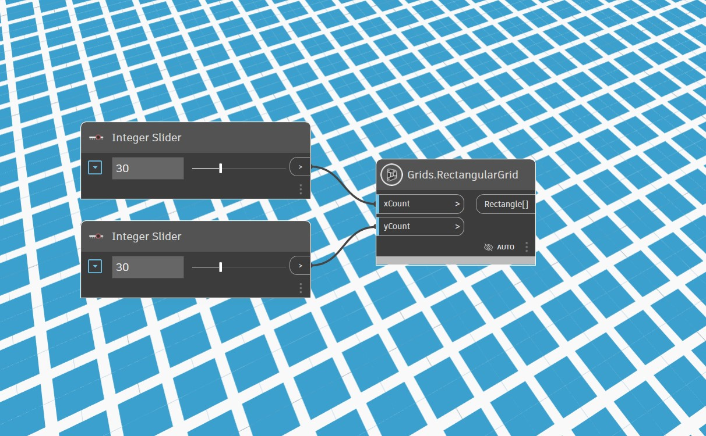
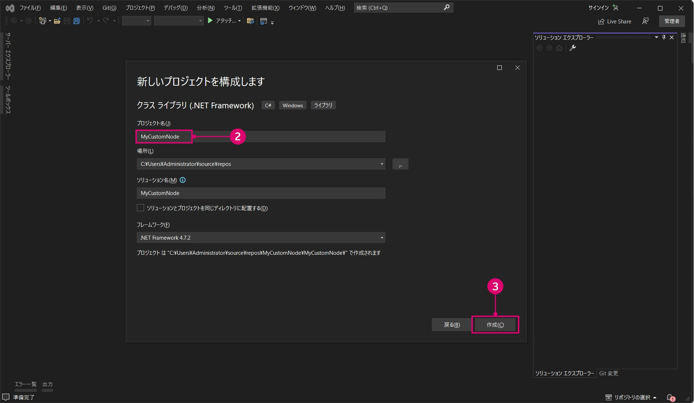
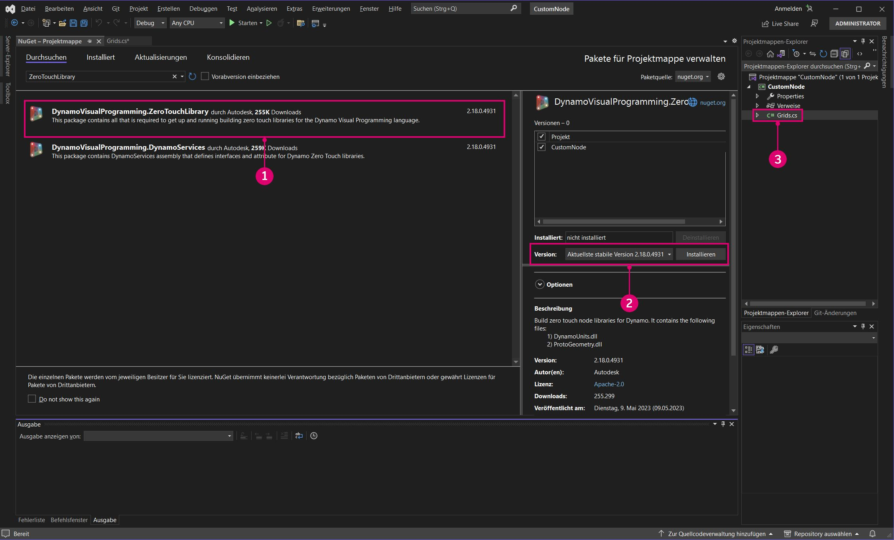
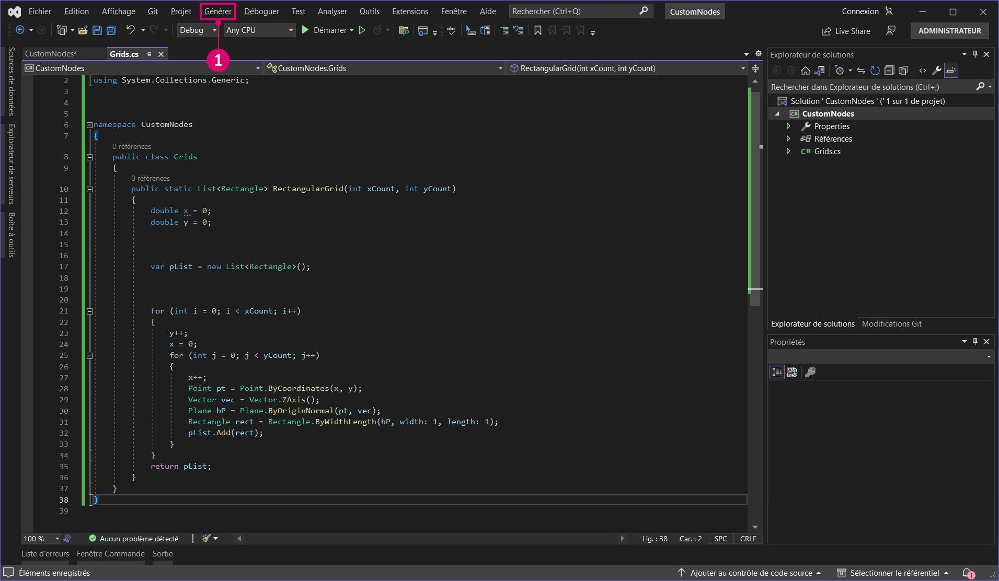
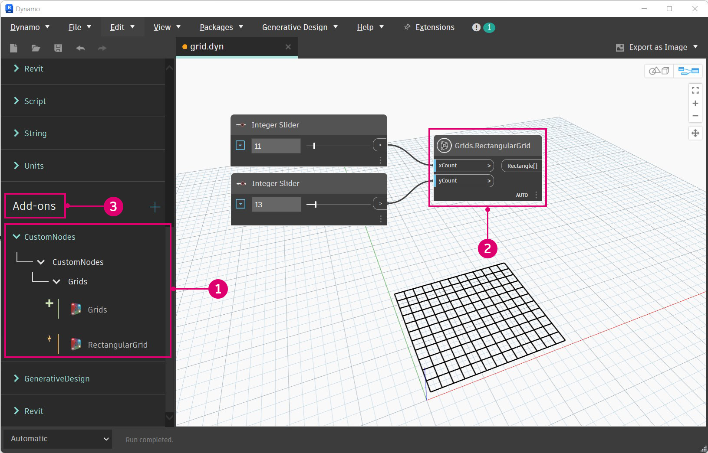
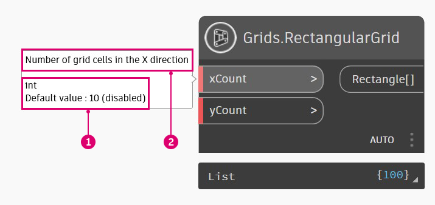

# Caso real de Zero-Touch (nodo de rejilla)

Con un proyecto de Visual Studio en ejecución, veremos cómo generar un nodo personalizado que cree una rejilla rectangular de celdas. Aunque podríamos crear esto con varios nodos estándar, se trata de una herramienta útil que se puede incluir fácilmente en un nodo Zero-Touch. A diferencia de las líneas de rejilla, las celdas se pueden consultar para determinar su vértices de esquina o convertir en caras, o se puede ajustar su escala en relación con sus centros.

En este ejemplo, se abordarán algunas de las funciones y los conceptos que deben tenerse en cuenta al crear un nodo Zero-Touch. Después de generar el nodo personalizado y añadirlo a Dynamo, asegúrese de consultar la página Conceptos avanzados de Zero-Touch para obtener una visión más detallada de los valores de entrada por defecto, la devolución de varios valores, la documentación, los objetos, el uso de tipos de geometría de Dynamo y las migraciones.



#### Nodo de rejilla rectangular personalizado <a href="#custom-rectangular-grid-node" id="custom-rectangular-grid-node"></a>

Para comenzar a generar el nodo de rejilla, cree un nuevo proyecto de biblioteca de clases de Visual Studio. Consulte la página Introducción para obtener un recorrido detallado sobre cómo configurar un proyecto.




> 1. Seleccione `Class Library` como tipo de proyecto.
> 2. Asigne el nombre `CustomNodes` al proyecto.

Dado que vamos a crear geometría, debemos hacer referencia al paquete NuGet adecuado. Instale el paquete ZeroTouchLibrary desde el administrador de paquetes NuGet. Este paquete es necesario para la instrucción `using Autodesk.DesignScript.Geometry;`.



> 1. Busque el paquete ZeroTouchLibrary.
> 2. Utilizaremos este nodo en la compilación actual de Dynamo Studio, la 1.3. Seleccione la versión del paquete que coincida con esta.
> 3. Observe que también hemos cambiado el nombre del archivo de clase a `Grids.cs`.

A continuación, debemos establecer un espacio de nombres y una clase en los que resida el método RectangularGrid. Al nodo se le asignará un nombre en Dynamo en función de su método y clase. Aún no tenemos que copiarlo en Visual Studio.

```
using Autodesk.DesignScript.Geometry;
using System.Collections.Generic;

namespace CustomNodes
{
    public class Grids
    {
        public static List<Rectangle> RectangularGrid(int xCount, int yCount)
        {
        //The method for creating a rectangular grid will live in here
        }
    }
}
```

> `Autodesk.DesignScript.Geometry;` hace referencia al archivo ProtoGeometry.dll del paquete ZeroTouchLibrary `System.Collections.Generic`, que es necesario para crear listas.

Ahora podemos añadir el método para dibujar los rectángulos. El archivo de clase debería presentar el siguiente aspecto y se puede copiar en Visual Studio.

```
using Autodesk.DesignScript.Geometry;
using System.Collections.Generic;

namespace CustomNodes
{
    public class Grids
    {
        public static List<Rectangle> RectangularGrid(int xCount, int yCount)
        {
            double x = 0;
            double y = 0;

            var pList = new List<Rectangle>();

            for (int i = 0; i < xCount; i++)
            {
                y++;
                x = 0;
                for (int j = 0; j < yCount; j++)
                {
                    x++;
                    Point pt = Point.ByCoordinates(x, y);
                    Vector vec = Vector.ZAxis();
                    Plane bP = Plane.ByOriginNormal(pt, vec);
                    Rectangle rect = Rectangle.ByWidthLength(bP, 1, 1);
                    pList.Add(rect);
                }
            }
            return pList;
        }
    }
}
```

Si el proyecto presenta un aspecto similar al siguiente, continúe e intente compilar el archivo `.dll`.



> 1. Seleccione Compilar > Compilar solución.

En la carpeta `bin` del proyecto, busque un archivo `.dll`. Si la compilación se ha realizado correctamente, podemos añadir el archivo `.dll` a Dynamo.



> 1. El nodo personalizado RectangularGrids de la biblioteca de Dynamo
> 2. El nodo personalizado en el lienzo
> 3. El botón Añadir para añadir el archivo `.dll` a Dynamo

#### Modificaciones de nodos personalizados <a href="#custom-node-modifications" id="custom-node-modifications"></a>

En el ejemplo anterior, hemos creado un nodo bastante sencillo que solo define el método `RectangularGrids`. Sin embargo, es posible que deseemos crear información de herramientas para los puertos de entrada o proporcionar al nodo un resumen como los nodos estándar de Dynamo. La adición de estas funciones a nodos personalizados facilita su uso, sobre todo, si un usuario desea buscarlas en la biblioteca.



> 1. Un valor de entrada por defecto
> 2. Información de herramientas para la entrada de xCount

El nodo RectangularGrid necesita algunas de estas funciones básicas. En el código siguiente, se han añadido descripciones de puerto de entrada y salida, un resumen y valores de entrada por defecto.

```
using Autodesk.DesignScript.Geometry;
using System.Collections.Generic;

namespace CustomNodes
{
    public class Grids
    {
        /// <summary>
        /// This method creates a rectangular grid from an X and Y count.
        /// </summary>
        /// <param name="xCount">Number of grid cells in the X direction</param>
        /// <param name="yCount">Number of grid cells in the Y direction</param>
        /// <returns>A list of rectangles</returns>
        /// <search>grid, rectangle</search>
        public static List<Rectangle> RectangularGrid(int xCount = 10, int yCount = 10)
        {
            double x = 0;
            double y = 0;

            var pList = new List<Rectangle>();

            for (int i = 0; i < xCount; i++)
            {
                y++;
                x = 0;
                for (int j = 0; j < yCount; j++)
                {
                    x++;
                    Point pt = Point.ByCoordinates(x, y);
                    Vector vec = Vector.ZAxis();
                    Plane bP = Plane.ByOriginNormal(pt, vec);
                    Rectangle rect = Rectangle.ByWidthLength(bP, 1, 1);
                    pList.Add(rect);
                    Point cPt = rect.Center();
                }
            }
            return pList;
        }
    }
}
```

* Determine los valores por defecto de las entradas mediante la asignación de valores a los parámetros del método: `RectangularGrid(int xCount = 10, int yCount = 10)`.
* Cree información de herramientas de entrada y salida, palabras clave de búsqueda y un resumen con documentación XML precedida por `///`.

Para añadir información de herramientas, se necesita un archivo xml en el directorio del proyecto. Visual Studio puede generar automáticamente un archivo `.xml` se activa la opción.


> 1. Active aquí el archivo de documentación XML y especifique una ruta de archivo. Esta acción generará un archivo XML.

Ya está. Hemos creado un nuevo nodo con varias funciones estándar. El siguiente capítulo Conceptos básicos de Zero-Touch profundiza en el desarrollo de nodos Zero-Touch y en los aspectos que se deben tener en cuenta.
