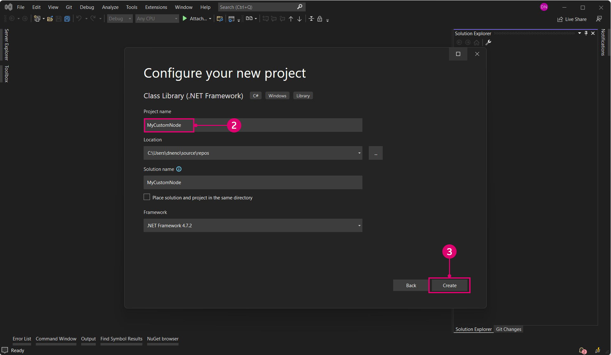
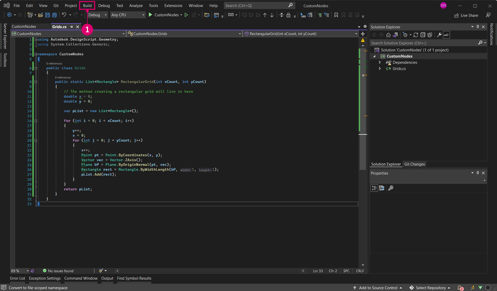

# Estudo de caso sem toque – Nó de grade

Com um projeto do Visual Studio ativo e em execução, vamos analisar como compilar um nó personalizado que cria uma grade retangular de células. Embora possamos criar isso com vários nós padrão, é uma ferramenta útil que pode ser facilmente contida em um nó Sem toque. Ao contrário das linhas de grade, as células podem ser dimensionadas em torno de seus pontos centrais, consultadas para seus vértices de canto ou incorporadas em faces.

Este exemplo abordará alguns dos recursos e conceitos a serem considerados ao criar um nó Sem toque. Depois de compilarmos o nó personalizado e adicioná-lo ao Dynamo, verifique se a página “Aprofundar o conhecimento sobre o nó Sem Toque” fornece uma visão mais profunda dos valores de entrada padrão, retornando vários valores, documentação, objetos, usando tipos de geometria do Dynamo e migrações.


### Nó de grade retangular personalizado <a href="#custom-rectangular-grid-node" id="custom-rectangular-grid-node"></a>

Para começar a compilar o nó de grade, crie um novo projeto de biblioteca de classes do Visual Studio. Consulte a página Introdução para obter uma visão geral detalhada de como configurar um projeto.




> 1. Escolher `Class Library` para o tipo de projeto
> 2. Nomear o projeto `CustomNodes`

Como vamos criar geometria, precisamos fazer referência ao pacote NuGet apropriado. Instale o pacote ZeroTouchLibrary do Gerenciador de pacotes NuGet. Esse pacote é necessário para a declaração `using Autodesk.DesignScript.Geometry;`.


> 1. Procure o pacote ZeroTouchLibrary
> 2. Usaremos esse nó na compilação atual do Dynamo Studio, que é 1.3. Selecione a versão do pacote que corresponde a isso.
> 3. Observe que também renomeamos o arquivo de classe para `Grids.cs`

Em seguida, precisamos estabelecer um namespace e uma classe na qual o método RetangularGrid residirá. O nó será nomeado no Dynamo de acordo com o método e os nomes de classe. Ainda não precisamos copiar isso no Visual Studio.

```
using Autodesk.DesignScript.Geometry;
using System.Collections.Generic;

namespace CustomNodes
{
    public class Grids
    {
        public static List<Rectangle> RectangularGrid(int xCount, int yCount)
        {
        //The method for creating a rectangular grid will live in here
        }
    }
}
```

> `Autodesk.DesignScript.Geometry;` faz referência ao arquivo ProtoGeometry.dll no pacote ZeroTouchLibrary `System.Collections.Generic`, que é necessário para criar listas

Agora podemos adicionar o método para desenhar os retângulos. O arquivo de classe deve ter este aspecto e pode ser copiado para o Visual Studio.

```
using Autodesk.DesignScript.Geometry;
using System.Collections.Generic;

namespace CustomNodes
{
    public class Grids
    {
        public static List<Rectangle> RectangularGrid(int xCount, int yCount)
        {
            double x = 0;
            double y = 0;

            var pList = new List<Rectangle>();

            for (int i = 0; i < xCount; i++)
            {
                y++;
                x = 0;
                for (int j = 0; j < yCount; j++)
                {
                    x++;
                    Point pt = Point.ByCoordinates(x, y);
                    Vector vec = Vector.ZAxis();
                    Plane bP = Plane.ByOriginNormal(pt, vec);
                    Rectangle rect = Rectangle.ByWidthLength(bP, 1, 1);
                    pList.Add(rect);
                }
            }
            return pList;
        }
    }
}
```

Se o projeto for semelhante a este, vá em frente e tente compilar o `.dll`.



> 1. Escolher Compilar > Compilar solução

Verifique a pasta `bin` do projeto para obter um `.dll`. Se a compilação tiver sido bem-sucedida, poderemos adicionar o `.dll` ao Dynamo.


> 1. O nó personalizado RectangularGrids na Biblioteca do Dynamo
> 2. O nó personalizado na tela
> 3. O botão Adicionar para adicionar o `.dll` ao Dynamo

### Modificações de nós personalizados <a href="#custom-node-modifications" id="custom-node-modifications"></a>

No exemplo acima, criamos um nó bastante simples que não definiu muito mais fora do método `RectangularGrids`. No entanto, podemos desejar criar dicas de ferramentas para portas de entrada ou fornecer ao nó um resumo, como os nós padrão do Dynamo. Adicionar esses recursos a nós personalizados facilita seu uso, especialmente se um usuário desejar pesquisá-los na biblioteca.


> 1. Um valor de entrada padrão
> 2. Uma dica de ferramenta para a entrada xCount

O nó RetangularGrid precisa de alguns desses recursos básicos. No código abaixo, adicionamos descrições de porta de entrada e saída, um resumo e valores de entrada padrão.

```
using Autodesk.DesignScript.Geometry;
using System.Collections.Generic;

namespace CustomNodes
{
    public class Grids
    {
        /// <summary>
        /// This method creates a rectangular grid from an X and Y count.
        /// </summary>
        /// <param name="xCount">Number of grid cells in the X direction</param>
        /// <param name="yCount">Number of grid cells in the Y direction</param>
        /// <returns>A list of rectangles</returns>
        /// <search>grid, rectangle</search>
        public static List<Rectangle> RectangularGrid(int xCount = 10, int yCount = 10)
        {
            double x = 0;
            double y = 0;

            var pList = new List<Rectangle>();

            for (int i = 0; i < xCount; i++)
            {
                y++;
                x = 0;
                for (int j = 0; j < yCount; j++)
                {
                    x++;
                    Point pt = Point.ByCoordinates(x, y);
                    Vector vec = Vector.ZAxis();
                    Plane bP = Plane.ByOriginNormal(pt, vec);
                    Rectangle rect = Rectangle.ByWidthLength(bP, 1, 1);
                    pList.Add(rect);
                    Point cPt = rect.Center();
                }
            }
            return pList;
        }
    }
}
```

* Forneça os valores padrão das entradas atribuindo valores aos parâmetros do método: `RectangularGrid(int xCount = 10, int yCount = 10)`
* Crie dicas de ferramentas de entrada e saída, palavras-chave de pesquisa e um resumo com a documentação XML precedida por `///`.

Para adicionar dicas de ferramentas, precisamos de um arquivo xml no diretório do projeto. É possível gerar um `.xml` automaticamente pelo Visual Studio ativando a opção.


> 1. Ative o arquivo de documentação XML aqui e especifique um caminho de arquivo. Isso gera um arquivo XML.

E pronto. Criamos um novo nó com vários recursos padrão. O capítulo a seguir, “Noções básicas sobre o nó Sem toque”, entra em mais detalhes sobre o desenvolvimento do nó Sem toque e os problemas dos quais você deve estar ciente.
