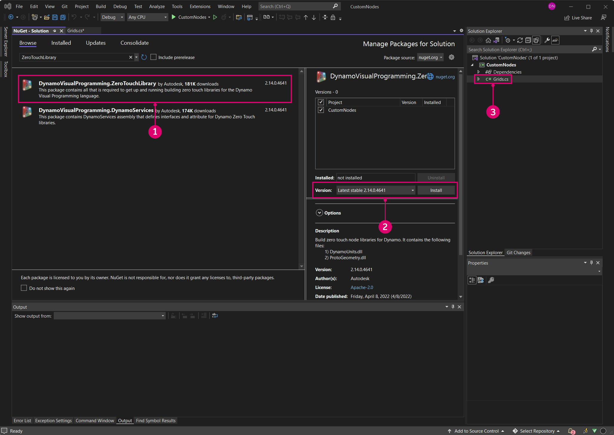

# Případová studie funkce Zero-Touch – uzel osnovy

Po spuštění projektu v aplikaci Visual Studio si ukážeme, jak vytvořit vlastní uzel, který vytvoří obdélníkovou osnovu buněk. Ačkoli bychom ji mohli vytvořit pomocí několika standardních uzlů, jedná se o užitečný nástroj, který lze snadno umístit v uzlu Zero-Touch. Na rozdíl od čar osnovy lze velikost buněk měnit kolem středových bodů, dotazovat se na rohové vrcholy nebo je zabudovat do ploch.

V tomto příkladu si představíme několik funkcí a konceptů, které je třeba znát při vytváření uzlu Zero-Touch. Po vytvoření vlastního uzlu a jeho přidání do aplikace Dynamo si projděte stránku Další práce s funkcí Zero-Touch, kde naleznete podrobnější informace o výchozích vstupních hodnotách, vrácení více hodnot, dokumentaci, objektech, použití typů geometrií aplikace Dynamo a migraci.


#### Vlastní uzel obdélníkové osnovy <a href="#custom-rectangular-grid-node" id="custom-rectangular-grid-node"></a>

Chcete-li začít vytvářet uzel osnovy, vytvořte nový projekt knihovny tříd aplikace Visual Studio. Podrobné informace o nastavení projektu naleznete na stránce Začínáme.


> 1. Vyberte `Class Library` pro typ projektu.
> 2. Pojmenujte projekt jako `CustomNodes`.

Protože budeme vytvářet geometrii, je nutné odkazovat na příslušný balíček NuGet. Ze Správce balíčků NuGet nainstalujte balíček ZeroTouchLibrary. Tento balíček je nezbytný pro příkaz `using Autodesk.DesignScript.Geometry;`.



> 1. Procházením vyhledejte balíček ZeroTouchLibrary.
> 2. Tento uzel použijeme v aktuálním sestavení aplikace Dynamo Studio, které je 1.3. Vyberte verzi balíčku, která odpovídá této verzi.
> 3. Všimněte si, že jsme také přejmenovali soubor třídy na `Grids.cs`.

Dále je potřeba vytvořit jmenný prostor a třídu, ve které bude umístěna metoda RectangularGrid. Uzel bude v aplikaci Dynamo pojmenován podle názvů metod a tříd. Tento kód ještě není nutné kopírovat do aplikace Visual Studio.

```
using Autodesk.DesignScript.Geometry;
using System.Collections.Generic;

namespace CustomNodes
{
    public class Grids
    {
        public static List<Rectangle> RectangularGrid(int xCount, int yCount)
        {
        //The method for creating a rectangular grid will live in here
        }
    }
}
```

> `Autodesk.DesignScript.Geometry;` odkazuje na soubor ProtoGeometry.dll v balíčku ZeroTouchLibrary. `System.Collections.Generic` je nutný k vytváření seznamů.

Nyní můžeme přidat metodu pro kreslení obdélníků. Soubor třídy by měl vypadat takto a lze jej zkopírovat do aplikace Visual Studio.

```
using Autodesk.DesignScript.Geometry;
using System.Collections.Generic;

namespace CustomNodes
{
    public class Grids
    {
        public static List<Rectangle> RectangularGrid(int xCount, int yCount)
        {
            double x = 0;
            double y = 0;

            var pList = new List<Rectangle>();

            for (int i = 0; i < xCount; i++)
            {
                y++;
                x = 0;
                for (int j = 0; j < yCount; j++)
                {
                    x++;
                    Point pt = Point.ByCoordinates(x, y);
                    Vector vec = Vector.ZAxis();
                    Plane bP = Plane.ByOriginNormal(pt, vec);
                    Rectangle rect = Rectangle.ByWidthLength(bP, 1, 1);
                    pList.Add(rect);
                }
            }
            return pList;
        }
    }
}
```

Pokud projekt vypadá podobně jako tento, pokračujte a zkuste sestavit knihovnu `.dll`.


> 1. Zvolte Sestavit > Sestavit řešení.

Zkontrolujte složku projektu `bin` pro knihovnu `.dll`. Pokud bylo sestavení úspěšné, můžeme přidat knihovnu `.dll` do aplikace Dynamo.


> 1. Vlastní uzel RectangularGrids v knihovně aplikace Dynamo
> 2. Vlastní uzel na kreslicí ploše
> 3. Tlačítko Přidat pro přidání knihovny `.dll` do aplikace Dynamo

#### Úpravy vlastních uzlů <a href="#custom-node-modifications" id="custom-node-modifications"></a>

Ve výše uvedeném příkladu jsme vytvořili poměrně jednoduchý uzel, který kromě metody `RectangularGrids` nedefinoval nic dalšího. Můžeme však chtít vytvořit popisky pro vstupní porty nebo poskytnout uzlu souhrn jako u standardních uzlů aplikace Dynamo. Přidání těchto funkcí do vlastních uzlů usnadní jejich používání, zejména pokud je uživatel chce vyhledávat v knihovně.


> 1. Výchozí vstupní hodnota
> 2. Popisek pro vstup xCount

Uzel RectangularGrid potřebuje některé z těchto základních funkcí. V níže uvedeném kódu jsme přidali popisy vstupních a výstupních portů, souhrn a výchozí vstupní hodnoty.

```
using Autodesk.DesignScript.Geometry;
using System.Collections.Generic;

namespace CustomNodes
{
    public class Grids
    {
        /// <summary>
        /// This method creates a rectangular grid from an X and Y count.
        /// </summary>
        /// <param name="xCount">Number of grid cells in the X direction</param>
        /// <param name="yCount">Number of grid cells in the Y direction</param>
        /// <returns>A list of rectangles</returns>
        /// <search>grid, rectangle</search>
        public static List<Rectangle> RectangularGrid(int xCount = 10, int yCount = 10)
        {
            double x = 0;
            double y = 0;

            var pList = new List<Rectangle>();

            for (int i = 0; i < xCount; i++)
            {
                y++;
                x = 0;
                for (int j = 0; j < yCount; j++)
                {
                    x++;
                    Point pt = Point.ByCoordinates(x, y);
                    Vector vec = Vector.ZAxis();
                    Plane bP = Plane.ByOriginNormal(pt, vec);
                    Rectangle rect = Rectangle.ByWidthLength(bP, 1, 1);
                    pList.Add(rect);
                    Point cPt = rect.Center();
                }
            }
            return pList;
        }
    }
}
```

* Přiřazením hodnot parametrům metody přiřaďte vstupům výchozí hodnoty: `RectangularGrid(int xCount = 10, int yCount = 10)`
* Vytvořte popisky vstupu a výstupu, klíčová slova pro vyhledávání a souhrn s dokumentací XML, před nimiž zadejte `///`.

K přidání popisků je potřeba soubor XML v adresáři projektu. V aplikaci Visual Studio je možné automaticky vytvořit soubor `.xml`, pokud tuto možnost povolíte.


> 1. Zde povolte soubor dokumentace XML a zadejte cestu k souboru. Tím se vytvoří soubor XML.

A je to! Vytvořili jsme nový uzel s několika standardními funkcemi. Následující kapitola Základy funkce Zero-Touch obsahuje podrobnější informace o vývoji uzlů Zero-Touch a o problémech, na které je třeba dávat pozor.
