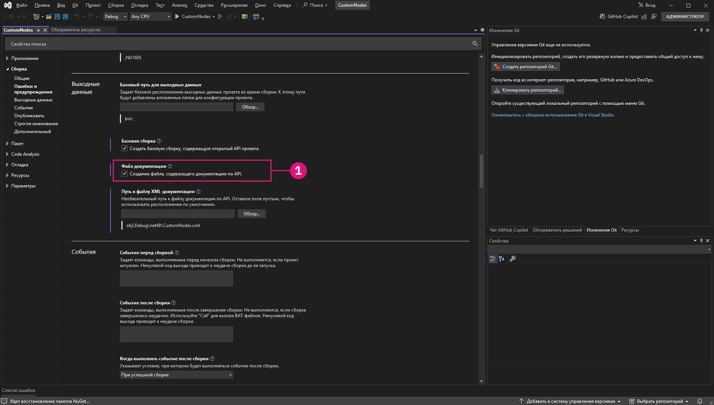

# Case study zero-touch - Nodo griglia

Con un progetto di Visual Studio attivo e funzionante, illustreremo come creare un nodo personalizzato che crea una griglia rettangolare di celle. Sebbene sia possibile crearlo con diversi nodi standard, è uno strumento utile che può essere facilmente contenuto in un nodo zero-touch. A differenza delle linee della griglia, le celle possono essere messe in scala rispetto ai loro punti centrali, sottoposte a query per conoscere i loro vertici d'angolo o integrate in facce.

Questo esempio riguarda alcune delle funzionalità e dei concetti di cui tenere conto durante la creazione di un nodo zero-touch. Dopo aver creato il nodo personalizzato e averlo aggiunto a Dynamo, assicurarsi di consultare la pagina Ulteriori informazioni sul concetto di zero-touch per esaminare in modo più approfondito valori di input di default, restituzione di più valori, documentazione, oggetti, utilizzo dei tipi di geometria di Dynamo e migrazioni.


### Nodo griglia rettangolare personalizzata <a href="#custom-rectangular-grid-node" id="custom-rectangular-grid-node"></a>

Per iniziare a creare il nodo griglia, creare un nuovo progetto della libreria di classi di Visual Studio. Fare riferimento alla pagina Per iniziare per una simulazione dettagliata di come impostare un progetto.


> 1. Scegliere `Class Library` per il tipo di progetto.
> 2. Assegnare al progetto il nome `CustomNodes`.

Poiché creeremo la geometria, dobbiamo fare riferimento al pacchetto NuGet appropriato. Installare il pacchetto ZeroTouchLibrary da Gestione pacchetti NuGet. Questo pacchetto è necessario per l'istruzione `using Autodesk.DesignScript.Geometry;`.


> 1. Cercare il pacchetto ZeroTouchLibrary.
> 2. Utilizzeremo questo nodo nella build corrente di Dynamo Studio, ossia 1.3. Selezionare la versione del pacchetto corrispondente.
> 3. Notare che è stato anche rinominato il file di classe in `Grids.cs`.

Successivamente, dobbiamo stabilire uno spazio dei nomi e una classe in cui sarà presente il metodo RectangularGrid. Il nome del nodo verrà assegnato in Dynamo in base ai nomi del metodo e della classe. Non dobbiamo ancora copiare il file in Visual Studio.

```
using Autodesk.DesignScript.Geometry;
using System.Collections.Generic;

namespace CustomNodes
{
    public class Grids
    {
        public static List<Rectangle> RectangularGrid(int xCount, int yCount)
        {
        //The method for creating a rectangular grid will live in here
        }
    }
}
```

> `Autodesk.DesignScript.Geometry;` fa riferimento a ProtoGeometry.dll nel pacchetto ZeroTouchLibrary. `System.Collections.Generic` è necessario per la creazione di elenchi.

Ora è possibile aggiungere il metodo per il disegno dei rettangoli. Il file di classe dovrebbe essere simile al seguente e può essere copiato in Visual Studio.

```
using Autodesk.DesignScript.Geometry;
using System.Collections.Generic;

namespace CustomNodes
{
    public class Grids
    {
        public static List<Rectangle> RectangularGrid(int xCount, int yCount)
        {
            double x = 0;
            double y = 0;

            var pList = new List<Rectangle>();

            for (int i = 0; i < xCount; i++)
            {
                y++;
                x = 0;
                for (int j = 0; j < yCount; j++)
                {
                    x++;
                    Point pt = Point.ByCoordinates(x, y);
                    Vector vec = Vector.ZAxis();
                    Plane bP = Plane.ByOriginNormal(pt, vec);
                    Rectangle rect = Rectangle.ByWidthLength(bP, 1, 1);
                    pList.Add(rect);
                }
            }
            return pList;
        }
    }
}
```

Se il progetto è simile a questo, procedere e provare a creare il file `.dll`.


> 1. Scegliere Build > Build Solution.

Cercare un file `bin` nella cartella `.dll` del progetto. Se la creazione è stata eseguita correttamente, possiamo aggiungere il file `.dll` a Dynamo.


> 1. Il nodo RectangularGrids personalizzato nella libreria di Dynamo
> 2. Il nodo personalizzato nell'area di disegno
> 3. Il pulsante Aggiungi per aggiungere `.dll` a Dynamo

### Modifiche di nodi personalizzati <a href="#custom-node-modifications" id="custom-node-modifications"></a>

Nell'esempio precedente, abbiamo creato un nodo piuttosto semplice che non definiva molto altro al di fuori del metodo `RectangularGrids`. Tuttavia, potremmo voler creare delle descrizioni comandi per le porte di input o assegnare al nodo una sintesi come i nodi standard di Dynamo. L'aggiunta di queste funzionalità ai nodi personalizzati ne semplifica l'utilizzo, soprattutto se un utente desidera cercarle nella libreria.


> 1. Un valore di input di default
> 2. Una descrizione comando per l'input xCount

Il nodo RectangularGrid richiede alcune di queste funzionalità di base. Nel codice riportato di seguito sono state aggiunte descrizioni delle porte di input e di output, una sintesi e valori di input di default.

```
using Autodesk.DesignScript.Geometry;
using System.Collections.Generic;

namespace CustomNodes
{
    public class Grids
    {
        /// <summary>
        /// This method creates a rectangular grid from an X and Y count.
        /// </summary>
        /// <param name="xCount">Number of grid cells in the X direction</param>
        /// <param name="yCount">Number of grid cells in the Y direction</param>
        /// <returns>A list of rectangles</returns>
        /// <search>grid, rectangle</search>
        public static List<Rectangle> RectangularGrid(int xCount = 10, int yCount = 10)
        {
            double x = 0;
            double y = 0;

            var pList = new List<Rectangle>();

            for (int i = 0; i < xCount; i++)
            {
                y++;
                x = 0;
                for (int j = 0; j < yCount; j++)
                {
                    x++;
                    Point pt = Point.ByCoordinates(x, y);
                    Vector vec = Vector.ZAxis();
                    Plane bP = Plane.ByOriginNormal(pt, vec);
                    Rectangle rect = Rectangle.ByWidthLength(bP, 1, 1);
                    pList.Add(rect);
                    Point cPt = rect.Center();
                }
            }
            return pList;
        }
    }
}
```

* Fornire i valori di default degli input assegnando valori ai parametri del metodo: `RectangularGrid(int xCount = 10, int yCount = 10)`.
* Creare descrizioni comandi di input e output, parole chiave di ricerca e una sintesi con la documentazione XML preceduta da `///`.

Per aggiungere descrizioni comandi, abbiamo bisogno di un file XML nella directory del progetto. Un file `.xml` può essere generato automaticamente da Visual Studio attivando l'opzione.



> 1. Attivare qui il file della documentazione XML e specificarne il percorso. In questo modo viene generato un file XML.

L'operazione è completata. È stato creato un nuovo nodo con diverse funzionalità standard. Nel capitolo seguente sui concetti di base zero-touch sono illustrati in modo più dettagliato lo sviluppo di nodi zero-touch e i problemi di cui è necessario tenere conto.
