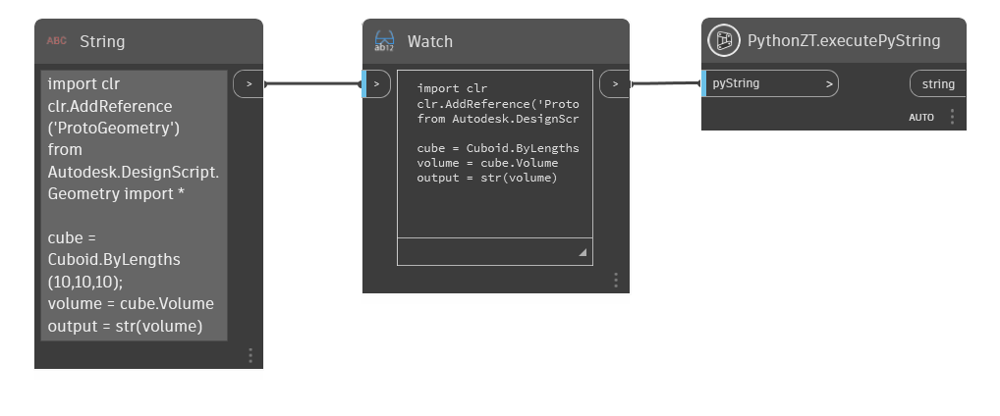
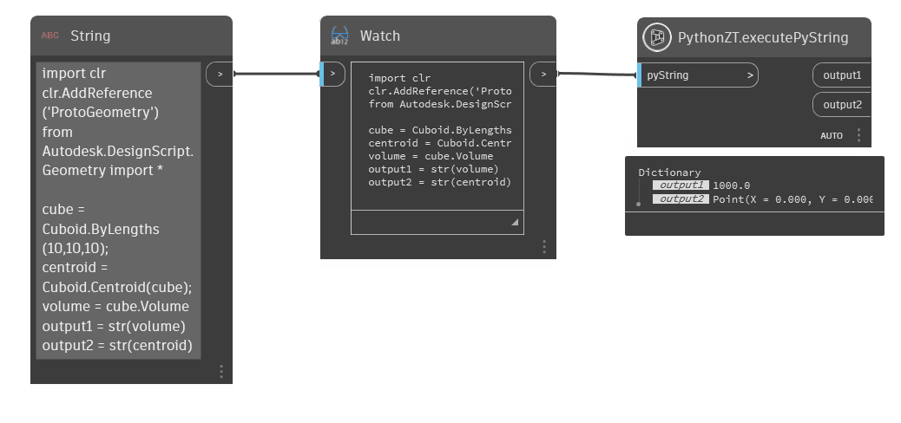

# Provádění skriptů jazyka Python v uzlech Zero-Touch (C#)

### Provádění skriptů jazyka Python v uzlech Zero-Touch (C#) <a href="#executing-python-scripts-in-zero-touch-nodes-c" id="executing-python-scripts-in-zero-touch-nodes-c"></a>

Pokud umíte psát skripty v jazyce Python a chcete více funkcí, než vám mohou nabídnout standardní uzly jazyka Python aplikace Dynamo, můžete si pomocí funkce Zero-Touch vytvořit vlastní uzel. Začneme jednoduchým příkladem, který nám umožní předat skript jazyka Python jako řetězec uzlu Zero-Touch, kde se skript provede a vrátí se výsledek. Tato případová studie bude vycházet z ukázek a příkladů v části Začínáme. Pokud s tvorbou uzlů Zero-Touch úplně začínáte, podívejte se na ně.



> Uzel Zero-Touch, který provede řetězec skriptu jazyka Python

#### Modul jazyka Python <a href="#python-engine" id="python-engine"></a>

Tento uzel se spoléhá na instanci skriptovacího modulu IronPython. K tomu potřebujeme odkazovat na několik dalších sestav. Podle následujících kroků nastavte základní šablonu v aplikaci Visual Studio:

* Vytvořte nový projekt třídy aplikace Visual Studio.
* Přidejte odkaz na soubor `IronPython.dll` umístěný ve složce `C:\Program Files (x86)\IronPython 2.7\IronPython.dll`.
* Přidejte odkaz na soubor `Microsoft.Scripting.dll` umístěný ve složce `C:\Program Files (x86)\IronPython 2.7\Platforms\Net40\Microsoft.Scripting.dll`.
* Zahrňte do třídy příkazy `IronPython.Hosting` a `Microsoft.Scripting.Hosting` `using`.
* Přidejte soukromý prázdný konstruktor, abyste zabránili přidání dalšího uzlu do knihovny aplikace Dynamo spolu s naším balíčkem.
* Vytvořte novou metodu, která jako vstupní parametr přijímá jeden řetězec.
* V rámci této metody vytvoříme novou instanci modulu jazyka Python a prázdný rozsah skriptu. Tento rozsah si můžete představit jako globální proměnné v rámci instance interpretu jazyka Python.
* Poté pro modul volejte `Execute` a jako parametry předejte vstupní řetězec a rozsah.
* Nakonec načtěte a vraťte výsledky skriptu voláním `GetVariable` pro modul a předáním názvu proměnné ze skriptu jazyka Python, která obsahuje hodnotu, kterou se pokoušíte vrátit. (Další podrobnosti naleznete v níže uvedeném příkladu.)

Následující kód představuje příklad výše uvedených kroků. Sestavením řešení se vytvoří nová knihovna `.dll` umístěná ve složce bin našeho projektu. Tuto knihovnu `.dll` lze nyní importovat do aplikace Dynamo jako součást balíčku nebo pomocí příkazu `File < Import Library...`.

```
using IronPython.Hosting;
using Microsoft.Scripting.Hosting;

namespace PythonLibrary
{
    public class PythonZT
    {
        // Unless a constructor is provided, Dynamo will automatically create one and add it to the library
        // To avoid this, create a private constructor
        private PythonZT() { }

        // The method that executes the Python string
        public static string executePyString(string pyString)
        {
            ScriptEngine engine = Python.CreateEngine();
            ScriptScope scope = engine.CreateScope();
            engine.Execute(pyString, scope);
            // Return the value of the 'output' variable from the Python script below
            var output = scope.GetVariable("output");
            return (output);
        }
    }
}
```

Skript jazyka Python vrací proměnnou `output`, což znamená, že ve skriptu jazyka Python budeme potřebovat proměnnou `output`. K otestování uzlu v aplikaci Dynamo použijte tento vzorový skript. Pokud jste někdy v aplikaci Dynamo použili uzel jazyka Python, měl by vám následující skript být povědomý. Další informace naleznete v části [Python v příručce Primer](http://dynamoprimer.com/en/09\_Custom-Nodes/9-4\_Python.html).

```
import clr
clr.AddReference('ProtoGeometry')
from Autodesk.DesignScript.Geometry import *

cube = Cuboid.ByLengths(10,10,10);
volume = cube.Volume
output = str(volume)
```

#### Více výstupů <a href="#multiple-outputs" id="multiple-outputs"></a>

Jedním z omezení standardních uzlů jazyka Python je, že mají pouze jeden výstupní port, takže pokud chceme vrátit více objektů, musíme sestavit seznam a načíst každý objekt v něm. Pokud upravíme výše uvedený příklad tak, aby vracel slovník, můžeme přidat libovolný počet výstupních portů. Další informace o slovnících naleznete v části Vrácení více hodnot v tématu Další práce s funkcí Zero-Touch.



> Tento uzel umožňuje vrátit objem kvádru i jeho těžiště.

Upravte předchozí příklad pomocí následujících kroků:

* Přidejte odkaz na knihovnu `DynamoServices.dll` ze Správce balíčků NuGet.
* Kromě předchozích sestav zahrňte `System.Collections.Generic` a `Autodesk.DesignScript.Runtime`.
* Upravte návratový typ naší metody tak, aby vracela slovník, který bude obsahovat naše výstupy.
* Každý výstup musí být z rozsahu načten jednotlivě (pro větší sady výstupů zvažte vytvoření jednoduché smyčky).

```
using IronPython.Hosting;
using Microsoft.Scripting.Hosting;
using System.Collections.Generic;
using Autodesk.DesignScript.Runtime;

namespace PythonLibrary
{
    public class PythonZT
    {
        private PythonZT() { }

        [MultiReturn(new[] { "output1", "output2" })]
        public static Dictionary<string, object> executePyString(string pyString)
        {
            ScriptEngine engine = Python.CreateEngine();
            ScriptScope scope = engine.CreateScope();
            engine.Execute(pyString, scope);
            // Return the value of 'output1' from script
            var output1 = scope.GetVariable("output1");
            // Return the value of 'output2' from script
            var output2 = scope.GetVariable("output2");
            // Define the names of outputs and the objects to return
            return new Dictionary<string, object> {
                { "output1", (output1) },
                { "output2", (output2) }
            };
        }
    }
}
```

Do vzorového skriptu jazyka Python jsme také přidali další výstupní proměnnou (`output2`). Mějte na paměti, že tyto proměnné mohou používat jakékoli dovolené konvence pojmenování v jazyce Python, název „output“ byl v tomto příkladu použit výhradně kvůli srozumitelnosti.

```
import clr
clr.AddReference('ProtoGeometry')
from Autodesk.DesignScript.Geometry import *

cube = Cuboid.ByLengths(10,10,10);
centroid = Cuboid.Centroid(cube);
volume = cube.Volume
output1 = str(volume)
output2 = str(centroid)
```
