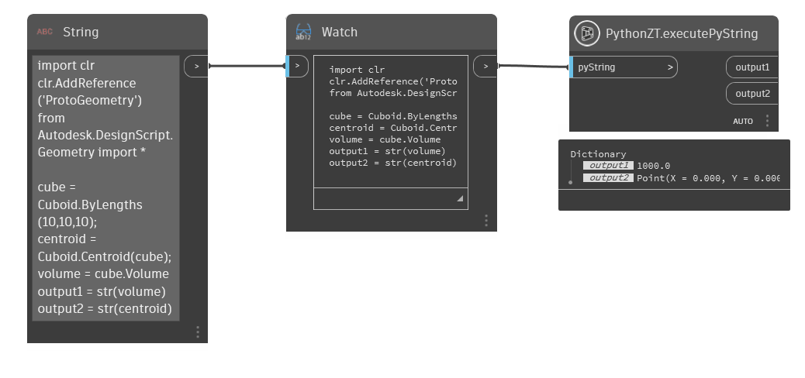

# Executar scripts Python em nós sem toque (C#)

### Executar scripts Python em nós sem toque (C#) <a href="#executing-python-scripts-in-zero-touch-nodes-c" id="executing-python-scripts-in-zero-touch-nodes-c"></a>

Se você estiver familiarizado com a escrita de scripts no Python e desejar mais funcionalidade dos nós padrão do Dynamo Python, poderemos usar o recurso Sem toque para criar nossos próprios. Vamos começar com um exemplo simples que nos permite passar um script Python como uma sequência de caracteres para um nó Sem toque, onde o script é executado e um resultado é retornado. Este estudo de caso será baseado nos tutoriais virtuais e nos exemplos na seção Introdução. Consulte os exemplos se você for completamente novo na criação de nós Sem toque.


> Um nó Sem toque que executará uma sequência de caracteres de script Python

#### Mecanismo Python <a href="#python-engine" id="python-engine"></a>

O PythonNet3 agora é o mecanismo padrão com uma experiência mais simples se você estiver migrando do CPython. Todos os novos nós Python criados no Dynamo 4.0 e superior começam com o PythonNet3.

Esse nó depende de uma instância do mecanismo de scripts IronPython. Para fazer isso, precisamos fazer referência a algumas montagens adicionais. Siga as etapas abaixo para configurar um modelo básico no Visual Studio:

* Criar um novo projeto de classe do Visual Studio
* Adicionar uma referência ao `IronPython.dll` localizado em `C:\Program Files (x86)\IronPython 2.7\IronPython.dll`
* Adicionar uma referência ao `Microsoft.Scripting.dll` localizado em `C:\Program Files (x86)\IronPython 2.7\Platforms\Net40\Microsoft.Scripting.dll`
* Incluir as declarações `IronPython.Hosting` e `Microsoft.Scripting.Hosting` `using` na classe
* Adicionar um construtor vazio privado para evitar que um nó adicional seja adicionado à biblioteca do Dynamo com nosso pacote
* Criar um novo método que toma uma única sequência de caracteres como um parâmetro de entrada
* Dentro desse método, instanciaremos um novo mecanismo Python e criaremos um escopo de script vazio. Você pode imaginar esse escopo como as variáveis globais dentro de uma instância do interpretador Python
* Em seguida, chamar `Execute` no mecanismo que está passando a sequência de entrada e o escopo como parâmetros
* Por fim, recuperar e retornar os resultados do script chamando `GetVariable` no escopo e passando o nome da variável do script Python que contém o valor que você está tentando retornar. (Consulte o exemplo abaixo para obter detalhes adicionais)

O código a seguir fornece um exemplo para a etapa mencionada acima. A compilação da solução criará um novo `.dll` localizado na pasta bin de nosso projeto. Agora, é possível importar este `.dll` para o Dynamo como parte de um pacote ou navegar para `File < Import Library...`

```
using IronPython.Hosting;
using Microsoft.Scripting.Hosting;

namespace PythonLibrary
{
    public class PythonZT
    {
        // Unless a constructor is provided, Dynamo will automatically create one and add it to the library
        // To avoid this, create a private constructor
        private PythonZT() { }

        // The method that executes the Python string
        public static string executePyString(string pyString)
        {
            ScriptEngine engine = Python.CreateEngine();
            ScriptScope scope = engine.CreateScope();
            engine.Execute(pyString, scope);
            // Return the value of the 'output' variable from the Python script below
            var output = scope.GetVariable("output");
            return (output);
        }
    }
}
```

O script Python está retornando a variável `output`, o que significa que precisaremos de uma variável `output` no script Python. Use esse script de amostra para testar o nó no Dynamo. Se você já tiver usado o nó Python no Dynamo, o seguinte deverá ser familiar. Para obter mais informações, consulte a [seção Python do manual](https://primer2.dynamobim.org/pt-br/8_coding_in_dynamo/8-3_python/1-python).

```
import clr
clr.AddReference('ProtoGeometry')
from Autodesk.DesignScript.Geometry import *

cube = Cuboid.ByLengths(10,10,10);
volume = cube.Volume
output = str(volume)
```

#### Várias saídas <a href="#multiple-outputs" id="multiple-outputs"></a>

Uma limitação dos nós Python padrão é que eles têm somente uma única porta de saída, portanto, se desejarmos retornar vários objetos, deveremos criar uma lista e recuperar cada objeto. Se modificarmos o exemplo acima para retornar um dicionário, poderemos adicionar quantas portas de saída desejarmos. Consulte a seção Retornar vários valores em “Aprofundar o conhecimento sobre o nó Sem toque” para obter informações mais específicas sobre os dicionários.



> Esse nó está nos permitindo retornar o volume do cuboide e seu centroide.

Vamos modificar o exemplo anterior com estas etapas:

* Adicionar uma referência ao `DynamoServices.dll` do gerenciador de pacotes do NuGet
* Além das montagens anteriores, incluir `System.Collections.Generic` e `Autodesk.DesignScript.Runtime`
* Modificar o tipo de retorno em nosso método para retornar um dicionário que conterá nossas saídas
* Cada saída deve ser individualmente recuperada do escopo (considere a possibilidade de configurar um loop simples para conjuntos maiores de saídas)

```
using IronPython.Hosting;
using Microsoft.Scripting.Hosting;
using System.Collections.Generic;
using Autodesk.DesignScript.Runtime;

namespace PythonLibrary
{
    public class PythonZT
    {
        private PythonZT() { }

        [MultiReturn(new[] { "output1", "output2" })]
        public static Dictionary<string, object> executePyString(string pyString)
        {
            ScriptEngine engine = Python.CreateEngine();
            ScriptScope scope = engine.CreateScope();
            engine.Execute(pyString, scope);
            // Return the value of 'output1' from script
            var output1 = scope.GetVariable("output1");
            // Return the value of 'output2' from script
            var output2 = scope.GetVariable("output2");
            // Define the names of outputs and the objects to return
            return new Dictionary<string, object> {
                { "output1", (output1) },
                { "output2", (output2) }
            };
        }
    }
}
```

Também adicionamos uma variável de saída (`output2`) ao script python de amostra. Lembre-se de que essas variáveis podem usar qualquer convenção de nomenclatura Python legal; a saída foi usada estritamente para fins de clareza neste exemplo.

```
import clr
clr.AddReference('ProtoGeometry')
from Autodesk.DesignScript.Geometry import *

cube = Cuboid.ByLengths(10,10,10);
centroid = Cuboid.Centroid(cube);
volume = cube.Volume
output1 = str(volume)
output2 = str(centroid)
```

#### Limitações conhecidas e soluções alternativas do PythonNet3<a href="#pythonnet3-known-Issues-Workarounds" id="pythonnet3-known-Issues-Workarounds"></a>

A seguir estão algumas limitações conhecidas e soluções alternativas ao usar o PythonNet3

* As coleções do .NET não são convertidas automaticamente em listas do Python
    * É necessário converter explicitamente matrizes ou coleções ```.NET``` usando ```list(...)``` antes de usar ```len()```, indexação ou iteração.
* Os métodos .NET genéricos podem exigir parâmetros de tipo explícito
    * Alguns métodos (por exemplo, ```GroupBy```) falharão, a menos que você especifique manualmente os tipos genéricos em vez de confiar na inferência automática.
* Não é possível detectar métodos de extensão por meio de ```dir()``` ou do preenchimento automático
    * Os métodos de extensão ainda podem funcionar quando chamados explicitamente, mas não aparecem na introspecção ou na conclusão do código.
* Os métodos de extensão DataTable não são compatíveis
    * A importação de ```System.Data.DataTableExtensions``` falhará; não é possível usar esses métodos auxiliares diretamente.
* Alguns métodos principais do Dynamo se comportam de forma diferente no PythonNet3
    * Algumas funções (por exemplo, aplainamento de lista) podem não funcionar conforme o esperado devido à manipulação mais rigorosa das coleções.
* Não será possível transmitir as classes Python entre os nós se herdarem de tipos .NET
    * Não é possível transferir as classes derivadas de tipos ou interfaces .NET com segurança entre nós do Python.
* O ```set()``` do Python não aceita alguns objetos .NET
    * Objetos como ```InvalidElementId``` devem ser filtrados ou tratados usando coleções .NET.
* Chamadas de ```print()``` frequentes podem causar crescimento de memória
    * Evite o uso intenso de ```print()``` em loops ou scripts de longa execução.
* A interoperabilidade de dicionários entre o Dynamo e o Python é limitada
    * Os dicionários do Dynamo e do Python não são totalmente intercambiáveis e podem requerer conversão manual.
* O método ```Marshal.GetActiveObject()``` para obter a instância COM em execução de um objeto especificado não está mais disponível
    * Use ```BindToMoniker``` se você conhecer o caminho do arquivo em uso.
    * Codifique uma biblioteca em C# usando a estrutura de classes ```Marshal.GetActiveObject()```

#### Migrar do CPython3 para o PythonNet3<a href="#migrating-from-cpython-pythonnet3" id="migrating-from-cpython-pythonnet3"></a>

O Dynamo migrará automaticamente os nós do CPython para o PythonNet3. Veja o que acontece:

> 1. Uma cópia de backup do arquivo original é criada automaticamente.
> 2. Todos os nós do CPython (incluindo os nós personalizados que usam o CPython) são convertidos em PythonNet3. 
> 3. Uma notificação do sistema informa quantos nós foram migrados.
> 4. Ao salvar, você verá um lembrete de que os nós do Python agora usarão o PythonNet3. Novamente, não se preocupe com a compatibilidade com versões anteriores: para aqueles que trabalham em ambientes com várias versões (por exemplo, Revit ou Civil 3D 2025/2026), instale o pacote do mecanismo PythonNet3 no Dynamo 3.3 a 3.6 para manter a compatibilidade. 

#### Migrar do IronPython2 para o PythonNet3<a href="#migrating-from-cpython-pythonnet3" id="migrating-from-cpython-pythonnet3"></a>

Se o gráfico usar um mecanismo IronPython, não ocorrerá migração automática. 

Se o pacote IronPython correspondente estiver instalado, o gráfico será executado normalmente. Se ele estiver ausente, você verá um aviso de dependência na extensão Referências do espaço de trabalho solicitando que você faça o download do pacote. É possível continuar usando o IronPython reinstalando o pacote. Mas como o IronPython não é atualizado há anos e o Dynamo não oferece suporte ativo a esses mecanismos no Dynamo há algum tempo, é altamente recomendável migrar para o PythonNet3 para garantir que os gráficos continuem funcionando de forma confiável no futuro. Embora o DynamoIronPython2.7 e o DynamoIronPython3 continuem disponíveis como pacotes no Dynamo Package Manager, eles não serão mais mantidos pela equipe do Dynamo. 

Nesse caso, a opção de migração disponível é a migração nó a nó, usando o Assistente de migração disponível no Editor Python.  

Para obter mais informações sobre a migração, consulte este [blog](https://dynamobim.org/dynamo-pythonnet3-upgrade-a-practical-guide-to-migrating-your-dynamo-graphs/)