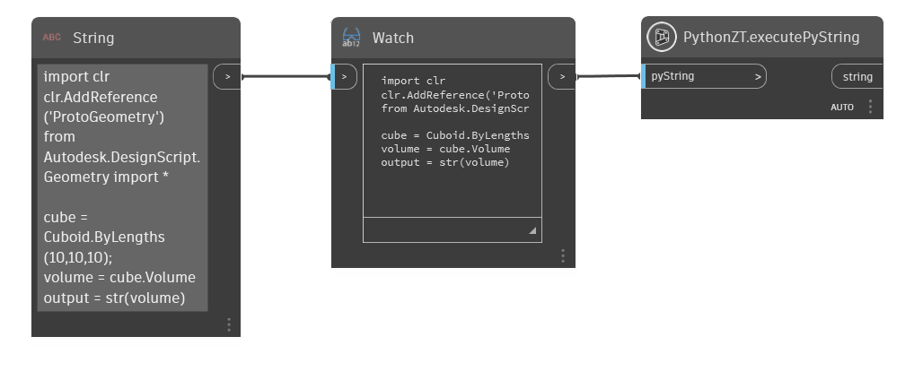

# Ejecución de secuencias de comandos de Python en nodos Zero-Touch (C#)

### Ejecución de secuencias de comandos de Python en nodos Zero-Touch (C#) <a href="#executing-python-scripts-in-zero-touch-nodes-c" id="executing-python-scripts-in-zero-touch-nodes-c"></a>

Si sabe cómo escribir secuencias de comandos en Python y desea obtener más funcionalidad de los nodos estándar de Python de Dynamo, podemos utilizar Zero-Touch para crear nuestros propios nodos. Comencemos con un ejemplo sencillo que nos permite pasar una secuencia de comandos de Python como una cadena a un nodo Zero-Touch donde se ejecuta la secuencia de comandos y se devuelve un resultado. Este caso real se basará en los recorridos y los ejemplos de la sección Introducción. Consulte estos ejemplos si es la primera vez que crea nodos Zero-Touch.



> Un nodo Zero-Touch que ejecutará una cadena de secuencia de comandos de Python.

#### Motor de Python <a href="#python-engine" id="python-engine"></a>

PythonNet3 es ahora el motor por defecto con una experiencia más fluida si se migra desde CPython. Todos los nuevos nodos de Python creados en Dynamo 4.0 o superior comienzan con PythonNet3.

Este nodo se basa en una instancia del motor de secuencias de comandos de IronPython. Para ello, debemos hacer referencia a algunos montajes adicionales. Siga los pasos que se indican a continuación para configurar una plantilla básica en Visual Studio:

* Cree un nuevo proyecto de clase de Visual Studio.
* Añada una referencia al archivo `IronPython.dll`, que se encuentra en `C:\Program Files (x86)\IronPython 2.7\IronPython.dll`.
* Añada una referencia al archivo `Microsoft.Scripting.dll`, que se encuentra en `C:\Program Files (x86)\IronPython 2.7\Platforms\Net40\Microsoft.Scripting.dll`.
* Incluya las instrucciones `IronPython.Hosting` y `Microsoft.Scripting.Hosting` `using` en la clase.
* Añada un constructor privado vacío para evitar que se agregue un nodo adicional a la biblioteca de Dynamo con nuestro paquete.
* Cree un nuevo método que utilice una única cadena como parámetro de entrada.
* En este método, se creará una instancia de un nuevo motor de Python y un ámbito de secuencias de comandos vacío. Puede considerar este ámbito como variables globales de una instancia del intérprete de Python.
* A continuación, llame a `Execute` en el motor que transfiere la cadena de entrada y el ámbito como parámetros
* Por último, recupere y devuelva los resultados de la secuencia de comandos. Para ello, llame a `GetVariable` en el ámbito y transfiera el nombre de la variable desde la secuencia de comandos de Python que contiene el valor que intenta devolver. (Consulte el siguiente ejemplo para obtener más información).

El siguiente código proporciona un ejemplo del paso mencionado anteriormente. La compilación de la solución creará un nuevo archivo `.dll` ubicado en la carpeta bin del proyecto. Este archivo `.dll` ahora se puede importar en Dynamo como parte de un paquete o accediendo a `File < Import Library...`.

```
using IronPython.Hosting;
using Microsoft.Scripting.Hosting;

namespace PythonLibrary
{
    public class PythonZT
    {
        // Unless a constructor is provided, Dynamo will automatically create one and add it to the library
        // To avoid this, create a private constructor
        private PythonZT() { }

        // The method that executes the Python string
        public static string executePyString(string pyString)
        {
            ScriptEngine engine = Python.CreateEngine();
            ScriptScope scope = engine.CreateScope();
            engine.Execute(pyString, scope);
            // Return the value of the 'output' variable from the Python script below
            var output = scope.GetVariable("output");
            return (output);
        }
    }
}
```

La secuencia de comandos de Python devuelve la variable `output`, lo que significa que necesitaremos una variable `output` en la secuencia de comandos de Python. Utilice esta secuencia de comandos de ejemplo para probar el nodo en Dynamo. Si alguna vez ha utilizado el nodo de Python en Dynamo, debería resultarle familiar lo siguiente. Para obtener más información, consulte la [sección sobre Python de Dynamo Primer](https://primer2.dynamobim.org/8_coding_in_dynamo/8-3_python/1-python).

```
import clr
clr.AddReference('ProtoGeometry')
from Autodesk.DesignScript.Geometry import *

cube = Cuboid.ByLengths(10,10,10);
volume = cube.Volume
output = str(volume)
```

#### Varias salidas <a href="#multiple-outputs" id="multiple-outputs"></a>

Una limitación de los nodos estándar de Python es que solo tienen un único puerto de salida, por lo que si deseamos devolver varios objetos, debemos crear una lista y recuperar cada objeto. Si modificamos el ejemplo anterior para devolver un diccionario, podemos añadir tantos puertos de salida como deseemos. Consulte la sección Devolución de varios valores de Conceptos avanzados de Zero-Touch para obtener información detallada sobre los diccionarios.


> Este nodo nos permite devolver tanto el volumen del ortoedro como su centroide.

Vamos a modificar el ejemplo anterior con los siguientes pasos:

* Añada una referencia a `DynamoServices.dll` desde el administrador de paquetes NuGet.
* Además de los montajes anteriores, se incluyen `System.Collections.Generic` y `Autodesk.DesignScript.Runtime`.
* Modifique el tipo de valor devuelto en el método para que se devuelva un diccionario que contendrá las salidas.
* Cada salida se debe recuperar individualmente desde el ámbito (considere la posibilidad de configurar un bucle sencillo para conjuntos de salidas de mayor tamaño).

```
using IronPython.Hosting;
using Microsoft.Scripting.Hosting;
using System.Collections.Generic;
using Autodesk.DesignScript.Runtime;

namespace PythonLibrary
{
    public class PythonZT
    {
        private PythonZT() { }

        [MultiReturn(new[] { "output1", "output2" })]
        public static Dictionary<string, object> executePyString(string pyString)
        {
            ScriptEngine engine = Python.CreateEngine();
            ScriptScope scope = engine.CreateScope();
            engine.Execute(pyString, scope);
            // Return the value of 'output1' from script
            var output1 = scope.GetVariable("output1");
            // Return the value of 'output2' from script
            var output2 = scope.GetVariable("output2");
            // Define the names of outputs and the objects to return
            return new Dictionary<string, object> {
                { "output1", (output1) },
                { "output2", (output2) }
            };
        }
    }
}
```

También hemos añadido una variable de salida adicional (`output2`) a la secuencia de comandos de Python de ejemplo. Tenga en cuenta que estas variables pueden utilizar cualquier convención de nomenclatura legal de Python; la salida se ha utilizado estrictamente para brindar mayor claridad a este ejemplo.

```
import clr
clr.AddReference('ProtoGeometry')
from Autodesk.DesignScript.Geometry import *

cube = Cuboid.ByLengths(10,10,10);
centroid = Cuboid.Centroid(cube);
volume = cube.Volume
output1 = str(volume)
output2 = str(centroid)
```

#### Limitaciones conocidas y soluciones alternativas de PythonNet3<a href="#pythonnet3-known-Issues-Workarounds" id="pythonnet3-known-Issues-Workarounds"></a>

A continuación, se enumeran algunas limitaciones conocidas y soluciones alternativas al utilizar PythonNet3.

* Las colecciones de .NET no se convierten automáticamente en listas de Python.
    * Debe convertir explícitamente matrices o colecciones ```.NET``` mediante ```list(...)``` antes de utilizar ```len()```, la indexación o la iteración.
* Los métodos .NET genéricos pueden requerir parámetros de tipo explícitos.
    * Algunos métodos (por ejemplo, ```GroupBy```) fallarán a menos que especifique manualmente los tipos genéricos en lugar de basarse en la deducción automática.
* Los métodos de extensión no se pueden detectar mediante ```dir()``` o autocompletar.
    * Los métodos de extensión pueden seguir funcionando cuando se les llama explícitamente, pero no aparecen en la introspección ni en la finalización de código.
* No se admiten los métodos de extensión de DataTable.
    * Error al importar ```System.Data.DataTableExtensions```; estos métodos auxiliares no se pueden utilizar directamente.
* Algunos métodos principales de Dynamo se comportan de forma diferente en PythonNet3.
    * Es posible que algunas funciones (por ejemplo, el aplanamiento de listas) no funcionen según lo esperado debido a una gestión más estricta de las colecciones.
* Las clases de Python no se pueden transferir entre nodos si se heredan de tipos .NET.
    * Las clases derivadas de tipos o interfaces .NET no se pueden transferir de forma segura entre nodos de Python.
* Python ```set()``` no acepta algunos objetos .NET.
    * En su lugar, los objetos como ```InvalidElementId``` deben filtrarse o gestionarse mediante colecciones .NET.
* Las llamadas frecuentes a ```print()``` pueden provocar un aumento en el uso de memoria.
    * Evite el uso intensivo de ```print()``` en bucles o secuencias de comandos de larga duración.
* La interoperabilidad de los diccionarios entre Dynamo y Python es limitada.
    * Los diccionarios de Dynamo y Python no son totalmente intercambiables y pueden requerir una conversión manual.
* El método ```Marshal.GetActiveObject()``` para obtener el ejemplar COM en ejecución de un objeto especificado ya no está disponible.
    * Utilice ```BindToMoniker``` si conoce la ruta del archivo en uso.
    * Codificación de una biblioteca en C# mediante la estructura de clases ```Marshal.GetActiveObject()```.

#### Migración de CPython3 a PythonNet3<a href="#migrating-from-cpython-pythonnet3" id="migrating-from-cpython-pythonnet3"></a>

Dynamo migrará automáticamente los nodos de CPython a PythonNet 3. A continuación, se describe el proceso:

> 1. Se crea automáticamente una copia de seguridad del archivo original.
> 2. Todos los nodos de CPython (incluidos los nodos personalizados que utilizan CPython) se convierten en nodos de PythonNet3. 
> 3. Una notificación del sistema le permite saber cuántos nodos se han migrado.
> 4. Al guardar, aparecerá un recordatorio de que los nodos de Python utilizarán ahora PythonNet3. Una vez más, no se preocupe por la compatibilidad con versiones anteriores; aquellos que trabajen en plataformas con varias versiones (por ejemplo, Revit o Civil 3D 2025/2026) deben instalar el paquete del motor de PythonNet3 en Dynamo 3.3-3.6 para mantener la compatibilidad. 

#### Migración de IronPython2 a PythonNet3<a href="#migrating-from-cpython-pythonnet3" id="migrating-from-cpython-pythonnet3"></a>

Si el gráfico utiliza un motor de IronPython, no habrá migración automática. 

Si está instalado el paquete de IronPython coincidente, el gráfico se ejecutará con normalidad. Si falta, aparecerá una advertencia de dependencia en la extensión Referencia de los espacios de trabajo que le pedirá que descargue el paquete. Vuelva a instalar el paquete para seguir utilizando IronPython. No obstante, como IronPython no se ha actualizado en años y Dynamo lleva bastante tiempo sin ofrecer soporte activo para estos motores en Dynamo, recomendamos encarecidamente migrar a PythonNet3 para garantizar que los gráficos sigan funcionando de forma fiable en el futuro. Aunque DynamoIronPython2.7 y DynamoIronPython3 seguirán estando disponibles como paquetes en Dynamo Package Manager, el equipo de Dynamo ya no se encargará de su mantenimiento. 

En este caso, la opción disponible es la migración nodo por nodo mediante el Asistente de migración del editor de Python.  

Puede encontrar más información sobre la migración en este [blog](https://dynamobim.org/dynamo-pythonnet3-upgrade-a-practical-guide-to-migrating-your-dynamo-graphs/).