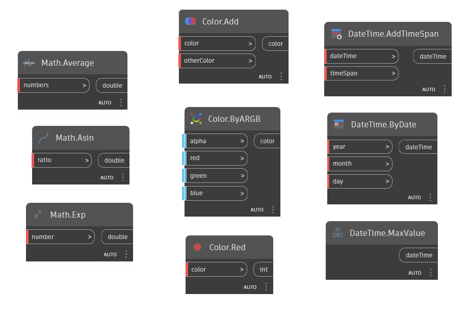
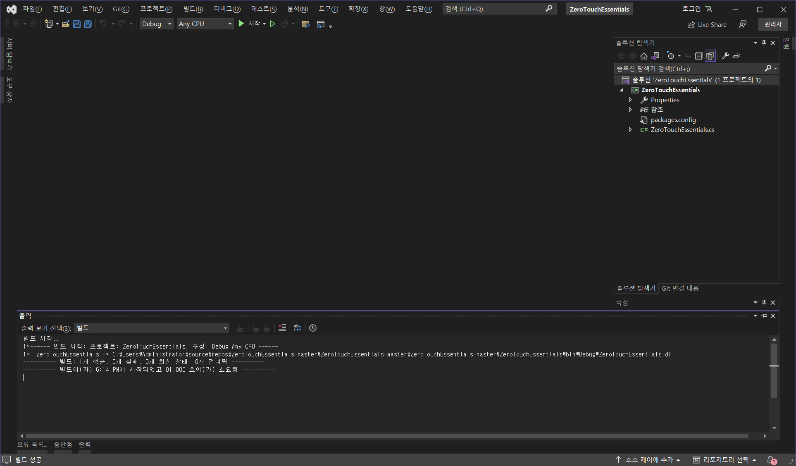
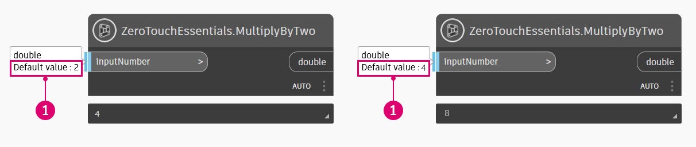
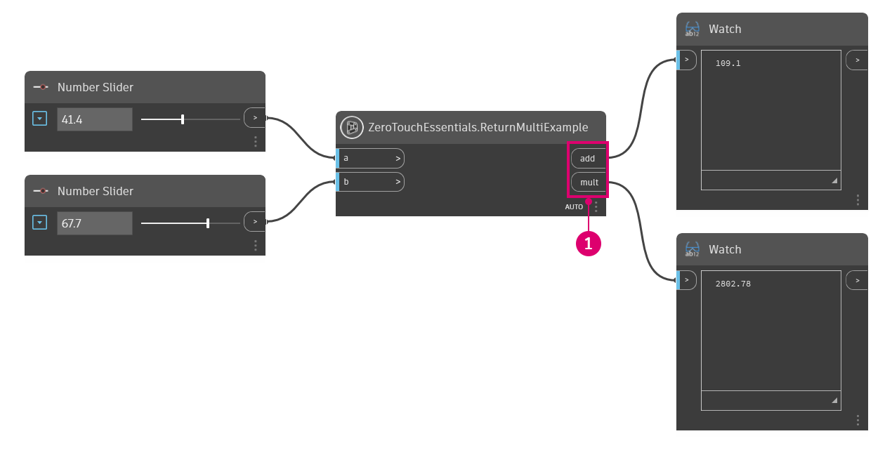
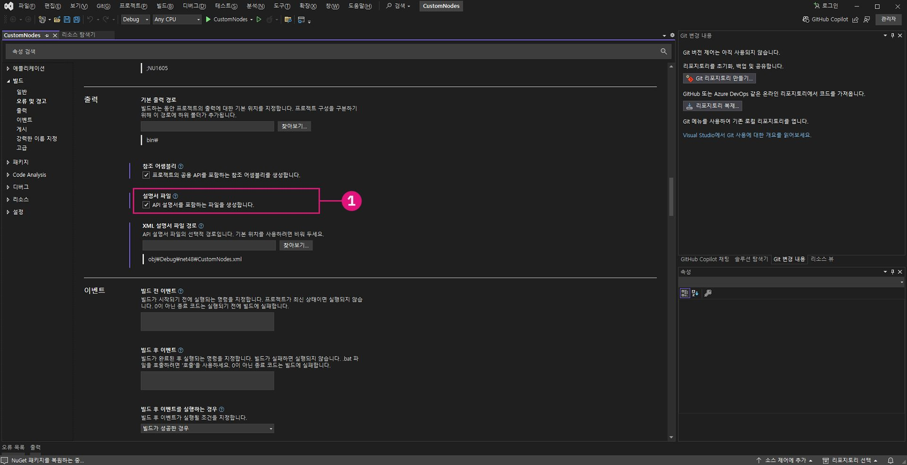
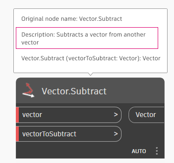
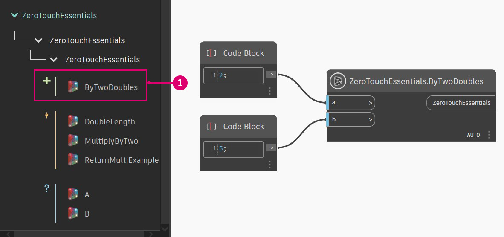
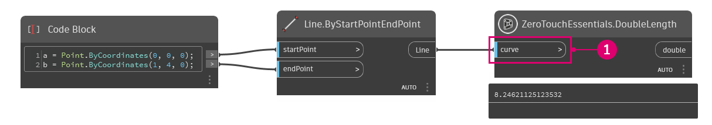
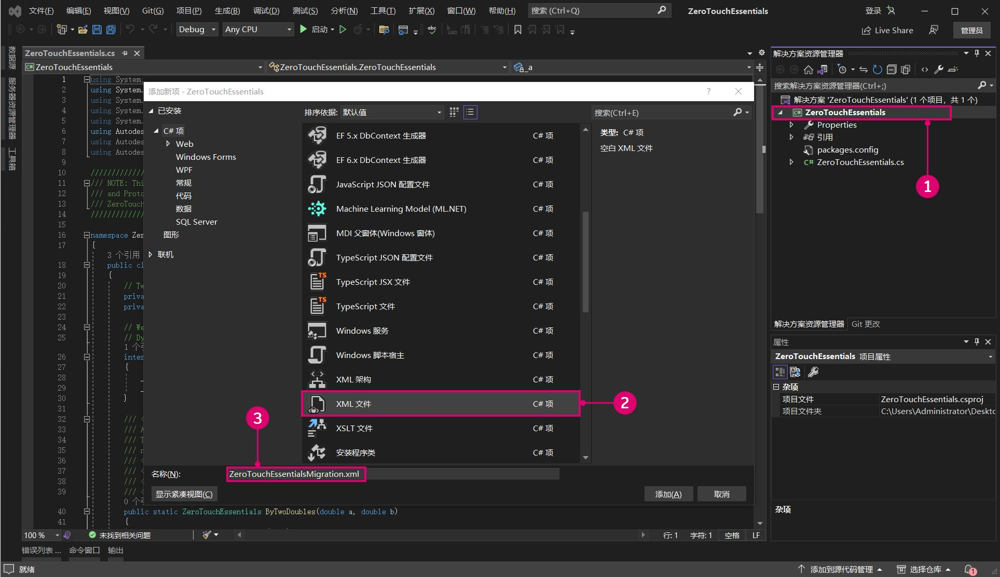

# Aller plus loin avec Zero-Touch

Après avoir appris à créer un projet Zero-Touch, nous pouvons approfondir les spécificités de la création d’un nœud en parcourant l’exemple ZeroTouchEssentials sur Dynamo Github.



> De nombreux nœuds standard de Dynamo sont essentiellement des nœuds Zero-Touch, comme la plupart des nœuds Math, Color et DateTime ci-dessus.

Pour commencer, téléchargez le projet ZeroTouchEssentials à partir de l’emplacement suivant : [https://github.com/DynamoDS/ZeroTouchEssentials](https://github.com/DynamoDS/ZeroTouchEssentials)

Dans Visual Studio, ouvrez le fichier solution `ZeroTouchEssentials.sln` et générez la solution.



> Le fichier `ZeroTouchEssentials.cs` contient toutes les méthodes que vous allez importer dans Dynamo.

Ouvrez Dynamo et importez le `ZeroTouchEssentials.dll` pour obtenir les nœuds que vous allez référencer dans les exemples suivants.

Les exemples de code sont tirés de [ZeroTouchEssentials.cs](https://github.com/DynamoDS/ZeroTouchEssentials/blob/master/ZeroTouchEssentials/ZeroTouchEssentials.cs) et correspondent généralement à ce dernier. La documentation XML a été supprimée pour préserver la concision, et chaque exemple de code créera le nœud figurant dans l’image ci-dessus.

### Valeur d’entrée par défaut <a href="#default-input-values" id="default-input-values"></a>

Dynamo prend en charge la définition de valeurs par défaut pour les ports d’entrée d’un nœud. Ces valeurs par défaut seront fournies au nœud si les ports ne sont pas connectés. Les valeurs par défaut sont exprimées à l’aide du mécanisme C# qui spécifie les arguments facultatifs dans le [Guide de programmation C#](https://msdn.microsoft.com/en-us/library/dd264739.aspx). Les valeurs par défaut sont spécifiées de la manière suivante :

* Définissez les paramètres de la méthode à une valeur par défaut : `inputNumber = 2.0`

```
namespace ZeroTouchEssentials
{
    public class ZeroTouchEssentials
    {
        // Set the method parameter to a default value
        public static double MultiplyByTwo(double inputNumber = 2.0) 
        {
            return inputNumber * 2.0;
        }
    }
}
```



> 1. La valeur par défaut s’affiche lorsque vous passez le curseur sur le port d’entrée du nœud.

### Renvoyer plusieurs valeurs <a href="#returning-multiple-values" id="returning-multiple-values"></a>

Le renvoi de plusieurs valeurs est un peu plus complexe que la création de plusieurs entrées et devra être renvoyé à l’aide d’un dictionnaire. Les entrées du dictionnaire deviennent des ports sur le côté sortie du nœud. Les ports de retour multiples peuvent être créés de la manière suivante :

* ajoutez `using System.Collections.Generic;` pour utiliser `Dictionary<>` ;
* ajoutez `using Autodesk.DesignScript.Runtime;` pour utiliser l’attribut `MultiReturn`. Cela fait référence à « DynamoServices.dll » du package DynamoServices NuGet ;
* ajoutez l’attribut `[MultiReturn(new[] { "string1", "string2", ... more strings here })]` à la méthode. Les chaînes font référence aux clés du dictionnaire et deviendront les noms des ports de sortie ;
* renvoyez un `Dictionary<>` de la fonction dont les clés correspondent aux noms des paramètres dans l’attribut : `return new Dictionary<string, object>`.

```
using System.Collections.Generic;
using Autodesk.DesignScript.Runtime;

namespace ZeroTouchEssentials
{
    public class ZeroTouchEssentials
    {
        [MultiReturn(new[] { "add", "mult" })]
        public static Dictionary<string, object> ReturnMultiExample(double a, double b)
        {
            return new Dictionary<string, object>

                { "add", (a + b) },
                { "mult", (a * b) }
            };
        }
    }
}
```

> Référez-vous à cet exemple de code dans [ZeroTouchEssentials.cs](https://github.com/DynamoDS/ZeroTouchEssentials/blob/9917fd8159afc9e7bdb2944c960155a496e0b2dc/ZeroTouchEssentials/ZeroTouchEssentials.cs#L70)

Un nœud qui renvoie plusieurs sorties.



> 1. Notez que deux ports de sortie sont désormais nommés en fonction des chaînes que nous avons saisies pour les clés du dictionnaire.

### Documentation, info-bulles et recherche <a href="#documentation-tooltips-and-search" id="documentation-tooltips-and-search"></a>

Il est recommandé d’ajouter de la documentation aux nœuds Dynamo pour décrire la fonction du nœud, les entrées, les sorties, les balises de recherche, etc. Cela se fait par le biais de balises de documentation XML. Pour créer de la documentation XML, procédez de la manière suivante :

* tout texte de commentaire précédé de trois barres obliques est considéré comme de la documentation ;
  * par exemple : `/// Documentation text and XML goes here`
* après les trois barres obliques, créez des balises XML au-dessus des méthodes que Dynamo lira lors de l’importation du fichier .dll ;
  * par exemple : `/// <summary>...</summary>`
* Activez la documentation XML dans Visual Studio en sélectionnant `Project > [Project] Properties > Build > Output` et en cochant la case `Documentation file`.



> 1. Visual Studio générera un fichier XML à l’emplacement spécifié.

Les types de balises sont les suivants :

* `/// <summary>...</summary>` est la documentation principale de votre nœud et apparaît sous forme d’infobulle au-dessus de votre nœud dans la barre latérale de recherche gauche ;
* `/// <param name="inputName">...</param>` créera une documentation pour des paramètres d’entrée spécifiques ;
* `/// <returns>...</returns>` créera une documentation pour un paramètre de sortie ;
* `/// <returns name = "outputName">...</returns>` créera une documentation pour plusieurs paramètres de sortie ;
* `/// <search>...</search>` fera correspondre votre nœud à des résultats de recherche basés sur une liste séparée par des virgules. Par exemple, si nous créons un nœud qui subdivise un maillage, nous pouvons ajouter des balises telles que « maillage », « subdivision » et « catmull-clark ».

L’exemple suivant présente un nœud avec des descriptions d’entrée et de sortie, ainsi qu’un résumé qui s’affichera dans la bibliothèque.

```
using Autodesk.DesignScript.Geometry;

namespace ZeroTouchEssentials
{
    public class ZeroTouchEssentials
    {
        /// <summary>
        /// This method demonstrates how to use a native geometry object from Dynamo
        /// in a custom method
        /// </summary>
        /// <param name="curve">Input Curve. This can be of any type deriving from Curve, such as NurbsCurve, Arc, Circle, etc</param>
        /// <returns>The twice the length of the Curve </returns>
        /// <search>example,curve</search>
        public static double DoubleLength(Curve curve)
        {
            return curve.Length * 2.0;
        }
    }
}
```

> Reportez-vous à cet exemple de code dans [ZeroTouchEssentials.cs](https://github.com/DynamoDS/ZeroTouchEssentials/blob/9917fd8159afc9e7bdb2944c960155a496e0b2dc/ZeroTouchEssentials/ZeroTouchEssentials.cs#L80).

Notez que le code de cet exemple de nœud contient :

> 1. un résumé du nœud ;
> 2. une description d’entrée ;
> 3. une description de sortie.

#### Meilleures pratiques concernant les descriptions des nœuds Dynamo 

Les descriptions de nœud décrivent brièvement la fonction et la sortie d’un nœud. Dans Dynamo, elles apparaissent à deux endroits :

- Dans l’info-bulle du nœud
- Dans le navigateur de documentation



Suivez ces instructions pour harmoniser les descriptions de nœud et gagner du temps lors de leur rédaction ou de leur mise à jour.

##### Présentation

Les descriptions doivent comporter une ou deux phrases. Si des informations supplémentaires sont nécessaires, ajoutez-les à la section Description approfondie du navigateur de documentation.

Casse des phrases (mettez en majuscule le premier mot de chaque phrase et les noms propres). Pas de point à la fin.

Le langage doit être aussi clair et simple que possible. Expliquez les acronymes la première fois qu’ils apparaissent, à moins qu’ils ne soient connus même des utilisateurs non experts.

Privilégiez toujours la clarté, même si cela implique de vous écarter de ces instructions.

##### Instructions

| À faire      | À ne pas faire |
| ----------- | ----------- |
| Commencez la description par un verbe à la troisième personne. <ul><li>Exemple : *Determines* if one geometry object intersects with another</li></ul>      | Ne commencez pas par un verbe à la deuxième personne du pluriel ou par un nom. <ul><li>Exemple : *Determine* if one geometry object intersects with another</li></ul>       |
| Utilisez « Returns », « Creates » ou un autre verbe descriptif plutôt que « Gets ». <ul><li>Exemple : *Returns* a Nurbs representation of a surface</li></ul>   | N’utilisez pas « Get » ou « Gets ». Ce verbe est moins spécifique et a plusieurs traductions possibles. <ul><li>Exemple : *Gets* a Nurbs representation of the surface</li></ul>        |
| Lorsque vous vous référez à des entrées, utilisez « given » ou « input » plutôt que « specified » ou tout autre terme. Omettez « given » ou « input » lorsque cela est possible pour simplifier la description et réduire le nombre de mots. <ul><li>Exemple : Deletes the *given* file</li><li>Exemple : Projects a curve along the *given* projection direction onto *given* base geometry</li></ul>Vous pouvez utiliser « specified » lorsque vous ne faites pas directement référence à une entrée. <ul><li>Exemple : Writes text content to a file *specified* by the given path</li></ul>       | Lorsque vous faites référence à des entrées, pour harmoniser vos descriptions, n’utilisez pas « specified » ni tout autre terme autre que « given » ou « input ». Ne mélangez pas « given » et « input » dans la même description, à moins que cela ne soit nécessaire pour plus de clarté. <ul><li>Exemple : Deletes the *specified* file</li><li>Exemple : Projects an *input* curve along a *given* projection direction onto a *specified* base geometry</li></ul>      |
| Utilisez « a » ou « an » lorsque vous faites référence à une entrée pour la première fois. Utilisez « the given » ou « the input » plutôt que « a » ou « an » si cela est nécessaire pour plus de clarté.<ul><li>Exemple : Sweeps *a* curve along the path curve</li></ul>      | N’utilisez pas « this » lorsque vous faites référence à une entrée pour la première fois. <ul><li>Exemple : Sweeps *this* curve along the path curve      |
| Lorsque vous faites référence pour la première fois à une sortie ou à un autre nom qui est la cible de l’opération de nœud, utilisez « a » ou « an ». N’utilisez « the » que lorsque vous l’associez à « input » ou « given ». <ul><li>Exemple : Copies *a* file</li><li>Exemple : Copies *the given* file</li></ul>      | Lorsque vous faites référence pour la première fois à une sortie ou à un autre nom qui est la cible de l’opération de nœud, n’utilisez pas « the » seul. <ul><li>Exemple : Copies *the* file</li></ul>      |
| Mettez une majuscule au premier mot de chaque phrase et aux noms propres, comme les noms de personnes et d’autres noms qui sont généralement mis en majuscule. <ul><li>Exemple : Returns the intersection of two *BoundingBoxes*</li></ul>      | Ne mettez pas de majuscules aux concepts et objets de géométrie courants, à moins que cela ne soit nécessaire pour plus de clarté. <ul><li>Exemple : Scales non-uniformly around the given *Plane*      |
| Mettez une majuscule à « Boolean ». Mettez une majuscule à « True » et « False » lorsque vous faites référence à la sortie de booléens. <ul><li>Exemple : Returns *True* if the two values are different</li><li>Exemple : Converts a string to all uppercase or all lowercase characters based on a *Boolean* parameter      | Ne mettez pas « Boolean » en minuscules. Ne mettez pas « True » et « False » en minuscules lorsque vous faites référence à la sortie de booléens. <ul><li>Exemple : Returns *true* if the two values are different</li><li>Exemple : Converts a string to all uppercase characters or all lowercase characters based on a *boolean* parameter</li></ul>

#### Avertissements et erreurs liés aux nœuds Dynamo

Les avertissements et les erreurs liés aux nœuds informent l’utilisateur d’un problème concernant le graphe. Ils avertissent l’utilisateur de problèmes qui interfèrent avec le fonctionnement normal du graphe en affichant une icône et une bulle de texte ouverte au-dessus du nœud. Les erreurs et les avertissements liés aux nœuds peuvent varier en gravité : certains graphes peuvent s’exécuter suffisamment avec des avertissements, tandis que d’autres bloquent les résultats attendus. Dans tous les cas, les erreurs et les avertissements liés aux nœuds sont des outils importants pour tenir l’utilisateur au courant des problèmes liés à son graphe.

Pour obtenir des instructions afin d’assurer la cohérence et de gagner du temps lors de la rédaction ou de la mise à jour de messages d’avertissement et d’erreur concernant les nœuds, veuillez vous référer à la page Wiki [Modèle de contenu : avertissements et erreurs liés aux nœuds](https://github.com/DynamoDS/Dynamo/wiki/Content-Pattern:-Node-Warnings-and-Errors).

### Objets <a href="#objects" id="objects"></a>

Dynamo ne possède pas de mot-clé `new`, les objets doivent donc être construits à l’aide de méthodes de construction statiques. Les objets sont construits de la façon suivante :

* rendez le constructeur interne `internal ZeroTouchEssentials()` à moins de devoir le faire autrement ;
* construisez l’objet avec une méthode statique telle que `public static ZeroTouchEssentials ByTwoDoubles(a, b)`.

> Remarque : Dynamo utilise le préfixe « By » pour indiquer qu’une méthode statique est un constructeur, et bien que cela soit optionnel, l’utilisation de « By » aidera votre bibliothèque à mieux s’adapter au style existant de Dynamo.

```
namespace ZeroTouchEssentials
{
    public class ZeroTouchEssentials
    {
        private double _a;
        private double _b;

        // Make the constructor internal
        internal ZeroTouchEssentials(double a, double b)
        {
            _a = a;
            _b = b;
        }

        // The static method that Dynamo will convert into a Create node
        public static ZeroTouchEssentials ByTwoDoubles(double a, double b)
        {
            return new ZeroTouchEssentials(a, b);
        }
    }
}
```

> Reportez-vous à cet exemple de code dans [ZeroTouchEssentials.cs](https://github.com/DynamoDS/ZeroTouchEssentials/blob/9917fd8159afc9e7bdb2944c960155a496e0b2dc/ZeroTouchEssentials/ZeroTouchEssentials.cs#L26).

Une fois que le .dll ZeroTouchEssentials a été importé, un nœud ZeroTouchEssentials sera présent dans la bibliothèque. Cet objet peut être créé en utilisant le nœud `ByTwoDoubles`.



### Utiliser des types de géométrie Dynamo <a href="#using-dynamo-geometry-types" id="using-dynamo-geometry-types"></a>

Les bibliothèques Dynamo peuvent utiliser les types de géométrie Dynamo en entrée et créer de nouvelles géométries en sortie. Les types de géométrie sont créés de la manière suivante :

* Référencez « ProtoGeometry.dll » dans le projet en incluant `using Autodesk.DesignScript.Geometry;` au début de votre fichier C# et en ajoutant le package NuGet ZeroTouchLibrary au projet.
* **Important :** gérez les ressources de géométrie qui ne sont pas renvoyées par vos fonctions. Reportez-vous à la section **Instructions using/dispose** ci-dessous.

> Remarque : les objets de géométrie Dynamo sont utilisés comme tout autre objet transmis aux fonctions.

```
using Autodesk.DesignScript.Geometry;

namespace ZeroTouchEssentials
{
    public class ZeroTouchEssentials
    {
        // "Autodesk.DesignScript.Geometry.Curve" is specifying the type of geometry input, 
        // just as you would specify a double, string, or integer 
        public static double DoubleLength(Autodesk.DesignScript.Geometry.Curve curve)
        {
            return curve.Length * 2.0;
        }
    }
}
```

> Reportez-vous à cet exemple de code dans [ZeroTouchEssentials.cs](https://github.com/DynamoDS/ZeroTouchEssentials/blob/9917fd8159afc9e7bdb2944c960155a496e0b2dc/ZeroTouchEssentials/ZeroTouchEssentials.cs#L86).

Un nœud qui obtient la longueur d’une courbe et la double.



> 1. Ce nœud accepte un type de géométrie Courbe comme entrée.

### Instructions using/dispose <a href="#disposeusing-statements" id="disposeusing-statements"></a>

Les ressources de géométrie qui ne sont pas renvoyées par les fonctions devront être gérées manuellement à moins que vous n’utilisiez Dynamo version 2.5 ou ultérieure. Dans Dynamo 2.5 et versions ultérieures, les ressources de géométrie sont gérées en interne par le système. Toutefois, vous devrez peut-être supprimer la géométrie manuellement si vous avez un cas d’utilisation complexe ou si vous devez réduire la mémoire à un moment précis. Le moteur Dynamo traitera toutes les ressources de géométrie qui sont renvoyées par des fonctions. Les ressources de géométrie qui ne sont pas renvoyées peuvent être traitées manuellement de l’une des manières suivantes :

*   Avec une instruction using :

    ```
    using (Point p1 = Point.ByCoordinates(0, 0, 0))
    {
      using (Point p2 = Point.ByCoordinates(10, 10, 0))
      {
          return Line.ByStartPointEndPoint(p1, p2);
      }
    }
    ```

    > L’instruction using est décrite [ici](https://msdn.microsoft.com/en-us/library/yh598w02.aspx).
    >
    > Reportez-vous à la rubrique [Améliorations apportées à la stabilité de la géométrie Dynamo](https://forum.dynamobim.com/t/dynamo-geometry-stability-improvements-request-for-feedback/39297) pour en savoir plus sur les nouvelles fonctions de stabilité introduites dans Dynamo 2.5.
*   Avec les appels dispose manuels :

    ```
    Point p1 = Point.ByCoordinates(0, 0, 0);
    Point p2 = Point.ByCoordinates(10, 10, 0);
    Line l = Line.ByStartPointEndPoint(p1, p2);
    p1.Dispose();
    p2.Dispose();
    return l;
    ```

### Migrations <a href="#migrations" id="migrations"></a>

Lors de la publication d’une nouvelle version d’une bibliothèque, les noms des nœuds peuvent changer. Les changements de nom peuvent être spécifiés dans un fichier migrations afin que les graphiques générés sur des versions antérieures d’une bibliothèque continuent à fonctionner correctement lorsqu’une mise à jour est effectuée. Les migrations sont implémentées de la manière suivante :

* créez un fichier `.xml` dans le même dossier que le `.dll` au format suivant : « BaseDLLName ».Migrations.xml ;
* dans le `.xml`, créez un seul élément `<migrations>...</migrations>` ;
* dans l’élément migrations, créez `<priorNameHint>...</priorNameHint>` éléments pour chaque changement de nom ;
* pour chaque changement de nom, fournissez un élément `<oldName>...</oldName>` et `<newName>...</newName>`.



> 1. Cliquez avec le bouton droit de la souris et sélectionnez `Add > New Item`
> 2. Choisissez `XML File`
> 3. Pour ce projet, nous nommerons le fichier migrations `ZeroTouchEssentials.Migrations.xml`

Cet exemple de code indique à Dynamo que tout nœud nommé `GetClosestPoint` est désormais nommé `ClosestPointTo`.

```
<?xml version="1.0"?>
<migrations>
  <priorNameHint>
    <oldName>Autodesk.DesignScript.Geometry.Geometry.GetClosestPoint</oldName>
    <newName>Autodesk.DesignScript.Geometry.Geometry.ClosestPointTo</newName>
  </priorNameHint>
</migrations>
```

> Reportez-vous à cet exemple de code dans [ProtoGeometry.Migrations.xml](https://github.com/DynamoDS/Dynamo/blob/master/extern/ProtoGeometry/ProtoGeometry.Migrations.xml).

### Génériques <a href="#generics" id="generics"></a>

Zero-Touch ne prend pas en charge l’utilisation de génériques pour l’instant. Ils peuvent être utilisés, mais pas dans le code importé directement lorsque le type n’est pas défini. Les méthodes, propriétés ou classes génériques qui ne possèdent pas le type défini ne peuvent pas être exposées.

Dans l’exemple ci-dessous, un nœud Zero-Touch de type `T` ne sera pas importé. Si le reste de la bibliothèque est importé dans Dynamo, il y aura des exceptions de type manquant.

```
public class SomeGenericClass<T>
{
    public SomeGenericClass()
    {
        Console.WriteLine(typeof(T).ToString());
    }  
}
```

L’utilisation d’un type générique avec le type défini dans cet exemple est importée dans Dynamo.

```
public class SomeWrapper
{
    public object wrapped;
    public SomeWrapper(SomeGenericClass<double> someConstrainedType)
    {
        Console.WriteLine(this.wrapped.GetType().ToString());
    }
}
```
