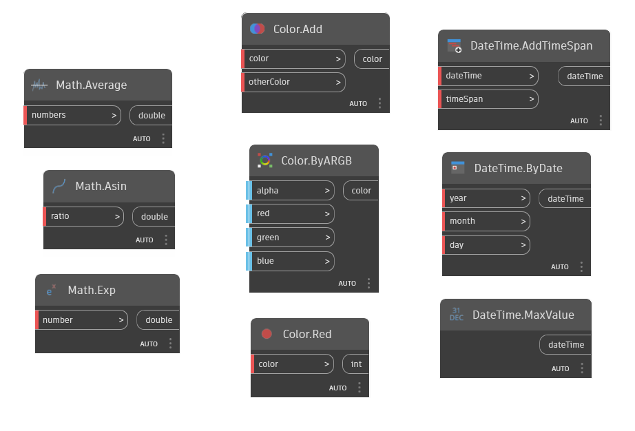
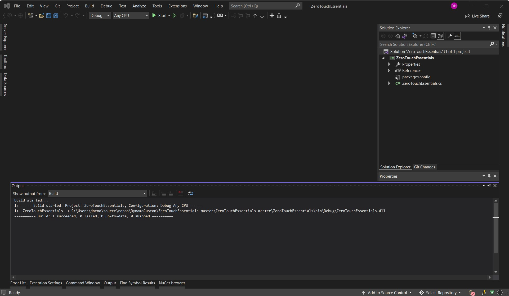
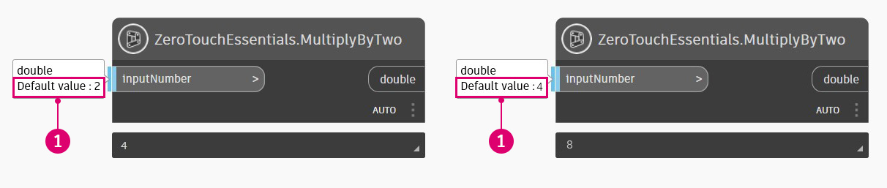
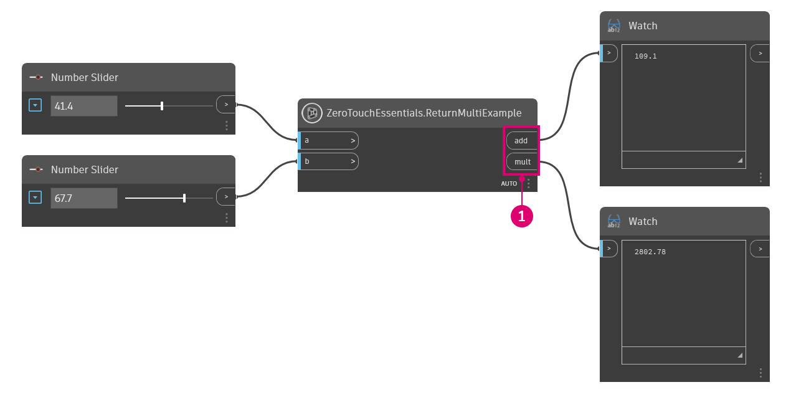
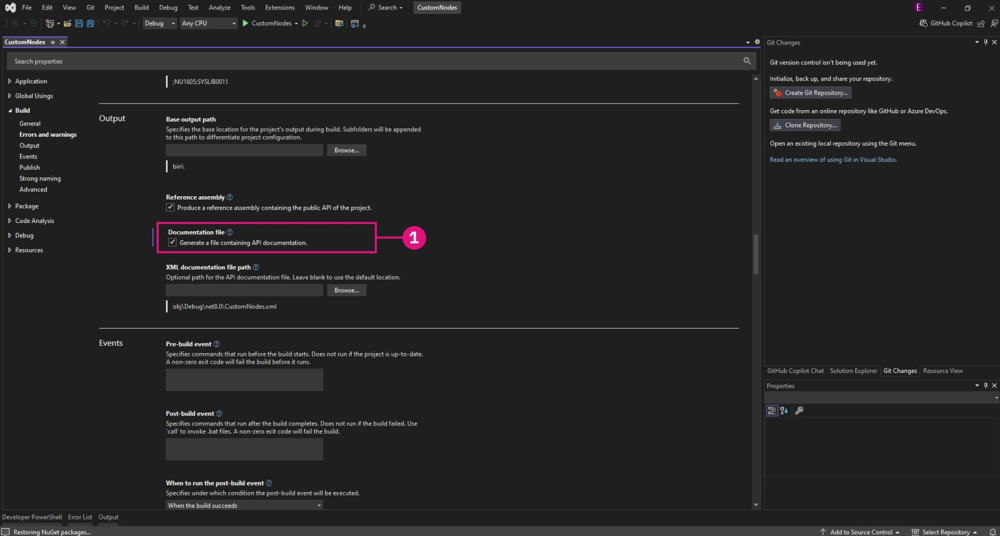
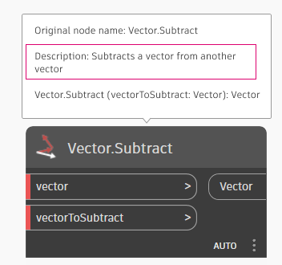
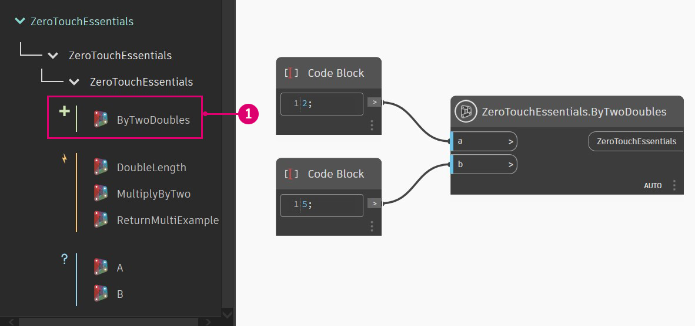
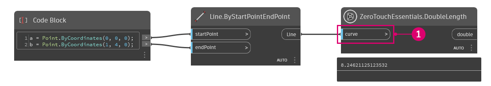
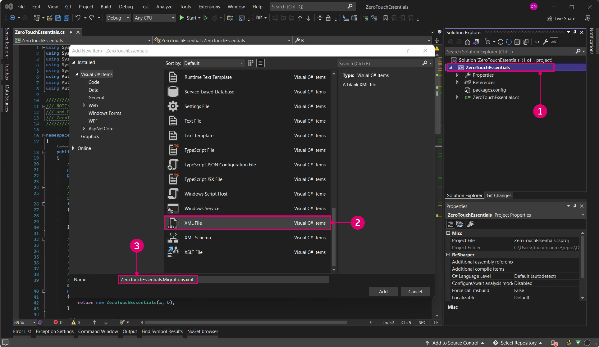

# Další práce s funkcí Zero-Touch

Když nyní víme, jak vytvořit projekt Zero-Touch, můžeme se podrobněji seznámit se specifiky vytváření uzlu a projít si příklad ZeroTouchEssentials na GitHubu aplikace Dynamo.



> Mnoho standardních uzlů aplikace Dynamo jsou v podstatě uzly Zero-Touch, například většina výše uvedených uzlů Math, Color a DateTime.

Nejprve si stáhněte projekt ZeroTouchEssentials z tohoto umístění: [https://github.com/DynamoDS/ZeroTouchEssentials](https://github.com/DynamoDS/ZeroTouchEssentials)

V aplikaci Visual Studio otevřete soubor řešení `ZeroTouchEssentials.sln` a sestavte řešení.



> Soubor `ZeroTouchEssentials.cs` obsahuje všechny metody, které budeme importovat do aplikace Dynamo.

Otevřete aplikaci Dynamo a importujte knihovnu `ZeroTouchEssentials.dll`, abyste získali uzly, na které budeme odkazovat v následujících příkladech.

Příklady kódu jsou získány ze souboru [ZeroTouchEssentials.cs](https://github.com/DynamoDS/ZeroTouchEssentials/blob/master/ZeroTouchEssentials/ZeroTouchEssentials.cs) a obecně se s ním shodují. Dokumentace XML byla odstraněna, aby byl projekt stručnější, a každý příklad kódu vytvoří uzel na obrázku nad ním.

### Výchozí vstupní hodnota <a href="#default-input-values" id="default-input-values"></a>

Aplikace Dynamo podporuje definici výchozích hodnot vstupních portů v uzlu. Tyto výchozí hodnoty budou do uzlu zadány, pokud porty nemají žádná připojení. Výchozí hodnoty jsou vyjádřeny pomocí mechanismu jazyka C# pro zadávání volitelných argumentů popsaném v [Příručce programování v jazyce C#](https://msdn.microsoft.com/en-us/library/dd264739.aspx). Výchozí hodnoty jsou určeny následujícím způsobem:

* Nastavte parametry metody na výchozí hodnotu: `inputNumber = 2.0`

```
namespace ZeroTouchEssentials
{
    public class ZeroTouchEssentials
    {
        // Set the method parameter to a default value
        public static double MultiplyByTwo(double inputNumber = 2.0) 
        {
            return inputNumber * 2.0;
        }
    }
}
```



> 1. Výchozí hodnota se zobrazí, když umístíte kurzor nad vstupní port uzlu.

### Vrácení více hodnot <a href="#returning-multiple-values" id="returning-multiple-values"></a>

Vracení více hodnot je o něco složitější než vytváření více vstupů a je třeba je vracet pomocí slovníku. Položky slovníku se stanou porty na výstupní straně uzlu. Porty vracející více hodnot se vytvářejí následujícím způsobem:

* Přidejte `using System.Collections.Generic;` pro použití položky `Dictionary<>`.
* Přidejte `using Autodesk.DesignScript.Runtime;` pro použití atributu `MultiReturn`. Tento kód odkazuje na knihovnu DynamoServices.dll z balíčku DynamoServices NuGet.
* Přidejte do metody atribut `[MultiReturn(new[] { "string1", "string2", ... more strings here })]`. Řetězce odkazují na klíče ve slovníku a stanou se názvy výstupních portů.
* Vraťte `Dictionary<>` z funkce s klíči, které odpovídají názvům parametrů v atributu: `return new Dictionary<string, object>`

```
using System.Collections.Generic;
using Autodesk.DesignScript.Runtime;

namespace ZeroTouchEssentials
{
    public class ZeroTouchEssentials
    {
        [MultiReturn(new[] { "add", "mult" })]
        public static Dictionary<string, object> ReturnMultiExample(double a, double b)
        {
            return new Dictionary<string, object>

                { "add", (a + b) },
                { "mult", (a * b) }
            };
        }
    }
}
```

> Podívejte se na tento příklad kódu v souboru [ZeroTouchEssentials.cs](https://github.com/DynamoDS/ZeroTouchEssentials/blob/9917fd8159afc9e7bdb2944c960155a496e0b2dc/ZeroTouchEssentials/ZeroTouchEssentials.cs#L70).

Uzel, který vrací více výstupů.



> 1. Všimněte si, že nyní existují dva výstupní porty pojmenované podle řetězců, které jsme zadali pro klíče slovníku.

### Dokumentace, popisky a vyhledávání <a href="#documentation-tooltips-and-search" id="documentation-tooltips-and-search"></a>

Osvědčeným postupem je přidat k uzlům aplikace Dynamo dokumentaci, která popisuje funkci uzlu, vstupy, výstupy, vyhledávací štítky atd. To se provádí pomocí štítků dokumentace XML. Dokumentace XML je vytvořena následujícím způsobem:

* Za dokumentaci se považuje jakýkoli text komentáře, kterému předcházejí tři lomítka.
  * Například: `/// Documentation text and XML goes here`
* Za třemi lomítky vytvořte nad metodami štítky XML, které aplikace Dynamo přečte při importu knihovny DLL.
  * Například: `/// <summary>...</summary>`
* Povolte dokumentaci XML v aplikaci Visual Studio výběrem možnosti `Project > [Project] Properties > Build > Output` a zaškrtnutím políčka `Documentation file`.



> 1. Aplikace Visual Studio vygeneruje soubor XML v zadaném umístění.

Typy štítků jsou následující:

* `/// <summary>...</summary>` je hlavní dokumentace pro uzel a zobrazí se jako popisek nad uzlem v levém postranním panelu vyhledávání.
* `/// <param name="inputName">...</param>` vytvoří dokumentaci pro specifické vstupní parametry.
* `/// <returns>...</returns>` vytvoří dokumentaci pro výstupní parametr.
* `/// <returns name = "outputName">...</returns>` vytvoří dokumentaci pro více výstupních parametrů.
* `/// <search>...</search>` porovná uzel s výsledky hledání na základě seznamu odděleného čárkou. Pokud například vytvoříme uzel, který rozdělí síť, může být vhodné přidat štítky jako „sít“, „dělení“ a „catmull-clark“.

Níže je uveden příklad uzlu s popisem vstupu a výstupu a také souhrnem, který se zobrazí v knihovně.

```
using Autodesk.DesignScript.Geometry;

namespace ZeroTouchEssentials
{
    public class ZeroTouchEssentials
    {
        /// <summary>
        /// This method demonstrates how to use a native geometry object from Dynamo
        /// in a custom method
        /// </summary>
        /// <param name="curve">Input Curve. This can be of any type deriving from Curve, such as NurbsCurve, Arc, Circle, etc</param>
        /// <returns>The twice the length of the Curve </returns>
        /// <search>example,curve</search>
        public static double DoubleLength(Curve curve)
        {
            return curve.Length * 2.0;
        }
    }
}
```

> Podívejte se na tento příklad kódu v souboru [ZeroTouchEssentials.cs](https://github.com/DynamoDS/ZeroTouchEssentials/blob/9917fd8159afc9e7bdb2944c960155a496e0b2dc/ZeroTouchEssentials/ZeroTouchEssentials.cs#L80).

Všimněte si, že kód pro tento vzorový uzel obsahuje:

> 1. Souhrn uzlu
> 2. Popis vstupu
> 3. Popis výstupu

#### Popisy uzlů aplikace Dynamo – osvědčené postupy

Popisy uzlů stručně popisují funkci a výstup uzlu. V aplikaci Dynamo se objevují na dvou místech:

* V popisku nástroje uzlu.
* V Prohlížeči dokumentace.



Dodržováním těchto pokynů zajistíte konzistenci a ušetříte čas při psaní nebo aktualizaci popisů uzlů.

**Přehled**

Popis by měl obsahovat jednu až dvě věty. Pokud jsou potřeba další informace, uveďte je v Prohlížeči dokumentace v části Podrobnosti.

Větná stavba (první slovo věty a vlastní podstatná jména pište s velkým počátečním písmenem). Na konci není tečka.

Jazyk by měl být co nejsrozumitelnější a nejjednodušší. Definujte zkratky při první zmínce, pokud nejsou známé i neodborným uživatelům.

Vždy upřednostněte srozumitelnost, i kdyby to mělo znamenat, že se odchýlíte od těchto pokynů.

**Pokyny**

| Co dělat                                                                                                                                                                                                                                                                                                                                                                                                                                                                                                                                        | Co nedělat                                                                                                                                                                                                                                                                                                                                                                                                          |
| ------------------------------------------------------------------------------------------------------------------------------------------------------------------------------------------------------------------------------------------------------------------------------------------------------------------------------------------------------------------------------------------------------------------------------------------------------------------------------------------------------------------------------------------- | --------------------------------------------------------------------------------------------------------------------------------------------------------------------------------------------------------------------------------------------------------------------------------------------------------------------------------------------------------------------------------------------------------------- |
| <p>Popis začínejte slovesem ve třetí osobě.</p><ul><li>Příklad: <em>Určuje</em>, zda se jeden geometrický objekt protíná s jiným.</li></ul>                                                                                                                                                                                                                                                                                                                                                                                         | <p>Nezačínejte slovesem ve druhé osobě ani žádným podstatným jménem.</p><ul><li>Příklad: <em>Určete</em>, zda se jeden geometrický objekt protíná s jiným.</li></ul>                                                                                                                                                                                                                                                      |
| <p>Místo slovesa „Získá“ použijte „Vrátí“, „Vytvoří“ nebo jiné popisné sloveso.</p><ul><li>Příklad: <em>Vrátí</em> reprezentaci NURBS povrchu.</li></ul>                                                                                                                                                                                                                                                                                                                                                                              | <p>Nepoužívejte sloveso „Získá“ (při psaní popisu v angličtině nepoužívejte slovesa „Get“ nebo „Gets“). Je to méně konkrétní a méně přesné.</p><ul><li>Příklad: <em>Získá</em> reprezentaci NURBS povrchu</li></ul>                                                                                                                                                                                                                                       |
| <p>Pokud píšete popis v angličtině a odkazujete na vstupy, použijte slovo „given“ nebo „input“ místo „specified“ nebo jiných výrazů. Pokud je to však možné, vynechejte i tato slova, abyste popis zjednodušili a snížili počet slov.</p><ul><li>Příklad: Deletes the <em>given</em> file</li><li>Příklad: Projects a curve along the <em>given</em> projection direction onto <em>given</em> base geometry</li></ul><p>Slovo „specified“ můžete použít v případě, že neodkazuje na vstup.</p><ul><li>Příklad: Writes text content to a file <em>specified</em> by the given path</li></ul> | <p>Při odkazování na vstupy nepoužívejte kvůli konzistenci výraz „specified“ ani žádný jiný výraz kromě „given“ nebo „input“. Nemíchejte výrazy „given“ a „input“ ve stejném popisu, pokud to není nutné kvůli srozumitelnosti.</p><ul><li>Příklad: Deletes the <em>specified</em> file</li><li>Příklad: Projects an <em>input</em> curve along a <em>given</em> projection direction onto a <em>specified</em> base geometry</li></ul> |
| <p>Pokud píšete popis v angličtině, použijte při prvním odkazování na vstup člen „a“ nebo „an“. Místo slov „a“ nebo „an“ používejte v případě potřeby kvůli přehlednosti „the given“ nebo „the input“.</p><ul><li>Příklad: Sweeps <em>a</em> curve along the path curve</li></ul>                                                                                                                                                                                                                                                                                                                                | <p>Při prvním odkazu na vstup nepoužívejte v angličtině zájmeno „this“.</p><ul><li>Příklad: Sweeps <em>this</em> curve along the path curve</li></ul>                                                                                                                                                                                                                                                                             |
| <p>Při prvním odkazu na výstup nebo jiné podstatné jméno, které je cílem operace uzlu, použijte člen „a“ nebo „an“. Člen „the“ používejte pouze ve spojení se slovem „input“ nebo „given“.</p><ul><li>Příklad: Copies <em>a</em> file</li><li>Příklad: Copies <em>the given</em> file</li></ul>                                                                                                                                                                                                                                                                   | <p>Při prvním odkazu na výstup nebo jiné podstatné jméno, které je cílem operace uzlu, nepoužívejte člen „the“ samostatně.</p><ul><li>Příklad: Copies <em>the</em> file</li></ul>                                                                                                                                                                                                                                  |
| <p>První slovo věty a všechna vlastní jména, jako jsou jména a tradičně psaná podstatná jména, pište s počátečním velkým písmenem.</p><ul><li>Příklad: Vrátí průsečík dvou objektů <em>BoundingBox</em>.</li></ul>                                                                                                                                                                                                                                                                                                                                     | <p>U běžných geometrických objektů a pojmů nepoužívejte počáteční velká písmena, pokud to není nutné kvůli přehlednosti.</p><ul><li>Příklad: Upraví měřítko nerovnoměrně kolem dané <em>Roviny</em>.</li></ul>                                                                                                                                                                                                                                          |
| <p>Při psaní popisů v angličtině pište slovo Boolean s počátečním velkým písmenem. Při odkazování na výstup booleovských hodnot pište slova True a False s počátečním velkým písmenem.</p><ul><li>Příklad: Returns <em>true</em> if the two values are different</li><li>Příklad: Converts a string to all uppercase or all lowercase characters based on a <em>Boolean</em> parameter</li></ul>                                                                                                                                                                                                                                        | <p>Při psaní popisů v angličtině nepište slovo Boolean s počátečním malým písmenem. Při odkazování na výstup booleovských hodnot nepište slova True a False s počátečním malým písmenem.</p><ul><li>Příklad: Returns <em>true</em> if the two values are different</li><li>Příklad: Converts a string to all uppercase characters or all lowercase characters based on a <em>boolean</em> parameter</li></ul>                                                                                       |

#### Upozornění a chyby uzlu v aplikaci Dynamo

Upozornění a chyby uzlů upozorňují uživatel na problém s grafem. Uživatel je na problémy, které narušují normální fungování grafu, upozorněn zobrazením ikony a rozšířenou textovou bublinou nad uzlem. Chyby a upozornění uzlů se mohou lišit podle závažnosti: některé grafy mohou běžet dostatečně i s upozorněními, zatímco jiné blokují očekávané výsledky. Ve všech případech jsou chyby a upozornění uzlů důležitými nástroji, které uživatel průběžně informují o problémech s grafem.

Pokyny k zajištění konzistence a úspoře času při psaní nebo aktualizaci upozornění a chybových zpráv uzlů naleznete na wiki stránce [Vzor obsahu: Upozornění a chyby uzlů](https://github.com/DynamoDS/Dynamo/wiki/Content-Pattern:-Node-Warnings-and-Errors).

### Objekty <a href="#objects" id="objects"></a>

Aplikace Dynamo nemá klíčové slovo `new`, takže objekty bude nutné konstruovat pomocí statických konstrukčních metod. Objekty jsou konstruovány následujícím způsobem:

* Změňte konstruktor na vnitřní `internal ZeroTouchEssentials()`, pokud není vyžadováno jinak.
* Konstruujte objekt pomocí statické metody, například `public static ZeroTouchEssentials ByTwoDoubles(a, b)`.

> Poznámka: Aplikace Dynamo používá předponu „By“ pro označení statické metody jako konstruktoru, a i když je to volitelné, použití předpony „By“ pomůže vaší knihovně lépe se přizpůsobit existujícímu stylu aplikace Dynamo.

```
namespace ZeroTouchEssentials
{
    public class ZeroTouchEssentials
    {
        private double _a;
        private double _b;

        // Make the constructor internal
        internal ZeroTouchEssentials(double a, double b)
        {
            _a = a;
            _b = b;
        }

        // The static method that Dynamo will convert into a Create node
        public static ZeroTouchEssentials ByTwoDoubles(double a, double b)
        {
            return new ZeroTouchEssentials(a, b);
        }
    }
}
```

> Podívejte se na tento příklad kódu v souboru [ZeroTouchEssentials.cs](https://github.com/DynamoDS/ZeroTouchEssentials/blob/9917fd8159afc9e7bdb2944c960155a496e0b2dc/ZeroTouchEssentials/ZeroTouchEssentials.cs#L26).

Po importu knihovny dll ZeroTouchEssentials bude v knihovně uzel ZeroTouchEssentials. Tento objekt lze vytvořit pomocí uzlu `ByTwoDoubles`.



### Použití typů geometrie aplikace Dynamo <a href="#using-dynamo-geometry-types" id="using-dynamo-geometry-types"></a>

Knihovny aplikace Dynamo mohou jako vstupy použít nativní typy geometrie aplikace Dynamo a jako výstupy vytvořit novou geometrii. Typy geometrie se vytvářejí následujícím způsobem:

* Odkaz na knihovnu ProtoGeometry.dll v projektu vložte pomocí`using Autodesk.DesignScript.Geometry;` na začátek souboru C# a přidáním balíčku ZeroTouchLibrary NuGet do projektu.
* **Důležité:** Spravujte zdroje geometrie, které nejsou vráceny z funkcí. Další informace naleznete v části **Příkazy dispose/using** níže.

> Poznámka: Objekty geometrie aplikace Dynamo jsou používány jako jakékoli jiné objekty předávané funkcím.

```
using Autodesk.DesignScript.Geometry;

namespace ZeroTouchEssentials
{
    public class ZeroTouchEssentials
    {
        // "Autodesk.DesignScript.Geometry.Curve" is specifying the type of geometry input, 
        // just as you would specify a double, string, or integer 
        public static double DoubleLength(Autodesk.DesignScript.Geometry.Curve curve)
        {
            return curve.Length * 2.0;
        }
    }
}
```

> Podívejte se na tento příklad kódu v souboru [ZeroTouchEssentials.cs](https://github.com/DynamoDS/ZeroTouchEssentials/blob/9917fd8159afc9e7bdb2944c960155a496e0b2dc/ZeroTouchEssentials/ZeroTouchEssentials.cs#L86).

Uzel, který získá délku křivky a zdvojnásobí ji.



> 1. Tento uzel přijímá jako vstup typ geometrie Křivka.

### Příkazy dispose/using <a href="#disposeusing-statements" id="disposeusing-statements"></a>

Zdroje geometrie, které nejsou vráceny z funkcí, bude nutné spravovat ručně, pokud nepoužíváte aplikaci Dynamo verze 2.5 nebo novější. V aplikaci Dynamo 2.5 a novějších verzích jsou zdroje geometrie interně zpracovány systémem, ale i přesto může být nutné odstranit geometrii ručně, pokud máte složitý případ použití nebo potřebujete omezit paměť v pevně dané době. Modul aplikace Dynamo zpracuje všechny zdroje geometrie, které jsou vráceny z funkcí. Zdroje geometrie, které nejsou vráceny, lze zpracovat ručně následujícími způsoby:

*   Pomocí příkazu using:

    ```
    using (Point p1 = Point.ByCoordinates(0, 0, 0))
    {
      using (Point p2 = Point.ByCoordinates(10, 10, 0))
      {
          return Line.ByStartPointEndPoint(p1, p2);
      }
    }
    ```

    > Příkaz using je zdokumentován [zde](https://msdn.microsoft.com/en-us/library/yh598w02.aspx).
    >
    > Další informace o nových funkcích stability v aplikaci Dynamo 2.5 naleznete v části [Vylepšení stability geometrie aplikace Dynamo](https://forum.dynamobim.com/t/dynamo-geometry-stability-improvements-request-for-feedback/39297).
*   Pomocí ručního volání příkazu Dispose:

    ```
    Point p1 = Point.ByCoordinates(0, 0, 0);
    Point p2 = Point.ByCoordinates(10, 10, 0);
    Line l = Line.ByStartPointEndPoint(p1, p2);
    p1.Dispose();
    p2.Dispose();
    return l;
    ```

### Migrace <a href="#migrations" id="migrations"></a>

Při publikování novější verze knihovny se mohou změnit názvy uzlů. Změny názvů lze zadat v souboru migrace, aby grafy vytvořené na základě předchozích verzí knihovny správně fungovaly i po aktualizaci. Migrace jsou implementovány následujícím způsobem:

* Vytvořte soubor `.xml` ve stejné složce jako soubor `.dll` v následujícím formátu: „BaseDLLName“.Migrations.xml.
* V souboru `.xml` vytvořte jeden prvek `<migrations>...</migrations>`.
* V prvku migrace vytvořte prvky `<priorNameHint>...</priorNameHint>` pro každou změnu názvu.
* Pro každou změnu názvu zadejte prvek `<oldName>...</oldName>` a `<newName>...</newName>`.



> 1. Klikněte pravým tlačítkem myši a vyberte příkaz `Add > New Item`.
> 2. Zvolte `XML File`.
> 3. Pro tento projekt bychom soubor migrace pojmenovali `ZeroTouchEssentials.Migrations.xml`.

Tento vzorový kód sděluje aplikaci Dynamo, že každý uzel s názvem `GetClosestPoint` má nyní název `ClosestPointTo`.

```
<?xml version="1.0"?>
<migrations>
  <priorNameHint>
    <oldName>Autodesk.DesignScript.Geometry.Geometry.GetClosestPoint</oldName>
    <newName>Autodesk.DesignScript.Geometry.Geometry.ClosestPointTo</newName>
  </priorNameHint>
</migrations>
```

> Podívejte se na tento příklad kódu v souboru [ProtoGeometry.Migrations.xml](https://github.com/DynamoDS/Dynamo/blob/master/extern/ProtoGeometry/ProtoGeometry.Migrations.xml).

### Obecné typy <a href="#generics" id="generics"></a>

Funkce Zero-Touch v současné době nepodporuje použití generických typů. Lze je použít, ale ne v kódu, který je přímo importován tam, kde tento typ není nastaven. Metody, vlastnosti nebo třídy, které jsou obecné a nemají sadu typů, nelze zpřístupnit.

V níže uvedeném příkladu nebude importován uzel Zero-Touch typu `T`. Pokud bude zbytek knihovny importován do aplikace Dynamo, budou existovat výjimky chybějících typů.

```
public class SomeGenericClass<T>
{
    public SomeGenericClass()
    {
        Console.WriteLine(typeof(T).ToString());
    }  
}
```

Použití obecného typu s typem nastaveným v tomto příkladu bude importováno do aplikace Dynamo.

```
public class SomeWrapper
{
    public object wrapped;
    public SomeWrapper(SomeGenericClass<double> someConstrainedType)
    {
        Console.WriteLine(this.wrapped.GetType().ToString());
    }
}
```
