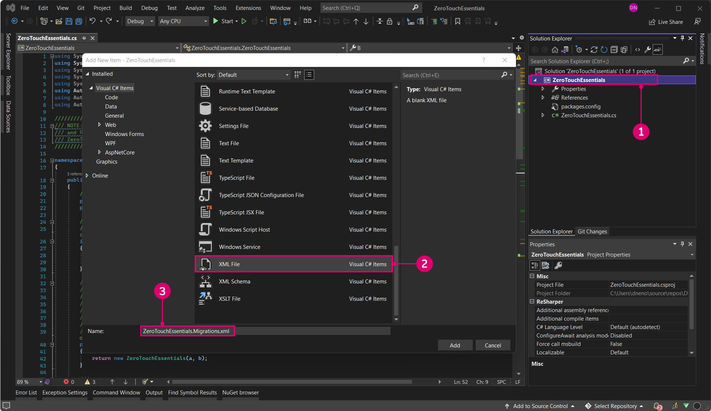

# Weitere Schritte mit Zero-Touch

Wenn wir wissen, wie wir ein Zero-Touch-Projekt erstellen, können wir uns die Details zum Erstellen eines Blocks anhand des Beispiels ZeroTouchEssentials im Dynamo-GitHub genauer ansehen.


> Viele der Standardblöcke von Dynamo sind im Wesentlichen Zero-Touch-Blöcke, wie die meisten der oben genannten Mathematik-, Farb- und DateTime-Blöcke.

Laden Sie zunächst hier das Projekt ZeroTouchEssentials herunter: [https://github.com/DynamoDS/ZeroTouchEssentials](https://github.com/DynamoDS/ZeroTouchEssentials)

Öffnen Sie in Visual Studio die Projektmappendatei `ZeroTouchEssentials.sln`, und erstellen Sie die Projektmappe.


> Die Datei `ZeroTouchEssentials.cs` enthält alle Methoden, die wir in Dynamo importieren.

Öffnen Sie Dynamo, und importieren Sie die Datei `ZeroTouchEssentials.dll`, um die Blöcke abzurufen, die in den folgenden Beispielen referenziert werden.

Die Codebeispiele werden aus [ZeroTouchEssentials.cs](https://github.com/DynamoDS/ZeroTouchEssentials/blob/master/ZeroTouchEssentials/ZeroTouchEssentials.cs) abgerufen und entsprechen im Allgemeinen dieser Datei. Die XML-Dokumentation wurde entfernt, um sie kurz zu halten, und bei jedem Codebeispiel wird der Block in der Abbildung darüber erstellt.

### Vorgegebene Eingabewerte <a href="#default-input-values" id="default-input-values"></a>

Dynamo unterstützt die Definition von Vorgabewerten für Eingabeanschlüsse auf einem Block. Diese Vorgabewerte werden für den Block bereitgestellt, wenn die Anschlüsse keine Verbindungen haben. Vorgaben werden mithilfe des C#-Mechanismus zum Angeben optionaler Argumente im [C#-Programmierhandbuch](https://msdn.microsoft.com/de-de/library/dd264739.aspx) ausgedrückt. Die Vorgaben werden wie folgt angegeben:

* Stellen Sie die Methodenparameter auf einen Vorgabewert ein: `inputNumber = 2.0`

```
namespace ZeroTouchEssentials
{
    public class ZeroTouchEssentials
    {
        // Set the method parameter to a default value
        public static double MultiplyByTwo(double inputNumber = 2.0) 
        {
            return inputNumber * 2.0;
        }
    }
}
```


> 1. Der Vorgabewert wird angezeigt, wenn Sie den Mauszeiger über den Eingabeanschluss des Blocks bewegen.

### Zurückgeben mehrerer Werte <a href="#returning-multiple-values" id="returning-multiple-values"></a>

Das Zurückgeben mehrerer Werte ist etwas komplexer als die Erstellung mehrerer Eingaben, daher müssen sie mithilfe eines Wörterbuchs zurückgegeben werden. Die Einträge im Wörterbuch werden auf der Ausgabeseite des Blocks zu Anschlüssen. Mehrere Rückgabe-Anschlüsse werden auf folgende Weise erstellt:

* Fügen Sie `using System.Collections.Generic;` hinzu, um `Dictionary<>` zu verwenden.
* Fügen Sie `using Autodesk.DesignScript.Runtime;` hinzu, um das Attribut `MultiReturn` zu verwenden. Dieses referenziert DynamoServices.dll aus dem DynamoServices-NuGet-Paket.
* Fügen Sie der Methode das Attribut `[MultiReturn(new[] { "string1", "string2", ... more strings here })]` hinzu. Die Zeichenfolgen verweisen auf Schlüssel im Wörterbuch und werden zu den Namen der Ausgabeanschlüsse.
* Geben Sie ein `Dictionary<>` mit Schlüsseln aus der Funktion zurück, die den Parameternamen im Attribut entsprechen: `return new Dictionary<string, object>`.

```
using System.Collections.Generic;
using Autodesk.DesignScript.Runtime;

namespace ZeroTouchEssentials
{
    public class ZeroTouchEssentials
    {
        [MultiReturn(new[] { "add", "mult" })]
        public static Dictionary<string, object> ReturnMultiExample(double a, double b)
        {
            return new Dictionary<string, object>

                { "add", (a + b) },
                { "mult", (a * b) }
            };
        }
    }
}
```

> Weitere Informationen finden Sie in diesem Codebeispiel in [ZeroTouchEssentials.cs](https://github.com/DynamoDS/ZeroTouchEssentials/blob/9917fd8159afc9e7bdb2944c960155a496e0b2dc/ZeroTouchEssentials/ZeroTouchEssentials.cs#L70).

Ein Block, der mehrere Ausgaben zurückgibt.


> 1. Beachten Sie, dass nun zwei Ausgabeanschlüsse vorhanden sind, die entsprechend den Zeichenfolgen benannt sind, die wir für die Wörterbuchschlüssel eingegeben haben.

### Dokumentation, QuickInfos und Suche <a href="#documentation-tooltips-and-search" id="documentation-tooltips-and-search"></a>

Es wird empfohlen, Dynamo-Blöcken Dokumentation hinzuzufügen, die die Funktion, Eingaben, Ausgaben, Suchbegriffe usw. des Blocks beschreibt. Dies erfolgt über XML-Dokumentations-Tags. XML-Dokumentation wird wie folgt erstellt:

* Jeder Kommentartext, dem drei Schrägstriche vorangestellt sind, wird als Dokumentation betrachtet.
  * Beispiel: `/// Documentation text and XML goes here`
* Erstellen Sie nach den drei Schrägstrichen XML-Tags über Methoden, die Dynamo beim Importieren der DLL-Datei liest.
  * Beispiel: `/// <summary>...</summary>`
* Aktivieren Sie die XML-Dokumentation in Visual Studio, indem Sie `Project > [Project] Properties > Build > Output` auswählen und `Documentation file` aktivieren.


> 1. Visual Studio generiert eine XML-Datei am angegebenen Speicherort.

Folgende Tag-Typen stehen zur Verfügung:

* `/// <summary>...</summary>` ist die Hauptdokumentation für Ihren Block und wird als QuickInfo über dem Block in der linken Suchleiste angezeigt.
* `/// <param name="inputName">...</param>` erstellt Dokumentation für bestimmte Eingabeparameter.
* `/// <returns>...</returns>` erstellt Dokumentation für einen Ausgabeparameter.
* `/// <returns name = "outputName">...</returns>` erstellt Dokumentation für mehrere Ausgabeparameter.
* `/// <search>...</search>` gleicht Ihren Block mit Suchergebnissen basierend auf einer durch Kommas getrennten Liste ab. Wenn wir beispielsweise einen Block erstellen, der ein Netz unterteilt, möchten wir möglicherweise Tags wie Netz, Unterteilung und Catmull-Clark hinzufügen.

Im Folgenden sehen Sie einen Beispielblock mit Eingabe- und Ausgabebeschreibungen sowie eine Zusammenfassung, die in der Bibliothek angezeigt wird.

```
using Autodesk.DesignScript.Geometry;

namespace ZeroTouchEssentials
{
    public class ZeroTouchEssentials
    {
        /// <summary>
        /// This method demonstrates how to use a native geometry object from Dynamo
        /// in a custom method
        /// </summary>
        /// <param name="curve">Input Curve. This can be of any type deriving from Curve, such as NurbsCurve, Arc, Circle, etc</param>
        /// <returns>The twice the length of the Curve </returns>
        /// <search>example,curve</search>
        public static double DoubleLength(Curve curve)
        {
            return curve.Length * 2.0;
        }
    }
}
```

> Weitere Informationen finden Sie in diesem Codebeispiel in [ZeroTouchEssentials.cs](https://github.com/DynamoDS/ZeroTouchEssentials/blob/9917fd8159afc9e7bdb2944c960155a496e0b2dc/ZeroTouchEssentials/ZeroTouchEssentials.cs#L80).

Beachten Sie, dass der Code für diesen Beispielblock Folgendes enthält:

> 1. Eine Blockzusammenfassung
> 2. Eine Eingabebeschreibung
> 3. Eine Ausgabebeschreibung

#### Optimale Verfahren für Dynamo-Blockbeschreibungen 

Blockbeschreibungen erläutern kurz die Funktion und die Ausgabe eines Blocks. In Dynamo werden sie an zwei Stellen angezeigt:

- In der QuickInfo des Blocks
- Im Dokumentationsbrowser


Befolgen Sie diese Richtlinien, um beim Schreiben oder Aktualisieren von Blockbeschreibungen Konsistenz zu gewährleisten und Zeit zu sparen.

##### Überblick

Beschreibungen sollten aus ein bis zwei Sätzen bestehen. Wenn Sie weitere Informationen benötigen, fügen Sie diese im Dokumentationsbrowser unter Im Detail ein.

Groß- und Kleinschreibung (Großschreibung des ersten Wortes eines Satzes und von Eigennamen). Kein Punkt am Ende.

Die Sprache sollte so klar und einfach wie möglich sein. Definieren Sie Akronyme bei der ersten Erwähnung, es sei denn, sie sind auch unter Laien allgemein bekannt.

Legen Sie immer Wert auf Klarheit, auch wenn das bedeutet, von diesen Richtlinien abzuweichen.

##### Richtlinien

| So sollten Sie vorgehen      | So sollten Sie nicht vorgehen |
| ----------- | ----------- |
| Beginnen Sie die Beschreibung mit einem Verb in der dritten Person. <ul><li>Beispiel: *Ermittelt*, ob sich ein Geometrieobjekt mit einem anderen schneidet.</li></ul>      | Beginnen Sie nicht mit einem Verb in der zweiten Person oder mit einem Substantiv. <ul><li>Beispiel: *Ermitteln*, ob sich ein Geometrieobjekt mit einem anderen schneidet</li></ul>       |
| Verwenden Sie "Gibt zurück" oder "Erstellt" bzw. ein anderes beschreibendes Verb anstelle von "Holt". <ul><li>Beispiel: *Gibt eine NURBS-Darstellung einer Fläche zurück.*</li></ul>   | Verwenden Sie nicht "Holen" oder "Holt". Dieses Verb ist wenig spezifisch und kann sehr unterschiedlich übersetzt werden. <ul><li>Beispiel: *Holt* eine NURBS-Darstellung der Fläche.</li></ul>        |
| Wenn Sie sich auf Eingaben beziehen, verwenden Sie "angegeben" oder "eingegeben" anstelle von "festgelegt" oder anderen Begriffen. Lassen Sie "angegeben" oder "eingegeben" nach Möglichkeit weg, um die Beschreibung zu vereinfachen und die Wortzahl zu reduzieren. <ul><li>Beispiel: Löscht die *angegebene* Datei.</li><li>Beispiel: Projiziert eine Kurve entlang der *angegebenen* Projektionsrichtung auf die *angegebene* Basisgeometrie.</li></ul>Sie können "festgelegt" verwenden, wenn Sie sich nicht direkt auf eine Eingabe beziehen. <ul><li>Beispiel: Schreibt Textinhalte in eine Datei, die durch den angegebenen Pfad *festgelegt* wird.</li></ul>       | Um die Konsistenz zu gewährleisten, sollten Sie bei Eingaben weder "festgelegt" noch einen anderen Begriff außer "angegeben" oder "eingegeben" verwenden. Mischen Sie "angegeben" und "eingegeben" nicht in derselben Beschreibung, es sei denn, dies ist aus Gründen der Übersichtlichkeit erforderlich. <ul><li>Beispiel: Löscht die *festgelegte* Datei.</li><li>Beispiel: Projiziert eine *eingegebene* Kurve entlang einer *angegebenen* Projektionsrichtung auf eine *festgelegte* Basisgeometrie.</li></ul>      |
| Verwenden Sie "ein" oder "eine", wenn Sie sich zum ersten Mal auf eine Eingabe beziehen. Verwenden Sie aus Gründen der Übersichtlichkeit ggf. "der/die/das ein-/angegebene" anstelle von "ein" oder "eine".<ul><li>Beispiel: Sweept *eine* Kurve entlang der Pfadkurve.</li></ul>      | Verwenden Sie nicht "dies(e/r)", wenn Sie sich zum ersten Mal auf eine Eingabe beziehen. <ul><li>Beispiel: Sweept *diese* Kurve entlang der Pfadkurve.      |
| Wenn Sie sich zum ersten Mal auf eine Ausgabe oder ein anderes Substantiv beziehen, das das Ziel der Blockoperation ist, verwenden Sie "ein" oder "eine". Verwenden Sie "der/die/das" nur, wenn Sie den Artikel zusammen mit "eingegeben" oder "angegeben" verwenden. <ul><li>Beispiel: Kopiert *eine* Datei.</li><li>Beispiel: Kopiert *die angegebene* Datei.</li></ul>      | Wenn Sie sich zum ersten Mal auf eine Ausgabe oder ein anderes Substantiv beziehen, das das Ziel der Blockoperation ist, verwenden Sie nicht "der/die/das" allein. <ul><li>Beispiel: Kopiert *die* Datei.</li></ul>      |
| Schreiben Sie das erste Wort eines Satzes und alle Eigennamen, Substantive und Wörter, die im Allgemeinen groß geschrieben werden, groß. <ul><li>Beispiel: Gibt den Schnittpunkt zweier *Begrenzungsrahmen* zurück.</li></ul>      | Schreiben Sie gängige Geometrieobjekte und Konzepte nur groß, wenn dies aus Gründen der Übersichtlichkeit erforderlich ist. <ul><li>Beispiel: Skaliert ungleichmäßig um die angegebene *Ebene*.      |
| Schreiben Sie Boolesch groß. Schreiben Sie True und False groß, wenn Sie sich auf die Ausgabe von Booleschen Werten beziehen. <ul><li>Beispiel: Gibt *True* zurück, wenn die beiden Werte unterschiedlich sind.</li><li>Beispiel: Wandelt eine Zeichenfolge basierend auf einem *Booleschen* Parameter in Groß- oder Kleinbuchstaben um.      | Boolesche Werte dürfen nicht klein geschrieben werden. Schreiben Sie True und False nicht klein, wenn Sie sich auf die Ausgabe von Booleschen Werten beziehen. <ul><li>Beispiel: Gibt *true* zurück, wenn die beiden Werte unterschiedlich sind.</li><li>Beispiel: Wandelt eine Zeichenfolge basierend auf einem *booleschen* Parameter in Groß- oder Kleinbuchstaben um.</li></ul>

#### Warnungen und Fehler in Dynamo-Blöcken

Blockwarnungen und -fehler machen den Benutzer auf ein Problem mit dem Diagramm aufmerksam. Sie informieren den Benutzer über Probleme, die die normale Ausführung des Diagramms beeinträchtigen, indem ein Symbol und ein erweiterter Text-Beschriftungsblock über dem Block angezeigt werden. Blockfehler und -warnungen können unterschiedliche Schweregrade aufweisen: Einige Diagramme können mit Warnungen dennoch ausgeführt werden, während bei anderen die erwarteten Ergebnisse blockiert werden. In allen Fällen sind Blockfehler und -warnungen wichtige Werkzeuge, um den Benutzer über Probleme mit dem Diagramm auf dem Laufenden zu halten.

Richtlinien zur Gewährleistung der Konsistenz und zur Zeitersparnis beim Schreiben oder Aktualisieren von Blockwarn- und -fehlermeldungen finden Sie auf der Wiki-Seite [Inhaltsmuster: Blockwarnungen und -fehler](https://github.com/DynamoDS/Dynamo/wiki/Content-Pattern:-Node-Warnings-and-Errors).

### Objekte <a href="#objects" id="objects"></a>

Dynamo verfügt nicht über das Schlüsselwort `new`, sodass Objekte unter Verwendung statischer Konstruktionsmethoden erstellt werden müssen. Objekte werden wie folgt konstruiert:

* Legen Sie den Konstruktor als intern (`internal ZeroTouchEssentials()`) fest, sofern nicht anders erforderlich.
* Konstruieren Sie das Objekt mit einer statischen Methode wie `public static ZeroTouchEssentials ByTwoDoubles(a, b)`.

> Anmerkung: Dynamo verwendet das Präfix Von, um anzugeben, dass eine statische Methode ein Konstruktor ist. Diese Option ist zwar optional, doch die Verwendung von Von hilft Ihnen dabei, die Bibliothek besser in den vorhandenen Dynamo-Stil einzupassen.

```
namespace ZeroTouchEssentials
{
    public class ZeroTouchEssentials
    {
        private double _a;
        private double _b;

        // Make the constructor internal
        internal ZeroTouchEssentials(double a, double b)
        {
            _a = a;
            _b = b;
        }

        // The static method that Dynamo will convert into a Create node
        public static ZeroTouchEssentials ByTwoDoubles(double a, double b)
        {
            return new ZeroTouchEssentials(a, b);
        }
    }
}
```

> Weitere Informationen finden Sie in diesem Codebeispiel in [ZeroTouchEssentials.cs](https://github.com/DynamoDS/ZeroTouchEssentials/blob/9917fd8159afc9e7bdb2944c960155a496e0b2dc/ZeroTouchEssentials/ZeroTouchEssentials.cs#L26).

Nachdem die DLL-Datei ZeroTouchEssentials importiert wurde, befindet sich ein ZeroTouchEssentials-Block in der Bibliothek. Dieses Objekt kann mithilfe des Blocks `ByTwoDoubles` erstellt werden.


### Verwenden von Dynamo-Geometrietypen <a href="#using-dynamo-geometry-types" id="using-dynamo-geometry-types"></a>

Dynamo-Bibliotheken können native Dynamo-Geometrietypen als Eingaben verwenden und neue Geometrie als Ausgaben erstellen. Geometrietypen werden wie folgt erstellt:

* Referenzieren Sie ProtoGeometry.dll im Projekt, indem Sie `using Autodesk.DesignScript.Geometry;` oben in der C#-Datei einfügen und das ZeroTouchLibrary-NuGet-Paket zum Projekt hinzufügen.
* **Wichtig:** Verwalten Sie die Geometrieressourcen, die nicht von Ihren Funktionen zurückgegeben werden, wie im Abschnitt **Verwerfen/Verwenden von Anweisungen** weiter unten beschrieben.

> Anmerkung: Dynamo-Geometrieobjekte werden wie alle anderen übergebenen Objekte für Funktionen verwendet.

```
using Autodesk.DesignScript.Geometry;

namespace ZeroTouchEssentials
{
    public class ZeroTouchEssentials
    {
        // "Autodesk.DesignScript.Geometry.Curve" is specifying the type of geometry input, 
        // just as you would specify a double, string, or integer 
        public static double DoubleLength(Autodesk.DesignScript.Geometry.Curve curve)
        {
            return curve.Length * 2.0;
        }
    }
}
```

> Weitere Informationen finden Sie in diesem Codebeispiel in [ZeroTouchEssentials.cs](https://github.com/DynamoDS/ZeroTouchEssentials/blob/9917fd8159afc9e7bdb2944c960155a496e0b2dc/ZeroTouchEssentials/ZeroTouchEssentials.cs#L86).

Ein Block, der die Länge einer Kurve abruft und diese verdoppelt.


> 1. Dieser Block akzeptiert einen Kurvengeometrietyp als Eingabe.

### Verwerfen/Verwenden von Anweisungen <a href="#disposeusing-statements" id="disposeusing-statements"></a>

Geometrieressourcen, die nicht aus Funktionen zurückgegeben werden, müssen manuell verwaltet werden, es sei denn, Sie verwenden die Dynamo-Version 2.5 oder höher. In Dynamo 2.5 und späteren Versionen werden Geometrieressourcen intern vom System verwaltet. Sie müssen Geometrie jedoch möglicherweise weiterhin manuell entfernen, wenn es sich um einen komplexen Anwendungsfall handelt oder wenn Sie zu einem festgelegten Zeitpunkt Speicherplatz reduzieren müssen. Die Dynamo-Engine verarbeitet alle Geometrieressourcen, die aus Funktionen zurückgegeben werden. Nicht zurückgegebene Geometrieressourcen können wie folgt manuell verarbeitet werden:

*   Mit einer using-Anweisung:

    ```
    using (Point p1 = Point.ByCoordinates(0, 0, 0))
    {
      using (Point p2 = Point.ByCoordinates(10, 10, 0))
      {
          return Line.ByStartPointEndPoint(p1, p2);
      }
    }
    ```

    > Die using-Anweisung ist [hier](https://msdn.microsoft.com/de-de/library/yh598w02.aspx) dokumentiert.
    >
    > Weitere Informationen zu den neuen Stabilitätsfunktionen ab Dynamo 2.5 finden Sie im Artikel zu [Verbesserungen der Stabilität der Dynamo-Geometrie](https://forum.dynamobim.com/t/dynamo-geometry-stability-improvements-request-for-feedback/39297).
*   Mit manuellen Dispose-Aufrufen:

    ```
    Point p1 = Point.ByCoordinates(0, 0, 0);
    Point p2 = Point.ByCoordinates(10, 10, 0);
    Line l = Line.ByStartPointEndPoint(p1, p2);
    p1.Dispose();
    p2.Dispose();
    return l;
    ```

### Migrationen <a href="#migrations" id="migrations"></a>

Beim Publizieren einer neueren Version einer Bibliothek können sich Blocknamen ändern. Namensänderungen können in einer Migrationsdatei angegeben werden, sodass in früheren Versionen einer Bibliothek erstellte Diagramme auch nach einer Aktualisierung ordnungsgemäß funktionieren. Migrationen werden wie folgt durchgeführt:

* Erstellen Sie eine `.xml`-Datei im selben Ordner wie die `.dll`-Datei mit folgendem Format: "BaseDLLName".Migrations.xml.
* Erstellen Sie in der `.xml`-Datei ein einzelnes `<migrations>...</migrations>`-Element.
* Erstellen Sie im migrations-Element für jede Namensänderung `<priorNameHint>...</priorNameHint>`-Elemente.
* Geben Sie für jede Namensänderung ein `<oldName>...</oldName>`- und ein `<newName>...</newName>`-Element an.



> 1. Klicken Sie mit der rechten Maustaste, und wählen Sie `Add > New Item` aus.
> 2. Wählen Sie `XML File`.
> 3. Für dieses Projekt geben wir der Migrationsdatei den Namen `ZeroTouchEssentials.Migrations.xml`.

Dieser Beispielcode weist Dynamo an, dass alle Blöcke mit dem Namen `GetClosestPoint` jetzt den Namen `ClosestPointTo` erhalten.

```
<?xml version="1.0"?>
<migrations>
  <priorNameHint>
    <oldName>Autodesk.DesignScript.Geometry.Geometry.GetClosestPoint</oldName>
    <newName>Autodesk.DesignScript.Geometry.Geometry.ClosestPointTo</newName>
  </priorNameHint>
</migrations>
```

> Weitere Informationen finden Sie in diesem Codebeispiel in [ProtoGeometry.Migrations.xml](https://github.com/DynamoDS/Dynamo/blob/master/extern/ProtoGeometry/ProtoGeometry.Migrations.xml).

### Generika <a href="#generics" id="generics"></a>

Zero-Touch unterstützt derzeit keine Generika. Sie können verwendet werden, jedoch nicht in dem Code, der direkt importiert wird, wenn der Typ nicht festgelegt ist. Methoden, Eigenschaften oder Klassen, die generisch sind und nicht über einen festgelegten Typ verfügen, können nicht verfügbar gemacht werden.

Im folgenden Beispiel wird ein Zero-Touch-Block des Typs `T` nicht importiert. Wenn die restliche Bibliothek in Dynamo importiert wird, fehlen Typausnahmen.

```
public class SomeGenericClass<T>
{
    public SomeGenericClass()
    {
        Console.WriteLine(typeof(T).ToString());
    }  
}
```

Wenn Sie in diesem Beispiel einen generischen Typ mit dem festgelegtem Typ verwenden, wird dieser in Dynamo importiert.

```
public class SomeWrapper
{
    public object wrapped;
    public SomeWrapper(SomeGenericClass<double> someConstrainedType)
    {
        Console.WriteLine(this.wrapped.GetType().ToString());
    }
}
```
